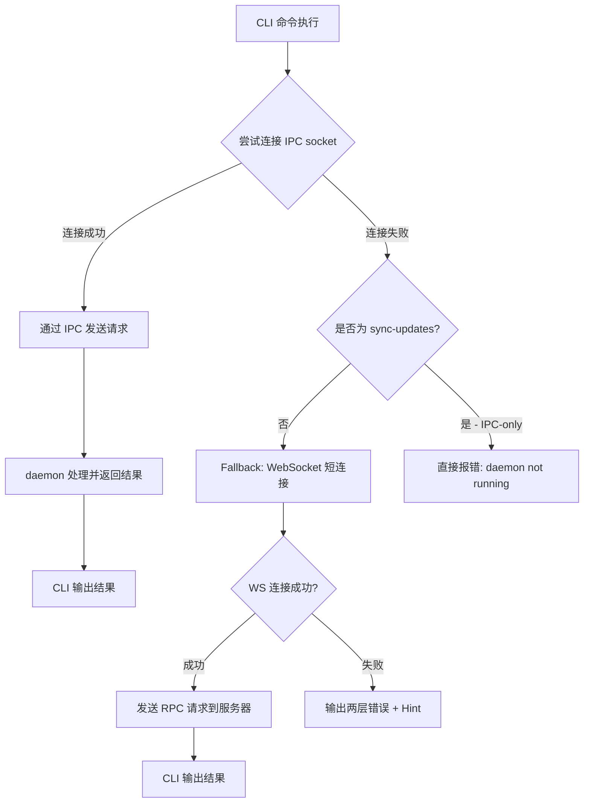

# IPC 协议规范

## 概述

| 属性 | 值 | 参考 |
|------|-----|------|
| 协议 | Unix Socket + JSON-RPC 2.0 | D-030 |
| Socket 路径 | `~/.xyncra/{user_id}/{device_id}/xyncra.sock` | D-030 |
| 分隔符 | 换行符（`\n`） | D-030 |
| 消息上限 | 1MB（`bufio.Scanner` buffer 限制） | D-030 |
| 连接超时 | 5s | D-032 |
| Socket 权限 | `0600`（仅所有者可读写） | D-030 |
| 编码 | UTF-8 JSON | -- |

**约束**：
- 仅限本地通信，不支持远程 IPC
- listen 进程退出时需清理 socket 文件
- 路径天然编码 `(user_id, device_id)` 身份，自动路由到正确的 listen 实例

---

## 消息格式

### 请求

```json
{
  "jsonrpc": "2.0",
  "id": "<UUID>",
  "method": "<method_name>",
  "params": {...}
}
```

| 字段 | 类型 | 说明 |
|------|------|------|
| `jsonrpc` | string | 固定 `"2.0"` |
| `id` | string | 请求唯一标识（UUID），用于匹配响应 |
| `method` | string | IPC 方法名（见方法注册表） |
| `params` | object | 方法参数（可选） |

### 成功响应

```json
{
  "jsonrpc": "2.0",
  "id": "<UUID>",
  "result": {...}
}
```

| 字段 | 类型 | 说明 |
|------|------|------|
| `jsonrpc` | string | 固定 `"2.0"` |
| `id` | string | 与请求 `id` 相同 |
| `result` | object | 方法返回结果 |

### 错误响应

```json
{
  "jsonrpc": "2.0",
  "id": "<UUID>",
  "error": {
    "code": -32602,
    "message": "invalid params: missing required field 'conversation_id'"
  }
}
```

| 字段 | 类型 | 说明 |
|------|------|------|
| `jsonrpc` | string | 固定 `"2.0"` |
| `id` | string | 与请求 `id` 相同 |
| `error.code` | int | 错误码（见错误码表） |
| `error.message` | string | 错误描述 |

---

## IPC 方法注册

从 `listen.go` 的 `registerIPCHandlers` 提取的方法列表：

| Method | Params | Result | 对应 CLI 命令 |
|--------|--------|--------|--------------|
| `send_message` | `{conversation_id: string, content: string, reply_to?: uint32}` | `{message_id: uint32, conversation_id: uint, client_message_id: string, duplicate: bool}` | `send` |
| `create_conversation` | `{user_id2: string, title?: string}` | `{id: uint, peer_id: string, title: string, duplicate: bool}` | `create-conversation` |
| `delete_conversation` | `{conversation_id: string}` | `void` | `delete-conversation` |
| `restore_conversation` | `{conversation_id: string}` | `void` | `restore-conversation` |
| `delete_message` | `{message_id: string}` | `void` | `delete-message` |
| `mark_as_read` | `{conversation_id: string, message_id: uint32}` | `void` | `mark-as-read` |
| `sync_updates` | `nil` | `{status: "ok"}` | `sync-updates` |
| `agent_resume` | `{conversation_id: string, checkpoint_id: string, interrupt_id?: string, answer: string, agent_id: string}` | `{status: "queued"}` | `agent-resume` |

**错误处理链**：
1. 参数错误 -> `-32602` `invalid params: %v`
2. 客户端错误（`ClientError`）-> `ClientError.Code` + `ClientError.Message`（D-027）
3. 服务端错误 -> `-300` + error message

---

## 命令分类（D-032）

### IPC+WS fallback

优先通过 IPC 连接 daemon，失败时自动 fallback 到 WebSocket 短连接。

| 命令 | IPC method | 超时 |
|------|-----------|------|
| `send` | `send_message` | 15s |
| `create-conversation` | `create_conversation` | 15s |
| `delete-conversation` | `delete_conversation` | 15s |
| `restore-conversation` | `restore_conversation` | 15s |
| `delete-message` | `delete_message` | 15s |
| `mark-as-read` | `mark_as_read` | 15s |

### IPC-only（无 fallback，D-036）

仅通过 IPC 触发 daemon，无 WebSocket fallback。daemon 未运行时直接报错。

| 命令 | IPC method | 超时 | 原因 |
|------|-----------|------|------|
| `sync-updates` | `sync_updates` | 30s | 避免与 daemon 同步状态竞争 SQLite 写入（D-036） |
| `agent-resume` | `agent_resume` | 15s | HITL 恢复需要 daemon 内存中的 checkpoint/interrupt 数据（D-114） |

**错误信息**：
```
Error: daemon not running.
Hint: Start with 'xyncra-client listen --user-id <user> --device-id <device>'
```

#### `agent_resume` 方法详情（D-085, D-114）

由 `agent-resume` CLI 命令调用，用于恢复被 HITL 中断的 Agent 执行。

**请求**：

```json
{
  "jsonrpc": "2.0",
  "id": "<UUID>",
  "method": "agent_resume",
  "params": {
    "conversation_id": "<conv-uuid>",
    "checkpoint_id": "<checkpoint-uuid>",
    "interrupt_id": "<interrupt-uuid>",
    "answer": "用户回答内容",
    "agent_id": "agent/hitl-bot"
  }
}
```

| 参数 | 类型 | 必需 | 说明 |
|------|------|------|------|
| `conversation_id` | string | 是 | 会话 ID |
| `checkpoint_id` | string | 是 | Agent 执行检查点 ID（来自 `[hitl]` 输出，通过 `get_conversation` RPC 获取，D-125） |
| `interrupt_id` | string | 否 | 中断 ID（来自 `[hitl]` 输出，未提供时 daemon 从内存查找） |
| `answer` | string | 是 | 对 Agent 问题的回答 |
| `agent_id` | string | 是 | Agent ID（如 `agent/hitl-bot`） |

**成功响应**：

```json
{
  "jsonrpc": "2.0",
  "id": "<UUID>",
  "result": {
    "status": "queued"
  }
}
```

`status: "queued"` 表示 resume 请求已入队，daemon 将通过 WebSocket 发送给服务器，Agent 将继续执行。

**错误响应**：

```json
{
  "jsonrpc": "2.0",
  "id": "<UUID>",
  "error": {
    "code": -32602,
    "message": "invalid params: missing required field 'checkpoint_id'"
  }
}
```

**约束**：

- checkpoint 有 24 小时 TTL，过期后返回错误
- interrupt 存储在 daemon 内存中，daemon 重启后丢失
- 此方法为 IPC-only（D-114），不支持 WebSocket fallback

### 本地 DB（不需要 IPC）

直接读取本地 SQLite，不需要 daemon 运行（D-035）。

| 命令 | 说明 |
|------|------|
| `list-conversations` | 列出本地会话 |
| `get-conversation` | 查看会话详情 + 未读计数 |
| `get-messages` | 列出消息 |
| `search-messages` | 搜索消息 |
| `draft save` | 保存草稿 |
| `draft get` | 获取草稿 |
| `draft delete` | 删除草稿 |
| `logs tail` | 查看最近日志 |
| `logs search` | 搜索日志 |
| `logs stats` | 日志统计 |
| `logs export` | 导出日志 |
| `logs cleanup` | 清理旧日志 |

---

## Fallback 策略（D-032）



**Fallback 步骤**：

1. CLI 尝试连接 IPC socket（`~/.xyncra/{uid}/{did}/xyncra.sock`）
2. 如果连接成功，通过 IPC 发送 JSON-RPC 请求
3. 如果 IPC 失败（socket 不存在、连接拒绝、超时），自动 fallback 到 WebSocket
4. WebSocket fallback：建立短连接，直接发送 RPC 请求到服务器
5. 两个模式都失败：输出两层错误信息 + Hint

### 双模式失败错误格式

```
Error: Cannot send message.
  Cause 1: <ipc_error>
  Cause 2: <ws_error>
Hint: Start the daemon first: xyncra-client listen --user-id <user> --device-id <device>
```

**错误分层**：
- `Cause 1`：IPC 层错误（socket 不存在、连接拒绝、daemon 返回错误）
- `Cause 2`：WebSocket 层错误（网络不可达、服务器未启动、RPC 超时）
- `Hint`：建议用户启动 daemon

---

## 错误码

### JSON-RPC 标准错误码

| Code | 说明 |
|------|------|
| `-32700` | Parse error（JSON 解析失败） |
| `-32600` | Invalid Request（请求格式不合法） |
| `-32601` | Method not found（方法未注册） |
| `-32602` | Invalid params（参数错误） |
| `-32000` | Server error（内部错误） |

### 服务端错误码（D-017）

| Code 范围 | 说明 |
|-----------|------|
| `-100` ~ `-199` | 客户端错误（validation、not_found、duplicate） |
| `-200` ~ `-299` | 权限错误（permission_denied、forbidden） |
| `-300` ~ `-399` | 服务端错误（internal、unavailable） |

通用服务端错误码：`-300`（Generic server error）

### 客户端扩展错误码（D-027）

| Code | 类型 | 说明 |
|------|------|------|
| `-400` | `ConnectionError` | WebSocket 连接失败（网络不可达、服务器未启动等） |
| `-401` | `TimeoutError` | RPC 调用超时（请求发出但在超时时间内未收到响应） |
| `-402` | `SyncError` | 增量同步失败（sync_updates 拉取异常、seq 间隙无法修复等） |

客户端错误码仅在客户端包（`pkg/client`）中使用，服务器不会返回这些码。`ClientError` 支持 `Unwrap()` 以保留原始错误链。

### CLI 退出码（D-042）

| Code | 说明 |
|------|------|
| `0` | 成功 |
| `1` | 通用错误（参数错误、网络错误、数据库错误等） |
| `2` | 前置条件不满足（守护进程未运行、锁冲突等） |
| `3` | 超时退出（kill 命令，D-039） |

---

## 限制

| 限制项 | 值 | 说明 |
|--------|-----|------|
| 消息大小 | 1MB | `bufio.Scanner` buffer 限制（D-030） |
| 连接超时 | 5s | IPC socket 连接超时 |
| 处理方式 | 单线程 | daemon 侧单线程处理 IPC 请求 |
| 作用域 | 仅本地 | Unix Socket 不支持远程通信 |
| 并发 | 单 daemon | 同一 `(user_id, device_id)` 只能运行一个 listen 实例（D-031） |

---

## 调试指南

使用 `socat` 直接测试 IPC：

```bash
# 发送消息
echo '{"jsonrpc":"2.0","id":"test-1","method":"send_message","params":{"conversation_id":"1","content":"hello","client_message_id":"uuid-123"}}' | socat - UNIX-CONNECT:~/.xyncra/alice/abc12345/xyncra.sock

# 触发同步
echo '{"jsonrpc":"2.0","id":"test-2","method":"sync_updates","params":null}' | socat - UNIX-CONNECT:~/.xyncra/alice/abc12345/xyncra.sock

# 标记已读
echo '{"jsonrpc":"2.0","id":"test-3","method":"mark_as_read","params":{"conversation_id":"1","message_id":42}}' | socat - UNIX-CONNECT:~/.xyncra/alice/abc12345/xyncra.sock
```

---

## 相关文档

- [系统架构概览](overview.md)
- [SQLite 数据库结构](database.md)
