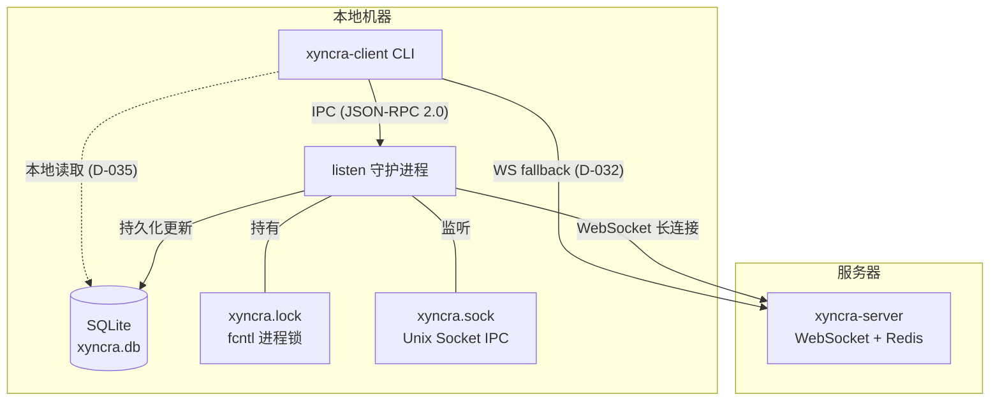
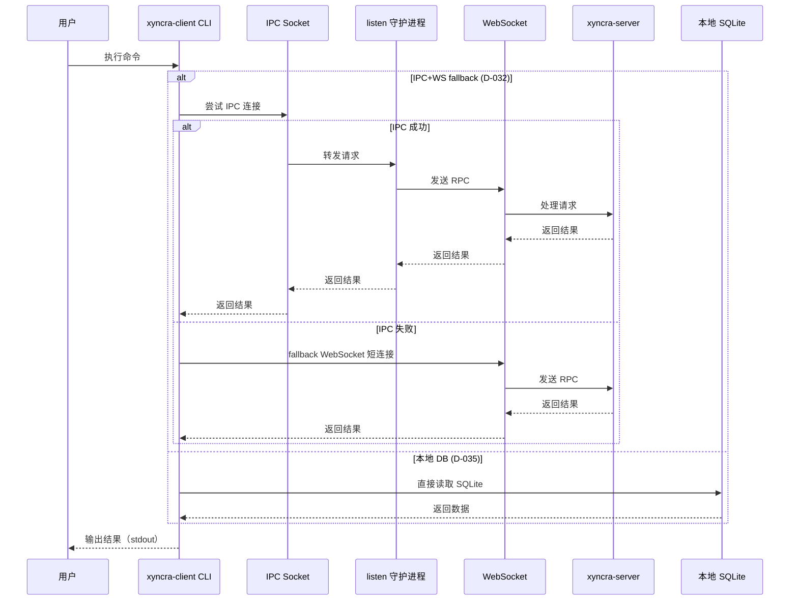
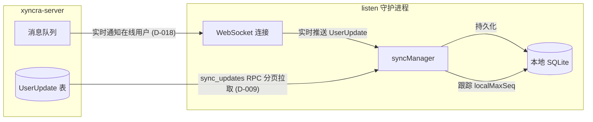

# 系统架构概览

## 系统组件

| 组件 | 说明 |
|------|------|
| **xyncra-server** | 消息服务器（WebSocket + Redis Pub/Sub 多节点路由，D-018） |
| **xyncra-client CLI** | 命令行客户端，提供守护进程模式（listen）和一次性命令 |
| **本地 SQLite** | 客户端数据存储，WAL 模式，自动迁移（AutoMigrate，D-035） |
| **Unix Socket IPC** | CLI 与 daemon 之间的进程间通信（D-030） |



---

## 守护进程模型

### listen 守护进程

`xyncra-client listen` 启动一个长驻进程，职责如下：

1. 获取进程锁（D-031）防止重复启动
2. 打开本地 SQLite 数据库
3. 创建 IPC 服务器（Unix Socket），注册 RPC 方法处理器
4. 启动 XyncraClient，建立 WebSocket 连接到服务器
5. 阻塞等待 SIGINT/SIGTERM 信号

**stderr 输出**（启动 banner）：

```
[xyncra] Starting listener daemon...
[xyncra] Device: <device_id>
[xyncra] Connecting to <server_url>?user_id=<user_id> ...
[xyncra] IPC server listening at <socket_path>
[xyncra] Listening for updates... (Ctrl+C to stop)
```

**stdout 输出**（事件通知）：

```
[new message] seq=<message_id> from=<sender_id> conv=<conversation_id> "<content>"
[delete message] conv=<conversation_id> msg=<message_id>
[mark read] conv=<conversation_id> msg_id=<message_id>
[conversation] id=<conversation_id> title="<title>"
[gap] seq=<seq>
```

**退出码**（D-042）：
- `0` -- 正常退出
- `2` -- 锁冲突（进程已运行）

### 锁机制（D-031）

使用 `github.com/gofrs/flock`（fcntl 文件锁）实现进程互斥。

| 属性 | 值 |
|------|-----|
| 锁类型 | fcntl 文件锁（内核级，进程崩溃自动释放） |
| 锁文件路径 | `~/.xyncra/{user_id}/{device_id}/xyncra.lock` |
| 锁文件权限 | `0600` |
| 锁内容 | JSON：`{PID, started_at, device_id}` |
| Stale lock 检测 | 读取锁文件中的 PID，检查进程是否存活（`signal(0)`） |
| Stale lock 处理 | 进程已死则自动清理锁文件并重试 |

**约束**：
- 锁粒度为 `(user_id, device_id)`，不同组合的 listen 互不影响
- stale lock 检测存在 TOCTOU 竞态（概率极低，可接受）

---

## 数据流

### CLI 命令执行流程



### 三种执行模式（D-032）

| 模式 | 说明 | 使用场景 |
|------|------|----------|
| **IPC+WS fallback** | 优先通过 IPC 连接 daemon，失败时自动 fallback 到 WebSocket 短连接 | 写操作命令（send、create-conversation 等） |
| **IPC-only** | 仅通过 IPC 连接 daemon，无 fallback | sync-updates（D-036，避免与 daemon 同步状态竞争） |
| **本地 DB** | 直接读取本地 SQLite，不需要 daemon | 查询命令（list-conversations、get-messages 等，D-035） |

### 命令分类表

| 命令 | 执行模式 | 说明 |
|------|----------|------|
| `listen` | 守护进程 | 启动 IPC 服务器和 WebSocket 客户端 |
| `send` | IPC+WS fallback | 发送消息到会话 |
| `create-conversation` | IPC+WS fallback | 创建 1-on-1 会话（find-or-create，D-011） |
| `delete-conversation` | IPC+WS fallback | 级联软删除会话及消息（D-013） |
| `restore-conversation` | IPC+WS fallback | 级联恢复会话及消息（D-015） |
| `delete-message` | IPC+WS fallback | 软删除消息（仅发送者，D-014） |
| `mark-as-read` | IPC+WS fallback | 标记已读（MAX 语义，D-012） |
| `sync-updates` | IPC-only | 触发 FullSync（D-036，无 fallback） |
| `list-conversations` | 本地 DB | 列出本地会话（D-035） |
| `get-conversation` | 本地 DB | 查看会话详情 + 未读计数（D-035） |
| `get-messages` | 本地 DB | 列出消息（D-035） |
| `search-messages` | 本地 DB | 搜索消息（D-035） |
| `draft save/get/delete` | 本地 DB | 管理消息草稿（本地） |
| `logs tail/search/stats/export/cleanup` | 本地 DB | 查看和管理日志（D-040） |
| `kill` | OS 进程管理 | 终止守护进程（D-039） |

---

## 同步模型

### 增量同步



**增量同步流程**：

1. 服务器推送 `UserUpdate` 到守护进程的 WebSocket 连接
2. daemon 通过 `syncManager` 将更新持久化到本地 SQLite
3. `localMaxSeq` 跟踪已处理的最大序列号（所有类型共享单一 seq 空间，D-028）
4. 当检测到 seq 间隙时，触发 `FullSync` 填补

**FullSync 流程**：
1. 通过 `sync_updates` RPC 分页拉取 `after_seq` 之后的更新（D-009）
2. 服务器返回 `updates` 数组（seq 连续，服务器补空 D-029）
3. 逐条 `ApplyUpdate` 持久化到本地 SQLite
4. 更新 `localMaxSeq`
5. `has_more=true` 时继续拉取下一页

### 离线恢复

1. WebSocket 断开后自动重连
2. 重连后触发 `FullSync` 填补离线期间的更新间隙
3. 手动触发：`sync-updates` 命令（D-036，IPC-only）

**约束**：
- 离线超过 30 天的客户端需要全量同步（UserUpdate 保留 30 天，D-016）
- 服务器端 `gap` 类型 Update 仅运行时生成，不持久化（D-029）

---

## 日志子系统

### CLI 日志（stderr）

- 启动 banner、事件通知输出到 stderr
- 时间戳格式：`2006-01-02 15:04:05`
- 日志格式：`[timestamp] [LEVEL] message key1=value1 key2=value2`
- `XYNCRA_DEBUG=1` 或 `XYNCRA_DEBUG=true` 启用 debug 日志

### 持久化日志（SQLite）

| 日志类型 | 存储表 | 说明 |
|----------|--------|------|
| RPC 日志 | `rpc_logs` | 所有 RPC 调用的记录（方法、状态码、耗时、关联会话） |
| Notification 日志 | `notification_logs` | 所有推送通知的记录（seq、类型、JSON 负载） |

### 自动清理（D-040）

- 清理间隔：1 小时
- 默认保留：7 天（168h）
- 同时清理 `rpc_logs` 和 `notification_logs`
- 支持 `--type` 参数指定只清理特定表
- 支持 `--dry-run` 预览删除数量

---

## 文件布局

```
~/.xyncra/{user_id}/{device_id}/
├── xyncra.db       # SQLite 数据库（WAL 模式，AutoMigrate）
├── xyncra.lock     # 进程锁文件（fcntl，0600）
├── xyncra.sock     # Unix Socket IPC（0600）
└── logs/           # 日志目录（预留，当前 cliLogger 仅写 stderr）
```

### 文件权限

| 文件/目录 | 权限 | 说明 |
|-----------|------|------|
| `~/.xyncra/{uid}/{did}/` | `0700` | 仅所有者可访问（D-030） |
| `xyncra.lock` | `0600` | 仅所有者可读写 |
| `xyncra.sock` | `0600` | 仅所有者可读写（D-030） |
| `xyncra.db` | 默认 | SQLite 数据库文件 |

---

## 相关文档

- [SQLite 数据库结构](database.md)
- [IPC 协议规范](ipc.md)
