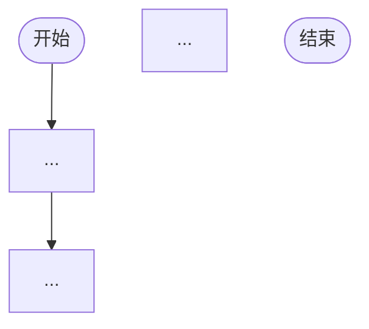

# Xyncra 手动测试用例文档创建指南

使用此 Skill 为 Xyncra 消息系统创建手动端到端测试用例文档。

---

## 核心原则

1. **零代码** — 文档中不允许出现任何编程语言代码（Go、Python 等）。仅允许 shell 命令、`python3 -c`、`docker exec` 和 SQL 查询（通过 `sqlite3` 或 `redis-cli` 执行）。
2. **独立完整** — 每个测试文档必须自包含：包含完整的环境准备、执行步骤、验证和清理流程，不依赖其他测试文档。
3. **双重验证** — 每个测试步骤必须同时提供**数据库直接查询**（sqlite3 / redis-cli / `docker exec` / `python3 -c`）和**客户端命令**两种验证方式。
4. **流程图驱动** — 每个文档必须包含一个完整的 mermaid 流程图，清晰展示从环境准备到清理的完整流程。
5. **可重复执行** — 每次测试前清理数据，确保测试结果不受历史数据影响。

---

## 文档位置

所有手动测试用例文档放在：

```
docs/manual-test-cases/
```

文件命名规则：`TC-{NNN}-{中文描述}.md`

- `TC-000` 保留给完整链路测试（全功能覆盖）
- `TC-001` 起按功能模块编号
- 中文描述简洁明了，如 `TC-001-冒烟测试.md`、`TC-002-消息发送与接收.md`

---

## 文档结构（必须包含的章节）

每个测试用例文档**必须**按以下结构组织：

### 1. 头部元信息

```markdown
# TC-{NNN}: {测试名称}

> **测试编号**: TC-{NNN}
> **测试类型**: {端到端/集成/冒烟/边界}
> **覆盖范围**: {简述覆盖的功能点}
> **环境**: Docker E2E (D-043)
> **最后更新**: YYYY-MM-DD
```

### 2. 概述

- 测试目标（1-3 句话）
- 覆盖的功能决策（引用 D-XXX 编号）

### 3. 环境拓扑

使用 表格 展示：
- 组件关系（Redis、Server、Client）
- 端口映射（D-043: Redis 16379, Server 18080, DB 15）
- 数据流向

### 4. 前置条件

- 构建二进制：`make build`
- 构建镜像：`docker compose -f deploy/docker-compose.e2e.yml build --no-cache`
- 启动 Docker E2E：`docker compose -f deploy/docker-compose.e2e.yml up -d`
- 健康检查（Redis PONG、Server /health）
- 创建测试工作目录：`mktemp -d`
- 特定于本测试的额外准备

### 5. 测试数据字典

| 变量 | 值 | 说明 |
|------|-----|------|
| `$SERVER_URL` | `ws://localhost:18080/ws` | E2E 服务器地址 |
| `$REDIS_ADDR` | `localhost:16379` | E2E Redis |
| 其他变量 | ... | ... |

### 6. 完整流程图（必须）

使用 **mermaid flowchart** 语法。流程图中每个节点代表一个操作步骤，节点内容应包括：
- 操作类型（启动服务器 / 检查数据库 / 运行客户端命令 / 验证数据）
- 关键命令或检查点
- 分支逻辑（成功/失败路径）



流程图节点中应明确标注：
- 🟢 服务器操作（启动/停止/重启）
- 🔵 客户端命令执行
- 🟡 数据库检查（SQLite / Redis / other in docker）
- 🔴 验证点（通过/失败判定）
- ⚪ 清理操作

### 7. 分步执行指南

每个步骤包含：
- **操作命令**：完整的 shell 命令（可复制粘贴执行）
- **预期输出**：命令正常执行时应看到的输出
- **验证方法**：如何确认该步骤成功
  - 数据库直接查询（sqlite3 / redis-cli / `docker exec` / `python3 -c`）
  - 客户端命令验证
- **变量记录**：需要记录的运行时变量（ID、序列号等）

### 8. 数据库验证汇总

分3个子节：
- **Server DB 验证命令速查**：列出所有用于验证的 （sqlite3 / `docker exec` / `python3 -c`） 命令
- **Server Redis 验证命令速查**：列出所有用于验证的 `redis-cli` 命令
- **Client DB Sqlite 验证命令速查**：列出所有用于验证的 (`sqlite3` / `docker exec`) 命令

数据库结构参考：

**服务器 DB 表**（服务器 DB）：
- `conversations` — id, user_id1, user_id2, type, title, last_processed_message_id, last_read_message_id1, last_read_message_id2, deleted_at
- `messages` — id, client_message_id, conversation_id, message_id(uint32), sender_id, content, type, reply_to, status, deleted_at
- `user_updates` — id, user_id, seq(uint32), type, payload, created_at

**Redis Key 模式**（DB 15）：
- `xyncra:conn:info:{connID}` — 连接信息 JSON
- `xyncra:conn:user:{userID}` — 用户连接集合
- `pending:{userID}\x00{deviceID}` — 待补发请求列表
- `agent:idempotent:*` — Agent 幂等性 key（24h TTL）
- `agent:checkpoint:*` — Agent HITL checkpoint
- `agent:lock:*` — Agent 会话级并发锁
- `asynq:{critical}`, `asynq:{default}`, `asynq:{low}` — MQ 队列

**客户端 DB 表**（客户端本地 SQLite，通常位于 `~/.xyncra/` 下）：
- `conversations` — id, user_id1, user_id2, type, title, pinned, muted, avatar_url, description, last_processed_message_id, last_read_message_id1, last_read_message_id2, last_message_at, deleted_at
- `messages` — id, client_message_id, conversation_id, message_id(uint32), sender_id, content, type, reply_to, status, deleted_at
- `user_updates` — id, user_id, seq(uint32), type, payload(blob), created_at
- `sync_states` — key, value, updated_at（客户端同步状态 KV 存储，如 `local_max_seq`、`latest_seq`）
- `drafts` — id, conversation_id, content, created_at, updated_at（每个会话最多一条草稿）
- `retry_tasks` — id, method, params(blob), attempt, max_attempts, next_retry, status, last_error, created_at（RPC 重试队列，指数退避）
- `rpc_logs` — id, type, request_id, method, params(blob), response(blob), status_code, conversation_id, duration, error_msg, created_at
- `notification_logs` — id, seq(uint32), type, payload(blob), created_at（推送通知去重与审计）

### 9. 通过/失败判定标准

以表格形式列出每个阶段/步骤的：
- 判定条件
- 通过标志（✅）
- 失败时的处理方式

### 10. 故障排查指南

| 症状 | 可能原因 | 解决方法 |
|------|---------|---------|

### 11. 环境清理

完整的清理步骤：
- 停止所有 daemon
- 停止 Docker 环境
- 清理临时目录
- 清理 ~/.xyncra 测试数据
- 清理 Redis（可选）

### 12. 真实 LLM 测试配置（.env.test）（如适用）

如果测试涉及 Agent 真实 LLM 交互：
- 引用 `.env.test` 环境变量
- 说明每个变量的用途
- 安全提示（不提交 .env.test）
- 成本控制说明 (D-090)

### 13. 依赖关系说明

| 测试阶段 | 可独立执行 | 依赖 |
|---------|-----------|------|

说明哪些阶段可并行，哪些有严格先后依赖。

### 14. 测试执行记录模板

提供可复制的 Markdown 模板，包含：
- 日期、Git Commit、测试者
- 各阶段通过/失败状态
- 发现的问题
- 最终结论

---

## 约束与规范

### 禁止内容

- ❌ 任何编程语言代码（Go、Python、JavaScript 等）
- ❌ 自动化测试脚本
- ❌ 代码级别的实现细节
- ❌ 内部 API 调用（必须通过 CLI 或数据库工具）

### 允许内容

- ✅ Shell 命令（bash、zsh）
- ✅ SQL 查询（通过 sqlite3 CLI）
- ✅ python3 -c 执行
- ✅ docker exec 执行
- ✅ Redis 命令（通过 redis-cli）
- ✅ curl 命令（HTTP 健康检查）
- ✅ docker compose 命令
- ✅ Mermaid 流程图和图表
- ✅ Markdown 表格和列表

### Shell 命令规范

- 使用变量存储运行时值（如 `$CONV_ID`、`$MSG_ID`）
- 提供完整的命令参数（不省略必需参数）
- 使用 `$E2E_HOME` 引用临时目录
- Docker exec 命令使用完整的服务名（`xyncra-server-e2e`）

### Mermaid 流程图规范

- 使用 `flowchart TD`（从上到下）
- 节点使用方括号 `[]` 或圆括号 `()`
- 子图（subgraph）按阶段分组
- 节点内文字简洁（命令放在正文中详细说明）
- 标注操作类型（服务器/客户端/数据库/验证/清理）

### 端口约定（D-043）

所有测试统一使用 E2E 端口，避免与开发环境冲突：

| 组件 | 宿主机端口 | 容器端口 |
|------|-----------|---------|
| Redis | 16379 | 6379 |
| Server | 18080 | 8080 |
| Redis DB | 15 | 15 |
| [.env.test](../../../.env.test) | 真实LLM配置（可能会被厂商限流）|  |

### 用户 ID 约定

| 用户 | 用途 |
|------|------|
| `alice` | 主测试用户 |
| `bob` | 对端用户 |
| `agent/{id}` | Agent 用户（如 `agent/weather-bot`） |

### 退出码标准（D-042）

- 0 = 成功
- 1 = 通用错误
- 2 = 前置条件不满足
- 3 = 超时退出

---

## 创建新测试用例的工作流程

1. **确定测试范围** — 明确本测试覆盖哪些功能和决策
2. **参考 TC-000** — 查看 `docs/manual-test-cases/TC-000-完整链路测试.md` 了解标准格式
3. **编写文档** — 按上述结构逐节编写
4. **绘制流程图** — 先画 mermaid 流程图，再填充细节
5. **自审检查**：
   - 每个步骤都有完整的命令和预期输出？
   - 每个验证点都有双重验证（数据库 + 客户端命令）？
   - 流程图覆盖了所有步骤？
   - 清理步骤完整？
   - 没有任何代码？
6. **保存到正确位置** — `docs/manual-test-cases/TC-{NNN}-{描述}.md`

---

## 现有测试用例索引

| 编号 | 文件 | 覆盖范围 |
|------|------|---------|
| TC-000 | [TC-000-完整链路测试.md](../../../docs/manual-test-cases/TC-000-完整链路测试.md) | 全功能端到端链路（含幂等性、IPC Fallback、Agent 高级功能、ReverseRPC 基础） |
| TC-002 | [TC-002-Phase5补发机制测试.md](../../../docs/manual-test-cases/TC-002-Phase5补发机制测试.md) | Phase 5 补发机制（Pending Store、system.reconnect、设备替换） |
| TC-003 | [TC-003-HITL完整流程测试.md](../../../docs/manual-test-cases/TC-003-HITL完整流程测试.md) | HITL 完整流程 + 韧性场景（Question 持久化 D-116、多设备竞态、并行多 Question、服务器重启恢复 Scenario 1-7） |
| TC-004 | [TC-004-Agent上下文管理测试.md](../../../docs/manual-test-cases/TC-004-Agent上下文管理测试.md) | Agent 上下文窗口管理（滑动窗口、Token 计算、消息裁剪） |
| TC-005 | [TC-005-Agent子Agent委派测试.md](../../../docs/manual-test-cases/TC-005-Agent子Agent委派测试.md) | Agent 子 Agent 委派（delegate_task、结果回传） |
| TC-006 | [TC-006-Agent错误消息持久化测试.md](../../../docs/manual-test-cases/TC-006-Agent错误消息持久化测试.md) | Agent 错误消息持久化（分类错误、用户友好消息） |
| TC-007 | [TC-007-DynamicToolProvider客户端工具测试.md](../../../docs/manual-test-cases/TC-007-DynamicToolProvider客户端工具测试.md) | DynamicToolProvider 客户端工具注册与调用 |

---

## 参考文档

- [PRODUCT_DECISIONS.md](../../../docs/decisions/PRODUCT_DECISIONS.md) — 产品决策文档（D-XXX 编号引用）
- [CLI_E2E_TEST_STRATEGY.md](../../../docs/CLI_E2E_TEST_STRATEGY.md) — 自动化测试策略
- [deploy/docker-compose.e2e.yml](../../../deploy/docker-compose.e2e.yml) — E2E Docker 配置
- [.env.test.example](../../../.env.test.example) — LLM 测试配置模板
- [.env.test](../../../.env.test) — 真实LLM配置（可能会被厂商限流）
