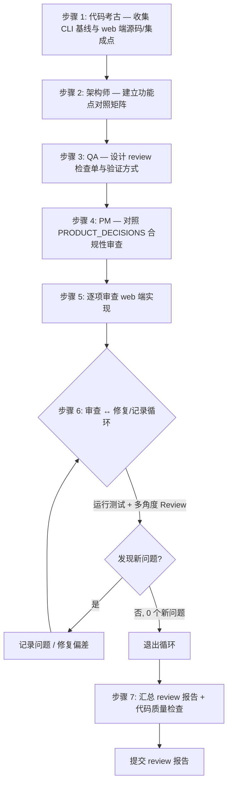

中文和我沟通。任务执行过程中，如果必须询问我，就来问我。
子代理驱动，串行执行，你作为子代理调度者。注意润色提示词，保证上下文充分完整。子代理必须频繁使用 TodoWrite tool。子代理必须阅读并了解 `demo/web/docs/decisions/PRODUCT_DECISIONS.md`。

---

## 任务概述

对 `demo/web/packages/xyncra-client-web`（浏览器端 React 客户端包）及其所有集成点进行 code review，以**已验证通过的 CLI 实现 `@xyncra/client-cli` 作为"正确行为"的可信基线**，逐功能点核对 web 端是否与 CLI 在协议语义、事件契约、存储/连接行为上一致、正确、无遗漏。

## 工作流程

> 用 Mermaid 流程图展示本次 review 的完整执行流程，体现循环与分支。

（节点与下方文字步骤一一对应）

## 背景上下文

### 目标范围（必须覆盖）
1. **`@xyncra/client-web` 包全部源码**（`demo/web/packages/xyncra-client-web/src/`）：
   - `internal/`：`EventEmitter.ts`、`FunctionRegistry.ts`、`ReactUpdateHandler.ts`、`dateUtils.ts`
   - `adapters/`：`websocket.ts`、`indexeddb.ts`、`logger.ts`
   - `context/XyncraProvider.tsx`
   - `hooks/`：`useXyncra`、`useConversations`、`useMessages`、`useStreaming`、`useAgentStatus`、`useHITL`、`useRegisterFunction(s)`
   - `components/FloatingAssistant/*`（含 `ConnectionStatus.tsx`）
   - `index.ts` 导出契约
2. **集成点**（消费 `@xyncra/client-web` 的 demo/web 主应用代码）：
   - `src/app.tsx`（`import { FloatingAssistant, XyncraProvider }` + `<FloatingAssistant />`）
   - `src/functions/getCurrentPage.tsx`、`highlightElement.tsx`、`showNotification.tsx`、`navigateTo.tsx`（均 `import { useRegisterFunction }`）

### 可信基线（CLI 已验证通过）
- 包名：`@xyncra/client-cli`，位于 `demo/web/packages/xyncra-client-cli/src/`
- 核心对照文件：
  - `cli-context.ts`（179 行）— 客户端上下文组装
  - `update-handler.ts`（112 行）— `IUpdateHandler` 全部回调（`onMessage`/`onDeleteMessage`/`onMarkRead`/`onConversation`/`onGap`/`onTyping`/`onStreaming`/`onAgentStatus`/`onAgentTimeout`）
  - `rpc-helper.ts`（119 行）— RPC 调用封装
  - `builtin-functions.ts`（105 行）— 内置函数注册
- **基线作用**：CLI 是已验证正确的实现，代表"协议应长什么样"。review 时以 CLI 的协议语义、事件/字段命名、错误处理为判定标准，逐点核对 web 端是否一致。不做逐行 diff，只在功能正确性层面对照。

### 相关产品决策（摘要，详见 PRODUCT_DECISIONS.md）
- **TS-D-001**：4 包架构 `protocol ← core ← cli` / `core ← web`，浏览器构建不引入 Node.js 代码
- **TS-D-003**：Dexie.js + fake-indexeddb 存储层；浏览器用原生 IndexedDB
- **TS-D-007 / TS-D-008**：浏览器内嵌模式，AI 助手作为 React 组件直接导入 client，**无 IPC 层**，在浏览器进程内运行
- **TS-D-012**：`--db-path` 语义在 TS 版变更为 IndexedDB 数据库名称（无文件路径概念）
- core 通过构造函数注入环境差异：`IWebSocketFactory`、`IIndexedDBProvider`、`IUpdateHandler`、`ILogger`

### 已知关键差异点（review 须重点核对的语义映射）
- CLI `onMarkRead` 仅打印；web `ReactUpdateHandler.onMarkRead` 发出 `read:updated` 事件（`{conversationId, lastReadMessageId}`）——需确认 web hooks 是否正确消费该事件、与 CLI 语义一致。
- web `onAgentTimeout` 映射为 `hitl:question` 事件——需对照 CLI `onAgentTimeout` 语义，确认 HITL 流程在 web 端是否正确。
- web `onGap` 为空实现（注释称由 core 处理）——需确认 CLI 端 gap 处理方式，判断 web 是否遗漏 UI 层必要行为。

## 详细实现步骤

### 步骤 1：[代码考古学家] — 收集基线与目标源码
- 读取 `@xyncra/client-cli` 的 4 个核心文件，提取：每个 RPC/事件/处理回调的**输入参数、输出、错误路径、字段命名**。
- 读取 `@xyncra/client-web` 全部源码与 4 个集成点，列出：每个导出的 hook/组件/适配器的**公开契约、内部事件名、依赖的 core 接口、测试隐含假设**。
- 读取 `demo/web/docs/decisions/PRODUCT_DECISIONS.md` 全文。
- 输出：① CLI 行为基线清单（按功能点）② web 端接口/事件清单 ③ 隐藏约束列表。

### 步骤 2：[后端架构师] — 建立功能点对照矩阵
- 以 CLI 基线为行、web 端为列，建立对照矩阵，覆盖：消息收发、删除、标记已读、会话更新、gap、typing、streaming、agent 状态、agent 超时(HITL)、RPC 调用、存储(IndexedDB)、WebSocket 连接/重连、函数注册。
- 对每个功能点标注：`一致` / `偏差` / `web 独有(合理)` / `web 缺失(需补)`。
- 输出：对照矩阵 + 文件变更/修复清单（标出哪些偏差是 bug、哪些是合理的环境差异）。

### 步骤 3：[QA 工程师] — 设计 review 检查单
- 基于对照矩阵，列出每个"偏差/缺失"点的验证方式：能否用现有 jest 测试复现？是否需要补测试？
- 识别边界与错误路径是否被 web 端正确处理（对照 CLI 的错误行为）。
- 输出：review 检查单（每项含 验证方法 + 验收标准）。

### 步骤 4：[产品经理] — 合规性审查
- 逐项核对是否符合 `PRODUCT_DECISIONS.md`（尤其 TS-D-001/003/007/008/012）。
- 检查开发者体验：web 包导出契约是否清晰、`useRegisterFunction` 在 4 个 functions 中的用法是否一致、是否有踩坑点。
- 判断是否需要新增产品决策（仅当满足"非常规复杂架构/影响全局/改变外部行为"标准）——通常本次 review 不新增决策，仅记录实现级发现。
- 输出：合规性结论 + 新增决策建议（如有）。

### 步骤 5：逐项审查 web 端实现
- 按对照矩阵串行审查：架构师 + QA + PM 视角集中核对每个功能点。
- 对发现的每个问题记录：文件:行号、与 CLI 基线的差异、影响、严重度（bug / 一致性 / 体验）。
- 不立即改代码，先产出问题清单。

### 步骤 6：审查 ↔ 修复/记录循环

> 进入循环。每轮：运行测试 + 多角度 Review，发现问题则修复（仅修复确认为 bug 的偏差）或记录（一致性/体验类）后重新循环，直到无新问题。

**每轮循环：**
1. **运行测试** — 在 `demo/web/packages/xyncra-client-web` 执行 `npm test`（jest），记录失败。
2. **多角度 Review** — 串行调度：
   - 架构师：对照矩阵是否完整、web 实现与 CLI 语义是否一致、接口/doc 是否落后。
   - QA：测试是否覆盖发现的偏差点、边界是否遗漏。
   - PM：是否符合 PRODUCT_DECISIONS、开发者体验。
3. **汇总** — 去重合并问题。
4. **退出判定**：
   - 本轮 0 个新问题 → 退出循环，进入步骤 7。
   - 有新 bug → 调度修复子代理修复（仅修确认为 bug 的项），回到第 1 步。
   - 同一问题连续 2 轮未修复 → 标记阻塞，询问用户。

**约束：** 每轮修复后必须重跑测试 + Review，不可跳过；循环次数记入 TodoWrite。

### 步骤 7：汇总 review 报告 + 代码质量检查
- 循环退出后，生成 review 报告（Markdown），包含：
  - 对照矩阵结果汇总
  - 问题清单（文件:行号 / 与 CLI 差异 / 严重度 / 状态：已修复/已记录/阻塞）
  - 测试覆盖结论
  - 合规性结论
- 代码质量检查：对 web 包运行 `npm run typecheck`、`npm run lint`（若配置），确认修复未引入格式/类型错误。
- 不要修改业务代码逻辑之外的文件；确认无遗留调试代码。

### 步骤 8：提交 review 报告
- 将报告写入 `demo/web/.claude/docs/reviews/076-web-vs-cli-review.md`（如目录不存在则创建）。
- 使用英文 commit message（Conventional Commits）：`docs(web): add code review report vs cli baseline`。
- `git add` 报告文件，`git commit`，`git push`。

## 设计决策
- **基线仅作可信标准，不逐行 diff**：CLI 与 web 运行环境不同（Node daemon vs 浏览器 React），合理差异（如 web 用事件驱动 UI、CLI 用 stdout）不算问题；仅协议语义/字段/错误处理层面的不一致算问题。
- **修复范围限定**：确认为 bug 的偏差才修复；一致性/体验类问题记录到报告，不擅自大改。
- **不新增产品决策**：本次为 review，除非发现改变外部行为/协议的未记录决策，否则不写 PRODUCT_DECISIONS.md。

## 代码规范
- review 报告英文撰写，问题定位用 `file:line`。
- 修复代码遵循现有命名与模式；注释英文。
- 测试补写遵循现有 jest 配置（`jest.config.cjs`）。
