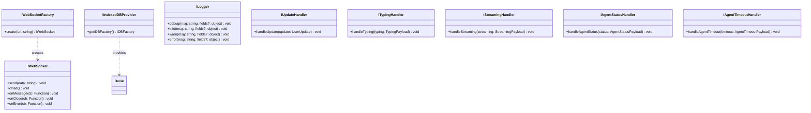
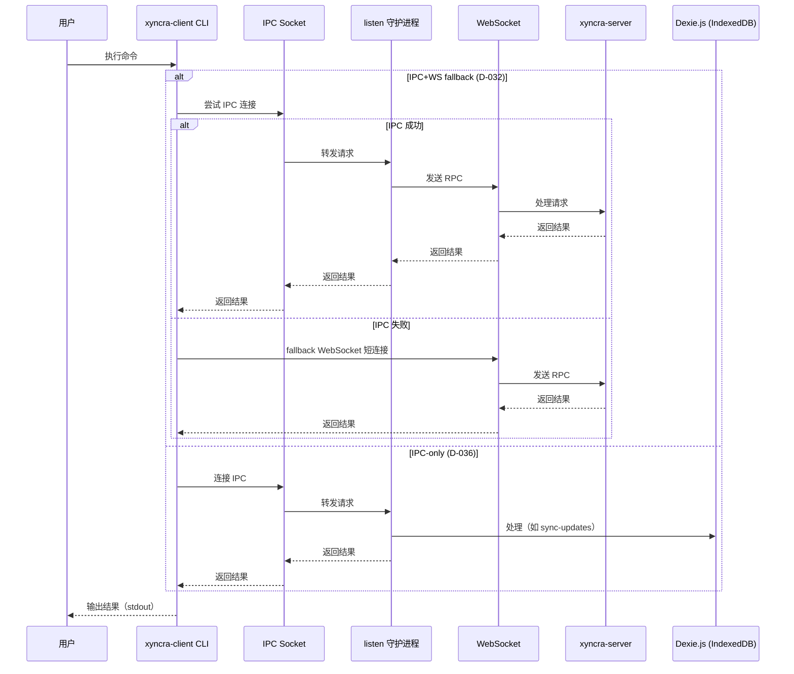
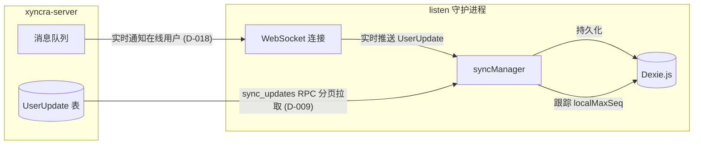

# 系统架构概览

## 系统组件

| 组件 | 说明 |
|------|------|
| **xyncra-server** | 消息服务器（WebSocket + Redis Pub/Sub 多节点路由，D-018） |
| **@xyncra/protocol** | 协议类型定义包，1:1 映射 Go `pkg/protocol` |
| **@xyncra/client-core** | 环境无关核心：DI 接口、Dexie DB、9 个 domain store、连接管理、同步管理、重试逻辑 |
| **@xyncra/client-cli** | Node.js CLI 运行时：Commander CLI、daemon、IPC server/client |
| **Dexie.js (IndexedDB)** | 客户端本地数据存储，9 个表（TS-D-012） |
| **Unix Socket IPC** | CLI 与 daemon 之间的进程间通信（D-030） |

```mermaid
graph TB
    subgraph "npm workspace (demo/web/packages/)"
        PROTOCOL[@xyncra/protocol<br/>协议类型]
        CORE[@xyncra/client-core<br/>DI 接口 + Dexie DB<br/>连接管理 + 同步管理]
        CLI_PKG[@xyncra/client-cli<br/>Commander CLI + daemon<br/>IPC server/client]
    end

    subgraph "本地机器"
        CLI[xyncra-client CLI]
        DAEMON[listen 守护进程]
        IDB[(Dexie.js<br/>IndexedDB)]
        LOCK[xyncra.lock<br/>fs-ext 进程锁]
        SOCK[xyncra.sock<br/>Unix Socket IPC]
    end

    subgraph "服务器"
        SERVER[xyncra-server<br/>WebSocket + Redis]
    end

    CLI_PKG -->|依赖| CORE
    CORE -->|依赖| PROTOCOL
    CLI -->|"IPC (JSON-RPC 2.0)"| DAEMON
    CLI -->|"WS fallback (D-032)"| SERVER
    CLI -.->|"本地读取 (Dexie)"| IDB
    DAEMON -->|"WebSocket 长连接"| SERVER
    DAEMON -->|"持久化更新"| IDB
    DAEMON ---|持有| LOCK
    DAEMON ---|监听| SOCK
```

---

## 包结构

TS 客户端由 3 个 npm 包组成，位于 `demo/web/packages/` 目录下，通过 npm workspace 管理。

```mermaid
graph LR
    CLI[@xyncra/client-cli] --> CORE[@xyncra/client-core]
    CORE --> PROTO[@xyncra/protocol]

    style CLI fill:#4CAF50,color:#fff
    style CORE fill:#2196F3,color:#fff
    style PROTO fill:#FF9800,color:#fff
```

| 包 | npm 名 | 用途 |
|---|--------|------|
| `xyncra-protocol` | `@xyncra/protocol` | 协议类型，1:1 映射 Go `pkg/protocol` |
| `xyncra-client-core` | `@xyncra/client-core` | 环境无关核心：DI 接口、Dexie DB、9 个 domain store、连接管理、同步管理、重试逻辑 |
| `xyncra-client-cli` | `@xyncra/client-cli` | Node.js CLI 运行时：Commander CLI、daemon、IPC server/client |

---

## 依赖注入接口（TS-D-002: 环境无关）

`@xyncra/client-core` 定义了环境无关的 DI 接口，使核心逻辑可以在 Node.js、浏览器、React Native 等不同环境中运行。

### 核心接口

定义在 `packages/xyncra-client-core/src/interfaces.ts`:

| 接口 | 说明 |
|------|------|
| `IWebSocket` | WebSocket 传输抽象（send/close/onMessage/onClose/onError） |
| `IWebSocketFactory` | `create(url: string): IWebSocket` — 工厂模式创建 WebSocket |
| `IIndexedDBProvider` | `getIDBFactory(): IDBFactory` — 提供 IndexedDB 实例 |
| `ILogger` | 结构化日志接口（debug/info/warn/error） |

### 可选 Handler 接口

| 接口 | 说明 | 决策 |
|------|------|------|
| `IUpdateHandler` | 同步管道更新处理（必须实现） | - |
| `ITypingHandler` | 输入状态处理（可选） | D-050 |
| `IStreamingHandler` | 流式文本处理（可选） | D-051 |
| `IAgentStatusHandler` | Agent 状态处理（可选） | D-087 |
| `IAgentTimeoutHandler` | Agent 超时处理（可选） | D-087 |



---

## 守护进程模型

### listen 守护进程

`xyncra-client listen` 启动一个长驻进程，职责如下：

1. 获取进程锁（D-031）防止重复启动
2. 初始化 Dexie.js 数据库（通过 `IIndexedDBProvider`）
3. 创建 IPC 服务器（Unix Socket），注册 RPC 方法处理器
4. 启动连接管理器，建立 WebSocket 连接到服务器
5. 启动同步管理器，处理推送更新
6. 阻塞等待 SIGINT/SIGTERM 信号

**stderr 输出**（启动 banner）：

```
[xyncra] Starting listener daemon...
[xyncra] Device: <device_id>
[xyncra] Connecting to <server_url>?user_id=<user_id> ...
[xyncra] IPC server listening at <socket_path>
[xyncra] Listening for updates... (Ctrl+C to stop)
```

**stdout 输出**（事件通知）：

```
[new message] id=<message_uuid> seq=<seq> from=<sender_id> conv=<conversation_id> "<content>"
[delete message] conv=<conversation_id> msg=<message_id>
[mark read] conv=<conversation_id> msg_id=<message_id>
[conversation] id=<conversation_id> title="<title>"
[gap] seq=<seq>
[typing] conv=<conversation_id> user=<user_id> typing=<true|false>
[streaming] conv=<conversation_id> user=<user_id> stream=<stream_id> done=<true|false> text="<text>"
[agent_status] conv=<conversation_id> agent=<agent_id> status=<status>
[agent_timeout] conv=<conversation_id> agent=<agent_id> reason=<reason>
```

> **注意**：`[new message]` 中的 `id=` 是消息 UUID（`messages.id`），`seq=` 是会话内序列号（`messages.message_id`）。TS 版使用 UUID 作为消息主键（D-038），`seq=` 用于增量同步游标。

**退出码**（D-042）：
- `0` -- 正常退出
- `2` -- 锁冲突（进程已运行）

### 锁机制（D-031）

使用 `fs-ext` 实现进程互斥（替代 Go 版的 `flock`）。

| 属性 | 值 |
|------|-----|
| 锁类型 | fs-ext 文件锁（支持 stale lock 自动检测和清理） |
| 锁文件路径 | `~/.xyncra/{user_id}/{device_id}/xyncra.lock` |
| 锁文件权限 | `0600` |
| 锁内容 | JSON：`{PID, started_at, device_id}` |
| Stale lock 检测 | 读取锁文件中的 PID，检查进程是否存活 |
| Stale lock 处理 | 进程已死则自动清理锁文件并重试 |

**约束**：
- 锁粒度为 `(user_id, device_id)`，不同组合的 listen 互不影响
- stale lock 检测存在 TOCTOU 竞态（概率极低，可接受）

---

## 数据流

### CLI 命令执行流程



### 三种执行模式（D-032）

| 模式 | 说明 | 使用场景 |
|------|------|----------|
| **IPC+WS fallback** | 优先通过 IPC 连接 daemon，失败时自动 fallback 到 WebSocket 短连接 | 写操作命令（send、create-conversation 等） |
| **IPC-only** | 仅通过 IPC 连接 daemon，无 fallback | sync-updates（D-036）、set-typing（D-050）、stream-text（D-051）等 |
| **IPC-only (daemon)** | 通过 IPC 访问 daemon 中的 Dexie.js 数据库 | 查询命令（list-conversations、get-messages 等） |

> **注意**：与 Go 客户端不同，TS 客户端的查询命令通过 IPC 访问 daemon（因为 Dexie.js 运行在 daemon 进程中），不支持直接离线查询。

### 命令分类表

| 命令 | 执行模式 | 说明 |
|------|----------|------|
| `listen` | 守护进程 | 启动 IPC 服务器和 WebSocket 客户端 |
| `send` | IPC+WS fallback | 发送消息到会话 |
| `create-conversation` | IPC+WS fallback | 创建 1-on-1 会话（find-or-create，D-011） |
| `delete-conversation` | IPC+WS fallback | 级联软删除会话及消息（D-013） |
| `restore-conversation` | IPC+WS fallback | 级联恢复会话及消息（D-015） |
| `delete-message` | IPC+WS fallback | 软删除消息（仅发送者，D-014） |
| `mark-as-read` | IPC+WS fallback | 标记已读（MAX 语义，D-012） |
| `sync-updates` | IPC-only | 触发 FullSync（D-036，无 fallback） |
| `set-typing` | IPC-only | 发送输入指示器（fire-and-forget，D-050） |
| `stream-text` | IPC-only | 发送流式文本（fire-and-forget，D-051） |
| `list-conversations` | IPC-only | 通过 daemon 列出本地会话 |
| `get-conversation` | IPC-only | 通过 daemon 查看会话详情 + 未读计数 |
| `get-messages` | IPC-only | 通过 daemon 列出消息 |
| `search-messages` | IPC-only | 通过 daemon 搜索消息 |
| `draft save/get/delete` | IPC-only | 管理消息草稿（通过 daemon） |
| `logs tail/search/stats/export/cleanup` | IPC-only | 查看和管理日志（D-040） |
| `agent-resume` | IPC-only | 恢复 HITL-interrupted agent（D-114） |
| `reload-agents` | IPC-only | 热加载 Agent 配置（D-076） |
| `kill` | OS 进程管理 | 终止守护进程（D-039） |

---

## 同步模型

### 增量同步



**增量同步流程**：

1. 服务器推送 `UserUpdate` 到守护进程的 WebSocket 连接
2. daemon 通过 `syncManager` 将更新持久化到 Dexie.js
3. `localMaxSeq` 跟踪已处理的最大序列号（所有类型共享单一 seq 空间，D-028）
4. 当检测到 seq 间隙时，触发 `FullSync` 填补

**FullSync 流程**：
1. 通过 `sync_updates` RPC 分页拉取 `after_seq` 之后的更新（D-009）
2. 服务器返回 `updates` 数组（seq 连续，服务器补空 D-029）
3. 逐条 `ApplyUpdate` 持久化到 Dexie.js
4. 更新 `localMaxSeq`
5. `has_more=true` 时继续拉取下一页

### 离线恢复

1. WebSocket 断开后自动重连
2. 重连后触发 `FullSync` 填补离线期间的更新间隙
3. 手动触发：`sync-updates` 命令（D-036，IPC-only）

**约束**：
- 离线超过 30 天的客户端需要全量同步（UserUpdate 保留 30 天，D-016）
- 服务器端 `gap` 类型 Update 仅运行时生成，不持久化（D-029）

---

## 日志子系统

### CLI 日志（stderr）

- 启动 banner、事件通知输出到 stderr
- 日志格式：结构化 JSON 或文本格式
- `XYNCRA_DEBUG=1` 或 `XYNCRA_DEBUG=true` 启用 debug 日志

### 持久化日志（Dexie.js）

| 日志类型 | 存储表 | 说明 |
|----------|--------|------|
| RPC 日志 | `rpcLogs` | 所有 RPC 调用的记录（方法、状态码、耗时、关联会话） |
| Notification 日志 | `notificationLogs` | 所有推送通知的记录（seq、类型、JSON 负载） |

### 自动清理（D-040）

- 清理间隔：1 小时
- 默认保留：7 天（168h）
- 同时清理 `rpcLogs` 和 `notificationLogs`
- 支持 `--type` 参数指定只清理特定表
- 支持 `--dry-run` 预览删除数量

---

## 文件布局

```
~/.xyncra/{user_id}/{device_id}/
├── xyncra.lock     # 进程锁文件（fs-ext，0600）
├── xyncra.sock     # Unix Socket IPC（0600）
└── logs/           # 日志目录（预留，当前 cliLogger 仅写 stderr）
```

> **注意**：与 Go 客户端不同，TS 客户端不在磁盘上创建 `xyncra.db` 文件。IndexedDB 在 Node.js 环境中由 `fake-indexeddb` 提供，数据存储在内存中。

### 文件权限

| 文件/目录 | 权限 | 说明 |
|-----------|------|------|
| `~/.xyncra/{uid}/{did}/` | `0700` | 仅所有者可访问（D-030） |
| `xyncra.lock` | `0600` | 仅所有者可读写 |
| `xyncra.sock` | `0600` | 仅所有者可读写（D-030） |

---

## 相关文档

- [Dexie.js 数据库结构](database.md)
- [IPC 协议规范](ipc.md)
