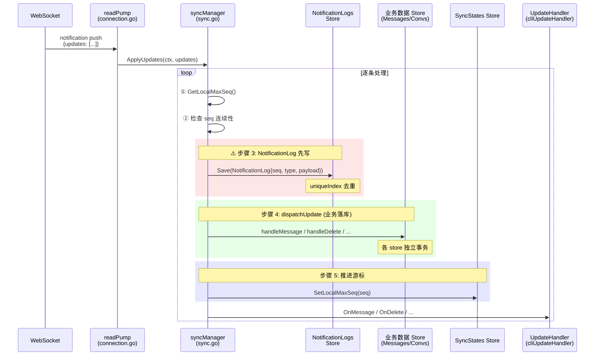
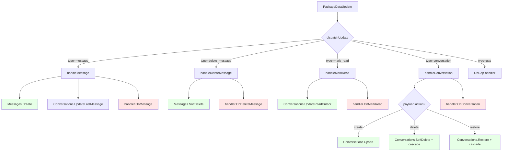
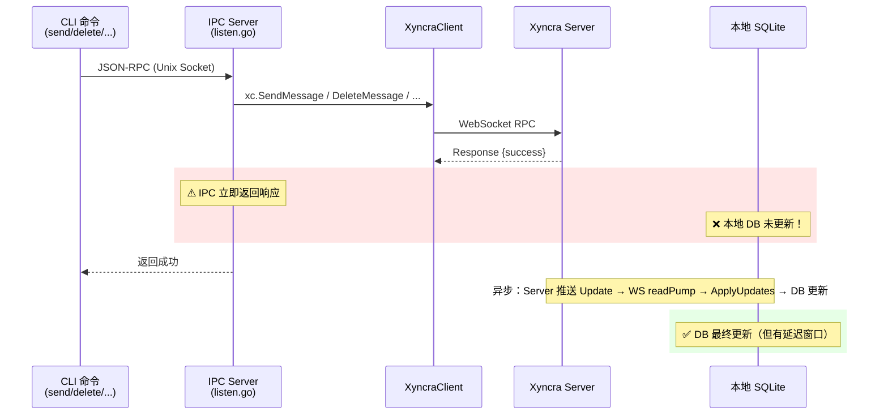
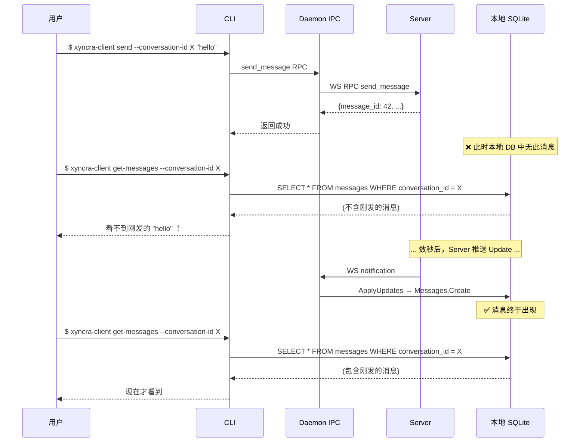

# Xyncra Client 代码审查报告

> **审查范围**：`pkg/client/`、`pkg/store/`、`internal/cli/`、`cmd/xyncra-client/`
> **审查日期**：2026-07-10
> **审查方法**：3 个子代理串行审查 → 主代理综合验证
> **审查视角**：收到 Update 后是否"先落库、后处理"？客户端逻辑是否建立在数据库之上？

---

## 1. 审查概览

本次审查围绕一个核心问题展开：**客户端在收到 Update 后，是否先将数据持久化到本地 SQLite，再执行后续的处理逻辑（通知 handler、更新 UI 状态等）？** 产品决策 D-035 承诺"CLI 查询命令使用本地数据库读取"，这意味着本地 DB 必须是 single source of truth。

### 审查发现统计

| 严重程度 | 数量 | 关键问题 |
|---------|------|---------|
| 🔴 高 | 5 | 数据丢失风险、D-035 承诺未兑现 |
| 🟡 中 | 6 | 竞态条件、事务原子性、standalone 模式缺陷 |
| 🟢 低 | 7 | 退出码、日志清理并发、UX 细节 |

---

## 2. 核心流程分析

### 2.1 Update 接收与落库流程

**关键观察**：
- NotificationLog **先于**业务数据写入（步骤 3 → 步骤 4），如果步骤 4 失败，seq 已被"消耗"
- 步骤 3、4、5 各自独立事务，缺乏原子性保证
- Handler 通知（最后一步）发生在 DB 写入之后 ✅（符合"先落库后处理"）

### 2.2 各类型 Update 的 apply 逻辑分派

**🟢 绿色** = DB 写入（先执行） &nbsp; **🔴 红色** = Handler 通知（后执行）

**结论**：在每个 update type 内部，确实遵循了"先落库、后通知 handler"的顺序。✅

---

### 2.3 IPC 命令执行链路（CLI → Daemon → Server → DB）

**核心问题**：4/5 的 mutation IPC handler 在 RPC 成功后立即返回，**不写入本地 DB**。

| IPC 命令 | RPC 后写本地 DB? | D-035 查询结果 |
|-----------|:---:|------|
| `create_conversation` | ✅ 写入 (listen.go:312) | `list-conversations` 立即可见 |
| `send_message` | ❌ 不写 | `get-messages` **看不到**刚发的消息 |
| `delete_message` | ❌ 不写 | `get-messages` **仍显示**已删消息 |
| `mark_as_read` | ❌ 不写 | `get-conversation` 未读计数**不变** |
| `delete_conversation` | ❌ 不写 | `list-conversations` **仍显示**已删会话 |
| `restore_conversation` | ❌ 不写 | `list-conversations` **看不到**恢复的会话 |

---

### 2.4 CLI mutation → query 时序问题

---

## 3. 审查发现详表

### 🔴 高严重度

#### H-1: NotificationLog 先于业务数据写入，dispatchUpdate 失败导致数据永久丢失

- **文件**：[sync.go:175-200](pkg/client/sync.go#L175-L200)
- **描述**：`ApplyUpdate` 在第 3 步写入 NotificationLog（`sync.go:182`），第 4 步调用 `dispatchUpdate`（`sync.go:195`）执行业务落库。如果 `dispatchUpdate` 失败（如 DB 写入错误），NotificationLog 已记录该 seq，后续重 sync 时 NotificationLog 的 uniqueIndex 去重会跳过此 seq，导致该 Update 永久丢失。
- **建议**：将 NotificationLog 写入和业务数据写入放在同一个数据库事务中（`db.Transaction`），或在 dispatchUpdate 失败时回滚 NotificationLog 记录。

#### H-2: ApplyUpdate 的 4 步 DB 操作缺乏原子性

- **文件**：[sync.go:154-205](pkg/client/sync.go#L154-L205)
- **描述**：`ApplyUpdate` 包含 4 个独立 DB 操作（NotificationLog.Save → dispatchUpdate → SyncStates.SetLocalMaxSeq），各自独立提交。进程崩溃或 DB 错误可能在中间状态留下不一致数据。例如：NotificationLog 已写入但消息未持久化，或消息已持久化但 localMaxSeq 未推进。
- **建议**：使用 `db.Transaction` 将每个 update 的完整处理包裹在单个事务中。

#### H-3: FullSync 与 readPump 并发调用 ApplyUpdates（竞态条件）

- **文件**：[sync.go:464](pkg/client/sync.go#L464), [connection.go](pkg/client/connection.go)
- **描述**：`syncManager` 没有 mutex 保护 `ApplyUpdate`。readPump goroutine 和 FullSync goroutine（含 debouncedPull）可能同时调用 `ApplyUpdates`，导致：
  - 两个 goroutine 同时读取相同的 `localMaxSeq`
  - 同时写入相同的 NotificationLog seq（第二个被 uniqueIndex 拒绝）
  - 并发修改 Conversation 的 last-message 指针
- **建议**：在 `syncManager` 上添加 mutex 串行化所有 `ApplyUpdate` 调用，或使用 channel 单线程处理。

#### H-4: 4/5 IPC mutation handler 不写本地 DB，D-035 查询返回陈旧数据

- **文件**：[listen.go:261-404](internal/cli/listen.go#L261-L404)
- **描述**：`send_message`、`delete_message`、`mark_as_read`、`delete_conversation`、`restore_conversation` 五个 IPC handler 在 RPC 成功后立即返回，不写入本地 SQLite。只有 `create_conversation`（`listen.go:310-317`）做了本地持久化。这直接违反 D-035 的本地优先承诺。
- **建议**：每个 mutation handler 在 RPC 成功后，立即将操作结果写入本地 DB（参照 `create_conversation` 的模式）。或者，在 handler 返回前调用一次同步的 `FullSync`（但性能较差）。

#### H-5: standalone fallback 成功后本地 DB 无法更新

- **文件**：[listen.go](internal/cli/listen.go)（IPC fallback 逻辑）
- **描述**：当 daemon 未运行时，CLI 命令 fallback 到 standalone WebSocket 短连接。操作在 server 端成功，但没有任何机制将结果写入本地 SQLite（因为 daemon 未运行，无 sync pipeline）。后续 `list-conversations` 等查询命令（D-035）看不到 standalone 操作的结果。
- **建议**：standalone 模式下的 mutation 命令应在返回前手动触发本地 DB 写入，或在文档中明确说明 standalone 模式的数据可见性限制。

---

### 🟡 中严重度

#### M-1: dispatchUpdate 错误被静默吞掉

- **文件**：[sync.go:195-196](pkg/client/sync.go#L195-L196)
- **描述**：`ApplyUpdate` 第 4 步的 `dispatchUpdate` 返回错误后，`err` 变量在第 196 行被 `return err` 返回——但此时 NotificationLog 已提交（步骤 3），无法回滚。且错误仅被 `ApplyUpdates` 返回给调用者，调用者（readPump / debouncedPull）仅记录日志后丢弃。
- **建议**：在 dispatchUpdate 失败时，主动删除对应的 NotificationLog 记录，或将整个操作包裹在事务中。

#### M-2: handleMessage 中 Conversation 不存在时 ErrNotFound 被忽略

- **文件**：[sync.go:251-255](pkg/client/sync.go#L251-L255)
- **描述**：`handleMessage` 更新会话的 last-message 指针时，如果会话不存在（`ErrNotFound`），错误被静默忽略。这可能导致新消息已写入但会话的 `LastMessageAt` 未更新，`list-conversations` 排序不准。
- **建议**：在会话不存在时自动创建空壳会话记录，或至少在日志中记录 warning。

#### M-3: standalone fallback 模式下 `sync-updates` 不可用（D-036 例外）

- **文件**：D-036 设计如此，但缺少用户提示
- **描述**：D-036 规定 `sync-updates` 为 IPC-only。当 daemon 未运行时返回错误。但如果用户刚用 standalone 模式执行了 `send`，他需要 daemon 运行才能 sync——这是一个认知断层。
- **建议**：standalone 模式执行 mutation 后，输出提示 "请启动 listen 以同步数据"。

#### M-4: send 命令不与 draft 存储集成

- **文件**：[send.go](internal/cli/send.go), [draft.go](internal/cli/draft.go)
- **描述**：`send` 命令成功后不清理对应的 draft。用户发送了一条之前保存的草稿后，草稿仍然存在。
- **建议**：`send` 成功后检查是否有匹配 draft，有则删除。

#### M-5: kill 命令在守护进程不存在时返回 exit 1

- **文件**：[kill.go](internal/cli/kill.go)
- **描述**：D-039 规定 "0: 成功终止（或守护进程已不在运行）"，但实际实现中当锁文件不存在或进程不存在时返回 exit 1。
- **建议**：当守护进程已不在运行时，返回 exit 0。

#### M-6: handleConversation 中 action 字段缺少验证

- **文件**：[sync.go:380-455](pkg/client/sync.go#L380-L455)
- **描述**：`handleConversation` 根据 `payload.action` 分派 create/delete/restore，但未知 action 值不会报错——函数静默返回 nil。如果服务器新增了 action 类型，客户端会静默忽略。
- **建议**：对未知 action 返回错误或至少记录 warning 日志。

---

### 🟢 低严重度

| # | 文件 | 问题 |
|---|------|------|
| L-1 | `logs.go` | `logs cleanup` 的 RPC 日志和通知日志清理非原子性，中间崩溃可能只清理了其中一种 |
| L-2 | `logs.go` | cleanup goroutine 和手动 `logs cleanup` 命令可能并发执行，缺乏协调 |
| L-3 | `mark-as-read` standalone | standalone 路径不显示 server 实际游标（D-047 未完整实现） |
| L-4 | `messages.go` | `get-messages` 空结果时无友好提示 |
| L-5 | `conversations.go` | `list-conversations` 空结果时无友好提示 |
| L-6 | `sync.go` | `debouncedPull` 失败后不重试——依赖下一次 notification 触发 |
| L-7 | `client.go` | `connectionMonitor` 重连后不主动通知 syncManager 执行增量 sync |

---

## 4. 核心问题回答

### "收到 Update 后，是否先落库、后处理？"

**分层回答：**

#### ✅ 在 sync pipeline 内部（WS 接收路径）：基本符合

`syncManager.dispatchUpdate` 内部，每个 update type 的处理都遵循"先写 DB → 后通知 handler"的顺序。Handler（`cliUpdateHandler`）的通知发生在 DB 写入之后，符合"客户端逻辑建立在数据库之上"的原则。

#### ⚠️ 但 sync pipeline 自身存在原子性缺陷

NotificationLog（去重日志）先于业务数据写入。如果业务数据写入失败，seq 被"消耗"，该 Update 永久丢失。这是一个"先记录、后落库"的模式，但"记录"不等于"业务数据落库"——去重日志不能代替业务数据的持久化保证。

**正确做法**：NotificationLog 和业务数据应在同一事务中写入。

#### ❌ 在 IPC mutation 路径上：严重违反

4/5 的 mutation IPC handler（send、delete、mark-as-read、delete-conversation、restore-conversation）在 RPC 成功后立即返回，不写入本地 DB。用户执行 mutation 后立即执行查询（D-035），看到的是旧数据。

这不仅是"先处理后落库"的问题——而是**完全不落库**（依赖异步的 WS 推送最终补齐）。唯一例外是 `create_conversation`，它主动写入本地 DB，证明开发者已经意识到这个问题，但其他 handler 被遗漏了。

---

## 5. 建议修复优先级

| 优先级 | 发现 | 修复方案 | 预估工作量 |
|-------|------|---------|-----------|
| P0 | H-1 + H-2 | 用 `db.Transaction` 包裹 NotificationLog + dispatchUpdate + SetLocalMaxSeq | 中 |
| P0 | H-3 | 在 syncManager 添加 mutex 或 channel 串行化 ApplyUpdate | 小 |
| P1 | H-4 | 为 4 个 IPC handler 添加本地 DB 写入（参照 create_conversation 模式） | 中 |
| P1 | H-5 | standalone 模式文档说明或添加手动 DB 写入 | 小 |
| P2 | M-1 | dispatchUpdate 失败时删除 NotificationLog | 小 |
| P2 | M-2 | handleMessage 中会话不存在时创建空壳 | 小 |
| P2 | M-4 | send 成功后清理 draft | 小 |
| P2 | M-5 | kill 命令进程不存在时返回 exit 0 | 小 |
| P3 | L-1~L-7 | 低优先级 UX 和健壮性改进 | 小 |

---

## 6. 架构层面的观察

### 6.1 "本地优先"与"异步同步"的张力

xyncra-client 的核心架构张力在于：
- **D-035** 承诺本地 DB 是查询的 single source of truth
- **D-007** 允许 MQ 推送失败（fire-and-forget），依赖增量 sync 最终一致
- 这两者结合意味着：本地 DB 的更新是**异步的**，但用户期望查询结果是**同步的**

`create_conversation` 的做法（IPC handler 内主动写 DB）是目前唯一的调和方案。建议将此模式推广到所有 mutation handler。

### 6.2 sync pipeline 应视为一个事务管道

当前 `ApplyUpdate` 的 5 个步骤应该被视为一个原子操作。建议引入 `syncManager.mu` 或 dedicated processing goroutine（类似 readPump 但串行处理所有 update 来源），从根本上解决并发问题。

---

*报告生成：3 个子代理串行审查（Sync Engine + Store / Connection + IPC / CLI + Integration），主代理综合验证后撰写。*
