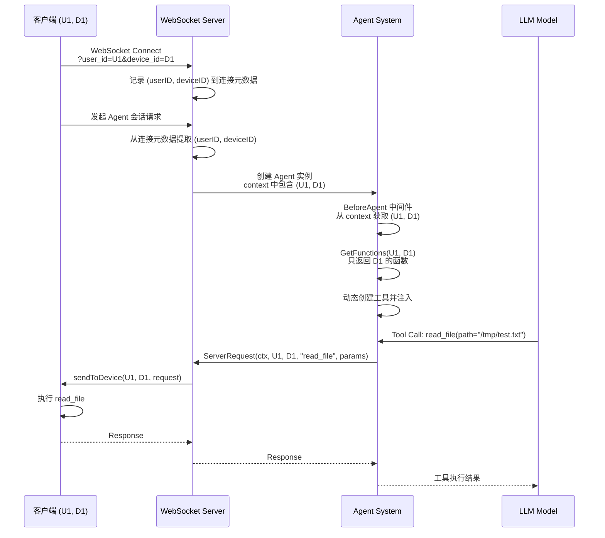
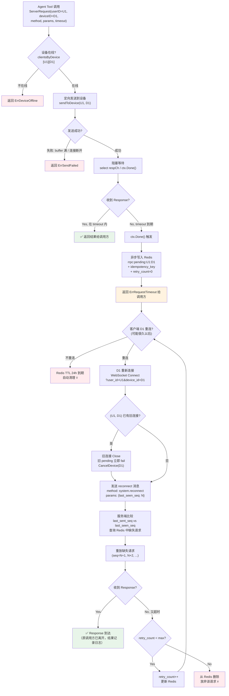
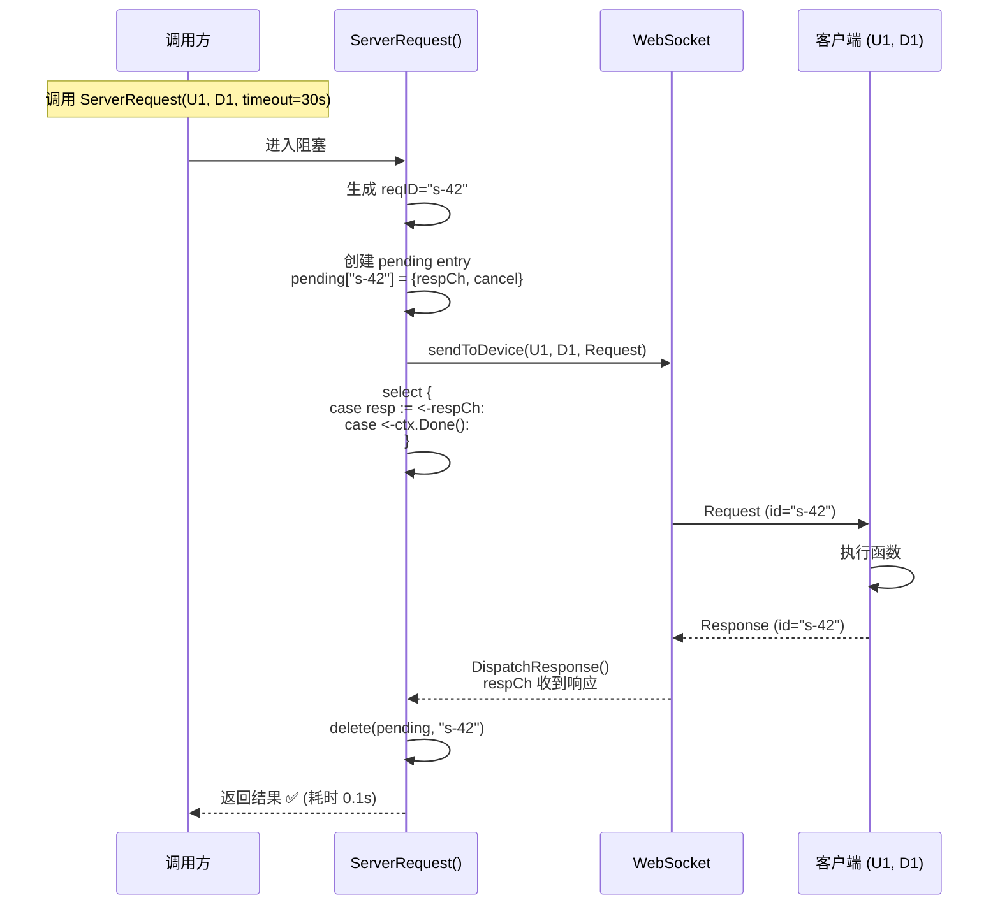
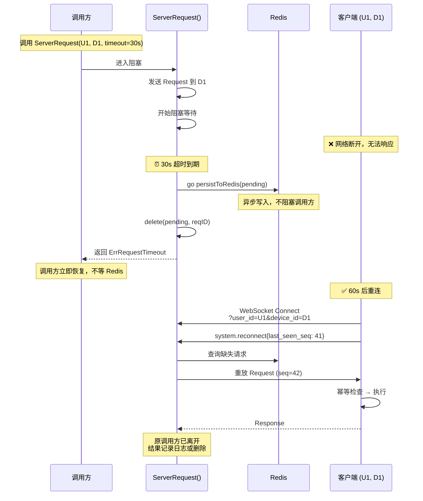
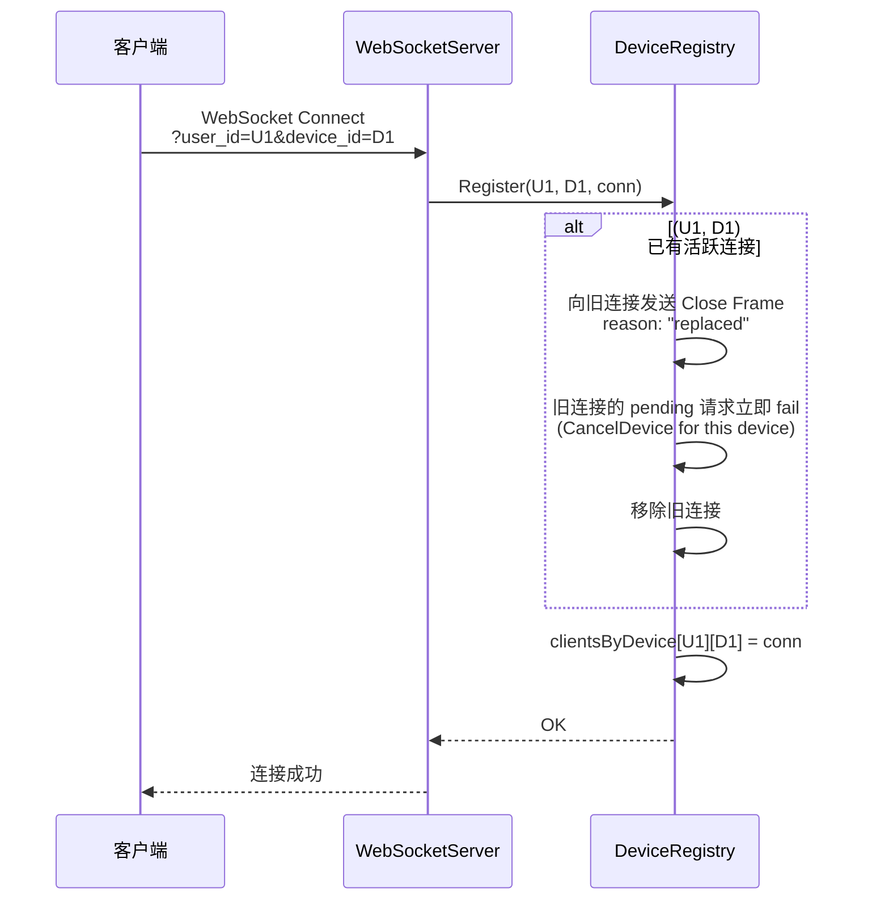
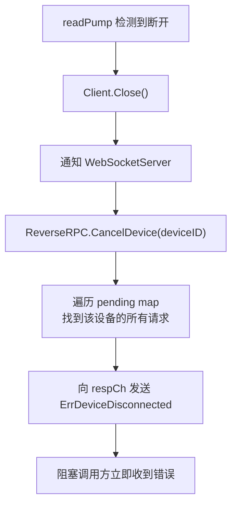
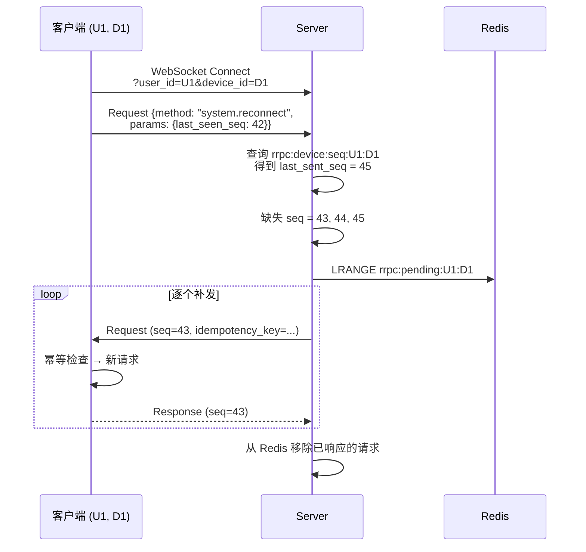

# Design: Client Function Agent Tools via WebSocket ReverseRPC

**Date**: 2026-07-12
**Status**: Draft

## Table of Contents

1. [Current State (Existing Code)](#1-current-state-existing-code)
2. [Core Design Decision](#2-core-design-decision)
3. [Comprehensive Flow Diagram](#3-comprehensive-flow-diagram)
4. [Blocking Mechanism](#4-blocking-mechanism)
5. [Part I: ReverseRPC 弱网增强](#5-part-i-reverserpc-弱网增强)
6. [Part II: Agent Tool 动态工具系统](#6-part-ii-agent-tool-动态工具系统)
7. [Protocol Extensions](#7-protocol-extensions)
8. [Configuration](#8-配置)

---

## 1. Current State (Existing Code)

> 以下内容均基于实际代码逐行阅读，是后续设计的基线。

### 1.1 ReverseRPC 机制

**文件**: `internal/server/reverse_rpc.go`

```go
type ReverseRPC struct {
    mu        sync.Mutex
    pending   map[string]*reverseRPCPending  // reqID → pending
    nextReqID uint64                         // 全局原子计数器
    sendFunc  func(userID string, pkg *protocol.Package) error
    logger    Logger
}

type reverseRPCPending struct {
    respCh chan *protocol.PackageDataResponse  // buffered cap=1
    cancel context.CancelFunc
}
```

**ServerRequest() 阻塞语义**:

```go
func (r *ReverseRPC) ServerRequest(ctx, userID, method, params, timeout) (*Response, error) {
    reqID := fmt.Sprintf("s-%d", atomic.AddUint64(&r.nextReqID, 1))
    ctx, cancel := context.WithTimeout(ctx, timeout)
    defer cancel()

    pending := &reverseRPCPending{respCh: make(chan *Response, 1), cancel: cancel}
    r.pending[reqID] = pending
    defer delete(r.pending, reqID)  // 函数退出时清理

    r.sendFunc(userID, pkg)  // 发送到客户端

    select {
    case resp := <-pending.respCh:
        return resp, nil          // 收到响应
    case <-ctx.Done():
        return nil, ctx.Err()     // 超时或取消
    }
}
```

**关键事实**:

- **没有重试逻辑** — 发一次，等响应或超时
- **没有 seq 追踪** — `nextReqID` 是全局计数器，格式 `"s-%d"`，不区分用户/设备
- **没有幂等键** — `PackageDataRequest` 只有 `ID`, `Method`, `Params` 三个字段
- **没有优先级** — 所有请求同等对待
- **sendFunc 失败时立即返回错误** — defer 清理 pending entry
- **CancelAll() 存在** — 可向所有 pending 发送合成响应并 cancel context
- **DispatchResponse()** — 按 `resp.ID` 查找 pending，发送到 respCh

### 1.2 WebSocket 连接管理

**文件**: `internal/server/websocket_server.go`

```go
// 服务端连接存储
clients     map[string]*Client              // connID → Client
clientsByUser map[string]map[string]*Client  // userID → (connID → Client)
```

**sendToUser()**: 广播到该 userID 的**所有**连接

```go
func (s *WebSocketServer) sendToUser(userID string, pkg *protocol.Package) error {
    // 取出该用户的所有连接
    for _, client := range clients {
        client.Send(data)  // 非阻塞，buffer 满时静默丢弃
    }
    return nil
}
```

**关键事实**:

- **没有 device_id** — 连接仅按 `(userID, connID)` 管理
- **Client.Send() 是非阻塞的** — `select { case send <- msg: default: log("dropping") }`
- **buffer 满时静默丢弃** — 不返回 error，只打日志
- **一个 userID 可有多个连接** — 多端同时在线

### 1.3 客户端连接

**文件**: `pkg/client/connection.go`

```go
// 连接 URL: ?user_id=xxx（没有 device_id）
q.Set("user_id", cm.userID)

// SendPackage() — 非阻塞，但会返回 error
select {
case send <- data:
default:
    return NewConnectionError(fmt.Errorf("send buffer full"))
}
```

**关键事实**:

- **连接参数只有 user_id** — 没有 device_id
- **SendPackage() 会返回 error**（与 server 端 Send() 不同）
- **自动重连** — 指数退避 + 25% jitter，无限重试（`maxRetries=0`）
- **重连后 FullSync** — 调用 `sync_updates` RPC 拉取缺失数据

### 1.4 客户端处理服务端请求

**文件**: `pkg/client/client.go`

```go
func (c *XyncraClient) handleIncomingRequest(req *PackageDataRequest) {
    handler, ok := c.requestHandlers[req.Method]
    // 调用 handler，构造 Response，通过 SendPackage() 发回
    if err := c.connMgr.SendPackage(pkg); err != nil {
        c.logger.Error("send response to server request", "error", err)
        // 仅打日志，不重试
    }
}
```

**关键事实**:

- **响应发送失败仅打日志** — 不重试，服务端会超时
- **requestHandlers 是内存 map** — 客户端启动时注册，不会动态变化
- **没有函数清单发现机制** — 服务端不知道客户端有哪些 handler

### 1.5 协议定义

**文件**: `pkg/protocol/protocol.go`

```go
type PackageType uint8
const (
    PackageTypeRequest  PackageType = iota  // 0: 请求
    PackageTypeResponse                     // 1: 响应
    PackageTypeUpdates                      // 2: 数据推送
)

type PackageDataRequest struct {
    ID     string          `json:"id"`
    Method string          `json:"method"`
    Params json.RawMessage `json:"params"`
}

type PackageDataResponse struct {
    ID   string          `json:"id"`
    Code ResponseCode    `json:"code"`   // 0=OK, <0=error
    Msg  string          `json:"msg"`
    Data json.RawMessage `json:"data"`
}
```

**关键事实**: 协议极简，只有 Request/Response/Updates 三种包类型。Request 没有幂等键、seq、优先级等字段。

### 1.6 Agent Tool 系统

**文件**: `internal/agent/tools/registry.go`

```go
type ToolFactory func(ctx context.Context, config map[string]any) (tool.BaseTool, error)

type Registry struct {
    factories map[string]ToolFactory
}
```

**已注册工具**: `get_weather`, `get_current_time`, `retrieve_tool_result`

**工具创建模式** (`utils.InferTool`):

```go
utils.InferTool("tool_name", "description", func(ctx, input *InputType) (*OutputType, error) {
    // 实现
})
```

自动生成 JSON Schema，返回 `tool.InvokableTool`。

### 1.7 Agent 构建流程

**文件**: `internal/agent/eino_agent.go`

```go
func (b *AgentBuilder) Build(ctx, config) (*BuiltAgent, error) {
    // 1. 创建 LLM
    chatModel := b.llmFactory.Create(ctx, config)

    // 2. 创建工具（Registry 静态注册）
    einoTools := b.toolRegistry.Create(ctx, config.Tools, config.ToolConfig)

    // 3. 解析子 Agent → 包装为 AgentTool
    einoTools = append(einoTools, b.resolveSubAgents(ctx, config)...)

    // 4. 连接 MCP 服务器 → 获取工具
    einoTools = append(einoTools, b.mcpBridge.Connect*(...)...)

    // 5. 构建中间件链
    handlers := b.buildMiddleware(ctx, config, chatModel)

    // 6. 创建 Eino Agent
    agent := adk.NewChatModelAgent(ctx, &adk.ChatModelAgentConfig{
        ToolsConfig: compose.ToolsNodeConfig{Tools: einoTools},
        Handlers:    handlers,
    })
    runner := adk.NewRunner(ctx, runnerCfg)
}
```

**中间件链** (`middleware.go`):

```go
// 按顺序注册:
1. PatchToolCalls (if enabled)
2. Summarization (if enabled)
3. ToolReduction (if enabled)
// 没有 BeforeAgent 中间件用于动态工具注入
```

### 1.8 现有代码的弱网痛点总结

| 痛点 | 代码位置 | 影响 |
|------|----------|------|
| Send() buffer 满时静默丢包 | `websocket_client.go:Send()` | 请求丢失，调用方不知道 |
| 客户端响应发送失败仅打日志 | `client.go:handleIncomingRequest()` | 响应丢失，服务端超时 |
| 断连后 pending 请求不取消 | `reverse_rpc.go:ServerRequest()` | 等到超时才返回错误 |
| sendToUser 广播到所有连接 | `websocket_server.go:sendToUser()` | 无法定向到特定设备 |
| 没有函数发现机制 | 全局 | 服务端不知道客户端有哪些能力 |

---

## 2. Core Design Decision

> **Agent 只能调用发起会话的那一个设备。不是同一用户的其他设备。**

### 2.1 基本规则

```text
流程:
1. 客户端设备 D1 (userID=U1, deviceID=D1) 连接到服务器
2. 客户端 D1 发起与 Agent 的会话
3. 该 Agent 只能调用 D1 上的函数
4. Agent 不能调用 D2 的函数（即使 D2 也属于 U1 且在线）
5. 目标设备在会话发起时就已经固定
```

### 2.2 设计含义

这意味着:

- **无跨设备聚合** — 不会合并多个设备的函数列表
- **无 LLM 设备选择** — LLM 不需要（也不能）选择调用哪个设备
- **无同名函数冲突解决** — 只有一个设备的函数可见
- **无 `client_list_devices` 工具** — 不需要列出多个设备让 LLM 选择
- **`BeforeAgent` 中间件从 context 获取 `(userID, deviceID)`** — 即发起会话的那个设备
- **`GetFunctions(userID, deviceID)` 只返回该设备的函数** — 不是所有设备的函数

### 2.3 为什么这样设计?

**发起会话的客户端就是 Agent 应该操作的那个客户端。** 当用户在手机上与 Agent 对话时，Agent 应该能读取手机上的文件、获取手机的位置、调用手机的本地能力。而不是去操作用户的桌面电脑。

这个设计的优势:

1. **简单性** — 没有设备选择逻辑，没有冲突解决，没有跨设备路由
2. **安全性** — 用户明确知道 Agent 在操作哪个设备
3. **可预测性** — Agent 的行为是确定的，不会因为其他设备上线而改变
4. **符合直觉** — 用户与 Agent 对话的设备就是 Agent 工作的设备

### 2.4 Context 传递链路



---

## 3. Comprehensive Flow Diagram

> 一张图覆盖所有场景：正常路径、超时、重连内恢复、超时后重放、设备替换、发送失败。
> 全程使用 `(userID, deviceID)` 二元组。



### 3.1 关键路径说明

| 路径                   | 触发条件               | 结果                                                       |
| ---------------------- | ---------------------- | ---------------------------------------------------------- |
| **正常**               | 网络稳定               | 直接收到 Response，返回结果                                |
| **发送失败**           | buffer 满或连接断开    | 立即返回 ErrSendFailed，调用方可重试                       |
| **设备替换**           | 同 (U1, D1) 新连接     | 旧连接 Close → 旧 pending 立即 fail → 新连接建立           |
| **超时→Redis→重放**    | 断连超过 timeout       | 返回超时错误 → Redis 持久化 → 重连后通过 seq 重放          |
| **重放又超时**         | 网络持续不稳定         | retry_count++ → 最多重放 N 次后放弃                        |

---

## 4. Blocking Mechanism

> `ServerRequest()` 的阻塞等待机制详解。

### 4.1 正常响应流程



### 4.2 超时后 Redis 持久化



**核心原则**:

- `ServerRequest()` 在 timeout 内**一定**返回（成功或错误）
- Redis 写入是**异步副作用**（`go persistToRedis()`），不影响调用方
- 调用方拿到 `ErrRequestTimeout` 后自行决策（重试 / 告知用户 / 换策略）
- Redis 重放是独立的后台流程，与原调用方**完全解耦**

---

## 5. Part I: ReverseRPC 弱网增强

### 5.1 连接模型变更: (userID, deviceID)

**改动文件**: `internal/server/websocket_server.go`

```go
// 现有:
clientsByUser map[string]map[string]*Client  // userID → (connID → Client)

// 新增:
clientsByDevice map[string]map[string]*Client  // userID → (deviceID → Client)
```

**连接建立流程**:



### 5.2 Send 反馈增强

**改动文件**: `internal/server/websocket_client.go`

```go
// 现有 (静默丢弃):
func (c *Client) Send(msg []byte) {
    select {
    case c.send <- msg:
    default:
        log.Printf("send buffer full, dropping")  // 静默丢弃
    }
}

// 目标 (返回 error):
func (c *Client) Send(msg []byte) error {
    if c.closed {
        return ErrClientClosed
    }
    select {
    case c.send <- msg:
        return nil
    default:
        return ErrSendBufferFull
    }
}
```

### 5.3 连接断开 → 立即 Fail Pending

当检测到连接断开时，立即 fail 该设备的所有 pending 请求：



### 5.4 幂等键与 Redis 持久化

**增强 PackageDataRequest**:

```go
// 现有:
type PackageDataRequest struct {
    ID     string          `json:"id"`
    Method string          `json:"method"`
    Params json.RawMessage `json:"params"`
}

// 增强 (新增字段，向后兼容):
type PackageDataRequest struct {
    ID             string          `json:"id"`
    Method         string          `json:"method"`
    Params         json.RawMessage `json:"params"`
    IdempotencyKey string          `json:"idempotency_key,omitempty"`  // 新增
    Seq            uint64          `json:"seq,omitempty"`              // 新增：per-device 序号
}
```

**Redis 持久化结构**:

```go
type PendingRequest struct {
    ID             string          `json:"id"`
    UserID         string          `json:"user_id"`
    DeviceID       string          `json:"device_id"`
    Method         string          `json:"method"`
    Params         json.RawMessage `json:"params"`
    IdempotencyKey string          `json:"idempotency_key"`
    Seq            uint64          `json:"seq"`
    RetryCount     int             `json:"retry_count"`
    MaxRetries     int             `json:"max_retries"`      // 默认 3
    CreatedAt      time.Time       `json:"created_at"`
}
```

**Redis Key 设计**:

```text
rrpc:pending:{userID}:{deviceID}  → Redis List of PendingRequest (JSON)
rrpc:device:seq:{userID}:{deviceID}  → last_sent_seq (integer)
```

### 5.5 重连握手与请求补发

**新增 Protocol 概念**: 客户端重连后发送 `reconnect` 方法:



### 5.6 客户端侧增强

**文件**: `pkg/client/client.go`

1. **连接时提供 device_id**: URL 参数新增 `device_id`
2. **幂等 key 缓存**: LRU 缓存最近 1000 个已处理的 idempotency_key
3. **响应重试队列**: `SendPackage()` 失败时入队，网络恢复后重发

### 5.7 自适应超时

```text
基础超时 = 30s
实际超时 = 基础超时 × 网络质量因子

网络质量因子:
  - 最近 10 次 RTT < 200ms → 1.0x
  - RTT 200ms-1s → 1.5x
  - RTT 1s-5s → 2.0x
  - 有丢包记录 → 2.5x
```

---

## 6. Part II: Agent Tool 动态工具系统

### 6.1 函数清单协议 (Function Manifest)

客户端连接成功后，发送 Function Manifest 声明自己的能力:

```json
{
  "device_id": "desktop-abc123",
  "device_name": "My MacBook Pro",
  "device_type": "desktop",
  "functions": [
    {
      "name": "read_file",
      "description": "读取本地文件内容",
      "parameters": {
        "type": "object",
        "properties": {
          "path": {"type": "string", "description": "文件路径"}
        },
        "required": ["path"]
      },
      "returns": {"type": "string", "description": "文件内容"},
      "tags": ["filesystem", "read"],
      "timeout_ms": 5000
    }
  ]
}
```

### 6.2 ClientFunctionRegistry (按 userID+deviceID 索引)

> 所有查找均以 `(userID, deviceID)` 为键。不存在仅按 `userID` 获取函数的方法——函数始终归属于某个具体设备。

```go
type ClientFunctionRegistry struct {
    mu       sync.RWMutex
    cache    map[string]map[string]*DeviceFunctions  // userID → deviceID → functions
    redis    RedisClient
    defaultTTL time.Duration
}

type DeviceFunctions struct {
    UserID    string         `json:"user_id"`
    DeviceID  string         `json:"device_id"`
    DeviceName  string       `json:"device_name"`
    DeviceType  string       `json:"device_type"`
    Functions   []FunctionInfo `json:"functions"`
    CachedAt    time.Time    `json:"cached_at"`
}

type FunctionInfo struct {
    Name        string          `json:"name"`
    Description string          `json:"description"`
    Parameters  json.RawMessage `json:"parameters"`   // JSON Schema
    Returns     *ReturnInfo     `json:"returns,omitempty"`
    Tags        []string        `json:"tags,omitempty"`
    TimeoutMs   int             `json:"timeout_ms,omitempty"`
}

// --- 关键方法：全部以 (userID, deviceID) 为键 ---

// 获取指定 (userID, deviceID) 的函数清单
func (r *ClientFunctionRegistry) GetFunctions(userID, deviceID string) []FunctionInfo
```

### 6.3 DynamicToolProvider (BeforeAgent 中间件)

**新增组件**: 实现 Eino `ChatModelAgentMiddleware` 的 `BeforeAgent` 方法

> **核心原则**: 从 context 获取发起会话的 `(userID, deviceID)`，只获取该设备的函数清单，只为该设备创建工具。Agent 只能调用这个设备的函数。

```go
type DynamicToolProvider struct {
    *adk.BaseChatModelAgentMiddleware
    funcRegistry   *ClientFunctionRegistry
    reverseRPC     *DeviceReverseRPC
    config         ClientToolsConfig
}

func (dtp *DynamicToolProvider) BeforeAgent(ctx context.Context, runCtx *adk.ChatModelAgentContext) (context.Context, *adk.ChatModelAgentContext, error) {
    // 1. 从 context 获取发起会话的 (userID, deviceID)
    userID, deviceID := getDeviceFromContext(ctx)

    // 2. 获取该设备的函数清单
    funcs := dtp.funcRegistry.GetFunctions(userID, deviceID)
    if len(funcs) == 0 {
        // 该设备没有注册任何函数，不注入工具
        return ctx, runCtx, nil
    }

    // 3. 按 config 过滤（function_tags, excluded_functions）
    filtered := dtp.applyFilters(funcs)

    // 4. 为该设备的每个函数创建 InvokableTool
    tools := dtp.createTools(userID, deviceID, filtered)

    // 5. 注入到 runCtx.Tools
    runCtx.Tools = append(runCtx.Tools, tools...)

    return ctx, runCtx, nil
}
```

### 6.4 工具创建: 每个函数变成一个 InvokableTool

```go
func (dtp *DynamicToolProvider) createTool(userID, deviceID string, funcInfo FunctionInfo) tool.InvokableTool {
    // 工具名 = 函数名（不加任何前缀，因为只有一个设备）
    toolName := funcInfo.Name

    return utils.InferTool(
        toolName,
        funcInfo.Description,
        func(ctx context.Context, input json.RawMessage) (json.RawMessage, error) {
            // 通过 DeviceReverseRPC 定向调用指定 (userID, deviceID) 的设备
            timeout := time.Duration(funcInfo.TimeoutMs) * time.Millisecond
            if timeout == 0 {
                timeout = dtp.config.CallTimeout
            }
            return dtp.reverseRPC.ServerRequest(ctx, userID, deviceID, funcInfo.Name, input, timeout)
        },
    )
}
```

### 6.5 Agent YAML 配置

```yaml
# agents/my-agent.md
---
name: my-smart-agent
description: Agent with client device capabilities
tools:
  - get_weather          # 静态服务端工具
  # 客户端工具自动注入，不需要在 tools 列表中声明
middleware:
  enable_client_tools: true   # 新增开关
  client_tools:
    function_tags: []          # 空 = 所有函数
    excluded_functions: []     # 排除特定函数名
    cache_ttl: 300s
    call_timeout: 30s
---
```

### 6.6 中间件注册顺序

```go
// middleware.go 中新增:
func (b *AgentBuilder) buildMiddleware(ctx, config, chatModel) []adk.ChatModelAgentMiddleware {
    var mws []adk.ChatModelAgentMiddleware

    // 新增: DynamicToolProvider 应该在其他中间件之前执行
    // 因为它需要修改 runCtx.Tools
    if config.Middleware.EnableClientTools {
        mws = append(mws, dtp)  // DynamicToolProvider
    }

    // 现有中间件...
    if config.Middleware.EnablePatchToolCalls { mws = append(mws, patchtoolcallsMW) }
    if config.Middleware.EnableSummarization { mws = append(mws, summarizationMW) }
    if config.Middleware.EnableToolReduction { mws = append(mws, reductionMW) }

    return mws
}
```

---

## 7. Protocol Extensions

### 7.1 增强的 PackageDataRequest

```go
type PackageDataRequest struct {
    ID             string          `json:"id"`
    Method         string          `json:"method"`
    Params         json.RawMessage `json:"params"`
    IdempotencyKey string          `json:"idempotency_key,omitempty"`  // 新增
    Seq            uint64          `json:"seq,omitempty"`              // 新增
}
```

> **向后兼容**: 新增字段有 `omitempty`，旧客户端忽略它们。

### 7.2 Function Manifest

通过现有的 `PackageTypeRequest` 发送，method 为 `system.register_functions`:

```go
// 客户端 → 服务端
type RegisterFunctionsParams struct {
    DeviceID   string         `json:"device_id"`
    DeviceName string         `json:"device_name"`
    DeviceType string         `json:"device_type"`
    Functions  []FunctionInfo `json:"functions"`
}
```

### 7.3 Reconnect

通过现有的 `PackageTypeRequest` 发送，method 为 `system.reconnect`:

```go
type ReconnectParams struct {
    LastSeenSeq uint64 `json:"last_seen_seq"`
}
```

### 7.4 新增配置字段

```go
// AgentConfig.Middleware 新增:
type MiddlewareConfig struct {
    // 现有字段...
    EnableSummarization   bool `yaml:"enable_summarization"`
    EnableToolReduction   bool `yaml:"enable_tool_reduction"`
    EnablePatchToolCalls  bool `yaml:"enable_patch_tool_calls"`

    // 新增:
    EnableClientTools     bool              `yaml:"enable_client_tools"`
    ClientTools           ClientToolsConfig `yaml:"client_tools"`
}

type ClientToolsConfig struct {
    FunctionTags      []string      `yaml:"function_tags"`
    ExcludedFunctions []string      `yaml:"excluded_functions"`
    CacheTTL          time.Duration `yaml:"cache_ttl"`
    CallTimeout       time.Duration `yaml:"call_timeout"`
}
```

---

## 8. 配置

### 8.1 服务端配置

```yaml
reverse_rpc:
  max_pending_per_device: 50       # 每个设备最大 pending 请求数
  request_timeout: 30s             # 默认请求超时
  request_ttl: 24h                 # Redis 中请求存活时间
  max_replay_retries: 3            # 最大重放次数

client_tools:
  default_cache_ttl: 300s          # 函数清单默认缓存 TTL
  max_functions_per_device: 200    # 每个设备最大函数量
```

### 8.2 客户端配置

```yaml
client:
  device_id: "auto"                # "auto" = 自动生成, 或指定固定值
  response_retry_queue_size: 100   # 响应重试队列大小
  idempotency_cache_size: 1000     # 幂等 key 缓存大小
```
