# Design: Client Function Agent Tools via WebSocket ReverseRPC

**Date**: 2026-07-12
**Status**: Draft
**Author**: Claude + User

## Table of Contents

1. [Overview](#1-overview)
2. [Background & Motivation](#2-background--motivation)
3. [Part I: ReverseRPC 弱网优化](#3-part-i-reverserpc-弱网优化)
4. [Part II: Agent Tool 动态工具系统](#4-part-ii-agent-tool-动态工具系统)
5. [Protocol Extensions](#5-protocol-extensions)
6. [Error Handling](#6-error-handling)
7. [Configuration](#7-configuration)
8. [Integration Points](#8-integration-points)

---

## 1. Overview

本设计包含两个紧密关联的子系统：

1. **ReverseRPC 弱网优化** — 增强现有的服务端→客户端双向通信机制，使其在弱网环境下可靠工作
2. **Agent Tool 动态工具系统** — 基于优化后的 ReverseRPC，让 Agent 能动态发现并调用客户端暴露的函数（类似 SKILL，但建立在双向通信之上）

### 核心概念

- **客户端**：用户的设备（桌面端、移动端、CLI 等），通过 WebSocket 连接到服务器
- **设备标识**：每个连接由 `(userID, deviceID)` 唯一标识，同一组合只允许一个活跃连接
- **函数清单**：客户端连接时主动声明自己可提供哪些函数（名称、描述、参数 schema）
- **动态工具**：Agent 运行时，通过 BeforeAgent 中间件将客户端函数动态注入为 Eino InvokableTool

## 2. Background & Motivation

### 现有架构

当前系统已具备：

- WebSocket 双向通信（gorilla/websocket，`/ws` endpoint）
- ReverseRPC 机制：服务端可通过 `ReverseRPC.ServerRequest()` 主动向客户端发请求
- 客户端通过 `RegisterRequestHandler(method, handler)` 注册处理函数
- Agent Tool 系统基于 Eino ADK 的 `tool.BaseTool` / `InvokableTool` 接口
- Eino `BeforeAgent` 中间件支持动态修改工具列表

### 缺失的能力

1. **函数发现**：服务端不知道客户端有哪些函数
2. **设备路由**：ReverseRPC 按 userID 广播，无法定向到特定设备
3. **弱网可靠性**：当前 ReverseRPC 在弱网下有多个痛点（见下文分析）

---

## 3. Part I: ReverseRPC 弱网优化

### 3.1 现有问题分析

| 严重度 | 问题 | 位置 |
|--------|------|------|
| 🔴 关键 | 客户端发送响应失败后无重试，响应静默丢失 | `client.go:539-541` |
| 🔴 关键 | 断连重连后无请求重放，pending 请求全部超时 | `client.go:314-316` |
| 🔴 关键 | pending 请求无上限，高负载下内存无限增长 | `reverse_rpc.go:17` |
| 🟡 中等 | send buffer 满时静默丢包，调用方感知不到 | `websocket_client.go:176-180` |
| 🟡 中等 | 服务端不感知连接健康状态，发出去不代表收到了 | `websocket_server.go:726-728` |

### 3.2 增强后的请求生命周期

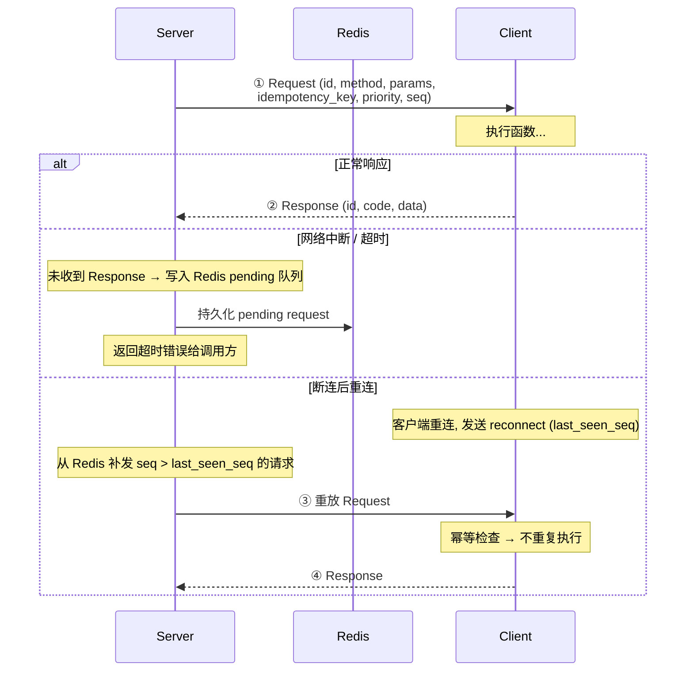
```mermaid
sequenceDiagram
    participant Server
    participant Redis
    participant Client

    Server->>Client: ① Request (id, method, params,<br/>idempotency_key, priority, seq)

    Note over Client: 执行函数...

    alt 正常响应
        Client-->>Server: ② Response (id, code, data)
    else 网络中断 / 超时
        Note over Server: 未收到 Response → 写入 Redis pending 队列
        Server->>Redis: 持久化 pending request
        Note over Server: 返回超时错误给调用方
    else 断连后重连
        Note over Client: 客户端重连, 发送 reconnect (last_seen_seq)
        Note over Server: 从 Redis 补发 seq > last_seen_seq 的请求
        Server->>Client: ③ 重放 Request
        Note over Client: 幂等检查 → 不重复执行
        Client-->>Server: ④ Response
    end
```

> **设计决策**：不使用 ACK 机制。服务端以 Response 作为唯一的送达确认。超时未收到 Response 则写入 Redis 等待重连重放，配合幂等键防止重复执行。这比 ACK + 重试更简洁，且功能等价。

### 3.3 层级 1：基础加固

#### 3.3.1 Pending 请求上限与背压

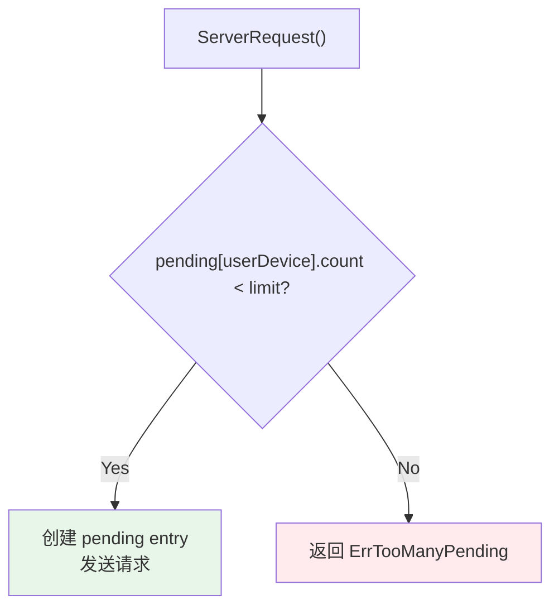
```mermaid
flowchart TD
    A["ServerRequest()"] --> B{"pending[userDevice].count < limit?"}
    B -->|Yes| C["创建 pending entry<br/>发送请求"]
    B -->|No| D["返回 ErrTooManyPending"]

    style C fill:#e8f5e9
    style D fill:#ffebee
```

- 每个 `(userID, deviceID)` 最多 N 个 pending 请求（可配置，默认 50）
- 超出返回 `ErrTooManyPending`，调用方可感知并决策

#### 3.3.2 Send 失败反馈

- `Client.Send()` 从非阻塞 `select default` 改为返回 `error`
- buffer 满时返回 `ErrSendBufferFull`
- 调用方（DeviceReverseRPC）收到错误后可选择重试或快速失败

#### 3.3.3 连接健康预检

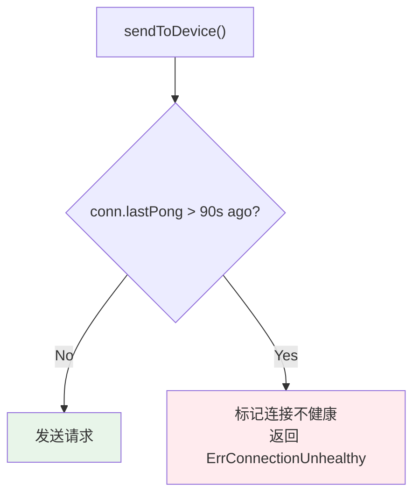
```mermaid
flowchart TD
    A["sendToDevice()"] --> B{"conn.lastPong > 90s ago?"}
    B -->|No| C["发送请求"]
    B -->|Yes| D["标记连接不健康<br/>返回 ErrConnectionUnhealthy"]

    style C fill:#e8f5e9
    style D fill:#ffebee
```

#### 3.3.4 连接断开 → 立即 Fail Pending

当检测到连接断开时，立即 fail 该 `(userID, deviceID)` 下所有 pending 请求（不等 timeout）。

### 3.4 层级 2：请求可靠性

> **设计决策**：不使用 ACK 机制。ACK 的功能（确认送达 + 触发重试）被 Redis 持久化 + 重连重放完全覆盖。移除 ACK 后层级 2 简化为：幂等性 + 客户端响应重试队列。

#### 3.4.1 客户端响应重试队列

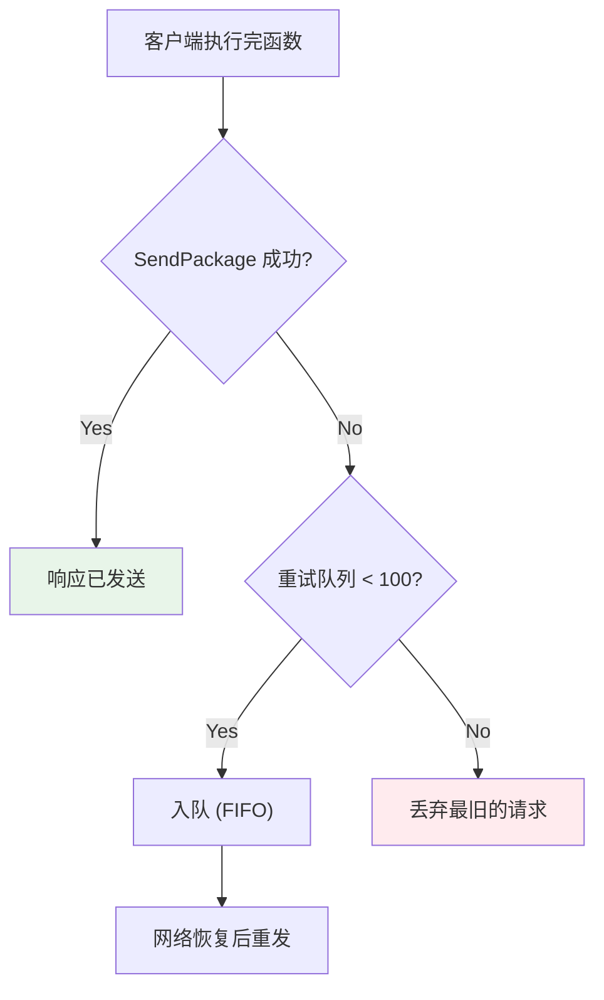
```mermaid
flowchart TD
    A["客户端执行完函数"] --> B{"SendPackage 成功?"}
    B -->|Yes| C["响应已发送"]
    B -->|No| D{"重试队列 < 100?"}
    D -->|Yes| E["入队 (FIFO)"]
    D -->|No| F["丢弃最旧的请求"]
    E --> G["网络恢复后重发"]

    style C fill:#e8f5e9
    style F fill:#ffebee
```

#### 3.4.2 幂等性保证

- 每个请求携带 `idempotency_key`（服务端生成，基于 reqID）
- 客户端维护最近 N 个 key 的 LRU 缓存（默认 1000）
- 重复 key 直接返回上次结果，不重复执行

### 3.5 层级 3：断连重放

#### 3.5.1 服务端请求持久化

- 超时未收到 Response 的请求写入 Redis
- Key: `rrpc:pending:{userID}:{deviceID}`
- TTL: 24h
- 客户端重连后服务端检查并重放

#### 3.5.2 客户端离线队列

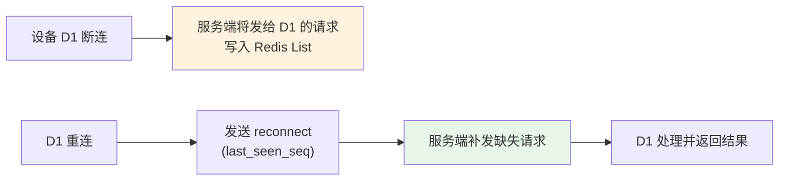
```mermaid
flowchart LR
    A["设备 D1 断连"] --> B["服务端将发给 D1 的请求<br/>写入 Redis List"]
    C["D1 重连"] --> D["发送 reconnect<br/>(last_seen_seq)"]
    D --> E["服务端补发缺失请求"]
    E --> F["D1 处理并返回结果"]

    style B fill:#fff3e0
    style E fill:#e8f5e9
```

#### 3.5.3 重连握手增强

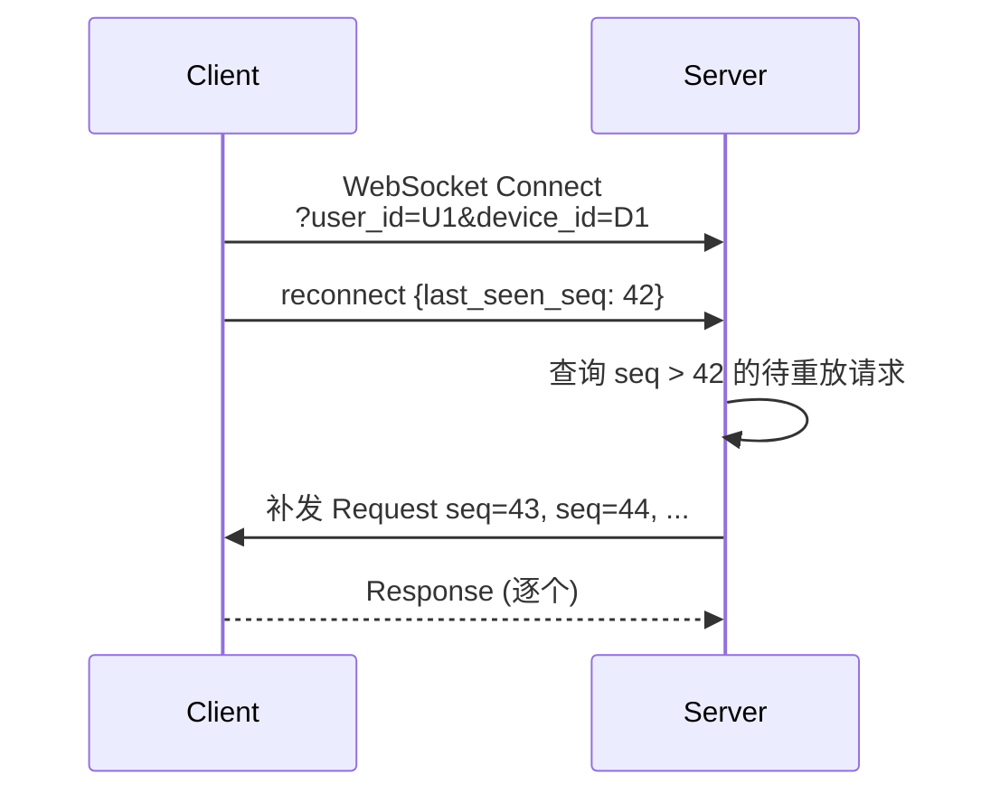
```mermaid
sequenceDiagram
    participant Client
    participant Server

    Client->>Server: WebSocket Connect<br/>?user_id=U1&device_id=D1
    Client->>Server: reconnect {last_seen_seq: 42}
    Server->>Server: 查询 seq > 42 的待重放请求
    Server->>Client: 补发 Request seq=43, seq=44, ...
    Client-->>Server: Response (逐个)
```

### 3.6 自适应超时策略

```text
基础超时 = 30s
实际超时 = 基础超时 × 网络质量因子

网络质量因子：
  - 最近 10 次请求平均 RTT < 200ms → 1.0x
  - RTT 200ms-1s → 1.5x
  - RTT 1s-5s → 2.0x
  - 有丢包记录 → 2.5x
```

---

## 4. Part II: Agent Tool 动态工具系统

### 4.1 整体架构

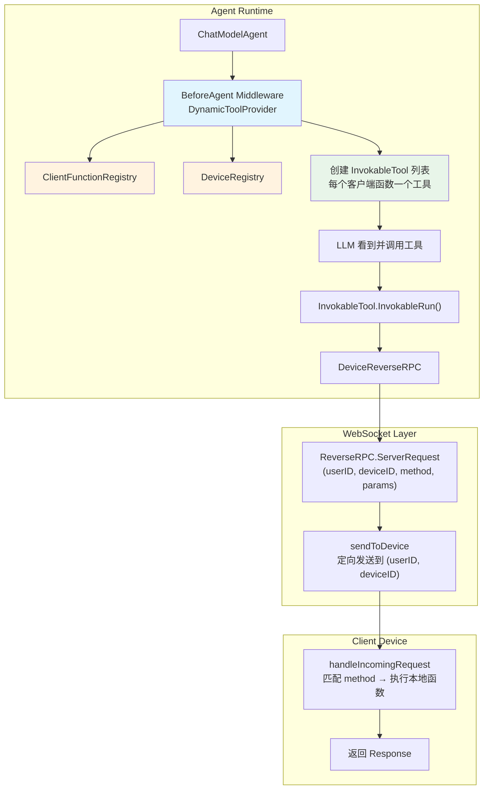
```mermaid
graph TB
    subgraph "Agent Runtime"
        A[ChatModelAgent] --> B[BeforeAgent Middleware<br/>DynamicToolProvider]
        B --> C[ClientFunctionRegistry]
        B --> D[DeviceRegistry]
        B --> E["创建 InvokableTool 列表<br/>每个客户端函数一个工具"]
        E --> F["LLM 看到并调用工具"]
        F --> G["InvokableTool.InvokableRun()"]
        G --> H[DeviceReverseRPC]
    end

    subgraph "WebSocket Layer"
        H --> I["ReverseRPC.ServerRequest<br/>(userID, deviceID, method, params)"]
        I --> J["sendToDevice<br/>定向发送到 (userID, deviceID)"]
    end

    subgraph "Client Device"
        J --> K["handleIncomingRequest<br/>匹配 method → 执行本地函数"]
        K --> L["返回 Response"]
    end

    style B fill:#e1f5fe
    style C fill:#fff3e0
    style D fill:#fff3e0
    style E fill:#e8f5e9
```

### 4.2 核心组件

| 组件 | 职责 | 存储 |
|------|------|------|
| **DeviceRegistry** | 维护 `(userID, deviceID) → *Client` 映射，强制一对一 | 内存 + Redis |
| **ClientFunctionRegistry** | 缓存每个设备的函数清单，带 TTL 过期 | 内存（主）+ Redis（持久化） |
| **DynamicToolProvider** | BeforeAgent 中间件，每次 Run 前从缓存创建工具 | 无状态 |
| **DeviceReverseRPC** | 增强 ReverseRPC，支持 `(userID, deviceID)` 定向发送 + 全部弱网优化 | 内存 |
| **FunctionManifestHandler** | 处理客户端连接时发送的函数清单注册 | 无状态 |

### 4.2.1 (userID, deviceID) 唯一连接约束（新约束）

> **重要**：当前服务端代码仅按 `userID` 管理连接（`clientsByUser[userID]map[connID]*Client`），不追踪 `deviceID`。本设计引入新约束：**每个 `(userID, deviceID)` 组合只允许一个活跃连接**。

**处理流程**：

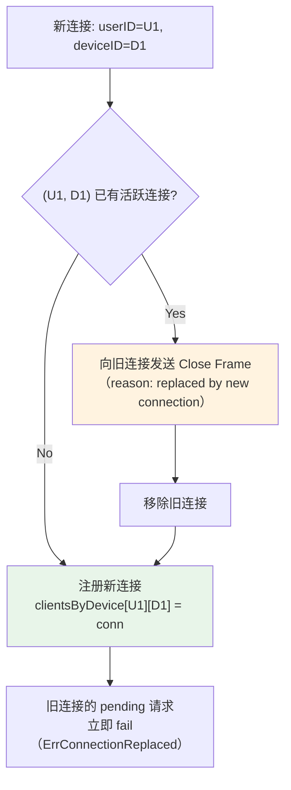
```mermaid
flowchart TD
    A["新连接: userID=U1, deviceID=D1"] --> B{"(U1, D1) 已有活跃连接?"}
    B -->|No| C["注册新连接<br/>clientsByDevice[U1][D1] = conn"]
    B -->|Yes| D["向旧连接发送 Close Frame<br/>（reason: replaced by new connection）"]
    D --> E["移除旧连接"]
    E --> C
    C --> F["旧连接的 pending 请求<br/>立即 fail（ErrConnectionReplaced）"]

    style C fill:#e8f5e9
    style D fill:#fff3e0
```

**实现要点**：

- 连接注册从 `clientsByUser[userID]map[connID]*Client` 改为 `clientsByDevice[userID]map[deviceID]*Client`
- WebSocket 连接参数新增 `device_id`：`/ws?user_id=U1&device_id=D1`
- 客户端 SDK 必须在连接时提供 `deviceID`（可由客户端生成或使用设备标识）
- 旧连接被替换时，其 pending 请求立即失败（不等 timeout）
- `sendToUser` 改为 `sendToDevice(userID, deviceID)` 定向发送

### 4.3 函数清单协议（Function Manifest）

客户端连接后主动向服务端声明自己有哪些函数：

```json
{
  "device_id": "desktop-abc123",
  "device_name": "My MacBook Pro",
  "device_type": "desktop",
  "functions": [
    {
      "name": "read_file",
      "description": "读取本地文件内容",
      "parameters": {
        "type": "object",
        "properties": {
          "path": {
            "type": "string",
            "description": "文件路径"
          }
        },
        "required": ["path"]
      },
      "returns": {
        "type": "string",
        "description": "文件内容"
      },
      "tags": ["filesystem", "read"],
      "timeout_ms": 5000
    },
    {
      "name": "execute_command",
      "description": "在本地执行 shell 命令",
      "parameters": {
        "type": "object",
        "properties": {
          "command": { "type": "string", "description": "Shell 命令" },
          "timeout_ms": { "type": "integer", "description": "超时时间" }
        },
        "required": ["command"]
      },
      "tags": ["system", "execute"],
      "timeout_ms": 30000
    }
  ]
}
```

### 4.4 设备连接与函数注册流程

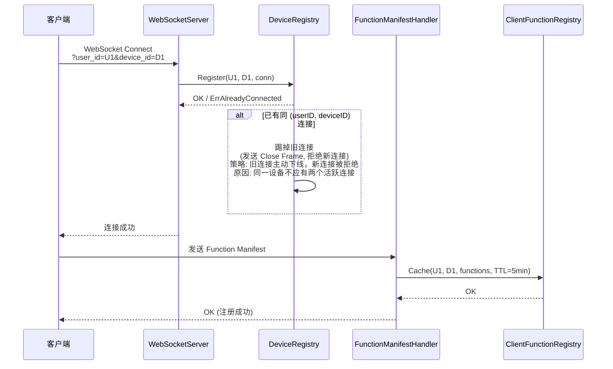
```mermaid
sequenceDiagram
    participant Client as 客户端
    participant WS as WebSocketServer
    participant DR as DeviceRegistry
    participant FMR as FunctionManifestHandler
    participant CFR as ClientFunctionRegistry

    Client->>WS: WebSocket Connect<br/>?user_id=U1&device_id=D1
    WS->>DR: Register(U1, D1, conn)
    DR-->>WS: OK / ErrAlreadyConnected

    alt 已有同 (userID, deviceID) 连接
        DR->>DR: 踢掉旧连接<br/>(发送 Close Frame, 拒绝新连接)<br/>策略: 旧连接主动下线，新连接被拒绝<br/>原因: 同一设备不应有两个活跃连接
    end

    WS-->>Client: 连接成功
    Client->>FMR: 发送 Function Manifest
    FMR->>CFR: Cache(U1, D1, functions, TTL=5min)
    CFR-->>FMR: OK
    FMR-->>Client: OK (注册成功)
```

### 4.5 Agent 调用客户端函数的完整流程

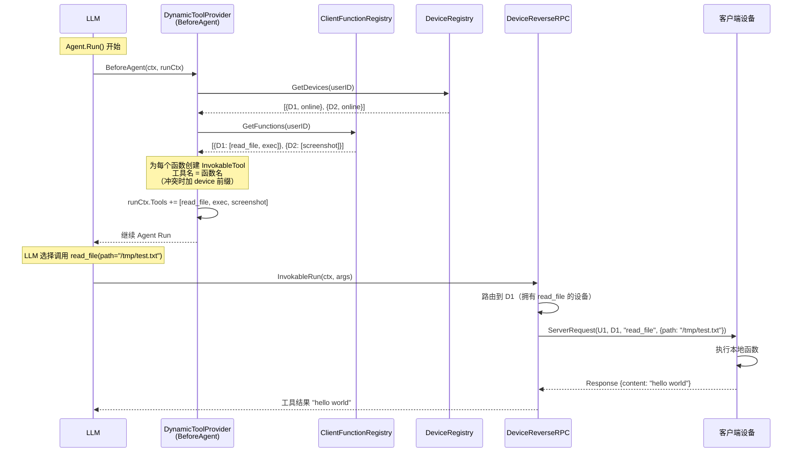
```mermaid
sequenceDiagram
    participant LLM as LLM
    participant MW as DynamicToolProvider<br/>(BeforeAgent)
    participant CFR as ClientFunctionRegistry
    participant DR as DeviceRegistry
    participant RRPC as DeviceReverseRPC
    participant Client as 客户端设备

    Note over LLM: Agent.Run() 开始
    LLM->>MW: BeforeAgent(ctx, runCtx)

    MW->>DR: GetDevices(userID)
    DR-->>MW: [{D1, online}, {D2, online}]

    MW->>CFR: GetFunctions(userID)
    CFR-->>MW: [{D1: [read_file, exec]}, {D2: [screenshot]}]

    Note over MW: 为每个函数创建 InvokableTool<br/>工具名 = 函数名<br/>（冲突时加 device 前缀）

    MW->>MW: runCtx.Tools += [read_file, exec, screenshot]
    MW-->>LLM: 继续 Agent Run

    Note over LLM: LLM 选择调用 read_file(path="/tmp/test.txt")
    LLM->>RRPC: InvokableRun(ctx, args)
    RRPC->>RRPC: 路由到 D1（拥有 read_file 的设备）
    RRPC->>Client: ServerRequest(U1, D1, "read_file", {path: "/tmp/test.txt"})
    Client->>Client: 执行本地函数
    Client-->>RRPC: Response {content: "hello world"}
    RRPC-->>LLM: 工具结果 "hello world"
```

### 4.6 工具命名与冲突解决

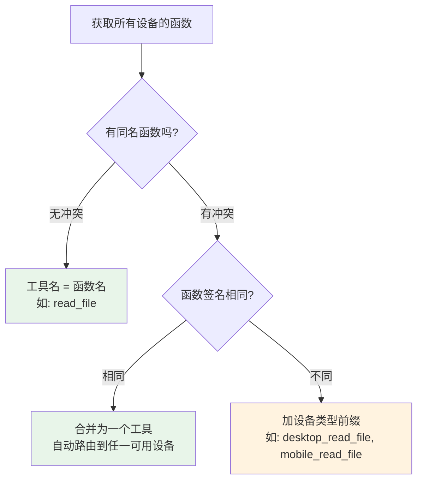
```mermaid
flowchart TD
    A["获取所有设备的函数"] --> B{"有同名函数吗?"}
    B -->|无冲突| C["工具名 = 函数名<br/>如: read_file"]
    B -->|有冲突| D{"函数签名相同?"}
    D -->|相同| E["合并为一个工具<br/>自动路由到任一可用设备"]
    D -->|不同| F["加设备类型前缀<br/>如: desktop_read_file, mobile_read_file"]

    style C fill:#e8f5e9
    style E fill:#e8f5e9
    style F fill:#fff3e0
```

**命名规则**：

1. 函数名全局唯一 → 直接用函数名
2. 多设备有同名同签名函数 → 合并为一个工具，内部自动选择可用设备
3. 多设备有同名不同签名函数 → 加 `device_type` 前缀（如 `desktop_read_file`）

### 4.7 多设备场景

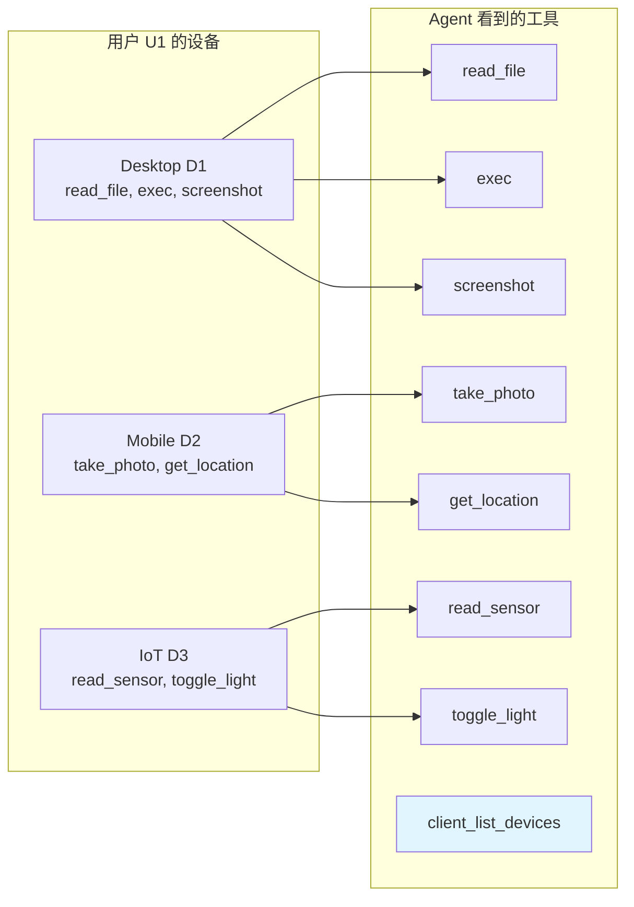
```mermaid
graph LR
    subgraph "用户 U1 的设备"
        D1["Desktop D1<br/>read_file, exec, screenshot"]
        D2["Mobile D2<br/>take_photo, get_location"]
        D3["IoT D3<br/>read_sensor, toggle_light"]
    end

    subgraph "Agent 看到的工具"
        T1["read_file"]
        T2["exec"]
        T3["screenshot"]
        T4["take_photo"]
        T5["get_location"]
        T6["read_sensor"]
        T7["toggle_light"]
        T0["client_list_devices"]
    end

    D1 --> T1 & T2 & T3
    D2 --> T4 & T5
    D3 --> T6 & T7

    style T0 fill:#e1f5fe
```

额外提供的管理工具 `client_list_devices`：LLM 可以主动查询当前用户有哪些设备在线、各自有什么函数。

### 4.8 设备路由策略

当多个设备有同名函数（合并为一个工具）时，内部如何选择设备：

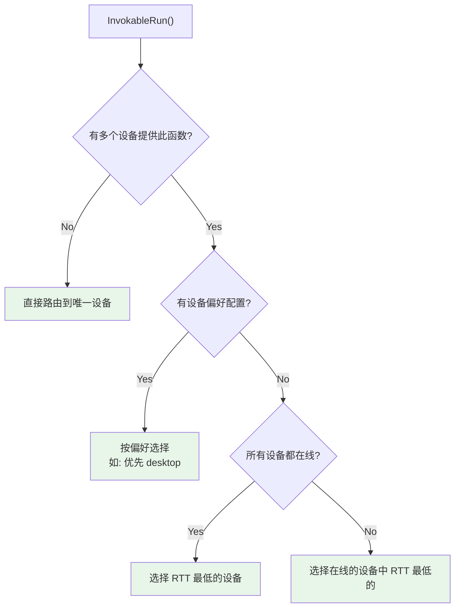
```mermaid
flowchart TD
    A["InvokableRun()"] --> B{"有多个设备提供此函数?"}
    B -->|No| C["直接路由到唯一设备"]
    B -->|Yes| D{"有设备偏好配置?"}
    D -->|Yes| E["按偏好选择<br/>如: 优先 desktop"]
    D -->|No| F{"所有设备都在线?"}
    F -->|Yes| G["选择 RTT 最低的设备"]
    F -->|No| H["选择在线的设备中 RTT 最低的"]

    style C fill:#e8f5e9
    style E fill:#e8f5e9
    style G fill:#e8f5e9
    style H fill:#e8f5e9
```

---

## 5. Protocol Extensions

### 5.1 新增包类型

```go
PackageTypeManifest  PackageType = 3  // 客户端发送函数清单
PackageTypeReconnect PackageType = 4  // 客户端断连重连后补发请求
```

### 5.2 增强的请求结构

```go
type PackageDataRequest struct {
    ID             string          `json:"id"`
    Method         string          `json:"method"`
    Params         json.RawMessage `json:"params"`
    IdempotencyKey string          `json:"idempotency_key,omitempty"` // 幂等键
    Priority       int             `json:"priority,omitempty"`        // 0=normal, 1=high, 2=critical
    Seq            uint64          `json:"seq,omitempty"`             // 服务端单调递增序号
}
```

### 5.3 Function Manifest 结构

```go
type FunctionManifest struct {
    DeviceID   string             `json:"device_id"`
    DeviceName string             `json:"device_name"`
    DeviceType string             `json:"device_type"`
    Functions  []FunctionInfo     `json:"functions"`
}

type FunctionInfo struct {
    Name        string          `json:"name"`
    Description string          `json:"description"`
    Parameters  json.RawMessage `json:"parameters"`   // JSON Schema
    Returns     *ReturnInfo     `json:"returns,omitempty"`
    Tags        []string        `json:"tags,omitempty"`
    TimeoutMs   int             `json:"timeout_ms,omitempty"`
}

type ReturnInfo struct {
    Type        string `json:"type"`
    Description string `json:"description"`
}
```

### 5.4 Reconnect 结构

```go
type PackageDataReconnect struct {
    DeviceID    string `json:"device_id"`
    LastSeenSeq uint64 `json:"last_seen_seq"`
}
```

---

## 6. Error Handling

### 6.1 工具调用错误处理全景

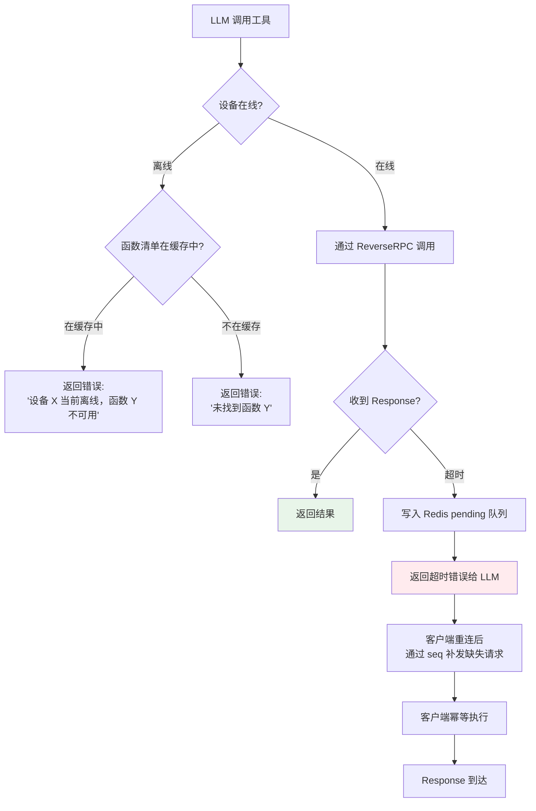
```mermaid
flowchart TD
    A["LLM 调用工具"] --> B{"设备在线?"}
    B -->|在线| C["通过 ReverseRPC 调用"]
    B -->|离线| D{"函数清单在缓存中?"}
    D -->|在缓存中| E["返回错误:<br/>'设备 X 当前离线，函数 Y 不可用'"]
    D -->|不在缓存| F["返回错误:<br/>'未找到函数 Y'"]

    C --> G{"收到 Response?"}
    G -->|是| H["返回结果"]
    G -->|超时| I["写入 Redis pending 队列"]
    I --> J["返回超时错误给 LLM"]

    J --> K["客户端重连后<br/>通过 seq 补发缺失请求"]
    K --> L["客户端幂等执行"]
    L --> M["Response 到达"]

    style H fill:#e8f5e9
    style J fill:#ffebee
```

### 6.2 错误类型

```go
// 工具调用相关错误
var (
    ErrDeviceOffline       = errors.New("device offline")
    ErrFunctionNotFound    = errors.New("function not found")
    ErrTooManyPending      = errors.New("too many pending requests")
    ErrSendBufferFull      = errors.New("send buffer full")
    ErrConnectionUnhealthy = errors.New("connection unhealthy")
    ErrRequestTimeout      = errors.New("request timeout")
    ErrAllDevicesFailed    = errors.New("all devices failed")
)
```

### 6.3 降级策略

| 场景 | 降级行为 |
|------|----------|
| 设备离线但有缓存 | 工具可见但调用返回 `ErrDeviceOffline`，LLM 可决策换设备 |
| 所有设备都离线 | `client_list_devices` 返回空列表，LLM 告知用户 |
| 函数执行超时 | 返回超时错误，LLM 可重试或换策略 |
| 函数清单缓存过期 | BeforeAgent 尝试刷新，刷新失败用旧缓存（stale-while-revalidate） |

---

## 7. Configuration

### 7.1 Agent YAML 配置

```yaml
# agents/my-agent.md
---
name: my-smart-agent
description: Agent with client device capabilities
tools:
  - get_weather          # 静态服务端工具
  - get_current_time      # 静态服务端工具
  # 不需要显式配置客户端工具 —— 动态注入
tool_config:
  client_tools:
    enabled: true
    device_filter: []            # 空 = 所有设备；可指定 ["desktop"] 过滤
    function_tags: []            # 空 = 所有函数；可指定 ["filesystem", "system"] 过滤
    excluded_functions: []       # 排除特定函数名
    cache_ttl: 300s              # 函数清单缓存 TTL
    call_timeout: 30s            # 默认调用超时
---
```

### 7.2 服务端配置

```yaml
# config.yaml
reverse_rpc:
  max_pending_per_device: 50      # 每个设备最大 pending 请求数
  request_timeout: 30s            # 请求超时时间（自适应，可被网络质量因子放大）
  request_ttl: 24h                # 请求在 Redis 中的存活时间
  max_functions_per_device: 200   # 每个设备最大函数数

client_tools:
  enabled: true
  default_cache_ttl: 300s         # 函数清单默认缓存 TTL
  max_functions_per_device: 200   # 每个设备最大函数数
  conflict_resolution: "prefix"   # "prefix" | "error" | "merge"
```

---

## 8. Integration Points

### 8.1 与现有系统的集成

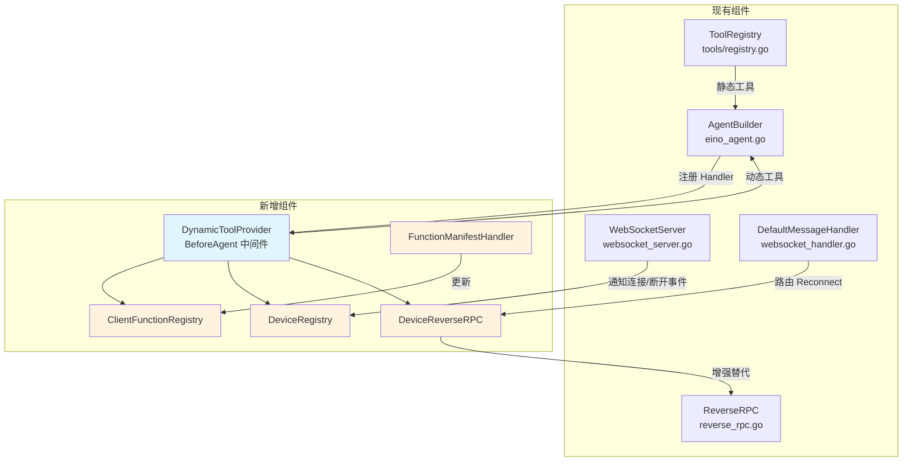
```mermaid
graph TB
    subgraph "现有组件"
        AB[AgentBuilder<br/>eino_agent.go]
        TR[ToolRegistry<br/>tools/registry.go]
        RR[ReverseRPC<br/>reverse_rpc.go]
        WS[WebSocketServer<br/>websocket_server.go]
        DMH[DefaultMessageHandler<br/>websocket_handler.go]
    end

    subgraph "新增组件"
        DTP[DynamicToolProvider<br/>BeforeAgent 中间件]
        DR[DeviceRegistry]
        CFR[ClientFunctionRegistry]
        DRPC[DeviceReverseRPC]
        FMH[FunctionManifestHandler]
    end

    AB -->|"注册 Handler"| DTP
    TR -->|"静态工具"| AB
    DTP -->|"动态工具"| AB
    DTP --> CFR
    DTP --> DR
    DTP --> DRPC
    DRPC -->|"增强替代"| RR
    FMH -->|"更新"| CFR
    WS -->|"通知连接/断开事件"| DR
    DMH -->|"路由 Reconnect"| DRPC

    style DTP fill:#e1f5fe
    style DR fill:#fff3e0
    style CFR fill:#fff3e0
    style DRPC fill:#fff3e0
    style FMH fill:#fff3e0
```

### 8.2 中间件注册顺序

按照 Eino 推荐的中间件顺序，DynamicToolProvider 应放在靠后的位置（在文件系统、Skill 等之后）：

```go
Handlers: []adk.ChatModelAgentMiddleware{
    patchToolCallsMW,     // 1. Fix message history first
    agentsMdMW,           // 2. Inject reference docs
    summarizationMW,      // 3. Compress if needed
    reductionMW,          // 4. Handle large tool results
    filesystemMW,         // 5. Add file tools
    skillMW,              // 6. Add skill discovery
    planTaskMW,           // 7. Add task management
    dynamicToolProviderMW, // 8. Add client device tools (新增)
}
```

### 8.3 客户端 SDK 扩展

客户端 SDK 需要新增：

1. `RegisterFunctions(manifest FunctionManifest)` — 注册函数清单
2. `RegisterFunctionHandler(name string, handler RequestHandlerFunc)` — 注册函数处理（已有）
3. 内部维护响应重试队列和幂等 key 缓存
4. 连接成功后自动发送 Function Manifest

---

## Appendix: Scenario Flows

### A. 正常调用流程

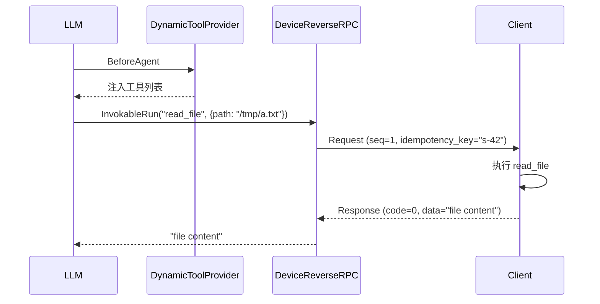
```mermaid
sequenceDiagram
    participant LLM
    participant DTP as DynamicToolProvider
    participant RRPC as DeviceReverseRPC
    participant Client

    LLM->>DTP: BeforeAgent
    DTP-->>LLM: 注入工具列表

    LLM->>RRPC: InvokableRun("read_file", {path: "/tmp/a.txt"})
    RRPC->>Client: Request (seq=1, idempotency_key="s-42")
    Client->>Client: 执行 read_file
    Client-->>RRPC: Response (code=0, data="file content")
    RRPC-->>LLM: "file content"
```

### B. 弱网 + 超时 + Redis 重放

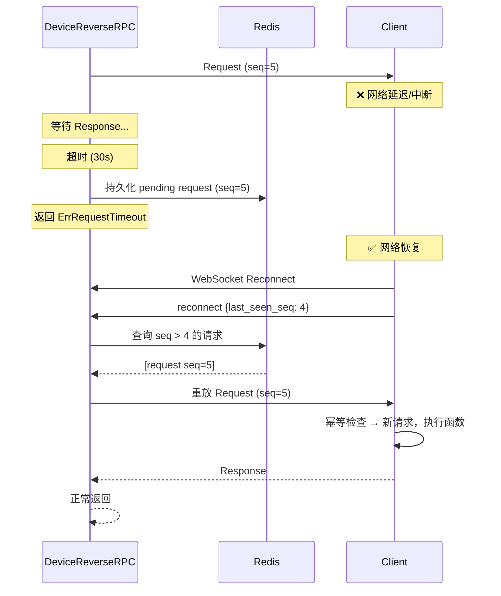
```mermaid
sequenceDiagram
    participant RRPC as DeviceReverseRPC
    participant Redis
    participant Client

    RRPC->>Client: Request (seq=5)
    Note over Client: ❌ 网络延迟/中断
    Note over RRPC: 等待 Response...
    Note over RRPC: 超时 (30s)
    RRPC->>Redis: 持久化 pending request (seq=5)
    Note over RRPC: 返回 ErrRequestTimeout

    Note over Client: ✅ 网络恢复
    Client->>RRPC: WebSocket Reconnect
    Client->>RRPC: reconnect {last_seen_seq: 4}
    RRPC->>Redis: 查询 seq > 4 的请求
    Redis-->>RRPC: [request seq=5]
    RRPC->>Client: 重放 Request (seq=5)
    Client->>Client: 幂等检查 → 新请求，执行函数
    Client-->>RRPC: Response
    RRPC-->>RRPC: 正常返回
```

### C. 断连 + 多请求重放

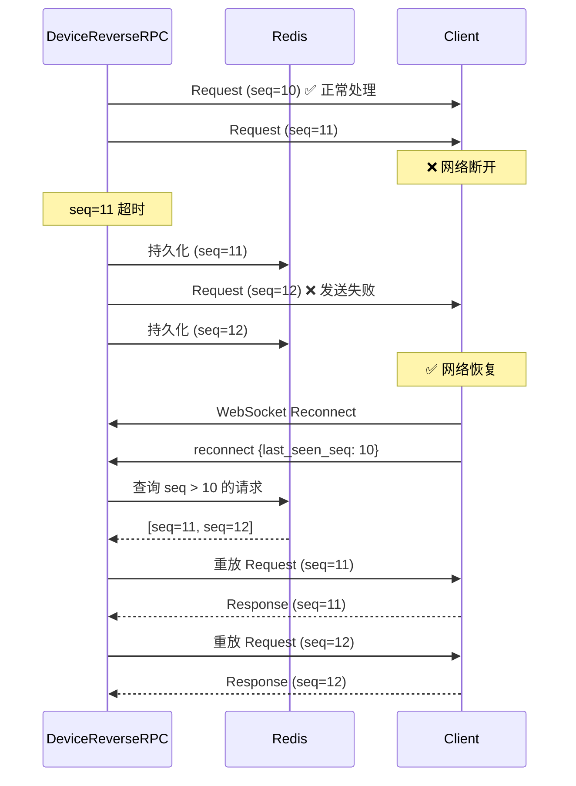
```mermaid
sequenceDiagram
    participant RRPC as DeviceReverseRPC
    participant Redis
    participant Client

    RRPC->>Client: Request (seq=10) ✅ 正常处理
    RRPC->>Client: Request (seq=11)
    Note over Client: ❌ 网络断开
    Note over RRPC: seq=11 超时
    RRPC->>Redis: 持久化 (seq=11)
    RRPC->>Client: Request (seq=12) ❌ 发送失败
    RRPC->>Redis: 持久化 (seq=12)

    Note over Client: ✅ 网络恢复
    Client->>RRPC: WebSocket Reconnect
    Client->>RRPC: reconnect {last_seen_seq: 10}
    RRPC->>Redis: 查询 seq > 10 的请求
    Redis-->>RRPC: [seq=11, seq=12]
    RRPC->>Client: 重放 Request (seq=11)
    Client-->>RRPC: Response (seq=11)
    RRPC->>Client: 重放 Request (seq=12)
    Client-->>RRPC: Response (seq=12)
```

### D. 多设备同名函数合并

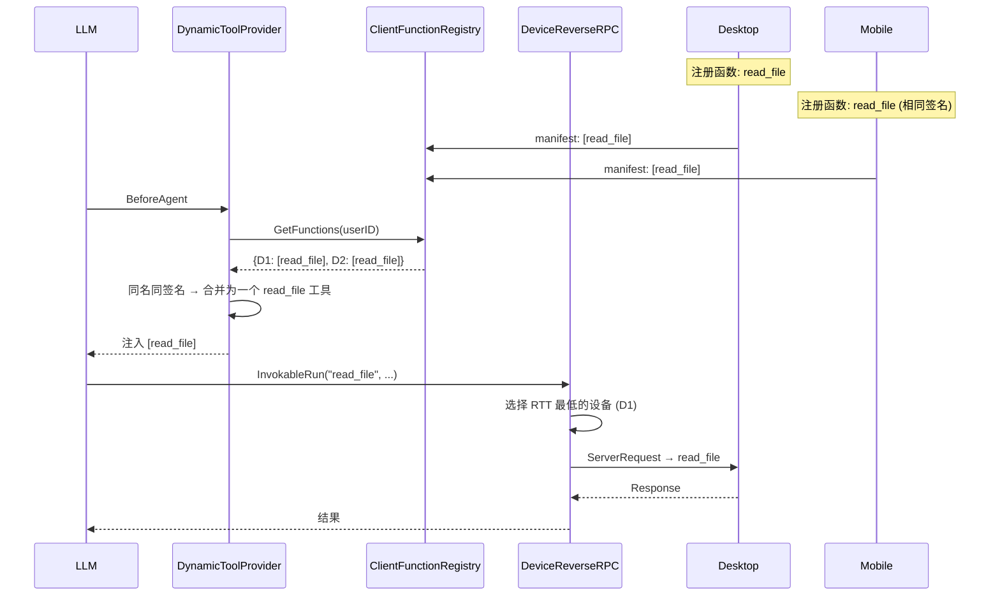
```mermaid
sequenceDiagram
    participant LLM
    participant DTP as DynamicToolProvider
    participant CFR as ClientFunctionRegistry
    participant RRPC as DeviceReverseRPC
    participant D1 as Desktop
    participant D2 as Mobile

    Note over D1: 注册函数: read_file
    Note over D2: 注册函数: read_file (相同签名)
    D1->>CFR: manifest: [read_file]
    D2->>CFR: manifest: [read_file]

    LLM->>DTP: BeforeAgent
    DTP->>CFR: GetFunctions(userID)
    CFR-->>DTP: {D1: [read_file], D2: [read_file]}
    DTP->>DTP: 同名同签名 → 合并为一个 read_file 工具
    DTP-->>LLM: 注入 [read_file]

    LLM->>RRPC: InvokableRun("read_file", ...)
    RRPC->>RRPC: 选择 RTT 最低的设备 (D1)
    RRPC->>D1: ServerRequest → read_file
    D1-->>RRPC: Response
    RRPC-->>LLM: 结果
```

### E. 客户端响应发送失败 + 重试

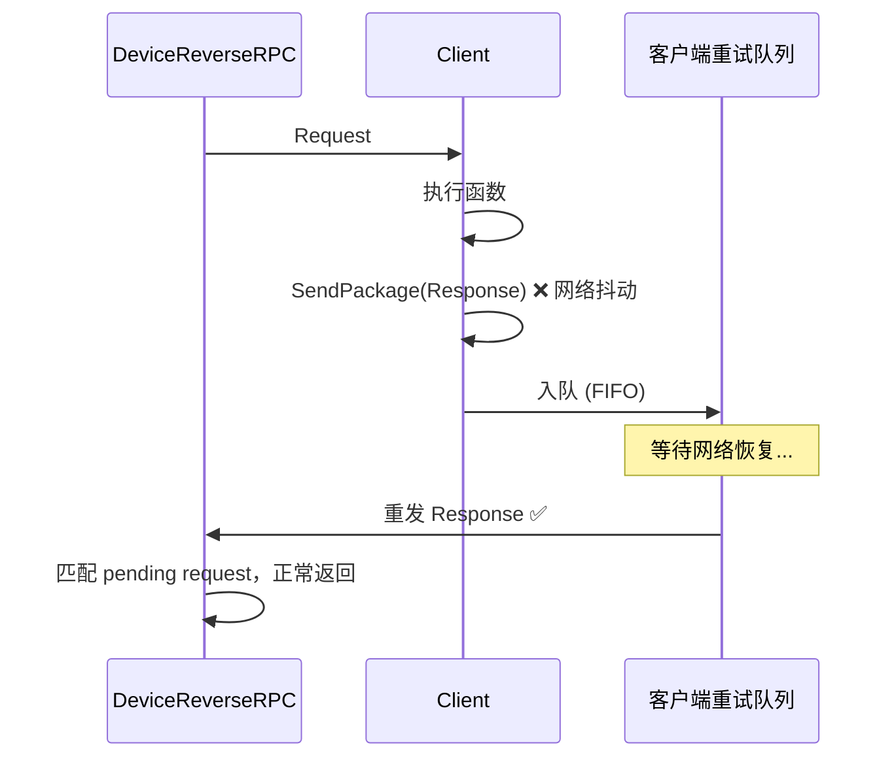
```mermaid
sequenceDiagram
    participant RRPC as DeviceReverseRPC
    participant Client
    participant Queue as 客户端重试队列

    RRPC->>Client: Request
    Client->>Client: 执行函数
    Client->>Client: SendPackage(Response) ❌ 网络抖动
    Client->>Queue: 入队 (FIFO)
    Note over Queue: 等待网络恢复...
    Queue->>RRPC: 重发 Response ✅
    RRPC->>RRPC: 匹配 pending request，正常返回
```
