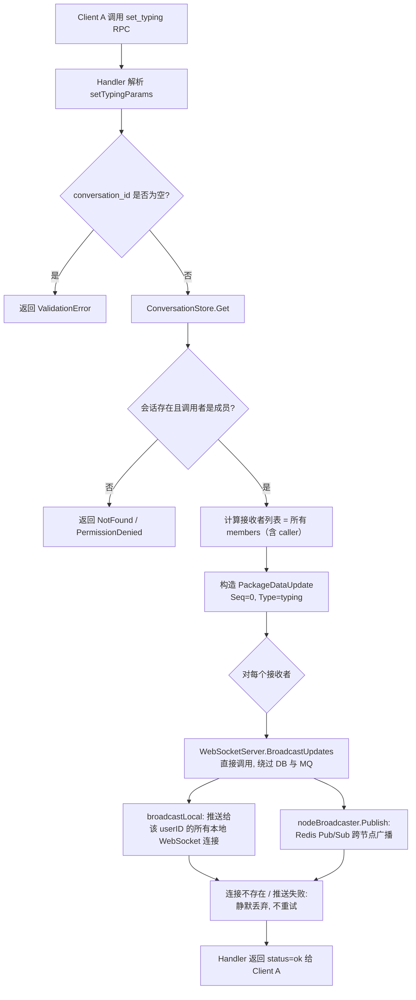
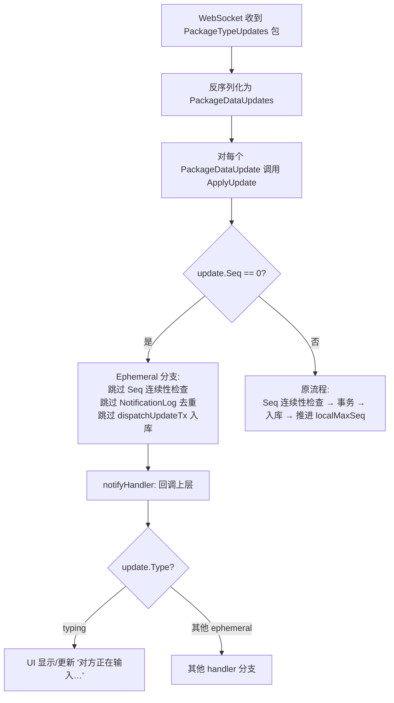
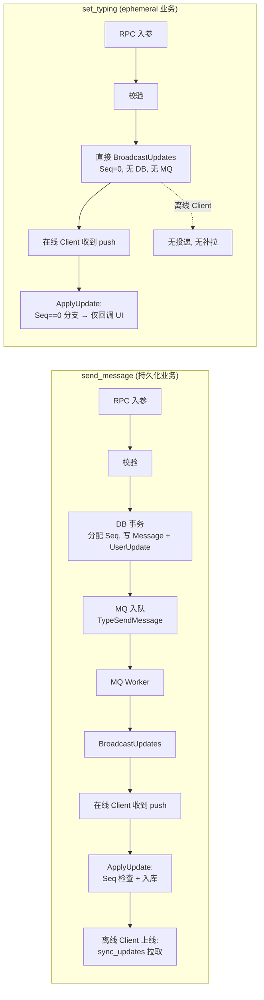
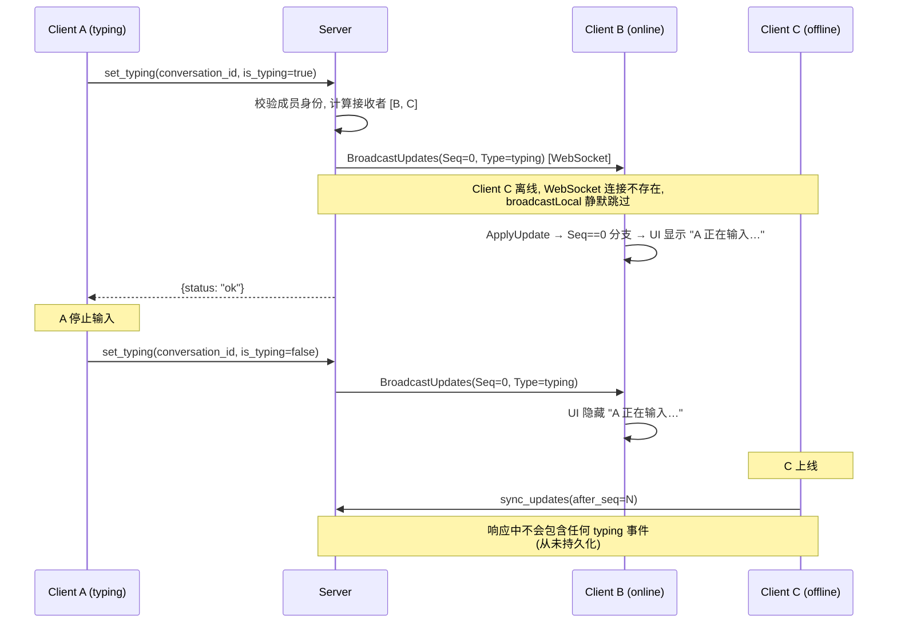

# Typing / Ephemeral Push 场景设计提案

> 创建日期：2026-07-10
> 状态：提案（未实施）
> 目的：梳理代码现状，并设计"Typing 指示器"类 ephemeral 业务的处理流程（SEQ=0，仅推送在线用户，离线不拉取）。

---

## 1. 现状调研

### 1.1 搜索结论

经过对 Server 端（Go）与 Client 端（Go CLI / 库客户端）代码的全量搜索，**当前代码库中不存在 "Typing" 场景的实现，也没有任何 SEQ=0、仅在线推送、离线不拉取的 ephemeral 业务机制。**

`typing` 字符串仅在开发者文档中作为"假设新增 UpdateType 时的示例"出现过：

> "当需要新增一种 Update 类型（如 `reaction`、`typing` 等）时，按以下步骤操作。"
> —— [docs/DEVELOPER_GUIDE.md:522](DEVELOPER_GUIDE.md#L522)

此外，[internal/mq/mq.go:74](../internal/mq/mq.go#L74) 定义了常量 `TypePresenceBroadcast = "mq:presence_broadcast"`，但**未注册任何处理函数**（参见 [project-context.md:98](../.claude/skills/xyncra-task-planner/references/project-context.md#L98)）。Presence 是规划中但尚未实现的功能。

### 1.2 当前架构哲学

整个 Xyncra 系统遵循 **"持久化优先 + 在线推送 best-effort + 离线 sync_updates 兜底"** 的哲学，记录在 [docs/PRODUCT_DECISIONS.md:292-305](PRODUCT_DECISIONS.md#L292-L305) 的决策 D-007 中：

- 消息 / 会话变更 / 已读游标等**所有**业务数据先进 DB 事务
- MQ 入队（用于 WebSocket 实时推送）是**异步 best-effort**，失败不阻塞主流程
- 离线用户通过 `sync_updates(after_seq=N)` 拉取增量，保证最终一致性
- WebSocket 推送路径（`BroadcastUpdates`）对持久化**无感知**——只负责把 `PackageDataUpdates` 序列化后发给当前连接

这意味着：**架构中没有为"不持久化"的消息预留位置**。每条消息都有真实 seq ≥ 1；seq=0 仅在 `sync_updates` 的 `after_seq` 参数中作为"从头拉取"的哨兵值使用（[internal/handler/sync_updates.go:20](../internal/handler/sync_updates.go#L20)）。

### 1.3 相关机制盘点

| 机制 | 文件位置 | 性质 | 是否 SEQ=0 | 是否离线不拉取 |
|---|---|---|---|---|
| `UpdateTypeGap` | [pkg/protocol/protocol.go:20-27](../pkg/protocol/protocol.go#L20-L27) | 同步修复用的运行时填充符，不入 store | 否（占位真实 seq） | 是（内部机制） |
| D-007 fire-and-forget | [PRODUCT_DECISIONS.md:292-305](PRODUCT_DECISIONS.md#L292-L305) | 设计哲学 | 否 | 否 |
| `BroadcastUpdates` | [websocket_server.go:640-655](../internal/server/websocket_server.go#L640-L655) | 在线推送管道 | 否 | 否（数据已持久化） |
| `TypePresenceBroadcast` | [mq.go:74](../internal/mq/mq.go#L74) | 常量已定义，未注册 handler | — | — |
| heartbeat `device_info` | [heartbeat.go:20-78](../internal/handler/heartbeat.go#L20-L78) | 仅日志，不持久化，不推送 | — | — |

---

## 2. 协议与代码关键位置

### 2.1 协议层

**信封类型**（[pkg/protocol/protocol.go:8-18](../pkg/protocol/protocol.go#L8-L18)）：

```go
type PackageType uint8
const (
    PackageTypeRequest  PackageType = iota  // 客户端发起的 RPC
    PackageTypeResponse                     // 服务端响应
    PackageTypeUpdates                      // 服务端推送的数据更新
)
```

**UpdateType 业务标签**（[pkg/protocol/protocol.go:20-27](../pkg/protocol/protocol.go#L20-L27)）：

```go
const (
    UpdateTypeMessage       = "message"
    UpdateTypeDeleteMessage = "delete_message"
    UpdateTypeMarkRead      = "mark_read"
    UpdateTypeConversation  = "conversation"
    UpdateTypeGap           = "gap"             // runtime only, never persisted
)
```

**推送负载结构**（[pkg/protocol/protocol.go:70-85](../pkg/protocol/protocol.go#L70-L85)）：

```go
type PackageDataUpdates struct {
    Updates []PackageDataUpdate `json:"updates"`
}
type PackageDataUpdate struct {
    Seq       uint32          `json:"seq"`
    Type      string          `json:"type"`
    Payload   json.RawMessage `json:"payload"`
    CreatedAt time.Time       `json:"created_at,omitempty"`
}
```

### 2.2 Server 端 send_message 流程（参考对照）

[internal/handler/send_message.go:79-191](../internal/handler/send_message.go#L79-L191)：

1. 解析并校验参数
2. 查会话并验证发送者成员身份
3. 构造 `model.Message`
4. **DB 事务**内原子分配 MessageID、per-user seq，写入 `Message` + `UserUpdate` + 更新会话元数据
5. 构造 MQ 任务（`TypeSendMessage`），**fire-and-forget** 入队
6. 返回响应

MQ Worker 端最终调用 `BroadcastUpdates(userID, updates)` → `broadcastLocal` + Redis Pub/Sub 跨节点广播。

### 2.3 Client 端 update 接收流程

[pkg/client/sync.go:157-218](../pkg/client/sync.go#L157-L218) `ApplyUpdate`：

1. 读 `localMaxSeq`
2. **Seq 连续性检查**：
   - `update.Seq <= localMaxSeq` → 跳过（已处理）
   - `update.Seq > localMaxSeq + 1` → 触发 debounced pull
   - `update.Seq == localMaxSeq + 1` → 继续
3. 事务内：写 `NotificationLog` 去重 → `dispatchUpdateTx` → 推进 `localMaxSeq`
4. 事务提交后通知上层 handler

[pkg/client/sync.go:226-241](../pkg/client/sync.go#L226-L241) `dispatchUpdateTx`：

```go
switch update.Type {
case protocol.UpdateTypeMessage:       return sm.handleMessageTx(ctx, tx, update.Payload)
case protocol.UpdateTypeDeleteMessage: return sm.handleDeleteMessageTx(ctx, tx, update.Payload)
case protocol.UpdateTypeMarkRead:      return sm.handleMarkReadTx(ctx, tx, update.Payload)
case protocol.UpdateTypeConversation:  return sm.handleConversationTx(ctx, tx, update.Payload)
case protocol.UpdateTypeGap:           return nil      // ← 唯一不入本地库的分支
default:                               return fmt.Errorf("unknown update type: %s", update.Type)
}
```

---

## 3. 设计提案：`set_typing` Ephemeral Push

### 3.1 设计目标

- 用户在会话中输入时，向会话其他成员实时广播 typing 状态
- **不持久化**：typing 事件不进 `Message` / `UserUpdate` / 任何 store
- **不分配真实 seq**：使用 `Seq=0` 作为 ephemeral 标识
- **离线不投递**：不入 MQ 重试队列；用户离线时直接丢失
- **上线不补拉**：`sync_updates` 永远看不到 typing 事件
- **协议兼容**：复用 `PackageDataUpdates` 信封，让 Client 推送管道保持不变

### 3.2 方案对比

| 方案 | 描述 | 优点 | 缺点 |
|---|---|---|---|
| **A. 新增 RPC `set_typing` + 直接 BroadcastUpdates** | 服务端新增轻量 RPC，校验后直接调用 `BroadcastUpdates`，绕过 DB 与 MQ | 改动最小；复用现有推送信封；与 D-007 哲学一致（推送失败可容忍） | 需要在 Client 的 `ApplyUpdate` 增加 ephemeral 分支 |
| B. 新定义 `PackageTypeEphemeral` 信封 | 在协议层新增一种 PackageType，与 Updates 并列 | 协议层语义清晰，Client 接收时按信封类型分流 | 需要修改协议层、WebSocket 分发、Client 包解析，侵入性大 |
| C. 复用 heartbeat 双向通道 | 客户端在 heartbeat 中携带 typing 字段，服务端在 heartbeat 响应中带回对方的 typing | 完全绕过新 RPC | heartbeat 是请求/响应模式，不适合多成员广播；语义耦合严重 |

**推荐：方案 A**。改动量最小，与现有架构契合度最高。

### 3.3 推荐方案详细设计

#### 3.3.1 协议扩展

[pkg/protocol/protocol.go](../pkg/protocol/protocol.go) 新增常量：

```go
const (
    // ... existing UpdateTypes ...
    UpdateTypeTyping = "typing"   // ephemeral: Seq=0, never persisted, never pulled
)
```

复用 `PackageDataUpdate`，`Seq=0` 作为 ephemeral 标识。

新增 RPC 请求/响应结构（放在 `internal/handler/set_typing.go`）：

```go
type setTypingParams struct {
    ConversationID string `json:"conversation_id"`
    IsTyping       bool   `json:"is_typing"`
}
type setTypingResponse struct {
    Status string `json:"status"` // "ok"
}
```

#### 3.3.2 Server 端：`set_typing` Handler

新增 [internal/handler/set_typing.go](../internal/handler/set_typing.go)：

1. 解析 `setTypingParams`
2. 校验 `conversation_id` 必填
3. 从 `ConversationStore` 取会话，验证调用者是成员
4. 计算接收者列表：所有成员（包括 caller 自身的其他设备）
5. 构造 `PackageDataUpdate{Seq: 0, Type: "typing", Payload: {user_id, conversation_id, is_typing, ts}}`
6. 对每个接收者调用 `BroadcastUpdates(userID, updates)`（绕过 DB、绕过 MQ）
7. 返回 `{status: "ok"}`

> 关键点：**Handler 直接持有 `*WebSocketServer` 引用**（或通过接口注入的 `Broadcaster`），不调用 `store.SendMessage` 事务，也不入 MQ。

#### 3.3.3 Client 端：Ephemeral Push 处理

[pkg/client/sync.go](../pkg/client/sync.go) `ApplyUpdate` 在连续性检查之前插入 ephemeral 分支：

```go
func (sm *syncManager) ApplyUpdate(ctx context.Context, update *protocol.PackageDataUpdate) error {
    // 0. Ephemeral updates (Seq == 0) bypass seq continuity and persistence.
    if update.Seq == 0 {
        sm.notifyHandler(ctx, update)   // 直接回调上层，不入本地库
        return nil
    }

    // 1-5. existing logic unchanged
    // ...
}
```

并在 `dispatchUpdateTx` 中新增：

```go
case protocol.UpdateTypeTyping:
    return nil   // 不入 DB，类似 UpdateTypeGap
```

上层 handler 通过 `notifyHandler` 收到的 `update.Type == "typing"` 事件，驱动 UI 显示"对方正在输入…"。

### 3.4 关键代码位置汇总

| 关注点 | 文件 | 行 |
|---|---|---|
| UpdateType 常量 | [pkg/protocol/protocol.go](../pkg/protocol/protocol.go) | 20-27 |
| 推送信封 | [pkg/protocol/protocol.go](../pkg/protocol/protocol.go) | 70-85 |
| send_message（参考流程） | [internal/handler/send_message.go](../internal/handler/send_message.go) | 79-191 |
| WebSocket 广播 | [internal/server/websocket_server.go](../internal/server/websocket_server.go) | 640-684 |
| Client ApplyUpdate | [pkg/client/sync.go](../pkg/client/sync.go) | 157-218 |
| Client dispatchUpdateTx | [pkg/client/sync.go](../pkg/client/sync.go) | 226-241 |
| 已注册 MQ 任务清单 | [.claude/skills/xyncra-task-planner/references/project-context.md](../.claude/skills/xyncra-task-planner/references/project-context.md) | 92-98 |
| D-007 fire-and-forget 决策 | [PRODUCT_DECISIONS.md](PRODUCT_DECISIONS.md) | 292-305 |

---

## 4. Mermaid 流程图

### 4.1 Server 端：`set_typing` 处理流程



### 4.2 Client 端：Ephemeral Push 接收流程



### 4.3 整体对比：send_message vs. set_typing



### 4.4 同一会话内多端广播时序



---

## 5. 影响面与风险

### 5.1 代码改动点清单

1. `pkg/protocol/protocol.go`：新增 `UpdateTypeTyping` 常量
2. `internal/handler/set_typing.go`：**新增** Handler 文件
3. `cmd/xyncra-server/main.go`（或 server 初始化处）：注册 `set_typing` method → handler
4. `pkg/client/sync.go`：`ApplyUpdate` 增加 `Seq==0` 前置分支；`dispatchUpdateTx` 增加 `UpdateTypeTyping` 分支
5. `pkg/client/handler.go`（或上层回调接口）：新增 `OnTyping` 回调
6. 测试：新增 `set_typing` 单测、E2E 测试（在线接收 / 离线不接收 / 上线不补拉）

### 5.2 风险与缓解

| 风险 | 缓解 |
|---|---|
| `Seq=0` 被误判为"已处理"而丢弃 | 在 `ApplyUpdate` 入口增加 `if update.Seq == 0` 前置分支 |
| 恶意用户高频 `set_typing` 导致广播风暴 | 在 handler 内做 per-user rate limit（如 1次/秒/会话） |
| Client 旧版本不识别 `Seq=0` 而走 default 报错 | 协议兼容：旧 client 会返回 "unknown update type" 错误，但不会崩溃；可通过 capability 协商 |
| 跨节点 Pub/Sub 丢消息 | 与 D-007 一致：ephemeral 业务容忍丢失，无需补偿 |
| Handler 需要 WebSocketServer 引用，引入新依赖 | 通过接口注入 `Broadcaster`，保持 handler 可测试 |

### 5.3 与现有决策的一致性

- **D-007（fire-and-forget）**：`set_typing` 的推送同样是 best-effort，且**更加宽松**——连持久化都不需要
- **D-010（心跳被动续期）**：无冲突
- **D-018（跨节点 Pub/Sub）**：复用 `nodeBroadcaster.Publish` 路径

---

## 6. 未来扩展

同一机制可承载的 ephemeral 业务（都满足 `Seq=0` 约定）：

- **Presence（在线状态）**：`UpdateTypePresence`，用户上线/离线/忙碌
- **Read receipt preview**：正在看某条消息的"预览"
- **Voice/Video call signal**：呼叫信令（轻量、瞬时）
- **Reactions（表情回应）的"预览"**：长按未发送的表情

这些业务都可复用 §3.3 的设计模式，只需新增 `UpdateType` 常量与对应的 handler/回调。
