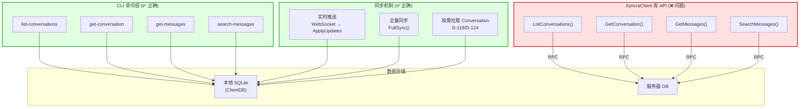
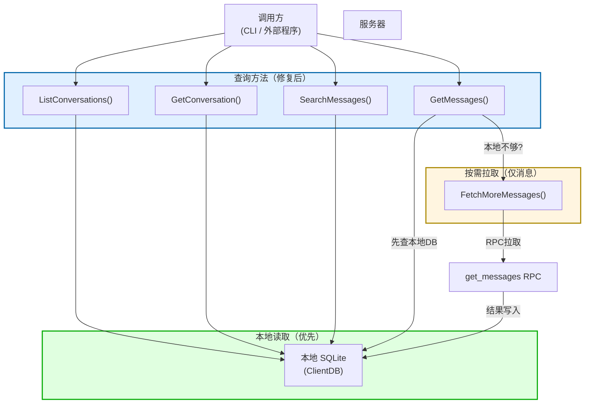
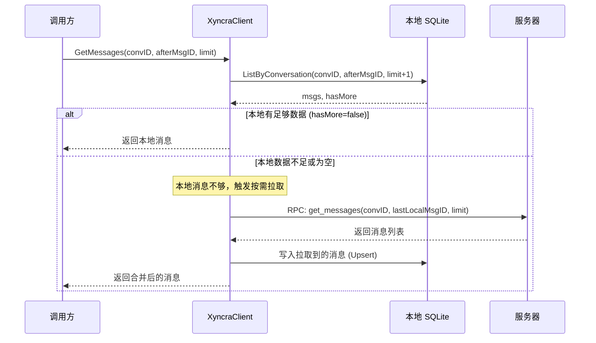
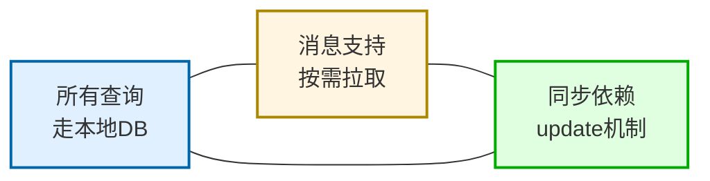

# Client 查询架构 Review：本地DB优先 + 按需拉取

> **状态**: ✅ 已修复 (日期: 2026-07-16)
>
> 本次修复包括：
>
> - XyncraClient 4 个查询方法改为读取本地 DB（D-035）
> - 新增 FetchMoreMessages 按需拉取方法（D-126）
> - 修复 restore_conversation fallback 逻辑
> - 新增 reload-agents CLI 命令（D-076）
> - list-conversations 输出改用 tabwriter（D-041）

> **审查日期**：2026-07-16
> **审查范围**：`pkg/client/`、`pkg/store/`、`internal/cli/`
> **核心原则**：
> 1. 所有查询功能从 client 本地数据库读取
> 2. 对话内消息支持按需从服务器拉取
> 3. 数据同步依赖 update 机制

---

## 1. 现状分析

### 1.1 当前查询路径

当前存在**两条查询路径**，且职责不一致：

| 层级 | 方法 | 数据来源 | 问题 |
|------|------|---------|------|
| CLI 命令层 | `list-conversations`、`get-conversation`、`get-messages`、`search-messages` | ✅ 本地 SQLite (D-035) | 已正确实现 |
| `XyncraClient` 库 API | `ListConversations()`、`GetConversation()`、`GetMessages()`、`SearchMessages()` | ❌ 服务器 RPC | **不走本地DB** |

### 1.2 当前同步路径

同步机制已正确基于 update 驱动：

| 机制 | 触发方式 | 数据来源 |
|------|---------|---------|
| 实时推送 | 服务器通过 WebSocket 推送 `PackageDataUpdates` | ✅ update-based |
| 全量同步 | 连接/重连时 `FullSync()` 拉取所有新 updates | ✅ update-based（增量） |
| 按需拉取（仅 conversation） | 收到 ephemeral conversation update → 比较 `updated_at` → 拉取完整数据 | ✅ pull-on-notification (D-118/D-124) |
| 按需拉取（消息） | **不存在** | ❌ 缺失 |

### 1.3 当前查询流程（问题状态）



---

## 2. 问题清单

### P1: XyncraClient 查询方法不走本地DB 🔴

**文件**: [client.go:896-966](../pkg/client/client.go#L896-L896)

以下方法直接发 RPC 到服务器，完全不经过本地 `ClientDB`：

```go
func (c *XyncraClient) ListConversations(ctx, offset, limit)  → c.Call("list_conversations")
func (c *XyncraClient) GetConversation(ctx, convID)           → c.Call("get_conversation")
func (c *XyncraClient) GetMessages(ctx, convID, after, limit) → c.Call("get_messages")
func (c *XyncraClient) SearchMessages(ctx, convID, q, ...)    → c.Call("search_messages")
```

**影响**：
- 任何直接使用 `XyncraClient` 库的调用方（非CLI）做查询时都绕过了本地DB
- 与 D-035 "client 查询使用本地数据库" 的设计承诺不一致
- 离线状态下无法查询任何数据

**期望**：查询方法应从本地 DB 读取，与 CLI 层行为一致。

### P2: 消息缺少按需拉取机制 🔴

**现状**：只有 conversation 有按需拉取（D-118/D-124），消息没有。

当前用户能看到的消息**仅限于**：
1. 通过 sync 推送到本地 DB 的消息
2. FullSync 拉取到的消息

如果需要查看某个对话的更多历史消息（本地DB中不存在或不够），**没有机制按需从服务器拉取**。

**期望**：`GetMessages` 类方法应先从本地 DB 读取，当本地数据不足时，支持从服务器按需拉取更多消息并写入本地 DB。

### P3: GetConversation RPC 职责混淆 🟡

**文件**: [sync.go:433-474](../pkg/client/sync.go#L433-L474)

`syncManager.fetchAndUpsertConversationTx()` 内部直接调用 `sm.rpcFn(ctx, "get_conversation", ...)`，而 `XyncraClient` 也暴露了公开的 `GetConversation()` RPC 方法。

两者的语义不同：
- `XyncraClient.GetConversation()` — 给外部调用方用的查询 API（应该走本地DB）
- `syncManager.fetchAndUpsertConversationTx()` — sync 流程中的按需拉取（走RPC是正确的）

**期望**：`XyncraClient.GetConversation()` 应该改为读本地DB + 计算 unread count。sync 流程中的 RPC 拉取保持现状。

---

## 3. 目标架构

### 3.1 查询流程（修复后）



### 3.2 消息按需拉取流程



### 3.3 完整同步 + 查询架构

```mermaid
flowchart TB
    subgraph Sync["同步层（update-based，保持不变）"]
        direction TB
        Push["实时推送<br/>WebSocket notification"]
        Gap["Gap 检测<br/>→ debounced pull"]
        FS["FullSync<br/>连接/重连"]
        PullConv["按需拉取 Conversation<br/>D-118/D-124"]
    end

    subgraph Query["查询层（修复后）"]
        direction TB
        QConv["ListConversations() → 本地DB"]
        QGetConv["GetConversation() → 本地DB"]
        QMsg["GetMessages() → 本地DB"]
        QSearch["SearchMessages() → 本地DB"]
        QFetchMore["FetchMoreMessages() → 按需RPC"]
    end

    subgraph Storage["存储层"]
        LocalDB["本地 SQLite\n(ClientDB)"]
    end

    subgraph WriteOps["写操作（仍需RPC）"]
        Send["SendMessage()"]
        Create["CreateConversation()"]
        Delete["DeleteConversation()"]
        Restore["RestoreConversation()"]
        MarkRead["MarkAsRead()"]
        DeleteMsg["DeleteMessage()"]
    end

    Server["服务器 DB"]

    Push --> LocalDB
    Gap --> LocalDB
    FS --> LocalDB
    PullConv --> LocalDB

    QConv --> LocalDB
    QGetConv --> LocalDB
    QMsg --> LocalDB
    QSearch --> LocalDB
    QFetchMore -->|"拉取后写入"| LocalDB

    Send --> Server
    Create --> Server
    Delete --> Server
    Restore --> Server
    MarkRead --> Server
    DeleteMsg --> Server

    style Sync fill:#e0ffe0,stroke:#0a0,stroke-width:2px
    style Query fill:#e0f0ff,stroke:#06a,stroke-width:2px
    style WriteOps fill:#fff5e0,stroke:#a80,stroke-width:2px
```



---

## 4. 修改方案

### 4.1 XyncraClient 查询方法改为读本地DB

将以下方法从 RPC 改为读取本地 `c.db`：

```go
// 修改前：
func (c *XyncraClient) ListConversations(ctx, offset, limit) (*ListConversationsResult, error) {
    data, err := c.Call(ctx, "list_conversations", params)
    ...
}

// 修改后：
func (c *XyncraClient) ListConversations(ctx, offset, limit) (*ListConversationsResult, error) {
    convs, err := c.db.Conversations.GetByUser(ctx, c.opts.userID, offset, limit+1)
    // hasMore 判断 + 构造 result
    ...
}
```

同理改造 `GetConversation()`、`GetMessages()`、`SearchMessages()`。

### 4.2 新增 FetchMoreMessages 按需拉取

```go
// FetchMoreMessages 从服务器按需拉取指定对话的更多消息，
// 写入本地DB后返回。用于本地数据不足时的按需加载。
func (c *XyncraClient) FetchMoreMessages(ctx, convID, afterMsgID, limit) (*GetMessagesResult, error) {
    // 1. RPC 从服务器拉取
    data, err := c.Call(ctx, "get_messages", params)
    // 2. 写入本地DB (upsert messages)
    // 3. 更新 conversation last message pointer
    // 4. 返回结果
}
```

### 4.3 GetMessages 组合本地 + 按需拉取

```go
// GetMessages 先从本地DB查询消息。如果本地数据不足（hasMore），
// 调用方可以选择调用 FetchMoreMessages 从服务器拉取更多。
// 或者提供一个选项自动触发按需拉取。
func (c *XyncraClient) GetMessages(ctx, convID, afterMsgID, limit) (*GetMessagesResult, error) {
    // 1. 查本地DB
    msgs, err := c.db.Messages.ListByConversation(ctx, convID, afterMsgID, limit+1)
    // 2. 构造结果
    // 3. 返回（不自动拉取，由调用方决定）
}
```

---

## 5. 影响分析

### 5.1 需要同步修改的文件

| 文件 | 修改内容 |
|------|---------|
| `pkg/client/client.go` | 查询方法改为读本地DB，新增 `FetchMoreMessages()` |
| `pkg/client/client_test.go` | 更新测试用例 |
| `internal/cli/conversations.go` | CLI 可改为调用 XyncraClient 方法（可选，当前直接读DB也可保留） |
| `internal/cli/messages.go` | 同上 |

### 5.2 不需要修改的部分

| 组件 | 原因 |
|------|------|
| `pkg/client/sync.go` | sync 机制已经正确基于 update |
| `pkg/store/*` | 本地 DB 查询方法已完整 |
| `internal/handler/*` | 服务器端 RPC handler 保持不变（仍需服务 FetchMoreMessages 的 RPC） |

---

## 6. 设计原则总结



- **查询 = 本地优先**：`ListConversations`、`GetConversation`、`GetMessages`、`SearchMessages` 全部从本地 SQLite 读取
- **写操作 = 走 RPC**：`SendMessage`、`CreateConversation`、`DeleteConversation` 等变更操作仍需通过 RPC 通知服务器
- **同步 = update 驱动**：数据同步通过 WebSocket 推送的 update events 完成，FullSync 是增量拉取（afterSeq）
- **按需拉取 = 仅限消息**：当本地消息不足时，通过 `FetchMoreMessages()` 从服务器拉取并写入本地DB
