# HITL Resilience Design — Scenarios & Recovery

> **Status**: Final (implemented in D-125)
> **Date**: 2026-07-16
> **Context**: D-125 已移除冗余 HITL ephemeral 事件（`agent_question` 和 `agent_checkpoint_created`）。HITL 通知完全由 `conversation update`（D-118/D-124 Pull-on-Notification 模式）承载。本文档描述所有 HITL 故障/边缘场景及恢复设计。

---

## Table of Contents

1. [Design Overview](#design-overview)
2. [Scenario 1: User Offline When Agent Asks](#scenario-1-user-offline-when-agent-asks)
3. [Scenario 2: Multi-Device Race Condition](#scenario-2-multi-device-race-condition)
4. [Scenario 3: Parallel Sub-Agent HITL](#scenario-3-parallel-sub-agent-hitl)
5. [Scenario 4: Server Restart During HITL Wait](#scenario-4-server-restart-during-hitl-wait)
6. [Scenario 5: Server Restart During Agent Execution](#scenario-5-server-restart-during-agent-execution)
7. [Scenario 6: Server Restart After Partial Answers](#scenario-6-server-restart-after-partial-answers)
8. [Scenario 7: Resume Task In Queue During Restart](#scenario-7-resume-task-in-queue-during-restart)
9. [Data Model Summary](#data-model-summary)
10. [What Survives What](#what-survives-what)

---

## Design Overview

### Core Principle: Conversation as State Machine + Pull-on-Notification

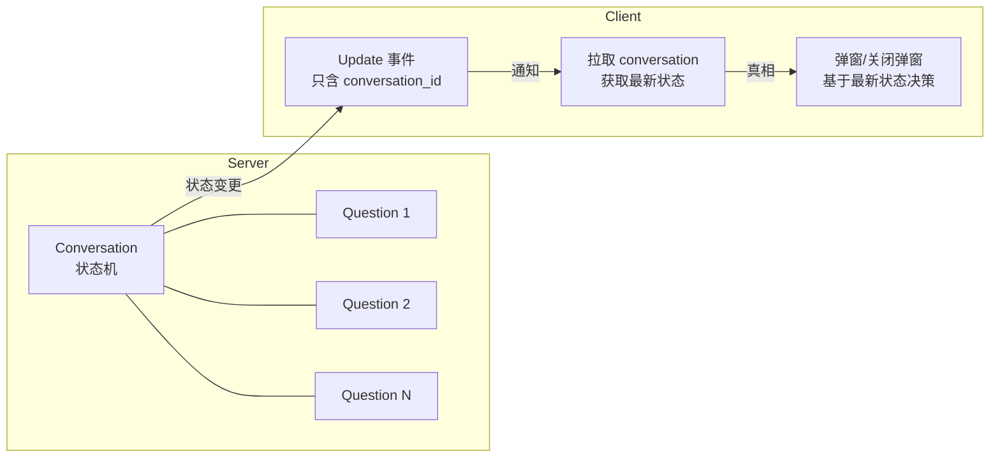
```mermaid
graph LR
    subgraph Server
        C[Conversation<br/>状态机]
        Q1[Question 1]
        Q2[Question 2]
        Q3[Question N]
    end

    subgraph Client
        U[Update 事件<br/>只含 conversation_id]
        F[拉取 conversation<br/>获取最新状态]
        P[弹窗/关闭弹窗<br/>基于最新状态决策]
    end

    C -->|"状态变更"| U
    U -->|"通知"| F
    F -->|"真相"| P
    C --- Q1
    C --- Q2
    C --- Q3
```

**关键设计决策**:
- Update 事件只是**轻量通知**（只含 `conversation_id`）
- 客户端收到通知后**阻塞拉取** Conversation 最新状态
- 不管离线多久，拉取到的永远是**此刻的真相**
- Question 是独立实体，与 Conversation 是**一对多**关系

### State Machine

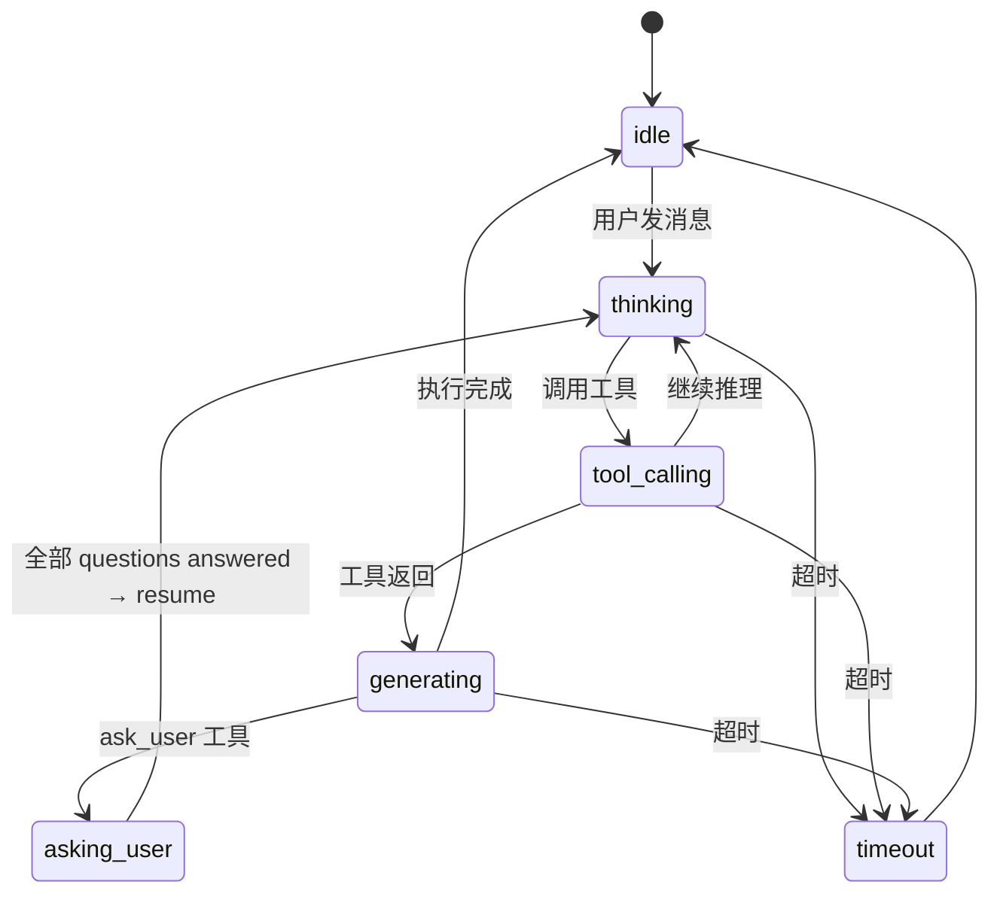
```mermaid
stateDiagram-v2
    [*] --> idle
    idle --> thinking: 用户发消息
    thinking --> tool_calling: 调用工具
    tool_calling --> generating: 工具返回
    tool_calling --> thinking: 继续推理
    generating --> asking_user: ask_user 工具
    generating --> idle: 执行完成
    asking_user --> thinking: 全部 questions answered → resume
    thinking --> timeout: 超时
    tool_calling --> timeout: 超时
    generating --> timeout: 超时
    timeout --> idle
```

---

## Scenario 1: User Offline When Agent Asks

> **问题**: Agent 触发 HITL 中断（conversation update 广播），但 User 离线。User 上线后能否看到问题？

### Historical (D-125 修复前)

> **参考**: 在 D-125 实现之前，HITL 依赖 ephemeral 的 `agent_question` 事件，离线用户会完全错过。现已修复。

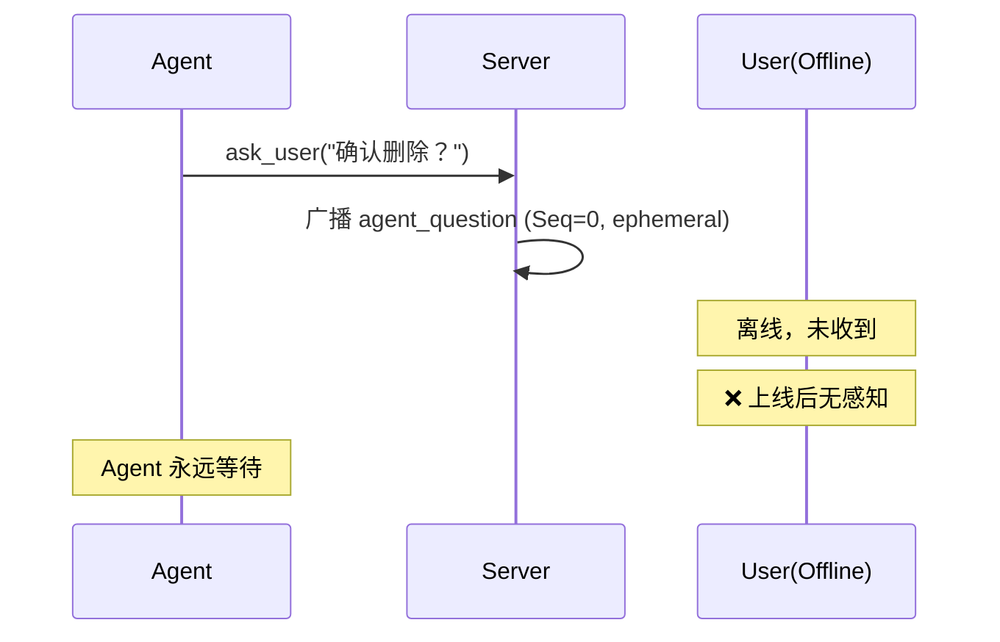
```mermaid
sequenceDiagram
    participant Agent
    participant Server
    participant User(Offline)

    Agent->>Server: ask_user("确认删除？")
    Server->>Server: 广播 agent_question (Seq=0, ephemeral)
    Note over User(Offline): 离线，未收到
    Note over User(Offline): ❌ 上线后无感知
    Note over Agent: Agent 永远等待
```

### Current (D-125 修复后)

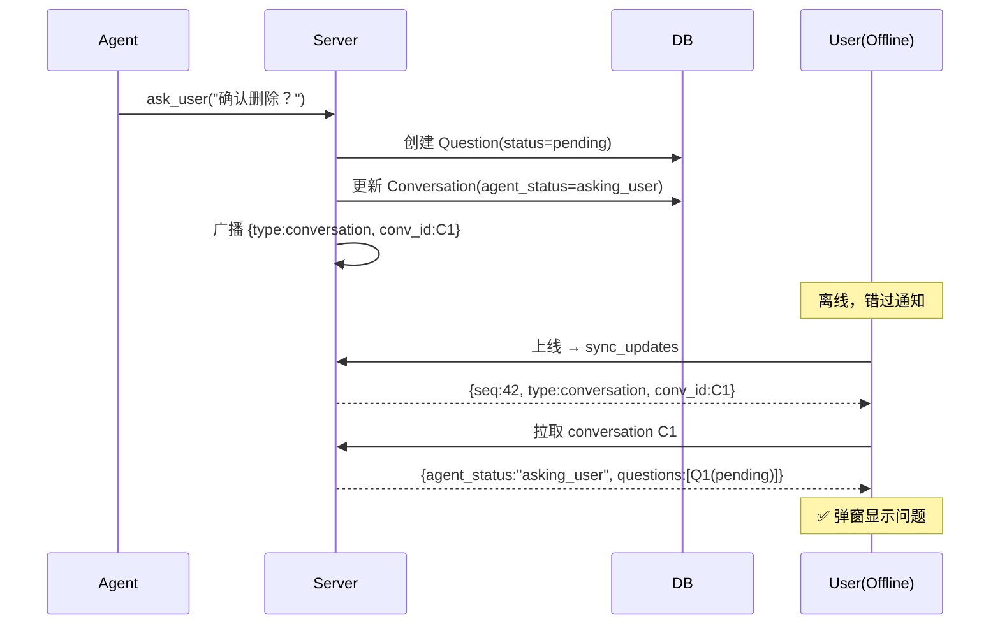
```mermaid
sequenceDiagram
    participant Agent
    participant Server
    participant DB
    participant User(Offline)

    Agent->>Server: ask_user("确认删除？")
    Server->>DB: 创建 Question(status=pending)
    Server->>DB: 更新 Conversation(agent_status=asking_user)
    Server->>Server: 广播 {type:conversation, conv_id:C1}

    Note over User(Offline): 离线，错过通知

    User(Offline)->>Server: 上线 → sync_updates
    Server-->>User(Offline): {seq:42, type:conversation, conv_id:C1}
    User(Offline)->>Server: 拉取 conversation C1
    Server-->>User(Offline): {agent_status:"asking_user", questions:[Q1(pending)]}
    Note over User(Offline): ✅ 弹窗显示问题
```

---

## Scenario 2: Multi-Device Race Condition

> **问题**: Device A 回答了问题，Device B 还没同步。B 是否还会弹窗？

### Target

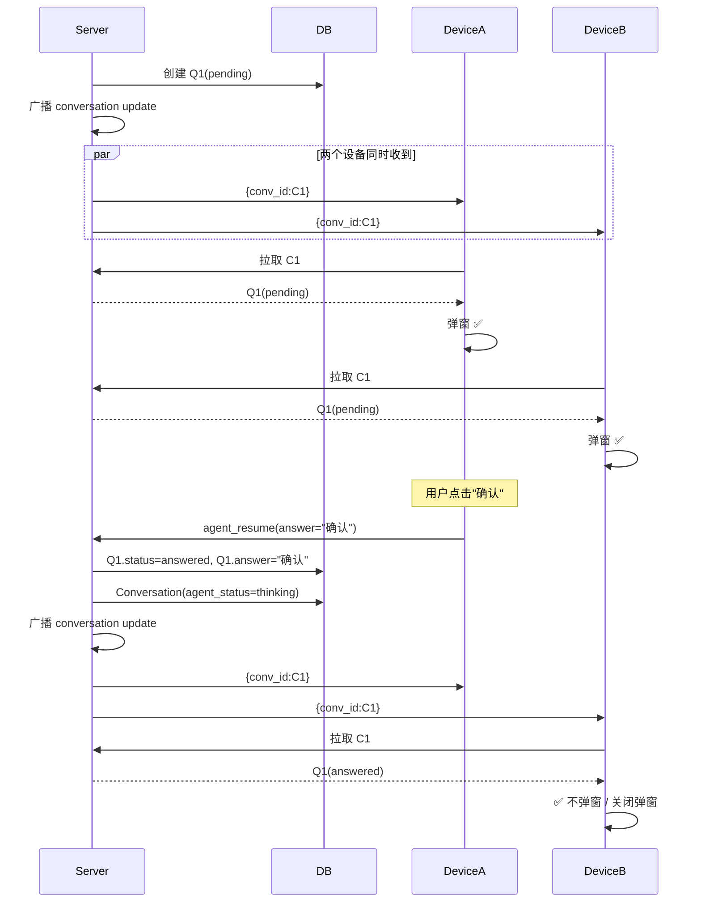
```mermaid
sequenceDiagram
    participant Server
    participant DB
    participant DeviceA
    participant DeviceB

    Server->>DB: 创建 Q1(pending)
    Server->>Server: 广播 conversation update

    par 两个设备同时收到
        Server->>DeviceA: {conv_id:C1}
        Server->>DeviceB: {conv_id:C1}
    end

    DeviceA->>Server: 拉取 C1
    Server-->>DeviceA: Q1(pending)
    DeviceA->>DeviceA: 弹窗 ✅

    DeviceB->>Server: 拉取 C1
    Server-->>DeviceB: Q1(pending)
    DeviceB->>DeviceB: 弹窗 ✅

    Note over DeviceA: 用户点击"确认"
    DeviceA->>Server: agent_resume(answer="确认")
    Server->>DB: Q1.status=answered, Q1.answer="确认"
    Server->>DB: Conversation(agent_status=thinking)
    Server->>Server: 广播 conversation update

    Server->>DeviceA: {conv_id:C1}
    Server->>DeviceB: {conv_id:C1}

    DeviceB->>Server: 拉取 C1
    Server-->>DeviceB: Q1(answered)
    DeviceB->>DeviceB: ✅ 不弹窗 / 关闭弹窗
```

### 弱网竞态：B 也回答了

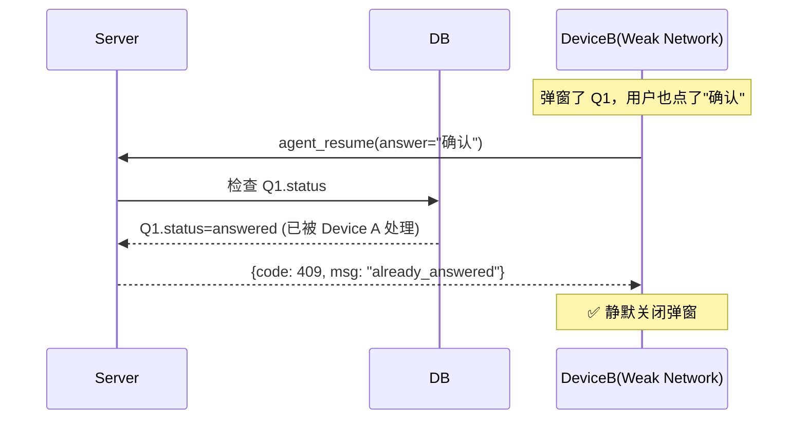
```mermaid
sequenceDiagram
    participant Server
    participant DB
    participant DeviceB(Weak Network)

    Note over DeviceB(Weak Network): 弹窗了 Q1，用户也点了"确认"
    DeviceB(Weak Network)->>Server: agent_resume(answer="确认")

    Server->>DB: 检查 Q1.status
    DB-->>Server: Q1.status=answered (已被 Device A 处理)

    Server-->>DeviceB(Weak Network): {code: 409, msg: "already_answered"}
    Note over DeviceB(Weak Network): ✅ 静默关闭弹窗
```

**幂等保证**: `agent_resume` 检查 Question.status，非 pending 则拒绝。

---

## Scenario 3: Parallel Sub-Agent HITL

> **问题**: 多个子代理并行执行，同时调用 `ask_user`。如何处理多个并发问题？

### Eino 行为

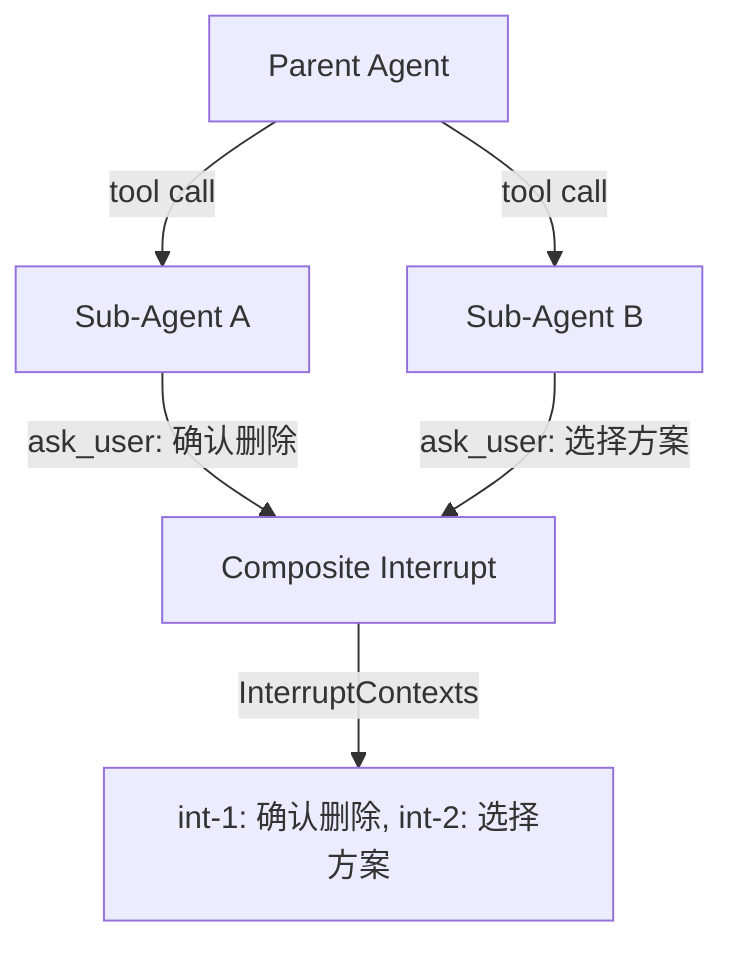
```mermaid
graph TD
    A[Parent Agent] -->|tool call| B[Sub-Agent A]
    A -->|tool call| C[Sub-Agent B]
    B -->|"ask_user: 确认删除"| D[Composite Interrupt]
    C -->|"ask_user: 选择方案"| D
    D -->|InterruptContexts| E["int-1: 确认删除, int-2: 选择方案"]
```

### Target: 一对多 Question

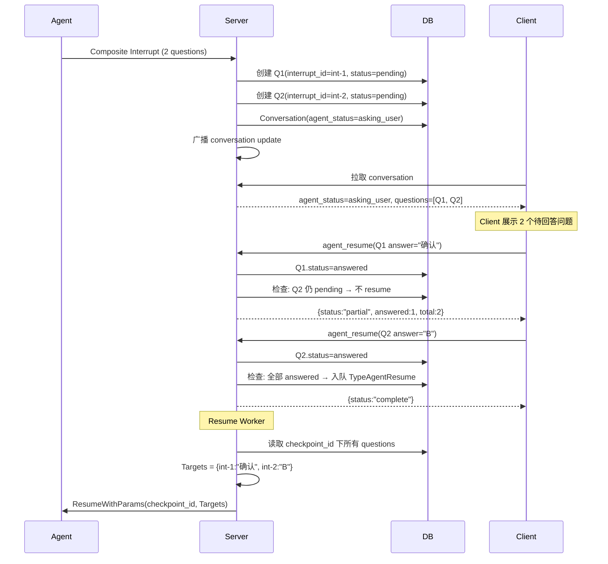
```mermaid
sequenceDiagram
    participant Agent
    participant Server
    participant DB
    participant Client

    Agent->>Server: Composite Interrupt (2 questions)
    Server->>DB: 创建 Q1(interrupt_id=int-1, status=pending)
    Server->>DB: 创建 Q2(interrupt_id=int-2, status=pending)
    Server->>DB: Conversation(agent_status=asking_user)
    Server->>Server: 广播 conversation update

    Client->>Server: 拉取 conversation
    Server-->>Client: agent_status=asking_user, questions=[Q1, Q2]

    Note over Client: Client 展示 2 个待回答问题

    Client->>Server: agent_resume(Q1 answer="确认")
    Server->>DB: Q1.status=answered
    Server->>DB: 检查: Q2 仍 pending → 不 resume
    Server-->>Client: {status:"partial", answered:1, total:2}

    Client->>Server: agent_resume(Q2 answer="B")
    Server->>DB: Q2.status=answered
    Server->>DB: 检查: 全部 answered → 入队 TypeAgentResume
    Server-->>Client: {status:"complete"}

    Note over Server: Resume Worker
    Server->>DB: 读取 checkpoint_id 下所有 questions
    Server->>Server: Targets = {int-1:"确认", int-2:"B"}
    Server->>Agent: ResumeWithParams(checkpoint_id, Targets)
```

---

## Scenario 4: Server Restart During HITL Wait

> **问题**: Agent 正在等待用户回答，此时服务器重启。

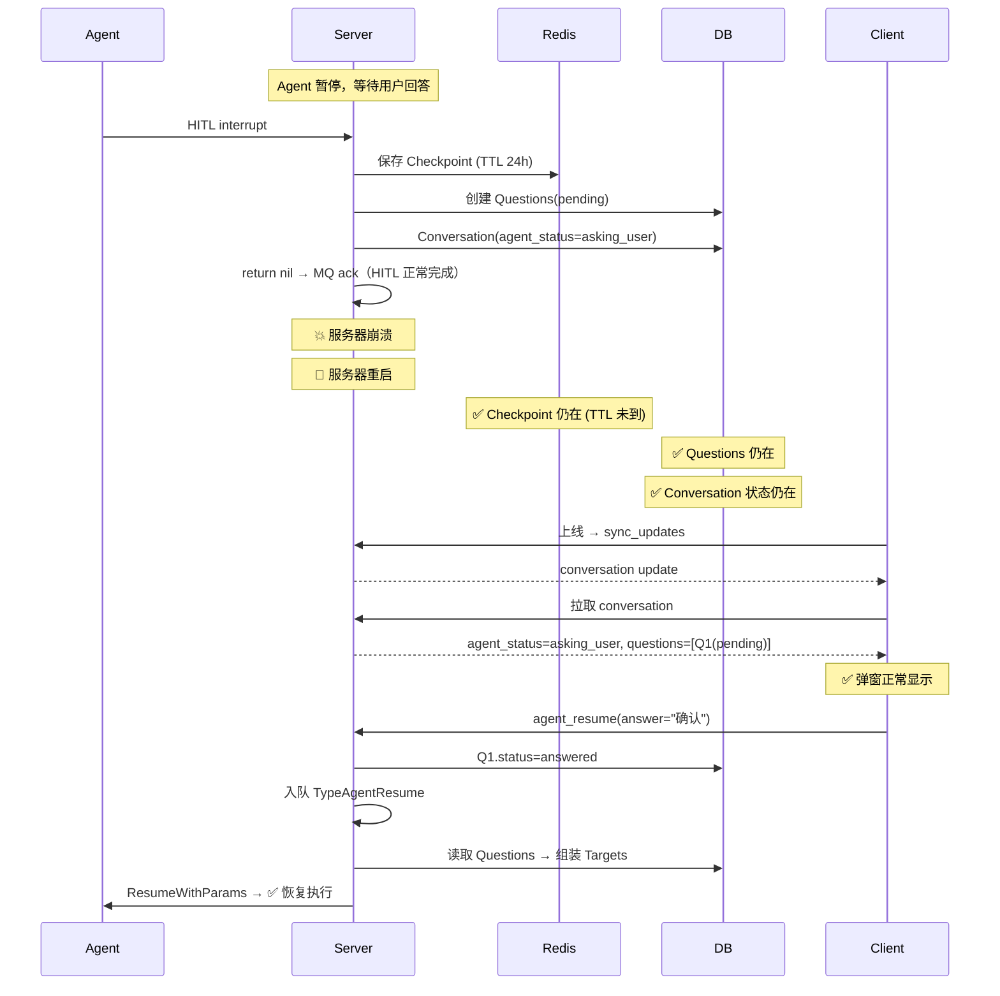
```mermaid
sequenceDiagram
    participant Agent
    participant Server
    participant Redis
    participant DB
    participant Client

    Note over Server: Agent 暂停，等待用户回答

    Agent->>Server: HITL interrupt
    Server->>Redis: 保存 Checkpoint (TTL 24h)
    Server->>DB: 创建 Questions(pending)
    Server->>DB: Conversation(agent_status=asking_user)
    Server->>Server: return nil → MQ ack（HITL 正常完成）

    Note over Server: 💥 服务器崩溃
    Note over Server: 🔄 服务器重启

    Note over Redis: ✅ Checkpoint 仍在 (TTL 未到)
    Note over DB: ✅ Questions 仍在
    Note over DB: ✅ Conversation 状态仍在

    Client->>Server: 上线 → sync_updates
    Server-->>Client: conversation update
    Client->>Server: 拉取 conversation
    Server-->>Client: agent_status=asking_user, questions=[Q1(pending)]
    Note over Client: ✅ 弹窗正常显示

    Client->>Server: agent_resume(answer="确认")
    Server->>DB: Q1.status=answered
    Server->>Server: 入队 TypeAgentResume
    Server->>DB: 读取 Questions → 组装 Targets
    Server->>Agent: ResumeWithParams → ✅ 恢复执行
```

**结论**: HITL 等待期间重启**没有问题**。所有状态都在持久化存储中。

---

## Scenario 5: Server Restart During Agent Execution

> **问题**: Agent 正在执行（非 HITL），流式输出中，服务器崩溃。

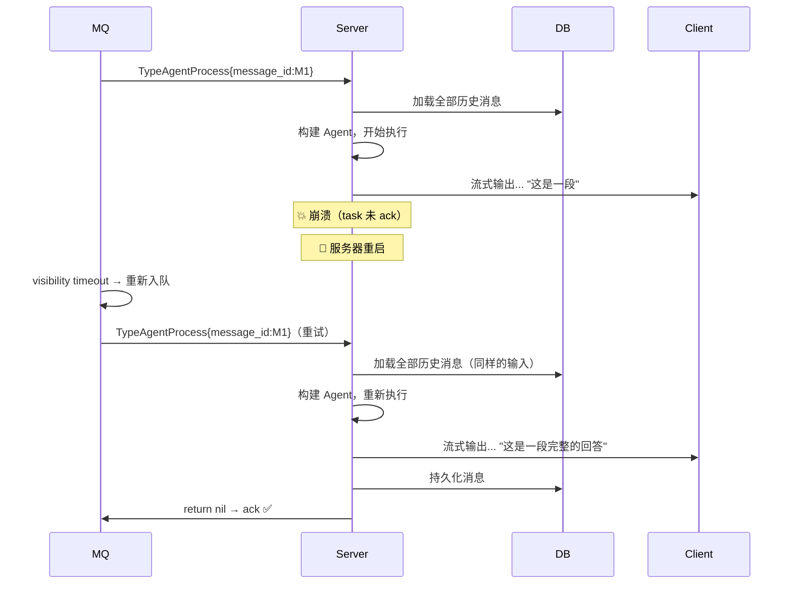
```mermaid
sequenceDiagram
    participant MQ
    participant Server
    participant DB
    participant Client

    MQ->>Server: TypeAgentProcess{message_id:M1}
    Server->>DB: 加载全部历史消息
    Server->>Server: 构建 Agent，开始执行
    Server->>Client: 流式输出... "这是一段"

    Note over Server: 💥 崩溃（task 未 ack）

    Note over Server: 🔄 服务器重启

    MQ->>MQ: visibility timeout → 重新入队
    MQ->>Server: TypeAgentProcess{message_id:M1}（重试）
    Server->>DB: 加载全部历史消息（同样的输入）
    Server->>Server: 构建 Agent，重新执行
    Server->>Client: 流式输出... "这是一段完整的回答"
    Server->>DB: 持久化消息
    Server->>MQ: return nil → ack ✅
```

**关键洞察**: Agent 执行 = f(所有历史消息)。消息在 DB 中，重启后重新加载 = 同样的输入 → 可重新执行。

**幂等保护**: 如果第一次执行**已经成功**（在崩溃前 ack 了），idempotency key 阻止重复处理。

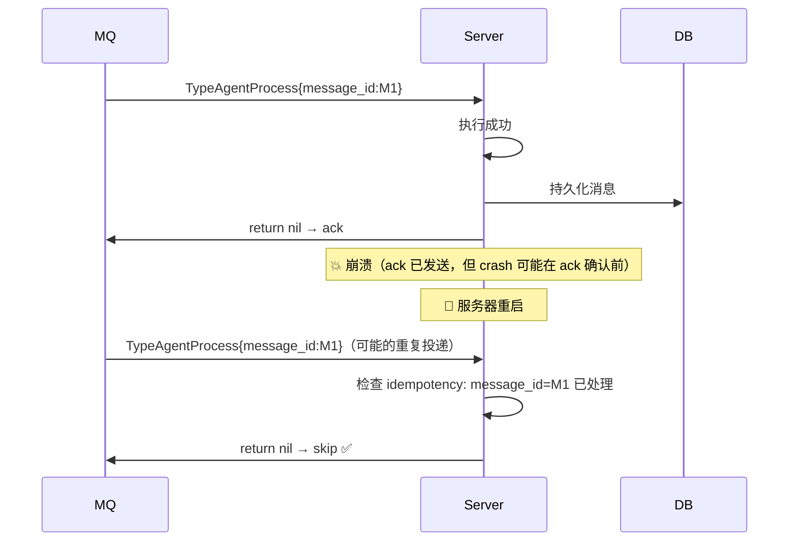
```mermaid
sequenceDiagram
    participant MQ
    participant Server
    participant DB

    MQ->>Server: TypeAgentProcess{message_id:M1}
    Server->>Server: 执行成功
    Server->>DB: 持久化消息
    Server->>MQ: return nil → ack

    Note over Server: 💥 崩溃（ack 已发送，但 crash 可能在 ack 确认前）

    Note over Server: 🔄 服务器重启

    MQ->>Server: TypeAgentProcess{message_id:M1}（可能的重复投递）
    Server->>Server: 检查 idempotency: message_id=M1 已处理
    Server->>MQ: return nil → skip ✅
```

---

## Scenario 6: Server Restart After Partial Answers

> **问题**: 2 个并行 Question，用户回答了 Q1，服务器重启。Q1 的答案会丢失吗？

### Current (Broken): Answer 只在 task payload 中

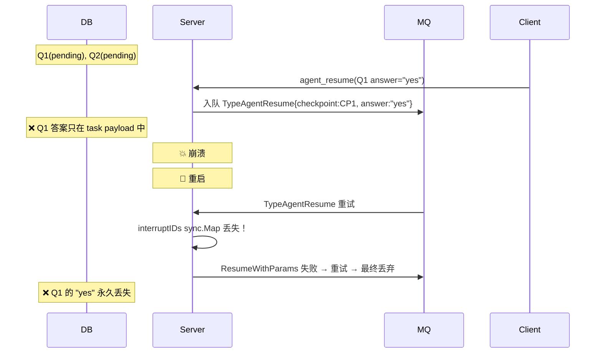
```mermaid
sequenceDiagram
    participant DB
    participant Server
    participant MQ
    participant Client

    Note over DB: Q1(pending), Q2(pending)

    Client->>Server: agent_resume(Q1 answer="yes")
    Server->>MQ: 入队 TypeAgentResume{checkpoint:CP1, answer:"yes"}
    Note over DB: ❌ Q1 答案只在 task payload 中

    Note over Server: 💥 崩溃

    Note over Server: 🔄 重启

    MQ->>Server: TypeAgentResume 重试
    Server->>Server: interruptIDs sync.Map 丢失！
    Server->>MQ: ResumeWithParams 失败 → 重试 → 最终丢弃
    Note over DB: ❌ Q1 的 "yes" 永久丢失
```

### Target (Fixed): Answer 先写 DB

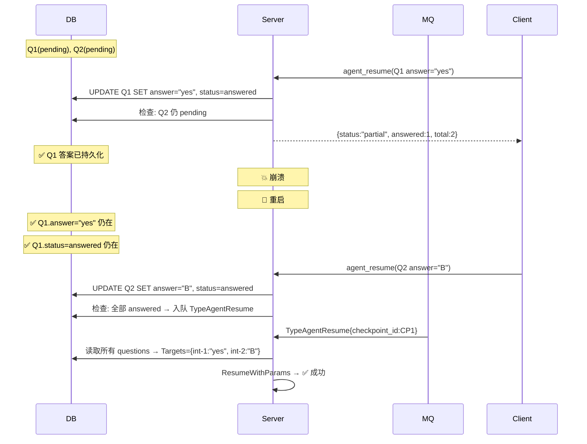
```mermaid
sequenceDiagram
    participant DB
    participant Server
    participant MQ
    participant Client

    Note over DB: Q1(pending), Q2(pending)

    Client->>Server: agent_resume(Q1 answer="yes")
    Server->>DB: UPDATE Q1 SET answer="yes", status=answered
    Server->>DB: 检查: Q2 仍 pending
    Server-->>Client: {status:"partial", answered:1, total:2}
    Note over DB: ✅ Q1 答案已持久化

    Note over Server: 💥 崩溃

    Note over Server: 🔄 重启

    Note over DB: ✅ Q1.answer="yes" 仍在
    Note over DB: ✅ Q1.status=answered 仍在

    Client->>Server: agent_resume(Q2 answer="B")
    Server->>DB: UPDATE Q2 SET answer="B", status=answered
    Server->>DB: 检查: 全部 answered → 入队 TypeAgentResume
    MQ->>Server: TypeAgentResume{checkpoint_id:CP1}
    Server->>DB: 读取所有 questions → Targets={int-1:"yes", int-2:"B"}
    Server->>Server: ResumeWithParams → ✅ 成功
```

**即使 T1 和 T5 之间重启 100 次也无所谓** — 答案在 DB 中，不会丢。

---

## Scenario 7: Resume Task In Queue During Restart

> **问题**: 全部 questions answered，TypeAgentResume 已入队，此时服务器崩溃。

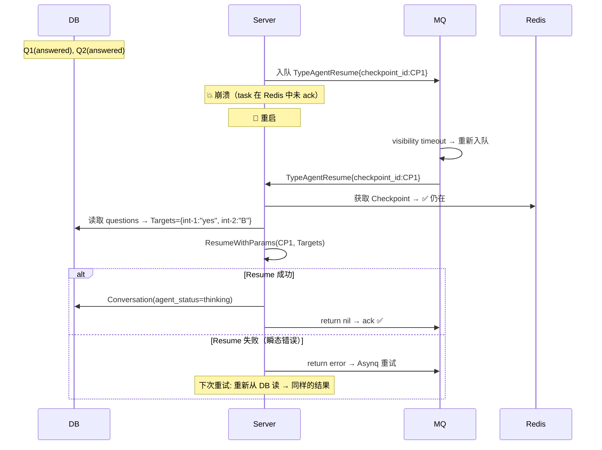
```mermaid
sequenceDiagram
    participant DB
    participant Server
    participant MQ
    participant Redis

    Note over DB: Q1(answered), Q2(answered)
    Server->>MQ: 入队 TypeAgentResume{checkpoint_id:CP1}

    Note over Server: 💥 崩溃（task 在 Redis 中未 ack）

    Note over Server: 🔄 重启

    MQ->>MQ: visibility timeout → 重新入队
    MQ->>Server: TypeAgentResume{checkpoint_id:CP1}

    Server->>Redis: 获取 Checkpoint → ✅ 仍在
    Server->>DB: 读取 questions → Targets={int-1:"yes", int-2:"B"}
    Server->>Server: ResumeWithParams(CP1, Targets)

    alt Resume 成功
        Server->>DB: Conversation(agent_status=thinking)
        Server->>MQ: return nil → ack ✅
    else Resume 失败（瞬态错误）
        Server->>MQ: return error → Asynq 重试
        Note over Server: 下次重试: 重新从 DB 读 → 同样的结果
    end
```

**Task payload 只含 `checkpoint_id`，不含答案** — 答案是 DB 中的真相。Task 重试多少次都安全。

---

## Data Model Summary

### Conversation (State Machine — 扩展字段)

| Field | Type | Description |
|-------|------|-------------|
| `agent_status` | enum | `idle` / `thinking` / `tool_calling` / `generating` / `asking_user` / `timeout` |
| `agent_id` | string | 当前执行的 agent |
| `checkpoint_id` | string | 当前 HITL checkpoint（nullable） |
| `agent_last_activity` | timestamp | 最后活动时间 |

### Question (新增表)

| Field | Type | Description |
|-------|------|-------------|
| `id` | UUID | 主键 |
| `conversation_id` | string | FK → Conversation |
| `checkpoint_id` | string | 关联的 Eino checkpoint |
| `interrupt_id` | string | Eino interrupt address ID |
| `question_text` | text | 问题内容 |
| `status` | enum | `pending` / `answered` |
| `answer` | text | 用户回答（nullable） |
| `answered_by` | string | 回答者 user_id |
| `answered_device_id` | string | 回答设备 |
| `created_at` | timestamp | 创建时间 |
| `answered_at` | timestamp | 回答时间（nullable） |
| `deleted_at` | timestamp | 软删除时间戳（nullable，GORM DeletedAt） |

### Key Relationships

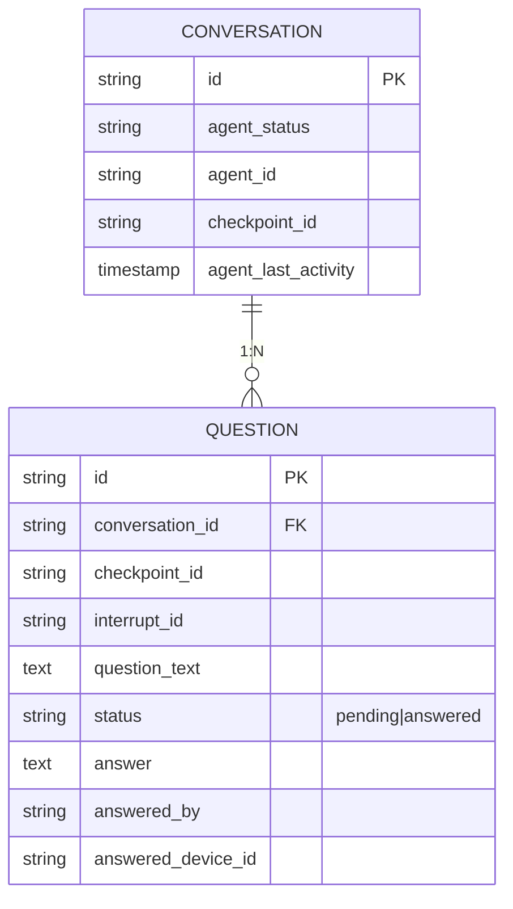
```mermaid
erDiagram
    CONVERSATION ||--o{ QUESTION : "1:N"
    CONVERSATION {
        string id PK
        string agent_status
        string agent_id
        string checkpoint_id
        timestamp agent_last_activity
    }
    QUESTION {
        string id PK
        string conversation_id FK
        string checkpoint_id
        string interrupt_id
        text question_text
        string status "pending|answered"
        text answer
        string answered_by
        string answered_device_id
    }
```

---

## What Survives What

| 数据 | 存储 | 服务器重启 | Redis 重启 | DB 重启 |
|------|------|:---:|:---:|:---:|
| Asynq 任务 | Redis | ✅ | ❌ | ✅ |
| Checkpoint | Redis (24h TTL) | ✅ | ❌ | ✅ |
| Questions | DB | ✅ | ✅ | ❌ |
| Conversation 状态 | DB | ✅ | ✅ | ❌ |
| Messages | DB | ✅ | ✅ | ❌ |
| `interruptIDs` (旧) | sync.Map | ❌ | ✅ | ✅ |

> **注意**: `interruptIDs sync.Map` 在新设计中**被移除** — 改为从 Question 表查询 `interrupt_id`。

### Recovery Matrix

| 崩溃时刻 | 恢复机制 | 数据丢失？ |
|---------|---------|:---:|
| Agent 执行中（非 HITL） | Asynq 重试 task → 从 DB 重新加载消息 → 重新执行 | ❌ |
| HITL 等待用户回答 | Checkpoint 在 Redis，Questions 在 DB → 用户回答后恢复 | ❌ |
| 部分 answers 已提交 | Answers 在 DB → 后续 answer 补齐后自动 resume | ❌ |
| Resume task 在队列中 | Asynq 重试 → 从 DB 读 answers → 重新 resume | ❌ |
| Redis 宕机 | Checkpoint 丢失 → HITL 无法恢复 → 需用户重新发消息 | ⚠️ |
