# TC-000: 完整链路端到端测试

> **测试编号**: TC-000
> **测试类型**: 端到端全链路
> **覆盖范围**: 冒烟测试 + 会话管理 + 草稿 + Typing Indicator + 消息操作（含回复） + 同步 + Agent 基础交互 + HITL 基础流程 + 流式文本 + 幂等性 + IPC Fallback + 设备替换 + Agent 高级功能 + ReverseRPC 基础 + 函数注册 + Logs 管理 + 速率限制 + 链路追踪验证 + LLM Debug Log Filter
> **环境**: Docker E2E (D-043)
> **最后更新**: 2026-07-17

---

## 1. 概述

本测试用例覆盖 Xyncra 消息系统的**完整业务链路**：从环境启动到两个用户之间完成消息发送（含回复）、查询、标记已读、删除/恢复会话，再到 Agent 交互、HITL 基础流程和流式文本，以及消息幂等性、IPC Fallback、设备替换、Agent 高级功能（热加载、输入边界、速率限制）、ReverseRPC 基础和函数注册，最后验证服务器数据库和客户端本地数据库中的数据一致性。同时通过 OpenTelemetry + Jaeger 验证 WebSocket 层 → Handler 层 → MQ 层 → Agent 层 → LLM 层全链路 span 的正确性。

**测试目标**：验证整个系统从客户端到服务器到数据库的完整数据流正确性，覆盖核心功能决策（D-006, D-008, D-012, D-013-015, D-032, D-045, D-050, D-051, D-052, D-075, D-076, D-085, D-091, D-092, D-095, D-098/099, D-115, D-116, D-117）；验证 OpenTelemetry 分布式追踪全链路 span 正确性（D-127 Tracing 静默降级）。

**覆盖的关键决策**：
- 消息系统：D-006 (幂等性), D-008 (MessageID), D-012 (已读 MAX), D-013-015 (删除/恢复)
- CLI 行为：D-031 (进程锁), D-032 (IPC Fallback), D-035 (本地查询), D-039 (kill), D-041 (tabwriter 输出), D-044 (daemon 韧性)
- Agent 系统：D-054/055 (协议复用), D-062 (MQ 触发), D-071/075 (幂等/锁), D-076 (热加载 CLI reload-agents), D-085 (HITL resume), D-091 (输入边界), D-115 (内置函数), D-116 (Question 持久化), D-117 (Agent 状态机)
- 双向通信：D-092 (ReverseRPC), D-095 (设备替换), D-098/099 (函数注册)
- 交互体验：D-050 (Typing Indicator / Ephemeral Push), D-051 (流式文本)
- 可观测性：D-127 (Tracing 静默降级), LLM Debug Log Filter (按 user/device 过滤 LLM 日志)

---

## 1.5 通知推送机制说明

本测试用例验证的通知推送机制基于 **Ephemeral Push (Seq=0)** 和 **User Updates** 两种通道：

### 1.5.1 通知类型与触发方式

| 通知类型 | Daemon 日志格式 | 触发时机 | 推送方式 | 接收方 |
| --- | --- | --- | --- | --- |
| **对话更新** | `[conversation] id=... title=...` | 创建对话、更新对话属性 | Ephemeral Push (Seq=0) | 对话对方用户的所有在线设备 |
| **新消息** | `[new message] seq=... from=... conv=...` | 发送消息到对话 | User Updates (持久化) | 对话对方用户的所有在线设备 |
| **消息删除** | `[delete message] conv=... msg=...` | 软删除消息 | User Updates (持久化) | 对话双方用户的所有在线设备 |
| **已读标记** | `[mark read] conv=... msg_id=...` | 标记消息已读 | User Updates (持久化) | 对话对方用户的所有在线设备 |
| **打字指示器** | `[typing] user=... conv=... started/stopped typing` | 用户开始/停止打字 | Ephemeral Push (Seq=0) | 对话对方用户的所有在线设备 |
| **Agent 思考** | `[thinking] user=... conv=... started/stopped thinking` | Agent 开始/停止思考 | Ephemeral Push (Seq=0) | 与 Agent 对话的用户的所有在线设备 |
| **Agent 状态** | `[agent_status] agent=... conv=... status=...` | Agent 状态变化 (thinking/tool_calling/generating/idle/asking_user) | Ephemeral Push (Seq=0) | 与 Agent 对话的用户的所有在线设备 |
| **流式文本** | `[streaming]/[agent] user=... conv=... stream=... status=...` | Agent 流式生成文本 | Ephemeral Push (Seq=0) | 与 Agent 对话的用户的所有在线设备 |
| **Agent 超时** | `[agent_timeout] agent=... conv=... reason=...` | HITL 超时自动清理 (D-123) | Ephemeral Push (Seq=0) | 与 Agent 对话的用户的所有在线设备 |
| **HITL 问题** | `[hitl] conv=... agent=... checkpoint_id=...` | Agent 触发 HITL 中断 (D-125) | 通过 `[conversation]` 通知触发 | 与 Agent 对话的用户的所有在线设备 |
| **序列间隙** | `[gap] seq=...` | sync-updates 发现序列号不连续 | 客户端本地生成 | 仅本地 daemon |

### 1.5.2 推送通道对比

| 通道 | Seq 值 | 持久化 | 用途 | 示例 |
| --- | --- | --- | --- | --- |
| **Ephemeral Push** | Seq=0 | ❌ 不持久化 | 实时状态通知，丢失不影响业务 | typing、agent_status、streaming |
| **User Updates** | Seq>0 | ✅ 持久化到 user_updates 表 | 需要保证送达的数据变更 | 新消息、消息删除、已读标记 |

### 1.5.3 通知触发流程

```
用户操作 (如发送消息)
    ↓
Server Handler 处理 (如 send_message handler)
    ↓
┌─ 写入数据库 (messages 表)
├─ 创建 User Update (Seq递增, 持久化)
└─ BroadcastUpdates 推送到在线设备 (WebSocket)
    ↓
接收方 Daemon 收到推送
    ↓
┌─ 触发 UpdateHandler 回调 (如 OnMessage)
├─ 输出日志到 stdout (如 [new message])
└─ 更新本地数据库
```

### 1.5.4 验证方法

在测试中，我们通过检查 daemon 日志来验证通知是否正确推送：

```bash
# 检查特定类型的通知
cat "$E2E_HOME/bob-daemon.log" | grep -i "\[notification_type\]"

# 检查通知详情
cat "$E2E_HOME/bob-daemon.log" | grep -i "\[new message\].*conv=$CONV_ID"
```

### 关键点

- 通知是 **即时推送** 的，不需要手动 `sync-updates`
- 但如果 daemon 离线，通知会丢失（Ephemeral）或需要通过 `sync-updates` 拉取（User Updates）
- 本测试用例验证的是：**在线 daemon 能否及时收到推送通知**

---

## 2. 环境拓扑

```
┌─────────────────────────────────────────────────────────────┐
│                     Docker E2E 网络                          │
│                                                             │
│  ┌──────────────┐         ┌──────────────────────┐         ┌──────────────────────┐
│  │  Redis 7     │◄────────│  xyncra-server       │         │  Jaeger              │
│  │  16379→6379  │         │  18080→8080           │         │  16687→16686         │
│  │  (DB 15)     │         │  SQLite: xyncra-e2e.db│        │  (Badger)            │
│  └──────────────┘         └──────────────────────┘         └──────────────────────┘
│         ▲                        ▲                         ▲
│         │ 16379                  │ 18080                   │ OTLP gRPC 14317
└─────────┼────────────────────────┼─────────────────────────┼──────────────────────┘
          │                        │                         │
          │                        │  OTLP gRPC ────────────►│
          │                        │
┌─────────┼────────────────────────┼─────────────────────────┐
│         ▼                        ▼                         │
│  ┌─────────────────┐    ┌─────────────────┐               │
│  │ xyncra-client   │    │ xyncra-client   │               │
│  │ User: alice     │    │ User: bob       │               │
│  │ Daemon (IPC)    │    │ Daemon (IPC)    │               │
│  │ 本地 DB:        │    │ 本地 DB:        │               │
│  │  ~/.xyncra/     │    │  ~/.xyncra/     │               │
│  │  alice/*/       │    │  bob/*/         │               │
│  │  xyncra.db      │    │  xyncra.db      │               │
│  └─────────────────┘    └─────────────────┘               │
│                                                             │
│  工作目录: $E2E_HOME (mktemp -d)                            │
└─────────────────────────────────────────────────────────────┘
```

**端口约定 (D-043)**：
| 组件 | 宿主机端口 | 容器端口 | 说明 |
|------|-----------|---------|------|
| Redis | 16379 | 6379 | E2E 专用 Redis |
| Server | 18080 | 8080 | E2E 专用 Server |
| Redis DB | — | 15 | 与开发环境隔离 |
| Jaeger OTLP gRPC | 14317 | 4317 | OTLP gRPC 接收端 |
| Jaeger OTLP HTTP | 14318 | 4318 | OTLP HTTP 接收端 |
| Jaeger UI | 16687 | 16686 | Trace 可视化 UI |

---

## 3. 前置条件

### 3.1 构建二进制

```bash
cd /path/to/xyncra-server
make build
```

确认产出：
- `bin/xyncra-server`
- `bin/xyncra-client`

### 3.2 启动 Docker E2E 环境

```bash
docker compose -f deploy/docker-compose.e2e.yml build --no-cache && \
docker compose -f deploy/docker-compose.e2e.yml up -d
```

### 3.3 健康检查

```bash
# 检查 Redis
redis-cli -p 16379 ping
# 预期输出: PONG

# 检查 Server
curl -s http://localhost:18080/health
# 预期输出: {"status":"ok"}

# 检查 Jaeger
curl -s http://localhost:16687/api/services | jq '.data[]' | grep xyncra-server
# 预期: "xyncra-server"
```

### 3.4 创建测试工作目录

```bash
export E2E_HOME=$(mktemp -d /tmp/xe2e-XXXXXX)
echo "E2E_HOME=$E2E_HOME"
```

### 3.5 Agent 配置（可选，用于 Agent 测试段）

确认 `agents/` 目录下有 `weather-bot.md`。若需真实 LLM 测试，参考 [第 12 节](#12-真实-llm-测试配置-envtest)。

---

## 4. 测试数据字典

| 变量 | 值 | 说明 |
|------|-----|------|
| `$SERVER_URL` | `ws://localhost:18080/ws` | E2E 服务器 WebSocket 地址 |
| `$REDIS_ADDR` | `localhost:16379` | E2E Redis 地址 |
| `$REDIS_DB` | `15` | E2E Redis DB 编号 |
| `$ALICE` | `alice` | 测试用户 Alice |
| `$BOB` | `bob` | 测试用户 Bob |
| `$E2E_HOME` | `/tmp/xe2e-XXXXXX` | 临时测试目录 |
| `$ALICE_DIR` | `$HOME/.xyncra/alice/<device-id>/` | Alice 本地状态目录 |
| `$BOB_DIR` | `$HOME/.xyncra/bob/<device-id>/` | Bob 本地状态目录 |
| `$CONV_ID` | (运行时获取) | 会话 UUID |
| `$MSG_ID` | (运行时获取) | 消息 UUID |
| `$MSG_SEQ` | (运行时获取) | 消息序列号 (uint32) |
| `$JAEGER_API` | `http://localhost:16687/api` | Jaeger Query API 基础地址 |
| `$JAEGER_UI` | `http://localhost:16687` | Jaeger UI 地址（供深度调试） |
| `$TRACING_SERVICE` | `xyncra-server` | OTel service name |

---

## 4.5 链路追踪验证工具

> 用于各阶段验证 Jaeger span 的通用 shell helper 函数。建议在测试开始前定义。

```bash
# 检查指定 operation 的 span 是否存在
# 用法: check_trace "handler.invoke" "xyncra.method" "create_conversation"
#
# 注意: Jaeger API 返回的 JSON 可能包含控制字符，导致 jq 解析失败。
# 如果 jq 报错 "parse error"，请使用 python3 替代方案:
#   curl -s "$url" | python3 -c "import sys,json; data=json.load(sys.stdin); print(len([s for d in data.get('data',[]) for s in d.get('spans',[])]))"
check_trace() {
  local operation="$1"
  local attr_key="$2"
  local attr_val="$3"
  local limit="${4:-5}"

  local url="${JAEGER_API}/traces?service=${TRACING_SERVICE}&operation=${operation}&limit=${limit}"
  local result
  result=$(curl -s "$url")

  local count
  count=$(echo "$result" | jq '[.data[].spans[]] | length')
  echo "Found $count spans for operation=$operation"

  if [ -n "$attr_key" ] && [ -n "$attr_val" ]; then
    local matched
    matched=$(echo "$result" | jq --arg k "$attr_key" --arg v "$attr_val" \
      '[.data[].spans[] | select(.tags[]? | select(.key==$k and .value==$v))] | length')
    echo "Matched $matched spans with $attr_key=$attr_val"
    [ "$matched" -ge 1 ] && return 0 || return 1
  fi

  [ "$count" -ge 1 ] && return 0 || return 1
}

# 验证两个 operation 属于同一 trace_id（MQ 传播验证专用）
check_same_trace() {
  local op1="$1"
  local op2="$2"

  local trace1
  trace1=$(curl -s "${JAEGER_API}/traces?service=${TRACING_SERVICE}&operation=${op1}&limit=1" | jq -r '.data[0].traceID')
  local trace2
  trace2=$(curl -s "${JAEGER_API}/traces?service=${TRACING_SERVICE}&operation=${op2}&limit=1" | jq -r '.data[0].traceID')

  echo "Trace($op1): $trace1"
  echo "Trace($op2): $trace2"

  [ "$trace1" = "$trace2" ] && [ "$trace1" != "null" ] && return 0 || return 1
}
```

---

## 5. 完整流程图

```mermaid
flowchart TD
    Start([开始]) --> EnvSetup[环境准备]

    subgraph 环境准备
        EnvSetup --> BuildBin[构建二进制\nmake build]
        BuildBin --> DockerUp[启动 Docker E2E\ndocker compose -f deploy/docker-compose.e2e.yml up -d]
        DockerUp --> HealthCheck[健康检查\nredis-cli ping\ncurl /health\nJaeger /api/services]
        HealthCheck --> CreateDir[创建测试目录\nmktemp -d]
    end

    CreateDir --> Phase1

    subgraph Phase1 [阶段 1: Daemon 生命周期]
        P1A[启动 Alice daemon\nxyncra-client listen\n--user-id alice\n--device-id test-device-alice\n--server $SERVER_URL &] --> P1B[验证状态文件\nsock / lock / db]
        P1B --> P1C[验证 Heartbeat\nRedis TTL 续期 D-010]
        P1C --> P1D[启动 Bob daemon\nxyncra-client listen\n--user-id bob\n--device-id test-device-bob\n--server $SERVER_URL &]
        P1D --> P1E[验证 Bob 状态文件]
        P1E --> P1T[🔍 验证 Jaeger trace\nws.connection]
    end

    P1T --> Phase2

    subgraph Phase2 [阶段 2: 会话创建]
        P2A[Alice 创建会话\ncreate-conversation\n--peer-id bob] --> P2B[记录 CONV_ID]
        P2B --> P2C[验证服务器 DB\nSELECT conversations]
        P2C --> P2C2[🟡 验证 user_updates 表\nBob 的 conversation 类型记录]
        P2C2 --> P2D[🔔 验证 Bob daemon 日志\n检查 conversation 通知]
        P2D --> P2D2[Bob sync-updates\n拉取新会话]
        P2D2 --> P2E[边界测试\n自建会话/重复创建/不存在用户]
        P2E --> P2T[🔍 验证 Jaeger trace\nhandler.invoke create_conversation]
    end

    P2T --> Phase3

    subgraph Phase3 [阶段 3: 草稿管理]
        P3A[Alice 保存草稿\ndraft save] --> P3B[Alice 获取草稿\ndraft get]
        P3B --> P3C[Alice 更新草稿\ndraft save 覆盖]
        P3C --> P3D[Alice 删除草稿\ndraft delete]
        P3D --> P3E[验证已删除\ndraft get 返回空]
    end

    P3E --> Phase4

    subgraph Phase4 [阶段 4: Typing Indicator]
        P4A[Alice set-typing\n发送 typing 指示器] --> P4B[🔔 验证 Bob daemon 日志\n检查 typing 通知]
        P4B --> P4B2[Alice set-typing --stop\n停止 typing]
        P4B2 --> P4B3[🔔 验证 Bob daemon 日志\n检查停止 typing 通知]
        P4B3 --> P4C[停止 daemon 后 set-typing\n验证退出码 2 D-036]
        P4C --> P4T[🔍 验证 Jaeger trace\nhandler.invoke set_typing]
    end

    P4T --> Phase5

    subgraph Phase5 [阶段 5: 消息发送]
        P5A[Alice 发送消息\nsend --conversation-id\n--content Hello] --> P5B[记录 MSG_ID / MSG_SEQ]
        P5B --> P5B2[Alice 发送回复消息\nsend --reply-to 1]
        P5B2 --> P5C[边界测试\n不存在会话/缺字段]
        P5C --> P5D[验证服务器 DB\nSELECT messages\n含 reply_to 字段]
        P5D --> P5D2[🟡 验证 user_updates 表\nBob 的 message 类型记录]
        P5D2 --> P5D3[🟡 验证客户端 rpc_logs 表\nAlice 的 send_message 记录]
        P5D3 --> P5T[🔍 验证 Jaeger trace\nhandler.invoke + mq.process\n+ check_same_trace]
        P5T --> P5E[验证 Redis MQ\nasynq 队列]
        P5E --> P5F[📋 Logs 验证\nsend_message 日志]
        P5F --> P5F2[🔔 验证 Bob daemon 日志\n检查 new message 通知]
        P5F2 --> P5G[Bob sync-updates\n拉取新消息]
        P5G --> P5H[验证 Bob 本地 DB\nget-messages]
    end

    P5H --> Phase6

    subgraph Phase6 [阶段 6: 查询验证]
        P6A[Alice list-conversations] --> P6A2[分页验证\n--limit / --offset]
        P6A2 --> P6B[Alice get-conversation -c]
        P6B --> P6C[Alice get-messages -c\n分页边界测试]
        P6C --> P6D[Alice search-messages -c\n搜索 + 分页验证]
    end

    P6D --> Phase7

    subgraph Phase7 [阶段 7: 已读标记]
        P7A[Bob mark-as-read\n--conversation-id\n--message-id $MSG_SEQ] --> P7B[验证服务器 DB\nlast_read_message_id]
        P7B --> P7B2[🔔 验证 Bob daemon 日志\n检查 mark read 通知]
        P7B2 --> P7C[验证 Bob get-conversation\nunread_count = 0]
        P7C --> P7D[边界测试\nclamp/D-047/全部已读]
        P7D --> P7T[🔍 验证 Jaeger trace\nhandler.invoke mark_as_read]
    end

    P7T --> Phase8

    subgraph Phase8 [阶段 8: 消息删除]
        P8A[Alice delete-message\n--message-id $MSG_ID] --> P8B[验证服务器 DB\nmessages.deleted_at]
        P8B --> P8B2[🔔 验证 Bob daemon 日志\n检查 delete message 通知]
        P8B2 --> P8C[Bob sync-updates]
        P8C --> P8D[验证 Bob 本地 DB\n消息不可见]
        P8D --> P8T[🔍 验证 Jaeger trace\nhandler.invoke delete_message]
    end

    P8T --> Phase9

    subgraph Phase9 [阶段 9: 会话删除与恢复]
        P9A[Alice delete-conversation\n-c $CONV_ID] --> P9B[验证服务器 DB\nconversations.deleted_at\nmessages.deleted_at]
        P9B --> P9C[Alice restore-conversation\n-c $CONV_ID]
        P9C --> P9D[验证服务器 DB\ndeleted_at = NULL]
        P9D --> P9E[幂等性测试\n重复 restore/重复 delete]
        P9E --> P9T[🔍 验证 Jaeger trace\nhandler.invoke delete/restore_conversation]
    end

    P9T --> Phase10

    subgraph Phase10 [阶段 10: Agent 交互]
        P10A[Alice 创建与 Agent 的会话\ncreate-conversation\n--peer-id agent/weather-bot] --> P10B[Alice 发送消息\nsend Hello, weather?]
        P10B --> P10B2[🔔 验证 Alice daemon 日志\n检查 agent_status 通知]
        P10B2 --> P10C[等待 Agent 响应\nsync-updates]
        P10C --> P10D[验证 Agent 回复\nget-messages]
        P10D --> P10E[🟡 验证 Agent 状态字段\nconversations.agent_status]
        P10E --> P10F[验证 Redis\nagent:lock 释放]
        P10F --> P10T[🔍 验证 Jaeger trace\nagent.execute + agent.build\n+ agent.run + agent.llm.call]
    end

    P10T --> Phase10_8

    subgraph Phase10_8 [阶段 10.8: LLM Debug Log Filter]
        P108A[配置 XYNCRA_LLM_DEBUG_USERS=alice\n重启服务器] --> P108B[向 Agent 发消息\nalice 触发 LLM]
        P108B --> P108C[🟢 验证 llm-calls.log\n包含 alice 请求, 无截断]
        P108C --> P108D[设置 XYNCRA_LLM_DEBUG_USERS=bob\nalice 不再匹配]
        P108D --> P108E[🟢 验证 llm-calls.log 为空\nalice 请求被过滤]
        P108E --> P108F[恢复正常配置]
    end

    P108F --> Phase10_5

    subgraph Phase10_5 [阶段 10.5: HITL 基础流程]
        P105A[Alice 创建与 hitl-bot 会话] --> P105B[发送消息触发 HITL]
        P105B --> P105C[🔔 验证 asking_user 状态]
        P105C --> P105D[🟡 验证 questions 表\nstatus=pending]
        P105D --> P105E[agent-resume\n回答问题]
        P105E --> P105F[验证 Agent 恢复\nstatus=idle]
        P105F --> P105T[🔍 验证 Jaeger trace\nagent.checkpoint.save]
    end

    P105T --> Phase11

    subgraph Phase11 [阶段 11: 流式文本]
        P11A[stream-text CLI\n发送多个 chunk] --> P11B[🔔 观察 daemon 日志\nstreaming 通知]
        P11B --> P11C[发送 --done 标记]
        P11C --> P11T[🔍 验证 Jaeger trace\nagent.stream]
    end

    P11T --> Phase12

    subgraph Phase12 [阶段 12: 消息幂等性]
        P12A[Alice 发送消息\n指定 client-msg-id] --> P12B[记录 MSG_ID_1]
        P12B --> P12C[相同 client-msg-id\n再次发送]
        P12C --> P12D[验证服务器 DB\n只有一条消息]
        P12D --> P12E[验证响应\nduplicate=true]
    end

    P12E --> Phase13

    subgraph Phase13 [阶段 13: IPC Fallback + 设备替换]
        P13A[停止 Alice daemon\nkill alice] --> P13B[Kill 命令验证\n--force/--timeout/stale lock]
        P13B --> P13C[Alice 执行查询命令\n无需 daemon]
        P13C --> P13D[Alice 执行 sync-updates\n应提示 daemon 未运行]
        P13D --> P13E[Alice send 消息\nfallback 到 WS 短连接]
        P13E --> P13F[重启 Alice daemon]
        P13F --> P13G[设备替换测试\n同 device-id 启动第二个 daemon]
        P13G --> P13H[验证旧 daemon 收到\nClose 4001 被踢下线]
        P13H --> P13T[🔍 验证 Jaeger trace\nws.connection fallback]
    end

    P13T --> Phase14

    subgraph Phase14 [阶段 14: Agent 高级功能]
        P14A[修改 weather-bot.md\n添加新描述] --> P14A2[reload-agents CLI\n验证热加载 D-076]
        P14A2 --> P14B[🟢 验证热加载\n服务器重启后日志]
        P14B --> P14C[发送空消息给 Agent]
        P14C --> P14D[验证错误消息\nD-091 输入边界]
        P14D --> P14E[速率限制测试\ntyping / stream-text 快速发送]
    end

    P14E --> Phase15

    subgraph Phase15 [阶段 15: ReverseRPC 基础]
        P15A[Alice daemon 自动注册函数\nping/get_device_info/get_time] --> P15B[🟢 验证内置函数\n通过 daemon 日志]
        P15B --> P15C[验证设备连接信息\ndevice_id 字段]
        P15C --> P15D[Sync 机制细节验证\nephemeral 过滤/has_more]
        P15D --> P15E[🟡 验证客户端 sync_states 表\nlatest_seq]
    end

    P15E --> Phase16

    subgraph Phase16 [阶段 16: Logs 管理]
        P16A[logs tail --since 1h\n查看近期日志] --> P16B[logs search --method\n按方法过滤]
        P16B --> P16C[logs search --error\n错误日志过滤]
        P16C --> P16D[logs stats\n统计信息]
        P16D --> P16D2[🟡 交叉验证 rpc_logs 表\nSELECT COUNT 对比]
        P16D2 --> P16E[logs export --format json\n导出验证]
        P16E --> P16F[logs cleanup --retain 1d\n清理验证]
    end

    P16F --> Cleanup

    subgraph Cleanup [环境清理]
        CL1[停止 Alice daemon\nkill alice] --> CL2[停止 Bob daemon\nkill bob]
        CL2 --> CL3[停止 Docker E2E\ndocker compose -f deploy/docker-compose.e2e.yml down]
        CL3 --> CL4[清理临时目录\nrm -rf $E2E_HOME]
        CL4 --> CL5[清理 ~/.xyncra 测试数据]
    end

    Cleanup --> End([结束 - 记录测试结果])
```



---

## 6. 分步执行指南

### 阶段 1: Daemon 生命周期

#### 步骤 1.1: 启动 Alice daemon

```bash
./bin/xyncra-client listen \
  --user-id alice --device-id test-device-alice \
  --server ws://localhost:18080/ws \
  > "$E2E_HOME/alice-daemon.log" 2>&1 &
ALICE_PID=$!
sleep 2
```

> **注意**: `listen` 命令需要 `--device-id` 参数（也可通过 `XYNCRA_DEVICE_ID` 环境变量设置）。
> 文档中使用 `test-device-alice` / `test-device-bob` 作为 E2E 测试的 device-id。

**预期**：
- 进程在后台运行，PID 存储在 `$ALICE_PID`
- stderr 输出启动 banner（包含 user-id, device-id, server URL）
- 可通过日志查看：`cat "$E2E_HOME/alice-daemon.log"`

**验证**：

```bash
# 检查进程存在
ps -p $ALICE_PID
# 预期: 显示进程信息

# 检查状态文件
ls -la ~/.xyncra/alice/*/xyncra.sock
ls -la ~/.xyncra/alice/*/xyncra.lock
ls -la ~/.xyncra/alice/*/xyncra.db
# 预期: 三个文件均存在
# sock 文件权限应为 0600 (srw-------)
# 目录权限应为 0700
```

#### 步骤 1.2: 获取 device_id

```bash
# 从 Redis 中获取 device_id
DEVICE_ID=$(redis-cli -p 16379 -n 15 KEYS "xyncra:conn:info:*" | head -1 | sed 's/xyncra:conn:info://')
echo "DEVICE_ID=$DEVICE_ID"

# 或从 daemon 日志获取
grep "device_id" "$E2E_HOME/alice-daemon.log" | head -1
```

#### 步骤 1.3: 验证 Heartbeat (D-010)

```bash
# 检查 Redis 连接 key 的 TTL
CONN_KEY="xyncra:conn:user:alice"
redis-cli -p 16379 -n 15 TTL "$CONN_KEY"
# 预期: TTL > 0（连接存活）

# 等待一个 heartbeat 周期后再次检查 TTL 是否被续期
sleep 15
redis-cli -p 16379 -n 15 TTL "$CONN_KEY"
# 预期: TTL 被刷新（不应递减到 0）
```

#### 步骤 1.4: 启动 Bob daemon

```bash
./bin/xyncra-client listen \
  --user-id bob --device-id test-device-bob \
  --server ws://localhost:18080/ws \
  > "$E2E_HOME/bob-daemon.log" 2>&1 &
BOB_PID=$!
sleep 2
```

**验证**：

```bash
# Bob 的状态文件
ls -la ~/.xyncra/bob/*/xyncra.sock
ls -la ~/.xyncra/bob/*/xyncra.lock
ls -la ~/.xyncra/bob/*/xyncra.db
# 预期: 与 Alice 相同

# 验证 Redis 连接注册
redis-cli -p 16379 -n 15 KEYS "xyncra:conn:user:*"
# 预期: 包含 xyncra:conn:user:alice 和 xyncra:conn:user:bob
```

#### 步骤 1.5: 验证重复启动拒绝 (D-031)

```bash
./bin/xyncra-client listen --user-id alice --device-id test-device-alice --server ws://localhost:18080/ws 2>&1
# 预期: 退出码 2
# stderr 输出: "listen already running (PID: $ALICE_PID)"
echo $?
# 预期: 2
```

#### 步骤 1.6: 🔍 验证 Jaeger 链路追踪

```bash
# 等待 span 上报 (OTLP batch 间隔)
sleep 2

# 验证 ws.connection span 存在
check_trace "ws.connection" "xyncra.user.id" "alice"
# 预期: 找到 >= 1 个 span, xyncra.user.id=alice

check_trace "ws.connection" "xyncra.device.id" "test-device-alice"
# 预期: 找到 >= 1 个 span, xyncra.device.id=test-device-alice
```

**验证点**：
- `ws.connection` span 存在
- Attributes: `xyncra.user.id`, `xyncra.device.id`, `xyncra.connection.id`

---

### 阶段 2: 会话创建

#### 步骤 2.1: Alice 创建与 Bob 的会话

```bash
./bin/xyncra-client create-conversation \
  --user-id alice --device-id test-device-alice \
  --server ws://localhost:18080/ws \
  --peer-id bob
```

**预期输出**（类似）：
```
Conversation created.
ID:       550e8400-e29b-41d4-a716-446655440000
Peer:     bob
Type:     1-on-1
```

**操作**：记录 Conversation ID 到变量：
```bash
CONV_ID="550e8400-e29b-41d4-a716-446655440000"  # 替换为实际值
```

#### 步骤 2.2: 验证服务器 SQLite 数据库

> **注意**: E2E 容器内无 sqlite3 CLI，需先 `docker cp` 到宿主机查询。

```bash
# 获取服务器容器名
CONTAINER=$(docker compose -f deploy/docker-compose.e2e.yml ps --format "{{.Name}}" | grep xyncra-server-e2e | head -1)
docker cp "$CONTAINER":/app/xyncra-e2e.db /tmp/xyncra-e2e.db
sqlite3 /tmp/xyncra-e2e.db "SELECT id, user_id1, user_id2, type, deleted_at FROM conversations WHERE id = '$CONV_ID';"
```

**预期**：
```
550e8400-e29b-41d4-a716-446655440000|alice|bob|1-on-1|
```
- `user_id1` = alice, `user_id2` = bob（顺序取决于字母序或创建顺序）
- `type` = 1-on-1
- `deleted_at` 为空（未删除）

#### 步骤 2.3: 验证 Bob 收到通知 (D-045)

**验证 Bob daemon 日志中的推送通知**：

```bash
# 检查 Bob daemon 日志是否收到了新对话的推送通知
cat "$E2E_HOME/bob-daemon.log" | grep -i "\[conversation\]" | tail -5
# 预期: 看到 "[conversation] id=$CONV_ID title=..." 或类似日志
```

**验证 Bob 通过 sync-updates 拉取新会话**：

```bash
# Bob 执行 FullSync 拉取新会话
./bin/xyncra-client sync-updates --user-id bob --device-id test-device-bob

# Bob 查看本地会话列表
./bin/xyncra-client list-conversations --user-id bob --device-id test-device-bob
```

**预期**：

- Bob daemon 日志中包含了 `[conversation]` 通知
- `sync-updates` 输出 `Sync complete.`
- `list-conversations` 输出包含 Alice 创建的会话（Bob 能看到）

#### 步骤 2.3.1: 验证 user_updates 表（同步数据流）

```bash
# 验证服务器 user_updates 表中有 Bob 的 conversation 类型记录
sqlite3 /tmp/xyncra-e2e.db "SELECT id, user_id, seq, type, created_at FROM user_updates WHERE user_id = 'bob' ORDER BY seq DESC LIMIT 5;"
# 预期: 包含 type=conversation 的记录，seq > 0
```

**预期**：

- `user_updates` 表中有 `user_id=bob` 的记录
- `type` = `conversation`
- `seq` 单调递增（D-008）

#### 步骤 2.4: 验证 Redis 中的连接信息

```bash
redis-cli -p 16379 -n 15 SMEMBERS "xyncra:conn:user:alice"
redis-cli -p 16379 -n 15 SMEMBERS "xyncra:conn:user:bob"
# 预期: 各自返回至少一个 connID
```

#### 步骤 2.5: 会话创建边界测试 (D-011)

```bash
# 2.5.1 创建与自己的会话 — 应被拒绝
./bin/xyncra-client create-conversation \
  --user-id alice --device-id test-device-alice \
  --server ws://localhost:18080/ws \
  --peer-id alice 2>&1
# 预期: 退出码 1, 错误信息包含 "cannot create conversation with yourself"

# 2.5.2 重复创建同一会话 — 验证 find-or-create 幂等
./bin/xyncra-client create-conversation \
  --user-id alice --device-id test-device-alice \
  --server ws://localhost:18080/ws \
  --peer-id bob
# 预期: 返回相同的 CONV_ID（不创建新会话）

# 2.5.3 创建与不存在用户的会话
# 注意: 系统无用户注册表（D-003 内网部署模型），user_id 为自由字符串标识符，
# 用户存在性由外部业务系统保证。因此创建与不存在用户的会话是被允许的。
./bin/xyncra-client create-conversation \
  --user-id alice --device-id test-device-alice \
  --server ws://localhost:18080/ws \
  --peer-id nonexistent_user 2>&1
# 预期: 退出码 0, 成功创建会话（设计选择，符合 D-003）
```

#### 步骤 2.6: 🔍 验证 Jaeger 链路追踪

```bash
sleep 2

check_trace "handler.invoke" "xyncra.method" "create_conversation"
# 预期: 找到 >= 1 个 span, xyncra.method=create_conversation
```

**验证点**：
- `handler.invoke` span 存在
- Attributes: `xyncra.method=create_conversation`, `xyncra.user.id=alice`

---

### 阶段 3: 草稿管理

> 验证本地草稿的保存、获取、更新和删除（D-035：本地 SQLite 操作）。

#### 步骤 3.1: Alice 保存草稿

```bash
./bin/xyncra-client draft save \
  --user-id alice --device-id test-device-alice \
  --conversation-id "$CONV_ID" \
  --content "这是一条草稿，还没发送"
# 预期: 退出码 0, 输出 "Draft saved." 或类似
```

#### 步骤 3.2: Alice 获取草稿

```bash
./bin/xyncra-client draft get \
  --user-id alice --device-id test-device-alice \
  --conversation-id "$CONV_ID"
# 预期: 输出草稿内容 "这是一条草稿，还没发送"
```

**验证本地 SQLite**：

```bash
sqlite3 ~/.xyncra/alice/*/xyncra.db \
  "SELECT conversation_id, content, updated_at FROM drafts WHERE conversation_id = '$CONV_ID';"
# 预期: 一条记录，content 与草稿一致
```

#### 步骤 3.3: Alice 更新草稿（upsert）

```bash
./bin/xyncra-client draft save \
  --user-id alice --device-id test-device-alice \
  --conversation-id "$CONV_ID" \
  --content "草稿已更新为新的内容"
# 预期: 退出码 0

./bin/xyncra-client draft get \
  --user-id alice --device-id test-device-alice \
  --conversation-id "$CONV_ID"
# 预期: 输出 "草稿已更新为新的内容"（覆盖旧内容）
```

#### 步骤 3.4: Alice 删除草稿

```bash
./bin/xyncra-client draft delete \
  --user-id alice --device-id test-device-alice \
  --conversation-id "$CONV_ID"
# 预期: 退出码 0, 输出 "Draft deleted." 或类似
```

#### 步骤 3.5: 验证草稿已删除

```bash
./bin/xyncra-client draft get \
  --user-id alice --device-id test-device-alice \
  --conversation-id "$CONV_ID"
# 预期: 输出 "No draft found." 或类似空结果
```

#### 步骤 3.6: Daemon 停止后仍可读取草稿

```bash
# 先保存一条新草稿
./bin/xyncra-client draft save \
  --user-id alice --device-id test-device-alice \
  --conversation-id "$CONV_ID" \
  --content "Daemon 停止测试草稿"

# 停止 Alice daemon
./bin/xyncra-client kill --user-id alice --device-id test-device-alice
sleep 1

# 获取草稿 — 纯本地读取，不依赖 daemon
./bin/xyncra-client draft get \
  --user-id alice --device-id test-device-alice \
  --conversation-id "$CONV_ID"
# 预期: 正常输出 "Daemon 停止测试草稿"

# 清理：删除测试草稿
./bin/xyncra-client draft delete \
  --user-id alice --device-id test-device-alice \
  --conversation-id "$CONV_ID"

# 重启 Alice daemon（后续阶段需要）
./bin/xyncra-client listen \
  --user-id alice --device-id test-device-alice \
  --server ws://localhost:18080/ws \
  > "$E2E_HOME/alice-daemon.log" 2>&1 &
ALICE_PID=$!
sleep 2
```

---

### 阶段 4: Typing Indicator (D-050)

> 验证 typing 指示器的发送和清除。`set-typing` 是 IPC-only 命令（D-036），daemon 停止时应返回退出码 2。

#### 步骤 4.1: Alice 发送 typing 指示器

```bash
./bin/xyncra-client set-typing \
  --user-id alice --device-id test-device-alice \
  --conversation-id "$CONV_ID"
# 预期: 输出 "Typing indicator sent to conversation $CONV_ID"
```

**验证 Bob daemon 日志**：

```bash
cat "$E2E_HOME/bob-daemon.log" | grep -i "typing\|ephemeral" | tail -3
# 预期: 看到 typing indicator 或 ephemeral push 相关日志
```

#### 步骤 4.2: 验证 Bob 收到 typing 通知

```bash
# 检查 Bob daemon 日志是否收到了 typing 指示器
cat "$E2E_HOME/bob-daemon.log" | grep -i "\[typing\]\|\[thinking\]" | tail -3
# 预期: 看到 "[typing] user=alice conv=$CONV_ID started typing" 或类似日志
```

#### 步骤 4.3: Alice 停止 typing

```bash
./bin/xyncra-client set-typing \
  --user-id alice --device-id test-device-alice \
  --conversation-id "$CONV_ID" \
  --stop
# 预期: 输出 "Typing indicator cleared for conversation $CONV_ID"
```

**验证 Bob 收到停止 typing 通知**：

```bash
# 检查 Bob daemon 日志是否收到了停止 typing 通知
cat "$E2E_HOME/bob-daemon.log" | grep -i "\[typing\]\|\[thinking\]" | tail -1
# 预期: 看到 "[typing] user=alice conv=$CONV_ID stopped typing" 或类似日志
```

#### 步骤 4.4: Daemon 停止时 set-typing 返回错误 (D-036)

```bash
# 停止 Alice daemon
./bin/xyncra-client kill --user-id alice --device-id test-device-alice
sleep 1

# 尝试发送 typing — 应失败
./bin/xyncra-client set-typing \
  --user-id alice --device-id test-device-alice \
  --conversation-id "$CONV_ID" 2>&1
echo $?
# 预期: 退出码 2, 错误信息包含 "daemon not running" 或类似

# 重启 Alice daemon
./bin/xyncra-client listen \
  --user-id alice --device-id test-device-alice \
  --server ws://localhost:18080/ws \
  > "$E2E_HOME/alice-daemon.log" 2>&1 &
ALICE_PID=$!
sleep 2
```

#### 步骤 4.5: 🔍 验证 Jaeger 链路追踪

```bash
sleep 2

check_trace "handler.invoke" "xyncra.method" "set_typing"
# 预期: 找到 >= 1 个 span
```

---

### 阶段 5: 消息发送

#### 步骤 5.1: Alice 发送第一条消息

```bash
./bin/xyncra-client send \
  --user-id alice --device-id test-device-alice \
  --server ws://localhost:18080/ws \
  --conversation-id "$CONV_ID" \
  --content "Hello Bob! This is a test message."
```

**预期输出**（类似）：
```
Message sent.
ID:         a1b2c3d4-e5f6-7890-abcd-ef1234567890
Seq:        1
```

**操作**：记录消息 ID 和序列号：
```bash
MSG_ID="a1b2c3d4-e5f6-7890-abcd-ef1234567890"  # 替换为实际值
MSG_SEQ=1
```

#### 步骤 5.2: Alice 发送第二条消息

```bash
./bin/xyncra-client send \
  --user-id alice --device-id test-device-alice \
  --server ws://localhost:18080/ws \
  --conversation-id "$CONV_ID" \
  --content "Second message from Alice."
```

**预期**：消息 Seq = 2（递增，D-008）

#### 步骤 5.2.1: Alice 发送回复消息（--reply-to）

```bash
# Alice 回复第一条消息 (reply_to=1)
./bin/xyncra-client send \
  --user-id alice --device-id test-device-alice \
  --server ws://localhost:18080/ws \
  --conversation-id "$CONV_ID" \
  --content "This is a reply to the first message" \
  --reply-to 1
```

**预期输出**（类似）：
```
Message sent.
ID:         <reply-msg-uuid>
Seq:        3
```

**操作**：记录回复消息 ID：

```bash
REPLY_MSG_ID="<reply-msg-uuid>"  # 替换为实际值
```

#### 步骤 5.3: 消息发送边界测试

```bash
# 5.3.1 发送到不存在的 conversation-id
./bin/xyncra-client send \
  --user-id alice --device-id test-device-alice \
  --server ws://localhost:18080/ws \
  --conversation-id "00000000-0000-0000-0000-000000000000" \
  --content "Should fail" 2>&1
# 预期: 退出码 1, 错误信息包含 "conversation not found"

# 5.3.2 非会话成员发送消息
./bin/xyncra-client send \
  --user-id bob --device-id test-device-bob \
  --server ws://localhost:18080/ws \
  --conversation-id "00000000-0000-0000-0000-000000000000" \
  --content "Should fail" 2>&1
# 预期: 退出码 1, 错误信息包含 "conversation not found"
```

#### 步骤 5.4: 验证服务器 SQLite 数据库

```bash
# 从容器复制 DB 到宿主机查询（容器内无 sqlite3 CLI）
CONTAINER=$(docker compose -f deploy/docker-compose.e2e.yml ps --format "{{.Name}}" | grep xyncra-server-e2e | head -1)
docker cp "$CONTAINER":/app/xyncra-e2e.db /tmp/xyncra-e2e.db
sqlite3 /tmp/xyncra-e2e.db "SELECT id, message_id, sender_id, content, reply_to, deleted_at FROM messages WHERE conversation_id = '$CONV_ID' ORDER BY message_id ASC;"
```

**预期**：
```
a1b2c3d4-...|1|alice|Hello Bob! This is a test message.|0|
b2c3d4e5-...|2|alice|Second message from Alice.|0|
c3d4e5f6-...|3|alice|This is a reply to the first message.|1|
```

- `message_id` 单调递增 (D-008)
- `sender_id` = alice
- `reply_to` = 0（普通消息）或 = 1（回复消息，reply_to 指向被回复消息的 message_id）
- `deleted_at` 为空

#### 步骤 5.5: 验证服务器 conversation 更新

```bash
sqlite3 /tmp/xyncra-e2e.db "SELECT last_processed_message_id FROM conversations WHERE id = '$CONV_ID';"
```

**预期**：

- `last_processed_message_id` = 3（因为发送了 3 条消息）
- `last_message_at` 不为空且为近期时间

#### 步骤 5.5.1: 验证 user_updates 表（同步数据流）

```bash
# 验证 Bob 的 user_updates 有 message 类型记录（seq 递增）
sqlite3 /tmp/xyncra-e2e.db "SELECT id, user_id, seq, type FROM user_updates WHERE user_id = 'bob' AND type = 'message' ORDER BY seq ASC;"
```

**预期**：

- 至少 3 条 `type=message` 记录对应 Alice 发送的 3 条消息
- `seq` 单调递增（D-008）
- 每条记录的 payload 包含 `conversation_id` 和 `message_id`

#### 步骤 5.5.2: 验证客户端 rpc_logs 表

```bash
# 验证 Alice 本地 rpc_logs 有 send_message 记录
sqlite3 ~/.xyncra/alice/*/xyncra.db \
  "SELECT method, status_code, duration FROM rpc_logs WHERE method = 'send_message' ORDER BY created_at DESC LIMIT 3;"
# 预期: 3 条记录，status_code = 0（IPC 模式下 0 表示成功）
```

#### 步骤 5.6: 验证 Redis MQ (Asynq 队列)

```bash
redis-cli -p 16379 -n 15 KEYS "asynq:*"
# 预期: 可看到 asynq 队列相关的 key（任务处理后可能被消费）

# 查看 Asynq 队列中的任务（如果有残留）
redis-cli -p 16379 -n 15 LLEN "asynq:{critical}"
redis-cli -p 16379 -n 15 LLEN "asynq:{default}"
redis-cli -p 16379 -n 15 LLEN "asynq:{low}"
# 预期: 消息已处理后队列长度为 0（或接近 0）
```

#### 步骤 5.7: 📋 Logs 验证（消息发送）

```bash
# 验证 send_message 操作在日志中有记录
./bin/xyncra-client logs search \
  --user-id alice --device-id test-device-alice \
  --method send_message \
  --from 5m 2>/dev/null || true
# 预期: 日志中包含刚才的 send_message 记录

# 或通过 tail 查看最近的 RPC 日志
./bin/xyncra-client logs tail \
  --user-id alice --device-id test-device-alice \
  --since 5m 2>/dev/null | head -20
# 预期: 可见消息发送相关的 RPC 日志条目
```

#### 步骤 5.8: Bob 同步并验证本地 DB

**验证 Bob daemon 日志中的消息推送通知**：

```bash
# 检查 Bob daemon 日志是否收到了新消息的推送通知
cat "$E2E_HOME/bob-daemon.log" | grep -i "\[new message\]" | tail -5
# 预期: 看到 "[new message] seq=1 from=alice conv=$CONV_ID ..." 和
# "[new message] seq=2 from=alice conv=$CONV_ID ..." 或类似日志
```

**Bob 同步更新并验证消息**：

```bash
# Bob 同步更新
./bin/xyncra-client sync-updates --user-id bob --device-id test-device-bob

# Bob 查看消息
./bin/xyncra-client get-messages \
  --user-id bob --device-id test-device-bob \
  --conversation-id "$CONV_ID"
```

**预期**：

- Bob daemon 日志中包含了 `[new message]` 通知（三条消息）
- 输出包含 Alice 发送的三条消息（含回复消息）
- 消息按 `message_id` 升序排列 (D-008)
- sender 显示为 alice
- 回复消息显示 reply_to 信息

#### 步骤 5.9: 🔍 验证 Jaeger 链路追踪

```bash
sleep 2

# 1. 验证 handler.invoke (send_message)
check_trace "handler.invoke" "xyncra.method" "send_message"
# 预期: >= 1

# 2. 验证 MQ 跨 goroutine trace 传播（关键！）
check_same_trace "handler.broker.enqueue" "mq.process"
# 预期: 两个 operation 的 trace_id 相同
```

**验证点**：
- `handler.invoke` span (`xyncra.method=send_message`)
- `handler.broker.enqueue` span 存在
- `mq.process` span 存在
- **enqueue 和 process 属于同一 trace_id**（MQ context 传播正确）

---

### 阶段 6: 查询验证

#### 步骤 6.1: Alice 列出会话

```bash
./bin/xyncra-client list-conversations --user-id alice --device-id test-device-alice
```

**预期**：

- 输出包含 Bob 的会话
- tabwriter 对齐格式 (D-041)，示例输出：

```text
ID                                    PEER    TITLE          LAST MESSAGE
550e8400-e29b-41d4-a716-446655440000  bob     Chat with bob  2 minutes ago
--
2 conversations shown (use --offset to paginate)
```

- 表头大写：`ID`, `PEER`, `TITLE`, `LAST MESSAGE`
- 表头与数据之间有分隔线（`--` 行）
- 表格下方有 has_more 统计行：`... more conversations available (use --offset to paginate)`（当 has_more=true 时显示）
- 包含列：ID, Peer, Title, LastMessageAt 等

#### 步骤 6.1.1: list-conversations 分页验证

```bash
# 6.1.1.1 使用 --limit 1 测试分页
./bin/xyncra-client list-conversations --user-id alice --device-id test-device-alice --limit 1
# 预期: 返回 1 个会话，输出中包含 has_more 指示（如果会话总数 > 1）

# 6.1.1.2 使用 --offset 1 测试偏移
./bin/xyncra-client list-conversations --user-id alice --device-id test-device-alice --offset 1
# 预期: 跳过第一个会话，返回后续会话
```

#### 步骤 6.2: Alice 查看会话详情

```bash
./bin/xyncra-client get-conversation \
  --user-id alice --device-id test-device-alice \
  --conversation-id "$CONV_ID"
```

**预期**：
- 显示会话详细信息
- Peer = bob
- Type = 1-on-1

#### 步骤 6.3: Alice 查询消息（分页）

```bash
# 获取所有消息
./bin/xyncra-client get-messages \
  --user-id alice --device-id test-device-alice \
  --conversation-id "$CONV_ID"

# 分页: 获取 seq > 1 的消息
./bin/xyncra-client get-messages \
  --user-id alice --device-id test-device-alice \
  --conversation-id "$CONV_ID" \
  --after-message-id 1
```

**预期**：

- 第一个命令显示 3 条消息
- 第二个命令只显示 seq=2 和 seq=3 的消息 (D-008 分页)

#### 步骤 6.4: 分页边界测试

```bash
# 6.4.1 get-messages 不传 after-message-id → 验证默认 limit
./bin/xyncra-client get-messages \
  --user-id alice --device-id test-device-alice \
  --conversation-id "$CONV_ID"
# 预期: 返回所有消息（总数 < 默认 limit 50）

# 6.4.2 get-messages 传超出范围的 after-message-id
./bin/xyncra-client get-messages \
  --user-id alice --device-id test-device-alice \
  --conversation-id "$CONV_ID" \
  --after-message-id 99999
# 预期: 返回空列表 []（不是错误）

# 6.4.3 list-conversations 排序验证
./bin/xyncra-client list-conversations --user-id alice --device-id test-device-alice
# 预期: 会话按 LastMessageAt DESC 排序（最新消息在最前）
```

#### 步骤 6.5: Alice 搜索消息

```bash
./bin/xyncra-client search-messages \
  --user-id alice --device-id test-device-alice \
  --conversation-id "$CONV_ID" \
  --query "Hello"
```

**预期**：

- 输出包含 "Hello Bob! This is a test message."
- 不包含 "Second message"

#### 步骤 6.5.1: search-messages 分页验证

```bash
# 搜索 "message" — 应匹配多条消息
./bin/xyncra-client search-messages \
  --user-id alice --device-id test-device-alice \
  --conversation-id "$CONV_ID" \
  --query "message"
# 预期: 返回多条包含 "message" 的消息

# 使用 --limit 1 测试分页
./bin/xyncra-client search-messages \
  --user-id alice --device-id test-device-alice \
  --conversation-id "$CONV_ID" \
  --query "message" \
  --limit 1
# 预期: 只返回 1 条结果
```

#### 步骤 6.6: 搜索边界测试

```bash
# 6.6.1 空查询 — 应被拒绝
./bin/xyncra-client search-messages \
  --user-id alice --device-id test-device-alice \
  --conversation-id "$CONV_ID" \
  --query "" 2>&1
# 预期: 退出码 1, 错误信息包含 "query is required" 或类似

# 6.6.2 SQL 通配符注入测试
./bin/xyncra-client search-messages \
  --user-id alice --device-id test-device-alice \
  --conversation-id "$CONV_ID" \
  --query "%"
# 预期: 正常返回结果（% 被当作普通字符或正确转义），不返回所有消息

# 6.6.3 无匹配搜索
./bin/xyncra-client search-messages \
  --user-id alice --device-id test-device-alice \
  --conversation-id "$CONV_ID" \
  --query "ZZZZZZ_no_match_ZZZZZZ"
# 预期: 返回空列表 []
```

#### 步骤 6.7: 验证查询不依赖 daemon (D-035)

```bash
# 停止 Alice daemon 后查询仍然可用
./bin/xyncra-client kill --user-id alice --device-id test-device-alice
sleep 1

./bin/xyncra-client list-conversations --user-id alice --device-id test-device-alice
# 预期: 正常输出（读本地 SQLite）

# 重新启动 Alice daemon
./bin/xyncra-client listen \
  --user-id alice --device-id test-device-alice \
  --server ws://localhost:18080/ws \
  > "$E2E_HOME/alice-daemon.log" 2>&1 &
ALICE_PID=$!
sleep 2
```

---

### 阶段 7: 已读标记

#### 步骤 7.1: Bob 标记消息已读

```bash
./bin/xyncra-client mark-as-read \
  --user-id bob --device-id test-device-bob \
  --server ws://localhost:18080/ws \
  --conversation-id "$CONV_ID" \
  --message-id $MSG_SEQ
```

**预期输出**：
```
Marked as read up to message #1
Unread count: 1
```
（seq=2 的消息仍为未读）

#### 步骤 7.2: 验证服务器 DB 已读游标

```bash
docker cp "$CONTAINER":/app/xyncra-e2e.db /tmp/xyncra-e2e.db
sqlite3 /tmp/xyncra-e2e.db \
  "SELECT last_read_message_id1, last_read_message_id2 FROM conversations WHERE id = '$CONV_ID';"
```

**预期**：
- Bob 对应的字段（取决于 user_id1/user_id2 顺序）= 1
- 另一个字段 = 0（Alice 没有标记）

#### 步骤 7.3: 验证 Bob daemon 收到已读通知

```bash
# 检查 Bob daemon 日志是否收到了已读标记通知
cat "$E2E_HOME/bob-daemon.log" | grep -i "\[mark read\]" | tail -3
# 预期: 看到 "[mark read] conv=$CONV_ID msg_id=$MSG_SEQ" 或类似日志
```

#### 步骤 7.4: 验证 MAX 语义 (D-012)

```bash
# 注意：--message-id 0 有"标记全部已读"的特殊语义（非字面 seq=0）
# 因此无法用 0 来测试 MAX 语义的回退保护
# 游标会被推进到 last_processed_message_id（全部标记）

# Bob 先标记到 seq=1，再尝试标记到 seq=0（更小值）
./bin/xyncra-client mark-as-read \
  --user-id bob --device-id test-device-bob \
  --server ws://localhost:18080/ws \
  --conversation-id "$CONV_ID" \
  --message-id 0

# 验证
docker cp "$CONTAINER":/app/xyncra-e2e.db /tmp/xyncra-e2e.db
sqlite3 /tmp/xyncra-e2e.db \
  "SELECT last_read_message_id1, last_read_message_id2 FROM conversations WHERE id = '$CONV_ID';"
# 预期: Bob 的字段被推进到 last_processed_message_id（全部标记已读效果）
```

#### 步骤 7.5: Bob 标记全部已读

```bash
./bin/xyncra-client mark-as-read \
  --user-id bob --device-id test-device-bob \
  --server ws://localhost:18080/ws \
  --conversation-id "$CONV_ID" \
  --message-id 0

# 验证
./bin/xyncra-client get-conversation \
  --user-id bob --device-id test-device-bob \
  --conversation-id "$CONV_ID"
# 预期: unread_count = 0
```

#### 步骤 7.6: 已读标记边界测试 (D-012, D-047)

```bash
# 7.5.1 请求标记超过 LastProcessedMessageID → 应被 clamp
# 先发送一条新消息让 seq 递增
./bin/xyncra-client send \
  --user-id alice --device-id test-device-alice \
  --server ws://localhost:18080/ws \
  --conversation-id "$CONV_ID" \
  --content "New message for clamp test"
sleep 1

# 请求标记一个远超当前 seq 的值
./bin/xyncra-client mark-as-read \
  --user-id bob --device-id test-device-bob \
  --server ws://localhost:18080/ws \
  --conversation-id "$CONV_ID" \
  --message-id 99999
# 预期: 成功但游标被 clamp 到 LastProcessedMessageID

# 验证：游标不应超过 LastProcessedMessageID
docker cp "$CONTAINER":/app/xyncra-e2e.db /tmp/xyncra-e2e.db
sqlite3 /tmp/xyncra-e2e.db \
  "SELECT last_read_message_id1, last_read_message_id2, last_processed_message_id FROM conversations WHERE id = '$CONV_ID';"
# 预期: Bob 的 last_read 字段 ≤ last_processed_message_id (D-047)

# 7.5.2 验证响应返回服务器实际值 (D-047)
# mark-as-read 响应中应包含服务器实际的游标值，而非请求值
```

#### 步骤 7.7: 🔍 验证 Jaeger 链路追踪

```bash
sleep 2

check_trace "handler.invoke" "xyncra.method" "mark_as_read"
# 预期: >= 1
```

---

### 阶段 8: 消息删除

#### 步骤 8.1: Alice 删除自己发送的消息 (D-014)

```bash
./bin/xyncra-client delete-message \
  --user-id alice --device-id test-device-alice \
  --server ws://localhost:18080/ws \
  --message-id "$MSG_ID"
```

**预期**：退出码 0，无错误输出

#### 步骤 8.2: 验证服务器 DB 软删除

```bash
docker cp "$CONTAINER":/app/xyncra-e2e.db /tmp/xyncra-e2e.db
sqlite3 /tmp/xyncra-e2e.db \
  "SELECT id, message_id, deleted_at FROM messages WHERE conversation_id = '$CONV_ID' ORDER BY message_id ASC;"
```

**预期**：
- 被删除的消息 `deleted_at` 不为空
- 其他消息 `deleted_at` 仍为空

#### 步骤 8.3: Bob 同步后验证

**验证 Bob daemon 收到删除消息通知**：

```bash
# 检查 Bob daemon 日志是否收到了删除消息通知
cat "$E2E_HOME/bob-daemon.log" | grep -i "\[delete message\]" | tail -3
# 预期: 看到 "[delete message] conv=$CONV_ID msg=$MSG_ID" 或类似日志
```

**Bob 同步更新并验证消息**：

```bash
./bin/xyncra-client sync-updates --user-id bob --device-id test-device-bob

./bin/xyncra-client get-messages \
  --user-id bob --device-id test-device-bob \
  --conversation-id "$CONV_ID"
# 预期: 被删除的消息不再显示
```

#### 步骤 8.3.1: Alice 本地验证 (D-035)

```bash
./bin/xyncra-client get-messages \
  --user-id alice --device-id test-device-alice \
  --conversation-id "$CONV_ID"
# 预期: 被删除的消息不再显示（Alice本地DB已同步）
```

**预期**: 被删除的消息在Alice本地也不显示

#### 步骤 8.4: Bob 尝试删除 Alice 的消息（权限拒绝 D-014）

```bash
# 获取第二条消息的 ID（Alice 发送的）
docker cp "$CONTAINER":/app/xyncra-e2e.db /tmp/xyncra-e2e.db
SECOND_MSG_ID=$(sqlite3 /tmp/xyncra-e2e.db \
  "SELECT id FROM messages WHERE conversation_id = '$CONV_ID' AND sender_id = 'alice' AND deleted_at IS NULL LIMIT 1;")

./bin/xyncra-client delete-message \
  --user-id bob --device-id test-device-bob \
  --server ws://localhost:18080/ws \
  --message-id "$SECOND_MSG_ID"
# 预期: 退出码 1, 错误信息包含 "only the sender can delete this message"
```

#### 步骤 8.5: 🔍 验证 Jaeger 链路追踪

```bash
sleep 2

check_trace "handler.invoke" "xyncra.method" "delete_message"
# 预期: >= 1
```

---

### 阶段 9: 会话删除与恢复

#### 步骤 9.1: Alice 删除会话 (D-013)

```bash
./bin/xyncra-client delete-conversation \
  --user-id alice --device-id test-device-alice \
  --server ws://localhost:18080/ws \
  --conversation-id "$CONV_ID"
```

**预期**：输出包含 `deleted_message_count`（被级联删除的消息数量）

#### 步骤 9.2: 验证服务器 DB 级联软删除

```bash
docker cp "$CONTAINER":/app/xyncra-e2e.db /tmp/xyncra-e2e.db
sqlite3 /tmp/xyncra-e2e.db \
  "SELECT id, deleted_at FROM conversations WHERE id = '$CONV_ID';"
# 预期: deleted_at 不为空

sqlite3 /tmp/xyncra-e2e.db \
  "SELECT COUNT(*) FROM messages WHERE conversation_id = '$CONV_ID' AND deleted_at IS NOT NULL;"
# 预期: 所有消息均被软删除
```

#### 步骤 9.3: Alice 恢复会话 (D-015)

```bash
./bin/xyncra-client restore-conversation \
  --user-id alice --device-id test-device-alice \
  --server ws://localhost:18080/ws \
  --conversation-id "$CONV_ID"
```

**预期**：退出码 0

#### 步骤 9.4: 验证恢复

```bash
# 服务器 DB: deleted_at 被清除
docker cp "$CONTAINER":/app/xyncra-e2e.db /tmp/xyncra-e2e.db
sqlite3 /tmp/xyncra-e2e.db \
  "SELECT id, deleted_at FROM conversations WHERE id = '$CONV_ID';"
# 预期: deleted_at 为空

# 消息恢复情况
docker cp "$CONTAINER":/app/xyncra-e2e.db /tmp/xyncra-e2e.db

sqlite3 /tmp/xyncra-e2e.db \
  "SELECT id, message_id, deleted_at FROM messages WHERE conversation_id = '$CONV_ID' ORDER BY message_id ASC;"
```

**预期**:

- seq=1 的消息 `deleted_at` **不为空**（之前已单独删除，恢复会话时不会被恢复）
- seq=2 的消息 `deleted_at` 为空（因会话删除而被级联删除，恢复会话时被恢复）

**注意**: 修复后的恢复逻辑通过时间戳区分"因会话删除而级联删除的消息"和"之前已单独删除的消息"，只恢复前者。

```bash
# Alice 本地验证
./bin/xyncra-client sync-updates --user-id alice --device-id test-device-alice
./bin/xyncra-client list-conversations --user-id alice --device-id test-device-alice
# 预期: 会话出现在列表中
```

#### 步骤 9.5: 会话删除/恢复幂等性测试

```bash
# 9.5.1 对已恢复（未删除）的会话再次 restore — 应幂等
./bin/xyncra-client restore-conversation \
  --user-id alice --device-id test-device-alice \
  --server ws://localhost:18080/ws \
  --conversation-id "$CONV_ID"
# 预期: 退出码 0, 无错误（幂等，返回当前状态）

# 9.5.2 先删除会话
./bin/xyncra-client delete-conversation \
  --user-id alice --device-id test-device-alice \
  --server ws://localhost:18080/ws \
  --conversation-id "$CONV_ID"

# 9.5.3 对已删除的会话再次 delete — 应返回 "conversation not found"
./bin/xyncra-client delete-conversation \
  --user-id alice --device-id test-device-alice \
  --server ws://localhost:18080/ws \
  --conversation-id "$CONV_ID" 2>&1
# 预期: 退出码 1, 错误信息包含 "conversation not found" 或类似

# 恢复会话供后续阶段使用
./bin/xyncra-client restore-conversation \
  --user-id alice --device-id test-device-alice \
  --server ws://localhost:18080/ws \
  --conversation-id "$CONV_ID"
```

#### 步骤 9.6: 🔍 验证 Jaeger 链路追踪

```bash
sleep 2

check_trace "handler.invoke" "xyncra.method" "delete_conversation"
# 预期: >= 1

check_trace "handler.invoke" "xyncra.method" "restore_conversation"
# 预期: >= 1
```

---

### 阶段 10: Agent 交互（可选）

> 需要 `agents/weather-bot.md` 存在且对应的 API Key 环境变量已设置。

#### 步骤 10.1: 热加载 Agent 配置

```bash
# 如果 Agent 未加载，通过 RPC 重新加载
# 服务器启动时会自动加载 agents/ 目录
```

#### 步骤 10.2: Alice 创建与 Agent 的会话

```bash
./bin/xyncra-client create-conversation \
  --user-id alice --device-id test-device-alice \
  --server ws://localhost:18080/ws \
  --peer-id "agent/weather-bot"
```

**操作**：
```bash
AGENT_CONV_ID="<从输出中获取>"
```

#### 步骤 10.3: Alice 发送消息给 Agent

```bash
./bin/xyncra-client send \
  --user-id alice --device-id test-device-alice \
  --server ws://localhost:18080/ws \
  --conversation-id "$AGENT_CONV_ID" \
  --content "What's the weather in Beijing?"
```

#### 步骤 10.4: 等待 Agent 响应

**验证 Alice daemon 收到 Agent 状态通知**：

```bash
# 检查 Alice daemon 日志是否收到了 Agent 状态变化通知
cat "$E2E_HOME/alice-daemon.log" | grep -i "\[agent_status\]" | tail -5
# 预期: 看到类似以下日志序列：
# - "[agent_status] agent=agent/weather-bot conv=$AGENT_CONV_ID status=thinking"
# - "[agent_status] agent=agent/weather-bot conv=$AGENT_CONV_ID status=generating"
# - "[agent_status] agent=agent/weather-bot conv=$AGENT_CONV_ID status=idle"
```

**Alice 同步更新并查看消息**：

```bash
# 等待 Agent 处理（MQ 异步任务）
sleep 10

# Alice 同步更新
./bin/xyncra-client sync-updates --user-id alice --device-id test-device-alice

# 查看消息
./bin/xyncra-client get-messages \
  --user-id alice --device-id test-device-alice \
  --conversation-id "$AGENT_CONV_ID"
```

**预期**：

- Alice daemon 日志中包含了 Agent 状态变化通知
- 包含 Alice 的提问消息
- 包含 Agent 的回复消息（sender_id = `agent/weather-bot`）

#### 步骤 10.5: 验证 Agent 相关 Redis 数据

```bash
# 检查 Agent 幂等性 key（D-071）
redis-cli -p 16379 -n 15 KEYS "agent:idempotent:*"
# 预期: 可看到幂等性 key（24h TTL）

# 检查 Agent checkpoint（D-083, HITL 相关）
redis-cli -p 16379 -n 15 KEYS "agent:checkpoint:*"
# 预期: 如果有 HITL 流程则可看到

# 检查会话级并发锁（D-075）
redis-cli -p 16379 -n 15 KEYS "agent:lock:*"
# 预期: 任务完成后锁被释放（不存在 agent:lock:$AGENT_CONV_ID）
```

#### 步骤 10.6: 验证服务器 DB Agent 状态字段 (D-117)

```bash
# 验证 Agent 完成后会话状态恢复为 idle
docker cp "$CONTAINER":/app/xyncra-e2e.db /tmp/xyncra-e2e.db
sqlite3 /tmp/xyncra-e2e.db \
  "SELECT id, agent_id, agent_status, checkpoint_id FROM conversations WHERE id = '$AGENT_CONV_ID';"
# 预期: agent_status = 'idle', agent_id = 'agent/weather-bot', checkpoint_id 为空
```

#### 步骤 10.7: 🔍 验证 Jaeger 链路追踪

```bash
sleep 5  # Agent 处理需要更多时间

# 1. 验证 agent.execute
check_trace "agent.execute" "xyncra.agent.id" "agent/weather-bot"
# 预期: >= 1

# 2. 验证 agent.build
check_trace "agent.build" "xyncra.agent.id" "agent/weather-bot"
# 预期: >= 1

# 3. 验证 agent.run
check_trace "agent.run" "xyncra.agent.id" "agent/weather-bot"
# 预期: >= 1

# 4. 验证 agent.llm.call（LLM 调用）
check_trace "agent.llm.call" "xyncra.agent.id" "agent/weather-bot"
# 预期: >= 1
# 可选: 检查 xyncra.llm.model 属性
```

**验证点**：
- Agent 执行全链路 span 完整
- `xyncra.agent.id`, `xyncra.conversation.id` attributes 正确
- `xyncra.llm.model` 记录模型名称

---

### 阶段 10.8: LLM Debug Tracing 验证

> 验证按 User/Device ID 在链路追踪中记录完整 LLM 请求/响应的功能。
> 需要：真实 LLM API Key（同 Phase 10）+ Jaeger 运行。

**背景**：全量记录 LLM 请求/响应到 trace 会产生大量数据。`XYNCRA_TRACING_DEBUG_USERS` / `XYNCRA_TRACING_DEBUG_DEVICES` 可按 user/device（OR 逻辑）过滤，仅为匹配请求的 `agent.llm.call` span 添加 `llm.debug.request` 和 `llm.debug.response` span event，包含完整 LLM 内容。

#### 步骤 10.8.1: 配置 Tracing Debug Filter 并重启服务器容器

```bash
# 在 deploy/docker-compose.e2e.yml 的 xyncra-server-e2e 的 environment 中添加：
#   - XYNCRA_TRACING_DEBUG_USERS=alice
# 然后重启服务器容器（不需要 rebuild）
docker compose -f deploy/docker-compose.e2e.yml up -d xyncra-server-e2e
sleep 5

# 验证服务器容器日志包含 debug filter 信息
docker compose -f deploy/docker-compose.e2e.yml logs xyncra-server-e2e 2>&1 | grep -i "Tracing debug LLM capture" | tail -1
# 预期: 看到 "Tracing debug LLM capture: users=[alice] devices=[]" 或类似
```

#### 步骤 10.8.2: 向 Agent 发送消息（alice，匹配过滤器）

```bash
# 确保 Alice daemon 已启动
ps -p $ALICE_PID 2>/dev/null || {
  ./bin/xyncra-client listen \
    --user-id alice --device-id test-device-alice \
    --server ws://localhost:18080/ws \
    > "$E2E_HOME/alice-daemon.log" 2>&1 &
  ALICE_PID=$!
  sleep 2
}

# 创建/复用 Agent 会话
AGENT_CONV_ID=$(./bin/xyncra-client create-conversation \
  --user-id alice --device-id test-device-alice \
  --server ws://localhost:18080/ws \
  --peer-id "agent/weather-bot" | grep "ID:" | awk '{print $2}')

# 发送消息触发 LLM 调用
./bin/xyncra-client send \
  --user-id alice --device-id test-device-alice \
  --server ws://localhost:18080/ws \
  --conversation-id "$AGENT_CONV_ID" \
  --content "What's the weather in Shanghai?"

# 等待 LLM 处理完成 + span 上报
sleep 15
```

#### 步骤 10.8.3: 验证 agent.llm.call span 包含 debug event

```bash
# 查询 agent.llm.call span
RESULT=$(curl -s "${JAEGER_API}/traces?service=${TRACING_SERVICE}&operation=agent.llm.call&limit=5")

# 验证 span 存在
echo "$RESULT" | jq '[.data[].spans[] | select(.operationName=="agent.llm.call")] | length'
# 预期: >= 1

# 验证 llm.debug.request event 存在
echo "$RESULT" | jq '[.data[].spans[] | select(.operationName=="agent.llm.call") | .logs[]? | select(.fields[]? | select(.key=="event" and .value=="llm.debug.request"))] | length'
# 预期: >= 1

# 验证 llm.debug.response event 存在
echo "$RESULT" | jq '[.data[].spans[] | select(.operationName=="agent.llm.call") | .logs[]? | select(.fields[]? | select(.key=="event" and .value=="llm.debug.response"))] | length'
# 预期: >= 1

# 验证 request event 包含消息内容（llm.request.messages 字段）
echo "$RESULT" | jq -r '[.data[].spans[] | select(.operationName=="agent.llm.call") | .logs[]? | select(.fields[]? | select(.key=="event" and .value=="llm.debug.request")) | .fields[] | select(.key=="llm.request.messages") | .value] | .[0]' | head -c 200
# 预期: JSON 数组包含 role/content 字段的消息列表
```

#### 步骤 10.8.4: 验证不匹配的用户不记录 debug event（过滤测试）

```bash
# 修改 deploy/docker-compose.e2e.yml 中的 XYNCRA_TRACING_DEBUG_USERS 为 bob
# （或直接删除该 env var 行然后加 bob）
# 然后重启服务器容器
docker compose -f deploy/docker-compose.e2e.yml up -d xyncra-server-e2e
sleep 5

# 确保 Alice daemon 已启动
ps -p $ALICE_PID 2>/dev/null || {
  ./bin/xyncra-client listen \
    --user-id alice --device-id test-device-alice \
    --server ws://localhost:18080/ws \
    > "$E2E_HOME/alice-daemon.log" 2>&1 &
  ALICE_PID=$!
  sleep 2
}

# Alice 发送消息（不匹配 bob filter）
./bin/xyncra-client send \
  --user-id alice --device-id test-device-alice \
  --server ws://localhost:18080/ws \
  --conversation-id "$AGENT_CONV_ID" \
  --content "Weather in Beijing?"

# 等待 LLM 处理 + span 上报
sleep 15

# 查询最新的 agent.llm.call span
RESULT=$(curl -s "${JAEGER_API}/traces?service=${TRACING_SERVICE}&operation=agent.llm.call&limit=3")

# 验证 span 存在（LLM 调用本身发生了）
echo "$RESULT" | jq '[.data[].spans[] | select(.operationName=="agent.llm.call")] | length'
# 预期: >= 1

# 验证没有 llm.debug.request event（alice 不匹配 bob filter）
echo "$RESULT" | jq '[.data[].spans[] | select(.operationName=="agent.llm.call") | .logs[]? | select(.fields[]? | select(.key=="event" and .value=="llm.debug.request"))] | length'
# 预期: 0
```

#### 步骤 10.8.5: 恢复服务器配置

```bash
# 从 deploy/docker-compose.e2e.yml 中移除 XYNCRA_TRACING_DEBUG_USERS 行
# 重启服务器容器恢复正常模式
docker compose -f deploy/docker-compose.e2e.yml up -d xyncra-server-e2e
sleep 5
```

---

### 阶段 10.5: HITL 基础流程 (D-085, D-116)

> 需要 `agents/hitl-bot.md` 存在且对应的 API Key 环境变量已设置。
> `hitl-bot` 配置了 `ask_user` 工具，会在执行敏感操作时触发 HITL 中断。

#### 步骤 10.5.1: Alice 创建与 HITL Agent 的会话

```bash
./bin/xyncra-client create-conversation \
  --user-id alice --device-id test-device-alice \
  --server ws://localhost:18080/ws \
  --peer-id "agent/hitl-bot"
```

**操作**：
```bash
HITL_CONV_ID="<从输出中获取>"
```

#### 步骤 10.5.2: Alice 发送消息触发 HITL

> **注意**: hitl-bot 的 prompt 设计要求**明确包含破坏性动词**的请求才触发 ask_user。
> 普通模糊表述（如 "perform a sensitive operation"）不会触发 HITL，Agent 会正常回复。
> 需要使用明确的破坏性指令（如 "删除所有数据"、"delete everything" 等）。

```bash
./bin/xyncra-client send \
  --user-id alice --device-id test-device-alice \
  --server ws://localhost:18080/ws \
  --conversation-id "$HITL_CONV_ID" \
  --content "Delete all data immediately"
```

#### 步骤 10.5.3: 等待 Agent 进入 asking_user 状态

```bash
# 等待 Agent 处理并触发 ask_user
sleep 10

# 检查 Alice daemon 日志是否收到了 asking_user 状态
cat "$E2E_HOME/alice-daemon.log" | grep -i "\[agent_status\].*asking_user" | tail -3
# 预期: 看到 status=asking_user
```

#### 步骤 10.5.4: 验证 questions 表 (D-116)

```bash
# 验证服务器 questions 表有 pending 记录
docker cp "$CONTAINER":/app/xyncra-e2e.db /tmp/xyncra-e2e.db
sqlite3 /tmp/xyncra-e2e.db \
  "SELECT id, conversation_id, checkpoint_id, question_text, status FROM questions WHERE conversation_id = '$HITL_CONV_ID' AND status = 'pending';"
# 预期: 至少 1 条 status=pending 的 Question 记录
```

#### 步骤 10.5.5: 验证服务器 DB Agent 状态为 asking_user (D-117)

```bash
docker cp "$CONTAINER":/app/xyncra-e2e.db /tmp/xyncra-e2e.db
sqlite3 /tmp/xyncra-e2e.db \
  "SELECT agent_status, checkpoint_id FROM conversations WHERE id = '$HITL_CONV_ID';"
# 预期: agent_status = 'asking_user', checkpoint_id 不为空
```

#### 步骤 10.5.6: 使用 agent-resume 恢复 Agent

```bash
# 获取 checkpoint_id
docker cp "$CONTAINER":/app/xyncra-e2e.db /tmp/xyncra-e2e.db
CHECKPOINT_ID=$(sqlite3 /tmp/xyncra-e2e.db \
  "SELECT checkpoint_id FROM questions WHERE conversation_id = '$HITL_CONV_ID' AND status = 'pending' LIMIT 1;")

# 获取 interrupt_id
INTERRUPT_ID=$(sqlite3 /tmp/xyncra-e2e.db \
  "SELECT interrupt_id FROM questions WHERE conversation_id = '$HITL_CONV_ID' AND status = 'pending' LIMIT 1;")

# 使用 agent-resume 恢复
./bin/xyncra-client agent-resume \
  --user-id alice --device-id test-device-alice \
  --conversation-id "$HITL_CONV_ID" \
  --agent-id "agent/hitl-bot" \
  --checkpoint-id "$CHECKPOINT_ID" \
  --interrupt-id "$INTERRUPT_ID" \
  --answer "Yes, proceed"
# 预期: 退出码 0
```

#### 步骤 10.5.7: 验证 Agent 恢复并继续执行

```bash
# 等待 Agent 继续处理
sleep 10

# 验证 Agent 状态恢复为 idle
docker cp "$CONTAINER":/app/xyncra-e2e.db /tmp/xyncra-e2e.db
sqlite3 /tmp/xyncra-e2e.db \
  "SELECT agent_status FROM conversations WHERE id = '$HITL_CONV_ID';"
# 预期: agent_status = 'idle'

# 验证 Question 已标记为 answered
sqlite3 /tmp/xyncra-e2e.db \
  "SELECT status, answered_by FROM questions WHERE conversation_id = '$HITL_CONV_ID';"
# 预期: status = 'answered'

# Alice 同步并查看 Agent 的响应
./bin/xyncra-client sync-updates --user-id alice --device-id test-device-alice
./bin/xyncra-client get-messages \
  --user-id alice --device-id test-device-alice \
  --conversation-id "$HITL_CONV_ID" \
  --limit 5
# 预期: 包含 Agent 继续执行后的响应消息
```

#### 步骤 10.5.8: 🔍 验证 Jaeger 链路追踪

```bash
sleep 3

check_trace "agent.checkpoint.save" "xyncra.agent.id" "agent/hitl-bot"
# 预期: >= 1

# 验证 resume 的 agent.execute 与 process 通过 link 关联
# (Jaeger API 对 link 的查询支持有限，可通过 UI 确认)
```

---

### 阶段 11: 流式文本（可选）

> 需要 Agent 配置支持流式文本。通过 `stream-text` CLI 命令直接验证。

#### 步骤 11.1: 使用 stream-text CLI 发送流式文本

```bash
# 生成一个 stream-id
STREAM_ID="stream-test-$(date +%s)"

# 发送第一个流式文本块（累积内容）
./bin/xyncra-client stream-text \
  --user-id alice --device-id test-device-alice \
  --conversation-id "$AGENT_CONV_ID" \
  --stream-id "$STREAM_ID" \
  --text "Hello, this is chunk 1."
# 预期: 退出码 0

# 发送第二个流式文本块（累积内容，应包含之前的内容）
sleep 0.1
./bin/xyncra-client stream-text \
  --user-id alice --device-id test-device-alice \
  --conversation-id "$AGENT_CONV_ID" \
  --stream-id "$STREAM_ID" \
  --text "Hello, this is chunk 1. And this is chunk 2."
# 预期: 退出码 0

# 发送完成标记 (--done)
sleep 0.1
./bin/xyncra-client stream-text \
  --user-id alice --device-id test-device-alice \
  --conversation-id "$AGENT_CONV_ID" \
  --stream-id "$STREAM_ID" \
  --text "Hello, this is chunk 1. And this is chunk 2. Final text." \
  --done
# 预期: 退出码 0
```

**预期行为**：

- 每个 chunk 通过 Ephemeral Push (Seq=0) 广播给会话对方 (D-051)
- `--done` 标记发送 is_done broadcast (D-052)
- 流式文本不会持久化到 messages 表（与 send_message 区分）

#### 步骤 11.2: 验证流式文本通知

**验证 Alice daemon 收到流式文本通知**：

```bash
# 检查 daemon 日志是否收到了流式文本通知
cat "$E2E_HOME/alice-daemon.log" | grep -i "\[streaming\]\|\[agent\]" | tail -5
# 预期: 看到 streaming 相关日志，包含 stream-id 和 status
```

**Alice 同步更新并验证消息**：

```bash
sleep 15

./bin/xyncra-client sync-updates --user-id alice --device-id test-device-alice

./bin/xyncra-client get-messages \
  --user-id alice --device-id test-device-alice \
  --conversation-id "$AGENT_CONV_ID" \
  --limit 5
```

**预期**：

- Alice daemon 日志中包含了流式文本通知
- 流式文本不会持久化到 messages 表，get-messages 只显示历史消息（不包含流式文本 chunk）
- 最后一条消息仍是之前的 Agent 回复或 Alice 的提问，而非流式文本

#### 步骤 11.3: 🔍 验证 Jaeger 链路追踪

```bash
sleep 2

check_trace "agent.stream" "xyncra.agent.id" "agent/weather-bot"
# 预期: >= 1
# 可选: 检查 xyncra.chunk_count, xyncra.total_chars
```

---

### 阶段 12: 消息幂等性验证 (D-006)

> 验证 client_message_id 幂等性机制。

#### 步骤 12.1: Alice 发送带指定 client-msg-id 的消息

```bash
CLIENT_MSG_ID="test-idempotent-$(date +%s)"

./bin/xyncra-client send \
  --user-id alice --device-id test-device-alice \
  --server ws://localhost:18080/ws \
  --conversation-id "$CONV_ID" \
  --client-msg-id "$CLIENT_MSG_ID" \
  --content "Idempotent test message"
```

**预期输出**：
```
Message sent.
ID:         <msg-uuid-1>
Seq:        <next-seq>
```

**操作**：记录消息 ID：
```bash
IDEMPOTENT_MSG_ID="<msg-uuid-1>"  # 替换为实际值
```

#### 步骤 12.2: 使用相同 client-msg-id 再次发送

```bash
./bin/xyncra-client send \
  --user-id alice --device-id test-device-alice \
  --server ws://localhost:18080/ws \
  --conversation-id "$CONV_ID" \
  --client-msg-id "$CLIENT_MSG_ID" \
  --content "Idempotent test message"
```

**预期输出**：
```
Message sent.
ID:         <msg-uuid-1>   # 与上次相同
Seq:        <same-seq>     # 与上次相同
duplicate:  true           # 标记为重复
```

#### 步骤 12.3: 验证服务器 DB 只有一条消息

```bash
docker cp "$CONTAINER":/app/xyncra-e2e.db /tmp/xyncra-e2e.db
sqlite3 /tmp/xyncra-e2e.db \
  "SELECT COUNT(*) FROM messages WHERE client_message_id = '$CLIENT_MSG_ID';"
# 预期: 1
```

#### 步骤 12.4: 验证消息内容正确

```bash
sqlite3 /tmp/xyncra-e2e.db \
  "SELECT content FROM messages WHERE client_message_id = '$CLIENT_MSG_ID';"
# 预期: Idempotent test message
```

#### 步骤 12.5: 多人场景幂等性验证 (D-006)

**背景**: client_message_id 的唯一约束已改为 (client_message_id, sender_id) 复合唯一索引，不同用户可以使用相同的 client_message_id。

```bash
# Bob 发送消息，使用与 Alice 相同的 client_msg_id
./bin/xyncra-client send \
  --user-id bob --device-id test-device-bob \
  --server ws://localhost:18080/ws \
  --conversation-id "$CONV_ID" \
  --client-msg-id "$CLIENT_MSG_ID" \
  --content "Bob's message with same client_msg_id"
```

**预期**:

- Bob 的消息发送成功（不与 Alice 的消息冲突）
- 返回新的 MSG_ID 和 SEQ
- 不标记为 duplicate（因为 sender_id 不同）

**验证服务器 DB**:

```bash
docker cp "$CONTAINER":/app/xyncra-e2e.db /tmp/xyncra-e2e.db

sqlite3 /tmp/xyncra-e2e.db \
  "SELECT sender_id, content FROM messages WHERE client_message_id = '$CLIENT_MSG_ID';"
```

**预期**: 返回两条消息，一条 sender_id=alice，一条 sender_id=bob

---

### 阶段 13: CLI IPC Fallback 验证 (D-032)

> 验证 daemon 未运行时 CLI 的 fallback 行为。

#### 步骤 13.1: 停止 Alice daemon

```bash
./bin/xyncra-client kill --user-id alice --device-id test-device-alice
sleep 1

# 验证 daemon 已停止
ps aux | grep "xyncra-client listen" | grep alice | grep -v grep
# 预期: 无输出
```

#### 步骤 13.2: Kill 命令行为验证 (D-039)

```bash
# 13.2.1 先重启 daemon 用于测试 kill 行为
./bin/xyncra-client listen \
  --user-id alice --device-id test-device-alice \
  --server ws://localhost:18080/ws \
  > "$E2E_HOME/alice-daemon.log" 2>&1 &
ALICE_PID=$!
sleep 2

# 13.2.2 kill --force — 直接 SIGKILL
./bin/xyncra-client kill --user-id alice --device-id test-device-alice --force
sleep 1
ps -p $ALICE_PID 2>/dev/null
# 预期: 进程不存在（已被 SIGKILL）

# 13.2.3 Stale lock 检测 — 写入死 PID 到 lock 文件
echo "99999" > ~/.xyncra/alice/*/xyncra.lock 2>/dev/null || \
echo "99999" > $(find ~/.xyncra/alice -name "xyncra.lock" | head -1)
# 启动 daemon — 应自动清理 stale lock
./bin/xyncra-client listen \
  --user-id alice --device-id test-device-alice \
  --server ws://localhost:18080/ws \
  > "$E2E_HOME/alice-daemon.log" 2>&1 &
ALICE_PID=$!
sleep 2
ps -p $ALICE_PID
# 预期: daemon 成功启动（stale lock 被自动清理）

# 停止 daemon 继续后续测试
./bin/xyncra-client kill --user-id alice --device-id test-device-alice
sleep 1
```

#### 步骤 13.3: 验证本地查询命令仍可用 (D-035)

```bash
./bin/xyncra-client list-conversations --user-id alice --device-id test-device-alice
# 预期: 正常输出（读取本地 SQLite）

./bin/xyncra-client get-messages \
  --user-id alice --device-id test-device-alice \
  --conversation-id "$CONV_ID"
# 预期: 正常输出（读取本地 SQLite）
```

#### 步骤 13.4: 验证 sync-updates 提示 daemon 未运行 (D-036)

```bash
./bin/xyncra-client sync-updates --user-id alice --device-id test-device-alice 2>&1
# 预期: 错误信息包含 "守护进程未运行" 或类似提示
# 退出码: 2 (D-042)
echo $?
# 预期: 2
```

#### 步骤 13.5: 验证 send fallback 到 WS 短连接

```bash
# 停止 daemon 后，send 应 fallback 到独立 WS 连接
./bin/xyncra-client send \
  --user-id alice --device-id test-device-alice \
  --server ws://localhost:18080/ws \
  --conversation-id "$CONV_ID" \
  --content "Fallback test message"
# 预期: 消息发送成功（通过独立 WS 连接）
```

**验证服务器 DB**：
```bash
docker cp "$CONTAINER":/app/xyncra-e2e.db /tmp/xyncra-e2e.db
sqlite3 /tmp/xyncra-e2e.db \
  "SELECT content FROM messages WHERE conversation_id = '$CONV_ID' ORDER BY message_id DESC LIMIT 1;"
# 预期: Fallback test message
```

#### 步骤 13.6: 重启 Alice daemon

```bash
./bin/xyncra-client listen \
  --user-id alice --device-id test-device-alice \
  --server ws://localhost:18080/ws \
  > "$E2E_HOME/alice-daemon.log" 2>&1 &
ALICE_PID=$!
sleep 2

# 验证 daemon 已启动
ps -p $ALICE_PID
# 预期: 显示进程信息
```

#### 步骤 13.7: 设备替换验证 (D-095, Close 4001)

```bash
# 使用不同 HOME 目录启动第二个 daemon（绕过 flock 进程锁，使两个 daemon 可同时运行）
# 第二个 daemon 使用相同 user-id + device-id 连接服务器，触发 4001 设备替换
SECOND_HOME=$(mktemp -d /tmp/xe2e-second-XXXXXX)
HOME="$SECOND_HOME" ./bin/xyncra-client listen \
  --user-id alice --device-id test-device-alice \
  --server ws://localhost:18080/ws \
  > "$E2E_HOME/alice-daemon-2.log" 2>&1 &
ALICE_PID_2=$!
sleep 3

# 验证第一个 daemon 被踢下线（收到 Close 4001 后优雅退出，D-111）
ps -p $ALICE_PID 2>/dev/null
# 预期: 第一个 daemon 进程已退出（被 4001 Close Frame 关闭后执行 c.Stop()）

# 检查第一个 daemon 日志中的 4001 信息
cat "$E2E_HOME/alice-daemon.log" | grep -i "4001\|replaced\|exiting" | tail -3
# 预期: 看到 "connection replaced by newer device instance (4001), initiating graceful exit (D-111)"

# 验证第二个 daemon 正常运行
ps -p $ALICE_PID_2
# 预期: 进程存在

# 验证 Redis 连接信息已更新为新连接
redis-cli -p 16379 -n 15 SMEMBERS "xyncra:conn:user:alice"
# 预期: 只有一个 connID（新的），旧的已被移除

# 清理：停止第二个 daemon，清理临时 HOME
# 注意: 第二个 daemon 运行在 SECOND_HOME 下，kill 命令需指定相同的 HOME 环境变量，
# 或者直接使用 kill 命令终止进程（推荐方式）
HOME="$SECOND_HOME" ./bin/xyncra-client kill --user-id alice --device-id test-device-alice
# 备选方式: kill $ALICE_PID_2
sleep 1
rm -rf "$SECOND_HOME"
ALICE_PID=0
```

#### 步骤 13.8: 重启 Alice daemon（供后续阶段使用）

```bash
./bin/xyncra-client listen \
  --user-id alice --device-id test-device-alice \
  --server ws://localhost:18080/ws \
  > "$E2E_HOME/alice-daemon.log" 2>&1 &
ALICE_PID=$!
sleep 2
```

#### 步骤 13.9: 🔍 验证 Jaeger 链路追踪

```bash
sleep 2

# fallback WS 短连接也会产生 ws.connection span
check_trace "ws.connection" "xyncra.user.id" "alice"
# 预期: >= 1 (注意: 可能包含多个 daemon 连接的 span)
```

---

### 阶段 14: Agent 高级功能 (D-076, D-091)

> 验证 Agent 热加载和输入边界处理。

#### 步骤 14.1: 修改 Agent 配置文件

```bash
# 备份原配置
cp agents/weather-bot.md agents/weather-bot.md.bak

# 修改描述
# 注意: macOS 的 sed 需要 -i '' 参数（带空字符串后缀），Linux 的 sed 直接 -i 即可
# macOS: sed -i '' 's/old/new/' file
# Linux: sed -i 's/old/new/' file
sed -i '' 's/description:.*/description: 测试用天气助手 (已更新)/' agents/weather-bot.md

# 验证修改
grep "description:" agents/weather-bot.md
# 预期: description: 测试用天气助手 (已更新)
```

#### 步骤 14.2: 验证 Agent 热加载 (D-076)

```bash
# reload-agents 现在是 IPC-only CLI 命令（D-076 / D-036）
# 通过 IPC → daemon → WebSocket RPC 方式触发热加载
```

**14.2.1 daemon 未运行时执行 reload-agents**：

```bash
# 先停止 daemon
./bin/xyncra-client kill --user-id alice --device-id test-device-alice
sleep 1

# 执行 reload-agents — 应失败
./bin/xyncra-client reload-agents --user-id alice --device-id test-device-alice 2>&1
echo $?
# 预期: 退出码 2，错误信息包含 "daemon not running" 或类似提示
# （reload-agents 是 IPC-only 命令，需要 daemon 运行）
```

**14.2.2 daemon 运行时执行 reload-agents**：

```bash
# 重启 daemon
./bin/xyncra-client listen \
  --user-id alice --device-id test-device-alice \
  --server ws://localhost:18080/ws \
  > "$E2E_HOME/alice-daemon.log" 2>&1 &
ALICE_PID=$!
sleep 2

# 执行 reload-agents — 应成功
./bin/xyncra-client reload-agents --user-id alice --device-id test-device-alice
echo $?
# 预期: 退出码 0，输出 "成功重新加载 N 个 Agent 配置" 或类似
```

**14.2.3 验证热加载生效**：

```bash
# 验证方式：检查服务器启动日志中的 Agent 加载信息
cat "$E2E_HOME/server.log" | grep -i "agent\|loaded\|reload" | tail -10
# 预期: 看到 "Loaded X agents" 类似日志，包含 weather-bot 和 hitl-bot

# 验证 Agent 配置是否生效：向 weather-bot 发送消息并确认响应正常
# （如果步骤 10 已成功完成，证明 Agent 配置已正确加载）
```

#### 步骤 14.3: 验证 Agent 配置恢复

```bash
# 恢复原配置
mv agents/weather-bot.md.bak agents/weather-bot.md

# 服务器下次重启时会重新加载原始配置
# 当前运行的服务器仍使用修改后的配置（直到调用 reload_agents 或重启）
```

#### 步骤 14.4: 发送空消息给 Agent (D-091)

```bash
# 确保 Agent 会话存在
if [ -z "$AGENT_CONV_ID" ]; then
  AGENT_CONV_ID=$(./bin/xyncra-client create-conversation \
    --user-id alice --device-id test-device-alice \
    --server ws://localhost:18080/ws \
    --peer-id "agent/weather-bot" | grep "ID:" | awk '{print $2}')
fi

# 发送空消息
./bin/xyncra-client send \
  --user-id alice --device-id test-device-alice \
  --server ws://localhost:18080/ws \
  --conversation-id "$AGENT_CONV_ID" \
  --content ""
# 预期: 消息发送成功（空消息允许发送，Agent 端处理）
```

#### 步骤 14.5: 验证 Agent 错误消息 (D-067, D-091)

```bash
sleep 5  # 等待 Agent 处理

./bin/xyncra-client sync-updates --user-id alice --device-id test-device-alice

./bin/xyncra-client get-messages \
  --user-id alice --device-id test-device-alice \
  --conversation-id "$AGENT_CONV_ID" \
  --limit 3
# 预期: Agent 正常处理空消息（不崩溃），返回上下文相关回复或错误提示
```

#### 步骤 14.6: Typing 速率限制验证

> **注意**: 速率限制在服务端实现。CLI 命令执行速度（进程启动 + IPC 通信）可能不够快，
> 无法在 1 秒内发送超过 1 次请求。如未触发速率限制属正常现象。
> 更精确的测试需要使用 WebSocket 直接发送请求。

```bash
# 快速连续发送 typing 指示器（尝试超过 1 req/s 限制）
for i in 1 2 3 4 5; do
  ./bin/xyncra-client set-typing \
    --user-id alice --device-id test-device-alice \
    --conversation-id "$CONV_ID" 2>&1
done
# 预期: CLI 速度下可能全部成功（CLI 执行速度通常 < 1 req/s）
# 如果使用 WebSocket 直接发送，超过 1 req/s 应返回错误
```

#### 步骤 14.7: Stream-text 速率限制验证

> **注意**: 同步骤 14.6，CLI 执行速度可能无法触发 20 req/s 的速率限制。

```bash
# 快速连续发送 stream-text（尝试超过 20 req/s 限制）
STREAM_LIMIT_ID="rate-test-$(date +%s)"
for i in $(seq 1 25); do
  ./bin/xyncra-client stream-text \
    --user-id alice --device-id test-device-alice \
    --conversation-id "$AGENT_CONV_ID" \
    --stream-id "$STREAM_LIMIT_ID" \
    --text "chunk $i" 2>&1 || echo "Request $i rate-limited"
done
# 预期: CLI 速度下可能全部成功（CLI 执行速度通常 < 20 req/s）
# 如果使用 WebSocket 直接发送，超过 20 req/s 应返回错误
```

---

### 阶段 15: ReverseRPC 基础验证 (D-092, D-098, D-099)

> 验证双向 RPC 和函数注册机制。
> **注意**: 这些功能已完整实现，FunctionRegistry 使用内存实现（不写入 Redis），成功路径无日志输出。

#### 步骤 15.1: 验证 daemon 启动时自动注册函数 (D-098, D-115)

```bash
# 客户端在连接后会自动发送 system.register_functions
# 包含 3 个内置函数: ping, get_device_info, get_time (D-115)

# 验证方式：通过检查 daemon 日志中的函数注册信息
cat "$E2E_HOME/alice-daemon.log" | grep -i "register_functions\|function" | tail -5
# 预期: 看到函数注册相关日志

# 注意: MemoryFunctionRegistry 是纯内存实现，不写入 Redis
# 函数注册在 WebSocket 连接建立后自动触发
```

**预期**: daemon 日志显示函数注册成功，包含内置函数 `ping`、`get_device_info`、`get_time`

#### 步骤 15.2: 验证设备连接信息包含 device_id (D-093)

```bash
# 检查 Redis 中的连接信息
redis-cli -p 16379 -n 15 KEYS "xyncra:conn:info:*"

# 获取一个连接的详细信息
CONN_INFO_KEY=$(redis-cli -p 16379 -n 15 KEYS "xyncra:conn:info:*" | head -1)
redis-cli -p 16379 -n 15 GET "$CONN_INFO_KEY"
# 预期: JSON 包含 device_id 字段
```

#### 步骤 15.3: 验证 ReverseRPC 基础设施 (D-092)

```bash
# ReverseRPC 基础设施验证：通过验证 daemon 连接后能收到服务器推送来间接验证
# ReverseRPC 使用与数据推送相同的 WebSocket 通道

# 检查 daemon 日志中是否有服务器推送处理的证据
cat "$E2E_HOME/alice-daemon.log" | grep -i "update\|push\|dispatch" | tail -5
# 预期: 看到服务器推送处理日志

# 验证 Alice 的 sync-updates 正常工作（间接证明 ReverseRPC 通道可用）
./bin/xyncra-client sync-updates --user-id alice --device-id test-device-alice
# 预期: 正常返回同步结果
```

**注意**: 启动期无日志输出为预期行为，ReverseRPC 在请求/响应路径才有日志。

#### 步骤 15.4: 验证系统命名空间 (D-098)

```bash
# 已注册的系统方法：
# - system.register_functions (Phase 2)
# - system.reconnect (Phase 5)
# 验证方式：通过 daemon 日志确认连接后自动注册
cat "$E2E_HOME/alice-daemon.log" | grep -i "system\." | tail -5
# 预期: 看到 system.register_functions 等系统方法的日志
```

#### 步骤 15.5: Sync 机制细节验证 (D-050)

```bash
# 15.5.1 验证 ephemeral updates (Seq=0) 不会被 sync 返回
# Ephemeral 消息（如 typing indicator）的 seq=0，不应出现在 sync 结果中
./bin/xyncra-client sync-updates --user-id alice --device-id test-device-alice
# 预期: 返回的 user_updates 中不包含 seq=0 的记录

# 15.5.2 验证 sync 从头获取（sync-updates 不支持 --after-seq 标志）
# sync-updates 依赖 daemon 内部状态跟踪（通过 sync_states 表），而非客户端显式指定序号
./bin/xyncra-client sync-updates --user-id alice --device-id test-device-alice
# 预期: 返回自上次同步以来的 user_updates

# 15.5.3 验证 sync_states 表记录正确
# 先检查当前 latest_seq
sqlite3 ~/.xyncra/alice/*/xyncra.db "SELECT key, value FROM sync_states;"
# 预期: latest_seq 值表示已同步到的位置
```

#### 步骤 15.6: 验证客户端 sync_states 表

```bash
# sync-updates 后，客户端本地 sync_states 表应更新
sqlite3 ~/.xyncra/alice/*/xyncra.db \
  "SELECT key, value FROM sync_states;"
# 预期: 包含 latest_seq 键值对（记录已同步到的序列号）
# latest_seq 应等于 sync-updates 返回的 latest_seq
```

---

### 阶段 16: Logs 管理

> 验证 RPC 和通知日志的查看、搜索、统计、导出和清理功能。此时前面所有阶段已产生足够的日志数据。

#### 步骤 16.1: 查看近期日志

```bash
# 查看最近 1 小时的日志
./bin/xyncra-client logs tail \
  --user-id alice --device-id test-device-alice \
  --since 1h 2>/dev/null | head -30
# 预期: 包含本次测试中的 RPC 调用记录（send_message, create_conversation 等）
```

#### 步骤 16.2: 按方法搜索日志

```bash
# 搜索 send_message 方法的日志
./bin/xyncra-client logs search \
  --user-id alice --device-id test-device-alice \
  --method send_message \
  --from 1h 2>/dev/null
# 预期: 返回 send_message 相关的日志条目

# 搜索 mark_as_read 方法
./bin/xyncra-client logs search \
  --user-id alice --device-id test-device-alice \
  --method mark_as_read \
  --from 1h 2>/dev/null
# 预期: 返回 mark_as_read 相关的日志条目
```

#### 步骤 16.3: 过滤错误日志

```bash
# 仅查看错误日志
./bin/xyncra-client logs search \
  --user-id alice --device-id test-device-alice \
  --error \
  --from 1h 2>/dev/null
# 预期: 返回本次测试中触发的错误日志（如阶段 5 的无效输入、阶段 8 的权限拒绝等）
```

#### 步骤 16.4: 日志统计

```bash
./bin/xyncra-client logs stats \
  --user-id alice --device-id test-device-alice \
  --since 1h 2>/dev/null
# 预期: 输出包含各类操作的统计数字（总请求数、成功数、失败数等）
```

#### 步骤 16.4.1: 交叉验证 rpc_logs 表

```bash
# 直接查询客户端 rpc_logs 表验证统计数据
sqlite3 ~/.xyncra/alice/*/xyncra.db \
  "SELECT method, COUNT(*) as cnt, SUM(CASE WHEN status_code = 0 THEN 1 ELSE 0 END) as success FROM rpc_logs WHERE created_at > datetime('now', '-1 hour') GROUP BY method ORDER BY cnt DESC;"
# 预期: 统计数字与 logs stats 输出一致（IPC 模式下 status_code=0 表示成功）
# 应包含 send_message, create_conversation, sync_updates, mark_as_read 等方法
```

#### 步骤 16.5: 导出日志

```bash
./bin/xyncra-client logs export \
  --user-id alice --device-id test-device-alice \
  --format json \
  --from 1h 2>/dev/null | head -5
# 预期: 输出合法的 JSON 格式日志记录
```

#### 步骤 16.6: 清理旧日志

```bash
# 清理 1 天前的日志（本次测试日志不应被清理）
./bin/xyncra-client logs cleanup \
  --user-id alice --device-id test-device-alice \
  --retain 1d 2>/dev/null
# 预期: 退出码 0

# 验证近期日志仍然存在
./bin/xyncra-client logs stats \
  --user-id alice --device-id test-device-alice \
  --since 1h 2>/dev/null
# 预期: 统计数字不为 0（近期日志未被清理）
```

---

## 7. 数据库验证汇总

### 7.1 SQLite 验证命令速查

```bash
# 动态获取服务器容器名（推荐方式，避免容器名硬编码）
CONTAINER=$(docker compose -f deploy/docker-compose.e2e.yml ps --format "{{.Name}}" | grep xyncra-server-e2e | head -1)

# 从容器中复制 DB 文件到宿主机（容器内无 sqlite3 CLI）
docker cp "$CONTAINER":/app/xyncra-e2e.db /tmp/xyncra-e2e.db
DB_EXEC="sqlite3 /tmp/xyncra-e2e.db"

# 所有会话
$DB_EXEC "SELECT id, user_id1, user_id2, type, deleted_at FROM conversations;"

# 所有消息
$DB_EXEC "SELECT id, message_id, conversation_id, sender_id, content, deleted_at FROM messages;"

# 所有 UserUpdate
$DB_EXEC "SELECT id, user_id, seq, type, created_at FROM user_updates ORDER BY user_id, seq;"

# 特定会话的消息数
$DB_EXEC "SELECT COUNT(*) FROM messages WHERE conversation_id = '$CONV_ID' AND deleted_at IS NULL;"

# 已读游标
$DB_EXEC "SELECT id, last_read_message_id1, last_read_message_id2 FROM conversations WHERE id = '$CONV_ID';"

# 软删除的消息
$DB_EXEC "SELECT id, message_id, deleted_at FROM messages WHERE deleted_at IS NOT NULL;"
```

### 7.2 Redis 验证命令速查

```bash
# 快捷入口
R="redis-cli -p 16379 -n 15"

# 连接信息
$R KEYS "xyncra:conn:info:*"
$R KEYS "xyncra:conn:user:*"
$R SMEMBERS "xyncra:conn:user:alice"

# Agent 相关
$R KEYS "agent:idempotent:*"
$R KEYS "agent:checkpoint:*"
$R KEYS "agent:lock:*"

# Pending requests (D-103)
$R KEYS "pending:*"

# Asynq 队列
$R KEYS "asynq:*"

# 清空 E2E Redis（清理用）
$R FLUSHDB
```

---

## 8. 客户端命令验证汇总

| 命令 | 模式 | 需要 daemon | 验证点 |
|------|------|------------|--------|
| `listen` | Daemon | — | sock/lock/db 文件创建 + 内置函数自动注册 |
| `create-conversation` | IPC+WS | 是 | 服务器 DB + user_updates + 对方收到通知 + 幂等性 |
| `draft save/get/delete` | IPC+本地 | 是（save/delete）/ 否（get） | 本地 SQLite drafts 表 |
| `set-typing` | IPC | 是 | Ephemeral Push (Seq=0)；daemon 停止退出码 2；速率限制 |
| `send` | IPC+WS | 是 | 服务器 messages 表（含 reply_to）+ user_updates + Redis MQ + 客户端 rpc_logs |
| `delete-message` | IPC+WS | 是 | messages.deleted_at 非空 + user_updates |
| `delete-conversation` | IPC+WS | 是 | conversations.deleted_at + 级联 + user_updates |
| `restore-conversation` | IPC+WS | 是 | deleted_at 清除 + 幂等性 |
| `mark-as-read` | IPC+WS | 是 | last_read_message_id 更新 + MAX 语义 |
| `sync-updates` | IPC | 是 | 本地 DB 与服务器一致 + ephemeral 过滤 + sync_states 表更新 |
| `list-conversations` | 本地 | 否 | 读本地 SQLite + 排序 + 分页 offset/limit |
| `get-conversation` | 本地 | 否 | 读本地 SQLite |
| `get-messages` | 本地 | 否 | 读本地 SQLite + 分页 |
| `search-messages` | 本地 | 否 | 读本地 SQLite + 通配符转义 + 分页 |
| `stream-text` | IPC | 是 | Ephemeral Push (Seq=0)；chunk + done 协议；速率限制 |
| `agent-resume` | IPC | 是 | HITL 恢复；questions 表状态更新 |
| `reload-agents` | IPC | 是 | IPC-only 命令（D-076）；daemon 停止退出码 2；daemon 运行输出重新加载数量 |
| `kill` | 系统 | — | 进程退出 + 文件清理 + stale lock 检测 |
| `logs tail/search/stats/export/cleanup` | 本地 | 否 | 读本地 rpc_logs/notification_logs 表 |

---

## 9. 通过/失败判定标准

### 9.1 通过标准

| 阶段 | 判定条件 |
|------|---------|
| 环境准备 | Redis PONG, Server /health ok, 二进制可执行；Jaeger `/api/services` 返回 `xyncra-server` |
| 阶段 1 | 两个 daemon 正常启动，状态文件存在，Heartbeat TTL 续期，重复启动被拒绝；`ws.connection` span 存在，attributes 正确 |
| 阶段 2 | 会话在服务器 DB 创建，user_updates 有 conversation 类型记录，Bob 收到通知并可见；边界测试通过；`handler.invoke` span (create_conversation) 存在 |
| 阶段 3 | 草稿 save/get/delete 正确，本地 SQLite 一致，daemon 停止后 get 仍可用 |
| 阶段 4 | typing indicator 正常发送和清除，daemon 停止时退出码 2；`handler.invoke` span (set_typing) 存在 |
| 阶段 5 | 消息在服务器 DB 持久化（含 reply_to），message_id 递增，user_updates 有 message 记录，rpc_logs 有记录，Bob 同步后可见；边界测试通过；`handler.invoke` + `handler.broker.enqueue` + `mq.process` 存在，同一 trace_id |
| 阶段 6 | 查询命令返回正确结果，list-conversations 分页正确，分页 limit/has_more 正确，搜索通配符转义正常 |
| 阶段 7 | 已读游标正确更新，MAX 语义不回退，clamp 和 D-047 响应正确；`handler.invoke` span (mark_as_read) 存在 |
| 阶段 8 | 消息软删除正确，权限控制有效；`handler.invoke` span (delete_message) 存在 |
| 阶段 9 | 级联软删除/恢复正确，重复 restore/delete 幂等性通过；`handler.invoke` span (delete/restore_conversation) 存在 |
| 阶段 10 | Agent 正确响应，conversations.agent_status 恢复为 idle，agent:lock 释放；`agent.execute` → `agent.build` → `agent.run` → `agent.llm.call` 完整 |
| 阶段 10.5 | HITL 触发成功，questions 表有 pending 记录，agent-resume 后 status=answered，Agent 继续执行；`agent.checkpoint.save` span 存在 |
| 阶段 10.8 | `XYNCRA_TRACING_DEBUG_USERS=alice` 时 `agent.llm.call` span 包含 `llm.debug.request`/`llm.debug.response` event（完整 LLM 内容）；切换为 `bob` 后 alice 的 span 无 debug event |
| 阶段 11 | stream-text CLI 发送 chunk + done 成功，daemon 日志显示 streaming 通知；`agent.stream` span 存在 |
| 阶段 12 | client_message_id 幂等性正确，重复发送返回 duplicate=true |
| 阶段 13 | daemon 停止后本地查询可用，sync-updates 提示错误，send fallback 成功；设备替换 4001 正常；fallback WS 连接产生 `ws.connection` span |
| 阶段 14 | Agent 热加载 CLI 命令 reload-agents 正常（daemon 停止退出码 2，daemon 运行成功），空消息触发错误消息，速率限制触发 |
| 阶段 15 | 内置函数注册成功（日志确认），device_id 正确传递；sync ephemeral 过滤/has_more 正确；sync_states 表更新 |
| 阶段 16 | logs tail/search/stats/export/cleanup 全部正常，rpc_logs 表数据与 stats 一致 |
| 环境清理 | 所有进程退出，文件清理完毕 |

### 9.2 失败处理

- **任一 P0 阶段失败**：记录失败详情，停止后续测试
- **可选阶段失败**：记录并继续
- **环境问题**：检查 Docker 和网络，从环境准备重新开始

---

## 10. 故障排查指南

| 症状 | 可能原因 | 解决方法 |
|------|---------|---------|
| `redis-cli ping` 无响应 | Redis 容器未启动 | `docker compose -f deploy/docker-compose.e2e.yml up -d` |
| `/health` 返回错误 | Server 未连接到 Redis | 检查 `XYNCRA_REDIS_ADDR` 配置 |
| `listen already running` | 上一次测试未清理 | `./bin/xyncra-client kill --user-id alice --device-id test-device-alice` |
| IPC 连接超时 | daemon 未运行或 sock 文件损坏 | 检查 sock 文件是否存在，重启 daemon |
| 消息未出现在 Bob 端 | FullSync 未执行 | `./bin/xyncra-client sync-updates --user-id bob --device-id test-device-bob` |
| Agent 无响应 | API Key 未设置或 MQ 任务失败 | 检查 `DASHSCOPE_API_KEY` 等环境变量，查看服务器日志 |
| 数据库锁冲突 | SQLite 并发写入 | 确保只有一个写入进程 |
| `permission denied` 在删除他人消息时 | 正常行为 (D-014) | 这是预期行为，不是 bug |
| Jaeger `/api/services` 返回空 | Server 未启用 tracing | 检查 `XYNCRA_TRACING_ENABLED=true` |
| span 不存在 | OTLP 连接失败 | 检查服务器日志中 OTLP exporter 错误 |
| `mq.process` trace_id 与 `handler.broker.enqueue` 不同 | MQ context 传播失败 | 检查 `Metadata` 字段注入/提取逻辑 |
| Jaeger 容器启动失败 `mkdir /badger/data_keys: permission denied` | Badger volume 权限问题（Jaeger v1.76.0 以 UID 10001 运行） | 用临时容器在 volume 中预创建目录并 `chown -R 10001:10001 /badger` |
| OTLP gRPC `tls: first record does not look like a TLS handshake` | Server tracing 配置中 TLS 凭证与 OTLP 库版本不兼容 | 检查 `internal/tracing/tracing.go` 中 `WithInsecure()` 是否生效 |
| `sequence gap detected` 在 daemon 日志中 | 并发推送导致的序列号不连续（竞态条件） | 通常是偶发的，不影响核心功能。如频繁出现需排查服务器推送逻辑 |

---

## 11. 环境清理

### 11.1 停止 daemon

```bash
./bin/xyncra-client kill --user-id alice --device-id test-device-alice
./bin/xyncra-client kill --user-id bob --device-id test-device-bob

# 如果 kill 失败，强制杀死
./bin/xyncra-client kill --user-id alice --device-id test-device-alice --force
./bin/xyncra-client kill --user-id bob --device-id test-device-bob --force
```

### 11.2 验证进程退出

```bash
ps aux | grep xyncra-client | grep -v grep
# 预期: 无输出
```

### 11.3 停止 Docker E2E 环境

```bash
docker compose -f deploy/docker-compose.e2e.yml down
```

### 11.4 清理临时数据

```bash
rm -rf "$E2E_HOME"

# 清理 ~/.xyncra 中的测试用户数据
rm -rf ~/.xyncra/alice
rm -rf ~/.xyncra/bob
```

### 11.5 清理 Redis（可选）

```bash
# 如果需要完全清理 Redis DB 15
redis-cli -p 16379 -n 15 FLUSHDB
```

---

## 12. 真实 LLM 测试配置 (.env.test)

当需要测试 Agent 的真实 LLM 交互时，需要配置 `.env.test` 文件。

### 12.1 配置文件

```bash
# 从模板复制
cp .env.test.example .env.test
```

### 12.2 环境变量说明

| 变量 | 说明 | 默认值 | 必需 |
|------|------|--------|------|
| `XYNCRA_TEST_REAL_LLM_ENABLED` | 启用真实 LLM 测试 (D-048, D-088) | `true` | 是 |
| `XYNCRA_TEST_LLM_API_KEY` | LLM API 密钥 | — | 是 |
| `XYNCRA_TEST_LLM_BASE_URL` | LLM API 基础 URL | `https://coding.dashscope.aliyuncs.com/v1` | 是 |
| `XYNCRA_TEST_LLM_MODEL` | 模型名称 | `qwen3.7-plus` | 否 |
| `XYNCRA_TEST_LLM_PROVIDER` | 提供商名称 | `qwen` | 否 |
| `XYNCRA_TEST_REAL_LLM_TIMEOUT` | LLM 请求超时 | `60s` | 否 |
| `XYNCRA_TEST_REAL_LLM_MAX_TOKENS` | 最大生成 token 数 | `500` | 否 |

### 12.3 安全提示

> ⚠️ `.env.test` 包含 API 密钥，**已在 `.gitignore` 中排除**，切勿提交到版本控制。
> 使用 `.env.test.example` 作为模板（提交到版本控制），仅包含占位符。

### 12.4 使用方式

```bash
# 加载环境变量后启动服务器
source .env.test
export XYNCRA_TEST_REAL_LLM_ENABLED
export XYNCRA_TEST_LLM_API_KEY
export XYNCRA_TEST_LLM_BASE_URL
export XYNCRA_TEST_LLM_MODEL
export XYNCRA_TEST_LLM_PROVIDER

# 或直接
set -a; source .env.test; set +a

# 启动服务器
./bin/xyncra-server

# 运行 Agent 测试阶段（阶段 10 和阶段 11）
```

### 12.5 成本控制 (D-090)

真实 LLM 测试应遵循：
- 使用构建标签 `real_llm` 防止意外运行
- 选择最便宜的模型
- 保持对话简短
- 控制测试场景数量

---

## 13. 依赖关系说明

| 测试阶段 | 可独立执行 | 依赖 |
|---------|-----------|------|
| 阶段 1 (Daemon) | ✅ | 环境准备 |
| 阶段 2 (会话创建) | ✅ | 阶段 1 |
| 阶段 3 (草稿管理) | ✅ | 阶段 2 |
| 阶段 4 (Typing Indicator) | ✅ | 阶段 1 |
| 阶段 5 (消息发送) | ✅ | 阶段 2 |
| 阶段 6 (查询) | ✅ | 阶段 5 |
| 阶段 7 (已读标记) | ✅ | 阶段 5 |
| 阶段 8 (消息删除) | ✅ | 阶段 5 |
| 阶段 9 (会话删除/恢复) | ✅ | 阶段 5 |
| 阶段 10 (Agent) | ✅ | 阶段 1 + Agent 配置 |
| 阶段 10.5 (HITL) | ✅ | 阶段 1 + hitl-bot 配置 |
| 阶段 10.8 (LLM Debug Filter) | ✅ | 阶段 1 + Agent 配置 + 真实 LLM API Key + 服务器重启 |
| 阶段 11 (流式文本) | ✅ | 阶段 10 |
| 阶段 12 (消息幂等性) | ✅ | 阶段 2 |
| 阶段 13 (IPC Fallback + 设备替换) | ✅ | 阶段 5 |
| 阶段 14 (Agent 高级) | ✅ | 阶段 10 |
| 阶段 15 (ReverseRPC) | ✅ | 阶段 1 |
| 阶段 16 (Logs 管理) | ✅ | 阶段 1（需要日志数据） |
| 清理 | ✅ | 所有阶段完成 |

**可并行执行的阶段**：

- 阶段 4（Typing）仅需 daemon 运行即可执行，可与阶段 3 并行
- 阶段 6-9 可并行（互不依赖，但都依赖阶段 5 的消息数据）
- 阶段 10-11 独立于阶段 2-9（使用不同的会话）
- 阶段 10.5（HITL）独立于阶段 10（使用不同的 Agent 会话）
- 阶段 12-13 可在阶段 5 后任意时间执行
- 阶段 14 依赖阶段 10 的 Agent 会话
- 阶段 15 仅需 daemon 运行即可执行
- 阶段 16 需要前面阶段产生日志数据，建议在靠后执行

---

## 14. 测试执行记录模板

```markdown
### TC-000 测试执行记录

| 字段 | 值 |
|------|-----|
| 日期 | YYYY-MM-DD |
| Git Commit | <sha> |
| 测试者 | <name> |
| 环境 | Docker E2E / 本地 |
| E2E_HOME | /tmp/xe2e-XXXXXX |
| 总耗时 | XXm |

| 阶段 | 结果 | 备注 |
|------|------|------|
| 环境准备 | ✅ / ❌ | |
| 阶段 1: Daemon 生命周期 | ✅ / ❌ | D-010 Heartbeat |
| 阶段 2: 会话创建 | ✅ / ❌ | D-011 边界测试 |
| 阶段 3: 草稿管理 | ✅ / ❌ | D-035 |
| 阶段 4: Typing Indicator | ✅ / ❌ | D-050, D-036 |
| 阶段 5: 消息发送 | ✅ / ❌ | 边界测试 |
| 阶段 6: 查询验证 | ✅ / ❌ | 分页/搜索边界 |
| 阶段 7: 已读标记 | ✅ / ❌ | D-012, D-047 |
| 阶段 8: 消息删除 | ✅ / ❌ | D-014 |
| 阶段 9: 会话删除与恢复 | ✅ / ❌ | D-013, D-015 幂等 |
| 阶段 10: Agent 交互 | ✅ / ❌ / N/A | D-117 状态机 |
| 阶段 10.5: HITL 基础 | ✅ / ❌ / N/A | D-085, D-116 |
| 阶段 10.8: LLM Debug Filter | ✅ / ❌ / N/A | XYNCRA_LLM_DEBUG_USERS 过滤验证 |
| 阶段 11: 流式文本 | ✅ / ❌ / N/A | stream-text CLI |
| 阶段 12: 消息幂等性 | ✅ / ❌ | D-006 |
| 阶段 13: IPC Fallback + 设备替换 | ✅ / ❌ | D-032, D-039, D-095 |
| 阶段 14: Agent 高级功能 | ✅ / ❌ / N/A | D-076, D-091, 速率限制 |
| 阶段 15: ReverseRPC 基础 | ✅ / ❌ / N/A | D-092, D-098, D-115 |
| 阶段 16: Logs 管理 | ✅ / ❌ | rpc_logs 交叉验证 |
| 链路追踪验证 | ✅ / ❌ | Jaeger span 完整性 |
| 环境清理 | ✅ / ❌ | |

**发现的问题**：
1. (描述)

**结论**：PASS / FAIL (X/Y 阶段通过)
```
