# TC-000: 完整链路端到端测试

> **测试编号**: TC-000
> **测试类型**: 端到端全链路
> **覆盖范围**: 冒烟测试 + 消息操作 + 会话管理 + 同步 + Agent 基础交互 + 流式文本
> **环境**: Docker E2E (D-043)
> **最后更新**: 2026-07-14

---

## 1. 概述

本测试用例覆盖 Xyncra 消息系统的**完整业务链路**：从环境启动到两个用户之间完成消息发送、查询、标记已读、删除/恢复会话，再到 Agent 交互和流式文本，最后验证服务器数据库和客户端本地数据库中的数据一致性。

**测试目标**：验证整个系统从客户端到服务器到数据库的完整数据流正确性。

---

## 2. 环境拓扑

```
┌─────────────────────────────────────────────────────────────┐
│                     Docker E2E 网络                          │
│                                                             │
│  ┌──────────────┐         ┌──────────────────────┐         │
│  │  Redis 7     │◄────────│  xyncra-server       │         │
│  │  16379→6379  │         │  18080→8080           │         │
│  │  (DB 15)     │         │  SQLite: xyncra-e2e.db│        │
│  └──────────────┘         └──────────────────────┘         │
│         ▲                        ▲                         │
│         │ 16379                  │ 18080                   │
└─────────┼────────────────────────┼─────────────────────────┘
          │                        │
┌─────────┼────────────────────────┼─────────────────────────┐
│         ▼                        ▼                         │
│  ┌─────────────────┐    ┌─────────────────┐               │
│  │ xyncra-client   │    │ xyncra-client   │               │
│  │ User: alice     │    │ User: bob       │               │
│  │ Daemon (IPC)    │    │ Daemon (IPC)    │               │
│  │ 本地 DB:        │    │ 本地 DB:        │               │
│  │  ~/.xyncra/     │    │  ~/.xyncra/     │               │
│  │  alice/*/       │    │  bob/*/         │               │
│  │  xyncra.db      │    │  xyncra.db      │               │
│  └─────────────────┘    └─────────────────┘               │
│                                                             │
│  工作目录: $E2E_HOME (mktemp -d)                            │
└─────────────────────────────────────────────────────────────┘
```

**端口约定 (D-043)**：
| 组件 | 宿主机端口 | 容器端口 | 说明 |
|------|-----------|---------|------|
| Redis | 16379 | 6379 | E2E 专用 Redis |
| Server | 18080 | 8080 | E2E 专用 Server |
| Redis DB | — | 15 | 与开发环境隔离 |

---

## 3. 前置条件

### 3.1 构建二进制

```bash
cd /path/to/xyncra-server
make build
```

确认产出：
- `bin/xyncra-server`
- `bin/xyncra-client`

### 3.2 启动 Docker E2E 环境

```bash
docker compose -f docker-compose.e2e.yml up -d
```

### 3.3 健康检查

```bash
# 检查 Redis
redis-cli -p 16379 ping
# 预期输出: PONG

# 检查 Server
curl -s http://localhost:18080/health
# 预期输出: {"status":"ok"}
```

### 3.4 创建测试工作目录

```bash
export E2E_HOME=$(mktemp -d /tmp/xe2e-XXXXXX)
echo "E2E_HOME=$E2E_HOME"
```

### 3.5 Agent 配置（可选，用于 Agent 测试段）

确认 `agents/` 目录下有 `weather-bot.md`。若需真实 LLM 测试，参考 [第 12 节](#12-真实-llm-测试配置-envtest)。

---

## 4. 测试数据字典

| 变量 | 值 | 说明 |
|------|-----|------|
| `$SERVER_URL` | `ws://localhost:18080/ws` | E2E 服务器 WebSocket 地址 |
| `$REDIS_ADDR` | `localhost:16379` | E2E Redis 地址 |
| `$REDIS_DB` | `15` | E2E Redis DB 编号 |
| `$ALICE` | `alice` | 测试用户 Alice |
| `$BOB` | `bob` | 测试用户 Bob |
| `$E2E_HOME` | `/tmp/xe2e-XXXXXX` | 临时测试目录 |
| `$ALICE_DIR` | `$HOME/.xyncra/alice/<device-id>/` | Alice 本地状态目录 |
| `$BOB_DIR` | `$HOME/.xyncra/bob/<device-id>/` | Bob 本地状态目录 |
| `$CONV_ID` | (运行时获取) | 会话 UUID |
| `$MSG_ID` | (运行时获取) | 消息 UUID |
| `$MSG_SEQ` | (运行时获取) | 消息序列号 (uint32) |

---

## 5. 完整流程图

```mermaid
flowchart TD
    Start([开始]) --> EnvSetup[环境准备]

    subgraph 环境准备
        EnvSetup --> BuildBin[构建二进制\nmake build]
        BuildBin --> DockerUp[启动 Docker E2E\ndocker compose up -d]
        DockerUp --> HealthCheck[健康检查\nredis-cli ping\ncurl /health]
        HealthCheck --> CreateDir[创建测试目录\nmktemp -d]
    end

    CreateDir --> Phase1

    subgraph Phase1 [阶段 1: Daemon 生命周期]
        P1A[启动 Alice daemon\nxyncra-client listen\n--user-id alice\n--server $SERVER_URL &] --> P1B[验证状态文件\nsock / lock / db]
        P1B --> P1C[启动 Bob daemon\nxyncra-client listen\n--user-id bob\n--server $SERVER_URL &]
        P1C --> P1D[验证 Bob 状态文件]
    end

    P1D --> Phase2

    subgraph Phase2 [阶段 2: 会话创建]
        P2A[Alice 创建会话\ncreate-conversation\n--peer-id bob] --> P2B[记录 CONV_ID]
        P2B --> P2C[验证服务器 DB\nSELECT conversations]
        P2C --> P2D[验证 Bob 收到通知\nBob sync-updates]
    end

    P2D --> Phase3

    subgraph Phase3 [阶段 3: 消息发送]
        P3A[Alice 发送消息\nsend --conversation-id\n--content Hello] --> P3B[记录 MSG_ID / MSG_SEQ]
        P3B --> P3C[验证服务器 DB\nSELECT messages]
        P3C --> P3D[验证 Redis MQ\nasynq 队列]
        P3D --> P3E[Bob sync-updates\n拉取新消息]
        P3E --> P3F[验证 Bob 本地 DB\nget-messages]
    end

    P3F --> Phase4

    subgraph Phase4 [阶段 4: 查询验证]
        P4A[Alice list-conversations] --> P4B[Alice get-conversation -c]
        P4B --> P4C[Alice get-messages -c]
        P4C --> P4D[Alice search-messages -c]
    end

    P4D --> Phase5

    subgraph Phase5 [阶段 5: 已读标记]
        P5A[Bob mark-as-read\n--conversation-id\n--message-id $MSG_SEQ] --> P5B[验证服务器 DB\nlast_read_message_id]
        P5B --> P5C[验证 Bob get-conversation\nunread_count = 0]
    end

    P5C --> Phase6

    subgraph Phase6 [阶段 6: 消息删除]
        P6A[Alice delete-message\n--message-id $MSG_ID] --> P6B[验证服务器 DB\nmessages.deleted_at]
        P6B --> P6C[Bob sync-updates]
        P6C --> P6D[验证 Bob 本地 DB\n消息不可见]
    end

    P6D --> Phase7

    subgraph Phase7 [阶段 7: 会话删除与恢复]
        P7A[Alice delete-conversation\n-c $CONV_ID] --> P7B[验证服务器 DB\nconversations.deleted_at\nmessages.deleted_at]
        P7B --> P7C[Alice restore-conversation\n-c $CONV_ID]
        P7C --> P7D[验证服务器 DB\ndeleted_at = NULL]
    end

    P7D --> Phase8

    subgraph Phase8 [阶段 8: Agent 交互]
        P8A[Alice 创建与 Agent 的会话\ncreate-conversation\n--peer-id agent/weather-bot] --> P8B[Alice 发送消息\nsend Hello, weather?]
        P8B --> P8C[等待 Agent 响应\nBob sync-updates]
        P8C --> P8D[验证 Agent 回复\nget-messages]
    end

    P8D --> Phase9

    subgraph Phase9 [阶段 9: 流式文本]
        P9A[Alice 发送 stream-text\n到 Agent 会话] --> P9B[观察 typing indicator\nEphemeral Push]
        P9B --> P9C[验证流式响应完成\nis_done broadcast]
    end

    P9C --> Cleanup

    subgraph Cleanup [环境清理]
        CL1[停止 Alice daemon\nkill alice] --> CL2[停止 Bob daemon\nkill bob]
        CL2 --> CL3[停止 Docker E2E\ndocker compose down]
        CL3 --> CL4[清理临时目录\nrm -rf $E2E_HOME]
        CL4 --> CL5[清理 ~/.xyncra 测试数据]
    end

    Cleanup --> End([结束 - 记录测试结果])
```



---

## 6. 分步执行指南

### 阶段 1: Daemon 生命周期

#### 步骤 1.1: 启动 Alice daemon

```bash
./bin/xyncra-client listen \
  --user-id alice \
  --server ws://localhost:18080/ws \
  > "$E2E_HOME/alice-daemon.log" 2>&1 &
ALICE_PID=$!
sleep 2
```

**预期**：
- 进程在后台运行，PID 存储在 `$ALICE_PID`
- stderr 输出启动 banner（包含 user-id, device-id, server URL）
- 可通过日志查看：`cat "$E2E_HOME/alice-daemon.log"`

**验证**：

```bash
# 检查进程存在
ps -p $ALICE_PID
# 预期: 显示进程信息

# 检查状态文件
ls -la ~/.xyncra/alice/*/xyncra.sock
ls -la ~/.xyncra/alice/*/xyncra.lock
ls -la ~/.xyncra/alice/*/xyncra.db
# 预期: 三个文件均存在
# sock 文件权限应为 0600 (srw-------)
# 目录权限应为 0700
```

#### 步骤 1.2: 启动 Bob daemon

```bash
./bin/xyncra-client listen \
  --user-id bob \
  --server ws://localhost:18080/ws \
  > "$E2E_HOME/bob-daemon.log" 2>&1 &
BOB_PID=$!
sleep 2
```

**验证**：

```bash
# Bob 的状态文件
ls -la ~/.xyncra/bob/*/xyncra.sock
ls -la ~/.xyncra/bob/*/xyncra.lock
ls -la ~/.xyncra/bob/*/xyncra.db
# 预期: 与 Alice 相同

# 验证 Redis 连接注册
redis-cli -p 16379 -n 15 KEYS "xyncra:conn:user:*"
# 预期: 包含 xyncra:conn:user:alice 和 xyncra:conn:user:bob
```

#### 步骤 1.3: 验证重复启动拒绝 (D-031)

```bash
./bin/xyncra-client listen --user-id alice --server ws://localhost:18080/ws 2>&1
# 预期: 退出码 2
# stderr 输出: "listen already running (PID: $ALICE_PID)"
echo $?
# 预期: 2
```

---

### 阶段 2: 会话创建

#### 步骤 2.1: Alice 创建与 Bob 的会话

```bash
./bin/xyncra-client create-conversation \
  --user-id alice \
  --server ws://localhost:18080/ws \
  --peer-id bob
```

**预期输出**（类似）：
```
Conversation created.
ID:       550e8400-e29b-41d4-a716-446655440000
Peer:     bob
Type:     1-on-1
```

**操作**：记录 Conversation ID 到变量：
```bash
CONV_ID="550e8400-e29b-41d4-a716-446655440000"  # 替换为实际值
```

#### 步骤 2.2: 验证服务器 SQLite 数据库

```bash
# 进入 Docker 容器查询
docker compose -f docker-compose.e2e.yml exec xyncra-server-e2e \
  sqlite3 /app/xyncra-e2e.db "SELECT id, user_id1, user_id2, type, deleted_at FROM conversations WHERE id = '$CONV_ID';"
```

**预期**：
```
550e8400-e29b-41d4-a716-446655440000|alice|bob|1-on-1|
```
- `user_id1` = alice, `user_id2` = bob（顺序取决于字母序或创建顺序）
- `type` = 1-on-1
- `deleted_at` 为空（未删除）

#### 步骤 2.3: 验证 Bob 收到通知 (D-045)

```bash
# Bob 执行 FullSync 拉取新会话
./bin/xyncra-client sync-updates --user-id bob

# Bob 查看本地会话列表
./bin/xyncra-client list-conversations --user-id bob
```

**预期**：
- `sync-updates` 输出 `Sync complete.`
- `list-conversations` 输出包含 Alice 创建的会话（Bob 能看到）

#### 步骤 2.4: 验证 Redis 中的连接信息

```bash
redis-cli -p 16379 -n 15 SMEMBERS "xyncra:conn:user:alice"
redis-cli -p 16379 -n 15 SMEMBERS "xyncra:conn:user:bob"
# 预期: 各自返回至少一个 connID
```

---

### 阶段 3: 消息发送

#### 步骤 3.1: Alice 发送第一条消息

```bash
./bin/xyncra-client send \
  --user-id alice \
  --server ws://localhost:18080/ws \
  --conversation-id "$CONV_ID" \
  --content "Hello Bob! This is a test message."
```

**预期输出**（类似）：
```
Message sent.
ID:         a1b2c3d4-e5f6-7890-abcd-ef1234567890
Seq:        1
```

**操作**：记录消息 ID 和序列号：
```bash
MSG_ID="a1b2c3d4-e5f6-7890-abcd-ef1234567890"  # 替换为实际值
MSG_SEQ=1
```

#### 步骤 3.2: Alice 发送第二条消息

```bash
./bin/xyncra-client send \
  --user-id alice \
  --server ws://localhost:18080/ws \
  --conversation-id "$CONV_ID" \
  --content "Second message from Alice."
```

**预期**：消息 Seq = 2（递增，D-008）

#### 步骤 3.3: 验证服务器 SQLite 数据库

```bash
docker compose -f docker-compose.e2e.yml exec xyncra-server-e2e \
  sqlite3 /app/xyncra-e2e.db "SELECT id, message_id, sender_id, content, deleted_at FROM messages WHERE conversation_id = '$CONV_ID' ORDER BY message_id ASC;"
```

**预期**：
```
a1b2c3d4-...|1|alice|Hello Bob! This is a test message.|
b2c3d4e5-...|2|alice|Second message from Alice.|
```
- `message_id` 单调递增 (D-008)
- `sender_id` = alice
- `deleted_at` 为空

#### 步骤 3.4: 验证服务器 conversation 更新

```bash
docker compose -f docker-compose.e2e.yml exec xyncra-server-e2e \
  sqlite3 /app/xyncra-e2e.db "SELECT last_processed_message_id, last_message_at FROM conversations WHERE id = '$CONV_ID';"
```

**预期**：
- `last_processed_message_id` = 2
- `last_message_at` 不为空且为近期时间

#### 步骤 3.5: 验证 Redis MQ (Asynq 队列)

```bash
redis-cli -p 16379 -n 15 KEYS "asynq:*"
# 预期: 可看到 asynq 队列相关的 key（任务处理后可能被消费）

# 查看 Asynq 队列中的任务（如果有残留）
redis-cli -p 16379 -n 15 LLEN "asynq:{critical}"
redis-cli -p 16379 -n 15 LLEN "asynq:{default}"
redis-cli -p 16379 -n 15 LLEN "asynq:{low}"
# 预期: 消息已处理后队列长度为 0（或接近 0）
```

#### 步骤 3.6: Bob 同步并验证本地 DB

```bash
# Bob 同步更新
./bin/xyncra-client sync-updates --user-id bob

# Bob 查看消息
./bin/xyncra-client get-messages \
  --user-id bob \
  --conversation-id "$CONV_ID"
```

**预期**：
- 输出包含 Alice 发送的两条消息
- 消息按 `message_id` 升序排列 (D-008)
- sender 显示为 alice

---

### 阶段 4: 查询验证

#### 步骤 4.1: Alice 列出会话

```bash
./bin/xyncra-client list-conversations --user-id alice
```

**预期**：
- 输出包含 Bob 的会话
- tabwriter 对齐格式 (D-041)
- 包含列：ID, Peer, Type, LastMessageAt, Unread 等

#### 步骤 4.2: Alice 查看会话详情

```bash
./bin/xyncra-client get-conversation \
  --user-id alice \
  --conversation-id "$CONV_ID"
```

**预期**：
- 显示会话详细信息
- Peer = bob
- Type = 1-on-1

#### 步骤 4.3: Alice 查询消息（分页）

```bash
# 获取所有消息
./bin/xyncra-client get-messages \
  --user-id alice \
  --conversation-id "$CONV_ID"

# 分页: 获取 seq > 1 的消息
./bin/xyncra-client get-messages \
  --user-id alice \
  --conversation-id "$CONV_ID" \
  --after-message-id 1
```

**预期**：
- 第一个命令显示 2 条消息
- 第二个命令只显示 seq=2 的消息 (D-008 分页)

#### 步骤 4.4: Alice 搜索消息

```bash
./bin/xyncra-client search-messages \
  --user-id alice \
  --conversation-id "$CONV_ID" \
  --query "Hello"
```

**预期**：
- 输出包含 "Hello Bob! This is a test message."
- 不包含 "Second message"

#### 步骤 4.5: 验证查询不依赖 daemon (D-035)

```bash
# 停止 Alice daemon 后查询仍然可用
./bin/xyncra-client kill --user-id alice
sleep 1

./bin/xyncra-client list-conversations --user-id alice
# 预期: 正常输出（读本地 SQLite）

# 重新启动 Alice daemon
./bin/xyncra-client listen \
  --user-id alice \
  --server ws://localhost:18080/ws \
  > "$E2E_HOME/alice-daemon.log" 2>&1 &
ALICE_PID=$!
sleep 2
```

---

### 阶段 5: 已读标记

#### 步骤 5.1: Bob 标记消息已读

```bash
./bin/xyncra-client mark-as-read \
  --user-id bob \
  --server ws://localhost:18080/ws \
  --conversation-id "$CONV_ID" \
  --message-id $MSG_SEQ
```

**预期输出**：
```
Marked as read up to message #1
Unread count: 1
```
（seq=2 的消息仍为未读）

#### 步骤 5.2: 验证服务器 DB 已读游标

```bash
docker compose -f docker-compose.e2e.yml exec xyncra-server-e2e \
  sqlite3 /app/xyncra-e2e.db "SELECT last_read_message_id1, last_read_message_id2 FROM conversations WHERE id = '$CONV_ID';"
```

**预期**：
- Bob 对应的字段（取决于 user_id1/user_id2 顺序）= 1
- 另一个字段 = 0（Alice 没有标记）

#### 步骤 5.3: 验证 MAX 语义 (D-012)

```bash
# Bob 先标记到 seq=1，再尝试标记到 seq=0（更小值）
./bin/xyncra-client mark-as-read \
  --user-id bob \
  --server ws://localhost:18080/ws \
  --conversation-id "$CONV_ID" \
  --message-id 0

# 验证：游标不应回退
docker compose -f docker-compose.e2e.yml exec xyncra-server-e2e \
  sqlite3 /app/xyncra-e2e.db "SELECT last_read_message_id1, last_read_message_id2 FROM conversations WHERE id = '$CONV_ID';"
# 预期: Bob 的字段仍为 1（不回退到 0）
```

#### 步骤 5.4: Bob 标记全部已读

```bash
./bin/xyncra-client mark-as-read \
  --user-id bob \
  --server ws://localhost:18080/ws \
  --conversation-id "$CONV_ID" \
  --message-id 0

# 验证
./bin/xyncra-client get-conversation \
  --user-id bob \
  --conversation-id "$CONV_ID"
# 预期: unread_count = 0
```

---

### 阶段 6: 消息删除

#### 步骤 6.1: Alice 删除自己发送的消息 (D-014)

```bash
./bin/xyncra-client delete-message \
  --user-id alice \
  --server ws://localhost:18080/ws \
  --message-id "$MSG_ID"
```

**预期**：退出码 0，无错误输出

#### 步骤 6.2: 验证服务器 DB 软删除

```bash
docker compose -f docker-compose.e2e.yml exec xyncra-server-e2e \
  sqlite3 /app/xyncra-e2e.db "SELECT id, message_id, deleted_at FROM messages WHERE conversation_id = '$CONV_ID' ORDER BY message_id ASC;"
```

**预期**：
- 被删除的消息 `deleted_at` 不为空
- 其他消息 `deleted_at` 仍为空

#### 步骤 6.3: Bob 同步后验证

```bash
./bin/xyncra-client sync-updates --user-id bob

./bin/xyncra-client get-messages \
  --user-id bob \
  --conversation-id "$CONV_ID"
# 预期: 被删除的消息不再显示
```

#### 步骤 6.4: Bob 尝试删除 Alice 的消息（权限拒绝 D-014）

```bash
# 获取第二条消息的 ID（Alice 发送的）
SECOND_MSG_ID=$(docker compose -f docker-compose.e2e.yml exec xyncra-server-e2e \
  sqlite3 /app/xyncra-e2e.db "SELECT id FROM messages WHERE conversation_id = '$CONV_ID' AND sender_id = 'alice' AND deleted_at IS NULL LIMIT 1;")

./bin/xyncra-client delete-message \
  --user-id bob \
  --server ws://localhost:18080/ws \
  --message-id "$SECOND_MSG_ID"
# 预期: 退出码 1, 错误信息包含 "permission denied"
```

---

### 阶段 7: 会话删除与恢复

#### 步骤 7.1: Alice 删除会话 (D-013)

```bash
./bin/xyncra-client delete-conversation \
  --user-id alice \
  --server ws://localhost:18080/ws \
  --conversation-id "$CONV_ID"
```

**预期**：输出包含 `deleted_message_count`（被级联删除的消息数量）

#### 步骤 7.2: 验证服务器 DB 级联软删除

```bash
docker compose -f docker-compose.e2e.yml exec xyncra-server-e2e \
  sqlite3 /app/xyncra-e2e.db "SELECT id, deleted_at FROM conversations WHERE id = '$CONV_ID';"
# 预期: deleted_at 不为空

docker compose -f docker-compose.e2e.yml exec xyncra-server-e2e \
  sqlite3 /app/xyncra-e2e.db "SELECT COUNT(*) FROM messages WHERE conversation_id = '$CONV_ID' AND deleted_at IS NOT NULL;"
# 预期: 所有消息均被软删除
```

#### 步骤 7.3: Alice 恢复会话 (D-015)

```bash
./bin/xyncra-client restore-conversation \
  --user-id alice \
  --server ws://localhost:18080/ws \
  --conversation-id "$CONV_ID"
```

**预期**：退出码 0

#### 步骤 7.4: 验证恢复

```bash
# 服务器 DB: deleted_at 被清除
docker compose -f docker-compose.e2e.yml exec xyncra-server-e2e \
  sqlite3 /app/xyncra-e2e.db "SELECT id, deleted_at FROM conversations WHERE id = '$CONV_ID';"
# 预期: deleted_at 为空

# 消息也被恢复
docker compose -f docker-compose.e2e.yml exec xyncra-server-e2e \
  sqlite3 /app/xyncra-e2e.db "SELECT COUNT(*) FROM messages WHERE conversation_id = '$CONV_ID' AND deleted_at IS NULL;"
# 预期: 所有消息的 deleted_at 均为空

# Alice 本地验证
./bin/xyncra-client sync-updates --user-id alice
./bin/xyncra-client list-conversations --user-id alice
# 预期: 会话出现在列表中
```

---

### 阶段 8: Agent 交互（可选）

> 需要 `agents/weather-bot.md` 存在且对应的 API Key 环境变量已设置。

#### 步骤 8.1: 热加载 Agent 配置

```bash
# 如果 Agent 未加载，通过 RPC 重新加载
# 服务器启动时会自动加载 agents/ 目录
```

#### 步骤 8.2: Alice 创建与 Agent 的会话

```bash
./bin/xyncra-client create-conversation \
  --user-id alice \
  --server ws://localhost:18080/ws \
  --peer-id "agent/weather-bot"
```

**操作**：
```bash
AGENT_CONV_ID="<从输出中获取>"
```

#### 步骤 8.3: Alice 发送消息给 Agent

```bash
./bin/xyncra-client send \
  --user-id alice \
  --server ws://localhost:18080/ws \
  --conversation-id "$AGENT_CONV_ID" \
  --content "What's the weather in Beijing?"
```

#### 步骤 8.4: 等待 Agent 响应

```bash
# 等待 Agent 处理（MQ 异步任务）
sleep 10

# Alice 同步更新
./bin/xyncra-client sync-updates --user-id alice

# 查看消息
./bin/xyncra-client get-messages \
  --user-id alice \
  --conversation-id "$AGENT_CONV_ID"
```

**预期**：
- 包含 Alice 的提问消息
- 包含 Agent 的回复消息（sender_id = `agent/weather-bot`）

#### 步骤 8.5: 验证 Agent 相关 Redis 数据

```bash
# 检查 Agent 幂等性 key（D-071）
redis-cli -p 16379 -n 15 KEYS "agent:idempotent:*"
# 预期: 可看到幂等性 key（24h TTL）

# 检查 Agent checkpoint（D-083, HITL 相关）
redis-cli -p 16379 -n 15 KEYS "agent:checkpoint:*"
# 预期: 如果有 HITL 流程则可看到

# 检查会话级并发锁（D-075）
redis-cli -p 16379 -n 15 KEYS "agent:lock:*"
# 预期: 任务完成后锁被释放
```

---

### 阶段 9: 流式文本（可选）

> 需要 Agent 配置支持流式文本。

#### 步骤 9.1: Alice 发送流式文本请求

```bash
./bin/xyncra-client stream-text \
  --user-id alice \
  --server ws://localhost:18080/ws \
  --conversation-id "$AGENT_CONV_ID" \
  --content "Tell me a short story about a cat."
```

**预期行为**：
- Agent 收到请求后开始流式生成
- 期间通过 Ephemeral Push (Seq=0) 发送 typing indicator (D-050)
- 流式完成后通过 broadcast 发送 is_done (D-052)
- 最终通过 send_message 持久化完整响应

#### 步骤 9.2: 验证流式响应

```bash
sleep 15

./bin/xyncra-client sync-updates --user-id alice

./bin/xyncra-client get-messages \
  --user-id alice \
  --conversation-id "$AGENT_CONV_ID" \
  --limit 5
```

**预期**：
- 最后一条消息来自 `agent/weather-bot`
- 内容为完整的流式文本结果

---

## 7. 数据库验证汇总

### 7.1 SQLite 验证命令速查

```bash
# 快捷入口
DB_EXEC="docker compose -f docker-compose.e2e.yml exec xyncra-server-e2e sqlite3 /app/xyncra-e2e.db"

# 所有会话
$DB_EXEC "SELECT id, user_id1, user_id2, type, deleted_at FROM conversations;"

# 所有消息
$DB_EXEC "SELECT id, message_id, conversation_id, sender_id, content, deleted_at FROM messages;"

# 所有 UserUpdate
$DB_EXEC "SELECT id, user_id, seq, type, created_at FROM user_updates ORDER BY user_id, seq;"

# 特定会话的消息数
$DB_EXEC "SELECT COUNT(*) FROM messages WHERE conversation_id = '$CONV_ID' AND deleted_at IS NULL;"

# 已读游标
$DB_EXEC "SELECT id, last_read_message_id1, last_read_message_id2 FROM conversations WHERE id = '$CONV_ID';"

# 软删除的消息
$DB_EXEC "SELECT id, message_id, deleted_at FROM messages WHERE deleted_at IS NOT NULL;"
```

### 7.2 Redis 验证命令速查

```bash
# 快捷入口
R="redis-cli -p 16379 -n 15"

# 连接信息
$R KEYS "xyncra:conn:info:*"
$R KEYS "xyncra:conn:user:*"
$R SMEMBERS "xyncra:conn:user:alice"

# Agent 相关
$R KEYS "agent:idempotent:*"
$R KEYS "agent:checkpoint:*"
$R KEYS "agent:lock:*"

# Pending requests (D-103)
$R KEYS "pending:*"

# Asynq 队列
$R KEYS "asynq:*"

# 清空 E2E Redis（清理用）
$R FLUSHDB
```

---

## 8. 客户端命令验证汇总

| 命令 | 模式 | 需要 daemon | 验证点 |
|------|------|------------|--------|
| `listen` | Daemon | — | sock/lock/db 文件创建 |
| `create-conversation` | IPC+WS | 是 | 服务器 DB + 对方收到通知 |
| `send` | IPC+WS | 是 | 服务器 messages 表 + Redis MQ |
| `delete-message` | IPC+WS | 是 | messages.deleted_at 非空 |
| `delete-conversation` | IPC+WS | 是 | conversations.deleted_at + 级联 |
| `restore-conversation` | IPC+WS | 是 | deleted_at 清除 |
| `mark-as-read` | IPC+WS | 是 | last_read_message_id 更新 |
| `sync-updates` | IPC | 是 | 本地 DB 与服务器一致 |
| `list-conversations` | 本地 | 否 | 读本地 SQLite |
| `get-conversation` | 本地 | 否 | 读本地 SQLite |
| `get-messages` | 本地 | 否 | 读本地 SQLite |
| `search-messages` | 本地 | 否 | 读本地 SQLite |
| `kill` | 系统 | — | 进程退出 + 文件清理 |

---

## 9. 通过/失败判定标准

### 9.1 通过标准

| 阶段 | 判定条件 |
|------|---------|
| 环境准备 | Redis PONG, Server /health ok, 二进制可执行 |
| 阶段 1 | 两个 daemon 正常启动，状态文件存在，重复启动被拒绝 |
| 阶段 2 | 会话在服务器 DB 创建，Bob 收到通知并可见 |
| 阶段 3 | 消息在服务器 DB 持久化，message_id 递增，Bob 同步后可见 |
| 阶段 4 | 查询命令返回正确结果，分页和搜索正常 |
| 阶段 5 | 已读游标正确更新，MAX 语义不回退 |
| 阶段 6 | 消息软删除正确，权限控制有效 |
| 阶段 7 | 级联软删除/恢复正确 |
| 阶段 8 | Agent 正确响应（如配置了 Agent） |
| 阶段 9 | 流式文本正确完成（如配置了 Agent） |
| 环境清理 | 所有进程退出，文件清理完毕 |

### 9.2 失败处理

- **任一 P0 阶段失败**：记录失败详情，停止后续测试
- **可选阶段失败**：记录并继续
- **环境问题**：检查 Docker 和网络，从环境准备重新开始

---

## 10. 故障排查指南

| 症状 | 可能原因 | 解决方法 |
|------|---------|---------|
| `redis-cli ping` 无响应 | Redis 容器未启动 | `docker compose -f docker-compose.e2e.yml up -d` |
| `/health` 返回错误 | Server 未连接到 Redis | 检查 `XYNCRA_REDIS_ADDR` 配置 |
| `listen already running` | 上一次测试未清理 | `./bin/xyncra-client kill --user-id alice` |
| IPC 连接超时 | daemon 未运行或 sock 文件损坏 | 检查 sock 文件是否存在，重启 daemon |
| 消息未出现在 Bob 端 | FullSync 未执行 | `./bin/xyncra-client sync-updates --user-id bob` |
| Agent 无响应 | API Key 未设置或 MQ 任务失败 | 检查 `DASHSCOPE_API_KEY` 等环境变量，查看服务器日志 |
| 数据库锁冲突 | SQLite 并发写入 | 确保只有一个写入进程 |
| `permission denied` 在删除他人消息时 | 正常行为 (D-014) | 这是预期行为，不是 bug |

---

## 11. 环境清理

### 11.1 停止 daemon

```bash
./bin/xyncra-client kill --user-id alice
./bin/xyncra-client kill --user-id bob

# 如果 kill 失败，强制杀死
./bin/xyncra-client kill --user-id alice --force
./bin/xyncra-client kill --user-id bob --force
```

### 11.2 验证进程退出

```bash
ps aux | grep xyncra-client | grep -v grep
# 预期: 无输出
```

### 11.3 停止 Docker E2E 环境

```bash
docker compose -f docker-compose.e2e.yml down
```

### 11.4 清理临时数据

```bash
rm -rf "$E2E_HOME"

# 清理 ~/.xyncra 中的测试用户数据
rm -rf ~/.xyncra/alice
rm -rf ~/.xyncra/bob
```

### 11.5 清理 Redis（可选）

```bash
# 如果需要完全清理 Redis DB 15
redis-cli -p 16379 -n 15 FLUSHDB
```

---

## 12. 真实 LLM 测试配置 (.env.test)

当需要测试 Agent 的真实 LLM 交互时，需要配置 `.env.test` 文件。

### 12.1 配置文件

```bash
# 从模板复制
cp .env.test.example .env.test
```

### 12.2 环境变量说明

| 变量 | 说明 | 默认值 | 必需 |
|------|------|--------|------|
| `XYNCRA_TEST_REAL_LLM_ENABLED` | 启用真实 LLM 测试 (D-048, D-088) | `true` | 是 |
| `XYNCRA_TEST_LLM_API_KEY` | LLM API 密钥 | — | 是 |
| `XYNCRA_TEST_LLM_BASE_URL` | LLM API 基础 URL | `https://dashscope.aliyuncs.com/compatible-mode/v1` | 是 |
| `XYNCRA_TEST_LLM_MODEL` | 模型名称 | `qwen3.7-plus` | 否 |
| `XYNCRA_TEST_LLM_PROVIDER` | 提供商名称 | `qwen` | 否 |
| `XYNCRA_TEST_REAL_LLM_TIMEOUT` | LLM 请求超时 | `60s` | 否 |
| `XYNCRA_TEST_REAL_LLM_MAX_TOKENS` | 最大生成 token 数 | `500` | 否 |

### 12.3 安全提示

> ⚠️ `.env.test` 包含 API 密钥，**已在 `.gitignore` 中排除**，切勿提交到版本控制。
> 使用 `.env.test.example` 作为模板（提交到版本控制），仅包含占位符。

### 12.4 使用方式

```bash
# 加载环境变量后启动服务器
source .env.test
export XYNCRA_TEST_REAL_LLM_ENABLED
export XYNCRA_TEST_LLM_API_KEY
export XYNCRA_TEST_LLM_BASE_URL
export XYNCRA_TEST_LLM_MODEL
export XYNCRA_TEST_LLM_PROVIDER

# 或直接
set -a; source .env.test; set +a

# 启动服务器
./bin/xyncra-server

# 运行 Agent 测试阶段（阶段 8 和阶段 9）
```

### 12.5 成本控制 (D-090)

真实 LLM 测试应遵循：
- 使用构建标签 `real_llm` 防止意外运行
- 选择最便宜的模型
- 保持对话简短
- 控制测试场景数量

---

## 13. 依赖关系说明

| 测试阶段 | 可独立执行 | 依赖 |
|---------|-----------|------|
| 阶段 1 (Daemon) | ✅ | 环境准备 |
| 阶段 2 (会话创建) | ✅ | 阶段 1 |
| 阶段 3 (消息发送) | ✅ | 阶段 2 |
| 阶段 4 (查询) | ✅ | 阶段 3 |
| 阶段 5 (已读标记) | ✅ | 阶段 3 |
| 阶段 6 (消息删除) | ✅ | 阶段 3 |
| 阶段 7 (会话删除/恢复) | ✅ | 阶段 3 |
| 阶段 8 (Agent) | ✅ | 阶段 1 + Agent 配置 |
| 阶段 9 (流式文本) | ✅ | 阶段 8 |
| 清理 | ✅ | 所有阶段完成 |

阶段 4-7 可并行执行（互不依赖），但都依赖阶段 3 的消息数据。
阶段 8-9 独立于阶段 2-7（使用不同的会话）。

---

## 14. 测试执行记录模板

```markdown
### TC-000 测试执行记录

| 字段 | 值 |
|------|-----|
| 日期 | YYYY-MM-DD |
| Git Commit | <sha> |
| 测试者 | <name> |
| 环境 | Docker E2E / 本地 |
| E2E_HOME | /tmp/xe2e-XXXXXX |
| 总耗时 | XXm |

| 阶段 | 结果 | 备注 |
|------|------|------|
| 环境准备 | ✅ / ❌ | |
| 阶段 1: Daemon 生命周期 | ✅ / ❌ | |
| 阶段 2: 会话创建 | ✅ / ❌ | |
| 阶段 3: 消息发送 | ✅ / ❌ | |
| 阶段 4: 查询验证 | ✅ / ❌ | |
| 阶段 5: 已读标记 | ✅ / ❌ | |
| 阶段 6: 消息删除 | ✅ / ❌ | |
| 阶段 7: 会话删除与恢复 | ✅ / ❌ | |
| 阶段 8: Agent 交互 | ✅ / ❌ / N/A | |
| 阶段 9: 流式文本 | ✅ / ❌ / N/A | |
| 环境清理 | ✅ / ❌ | |

**发现的问题**：
1. (描述)

**结论**：PASS / FAIL (X/Y 阶段通过)
```
