# TC-003: HITL 完整流程测试

> **测试编号**: TC-003
> **测试类型**: 端到端集成测试 + 韧性测试
> **覆盖范围**: HITL 完整流程、Question 持久化 (D-116)、多设备竞态、并行多 Question、服务器重启恢复 (Scenario 1-7)
> **环境**: Docker E2E (D-043)
> **最后更新**: 2026-07-15

---

## 1. 概述

本测试用例覆盖 Xyncra 消息系统的 Human-in-the-Loop (HITL) **完整流程 + 韧性场景**：

- **基础流程** (阶段 1-5)：Agent 遇到需要用户确认的场景时，保存 checkpoint 并暂停执行，等待用户响应后通过 `agent_resume` RPC 恢复执行。
- **韧性场景** (阶段 6-11)：覆盖 DESIGN_HITL_RESILIENCE.md 的 7 个故障/边界场景——离线用户恢复、并行多 Question、多设备竞态、服务器重启恢复等。

**测试目标**：验证 HITL 流程的完整性和韧性，包括 checkpoint 创建、Question 持久化、resume 机制、并发锁协调、以及各种故障场景下的恢复能力。

**覆盖的关键决策**：
- 基础流程：D-083 (CheckpointStore)、D-084 (并发锁)、D-085 (agent_resume RPC)、D-087 (Ephemeral Update)、D-092 (ReverseRPC)
- 韧性设计：D-116 (Question 持久化表)、D-112 (Checkpoint 清理)、D-071 (幂等性)、D-114 (agent-resume IPC-only)

---

## 2. 环境拓扑

### 基础拓扑（阶段 1-8, 10-11）

```
┌─────────────────────────────────────────────────────────────┐
│                     Docker E2E 网络                          │
│                                                             │
│  ┌──────────────┐         ┌──────────────────────┐         │
│  │  Redis 7     │◄────────│  xyncra-server       │         │
│  │  16379→6379  │         │  18080→8080           │         │
│  │  (DB 15)     │         │  SQLite: xyncra-e2e.db│        │
│  └──────────────┘         └──────────────────────┘         │
│         ▲                        ▲                         │
│         │ 16379                  │ 18080                   │
└─────────┼────────────────────────┼─────────────────────────┘
          │                        │
┌─────────┼────────────────────────┼─────────────────────────┐
│         ▼                        ▼                         │
│  ┌─────────────────┐    ┌─────────────────┐               │
│  │ xyncra-client   │    │ HITL Agent      │               │
│  │ User: alice     │    │ (需要用户确认)  │               │
│  │ Daemon (IPC)    │    │                 │               │
│  └─────────────────┘    └─────────────────┘               │
│                                                             │
│  工作目录: $E2E_HOME (mktemp -d)                            │
└─────────────────────────────────────────────────────────────┘
```

### 阶段 8 扩展拓扑（多设备）

```
┌─────────────────────────────────────────────────────────────┐
│         ▼                        ▼                         │
│  ┌─────────────────┐    ┌─────────────────┐               │
│  │ Device A        │    │ Device B        │               │
│  │ User: alice     │    │ User: alice     │               │
│  │ device-a        │    │ device-b        │               │
│  └─────────────────┘    └─────────────────┘               │
└─────────────────────────────────────────────────────────────┘
```

---

## 3. 前置条件

> **环境命名约定**：
>
> - Docker 容器名: `xyncra-server-xyncra-server-e2e-1`（docker-compose 自动生成的格式为 `{project}_{service}_{index}`）
> - Docker compose service 名: `xyncra-server-e2e`（用于 `docker compose` 命令）
> - 服务器 DB 路径: `/app/xyncra-e2e.db`
> - `agent-resume` 命令需要 `--agent-id` 参数
> - CLI 使用 `--interrupt-id` 而非 `--question-id` 来标识回答对象
> - Agent 配置中必须包含 `tools: [ask_user]` 才能触发 HITL 中断

### 3.1 构建二进制

```bash
cd /path/to/xyncra-server
make build
```

### 3.2 启动 Docker E2E 环境

```bash
docker compose -f docker-compose.e2e.yml build --no-cache && \
docker compose -f docker-compose.e2e.yml up -d
```

### 3.3 健康检查

```bash
redis-cli -p 16379 ping
# 预期: PONG

curl -s http://localhost:18080/health
# 预期: {"status":"ok"}
```

### 3.4 创建测试工作目录

```bash
export E2E_HOME=$(mktemp -d /tmp/xe2e-XXXXXX)
echo "E2E_HOME=$E2E_HOME"
```

### 3.5 配置 HITL Agent

创建 `agents/hitl-bot.md`：

```markdown
---
id: hitl-bot
name: HITL 测试助手
description: 需要用户确认的测试 Agent
model: qwen3.7-plus
api_key_env: XYNCRA_TEST_REAL_API_KEY
base_url: https://coding.dashscope.aliyuncs.com/v1
parameters:
  temperature: 0.3
  max_tokens: 500
context:
  max_tokens: 4000
  max_messages: 10
middleware:
  enable_client_tools: false
tools:
  - ask_user
---

你是一个需要用户确认的助手。当用户询问敏感操作时，你应该：
1. 解释操作的影响
2. 询问用户是否确认
3. 等待用户回复"确认"或"取消"

示例场景：
- 用户: "删除所有数据"
- 你: "这个操作不可逆，会影响 100 条记录。请确认是否继续？(回复'确认'或'取消')"
```

> **阶段 10 额外需要**: 创建 `agents/parallel-hitl-bot.md`（详见阶段 10 说明）。

---

## 4. 测试数据字典

| 变量 | 值 | 说明 |
|------|-----|------|
| `$SERVER_URL` | `ws://localhost:18080/ws` | E2E 服务器 WebSocket 地址 |
| `$REDIS_ADDR` | `localhost:16379` | E2E Redis 地址 |
| `$REDIS_DB` | `15` | E2E Redis DB 编号 |
| `$ALICE` | `alice` | 测试用户 Alice |
| `$E2E_HOME` | `/tmp/xe2e-XXXXXX` | 临时测试目录 |
| `$HITL_CONV_ID` | (运行时获取) | HITL 会话 ID |
| `$CHECKPOINT_ID` | (运行时获取) | HITL Checkpoint ID |
| `$QUESTION_ID` | (运行时获取) | Question ID |
| `$DEVICE_A` | `device-a` | 阶段 9: Device A 设备 ID |
| `$DEVICE_B` | `device-b` | 阶段 9: Device B 设备 ID |

---

## 5. 完整流程图

```mermaid
flowchart TD
    Start([开始]) --> EnvPrep[环境准备]

    subgraph EnvSetup [🟢 环境准备]
        EnvPrep --> BuildBin[构建二进制]
        BuildBin --> DockerUp[启动 Docker E2E]
        DockerUp --> HealthCheck[健康检查]
        HealthCheck --> CreateDir[创建测试目录]
        CreateDir --> ConfigAgent[配置 HITL Agent]
    end

    ConfigAgent --> PartI

    subgraph PartI [Part I: 基础 HITL 流程]
        direction TB
        P1[阶段 1: 启动 Daemon\n创建会话] --> P2[阶段 2: 触发 HITL\n🟡 验证 Question 持久化\n🟡 验证 agent_status=asking_user\n🟡 验证 Redis Checkpoint]
        P2 --> P3[阶段 3: 用户响应\n🔵 agent_resume\n🟡 验证最终消息]
        P3 --> P4[阶段 4: 并发锁验证\n🟡 HITL pending 期间锁被持有\n🟡 新消息处理被跳过]
        P4 --> P5[阶段 5: 超时处理\n⚪ 手动清理 checkpoint/锁\n🟡 验证会话恢复正常]
    end

    P5 --> PartII

    subgraph PartII [Part II: 离线用户恢复 — Scenario 1]
        direction TB
        P6A[阶段 6.1-6.2: 触发 HITL\n🔵 停止 daemon — 模拟离线]
        P6A --> P6B[阶段 6.3: 🟡 确认 Question 仍在 DB]
        P6B --> P6C[阶段 6.4-6.5: 🔵 重启 daemon\n🔵 sync-updates\n🟡 验证 asking_user 可见]
        P6C --> P6D[阶段 6.6: 🔵 agent-resume\n🟡 Question=answered\n🟡 Checkpoint 已清理]
    end

    P6D --> PartIII

    subgraph PartIII [Part III: 并行多 Question — Scenario 3]
        direction TB
        P7Choice{方式?}
        P7Choice -->|方式 A| P7A1[步骤 A1-A2:\n🟢 创建 hitl-parent\n+ hitl-child-a/b\n🟢 reload_agents]
        P7A1 --> P7A3[步骤 A3-A4:\n🔵 发送消息触发并行委派\n🟡 验证 ≥2 条 Question\n🟡 不同 interrupt_id]
        P7Choice -->|方式 B| P7B1[步骤 B:\n🔵 hitl-bot 触发 1 条 Question\n🟡 手动 INSERT 第 2 条]
        P7A3 --> P7Shared
        P7B1 --> P7Shared
        P7Shared[步骤 7.3-7.5:\n🔵 回答 Q1 → partial\n🟡 Q1=answered, Q2=pending\n🔵 回答 Q2 → complete\n🟡 全部 answered → Agent 恢复]
    end

    P7Shared --> PartIV

    subgraph PartIV [Part IV: 多设备竞态 — Scenario 2]
        direction TB
        P8A[阶段 8.1-8.3:\n🟢 启动 Device A + B daemon\n🔵 触发 HITL\n🟡 确认 Question pending]
        P8A --> P8B[阶段 8.4-8.5:\n🔵 Device A 回答\n🟡 Question=answered\n🔵 Device B sync → 看到 answered]
        P8B --> P8C[阶段 8.6-8.7:\n🔵 Device B 重复回答\n🔴 验证: 409 / 幂等拒绝]
    end

    P8C --> PartV

    subgraph PartV [Part V: 服务器重启恢复 — Scenario 4+5+6+7]
        direction TB
        P9[阶段 9: 等待期重启\n🟢 stop server 💥 → start\n🟡 Questions + Checkpoint 存活\n🔵 resume → 恢复成功]
        P9 --> P10[阶段 10: 执行期崩溃\n🟢 kill server 💥 → start\n🟡 Asynq 重试 → Agent 重新执行\n🟡 幂等 key 阻止重复]
        P10 --> P11[阶段 11: 部分回答重启\n🔵 回答 Q1 → 💥 重启\n🟡 Q1.answer 仍存活\n🔵 回答 Q2 → 自动 resume]
    end

    P11 --> Cleanup

    subgraph Cleanup [⚪ 环境清理]
        CL1[停止所有 daemon] --> CL2[停止 Docker]
        CL2 --> CL3[清理临时目录 + Redis]
    end

    Cleanup --> End([结束])
```



---

## 6. 分步执行指南

# Part I: 基础 HITL 流程

### 阶段 1: 启动 Daemon 并创建会话

#### 步骤 1.1: 启动 Alice daemon

```bash
./bin/xyncra-client listen \
  --user-id alice \
  --device-id test-device-alice \
  --server ws://localhost:18080/ws \
  > "$E2E_HOME/alice-daemon.log" 2>&1 &
ALICE_PID=$!
sleep 2
```

#### 步骤 1.2: 创建与 HITL Agent 的会话

```bash
HITL_CONV_ID=$(./bin/xyncra-client create-conversation \
  --user-id alice \
  --device-id test-device-alice \
  --server ws://localhost:18080/ws \
  --peer-id "agent/hitl-bot" | grep "Conversation ID:" | awk '{print $3}')
echo "HITL_CONV_ID=$HITL_CONV_ID"
```

---

### 阶段 2: 触发 HITL 中断

#### 步骤 2.1: 发送敏感操作请求

```bash
./bin/xyncra-client send \
  --user-id alice \
  --device-id test-device-alice \
  --server ws://localhost:18080/ws \
  --conversation-id "$HITL_CONV_ID" \
  --content "删除所有数据"
```

#### 步骤 2.2: 等待 Agent 处理

```bash
sleep 15  # 等待 Agent 处理并触发 HITL
```

#### 步骤 2.3: 验证 agent_question 推送 (D-087)

```bash
cat "$E2E_HOME/alice-daemon.log" | grep -i "agent_question\|agent_checkpoint" | tail -5
# 预期: 看到 agent_question 或 agent_checkpoint_created 事件
```

#### 步骤 2.4: 验证 Question 持久化到 DB (D-116)

```bash
DB="docker exec xyncra-server-xyncra-server-e2e-1 sqlite3 /app/xyncra-e2e.db"

$DB "SELECT id, conversation_id, checkpoint_id, interrupt_id, question_text, status FROM questions WHERE conversation_id='$HITL_CONV_ID';"
# 预期: 至少一行记录，status=pending
```

#### 步骤 2.5: 验证 Conversation agent_status (D-116)

```bash
$DB "SELECT id, agent_status, agent_id, checkpoint_id FROM conversations WHERE id='$HITL_CONV_ID';"
# 预期: agent_status=asking_user, agent_id=agent/hitl-bot, checkpoint_id 非空
```

#### 步骤 2.6: 验证 Redis Checkpoint (D-083)

```bash
R="redis-cli -p 16379 -n 15"

$R KEYS "agent:checkpoint:*"
# 预期: 包含 agent:checkpoint:* key

CHECKPOINT_KEY=$($R KEYS "agent:checkpoint:*" | head -1)
$R GET "$CHECKPOINT_KEY"
# 预期: JSON 包含 checkpoint 数据

$R TTL "$CHECKPOINT_KEY"
# 预期: > 0（TTL 24h，D-112）
```

#### 步骤 2.7: 记录 Checkpoint ID、Question ID 和 Interrupt ID

```bash
CHECKPOINT_ID=$($DB "SELECT checkpoint_id FROM questions WHERE conversation_id='$HITL_CONV_ID' LIMIT 1;")
QUESTION_ID=$($DB "SELECT id FROM questions WHERE conversation_id='$HITL_CONV_ID' AND status='pending' LIMIT 1;")
INTERRUPT_ID=$($DB "SELECT interrupt_id FROM questions WHERE conversation_id='$HITL_CONV_ID' AND status='pending' LIMIT 1;")
echo "CHECKPOINT_ID=$CHECKPOINT_ID"
echo "QUESTION_ID=$QUESTION_ID"
echo "INTERRUPT_ID=$INTERRUPT_ID"
```

---

### 阶段 3: 用户响应并 Resume

#### 步骤 3.1: 调用 agent_resume RPC (D-085, D-114)

```bash
./bin/xyncra-client agent-resume \
  --user-id alice \
  --device-id test-device-alice \
  --conversation-id "$HITL_CONV_ID" \
  --checkpoint-id "$CHECKPOINT_ID" \
  --agent-id "agent/hitl-bot" \
  --answer "确认"
# 预期: 成功
```

#### 步骤 3.2: 等待 Agent 恢复执行

```bash
sleep 10
```

#### 步骤 3.3: 验证最终消息

```bash
./bin/xyncra-client sync-updates --user-id alice --device-id test-device-alice

./bin/xyncra-client get-messages \
  --user-id alice \
  --device-id test-device-alice \
  --conversation-id "$HITL_CONV_ID" \
  --limit 5
# 预期: 包含 Agent 的确认消息
```

---

### 阶段 4: 并发锁验证 (D-084)

#### 步骤 4.1: 触发新的 HITL 流程

```bash
./bin/xyncra-client send \
  --user-id alice \
  --device-id test-device-alice \
  --server ws://localhost:18080/ws \
  --conversation-id "$HITL_CONV_ID" \
  --content "再次删除所有数据"

sleep 10
```

#### 步骤 4.2: 验证会话锁被持有

```bash
R="redis-cli -p 16379 -n 15"

$R KEYS "agent:lock:*"
# 预期: 包含 agent:lock:$HITL_CONV_ID

LOCK_KEY="agent:lock:$HITL_CONV_ID"
$R GET "$LOCK_KEY"
# 预期: 锁的值（unique token）
```

#### 步骤 4.3: HITL pending 期间发送新消息

```bash
./bin/xyncra-client send \
  --user-id alice \
  --device-id test-device-alice \
  --server ws://localhost:18080/ws \
  --conversation-id "$HITL_CONV_ID" \
  --content "这是一条新消息"

# 检查服务器日志，确认新消息的 Agent 处理被跳过或排队
docker logs xyncra-server-xyncra-server-e2e-1 2>&1 | grep "lock.*held\|skip.*agent" | tail -3
# 预期: 看到锁被持有、跳过 Agent 处理的日志
```

---

### 阶段 5: 超时处理

#### 步骤 5.1: 手动清理 checkpoint（模拟超时）

```bash
R="redis-cli -p 16379 -n 15"

$R DEL "agent:checkpoint:$CHECKPOINT_ID"
$R DEL "agent:lock:$HITL_CONV_ID"
```

#### 步骤 5.2: 验证会话恢复正常

```bash
./bin/xyncra-client send \
  --user-id alice \
  --device-id test-device-alice \
  --server ws://localhost:18080/ws \
  --conversation-id "$HITL_CONV_ID" \
  --content "现在可以正常处理了吗？"

sleep 10

./bin/xyncra-client sync-updates --user-id alice --device-id test-device-alice

./bin/xyncra-client get-messages \
  --user-id alice \
  --device-id test-device-alice \
  --conversation-id "$HITL_CONV_ID" \
  --limit 3
# 预期: Agent 正常响应
```

---

# Part II: 离线用户问题持久化 (Scenario 1, D-116)

### 阶段 6: 离线用户恢复

**目标**: 验证 Agent 发出 HITL 问题时用户离线，上线后能通过 sync_updates → 拉取 conversation 看到 pending Question 并回答。

#### 步骤 6.1: 触发新的 HITL 中断

```bash
./bin/xyncra-client send \
  --user-id alice \
  --device-id test-device-alice \
  --server ws://localhost:18080/ws \
  --conversation-id "$HITL_CONV_ID" \
  --content "删除所有数据"

sleep 15

DB="docker exec xyncra-server-xyncra-server-e2e-1 sqlite3 /app/xyncra-e2e.db"

# 确认 Question 已创建
$DB "SELECT id, status FROM questions WHERE conversation_id='$HITL_CONV_ID' AND status='pending' ORDER BY created_at DESC LIMIT 1;"
# 预期: status=pending

CHECKPOINT_ID=$($DB "SELECT checkpoint_id FROM questions WHERE conversation_id='$HITL_CONV_ID' AND status='pending' ORDER BY created_at DESC LIMIT 1;")
QUESTION_ID=$($DB "SELECT id FROM questions WHERE conversation_id='$HITL_CONV_ID' AND status='pending' ORDER BY created_at DESC LIMIT 1;")
echo "CHECKPOINT_ID=$CHECKPOINT_ID"
echo "QUESTION_ID=$QUESTION_ID"
```

#### 步骤 6.2: 停止 daemon（模拟离线）

```bash
./bin/xyncra-client kill --user-id alice --device-id test-device-alice
sleep 1
```

#### 步骤 6.3: 确认 Question 仍在 DB（持久化验证）

```bash
DB="docker exec xyncra-server-xyncra-server-e2e-1 sqlite3 /app/xyncra-e2e.db"

$DB "SELECT id, status, question_text FROM questions WHERE id='$QUESTION_ID';"
# 预期: status=pending，Question 不因 daemon 离线而消失
```

#### 步骤 6.4: 重启 daemon（模拟上线）

```bash
./bin/xyncra-client listen \
  --user-id alice \
  --device-id test-device-alice \
  --server ws://localhost:18080/ws \
  > "$E2E_HOME/alice-daemon-2.log" 2>&1 &
ALICE_PID=$!
sleep 3
```

#### 步骤 6.5: 验证 conversation 状态可见

```bash
./bin/xyncra-client sync-updates --user-id alice --device-id test-device-alice

# 服务器 DB 直接验证
DB="docker exec xyncra-server-xyncra-server-e2e-1 sqlite3 /app/xyncra-e2e.db"
$DB "SELECT agent_status FROM conversations WHERE id='$HITL_CONV_ID';"
# 预期: asking_user
```

#### 步骤 6.6: agent-resume 回答问题

```bash
./bin/xyncra-client agent-resume \
  --user-id alice \
  --device-id test-device-alice \
  --conversation-id "$HITL_CONV_ID" \
  --checkpoint-id "$CHECKPOINT_ID" \
  --agent-id "agent/hitl-bot" \
  --answer "确认"

sleep 10

DB="docker exec xyncra-server-xyncra-server-e2e-1 sqlite3 /app/xyncra-e2e.db"

$DB "SELECT id, status, answer FROM questions WHERE id='$QUESTION_ID';"
# 预期: status=answered

# Checkpoint 已清理 (D-112)
R="redis-cli -p 16379 -n 15"
$R GET "agent:checkpoint:$CHECKPOINT_ID"
# 预期: (nil)
```

---

# Part III: 并行多 Question (Scenario 3, D-116)

### 阶段 7: 并行多 Question

**目标**: 验证多个并行 Question 的创建（一对多关系）、逐个回答（partial）、全部回答后自动 resume。

提供两种触发方式：

- **方式 A**（推荐）：配置双子代理，各自触发 `ask_user`，产生 Composite Interrupt
- **方式 B**（Fallback）：手动在 DB 中插入第二条 Question

#### 方式 A: 双子代理 Composite Interrupt

##### 步骤 A1: 创建 Agent 配置

```bash
# 子代理 1: 负责文件 A 操作，需要 HITL 确认
cat > agents/hitl-child-a.md << 'EOF'
---
id: hitl-child-a
name: HITL Child A
description: "处理文件 A 操作 — 需要用户确认"
model: qwen3.7-plus
api_key_env: XYNCRA_TEST_REAL_API_KEY
base_url: "https://coding.dashscope.aliyuncs.com/v1"
parameters:
  temperature: 0.3
  max_tokens: 300
context:
  max_tokens: 4000
  max_messages: 10
middleware:
  enable_client_tools: false
---

你是文件管理助手，专门负责处理"文件A"相关的操作。
无论用户请求什么，你都必须先使用 ask_user 工具确认：
"确认对文件A执行此操作？(回复'确认'或'取消')"
收到确认后，回复"文件A操作已确认"。
EOF

# 子代理 2: 负责文件 B 操作，需要 HITL 确认
cat > agents/hitl-child-b.md << 'EOF'
---
id: hitl-child-b
name: HITL Child B
description: "处理文件 B 操作 — 需要用户确认"
model: qwen3.7-plus
api_key_env: XYNCRA_TEST_REAL_API_KEY
base_url: "https://coding.dashscope.aliyuncs.com/v1"
parameters:
  temperature: 0.3
  max_tokens: 300
context:
  max_tokens: 4000
  max_messages: 10
middleware:
  enable_client_tools: false
---

你是文件管理助手，专门负责处理"文件B"相关的操作。
无论用户请求什么，你都必须先使用 ask_user 工具确认：
"确认对文件B执行此操作？(回复'确认'或'取消')"
收到确认后，回复"文件B操作已确认"。
EOF

# 父代理: 并行委派给两个子代理
cat > agents/hitl-parent.md << 'EOF'
---
id: hitl-parent
name: HITL Parent
description: "并行协调助手 — 同时委派两个子任务"
model: qwen3.7-plus
api_key_env: XYNCRA_TEST_REAL_API_KEY
base_url: "https://coding.dashscope.aliyuncs.com/v1"
parameters:
  temperature: 0.3
  max_tokens: 500
context:
  max_tokens: 8000
  max_messages: 20
sub_agents:
  - hitl-child-a
  - hitl-child-b
---

你是一个并行协调助手。你拥有两个子助手：
- "HITL Child A" — 负责文件A相关操作
- "HITL Child B" — 负责文件B相关操作

当用户要求同时处理文件A和文件B时，你应该**同时**委派任务给两个子助手。
重要：尽量并行调用两个子助手，不要串行等待。
EOF
```

##### 步骤 A2: 重载 Agent 配置

```bash
# 通过 WebSocket RPC 调用 reload_agents
# 逐个复制 agent 文件到容器中（避免 docker cp agents/ 导致目录嵌套）
docker cp agents/hitl-parent.md xyncra-server-xyncra-server-e2e-1:/app/agents/
docker cp agents/hitl-child-a.md xyncra-server-xyncra-server-e2e-1:/app/agents/
docker cp agents/hitl-child-b.md xyncra-server-xyncra-server-e2e-1:/app/agents/

# 触发 reload（通过 curl 或 WebSocket）
curl -s http://localhost:18080/rpc \
  -H "Content-Type: application/json" \
  -d '{"jsonrpc":"2.0","method":"reload_agents","params":{},"id":1}'
# 预期: 重新加载成功

sleep 3
```

##### 步骤 A3: 创建会话并触发并行 HITL

```bash
PARENT_CONV_ID=$(./bin/xyncra-client create-conversation \
  --user-id alice \
  --device-id test-device-alice \
  --server ws://localhost:18080/ws \
  --peer-id "agent/hitl-parent" | grep "Conversation ID:" | awk '{print $3}')
echo "PARENT_CONV_ID=$PARENT_CONV_ID"

./bin/xyncra-client send \
  --user-id alice \
  --device-id test-device-alice \
  --server ws://localhost:18080/ws \
  --conversation-id "$PARENT_CONV_ID" \
  --content "请同时删除文件A和文件B"

sleep 25  # 等待父代理并行委派 + 两个子代理各自触发 HITL
```

##### 步骤 A4: 验证 Composite Interrupt — 多条 Question

```bash
DB="docker exec xyncra-server-xyncra-server-e2e-1 sqlite3 /app/xyncra-e2e.db"

$DB "SELECT id, checkpoint_id, interrupt_id, question_text, status FROM questions WHERE conversation_id='$PARENT_CONV_ID' ORDER BY created_at;"
# 预期: ≥2 条记录，status=pending
# 关键：两条 Question 应有**不同的 interrupt_id**（来自不同子代理的中断）
# 且共享同一 **checkpoint_id**（Composite Interrupt 合并为一个 checkpoint）
```

```bash
CHECKPOINT_ID=$($DB "SELECT DISTINCT checkpoint_id FROM questions WHERE conversation_id='$PARENT_CONV_ID' LIMIT 1;")
Q1_ID=$($DB "SELECT id FROM questions WHERE conversation_id='$PARENT_CONV_ID' AND status='pending' ORDER BY created_at LIMIT 1;")
Q2_ID=$($DB "SELECT id FROM questions WHERE conversation_id='$PARENT_CONV_ID' AND status='pending' ORDER BY created_at LIMIT 1 OFFSET 1;")
echo "CHECKPOINT_ID=$CHECKPOINT_ID"
echo "Q1_ID=$Q1_ID"
echo "Q2_ID=$Q2_ID"

# 验证 interrupt_id 不同（来自不同子代理）
$DB "SELECT interrupt_id, COUNT(*) FROM questions WHERE conversation_id='$PARENT_CONV_ID' GROUP BY interrupt_id;"
# 预期: 2 个不同的 interrupt_id，各 COUNT=1
```

> **如果只产生 1 条 Question**: 可能 Eino 框架未支持并行子代理 Composite Interrupt，或 LLM 串行委派了子任务。此时切换到**方式 B**。

---

#### 方式 B: Fallback — 手动插入 Question

> 如果方式 A 未能产生多 Question，使用此方式验证后续逻辑。

```bash
# 使用 hitl-bot 触发单条 Question
NEW_CONV_ID=$(./bin/xyncra-client create-conversation \
  --user-id alice \
  --device-id test-device-alice \
  --server ws://localhost:18080/ws \
  --peer-id "agent/hitl-bot" | grep "Conversation ID:" | awk '{print $3}')
echo "NEW_CONV_ID=$NEW_CONV_ID"

./bin/xyncra-client send \
  --user-id alice \
  --device-id test-device-alice \
  --server ws://localhost:18080/ws \
  --conversation-id "$NEW_CONV_ID" \
  --content "删除所有数据"

sleep 15

DB="docker exec xyncra-server-xyncra-server-e2e-1 sqlite3 /app/xyncra-e2e.db"

CHECKPOINT_ID=$($DB "SELECT checkpoint_id FROM questions WHERE conversation_id='$NEW_CONV_ID' AND status='pending' LIMIT 1;")
Q1_ID=$($DB "SELECT id FROM questions WHERE conversation_id='$NEW_CONV_ID' AND status='pending' LIMIT 1;")

# 手动插入第二条 Question（模拟并行 Sub-Agent 的中断）
Q2_ID=$(python3 -c "import uuid; print(str(uuid.uuid4()))")
$DB "INSERT INTO questions (id, conversation_id, checkpoint_id, interrupt_id, question_text, status, created_at) VALUES ('$Q2_ID', '$NEW_CONV_ID', '$CHECKPOINT_ID', 'manual-interrupt-2', '确认删除文件B？', 'pending', datetime('now'));"

echo "CHECKPOINT_ID=$CHECKPOINT_ID"
echo "Q1_ID=$Q1_ID"
echo "Q2_ID=$Q2_ID"

$DB "SELECT id, interrupt_id, question_text, status FROM questions WHERE conversation_id='$NEW_CONV_ID' ORDER BY created_at;"
# 预期: 2 条记录，status=pending，共享同一 checkpoint_id
```

---

#### 共享流程: 部分回答 → 全部回答 → Resume

> 以下使用 `$CHECKPOINT_ID`、`$Q1_ID`、`$Q2_ID` 变量，适用于方式 A（`$PARENT_CONV_ID`）或方式 B（`$NEW_CONV_ID`）。
> 统一使用 `$MULTI_CONV_ID` 指代当前测试会话。

##### 步骤 7.3: 回答 Q1（部分回答）

```bash
./bin/xyncra-client agent-resume \
  --user-id alice \
  --device-id test-device-alice \
  --conversation-id "$MULTI_CONV_ID" \
  --checkpoint-id "$CHECKPOINT_ID" \
  --interrupt-id "$Q1_INTERRUPT_ID" \
  --agent-id "agent/hitl-bot" \
  --answer "确认删除A"
```

##### 步骤 7.4: 验证部分回答状态

```bash
DB="docker exec xyncra-server-xyncra-server-e2e-1 sqlite3 /app/xyncra-e2e.db"

$DB "SELECT id, status, answer FROM questions WHERE conversation_id='$MULTI_CONV_ID' ORDER BY created_at;"
# 预期:
# Q1: status=answered (D-116 Phase 2)
# Q2: status=pending

$DB "SELECT agent_status FROM conversations WHERE id='$MULTI_CONV_ID';"
# 预期: asking_user（因为 Q2 未回答，不触发 resume）
```

##### 步骤 7.5: 回答 Q2（全部回答 → 自动 Resume）

```bash
./bin/xyncra-client agent-resume \
  --user-id alice \
  --device-id test-device-alice \
  --conversation-id "$MULTI_CONV_ID" \
  --checkpoint-id "$CHECKPOINT_ID" \
  --interrupt-id "$Q2_INTERRUPT_ID" \
  --agent-id "agent/hitl-bot" \
  --answer "确认删除B"

sleep 15

DB="docker exec xyncra-server-xyncra-server-e2e-1 sqlite3 /app/xyncra-e2e.db"

# 全部 answered
$DB "SELECT id, status, answer FROM questions WHERE conversation_id='$MULTI_CONV_ID' ORDER BY created_at;"
# 预期: Q1=answered, Q2=answered

# agent 恢复
$DB "SELECT agent_status FROM conversations WHERE id='$MULTI_CONV_ID';"
# 预期: 不再为 asking_user
```

---

# Part IV: 多设备竞态 (Scenario 2, D-116)

### 阶段 8: 多设备竞态

**目标**: 验证 Device A 回答后 Device B 看到已回答状态；弱网竞态下重复回答被拒绝。

#### 步骤 8.1: 清理并准备双设备环境

```bash
# 停止现有 daemon
./bin/xyncra-client kill --user-id alice --device-id test-device-alice 2>/dev/null

# 清理旧数据
rm -rf ~/.xyncra/alice/device-a ~/.xyncra/alice/device-b

# 创建新会话（通过 Device A）
HITL_CONV_ID=$(./bin/xyncra-client create-conversation \
  --user-id alice \
  --device-id device-a \
  --server ws://localhost:18080/ws \
  --peer-id "agent/hitl-bot" | grep "Conversation ID:" | awk '{print $3}')
echo "HITL_CONV_ID=$HITL_CONV_ID"
```

#### 步骤 8.2: 启动双设备 daemon

```bash
# Device A
./bin/xyncra-client listen \
  --user-id alice \
  --device-id device-a \
  --server ws://localhost:18080/ws \
  > "$E2E_HOME/device-a.log" 2>&1 &
DEVICE_A_PID=$!

# Device B
./bin/xyncra-client listen \
  --user-id alice \
  --device-id device-b \
  --server ws://localhost:18080/ws \
  > "$E2E_HOME/device-b.log" 2>&1 &
DEVICE_B_PID=$!

sleep 3
```

> **注意**: 根据 D-095 设备替换机制，两个设备可能触发替换。本阶段关注 HITL 竞态——即使发生设备替换，Question 仍应在 DB 中持久化。

#### 步骤 8.3: 触发 HITL

```bash
./bin/xyncra-client send \
  --user-id alice \
  --device-id device-a \
  --server ws://localhost:18080/ws \
  --conversation-id "$HITL_CONV_ID" \
  --content "删除所有数据"

sleep 15

DB="docker exec xyncra-server-xyncra-server-e2e-1 sqlite3 /app/xyncra-e2e.db"

CHECKPOINT_ID=$($DB "SELECT checkpoint_id FROM questions WHERE conversation_id='$HITL_CONV_ID' AND status='pending' ORDER BY created_at DESC LIMIT 1;")
QUESTION_ID=$($DB "SELECT id FROM questions WHERE conversation_id='$HITL_CONV_ID' AND status='pending' ORDER BY created_at DESC LIMIT 1;")
echo "CHECKPOINT_ID=$CHECKPOINT_ID"
echo "QUESTION_ID=$QUESTION_ID"
```

#### 步骤 8.4: Device A 回答

```bash
./bin/xyncra-client agent-resume \
  --user-id alice \
  --device-id device-a \
  --conversation-id "$HITL_CONV_ID" \
  --checkpoint-id "$CHECKPOINT_ID" \
  --agent-id "agent/hitl-bot" \
  --answer "确认"

sleep 5

DB="docker exec xyncra-server-xyncra-server-e2e-1 sqlite3 /app/xyncra-e2e.db"

$DB "SELECT id, status, answer, answered_by, answered_device_id FROM questions WHERE id='$QUESTION_ID';"
# 预期: status=answered, answered_by=alice, answered_device_id=device-a
```

#### 步骤 8.5: Device B 同步并验证状态

```bash
./bin/xyncra-client sync-updates --user-id alice --device-id device-b

# Device B 拉取 conversation
./bin/xyncra-client get-conversation \
  --user-id alice \
  --device-id device-b \
  --conversation-id "$HITL_CONV_ID"
# 预期: agent_status 不再是 asking_user（Question 已回答）
```

#### 步骤 8.6: Device B 尝试重复回答（弱网竞态）

```bash
./bin/xyncra-client agent-resume \
  --user-id alice \
  --device-id device-b \
  --conversation-id "$HITL_CONV_ID" \
  --checkpoint-id "$CHECKPOINT_ID" \
  --agent-id "agent/hitl-bot" \
  --answer "确认"
# 预期: 返回错误（409 Conflict 或幂等拒绝）
```

**判定**: ✅ Device B 重复回答被拒绝。

#### 步骤 8.7: 清理双设备环境

```bash
./bin/xyncra-client kill --user-id alice --device-id device-a
./bin/xyncra-client kill --user-id alice --device-id device-b

# 恢复到单设备环境
./bin/xyncra-client listen \
  --user-id alice \
  --device-id test-device-alice \
  --server ws://localhost:18080/ws \
  > "$E2E_HOME/alice-daemon-3.log" 2>&1 &
ALICE_PID=$!
sleep 2
```

---

# Part V: 服务器重启恢复 (Scenario 4+5+6+7)

### 阶段 9: HITL 等待期间服务器重启 (Scenario 4, D-116, D-083)

**目标**: 验证 HITL 等待期间服务器重启后，Questions + Checkpoint + Conversation 状态全部存活，用户可正常 resume。

#### 步骤 9.1: 触发新的 HITL 中断

```bash
# 创建新会话
SR_CONV_ID=$(./bin/xyncra-client create-conversation \
  --user-id alice \
  --device-id test-device-alice \
  --server ws://localhost:18080/ws \
  --peer-id "agent/hitl-bot" | grep "Conversation ID:" | awk '{print $3}')
echo "SR_CONV_ID=$SR_CONV_ID"

./bin/xyncra-client send \
  --user-id alice \
  --device-id test-device-alice \
  --server ws://localhost:18080/ws \
  --conversation-id "$SR_CONV_ID" \
  --content "删除所有数据"

sleep 15

DB="docker exec xyncra-server-xyncra-server-e2e-1 sqlite3 /app/xyncra-e2e.db"

SR_CHECKPOINT_ID=$($DB "SELECT checkpoint_id FROM questions WHERE conversation_id='$SR_CONV_ID' AND status='pending' LIMIT 1;")
SR_QUESTION_ID=$($DB "SELECT id FROM questions WHERE conversation_id='$SR_CONV_ID' AND status='pending' LIMIT 1;")
echo "SR_CHECKPOINT_ID=$SR_CHECKPOINT_ID"
echo "SR_QUESTION_ID=$SR_QUESTION_ID"
```

#### 步骤 9.2: 📸 记录重启前状态快照

```bash
echo "=== 重启前状态快照 ==="
echo "--- Questions ---"
$DB "SELECT id, status, question_text FROM questions WHERE conversation_id='$SR_CONV_ID';"
echo "--- Conversation ---"
$DB "SELECT agent_status, checkpoint_id FROM conversations WHERE id='$SR_CONV_ID';"
echo "--- Checkpoint ---"
R="redis-cli -p 16379 -n 15"
$R EXISTS "agent:checkpoint:$SR_CHECKPOINT_ID"
```

#### 步骤 9.3: 💥 停止服务器

```bash
docker compose -f docker-compose.e2e.yml stop xyncra-server-e2e
sleep 2

curl -s --connect-timeout 3 http://localhost:18080/health
# 预期: 连接失败
```

#### 步骤 9.4: 🔄 重启服务器

```bash
docker compose -f docker-compose.e2e.yml start xyncra-server-e2e
sleep 8

curl -s http://localhost:18080/health
# 预期: {"status":"ok"}
```

#### 步骤 9.5: 验证重启后状态完整

```bash
DB="docker exec xyncra-server-xyncra-server-e2e-1 sqlite3 /app/xyncra-e2e.db"
R="redis-cli -p 16379 -n 15"

# Questions 仍在
$DB "SELECT id, status, question_text FROM questions WHERE conversation_id='$SR_CONV_ID';"
# 预期: 与快照一致

# agent_status 仍在
$DB "SELECT agent_status FROM conversations WHERE id='$SR_CONV_ID';"
# 预期: asking_user

# Checkpoint 仍在
$R EXISTS "agent:checkpoint:$SR_CHECKPOINT_ID"
# 预期: 1
```

#### 步骤 9.6: 重启后回答并恢复

```bash
./bin/xyncra-client agent-resume \
  --user-id alice \
  --device-id test-device-alice \
  --conversation-id "$SR_CONV_ID" \
  --checkpoint-id "$SR_CHECKPOINT_ID" \
  --agent-id "agent/hitl-bot" \
  --answer "确认"

sleep 15

DB="docker exec xyncra-server-xyncra-server-e2e-1 sqlite3 /app/xyncra-e2e.db"

$DB "SELECT status, answer FROM questions WHERE id='$SR_QUESTION_ID';"
# 预期: status=answered

$DB "SELECT agent_status FROM conversations WHERE id='$SR_CONV_ID';"
# 预期: 不再为 asking_user

R="redis-cli -p 16379 -n 15"
$R EXISTS "agent:checkpoint:$SR_CHECKPOINT_ID"
# 预期: 0（已清理，D-112）
```

---

### 阶段 10: Agent 执行中服务器崩溃 (Scenario 5+7, D-071)

**目标**: 验证 Agent 流式输出时服务器崩溃后，Asynq 重试重新执行；Resume task 在队列中时崩溃后，Asynq 重试成功。

#### 步骤 10.1: 发送消息触发 Agent 执行

```bash
./bin/xyncra-client send \
  --user-id alice \
  --device-id test-device-alice \
  --server ws://localhost:18080/ws \
  --conversation-id "$HITL_CONV_ID" \
  --content "你好，请详细介绍一下你自己"

sleep 3  # 等待 Agent 开始处理
```

#### 步骤 10.2: 💥 强制杀死服务器（模拟崩溃）

```bash
docker compose -f docker-compose.e2e.yml kill xyncra-server-e2e
sleep 2

curl -s --connect-timeout 3 http://localhost:18080/health
# 预期: 连接失败
```

#### 步骤 10.3: 🔄 重启服务器

```bash
docker compose -f docker-compose.e2e.yml start xyncra-server-e2e
sleep 8

curl -s http://localhost:18080/health
# 预期: {"status":"ok"}
```

#### 步骤 10.4: 等待 Asynq 重试并验证

```bash
sleep 35  # 等待 Asynq visibility timeout + 重试

DB="docker exec xyncra-server-xyncra-server-e2e-1 sqlite3 /app/xyncra-e2e.db"

$DB "SELECT sender_id, content FROM messages WHERE conversation_id='$HITL_CONV_ID' AND sender_id LIKE 'agent/%' ORDER BY created_at DESC LIMIT 3;"
# 预期: Agent 重新执行并生成消息

# 幂等 key 存在
R="redis-cli -p 16379 -n 15"
$R KEYS "agent:idempotent:*"
# 预期: 有幂等 key（D-071）
```

---

### 阶段 11: 部分回答后服务器重启 (Scenario 6, D-116 Phase 2)

**目标**: 验证最复杂的韧性场景——多 Question 中回答 Q1 后服务器崩溃，Q1 的 answer 在 DB 中存活，重启后补齐 Q2 能自动 resume。

> **⚠️ 依赖 D-116 Phase 2**: `agent_resume` RPC handler 需将 answer 写入 Question 表。

#### 步骤 11.1: 触发多 Question（复用阶段 7 的双子代理）

```bash
# 方式 A: 使用阶段 7 创建的 hitl-parent（双子代理）
PA_CONV_ID=$(./bin/xyncra-client create-conversation \
  --user-id alice \
  --device-id test-device-alice \
  --server ws://localhost:18080/ws \
  --peer-id "agent/hitl-parent" | grep "Conversation ID:" | awk '{print $3}')
echo "PA_CONV_ID=$PA_CONV_ID"

./bin/xyncra-client send \
  --user-id alice \
  --device-id test-device-alice \
  --server ws://localhost:18080/ws \
  --conversation-id "$PA_CONV_ID" \
  --content "请同时删除文件A和文件B"

sleep 25  # 等待并行委派 + 两个子代理各自触发 HITL

# 方式 B（Fallback）: 使用 hitl-bot + 手动插入第二条 Question
# PA_CONV_ID=$(./bin/xyncra-client create-conversation \
#   --user-id alice --device-id test-device-alice \
#   --server ws://localhost:18080/ws \
#   --peer-id "agent/hitl-bot" | grep "Conversation ID:" | awk '{print $3}')
# ... 发送消息后手动 INSERT 第二条 Question（同阶段 7 方式 B）

DB="docker exec xyncra-server-xyncra-server-e2e-1 sqlite3 /app/xyncra-e2e.db"

PA_CHECKPOINT_ID=$($DB "SELECT DISTINCT checkpoint_id FROM questions WHERE conversation_id='$PA_CONV_ID' LIMIT 1;")
PA_Q1_ID=$($DB "SELECT id FROM questions WHERE conversation_id='$PA_CONV_ID' AND status='pending' ORDER BY created_at LIMIT 1;")
PA_Q2_ID=$($DB "SELECT id FROM questions WHERE conversation_id='$PA_CONV_ID' AND status='pending' ORDER BY created_at LIMIT 1 OFFSET 1;")

echo "PA_CHECKPOINT_ID=$PA_CHECKPOINT_ID"
echo "PA_Q1_ID=$PA_Q1_ID"
echo "PA_Q2_ID=$PA_Q2_ID"
```

#### 步骤 11.2: 回答 Q1

```bash
./bin/xyncra-client agent-resume \
  --user-id alice \
  --device-id test-device-alice \
  --conversation-id "$PA_CONV_ID" \
  --checkpoint-id "$PA_CHECKPOINT_ID" \
  --interrupt-id "$PA_Q1_INTERRUPT_ID" \
  --agent-id "agent/hitl-bot" \
  --answer "yes"

sleep 2

DB="docker exec xyncra-server-xyncra-server-e2e-1 sqlite3 /app/xyncra-e2e.db"

$DB "SELECT id, status, answer FROM questions WHERE id='$PA_Q1_ID';"
# 预期: status=answered, answer=yes
```

#### 步骤 11.3: 📸 记录快照并 💥 杀死服务器

```bash
echo "=== 部分回答后快照 ==="
$DB "SELECT id, status, answer FROM questions WHERE conversation_id='$PA_CONV_ID' ORDER BY created_at;"
# Q1: answered, Q2: pending

docker compose -f docker-compose.e2e.yml kill xyncra-server-e2e
sleep 2

docker compose -f docker-compose.e2e.yml start xyncra-server-e2e
sleep 8

curl -s http://localhost:18080/health
# 预期: {"status":"ok"}
```

#### 步骤 11.4: 验证重启后 Q1 的 answer 存活

```bash
DB="docker exec xyncra-server-xyncra-server-e2e-1 sqlite3 /app/xyncra-e2e.db"

$DB "SELECT id, status, answer FROM questions WHERE id='$PA_Q1_ID';"
# 预期: status=answered, answer=yes ← **核心验证点**
```

**判定**: ✅ Q1 的 "yes" 在服务器重启后仍然存在。

#### 步骤 11.5: 补齐 Q2 → 自动 Resume

```bash
./bin/xyncra-client agent-resume \
  --user-id alice \
  --device-id test-device-alice \
  --conversation-id "$PA_CONV_ID" \
  --checkpoint-id "$PA_CHECKPOINT_ID" \
  --interrupt-id "$PA_Q2_INTERRUPT_ID" \
  --agent-id "agent/hitl-bot" \
  --answer "B"

sleep 15

DB="docker exec xyncra-server-xyncra-server-e2e-1 sqlite3 /app/xyncra-e2e.db"

# 全部 answered
$DB "SELECT id, status, answer FROM questions WHERE conversation_id='$PA_CONV_ID' ORDER BY created_at;"
# 预期: Q1=answered(yes), Q2=answered(B)

# Agent 恢复
$DB "SELECT agent_status FROM conversations WHERE id='$PA_CONV_ID';"
# 预期: 不再为 asking_user

# Checkpoint 清理
R="redis-cli -p 16379 -n 15"
$R EXISTS "agent:checkpoint:$PA_CHECKPOINT_ID"
# 预期: 0（D-112）
```

---

## 7. 数据库验证汇总

### 7.1 Server DB 验证命令速查

```bash
DB="docker exec xyncra-server-xyncra-server-e2e-1 sqlite3 /app/xyncra-e2e.db"

# Questions 表
$DB "SELECT id, status, answer, answered_by, answered_device_id FROM questions WHERE conversation_id='<conv-id>';"
$DB "SELECT status, COUNT(*) FROM questions WHERE checkpoint_id='<checkpoint-id>' GROUP BY status;"

# Conversation agent_status
$DB "SELECT agent_status, agent_id, checkpoint_id FROM conversations WHERE id='<conv-id>';"

# 消息
$DB "SELECT sender_id, content FROM messages WHERE conversation_id='<conv-id>' ORDER BY created_at DESC LIMIT 5;"
```

### 7.2 Server Redis 验证命令速查

```bash
R="redis-cli -p 16379 -n 15"

# Checkpoint
$R KEYS "agent:checkpoint:*"
$R GET "agent:checkpoint:<checkpoint-id>"
$R TTL "agent:checkpoint:<checkpoint-id>"

# 会话锁
$R KEYS "agent:lock:*"
$R GET "agent:lock:<conversation-id>"

# 幂等性
$R KEYS "agent:idempotent:*"
$R KEYS "agent:resume:*"

# Asynq 队列
$R LLEN "asynq:{critical}"
$R LLEN "asynq:{default}"

# 清理
$R FLUSHDB
```

### 7.3 Client DB SQLite 验证命令速查

```bash
ALICE_DB=~/.xyncra/alice/test-device-alice/xyncra.db

# Conversations
sqlite3 "$ALICE_DB" "SELECT agent_status FROM conversations WHERE id='<conv-id>';"

# Messages
sqlite3 "$ALICE_DB" "SELECT sender_id, content FROM messages WHERE conversation_id='<conv-id>' ORDER BY created_at DESC LIMIT 5;"
```

---

## 8. 通过/失败判定标准

| 阶段 | 判定条件 | 通过 | 失败处理 |
|------|---------|:---:|---------|
| **Part I: 基础流程** | | | |
| 阶段 1 | daemon 正常启动，HITL 会话创建成功 | ✅ | 检查 server 日志 |
| 阶段 2.4 | Question 持久化到 DB (D-116) | ✅ | 检查 QuestionStore 注入 |
| 阶段 2.5 | conversations.agent_status=asking_user | ✅ | |
| 阶段 2.6 | Redis checkpoint 存在 (D-083) | ✅ | |
| 阶段 3 | agent_resume 成功，Agent 恢复执行 | ✅ | D-085 |
| 阶段 4 | HITL pending 期间会话锁被持有 | ✅ | D-084 |
| 阶段 5 | checkpoint/锁清理后会话恢复正常 | ✅ | |
| **Part II: 离线用户** | | | |
| 阶段 6.3 | daemon 离线后 Question 仍在 DB | ✅ | D-116 |
| 阶段 6.5 | 上线后能看到 asking_user 状态 | ✅ | pull-on-notification |
| 阶段 6.6 | Resume 成功 + Checkpoint 清理 | ✅ | D-112 |
| **Part III: 并行多 Question** | | | |
| 阶段 7.A4 | 双子代理产生 ≥2 条 Question（不同 interrupt_id） | ✅ | Composite Interrupt |
| 阶段 7.4 | Q1=answered, Q2=pending, 不触发 resume | ✅ | D-116 Phase 2 |
| 阶段 7.5 | 全部 answered → Agent 恢复 | ✅ | Targets map 组装 |
| **Part IV: 多设备竞态** | | | |
| 阶段 8.4 | Device A 回答后 Question=answered | ✅ | D-116 |
| 阶段 8.5 | Device B 同步看到 answered | ✅ | |
| 阶段 8.6 | Device B 重复回答被拒绝 | ✅ | 409 / 幂等拒绝 |
| **Part V: 服务器重启** | | | |
| 阶段 9.5 | 重启后 Questions + agent_status + Checkpoint 存活 | ✅ | D-116, D-083 |
| 阶段 9.6 | 重启后 Resume 成功 | ✅ | |
| 阶段 10.4 | 崩溃后 Asynq 重试 → Agent 重新执行 | ✅ | Scenario 5, D-071 |
| **阶段 11.4** | **部分回答后重启，answer 仍在 DB** | ✅ | **Scenario 6, D-116 Phase 2 核心** |
| 阶段 11.5 | 补齐后 Agent 恢复 | ✅ | |

---

## 9. 故障排查指南

| 症状 | 可能原因 | 解决方法 |
|------|---------|---------|
| Question 表为空 | QuestionStore 未注入到 executor | 检查 `WithQuestionStore()` 是否在 server main 中调用 |
| agent_status 未更新 | `UpdateAgentStatus` 未被调用 | 检查 executor.go HITL 中断处理分支 |
| 离线后重新上线看不到 Question | pull-on-notification 未实现 | 客户端需拉取 conversation 最新状态 |
| Checkpoint 未创建 | Agent 未配置 HITL 或 CheckpointStore 失败 | 检查 Agent 配置和服务器日志 |
| agent_resume 失败 | checkpoint_id 不匹配或已过期 | 检查 Redis 中的 checkpoint |
| 会话锁未释放 | TTL 未到期或手动清理不彻底 | 手动删除 Redis 锁 key |
| 重启后 Questions 表为空 | SQLite DB 未使用持久卷 | 检查 docker-compose.e2e.yml volumes 配置 |
| 重启后 Checkpoint 丢失 | Redis 未使用持久卷 | 检查 Redis 持久化配置 |
| Device B 重复回答未被拒绝 | 幂等检查基于 checkpoint 而非 Question.status | Phase 2 改为 Question.status 检查 |
| 部分回答后 Agent 直接恢复 | 未实现 "全部 answered 才 resume" | 检查 RPC handler 的 partial 检查 |
| 重启后 answer 丢失 | answer 仅在 MQ payload 中 | D-116 Phase 2: answer-first 写入 |

---

## 10. 环境清理

```bash
./bin/xyncra-client kill --user-id alice --device-id test-device-alice 2>/dev/null
./bin/xyncra-client kill --user-id alice --device-id device-a 2>/dev/null
./bin/xyncra-client kill --user-id alice --device-id device-b 2>/dev/null

docker compose -f docker-compose.e2e.yml down

rm -rf "$E2E_HOME"
rm -rf ~/.xyncra/alice

redis-cli -p 16379 -n 15 FLUSHDB
```

---

## 11. 真实 LLM 测试配置 (.env.test)

本测试需要真实 LLM 交互来触发 HITL 中断。

```bash
cp .env.test.example .env.test
# 编辑 .env.test 填入真实 API Key
```

| 变量 | 说明 |
|------|------|
| `XYNCRA_TEST_REAL_API_KEY` | LLM API 密钥 |
| `XYNCRA_TEST_REAL_BASE_URL` | LLM API 地址（可选，有默认值） |

> ⚠️ **安全提示**: .env.test 已加入 .gitignore，不要提交到版本库。
> 💰 **成本控制**: 本测试覆盖多个场景，预计消耗 ~8000-12000 tokens（D-090）。阶段 10 的崩溃重试可能导致 tokens 翻倍。

---

## 12. 依赖关系说明

| 测试阶段 | 可独立执行 | 依赖 | 设计场景 |
|---------|-----------|------|---------|
| 阶段 1-5 (基础流程) | ✅ | 环境准备 | — |
| 阶段 6 (离线用户) | ❌ | 阶段 5 完成后 | Scenario 1 |
| 阶段 7 (并行多 Question) | ✅* | 环境准备（独立会话） | Scenario 3 |
| 阶段 8 (多设备竞态) | ✅* | 环境准备（独立双设备） | Scenario 2 |
| 阶段 9 (等待期重启) | ❌ | 阶段 5 完成后 | Scenario 4 |
| 阶段 10 (执行期崩溃) | ❌ | 阶段 9 完成后 | Scenario 5+7 |
| 阶段 11 (部分回答重启) | ❌ | 阶段 10 完成后 | Scenario 6 |

> *阶段 7、8 可在基础流程完成后独立执行（使用独立会话/设备），但建议按顺序执行以避免干扰。
>
> **推荐执行顺序**: 1→2→3→4→5 → 6 → 7 → 8 → 9 → 10 → 11（阶段 7=并行多Q, 阶段 8=多设备）
>
> **Phase 2 依赖**: 阶段 8（部分）、阶段 11（完全）依赖 D-116 Phase 2 完成。

---

## 13. 测试执行记录模板

```markdown
### TC-003 测试执行记录

| 字段 | 值 |
|------|-----|
| 日期 | YYYY-MM-DD |
| Git Commit | <sha> |
| 测试者 | <name> |
| 环境 | Docker E2E |

#### Part I: 基础流程

| 阶段 | 结果 | 备注 |
|------|------|------|
| 阶段 1: Daemon 启动 | ✅ / ❌ | |
| 阶段 2: HITL 触发 + Question 持久化 | ✅ / ❌ | D-083, D-087, D-116 |
| 阶段 3: Resume | ✅ / ❌ | D-085 |
| 阶段 4: 并发锁 | ✅ / ❌ | D-084 |
| 阶段 5: 超时处理 | ✅ / ❌ | |

#### Part II: 离线用户 (Scenario 1)

| 阶段 | 结果 | 备注 |
|------|------|------|
| 阶段 6: 离线恢复 | ✅ / ❌ | D-116 |

#### Part III: 并行多 Question (Scenario 3)

| 阶段 | 结果 | 备注 |
|------|------|------|
| 阶段 7.A4: 双子代理 Composite Interrupt | ✅ / ❌ / N/A | 方式 A: 真实双子代理 |
| 阶段 7.4: 部分回答 | ✅ / ❌ | D-116 Phase 2 |
| 阶段 7.5: 全部回答 → Resume | ✅ / ❌ | |

#### Part IV: 多设备竞态 (Scenario 2)

| 阶段 | 结果 | 备注 |
|------|------|------|
| 阶段 8.4: Device A 回答 | ✅ / ❌ | D-116 |
| 阶段 8.5: Device B 同步 | ✅ / ❌ | |
| 阶段 8.6: 重复回答拒绝 | ✅ / ❌ | 409 / 幂等 |

#### Part V: 服务器重启恢复 (Scenario 4-7)

| 阶段 | 结果 | 备注 |
|------|------|------|
| 阶段 9: 等待期重启 | ✅ / ❌ | Scenario 4 |
| 阶段 10: 执行期崩溃 | ✅ / ❌ | Scenario 5+7, D-071 |
| **阶段 11: 部分回答重启** | ✅ / ❌ | **Scenario 6, D-116 Phase 2** |

**发现的问题**：
1. (描述)

**结论**：PASS / FAIL
```
