# TC-005: Agent Sub-Agent 委派测试

> **测试编号**: TC-005
> **测试类型**: 端到端集成测试（人工评审）
> **覆盖范围**: Sub-Agent 委派 (D-081)、深度限制、Fail-Open、热加载、消息归属验证
> **环境**: Docker E2E (D-043) + 真实 LLM（.env.test）
> **最后更新**: 2026-07-15

---

## 1. 概述

本测试用例验证 Xyncra Agent 系统的 Sub-Agent 委派功能 (D-081)：父 Agent 通过 YAML 配置 `sub_agents` 引用已注册的 Agent ID，子 Agent 被 Eino 框架包装为 tool（`adk.NewAgentTool`），父 Agent 的 LLM 可调用子 Agent 完成任务，子 Agent 的输出流回父 Agent，只有父 Agent 向会话发送消息。

**测试目标**：
- 验证 Sub-Agent 配置正确解析并注册为 tool
- 验证父 Agent 能成功委派子 Agent 执行任务
- 验证深度限制（2 层 = parent → child，grandchild 不会被创建）
- 验证 Fail-Open 行为（引用不存在的 sub-agent 不崩溃）
- 验证只有父 Agent 向会话发送消息
- 验证热加载后 sub-agent 配置生效

**关键特点**：
- ⚠️ **非确定性测试**：LLM 输出不固定，需要通过 LLM 日志验证 tool 调用行为
- ✅ **可验证标准**：通过检查 LLM 日志的 `tool_call` / `tool_result` / `request` 阶段验证委派正确性
- 📊 **依赖 LLM 日志**：所有验证基于 LLMLogger 输出的 JSONL 记录

**覆盖的关键决策**：
- D-081: Sub-agent 声明方式（`sub_agents` YAML 字段，引用已注册 Agent ID）
- D-082: Agent 错误消息扩展（子 Agent 委派失败的用户提示）
- D-076: Agent 热加载（`reload_agents` RPC）
- D-054/D-055: Agent 消息协议复用（只有父 Agent 发消息，子 Agent 不直接发）

---

## 2. 环境拓扑

```
┌─────────────────────────────────────────────────────────────┐
│                     Docker E2E 网络                          │
│                                                             │
│  ┌──────────────┐         ┌──────────────────────┐         │
│  │  Redis 7     │◄────────│  xyncra-server       │         │
│  │  16379→6379  │         │  18080→8080           │         │
│  │  (DB 15)     │         │  SQLite: xyncra-e2e.db│        │
│  └──────────────┘         │  LLM Logger: JSONL    │         │
│         ▲                 │  WebSocket: /ws       │         │
│         │ 16379            │  (reload_agents RPC)  │         │
└─────────┼──────────────────┴──────────────────────┘         │
          │                              ▲                   │
┌─────────┼──────────────────────────────┼───────────────────┐
│         ▼                              │                   │
│  ┌─────────────────┐                   │                   │
│  │ xyncra-client   │                   │                   │
│  │ User: alice     │                   │                   │
│  │ Daemon (IPC)    │                   │                   │
│  └─────────────────┘                   │                   │
│                                         │                   │
│  ┌─────────────────────────────────────┴────────┐          │
│  │ Sub-Agent Test Agents (真实 LLM)             │          │
│  │ parent-bot ──sub_agents──▶ child-bot         │          │
│  │ orphan-bot ──sub_agents──▶ nonexistent-bot   │          │
│  │ top-bot ──sub_agents──▶ mid-bot ──▶ grandchild│          │
│  │ - LLM Logger 输出到 JSONL 文件               │          │
│  └──────────────────────────────────────────────┘          │
│                                                             │
│  工作目录: $E2E_HOME (mktemp -d)                            │
│  LLM 日志文件: ./llm-logs-e2e/llm-calls.log (volume 挂载)   │
│                                                             │
│  ⚠️ 重要说明：                                               │
│  • agents/ 目录未挂载到容器，修改后需 docker cp 手动同步      │
│  • reload_agents 通过 WebSocket JSON-RPC 调用，非 HTTP REST  │
│  • WebSocket 连接需要 ?user_id=e2e-admin 认证参数            │
└─────────────────────────────────────────────────────────────┘
```

---

## 3. 前置条件

### 3.1 构建二进制

```bash
cd /path/to/xyncra-server
make build
```

### 3.2 启动 Docker E2E 环境

```bash
docker compose -f docker-compose.e2e.yml build --no-cache && \
docker compose -f docker-compose.e2e.yml up -d
```

### 3.3 健康检查

```bash
redis-cli -p 16379 ping
# 预期: PONG

curl -s http://localhost:18080/health
# 预期: {"status":"ok"}
```

### 3.4 创建测试工作目录

```bash
export E2E_HOME=$(mktemp -d /tmp/xe2e-XXXXXX)
echo "E2E_HOME=$E2E_HOME"
mkdir -p $E2E_HOME/agent-logs
```

### 3.5 配置真实 LLM（.env.test）

确保 `.env.test` 已配置（参考 `.env.test.example`）：

```bash
test -f .env.test && echo "✓ .env.test exists" || echo "✗ .env.test missing"
```

### 3.6 备份现有 Agent 配置

```bash
# 备份 agents/ 目录，测试结束后恢复
cp -r agents/ agents.bak/
```

---

## 4. 测试数据字典

| 变量 | 值 | 说明 |
|------|-----|------|
| `$SERVER_URL` | `ws://localhost:18080/ws` | E2E 服务器地址 |
| `$REDIS_ADDR` | `localhost:16379` | E2E Redis |
| `$REDIS_DB` | `15` | E2E Redis DB 编号 |
| `$ALICE` | `alice` | 测试用户 Alice |
| `$E2E_HOME` | `/tmp/xe2e-*` | 测试工作目录 |
| `$PARENT_CONV_ID` | 运行时生成 | parent-bot 会话 ID |
| `$ORPHAN_CONV_ID` | 运行时生成 | orphan-bot 会话 ID |
| `$TOP_CONV_ID` | 运行时生成 | top-bot 会话 ID |

---

## 5. 完整流程图

```mermaid
flowchart TD
    Start([开始]) --> Prep[🟢 环境准备<br/>构建、启动 Docker<br/>备份 Agent 配置]

    Prep --> Config[🟢 创建 Agent 配置文件<br/>parent-bot, child-bot<br/>orphan-bot<br/>top-bot, mid-bot, grandchild-bot]

    Config --> Reload1[🔵 reload_agents RPC<br/>加载新配置]
    Reload1 --> Verify1[🟡 验证 Agent 加载<br/>服务器日志确认]

    Verify1 --> Phase2

    subgraph Phase2 [🔵 阶段 2: 基本 Sub-Agent 委派]
        P2A[创建 parent-bot 会话] --> P2B[发送触发委派的消息]
        P2B --> P2C[🟡 收集 LLM 日志]
        P2C --> P2D[🔴 人工评审<br/>验证 tool_call/tool_result]
        P2D --> P2E[🟡 验证 Server DB<br/>只有 parent-bot 发消息]
    end

    P2E --> Phase3

    subgraph Phase3 [🔵 阶段 3: 深度限制验证]
        P3A[创建 top-bot 会话] --> P3B[发送消息]
        P3B --> P3C[🟡 收集 LLM 日志]
        P3C --> P3D[🔴 人工评审<br/>验证 mid-bot 无 grandchild-bot tool]
    end

    P3D --> Phase4

    subgraph Phase4 [🔵 阶段 4: Fail-Open 行为]
        P4A[创建 orphan-bot 会话] --> P4B[🟡 检查服务器日志<br/>WARN: sub-agent not found]
        P4B --> P4C[发送消息给 orphan-bot]
        P4C --> P4D[🔴 验证 orphan-bot 正常响应]
    end

    P4D --> Phase5

    subgraph Phase5 [🔵 阶段 5: 热加载验证]
        P5A[修改 child-bot.md 描述] --> P5B[reload_agents RPC]
        P5B --> P5C[再次发送消息给 parent-bot]
        P5C --> P5D[🟡 收集 LLM 日志]
        P5D --> P5E[🔴 人工评审<br/>验证 tool desc 已更新]
    end

    P5E --> Cleanup[⚪ 环境清理<br/>恢复 Agent 配置]
    Cleanup --> End([结束])
```



---

## 6. 分步执行指南

### 阶段 1: 环境准备与 Agent 配置

#### 步骤 1.1: 创建 child-bot 配置

```bash
cat > agents/child-bot.md << 'EOF'
---
id: child-bot
name: Child Bot
description: "研究助手 — 专门负责分析和研究任务"
model: qwen3.7-plus
api_key_env: DASHSCOPE_API_KEY
base_url: "https://coding.dashscope.aliyuncs.com/v1"
parameters:
  temperature: 0.3
  max_tokens: 1000
context:
  max_tokens: 4000
  max_messages: 10
---

你是一个研究助手。当收到研究请求时，请提供详细、有条理的分析。
回答时以 "【研究结果】" 开头，以便验证你的输出被正确使用。
EOF
```

**验证**：

```bash
cat agents/child-bot.md | head -5
# 预期: 显示 YAML front matter
```

#### 步骤 1.2: 创建 parent-bot 配置

```bash
cat > agents/parent-bot.md << 'EOF'
---
id: parent-bot
name: Parent Bot
description: "协调助手 — 通过委派子任务来完成复杂请求"
model: qwen3.7-plus
api_key_env: DASHSCOPE_API_KEY
base_url: "https://coding.dashscope.aliyuncs.com/v1"
parameters:
  temperature: 0.3
  max_tokens: 1000
context:
  max_tokens: 8000
  max_messages: 20
sub_agents:
  - child-bot
---

你是一个协调助手。你有一个名为 "Child Bot" 的研究助手可以委派任务。

重要规则：
- 当用户要求"研究"、"分析"或"调查"任何话题时，你必须使用 "Child Bot" 工具来委派任务。
- 委派时，传递清晰的研究请求。
- 收到 Child Bot 的研究结果后，总结并呈现给用户。
- 对于简单的问候或闲聊，直接回复即可，不需要委派。
EOF
```

**验证**：

```bash
grep "sub_agents" agents/parent-bot.md
# 预期: sub_agents: 和 - child-bot
```

#### 步骤 1.3: 创建 orphan-bot 配置（引用不存在的 sub-agent）

```bash
cat > agents/orphan-bot.md << 'EOF'
---
id: orphan-bot
name: Orphan Bot
description: "测试 Fail-Open — 引用不存在的 sub-agent"
model: qwen3.7-plus
api_key_env: DASHSCOPE_API_KEY
base_url: "https://coding.dashscope.aliyuncs.com/v1"
parameters:
  temperature: 0.3
  max_tokens: 500
context:
  max_tokens: 4000
  max_messages: 10
sub_agents:
  - nonexistent-bot
---

你是一个测试助手。直接回答用户问题。
EOF
```

#### 步骤 1.4: 创建深度限制测试配置（三层链）

```bash
cat > agents/grandchild-bot.md << 'EOF'
---
id: grandchild-bot
name: Grandchild Bot
description: "最底层 Agent — 不应被 top-bot 直接调用"
model: qwen3.7-plus
api_key_env: DASHSCOPE_API_KEY
base_url: "https://coding.dashscope.aliyuncs.com/v1"
parameters:
  temperature: 0.3
  max_tokens: 500
context:
  max_tokens: 4000
  max_messages: 10
---

你是最底层的助手。
EOF

cat > agents/mid-bot.md << 'EOF'
---
id: mid-bot
name: Mid Bot
description: "中间层 Agent — 有自己的 sub-agent 引用（应被清空）"
model: qwen3.7-plus
api_key_env: DASHSCOPE_API_KEY
base_url: "https://coding.dashscope.aliyuncs.com/v1"
parameters:
  temperature: 0.3
  max_tokens: 500
context:
  max_tokens: 4000
  max_messages: 10
sub_agents:
  - grandchild-bot
---

你是中间层助手。
EOF

cat > agents/top-bot.md << 'EOF'
---
id: top-bot
name: Top Bot
description: "顶层 Agent — 委派给 mid-bot"
model: qwen3.7-plus
api_key_env: DASHSCOPE_API_KEY
base_url: "https://coding.dashscope.aliyuncs.com/v1"
parameters:
  temperature: 0.3
  max_tokens: 500
context:
  max_tokens: 4000
  max_messages: 10
sub_agents:
  - mid-bot
---

你是顶层助手。当用户需要帮助时，使用 "Mid Bot" 工具委派任务。
EOF
```

#### 步骤 1.5: 同步 Agent 配置到容器并调用 reload_agents

> ⚠️ **重要**：`agents/` 目录 **没有 volume 挂载** 到 Docker 容器（只有 `llm-logs-e2e` 是挂载的）。
> 修改 agents/ 目录后，必须先用 `docker cp` 将文件同步到容器，再通过 **WebSocket JSON-RPC** 调用 `reload_agents`（该方法不是 HTTP REST 端点，HTTP POST 会返回 404）。

##### 第一步：同步 Agent 配置文件到容器

```bash
# 同步整个 agents/ 目录到容器
docker cp agents/ xyncra-server-xyncra-server-e2e-1:/app/

# 或者逐个同步
docker cp agents/parent-bot.md xyncra-server-xyncra-server-e2e-1:/app/agents/parent-bot.md
docker cp agents/child-bot.md xyncra-server-xyncra-server-e2e-1:/app/agents/child-bot.md
docker cp agents/orphan-bot.md xyncra-server-xyncra-server-e2e-1:/app/agents/orphan-bot.md
docker cp agents/top-bot.md xyncra-server-xyncra-server-e2e-1:/app/agents/top-bot.md
docker cp agents/mid-bot.md xyncra-server-xyncra-server-e2e-1:/app/agents/mid-bot.md
docker cp agents/grandchild-bot.md xyncra-server-xyncra-server-e2e-1:/app/agents/grandchild-bot.md
```

##### 第二步：通过 WebSocket JSON-RPC 调用 reload_agents

方法 A：使用 websocat（推荐，如果已安装）：

```bash
websocat -n1 ws://localhost:18080/ws?user_id=e2e-admin \
  <<< '{"type":0,"data":{"id":"req-1","method":"reload_agents","params":{}}}'
```

方法 B：使用 Python websockets 库：

```bash
python3 -c "
import asyncio, websockets, json

async def call_rpc():
    uri = 'ws://localhost:18080/ws?user_id=e2e-admin'
    async with websockets.connect(uri) as ws:
        msg = json.dumps({'type': 0, 'data': {'id': 'req-1', 'method': 'reload_agents', 'params': {}}})
        await ws.send(msg)
        resp = await ws.recv()
        print(resp)

asyncio.run(call_rpc())
"
```

> 🔑 **WebSocket 认证**：连接 `ws://localhost:18080/ws` 必须在 URL 中添加 `?user_id=e2e-admin` 查询参数，否则会返回 401。

**预期响应**：

```json
{"type":1,"data":{"id":"req-1","code":0,"msg":"ok","data":{"count":9}}}
```

- `count` 表示成功加载的 Agent 数量（取决于实际 agents/ 目录内容）
- `code: 0` 表示成功

#### 步骤 1.6: 验证 Agent 正确加载

```bash
# 检查 LLM 日志目录
ls -la llm-logs-e2e/
# 预期: 目录存在（可能为空）

# 清空旧的 LLM 日志（确保干净的测试环境）
> llm-logs-e2e/llm-calls.log 2>/dev/null || true
```

---

### 阶段 2: 基本 Sub-Agent 委派

#### 步骤 2.1: 启动 Alice daemon

```bash
./bin/xyncra-client listen \
  --user-id alice \
  --server ws://localhost:18080/ws \
  > "$E2E_HOME/alice-daemon.log" 2>&1 &
ALICE_PID=$!
sleep 2
```

**验证**：

```bash
ps -p $ALICE_PID
# 预期: 显示进程信息
```

#### 步骤 2.2: Alice 创建与 parent-bot 的会话

```bash
PARENT_CONV_ID=$(./bin/xyncra-client create-conversation \
  --user-id alice \
  --server ws://localhost:18080/ws \
  --peer-id "agent/parent-bot" | grep "ID:" | awk '{print $2}')
echo "PARENT_CONV_ID=$PARENT_CONV_ID"
```

**验证**：

```bash
docker compose -f docker-compose.e2e.yml exec xyncra-server-e2e \
  sqlite3 /app/xyncra-e2e.db "SELECT id, user_id1, user_id2, type FROM conversations WHERE id = '$PARENT_CONV_ID';"
# 预期: $PARENT_CONV_ID|alice|agent/parent-bot|1-on-1
```

#### 步骤 2.3: Alice 发送触发委派的消息

```bash
./bin/xyncra-client send \
  --user-id alice \
  --server ws://localhost:18080/ws \
  --conversation-id "$PARENT_CONV_ID" \
  --content "请研究一下 Go 语言的 goroutine 调度机制，分析其优缺点。"
```

**预期**：消息发送成功，返回 MSG_ID 和 SEQ

#### 步骤 2.4: 等待 Agent 处理

```bash
sleep 30  # 等待 Agent 处理（真实 LLM 可能较慢）
```

#### 步骤 2.5: 收集 LLM 日志

```bash
# 从 volume 挂载目录读取
cp llm-logs-e2e/llm-calls.log $E2E_HOME/llm-records-phase2.jsonl 2>/dev/null || true

# 或使用 docker exec
docker exec xyncra-server-xyncra-server-e2e-1 cat /app/llm-logs/llm-calls.log > $E2E_HOME/llm-records-phase2.jsonl 2>/dev/null || true

# 查看记录数量
wc -l $E2E_HOME/llm-records-phase2.jsonl
# 预期: 多条记录（agent_start, request, response, tool_call, tool_result, agent_end 等）
```

#### 步骤 2.6: 人工评审 — 验证 Sub-Agent 被调用

```bash
# 检查 tool_call 记录，验证 child-bot 被调用
cat $E2E_HOME/llm-records-phase2.jsonl | \
  python3 -c "
import sys, json
for line in sys.stdin:
    rec = json.loads(line.strip())
    if rec.get('phase') == 'tool_call':
        print(f'tool_call: name={rec.get(\"tool_name\")}, args={rec.get(\"tool_args\", \"\")[:100]}...')
    if rec.get('phase') == 'tool_result':
        print(f'tool_result: name={rec.get(\"tool_name\")}, result={rec.get(\"tool_result\", \"\")[:100]}...')
"
```

**评审标准**：

| 检查项 | 预期 | 通过标志 |
|--------|------|----------|
| `tool_call` 出现 `child-bot` 或 `Child Bot` | 父 Agent 调用了子 Agent | ✅ 如果出现 |
| `tool_result` 包含 "研究结果" | 子 Agent 返回了预期格式的结果 | ✅ 如果出现 |
| `request` 的 `tools` 数组包含子 Agent | 子 Agent 被注册为 tool | ✅ 如果出现 |

> **注意**：由于 LLM 非确定性，父 Agent 可能不调用子 Agent。如果未调用，检查系统提示是否足够明确，可重复发送消息重试。

```bash
# 验证 request 阶段的 tools 列表
cat $E2E_HOME/llm-records-phase2.jsonl | \
  python3 -c "
import sys, json
for line in sys.stdin:
    rec = json.loads(line.strip())
    if rec.get('phase') == 'request' and rec.get('agent_id') == 'parent-bot':
        tools = rec.get('tools', [])
        print(f'parent-bot tools: {[t[\"name\"] for t in tools]}')
        break
"
```

**预期**：tools 列表中包含 `child-bot` 或 `Child Bot`（`adk.NewAgentTool` 使用 `config.ID` 作为 tool name）

#### 步骤 2.7: 验证 Server DB — 只有父 Agent 发消息

```bash
docker compose -f docker-compose.e2e.yml exec xyncra-server-e2e \
  sqlite3 /app/xyncra-e2e.db "SELECT sender_id, SUBSTR(content, 1, 80) FROM messages WHERE conversation_id = '$PARENT_CONV_ID' ORDER BY message_id ASC;"
```

**预期**：

- 包含 `alice` 发送的消息（用户提问）
- 包含 `agent/parent-bot` 发送的消息（Agent 回复）
- **不应包含** `agent/child-bot` 发送的消息（子 Agent 不直接发消息，D-054）

#### 步骤 2.8: 客户端命令验证

```bash
./bin/xyncra-client sync-updates --user-id alice

./bin/xyncra-client get-messages \
  --user-id alice \
  --conversation-id "$PARENT_CONV_ID" \
  --limit 5
```

**预期**：显示 Alice 的提问和 parent-bot 的回复

---

### 阶段 3: 深度限制验证 (D-081)

#### 步骤 3.1: Alice 创建与 top-bot 的会话

```bash
TOP_CONV_ID=$(./bin/xyncra-client create-conversation \
  --user-id alice \
  --server ws://localhost:18080/ws \
  --peer-id "agent/top-bot" | grep "ID:" | awk '{print $2}')
echo "TOP_CONV_ID=$TOP_CONV_ID"
```

#### 步骤 3.2: 发送消息触发 top-bot 处理

```bash
./bin/xyncra-client send \
  --user-id alice \
  --server ws://localhost:18080/ws \
  --conversation-id "$TOP_CONV_ID" \
  --content "请帮我分析一下这件事。"

sleep 30  # 等待处理
```

#### 步骤 3.3: 收集并评审 LLM 日志

```bash
cp llm-logs-e2e/llm-calls.log $E2E_HOME/llm-records-phase3.jsonl 2>/dev/null || true
docker exec xyncra-server-xyncra-server-e2e-1 cat /app/llm-logs/llm-calls.log > $E2E_HOME/llm-records-phase3.jsonl 2>/dev/null || true

# 验证 top-bot 的 tools 列表包含 mid-bot
cat $E2E_HOME/llm-records-phase3.jsonl | \
  python3 -c "
import sys, json
for line in sys.stdin:
    rec = json.loads(line.strip())
    if rec.get('phase') == 'request' and rec.get('agent_id') == 'top-bot':
        tools = rec.get('tools', [])
        tool_names = [t['name'] for t in tools]
        print(f'top-bot tools: {tool_names}')
        has_mid = any('mid-bot' in n or 'Mid Bot' in n for n in tool_names)
        print(f'包含 mid-bot: {\"✅\" if has_mid else \"❌\"}')
        break
"
```

**预期**：top-bot 的 tools 包含 `mid-bot` 或 `Mid Bot`

```bash
# 验证 mid-bot 的 tools 列表不包含 grandchild-bot（深度限制生效）
cat $E2E_HOME/llm-records-phase3.jsonl | \
  python3 -c "
import sys, json
for line in sys.stdin:
    rec = json.loads(line.strip())
    if rec.get('phase') == 'request' and rec.get('agent_id') == 'mid-bot':
        tools = rec.get('tools', [])
        tool_names = [t['name'] for t in tools]
        print(f'mid-bot tools: {tool_names}')
        has_grandchild = any('grandchild' in n.lower() for n in tool_names)
        print(f'包含 grandchild-bot: {\"❌ (深度限制未生效)\" if has_grandchild else \"✅ (深度限制生效，SubAgents 被清空)\"}')
        break
else:
    print('未找到 mid-bot 的 request 记录（mid-bot 可能未被调用，这在深度限制测试中是正常的）')
    print('✅ 如果 mid-bot 没有被调用，说明深度限制在 top-bot 层面就已经阻止了进一步委派')
"
```

**评审标准**：

| 检查项 | 预期 | 通过标志 |
|--------|------|----------|
| top-bot tools 包含 mid-bot | 子 Agent 被注册 | ✅ |
| mid-bot tools 不包含 grandchild-bot | 深度限制生效 | ✅ |
| grandchild-bot 从未出现在 tool_call 中 | 孙子 Agent 未被创建 | ✅ |

---

### 阶段 4: Fail-Open 行为 (D-081)

#### 步骤 4.1: Alice 创建与 orphan-bot 的会话

```bash
ORPHAN_CONV_ID=$(./bin/xyncra-client create-conversation \
  --user-id alice \
  --server ws://localhost:18080/ws \
  --peer-id "agent/orphan-bot" | grep "ID:" | awk '{print $2}')
echo "ORPHAN_CONV_ID=$ORPHAN_CONV_ID"
```

#### 步骤 4.2: 检查服务器日志（Fail-Open 警告）

```bash
# 检查 Docker 容器日志
docker compose -f docker-compose.e2e.yml logs xyncra-server-e2e 2>&1 | \
  grep -i "nonexistent-bot\|sub-agent.*not found\|D-081" | tail -5
```

**预期**：

```
[WARN] agent orphan-bot: sub-agent "nonexistent-bot" not found in registry, skipping (D-081)
```

#### 步骤 4.3: 发送消息给 orphan-bot

```bash
./bin/xyncra-client send \
  --user-id alice \
  --server ws://localhost:18080/ws \
  --conversation-id "$ORPHAN_CONV_ID" \
  --content "你好，请介绍一下你自己。"

sleep 15  # 等待处理
```

#### 步骤 4.4: 验证 orphan-bot 正常响应

```bash
./bin/xyncra-client sync-updates --user-id alice

./bin/xyncra-client get-messages \
  --user-id alice \
  --conversation-id "$ORPHAN_CONV_ID" \
  --limit 3
```

**预期**：

- orphan-bot 正常回复（不因缺失 sub-agent 而崩溃）
- 回复内容合理

```bash
# 验证 Server DB
docker compose -f docker-compose.e2e.yml exec xyncra-server-e2e \
  sqlite3 /app/xyncra-e2e.db "SELECT sender_id, SUBSTR(content, 1, 80) FROM messages WHERE conversation_id = '$ORPHAN_CONV_ID' ORDER BY message_id ASC;"
```

**预期**：包含 `alice` 和 `agent/orphan-bot` 的消息

---

### 阶段 5: Sub-Agent 配置热加载 (D-076 + D-081)

#### 步骤 5.1: 修改 child-bot 描述

```bash
# 备份原配置
cp agents/child-bot.md agents/child-bot.md.bak

# 修改描述
sed -i 's/description:.*/description: "研究助手 V2 — 已更新的高级分析引擎"/' agents/child-bot.md

# 验证修改
grep "description:" agents/child-bot.md
# 预期: description: "研究助手 V2 — 已更新的高级分析引擎"
```

#### 步骤 5.2: 同步修改后的配置到容器并调用 reload_agents

> ⚠️ 由于 `agents/` 目录未挂载到容器，修改后必须先用 `docker cp` 同步，再通过 WebSocket 调用 `reload_agents`。

同步到容器：

```bash
docker cp agents/child-bot.md xyncra-server-xyncra-server-e2e-1:/app/agents/child-bot.md
```

方法 A：使用 websocat（推荐）：

```bash
websocat -n1 ws://localhost:18080/ws?user_id=e2e-admin \
  <<< '{"type":0,"data":{"id":"req-2","method":"reload_agents","params":{}}}'
```

方法 B：使用 Python websockets 库：

```bash
python3 -c "
import asyncio, websockets, json

async def call_rpc():
    uri = 'ws://localhost:18080/ws?user_id=e2e-admin'
    async with websockets.connect(uri) as ws:
        msg = json.dumps({'type': 0, 'data': {'id': 'req-2', 'method': 'reload_agents', 'params': {}}})
        await ws.send(msg)
        resp = await ws.recv()
        print(resp)

asyncio.run(call_rpc())
"
```

**预期响应**：

```json
{"type":1,"data":{"id":"req-2","code":0,"msg":"ok","data":{"count":...}}}
```

- `code: 0` 表示成功，`count` 为加载的 Agent 总数

#### 步骤 5.3: 再次发送消息给 parent-bot

```bash
./bin/xyncra-client send \
  --user-id alice \
  --server ws://localhost:18080/ws \
  --conversation-id "$PARENT_CONV_ID" \
  --content "请研究一下 Rust 的所有权机制。"

sleep 30  # 等待处理
```

#### 步骤 5.4: 收集并评审 LLM 日志

```bash
cp llm-logs-e2e/llm-calls.log $E2E_HOME/llm-records-phase5.jsonl 2>/dev/null || true
docker exec xyncra-server-xyncra-server-e2e-1 cat /app/llm-logs/llm-calls.log > $E2E_HOME/llm-records-phase5.jsonl 2>/dev/null || true

# 验证 reload 后 child-bot 的 tool desc 已更新
cat $E2E_HOME/llm-records-phase5.jsonl | \
  python3 -c "
import sys, json
found = False
for line in sys.stdin:
    rec = json.loads(line.strip())
    if rec.get('phase') == 'request' and rec.get('agent_id') == 'parent-bot':
        tools = rec.get('tools', [])
        for t in tools:
            if 'child' in t['name'].lower() or 'child' in t.get('desc', '').lower():
                print(f'工具名: {t[\"name\"]}')
                print(f'工具描述: {t[\"desc\"]}')
                has_v2 = 'V2' in t.get('desc', '') or '已更新' in t.get('desc', '')
                print(f'描述已更新: {\"✅\" if has_v2 else \"❌\"}')
                found = True
                break
        break
if not found:
    print('未找到 child-bot 的 tool 记录（parent-bot 可能未调用子 Agent）')
"
```

**评审标准**：

| 检查项 | 预期 | 通过标志 |
|--------|------|----------|
| tool desc 包含 "V2" 或 "已更新" | 热加载生效 | ✅ |
| parent-bot 正常处理消息 | 热加载未破坏功能 | ✅ |

#### 步骤 5.5: 恢复 child-bot 配置

```bash
mv agents/child-bot.md.bak agents/child-bot.md

# 同步到容器
docker cp agents/child-bot.md xyncra-server-xyncra-server-e2e-1:/app/agents/child-bot.md

# 通过 WebSocket 调用 reload_agents 恢复
websocat -n1 ws://localhost:18080/ws?user_id=e2e-admin \
  <<< '{"type":0,"data":{"id":"req-3","method":"reload_agents","params":{}}}' > /dev/null

# 或使用 Python：
# python3 -c "
# import asyncio, websockets, json
# async def call_rpc():
#     uri = 'ws://localhost:18080/ws?user_id=e2e-admin'
#     async with websockets.connect(uri) as ws:
#         await ws.send(json.dumps({'type': 0, 'data': {'id': 'req-3', 'method': 'reload_agents', 'params': {}}}))
#         await ws.recv()
# asyncio.run(call_rpc())
# "
```

---

## 7. 数据库验证汇总

### 7.1 Server DB 验证命令速查

```bash
DB_EXEC="docker compose -f docker-compose.e2e.yml exec xyncra-server-e2e sqlite3 /app/xyncra-e2e.db"

# 查看所有 Agent 相关会话
$DB_EXEC "SELECT id, user_id1, user_id2, type FROM conversations WHERE user_id2 LIKE 'agent/%';"

# 查看特定会话的消息（验证发送者归属）
$DB_EXEC "SELECT sender_id, SUBSTR(content, 1, 80), type FROM messages WHERE conversation_id = '$PARENT_CONV_ID' ORDER BY message_id ASC;"

# 验证 child-bot 从未直接发送消息
$DB_EXEC "SELECT COUNT(*) FROM messages WHERE sender_id = 'agent/child-bot';"
# 预期: 0

# 验证 orphan-bot 会话正常
$DB_EXEC "SELECT sender_id, SUBSTR(content, 1, 80) FROM messages WHERE conversation_id = '$ORPHAN_CONV_ID' ORDER BY message_id ASC;"
```

### 7.2 Server Redis 验证命令速查

```bash
R="redis-cli -p 16379 -n 15"

# Agent 幂等性 key
$R KEYS "agent:idempotent:*"

# 会话锁
$R KEYS "agent:lock:*"

# 连接信息
$R KEYS "xyncra:conn:info:*"
$R KEYS "xyncra:conn:user:*"
```

### 7.3 LLM 日志验证命令速查

```bash
# 提取所有 tool_call 记录
grep '"phase":"tool_call"' llm-logs-e2e/llm-calls.log | python3 -c "
import sys, json
for line in sys.stdin:
    rec = json.loads(line.strip())
    print(f'  agent={rec[\"agent_id\"]}, tool={rec[\"tool_name\"]}, args={rec.get(\"tool_args\",\"\")[:80]}')
"

# 提取所有 tool_result 记录
grep '"phase":"tool_result"' llm-logs-e2e/llm-calls.log | python3 -c "
import sys, json
for line in sys.stdin:
    rec = json.loads(line.strip())
    print(f'  agent={rec[\"agent_id\"]}, tool={rec[\"tool_name\"]}, result={rec.get(\"tool_result\",\"\")[:80]}')
"

# 统计各 agent 的 LLM 调用次数
cat llm-logs-e2e/llm-calls.log | python3 -c "
import sys, json
from collections import Counter
counts = Counter()
for line in sys.stdin:
    rec = json.loads(line.strip())
    if rec.get('phase') == 'request':
        counts[rec['agent_id']] += 1
for agent_id, count in counts.most_common():
    print(f'  {agent_id}: {count} 次 LLM 调用')
"
```

### 7.4 Client DB 验证命令速查

```bash
# 查看客户端本地消息
sqlite3 $HOME/.xyncra/alice/*/xyncra.db \
  "SELECT COUNT(*) FROM messages WHERE conversation_id='$PARENT_CONV_ID';"
```

---

## 8. 通过/失败判定标准

### 阶段 2: 基本 Sub-Agent 委派

| 判定条件 | 通过标志 | 失败处理 |
|---------|----------|----------|
| LLM 日志包含 `request` 记录（agent_id=parent-bot） | ✅ | 检查 Agent 配置和 LLM Logger |
| `request.tools` 包含 child-bot | ✅ | 检查 `sub_agents` YAML 配置 |
| `tool_call` 出现 child-bot（LLM 决定调用） | ✅ | 调整系统提示，重新发送 |
| `tool_result` 包含 "研究结果" | ✅ | 检查 child-bot 系统提示 |
| Server DB 中无 `agent/child-bot` 发送的消息 | ✅ | 检查消息归属逻辑 |

### 阶段 3: 深度限制

| 判定条件 | 通过标志 | 失败处理 |
|---------|----------|----------|
| top-bot tools 包含 mid-bot | ✅ | 检查 top-bot 配置 |
| mid-bot tools 不包含 grandchild-bot | ✅ | 检查 `resolveSubAgents` 深度限制逻辑 |
| grandchild-bot 未出现在任何 tool_call 中 | ✅ | 检查日志 |

### 阶段 4: Fail-Open

| 判定条件 | 通过标志 | 失败处理 |
|---------|----------|----------|
| 服务器日志包含 `[WARN]` + "nonexistent-bot" + "D-081" | ✅ | 检查日志输出 |
| orphan-bot 正常构建和响应 | ✅ | 检查 Agent 构建流程 |
| 无 ERROR 级别日志（仅 WARN） | ✅ | 检查错误处理逻辑 |

### 阶段 5: 热加载

| 判定条件 | 通过标志 | 失败处理 |
|---------|----------|----------|
| reload_agents 返回成功 | ✅ | 检查 RPC 注册 |
| 修改后的描述出现在 tool snapshot 中 | ✅ | 检查 reload 逻辑 |
| parent-bot 在热加载后仍正常工作 | ✅ | 检查 Agent 重建流程 |

---

## 9. 重要注意事项

在执行本测试之前，请务必了解以下关键信息，避免常见陷阱：

### 9.1 `reload_agents` 的正确调用方式

- `reload_agents` **不是 HTTP REST 端点**，通过 `curl -X POST http://localhost:18080/rpc` 调用会返回 404。
- 必须通过 **WebSocket JSON-RPC** 调用：
  - 消息格式：`{"type":0,"data":{"id":"<req-id>","method":"reload_agents","params":{}}}`
  - 推荐使用 `websocat`（方法 A）或 Python `websockets` 库（方法 B）
  - 成功响应：`{"type":1,"data":{"id":"<req-id>","code":0,"msg":"ok","data":{"count":N}}}`

### 9.2 WebSocket 认证要求

- 连接 `ws://localhost:18080/ws` 需要认证，**必须在 URL 中添加 `?user_id=e2e-admin` 查询参数**。
- 未携带认证参数会返回 401。
- 示例：`ws://localhost:18080/ws?user_id=e2e-admin`

### 9.3 Agent 配置文件同步要求

- `agents/` 目录 **没有 volume 挂载** 到 Docker 容器（只有 `llm-logs-e2e` 是挂载的）。
- Docker 镜像在构建时包含了当时的 `agents/` 目录内容。
- 在宿主机上修改 `agents/` 目录后，必须手动同步到容器：

```bash
# 同步整个目录
docker cp agents/ xyncra-server-xyncra-server-e2e-1:/app/

# 或同步单个文件
docker cp agents/child-bot.md xyncra-server-xyncra-server-e2e-1:/app/agents/child-bot.md
```

- 同步完成后，再通过 WebSocket 调用 `reload_agents` 使配置生效。

### 9.4 完整流程速查

```
修改 agents/ 文件 → docker cp 同步到容器 → websocat 调用 reload_agents → 验证生效
```

---

## 10. 故障排查指南

| 症状 | 可能原因 | 解决方法 |
|------|---------|---------|
| LLM 日志为空 | Agent 未触发或 Logger 未配置 | 检查 `XYNCRA_LLM_LOG_DIR` 环境变量，查看服务器日志 |
| tool_call 中无 child-bot | LLM 未选择调用子 Agent | 调整 parent-bot 系统提示，更明确指示委派 |
| `reload_agents` 返回 count=0 | agents/ 目录为空或路径错误 | 检查 `XYNCRA_AGENTS_DIR` 配置 |
| Agent 回复为空 | LLM API 超时或限流 | 检查 `.env.test` API Key，查看服务器日志 |
| child-bot 直接发送了消息 | 消息归属逻辑错误 | 这是 bug，应报告（D-054 规定只有父 Agent 发消息） |
| mid-bot tools 包含 grandchild-bot | 深度限制未生效 | 这是 bug，检查 `resolveSubAgents` 中的 `childConfig.SubAgents = nil` |
| orphan-bot 构建失败 | Fail-Open 未生效 | 这是 bug，检查 `resolveSubAgents` 中的 `!ok` 分支 |
| `reload_agents` 返回 404 | 使用了 HTTP REST 而非 WebSocket | 改用 websocat 或 Python websockets 通过 WebSocket JSON-RPC 调用（见步骤 1.5） |
| WebSocket 连接返回 401 | 缺少认证参数 | URL 添加 `?user_id=e2e-admin` 查询参数 |
| 修改 agents/ 后 reload 无效 | 配置文件未同步到容器 | 先使用 `docker cp` 将 agents/ 同步到容器，再调用 reload_agents |

---

## 10. 环境清理

```bash
# 停止 daemon
./bin/xyncra-client kill --user-id alice
./bin/xyncra-client kill --user-id alice --force 2>/dev/null

# 恢复 Agent 配置
rm -f agents/parent-bot.md agents/child-bot.md agents/orphan-bot.md
rm -f agents/top-bot.md agents/mid-bot.md agents/grandchild-bot.md

# 如果有备份
if [ -d agents.bak ]; then
  rm -rf agents/
  mv agents.bak/ agents/
fi

# 同步恢复后的 agents/ 目录到容器
docker cp agents/ xyncra-server-xyncra-server-e2e-1:/app/

# 重新加载原始配置（通过 WebSocket）
websocat -n1 ws://localhost:18080/ws?user_id=e2e-admin \
  <<< '{"type":0,"data":{"id":"req-99","method":"reload_agents","params":{}}}' > /dev/null
# 或使用 Python websockets（见步骤 1.5 中的方法 B）

# 停止 Docker 环境
docker compose -f docker-compose.e2e.yml down

# 清理临时目录
rm -rf $E2E_HOME

# 清理 ~/.xyncra 测试数据
rm -rf ~/.xyncra/alice

# 清理 Redis（可选）
redis-cli -p 16379 -n 15 FLUSHDB
```

---

## 11. 真实 LLM 测试配置（.env.test）

本测试需要真实 LLM 调用，依赖 `.env.test` 配置：

| 变量 | 说明 | 默认值 | 必需 |
|------|------|--------|------|
| `XYNCRA_TEST_REAL_LLM_ENABLED` | 启用真实 LLM 测试 | `true` | 是 |
| `XYNCRA_TEST_LLM_API_KEY` | LLM API 密钥 | — | 是 |
| `XYNCRA_TEST_LLM_BASE_URL` | LLM API 基础 URL | `https://coding.dashscope.aliyuncs.com/v1` | 是 |
| `XYNCRA_TEST_LLM_MODEL` | 模型名称 | `qwen3.7-plus` | 否 |

**安全提示**：
- ❌ 不要提交 `.env.test` 到 git
- ✅ 使用 `.env.test.example` 作为模板
- ✅ 定期轮换 API Key

**成本控制 (D-090)**：
- 每个阶段约消耗 10k-30k tokens
- 完整测试约消耗 50k-150k tokens
- 建议在低峰期执行（避免限流）

---

## 12. 依赖关系说明

| 测试阶段 | 可独立执行 | 依赖 |
|---------|-----------|------|
| 阶段 1 (环境准备) | ✅ | 无 |
| 阶段 2 (基本委派) | ✅ | 阶段 1 |
| 阶段 3 (深度限制) | ✅ | 阶段 1 |
| 阶段 4 (Fail-Open) | ✅ | 阶段 1 |
| 阶段 5 (热加载) | ✅ | 阶段 2（复用 PARENT_CONV_ID） |

**执行顺序建议**：1 → 2 → 4 → 3 → 5

- 阶段 3 和阶段 4 可并行执行（使用不同的 Agent 和会话）
- 阶段 5 建议在阶段 2 之后执行（复用 parent-bot 会话）

---

## 13. 测试执行记录模板

```markdown
# TC-005 测试执行记录

**日期**: YYYY-MM-DD
**Git Commit**: <sha>
**测试者**: [姓名]
**环境**: Docker E2E + 真实 LLM (qwen3.7-plus)

## 阶段 1: 环境准备
- [ ] Agent 配置文件创建完成
- [ ] reload_agents 成功
- [ ] LLM 日志目录就绪
- 总体判定: ✅ PASS / ❌ FAIL

## 阶段 2: 基本 Sub-Agent 委派
- [ ] 会话创建成功
- [ ] 消息发送成功
- [ ] LLM 日志收集成功
- [ ] tool_call 出现 child-bot: ✅ / ❌
- [ ] tool_result 包含预期内容: ✅ / ❌
- [ ] Server DB 验证: 无 child-bot 直接消息: ✅ / ❌
- 总体判定: ✅ PASS / ❌ FAIL

## 阶段 3: 深度限制
- [ ] top-bot tools 包含 mid-bot: ✅ / ❌
- [ ] mid-bot tools 不包含 grandchild-bot: ✅ / ❌
- [ ] grandchild-bot 未被调用: ✅ / ❌
- 总体判定: ✅ PASS / ❌ FAIL

## 阶段 4: Fail-Open
- [ ] 服务器日志包含 WARN: ✅ / ❌
- [ ] orphan-bot 正常响应: ✅ / ❌
- 总体判定: ✅ PASS / ❌ FAIL

## 阶段 5: 热加载
- [ ] reload_agents 成功: ✅ / ❌
- [ ] tool desc 已更新: ✅ / ❌
- [ ] parent-bot 仍正常工作: ✅ / ❌
- 总体判定: ✅ PASS / ❌ FAIL

## 发现的问题
1. [问题描述]
2. [问题描述]

## 最终结论
- [ ] 全部通过
- [ ] 部分通过（见上方）
- [ ] 测试失败

## 备注
[任何其他观察或建议]
```

---

## 14. 关键评审要点总结

由于 LLM 输出不确定，本测试的核心是 **通过 LLM 日志验证 Sub-Agent 委派行为**：

### 必须验证的核心标准

1. **Sub-Agent 注册正确性**
   - `request.tools` 包含子 Agent（tool name = config.ID）
   - tool description = config.Description

2. **委派执行正确性**
   - `tool_call` 记录出现子 Agent tool name
   - `tool_result` 记录包含子 Agent 的响应
   - 子 Agent 自身的 LLM 调用也被记录（`agent_id` = 子 Agent ID）

3. **消息归属正确性**
   - 只有父 Agent（`agent/parent-bot`）向会话发送消息
   - 子 Agent（`agent/child-bot`）不直接发送消息（D-054/D-055）

4. **深度限制正确性**
   - 子 Agent 的 `request.tools` 不包含孙子 Agent
   - 孙子 Agent 从未出现在 `tool_call` 中

5. **Fail-Open 正确性**
   - 缺失 sub-agent 只产生 WARN 日志，不产生 ERROR
   - Agent 正常构建和响应

### 判定原则

- ✅ **PASS**：Sub-Agent 委派行为符合预期，LLM 日志正确记录 tool 调用链
- ❌ **FAIL**：Sub-Agent 委派行为异常（未注册、未调用、消息归属错误、深度限制失效）
- ⚠️ **INCONCLUSIVE**：LLM 未选择调用子 Agent（非确定性问题），需要调整系统提示后重试

---

## 15. 参考文档

- [PRODUCT_DECISIONS.md](../../../docs/PRODUCT_DECISIONS.md) — D-081, D-082, D-076
- [TC-000-完整链路测试.md](../../../docs/manual-test-cases/TC-000-完整链路测试.md) — Agent 基础交互
- [TC-003-HITL完整流程测试.md](../../../docs/manual-test-cases/TC-003-HITL完整流程测试.md) — Agent HITL 流程
- [TC-004-Agent上下文管理测试.md](../../../docs/manual-test-cases/TC-004-Agent上下文管理测试.md) — Agent 上下文管理
- [internal/agent/subagent.go](../../../internal/agent/subagent.go) — Sub-Agent 委派实现
- [internal/agent/llm_logger.go](../../../internal/agent/llm_logger.go) — LLM 日志记录器
