# TC-008: 分布式部署测试

> **测试编号**: TC-008
> **测试类型**: 端到端集成测试（多节点分布式）
> **覆盖范围**: 跨节点消息路由 (D-018)、多设备跨节点、Agent 分布式原语 (D-071/D-075/D-121)、HITL 跨节点 (D-083/D-123)、Chaos 轮滚重启恢复
> **环境**: Docker Multi-Node (mysql-mn + redis-mn + 3 server nodes + chaos-agent)
> **最后更新**: 2026-07-17

---

## 1. 概述

本测试用例覆盖 Xyncra 消息系统的分布式部署能力：3 个 server 节点共享 MySQL 8.0 和 Redis 7，通过 Redis Pub/Sub 实现跨节点消息推送，验证在节点轮番重启等极端场景下的数据一致性和系统韧性。

**测试目标**：
1. 验证跨节点消息路由（Pub/Sub 跨节点广播 D-018）正确工作
2. 验证同一用户多设备跨节点场景的连接管理和消息同步
3. 验证 Agent 分布式原语（幂等性 D-071/D-121、会话锁 D-075）在多节点下正确
4. 验证 HITL 跨节点 checkpoint/resume/cleanup 完整流程
5. 验证 chaos 轮滚重启期间系统不丢数据、能自愈恢复

**覆盖的关键决策**：
- D-018: Multi-node message routing, Redis Pub/Sub for cross-node push
- D-071: Agent idempotency (Redis SETNX, 24h TTL)
- D-075: Agent per-conversation distributed lock (Redis SETNX, TTL 130s)
- D-083: HITL checkpoint persistence (Redis, TTL 24h)
- D-103: ReverseRPC Pending Store (Redis)
- D-121: Two-phase idempotency (processing 130s + processed 24h)
- D-123: HITL timeout cleanup guard (Redis SETNX)
- D-010: Connection TTL management

---

## 2. 环境拓扑

```
                         ┌──────────────────┐
                         │  MySQL 8.0       │
                         │  13306→3306      │
                         │  DB: xyncra_mn   │
                         └────────┬─────────┘
                                  │
                         ┌────────┴─────────┐
                         │  Redis 7-alpine  │
                         │  16380→6379      │
                         │  DB 15           │
                         └────────┬─────────┘
               ┌──────────────────┼──────────────────┐
               │                  │                   │
        ┌──────┴──────┐   ┌──────┴──────┐   ┌───────┴─────┐
        │  Node-A     │   │  Node-B     │   │  Node-C     │
        │  18080→8080 │   │  18081→8080 │   │  18082→8080 │
        │  nodeID=uuid│   │  nodeID=uuid│   │  nodeID=uuid│
        └──────┬──────┘   └──────┬──────┘   └───────┬─────┘
               │                  │                   │
          alice:dev1         alice:dev2           bob:dev1
          (daemon)           (daemon)             (daemon)

        ┌─────────────────────────────────────────────────┐
        │  chaos-agent (sidecar)                          │
        │  - 手动 start-chaos / stop-chaos                │
        │  - 随机间隔 (10~40s) 轮滚重启                   │
        │  - 随机节点顺序                                  │
        └─────────────────────────────────────────────────┘
```

**数据流向**：
- 所有节点共享 MySQL（消息持久化、会话状态）
- 所有节点共享 Redis（连接管理、Pub/Sub 广播、Agent 原语、Pending Store、MQ）
- 每个节点独立处理 WebSocket 连接
- 跨节点推送通过 Redis Pub/Sub `xyncra:broadcast:{userID}` 通道

---

## 3. 前置条件

### 3.1 构建二进制

```bash
cd /path/to/xyncra-server
make build
```

### 3.2 配置 LLM（Agent 测试需要）

```bash
# 确保 .env 已配置
cp .env.example .env
# 编辑 .env，填入真实的 LLM API Key
```

### 3.3 启动 Multi-Node 环境

```bash
docker compose -f deploy/docker-compose.multi-node.yml build --no-cache && \
docker compose -f deploy/docker-compose.multi-node.yml up -d
```

### 3.4 健康检查

```bash
# Node-A
curl -s http://localhost:18080/health
# 预期: {"status":"ok","connections":N} (N >= 0)

# Node-B
curl -s http://localhost:18081/health
# 预期: {"status":"ok","connections":N}

# Node-C
curl -s http://localhost:18082/health
# 预期: {"status":"ok","connections":N}

# Redis
redis-cli -p 16380 ping
# 预期: PONG

# MySQL
docker exec mysql-mn mysql -uroot -proot -e "SELECT 1"
# 预期: 返回 1
```

### 3.5 验证 AutoMigrate 建表

```bash
docker exec mysql-mn mysql -uroot -proot xyncra_mn -e "SHOW TABLES;"
# 预期: 包含 conversations, messages, user_updates, questions
```

### 3.6 创建测试工作目录

```bash
export E2E_HOME=$(mktemp -d /tmp/xe2e-mn-XXXXXX)
echo "E2E_HOME=$E2E_HOME"
```

### 3.7 配置 Agent

确保 `agents/` 目录下包含用于测试的 Agent 配置。Agent 需要：
- 基础对话 Agent（如 `test-bot`）用于 Phase 4
- HITL Agent（如 `hitl-bot`）用于 Phase 5

---

## 4. 测试数据字典

| 变量 | 值 | 说明 |
|------|-----|------|
| `$NODE_A_URL` | `ws://localhost:18080/ws` | Node-A WebSocket 地址 |
| `$NODE_B_URL` | `ws://localhost:18081/ws` | Node-B WebSocket 地址 |
| `$NODE_C_URL` | `ws://localhost:18082/ws` | Node-C WebSocket 地址 |
| `$REDIS_ADDR` | `localhost:16380` | 共享 Redis 地址 |
| `$REDIS_PORT` | `16380` | Redis 宿主机端口 |
| `$MYSQL_DSN` | `root:root@tcp(localhost:13306)/xyncra_mn` | 共享 MySQL DSN |
| `$ALICE_DEV1` | `alice:dev1` | alice 主设备（连 Node-A） |
| `$ALICE_DEV2` | `alice:dev2` | alice 第二设备（连 Node-B） |
| `$BOB_DEV1` | `bob:dev1` | bob 设备（连 Node-C） |
| `$E2E_HOME` | `/tmp/xe2e-mn-XXXXXX` | 临时测试目录 |

### 4.1 Redis Key 模式（DB 15）

| Key 模式 | 类型 | 说明 |
|----------|------|------|
| `xyncra:conn:info:{connID}` | String (JSON) | 连接信息 |
| `xyncra:conn:user:{userID}` | Set | 用户连接 ID 集合 |
| `xyncra:broadcast:{userID}` | Pub/Sub Channel | 跨节点广播通道 |
| `pending:{userID}\x00{deviceID}` | List | ReverseRPC 待补发列表 |
| `agent:processing:{msgID}` | String | Agent 处理中幂等 key (130s TTL) |
| `agent:processed:{msgID}` | String | Agent 已处理幂等 key (24h TTL) |
| `agent:lock:{conversationID}` | String | Agent 会话级分布式锁 (130s TTL) |
| `agent:checkpoint:{checkpointID}` | String (JSON) | HITL checkpoint (24h TTL) |
| `agent:resume:{checkpointID}` | String | HITL resume 幂等 key |

---

## 5. 完整流程图

```mermaid
flowchart TD
    Start([开始 TC-008]) --> P1

    subgraph P1 [Phase 1: 环境搭建 & 拓扑验证]
        P1A[启动 deploy/docker-compose.multi-node.yml] --> P1B[健康检查: 3 节点 + Redis + MySQL]
        P1B --> P1C[验证 AutoMigrate 建表]
        P1C --> P1D[验证 3 节点 nodeID 各不相同]
        P1D --> P1E[启动 alice-dev1, alice-dev2, bob-dev1]
        P1E --> P1F[验证 Redis 连接信息]
    end

    P1F --> P2

    subgraph P2 [Phase 2: 跨节点消息路由]
        P2A[创建 alice-bob 会话] --> P2B[场景 2a: A→C 跨节点推送]
        P2B --> P2C[场景 2b: C→A 反向推送]
        P2C --> P2D[场景 2c: 即时回复 3 轮]
        P2D --> P2E[场景 2d: 离线送达]
        P2E --> P2F[场景 2e: 幂等性验证]
    end

    P2F --> P3

    subgraph P3 [Phase 3: 同一用户多设备跨节点]
        P3A[场景 3a: bob→alice 多设备推送] --> P3B[场景 3b: 反向多设备推送 dev2→bob]
        P3B --> P3C[场景 3c: 读指针跨设备同步]
        P3C --> P3D[场景 3d: 设备断线重连]
        P3D --> P3E[场景 3e: PendingStore 补发]
        P3E --> P3F[场景 3f: PendingStore 离线补发验证]
    end

    P3F --> P4

    subgraph P4 [Phase 4: Agent 分布式原语]
        P4A[场景 4a: 基本 Agent 回复跨节点] --> P4B[场景 4b: 幂等性-重复消息]
        P4B --> P4C[场景 4c: 幂等性-并发双节点]
        P4C --> P4D[场景 4d: 会话锁-并发请求]
        P4D --> P4E[场景 4e: Agent 回复跨节点推送]
    end

    P4E --> P5

    subgraph P5 [Phase 5: HITL 跨节点]
        P5A[场景 5a: 基本 HITL 流程] --> P5B[场景 5b: Resume 跨节点]
        P5B --> P5C[场景 5c: Resume 幂等性]
        P5C --> P5D[场景 5d: Cleanup Guard]
        P5D --> P5E[场景 5e: 节点重启恢复]
        P5E --> P5F[场景 5f: HITL 客户端断线重连]
        P5F --> P5G[场景 5g: HITL 服务器重启恢复]
    end

    P5G --> P6

    subgraph P6 [Phase 6: Chaos 模式]
        P6A[start-chaos 启动无限轮滚重启] --> P6B[场景 6a: 重启中跨节点消息]
        P6B --> P6C[场景 6b: 重启中 Agent 执行]
        P6C --> P6D[场景 6c: 重启中 HITL]
        P6D --> P6E[场景 6d: 客户端断线重连]
        P6E --> P6F[stop-chaos 停止重启]
        P6F --> P6G[场景 6e: 全量恢复验证]
    end

    P6G --> P7

    subgraph P7 [Phase 7: 环境清理]
        P7A[停止所有 daemon] --> P7B[docker compose -f deploy/docker-compose.multi-node.yml down -v]
        P7B --> P7C[清理客户端数据]
    end

    P7C --> End([完成 ✅])
```



---

## 6. 分步执行指南

### Phase 1: 环境搭建 & 拓扑验证

#### 步骤 1.1: 启动 Multi-Node 环境

```bash
docker compose -f deploy/docker-compose.multi-node.yml build --no-cache && \
docker compose -f deploy/docker-compose.multi-node.yml up -d
```

等待 15 秒让所有服务启动并完成 AutoMigrate：

```bash
sleep 15
```

> **注意**: 3 个节点同时启动时，GORM AutoMigrate 可能发生竞争条件（`Error 1050: Table already exists`），导致部分节点崩溃退出。这是已知的 GORM 并发 DDL 限制。
> 如果遇到节点崩溃，检查健康状态并重启崩溃的节点：
>
> ```bash
> # 检查节点状态，重启不健康的节点
> curl -s http://localhost:18080/health || docker restart xyncra-node-a
> curl -s http://localhost:18081/health || docker restart xyncra-node-b
> curl -s http://localhost:18082/health || docker restart xyncra-node-c
> sleep 10
> ```

#### 步骤 1.2: 健康检查

```bash
# Node-A
curl -s http://localhost:18080/health
# 预期: {"status":"ok","connections":N} (N >= 0)

# Node-B
curl -s http://localhost:18081/health
# 预期: {"status":"ok","connections":N}

# Node-C
curl -s http://localhost:18082/health
# 预期: {"status":"ok","connections":N}

# Redis
redis-cli -p 16380 ping
# 预期: PONG

# MySQL
docker exec mysql-mn mysql -uroot -proot -e "SELECT 1"
# 预期: 返回 1
```

#### 步骤 1.3: 验证 AutoMigrate

```bash
docker exec mysql-mn mysql -uroot -proot xyncra_mn -e "SHOW TABLES;"
# 预期: conversations, messages, user_updates, questions 均存在
```

#### 步骤 1.4: 验证 nodeID 唯一

```bash
# 每个节点启动时自动生成唯一 UUID nodeID
# nodeID 用于 Pub/Sub 自消息过滤，不直接打印到日志
# 验证方式：检查 Redis 中 asynq 注册的服务器 ID（每个节点一个唯一 ID）
R="redis-cli -p 16380 -n 15"
$R KEYS "asynq:servers:*"
# 预期: 3 个不同的 server ID key
```

#### 步骤 1.5: 启动客户端

```bash
# alice 设备1 → Node-A (18080)
XYNCRA_USER_ID=alice XYNCRA_DEVICE_ID=dev1 ./bin/xyncra-client listen \
  --server ws://localhost:18080/ws \
  > "$E2E_HOME/alice-dev1.log" 2>&1 &

# alice 设备2 → Node-B (18081)
XYNCRA_USER_ID=alice XYNCRA_DEVICE_ID=dev2 ./bin/xyncra-client listen \
  --server ws://localhost:18081/ws \
  > "$E2E_HOME/alice-dev2.log" 2>&1 &

# bob → Node-C (18082)
XYNCRA_USER_ID=bob XYNCRA_DEVICE_ID=dev1 ./bin/xyncra-client listen \
  --server ws://localhost:18082/ws \
  > "$E2E_HOME/bob-dev1.log" 2>&1 &

sleep 3
```

#### 步骤 1.6: 验证连接注册

```bash
R="redis-cli -p 16380 -n 15"

# alice 应有 2 个连接（dev1 在 Node-A, dev2 在 Node-B）
$R SMEMBERS "xyncra:conn:user:alice"
# 预期: 2 个 connID

# bob 应有 1 个连接（dev1 在 Node-C）
$R SMEMBERS "xyncra:conn:user:bob"
# 预期: 1 个 connID

# 查看连接详情
$R KEYS "xyncra:conn:info:*"
```

---

### Phase 2: 跨节点消息路由

> **重要**: daemon 运行时（`listen` 启动后），`send`、`create-conversation`、`mark-as-read` 等命令走 **IPC**（通过本地 daemon 转发），**不要加 `--server` 标志**。加 `--server` 会创建竞争 WebSocket 连接，触发 D-111 设备替换，杀掉 daemon。
> `sync-updates` 和 `kill` 也是 IPC 命令，不需要 `--server` 标志。
> 只有 `listen` 命令（启动 daemon）需要 `--server` 标志。

#### 步骤 2.1: 创建 alice-bob 会话

```bash
# alice-dev1 (Node-A) 创建与 bob 的会话（IPC 命令，不加 --server）
CONV_ID=$(XYNCRA_USER_ID=alice XYNCRA_DEVICE_ID=dev1 ./bin/xyncra-client \
  create-conversation --peer-id bob \
  | grep "Conversation ID:" | awk '{print $3}')
echo "CONV_ID=$CONV_ID"
```

**验证**：
```bash
# MySQL 验证会话已持久化
docker exec mysql-mn mysql -uroot -proot xyncra_mn -e \
  "SELECT id, user_id1, user_id2, type FROM conversations WHERE id='$CONV_ID';"
# 预期: 1 行记录

# bob-dev1 (Node-C) 同步获取会话
XYNCRA_USER_ID=bob XYNCRA_DEVICE_ID=dev1 ./bin/xyncra-client \
  sync-updates
XYNCRA_USER_ID=bob XYNCRA_DEVICE_ID=dev1 ./bin/xyncra-client \
  list-conversations --server ws://localhost:18082/ws
# 预期: 包含与 alice 的会话
```

#### 步骤 2.2: 场景 2a — A→C 跨节点推送

```bash
# alice-dev1 (Node-A) 发消息（IPC 命令，不加 --server）
XYNCRA_USER_ID=alice XYNCRA_DEVICE_ID=dev1 ./bin/xyncra-client send \
  --conversation-id "$CONV_ID" \
  --content "Hello from Node-A"
```

**验证**：
```bash
# bob-dev1 (Node-C) 应立即收到推送，验证 client DB
sleep 3
sqlite3 ~/.xyncra/bob/dev1/xyncra.db \
  "SELECT content FROM messages WHERE conversation_id='$CONV_ID' ORDER BY message_id DESC LIMIT 1;"
# 预期: "Hello from Node-A"

# MySQL 验证
docker exec mysql-mn mysql -uroot -proot xyncra_mn -e \
  "SELECT sender_id, content FROM messages WHERE conversation_id='$CONV_ID' ORDER BY message_id;"
# 预期: 1 条记录，sender_id=alice

# Redis Pub/Sub 验证（可选，需提前开启 MONITOR）
# docker exec redis-mn redis-cli -n 15 MONITOR | grep "xyncra:broadcast:bob"
```

#### 步骤 2.3: 场景 2b — C→A 反向推送

```bash
# bob-dev1 (Node-C) 回复（IPC 命令，不加 --server）
XYNCRA_USER_ID=bob XYNCRA_DEVICE_ID=dev1 ./bin/xyncra-client send \
  --conversation-id "$CONV_ID" \
  --content "Hello from Node-C"
```

**验证**：
```bash
sleep 3
# alice-dev1 (Node-A) client DB
sqlite3 ~/.xyncra/alice/dev1/xyncra.db \
  "SELECT content FROM messages WHERE conversation_id='$CONV_ID' AND sender_id='bob';"
# 预期: "Hello from Node-C"

# MySQL
docker exec mysql-mn mysql -uroot -proot xyncra_mn -e \
  "SELECT COUNT(*) FROM messages WHERE conversation_id='$CONV_ID';"
# 预期: 2（alice 和 bob 各 1 条）
```

#### 步骤 2.4: 场景 2c — 即时回复 3 轮

```bash
# 快速来回 3 轮对话（IPC 命令，不加 --server）
for i in 1 2 3; do
  XYNCRA_USER_ID=alice XYNCRA_DEVICE_ID=dev1 ./bin/xyncra-client send \
    --conversation-id "$CONV_ID" \
    --content "Round $i from A"
  sleep 1
  XYNCRA_USER_ID=bob XYNCRA_DEVICE_ID=dev1 ./bin/xyncra-client send \
    --conversation-id "$CONV_ID" \
    --content "Round $i from C"
  sleep 1
done
```

**验证**：
```bash
sleep 3
# 双方 client DB 消息数应与 MySQL 一致
MYSQL_COUNT=$(docker exec mysql-mn mysql -uroot -proot xyncra_mn -N -e \
  "SELECT COUNT(*) FROM messages WHERE conversation_id='$CONV_ID';")
ALICE_COUNT=$(sqlite3 ~/.xyncra/alice/dev1/xyncra.db \
  "SELECT COUNT(*) FROM messages WHERE conversation_id='$CONV_ID';")
BOB_COUNT=$(sqlite3 ~/.xyncra/bob/dev1/xyncra.db \
  "SELECT COUNT(*) FROM messages WHERE conversation_id='$CONV_ID';")
echo "MySQL=$MYSQL_COUNT, Alice=$ALICE_COUNT, Bob=$BOB_COUNT"
# 预期: 三者相等（初始 2 + 6 轮 = 8）
```

#### 步骤 2.5: 场景 2d — 离线送达

```bash
# bob 断线
XYNCRA_USER_ID=bob XYNCRA_DEVICE_ID=dev1 ./bin/xyncra-client kill

# alice 发消息（bob 离线）（IPC 命令，不加 --server）
XYNCRA_USER_ID=alice XYNCRA_DEVICE_ID=dev1 ./bin/xyncra-client send \
  --conversation-id "$CONV_ID" \
  --content "Offline message for bob"

sleep 2

# bob 重连
XYNCRA_USER_ID=bob XYNCRA_DEVICE_ID=dev1 ./bin/xyncra-client listen \
  --server ws://localhost:18082/ws \
  > "$E2E_HOME/bob-dev1-reconnect.log" 2>&1 &
sleep 3

# bob 手动 sync（sync-updates 是 IPC 命令，通过本地 daemon 与服务器通信，无需 --server 标志）
XYNCRA_USER_ID=bob XYNCRA_DEVICE_ID=dev1 ./bin/xyncra-client \
  sync-updates
```

**验证**：
```bash
sleep 2
sqlite3 ~/.xyncra/bob/dev1/xyncra.db \
  "SELECT content FROM messages WHERE conversation_id='$CONV_ID' ORDER BY message_id DESC LIMIT 1;"
# 预期: "Offline message for bob"
```

#### 步骤 2.6: 场景 2e — 幂等性验证

```bash
# 使用相同 client_message_id 重复发送
CLIENT_MSG_ID=$(python3 -c "import uuid; print(uuid.uuid4())")

XYNCRA_USER_ID=alice XYNCRA_DEVICE_ID=dev1 ./bin/xyncra-client send \
  --conversation-id "$CONV_ID" \
  --content "Idempotent test"
# 记录 client_message_id（从日志或响应获取）

# 重复发送相同内容（相同 client_message_id 由客户端自动生成）
# 注意：CLI 每次 send 会生成新的 client_message_id
# 幂等性主要通过数据库唯一索引验证
```

**验证**：
```bash
# MySQL 验证 client_message_id 唯一性
docker exec mysql-mn mysql -uroot -proot xyncra_mn -e \
  "SELECT client_message_id, COUNT(*) as cnt FROM messages 
   WHERE conversation_id='$CONV_ID' 
   GROUP BY client_message_id HAVING cnt > 1;"
# 预期: 无结果（无重复）
```

---

### Phase 3: 同一用户多设备跨节点

#### 步骤 3.1: 场景 3a — bob→alice 多设备推送

```bash
# bob (Node-C) 发消息给 alice（IPC 命令，不加 --server）
XYNCRA_USER_ID=bob XYNCRA_DEVICE_ID=dev1 ./bin/xyncra-client send \
  --conversation-id "$CONV_ID" \
  --content "Multi-device test for alice"
```

**验证**：
```bash
sleep 3
# alice-dev1 (Node-A) client DB
sqlite3 ~/.xyncra/alice/dev1/xyncra.db \
  "SELECT content FROM messages WHERE conversation_id='$CONV_ID' ORDER BY message_id DESC LIMIT 1;"
# 预期: "Multi-device test for alice"

# alice-dev2 (Node-B) client DB
sqlite3 ~/.xyncra/alice/dev2/xyncra.db \
  "SELECT content FROM messages WHERE conversation_id='$CONV_ID' ORDER BY message_id DESC LIMIT 1;"
# 预期: "Multi-device test for alice"

# MySQL 应只有 1 条记录（不是 2 条）
docker exec mysql-mn mysql -uroot -proot xyncra_mn -e \
  "SELECT COUNT(*) FROM messages WHERE conversation_id='$CONV_ID' AND content='Multi-device test for alice';"
# 预期: 1
```

#### 步骤 3.2: 场景 3b — 反向多设备推送（dev2→bob, dev1 收到）

> **注意**: 自环会话（alice→alice）被服务端拒绝（`cannot create conversation with yourself`），
> 因此本场景改为验证 alice-dev2 (Node-B) 发消息时，alice-dev1 (Node-A) 也能通过 Pub/Sub 收到。

```bash
# alice-dev2 (Node-B) 发消息给 bob（IPC 命令，不加 --server）
XYNCRA_USER_ID=alice XYNCRA_DEVICE_ID=dev2 ./bin/xyncra-client send \
  --conversation-id "$CONV_ID" \
  --content "Multi-device reverse test from dev2"
```

**验证**：
```bash
sleep 3
# alice-dev1 (Node-A) 应通过 Pub/Sub 收到
sqlite3 ~/.xyncra/alice/dev1/xyncra.db \
  "SELECT content FROM messages WHERE conversation_id='$CONV_ID' ORDER BY message_id DESC LIMIT 1;"
# 预期: "Multi-device reverse test from dev2"

# bob (Node-C) 也应收到
sqlite3 ~/.xyncra/bob/dev1/xyncra.db \
  "SELECT content FROM messages WHERE conversation_id='$CONV_ID' ORDER BY message_id DESC LIMIT 1;"
# 预期: "Multi-device reverse test from dev2"
```

#### 步骤 3.3: 场景 3c — 读指针跨设备同步

```bash
# alice-dev1 (Node-A) 标记已读（IPC 命令，不加 --server）
XYNCRA_USER_ID=alice XYNCRA_DEVICE_ID=dev1 ./bin/xyncra-client mark-as-read \
  --conversation-id "$CONV_ID"
```

**验证**：
```bash
sleep 3
# alice-dev2 (Node-B) 应收到 mark_read 推送
# 对比两个设备的 last_read_message_id
DEV1_READ=$(sqlite3 ~/.xyncra/alice/dev1/xyncra.db \
  "SELECT last_read_message_id1 FROM conversations WHERE id='$CONV_ID';")
DEV2_READ=$(sqlite3 ~/.xyncra/alice/dev2/xyncra.db \
  "SELECT last_read_message_id1 FROM conversations WHERE id='$CONV_ID';")
echo "dev1_read=$DEV1_READ, dev2_read=$DEV2_READ"
# 预期: 两者相等

# MySQL 验证
docker exec mysql-mn mysql -uroot -proot xyncra_mn -e \
  "SELECT last_read_message_id1 FROM conversations WHERE id='$CONV_ID';"
# 预期: 与上述一致
```

#### 步骤 3.4: 场景 3d — 设备断线重连

```bash
# alice-dev2 断线
XYNCRA_USER_ID=alice XYNCRA_DEVICE_ID=dev2 ./bin/xyncra-client kill

# bob 发消息（alice-dev2 离线）（IPC 命令，不加 --server）
XYNCRA_USER_ID=bob XYNCRA_DEVICE_ID=dev1 ./bin/xyncra-client send \
  --conversation-id "$CONV_ID" \
  --content "Offline msg for alice-dev2"

sleep 2

# alice-dev2 重连
XYNCRA_USER_ID=alice XYNCRA_DEVICE_ID=dev2 ./bin/xyncra-client listen \
  --server ws://localhost:18081/ws \
  > "$E2E_HOME/alice-dev2-reconnect.log" 2>&1 &
sleep 3

# 手动 sync（IPC 命令，通过本地 daemon 通信）
XYNCRA_USER_ID=alice XYNCRA_DEVICE_ID=dev2 ./bin/xyncra-client \
  sync-updates
```

**验证**：
```bash
sleep 2
sqlite3 ~/.xyncra/alice/dev2/xyncra.db \
  "SELECT content FROM messages WHERE conversation_id='$CONV_ID' ORDER BY message_id DESC LIMIT 1;"
# 预期: "Offline msg for alice-dev2"
```

#### 步骤 3.5: 场景 3e — 离线消息通过 user_updates 补全

> **注意**: Redis PendingStore (`pending:{userID}\x00{deviceID}`) 仅用于 ReverseRPC 请求的延迟补发（D-103），
> 不用于普通消息的离线投递。离线消息通过 MySQL `user_updates` 表 + `sync-updates` 机制补全。

```bash
# 验证 alice-dev2 重连后通过 sync-updates 补全了离线消息
# alice-dev2 的 daemon 在重连时自动触发 FullSync
# 也可以手动触发 sync-updates（IPC 命令，与 daemon 通信）
XYNCRA_USER_ID=alice XYNCRA_DEVICE_ID=dev2 ./bin/xyncra-client sync-updates

sleep 2

# 验证 alice-dev2 的 SQLite 中已有离线消息
sqlite3 ~/.xyncra/alice/dev2/xyncra.db \
  "SELECT content FROM messages WHERE conversation_id='$CONV_ID' AND content='Offline msg for alice-dev2';"
# 预期: "Offline msg for alice-dev2"

# 验证 MySQL 中对应的 user_updates 记录
docker exec mysql-mn mysql -uroot -proot xyncra_mn -e \
  "SELECT seq, type FROM user_updates WHERE user_id='alice' ORDER BY seq DESC LIMIT 5;"
# 预期: 包含 type=message 或 type=conversation 的更新记录
```

#### 步骤 3.6: 场景 3f — PendingStore 离线补发验证

> **注意**: 当客户端离线时，服务器主动发起的 ReverseRPC 请求无法即时送达，
> 会被缓存到 Redis PendingStore (`pending:{userID}\x00{deviceID}`)。
> 客户端重连后通过 sync-updates 机制补发。
> 本场景验证整个离线补发链路的完整性。

```bash
# 确保 alice-dev1 在线（如果已断线则重新启动）
XYNCRA_USER_ID=alice XYNCRA_DEVICE_ID=dev1 ./bin/xyncra-client listen \
  --server ws://localhost:18080/ws \
  > "$E2E_HOME/alice-dev1-pending-test.log" 2>&1 &
sleep 3

# alice-dev1 断线
XYNCRA_USER_ID=alice XYNCRA_DEVICE_ID=dev1 ./bin/xyncra-client kill
sleep 2

# 验证 alice-dev1 已从 Redis 连接集合中移除
R="redis-cli -p 16380 -n 15"
$R SMEMBERS "xyncra:conn:user:alice"
# 预期: 仅剩 alice-dev2 的 1 个 connID

# bob 发消息（alice-dev1 离线）（IPC 命令，不加 --server）
XYNCRA_USER_ID=bob XYNCRA_DEVICE_ID=dev1 ./bin/xyncra-client send \
  --conversation-id "$CONV_ID" \
  --content "PendingStore test msg"

sleep 3

# 检查 Redis PendingStore 是否有待补发记录
$R KEYS "pending:alice*"
# 预期: 可能有 pending:alice\x00dev1 key（ReverseRPC 待补发列表）

# alice-dev1 重连
XYNCRA_USER_ID=alice XYNCRA_DEVICE_ID=dev1 ./bin/xyncra-client listen \
  --server ws://localhost:18080/ws \
  > "$E2E_HOME/alice-dev1-pending-reconnect.log" 2>&1 &
sleep 3

# 触发 sync-updates 补发（IPC 命令，通过本地 daemon 通信）
XYNCRA_USER_ID=alice XYNCRA_DEVICE_ID=dev1 ./bin/xyncra-client sync-updates
sleep 2
```

**验证**：
```bash
# 验证 alice-dev1 client DB 收到离线消息
sqlite3 ~/.xyncra/alice/dev1/xyncra.db \
  "SELECT content FROM messages WHERE conversation_id='$CONV_ID' AND content='PendingStore test msg';"
# 预期: "PendingStore test msg"

# 验证 MySQL user_updates 有对应记录
docker exec mysql-mn mysql -uroot -proot xyncra_mn -e \
  "SELECT seq, type FROM user_updates WHERE user_id='alice' ORDER BY seq DESC LIMIT 5;"
# 预期: 包含补发消息对应的 user_updates 记录

# 验证 alice-dev1 的 sync_states 已更新
sqlite3 ~/.xyncra/alice/dev1/xyncra.db \
  "SELECT key, value FROM sync_states;"
# 预期: local_max_seq 与 MySQL user_updates 中 alice 的最新 seq 一致
```

---

### Phase 4: Agent 分布式原语

#### 步骤 4.1: 创建 Agent 会话

```bash
# alice-dev1 (Node-A) 创建与 Agent 的会话（IPC 命令，不加 --server）
AGENT_CONV=$(XYNCRA_USER_ID=alice XYNCRA_DEVICE_ID=dev1 ./bin/xyncra-client \
  create-conversation --peer-id "agent/test-bot" \
  | grep "Conversation ID:" | awk '{print $3}')
echo "AGENT_CONV=$AGENT_CONV"
```

#### 步骤 4.2: 场景 4a — 基本 Agent 回复跨节点

```bash
# alice-dev1 (Node-A) 发消息给 Agent（IPC 命令，不加 --server）
XYNCRA_USER_ID=alice XYNCRA_DEVICE_ID=dev1 ./bin/xyncra-client send \
  --conversation-id "$AGENT_CONV" \
  --content "Hello agent, please respond"
```

**验证**：
```bash
# 等待 Agent 处理（真实 LLM 可能需要 10~30s）
sleep 30

# alice-dev1 应收到 Agent 回复
sqlite3 ~/.xyncra/alice/dev1/xyncra.db \
  "SELECT sender_id, content FROM messages WHERE conversation_id='$AGENT_CONV' AND sender_id LIKE 'agent/%' ORDER BY message_id DESC LIMIT 1;"
# 预期: sender_id=agent/test-bot, content 非空

# Redis 幂等 key
R="redis-cli -p 16380 -n 15"
$R KEYS "agent:processed:*"
# 预期: 至少有 1 个 key
```

#### 步骤 4.3: 场景 4b — 每条消息仅处理一次

> **注意**: CLI 每次 `send` 生成不同的 `client_message_id`/`MessageID`，
> 因此本场景验证的是"不同消息不会触发重复 Agent 处理"，
> 而非"相同 MessageID 的幂等去重"（后者由单元测试覆盖）。

```bash
# 连续快速发送相同内容（注意：CLI 每次会生成不同的 client_message_id）
# 验证主要通过 MySQL 唯一索引保证
for i in 1 2 3; do
  XYNCRA_USER_ID=alice XYNCRA_DEVICE_ID=dev1 ./bin/xyncra-client send \
    --conversation-id "$AGENT_CONV" \
    --content "Idempotent check $i"
  sleep 1
done
```

**验证**：
```bash
sleep 30  # 等待 Agent 处理

# MySQL 验证每条消息只有 1 条 Agent 回复
docker exec mysql-mn mysql -uroot -proot xyncra_mn -e \
  "SELECT sender_id, COUNT(*) FROM messages 
   WHERE conversation_id='$AGENT_CONV' 
   GROUP BY sender_id;"
# 预期: alice 的消息数和 agent 的回复数对应（不应有重复处理）
```

#### 步骤 4.4: 场景 4c — 会话锁并发请求

```bash
# alice-dev1 (Node-A) 和 alice-dev2 (Node-B) 几乎同时发消息给 Agent（IPC 命令，不加 --server）
XYNCRA_USER_ID=alice XYNCRA_DEVICE_ID=dev1 ./bin/xyncra-client send \
  --conversation-id "$AGENT_CONV" \
  --content "Concurrent from dev1" &

XYNCRA_USER_ID=alice XYNCRA_DEVICE_ID=dev2 ./bin/xyncra-client send \
  --conversation-id "$AGENT_CONV" \
  --content "Concurrent from dev2" &

wait
```

**验证**：
```bash
sleep 60  # 等待两个 Agent 任务串行完成

# MySQL 验证：2 条 Agent 回复（串行执行，都成功）
docker exec mysql-mn mysql -uroot -proot xyncra_mn -e \
  "SELECT sender_id, content, created_at FROM messages 
   WHERE conversation_id='$AGENT_CONV' AND sender_id LIKE 'agent/%' 
   ORDER BY created_at;"
# 预期: 2 条回复，created_at 不重叠（串行）

# Redis 锁应已释放
R="redis-cli -p 16380 -n 15"
$R GET "agent:lock:$AGENT_CONV"
# 预期: (nil)（锁已释放）
```

#### 步骤 4.5: 场景 4d — Agent 回复跨节点推送

```bash
# alice-dev2 (Node-B) 发消息给 Agent（IPC 命令，不加 --server）
XYNCRA_USER_ID=alice XYNCRA_DEVICE_ID=dev2 ./bin/xyncra-client send \
  --conversation-id "$AGENT_CONV" \
  --content "Cross node agent test"
```

**验证**：
```bash
sleep 30

# alice-dev2 (Node-B) 应收到 Agent 回复
sqlite3 ~/.xyncra/alice/dev2/xyncra.db \
  "SELECT sender_id, content FROM messages WHERE conversation_id='$AGENT_CONV' AND sender_id LIKE 'agent/%' ORDER BY message_id DESC LIMIT 1;"
# 预期: Agent 回复存在

# Node-B 日志应有 Pub/Sub 相关活动（跨节点推送通过 Pub/Sub 完成）
docker logs xyncra-node-b 2>&1 | grep -i "broadcast\|pubsub\|subscribe" | tail -5
```

---

### Phase 5: HITL 跨节点

#### 步骤 5.1: 创建 HITL Agent 会话

```bash
# alice-dev1 (Node-A) 创建与 HITL Agent 的会话（IPC 命令，不加 --server）
HITL_CONV=$(XYNCRA_USER_ID=alice XYNCRA_DEVICE_ID=dev1 ./bin/xyncra-client \
  create-conversation --peer-id "agent/hitl-bot" \
  | grep "Conversation ID:" | awk '{print $3}')
echo "HITL_CONV=$HITL_CONV"
```

#### 步骤 5.2: 场景 5a — 基本 HITL 流程

```bash
# alice-dev1 (Node-A) 触发需要 HITL 的操作（IPC 命令，不加 --server）
# 注意：需要发送明确的破坏性请求才能触发 ask_user，普通对话不会触发 HITL
XYNCRA_USER_ID=alice XYNCRA_DEVICE_ID=dev1 ./bin/xyncra-client send \
  --conversation-id "$HITL_CONV" \
  --content "删除所有数据并清空日志，不可恢复"
```

**验证**：
```bash
# 等待 Agent 处理到 HITL 阶段
sleep 15

# 检查 agent_status 是否为 asking_user
# 从 alice-dev1 日志观察
grep "asking_user\|agent_status\|question" "$E2E_HOME/alice-dev1.log" | tail -5

# Redis checkpoint 应存在
R="redis-cli -p 16380 -n 15"
$R KEYS "agent:checkpoint:*"
# 预期: 至少有 1 个 checkpoint key
```

#### 步骤 5.3: 场景 5b — Resume 跨节点

```bash
# 获取 checkpoint_id（从 MySQL conversations 表获取，比 Redis KEYS 更可靠）
CHECKPOINT_ID=$(docker exec mysql-mn mysql -uroot -proot xyncra_mn -N -e \
  "SELECT checkpoint_id FROM conversations WHERE id='$HITL_CONV';")
echo "CHECKPOINT_ID=$CHECKPOINT_ID"

# alice-dev2 (Node-B) 回答 HITL question（agent-resume 为 IPC 命令，通过本地 daemon 转发）
XYNCRA_USER_ID=alice XYNCRA_DEVICE_ID=dev2 ./bin/xyncra-client agent-resume \
  --conversation-id "$HITL_CONV" \
  --checkpoint-id "$CHECKPOINT_ID" \
  --answer "yes" \
  --agent-id "agent/hitl-bot"
```

**验证**：
```bash
sleep 30

# Agent 应继续执行并完成
sqlite3 ~/.xyncra/alice/dev2/xyncra.db \
  "SELECT sender_id, content FROM messages WHERE conversation_id='$HITL_CONV' AND sender_id LIKE 'agent/%' ORDER BY message_id DESC LIMIT 1;"
# 预期: Agent 后续回复存在

# Redis checkpoint 应已清理
$R GET "agent:checkpoint:$CHECKPOINT_ID"
# 预期: (nil)
```

#### 步骤 5.4: 场景 5c — Resume 幂等性

```bash
# 再次触发 HITL（IPC 命令，不加 --server）
XYNCRA_USER_ID=alice XYNCRA_DEVICE_ID=dev1 ./bin/xyncra-client send \
  --conversation-id "$HITL_CONV" \
  --content "清空数据库"
sleep 15

CHECKPOINT_ID2=$(docker exec mysql-mn mysql -uroot -proot xyncra_mn -N -e \
  "SELECT checkpoint_id FROM conversations WHERE id='$HITL_CONV';")

# 快速回答（agent-resume 为 IPC 命令，通过本地 daemon 转发）
XYNCRA_USER_ID=alice XYNCRA_DEVICE_ID=dev2 ./bin/xyncra-client agent-resume \
  --conversation-id "$HITL_CONV" \
  --checkpoint-id "$CHECKPOINT_ID2" \
  --answer "yes" \
  --agent-id "agent/hitl-bot"

# 立即再次回答（相同 checkpoint_id，验证幂等性）
XYNCRA_USER_ID=alice XYNCRA_DEVICE_ID=dev1 ./bin/xyncra-client agent-resume \
  --conversation-id "$HITL_CONV" \
  --checkpoint-id "$CHECKPOINT_ID2" \
  --answer "yes" \
  --agent-id "agent/hitl-bot"
```

**验证**：
```bash
sleep 30

# Agent 后续操作应只执行一次
# 检查 MySQL 中 Agent 回复数量
docker exec mysql-mn mysql -uroot -proot xyncra_mn -e \
  "SELECT COUNT(*) FROM messages WHERE conversation_id='$HITL_CONV' AND sender_id LIKE 'agent/%';"
# 对比预期数量

# Redis resume idempotency key
$R KEYS "agent:resume:*"
```

#### 步骤 5.5: 场景 5d — Cleanup Guard

> **注意**: HITL 超时清理的默认 MaxAge 为 **24 小时**，清理任务每 **5 分钟**执行一次。
> 不能简单地 `sleep 120`，需要通过回拨数据库时间戳来模拟超时。

```bash
# 触发 HITL 但不回答（IPC 命令，不加 --server）
XYNCRA_USER_ID=alice XYNCRA_DEVICE_ID=dev1 ./bin/xyncra-client send \
  --conversation-id "$HITL_CONV" \
  --content "格式化硬盘"

# 等待 Agent 处理到 HITL 阶段
sleep 15

# 验证 HITL 状态
docker exec mysql-mn mysql -uroot -proot xyncra_mn -e \
  "SELECT id, agent_status, checkpoint_id FROM conversations WHERE id='$HITL_CONV';"
# 预期: agent_status=asking_user, checkpoint_id 非空

# 回拨 agent_last_activity 和 updated_at 到 25 小时前（模拟超过 24h MaxAge）
docker exec mysql-mn mysql -uroot -proot xyncra_mn -e \
  "UPDATE conversations SET updated_at = DATE_SUB(NOW(), INTERVAL 25 HOUR), agent_last_activity = DATE_SUB(NOW(), INTERVAL 25 HOUR) WHERE id='$HITL_CONV';"

# 等待清理任务执行（每 5 分钟一次，最多等 6 分钟）
echo "Waiting for HITL cleanup task (up to 6 minutes)..."
sleep 360
```

**验证**：
```bash
# agent_status 应已恢复为 idle
docker exec mysql-mn mysql -uroot -proot xyncra_mn -e \
  "SELECT agent_status FROM conversations WHERE id='$HITL_CONV';"
# 预期: idle

# checkpoint 应已被清理
R="redis-cli -p 16380 -n 15"
$R GET "agent:checkpoint:$CHECKPOINT_ID"
# 预期: (nil)

# 锁应已释放（cleanup 会释放锁）
$R GET "agent:lock:$HITL_CONV"
# 预期: (nil)

# 检查节点日志，确认 cleanup 行为
docker logs xyncra-node-a 2>&1 | grep -i "cleanup\|hitl.*timeout\|agent_timeout" | tail -5
docker logs xyncra-node-b 2>&1 | grep -i "cleanup\|hitl.*timeout\|agent_timeout" | tail -5
docker logs xyncra-node-c 2>&1 | grep -i "cleanup\|hitl.*timeout\|agent_timeout" | tail -5
```

#### 步骤 5.6: 场景 5e — 节点重启恢复（HITL checkpoint 存活验证）

```bash
# 触发 HITL（IPC 命令，不加 --server）
XYNCRA_USER_ID=alice XYNCRA_DEVICE_ID=dev1 ./bin/xyncra-client send \
  --conversation-id "$HITL_CONV" \
  --content "删除所有数据 for restart test" &

# 等 Agent 处理到 HITL 阶段
sleep 15

# 记录 checkpoint_id
CHECKPOINT_ID_RESTART=$(docker exec mysql-mn mysql -uroot -proot xyncra_mn -N -e \
  "SELECT checkpoint_id FROM conversations WHERE id='$HITL_CONV';")
echo "CHECKPOINT_ID_RESTART=$CHECKPOINT_ID_RESTART"

# 验证 checkpoint 在 Redis 中存在
R="redis-cli -p 16380 -n 15"
$R GET "agent:checkpoint:$CHECKPOINT_ID_RESTART" | head -c 50
# 预期: 非空（JSON 数据）

# 重启 Node-A
docker restart xyncra-node-a
echo "Node-A restarting..."

# 等待 Node-A 恢复
sleep 20
curl -s http://localhost:18080/health
# 预期: {"status":"ok","connections":N}
```

**验证**：
```bash
# Node-A 恢复后，验证其他节点仍正常工作
curl -s http://localhost:18081/health
# 预期: {"status":"ok","connections":N}

# 验证 checkpoint 在 Redis 中仍然存在（Redis 是共享的，不受节点重启影响）
R="redis-cli -p 16380 -n 15"
$R GET "agent:checkpoint:$CHECKPOINT_ID_RESTART" | head -c 50
# 预期: 非空（checkpoint 存活）

# 验证可以从其他节点 resume（跨节点 resume）
XYNCRA_USER_ID=alice XYNCRA_DEVICE_ID=dev2 ./bin/xyncra-client agent-resume \
  --conversation-id "$HITL_CONV" \
  --checkpoint-id "$CHECKPOINT_ID_RESTART" \
  --answer "yes" \
  --agent-id "agent/hitl-bot"

sleep 30

# checkpoint 应已清理
$R GET "agent:checkpoint:$CHECKPOINT_ID_RESTART"
# 预期: (nil)

# 验证 Alice 可以通过 Node-B 继续发消息（IPC 命令，不加 --server）
XYNCRA_USER_ID=alice XYNCRA_DEVICE_ID=dev2 ./bin/xyncra-client send \
  --conversation-id "$CONV_ID" \
  --content "Test after Node-A restart"

sleep 3
sqlite3 ~/.xyncra/alice/dev1/xyncra.db \
  "SELECT content FROM messages WHERE conversation_id='$CONV_ID' ORDER BY message_id DESC LIMIT 1;"
# 预期: "Test after Node-A restart"

# 检查 Redis 锁无残留
R="redis-cli -p 16380 -n 15"
$R KEYS "agent:lock:*"
# 预期: 空或已过期
```

#### 步骤 5.7: 场景 5f — HITL 客户端断线重连恢复 & 场景 5g — HITL 服务器重启恢复

##### 场景 5f: HITL 客户端断线重连恢复

> **注意**: 当服务器主动请求客户端（ReverseRPC）处于 HITL asking_user 状态时，
> 客户端断线后 checkpoint 仍保存在共享 Redis 中（TTL 24h）。
> 本场景验证客户端重连或从其他设备可以继续 resume 流程。

```bash
# alice-dev1 (Node-A) 触发 HITL（IPC 命令，不加 --server）
XYNCRA_USER_ID=alice XYNCRA_DEVICE_ID=dev1 ./bin/xyncra-client send \
  --conversation-id "$HITL_CONV" \
  --content "删除所有数据，client disconnect test"

# 等待 Agent 处理到 HITL 阶段
sleep 15

# 验证客户端处于 asking_user 状态
grep "asking_user\|agent_status\|question" "$E2E_HOME/alice-dev1.log" | tail -5

# 记录 checkpoint_id
CHECKPOINT_ID_5F=$(docker exec mysql-mn mysql -uroot -proot xyncra_mn -N -e \
  "SELECT checkpoint_id FROM conversations WHERE id='$HITL_CONV';")
echo "CHECKPOINT_ID_5F=$CHECKPOINT_ID_5F"

# 验证 checkpoint 在 Redis 中存在
R="redis-cli -p 16380 -n 15"
$R GET "agent:checkpoint:$CHECKPOINT_ID_5F" | head -c 50
# 预期: 非空（JSON 数据）

# 杀掉 alice-dev1 客户端
XYNCRA_USER_ID=alice XYNCRA_DEVICE_ID=dev1 ./bin/xyncra-client kill
sleep 2

# 验证 alice-dev1 已从 Redis 连接集合移除
$R SMEMBERS "xyncra:conn:user:alice"
# 预期: 仅剩 alice-dev2 的 1 个 connID
```

**验证**：
```bash
# 从 alice-dev2 (Node-B) 继续 resume（agent-resume 为 IPC 命令，通过本地 daemon 转发）
XYNCRA_USER_ID=alice XYNCRA_DEVICE_ID=dev2 ./bin/xyncra-client agent-resume \
  --conversation-id "$HITL_CONV" \
  --checkpoint-id "$CHECKPOINT_ID_5F" \
  --answer "yes" \
  --agent-id "agent/hitl-bot"

sleep 30

# Agent 应继续执行并完成
sqlite3 ~/.xyncra/alice/dev2/xyncra.db \
  "SELECT sender_id, content FROM messages WHERE conversation_id='$HITL_CONV' AND sender_id LIKE 'agent/%' ORDER BY message_id DESC LIMIT 1;"
# 预期: Agent 后续回复存在

# checkpoint 应已清理
R="redis-cli -p 16380 -n 15"
$R GET "agent:checkpoint:$CHECKPOINT_ID_5F"
# 预期: (nil)

# MySQL 验证 agent_status 恢复
docker exec mysql-mn mysql -uroot -proot xyncra_mn -e \
  "SELECT agent_status FROM conversations WHERE id='$HITL_CONV';"
# 预期: idle
```

##### 场景 5g: HITL 服务器重启恢复

> **注意**: 当服务器正在处理 HITL 流程（asking_user 状态）时，该服务器重启。
> checkpoint 保存在共享 Redis 中，不受单节点重启影响。
> 本场景验证服务器重启后 checkpoint 存活，且可从其他节点 resume。

```bash
# alice-dev1 (Node-A) 触发 HITL（IPC 命令，不加 --server）
XYNCRA_USER_ID=alice XYNCRA_DEVICE_ID=dev1 ./bin/xyncra-client send \
  --conversation-id "$HITL_CONV" \
  --content "删除所有数据，server restart test"

# 等待 Agent 处理到 HITL 阶段
sleep 15

# 记录 checkpoint_id
CHECKPOINT_ID_5G=$(docker exec mysql-mn mysql -uroot -proot xyncra_mn -N -e \
  "SELECT checkpoint_id FROM conversations WHERE id='$HITL_CONV';")
echo "CHECKPOINT_ID_5G=$CHECKPOINT_ID_5G"

# 验证 checkpoint 在 Redis 中存在
R="redis-cli -p 16380 -n 15"
$R GET "agent:checkpoint:$CHECKPOINT_ID_5G" | head -c 50
# 预期: 非空（JSON 数据）

# 重启 Node-A（alice-dev1 连接的服务器）
docker restart xyncra-node-a
echo "Node-A restarting..."

# 等待 Node-A 恢复
sleep 20
curl -s http://localhost:18080/health
# 预期: {"status":"ok","connections":N}
```

**验证**：
```bash
# Node-A 恢复后，验证其他节点正常工作
curl -s http://localhost:18081/health
# 预期: {"status":"ok","connections":N}

# 验证 checkpoint 在 Redis 中仍然存在（共享 Redis 不受节点重启影响）
R="redis-cli -p 16380 -n 15"
$R GET "agent:checkpoint:$CHECKPOINT_ID_5G" | head -c 50
# 预期: 非空（checkpoint 存活）

# 从 alice-dev2 (Node-B) 跨节点 resume（agent-resume 为 IPC 命令）
XYNCRA_USER_ID=alice XYNCRA_DEVICE_ID=dev2 ./bin/xyncra-client agent-resume \
  --conversation-id "$HITL_CONV" \
  --checkpoint-id "$CHECKPOINT_ID_5G" \
  --answer "yes" \
  --agent-id "agent/hitl-bot"

sleep 30

# checkpoint 应已清理
$R GET "agent:checkpoint:$CHECKPOINT_ID_5G"
# 预期: (nil)

# 验证 Node-A 重启后 alice 可通过 Node-B 继续正常通信（IPC 命令，不加 --server）
XYNCRA_USER_ID=alice XYNCRA_DEVICE_ID=dev2 ./bin/xyncra-client send \
  --conversation-id "$CONV_ID" \
  --content "Test after HITL server restart"

sleep 3
sqlite3 ~/.xyncra/alice/dev1/xyncra.db \
  "SELECT content FROM messages WHERE conversation_id='$CONV_ID' ORDER BY message_id DESC LIMIT 1;"
# 预期: "Test after HITL server restart"

# 检查 Redis 锁无残留
$R KEYS "agent:lock:*"
# 预期: 空或已过期
```

---

### Phase 6: Chaos 模式

#### 步骤 6.0: 前置确认

```bash
# 确认 3 节点均健康
curl -s http://localhost:18080/health
curl -s http://localhost:18081/health
curl -s http://localhost:18082/health
# 全部: {"status":"ok","connections":N}

# 确认 3 个客户端均在线
R="redis-cli -p 16380 -n 15"
$R SMEMBERS "xyncra:conn:user:alice"
# 预期: 2 个 connID
$R SMEMBERS "xyncra:conn:user:bob"
# 预期: 1 个 connID
```

#### 步骤 6.1: 启动 Chaos

```bash
# 启动无限轮滚重启
docker exec chaos-agent start-chaos
# 预期: "Chaos started. Rolling restarts active. (completed rounds: 0)"

# 确认 chaos 状态
docker exec chaos-agent chaos-status
# 预期: 多行输出，包含 "Status:     running" 和 "Rounds:     N"
```

#### 步骤 6.2: 场景 6a — 重启中跨节点消息

```bash
# 等待第一轮重启发生
sleep 30

# bob 发消息（节点可能在重启中）（IPC 命令，不加 --server）
XYNCRA_USER_ID=bob XYNCRA_DEVICE_ID=dev1 ./bin/xyncra-client send \
  --conversation-id "$CONV_ID" \
  --content "Chaos msg 1"

sleep 5
```

**验证**：
```bash
# 等待消息落盘（可能因节点重启延迟）
sleep 10

# MySQL 消息应已持久化
docker exec mysql-mn mysql -uroot -proot xyncra_mn -e \
  "SELECT content FROM messages WHERE conversation_id='$CONV_ID' AND content='Chaos msg 1';"
# 预期: 1 条记录

# alice-dev1 sync 后应能获取
XYNCRA_USER_ID=alice XYNCRA_DEVICE_ID=dev1 ./bin/xyncra-client \
  sync-updates 2>/dev/null || true

sqlite3 ~/.xyncra/alice/dev1/xyncra.db \
  "SELECT content FROM messages WHERE conversation_id='$CONV_ID' AND content='Chaos msg 1';"
# 预期: "Chaos msg 1"
```

#### 步骤 6.3: 场景 6b — 重启中 Agent 执行

```bash
# 发送 Agent 消息（节点可能在重启）（IPC 命令，不加 --server）
XYNCRA_USER_ID=alice XYNCRA_DEVICE_ID=dev1 ./bin/xyncra-client send \
  --conversation-id "$AGENT_CONV" \
  --content "Agent chaos test" 2>/dev/null || true

# 等待 Agent 处理（可能需要更长时间因为节点重启，锁 TTL 为 130s）
sleep 180
```

**验证**：
```bash
# MySQL 检查 Agent 是否最终完成
docker exec mysql-mn mysql -uroot -proot xyncra_mn -e \
  "SELECT COUNT(*) FROM messages WHERE conversation_id='$AGENT_CONV' AND sender_id LIKE 'agent/%' AND content LIKE '%chaos%';"

# 检查 Agent 锁无残留（锁 TTL 130s，等待足够时间后应已过期或释放）
R="redis-cli -p 16380 -n 15"
$R KEYS "agent:lock:*"
# 预期: 空（锁已释放或超时）
```

#### 步骤 6.4: 场景 6c — 重启中 HITL

```bash
# 触发 HITL（节点可能在重启）（IPC 命令，不加 --server）
XYNCRA_USER_ID=alice XYNCRA_DEVICE_ID=dev1 ./bin/xyncra-client send \
  --conversation-id "$HITL_CONV" \
  --content "删除所有数据并清空日志，不可恢复" 2>/dev/null || true

sleep 20

# 尝试 resume（agent-resume 为 IPC 命令）
CHECKPOINT_ID=$(docker exec mysql-mn mysql -uroot -proot xyncra_mn -N -e \
  "SELECT checkpoint_id FROM conversations WHERE id='$HITL_CONV';" 2>/dev/null)
if [ -n "$CHECKPOINT_ID" ]; then
  XYNCRA_USER_ID=alice XYNCRA_DEVICE_ID=dev2 ./bin/xyncra-client agent-resume \
    --conversation-id "$HITL_CONV" \
    --checkpoint-id "$CHECKPOINT_ID" \
    --answer "yes" \
    --agent-id "agent/hitl-bot" 2>/dev/null || true
fi

sleep 30
```

**验证**：
```bash
# HITL 流程应最终完成或正确失败
# 注意：checkpoint 有 24h TTL，30s 内不会自动过期
# 验证重点是：HITL 流程要么正常完成（checkpoint 清理），要么因 chaos 正确失败
R="redis-cli -p 16380 -n 15"

# 检查 HITL 状态
docker exec mysql-mn mysql -uroot -proot xyncra_mn -e \
  "SELECT agent_status FROM conversations WHERE id='$HITL_CONV';"
# 预期: idle（完成）或 asking_user（未完成但无锁残留）

# 锁应无残留（锁 TTL 130s，chaos 重启后应已过期）
$R KEYS "agent:lock:*"
# 预期: 空
```

#### 步骤 6.5: 场景 6d — 客户端断线重连

```bash
# 在 chaos 运行中 kill alice-dev1
XYNCRA_USER_ID=alice XYNCRA_DEVICE_ID=dev1 ./bin/xyncra-client kill

sleep 10

# bob 发消息（IPC 命令，不加 --server）
XYNCRA_USER_ID=bob XYNCRA_DEVICE_ID=dev1 ./bin/xyncra-client send \
  --conversation-id "$CONV_ID" \
  --content "Msg while alice offline in chaos"

sleep 5

# alice-dev1 重连
XYNCRA_USER_ID=alice XYNCRA_DEVICE_ID=dev1 ./bin/xyncra-client listen \
  --server ws://localhost:18080/ws \
  > "$E2E_HOME/alice-dev1-chaos-reconnect.log" 2>&1 &
sleep 5

XYNCRA_USER_ID=alice XYNCRA_DEVICE_ID=dev1 ./bin/xyncra-client \
  sync-updates
```

**验证**：
```bash
sleep 3
sqlite3 ~/.xyncra/alice/dev1/xyncra.db \
  "SELECT content FROM messages WHERE conversation_id='$CONV_ID' AND content='Msg while alice offline in chaos';"
# 预期: 消息存在（通过 sync 补全）
```

#### 步骤 6.6: 停止 Chaos

```bash
docker exec chaos-agent stop-chaos
# 预期: "Chaos stopped. (completed rounds: N)"

# 等待所有节点恢复
sleep 30

# 验证 3 节点均健康
curl -s http://localhost:18080/health
curl -s http://localhost:18081/health
curl -s http://localhost:18082/health
# 全部: {"status":"ok","connections":N}
```

#### 步骤 6.7: 场景 6e — 全量恢复验证

```bash
# 发送测试消息验证全链路恢复（IPC 命令，不加 --server）
XYNCRA_USER_ID=alice XYNCRA_DEVICE_ID=dev1 ./bin/xyncra-client send \
  --conversation-id "$CONV_ID" \
  --content "Post-chaos recovery test"

sleep 5
```

**验证**：
```bash
# 所有客户端应能正常收发消息
sqlite3 ~/.xyncra/bob/dev1/xyncra.db \
  "SELECT content FROM messages WHERE conversation_id='$CONV_ID' ORDER BY message_id DESC LIMIT 1;"
# 预期: "Post-chaos recovery test"

# MySQL 与所有 client DB 消息数对比
MYSQL_TOTAL=$(docker exec mysql-mn mysql -uroot -proot xyncra_mn -N -e \
  "SELECT COUNT(*) FROM messages;")
ALICE_D1=$(sqlite3 ~/.xyncra/alice/dev1/xyncra.db "SELECT COUNT(*) FROM messages;")
ALICE_D2=$(sqlite3 ~/.xyncra/alice/dev2/xyncra.db "SELECT COUNT(*) FROM messages;")
BOB_D1=$(sqlite3 ~/.xyncra/bob/dev1/xyncra.db "SELECT COUNT(*) FROM messages;")
echo "MySQL=$MYSQL_TOTAL, alice-dev1=$ALICE_D1, alice-dev2=$ALICE_D2, bob=$BOB_D1"
# 预期: 所有 alice 的消息数应等于 MySQL 总数
# bob 的消息数可能略少（取决于同步状态），sync 后应一致

# 手动 sync 所有客户端（sync-updates 为 IPC 命令，通过本地 daemon 通信）
XYNCRA_USER_ID=alice XYNCRA_DEVICE_ID=dev1 ./bin/xyncra-client sync-updates
XYNCRA_USER_ID=alice XYNCRA_DEVICE_ID=dev2 ./bin/xyncra-client sync-updates
XYNCRA_USER_ID=bob XYNCRA_DEVICE_ID=dev1 ./bin/xyncra-client sync-updates

sleep 3
# 再次对比
ALICE_D1=$(sqlite3 ~/.xyncra/alice/dev1/xyncra.db "SELECT COUNT(*) FROM messages;")
ALICE_D2=$(sqlite3 ~/.xyncra/alice/dev2/xyncra.db "SELECT COUNT(*) FROM messages;")
BOB_D1=$(sqlite3 ~/.xyncra/bob/dev1/xyncra.db "SELECT COUNT(*) FROM messages;")
echo "After sync: alice-dev1=$ALICE_D1, alice-dev2=$ALICE_D2, bob=$BOB_D1"
# 预期: 三者相等 = MySQL 总数
```

---

### Phase 7: 环境清理

#### 步骤 7.1: 停止 Chaos（确保）

```bash
docker exec chaos-agent stop-chaos 2>/dev/null || true
```

#### 步骤 7.2: 停止所有 Daemon

```bash
XYNCRA_USER_ID=alice XYNCRA_DEVICE_ID=dev1 ./bin/xyncra-client kill 2>/dev/null || true
XYNCRA_USER_ID=alice XYNCRA_DEVICE_ID=dev2 ./bin/xyncra-client kill 2>/dev/null || true
XYNCRA_USER_ID=bob XYNCRA_DEVICE_ID=dev1 ./bin/xyncra-client kill 2>/dev/null || true

# 强制清理
XYNCRA_USER_ID=alice XYNCRA_DEVICE_ID=dev1 ./bin/xyncra-client kill --force 2>/dev/null || true
XYNCRA_USER_ID=alice XYNCRA_DEVICE_ID=dev2 ./bin/xyncra-client kill --force 2>/dev/null || true
XYNCRA_USER_ID=bob XYNCRA_DEVICE_ID=dev1 ./bin/xyncra-client kill --force 2>/dev/null || true

# 验证所有 daemon 已停止
ps aux | grep "xyncra-client.*listen" | grep -v grep || echo "All daemons stopped"
```

#### 步骤 7.3: 停止 Docker 环境

```bash
docker compose -f deploy/docker-compose.multi-node.yml down -v

# 清理 LLM 日志（bind mount，docker compose down 不会删除）
rm -rf ./llm-logs-mn
```

#### 步骤 7.4: 清理客户端数据

```bash
rm -rf ~/.xyncra/alice ~/.xyncra/bob
```

#### 步骤 7.5: 清理临时目录

```bash
rm -rf "$E2E_HOME"
```

---

## 7. 数据库验证汇总

### 7.1 Server DB (MySQL) 验证命令速查

```bash
M="docker exec mysql-mn mysql -uroot -proot xyncra_mn"

# 会话列表
$M -e "SELECT id, user_id1, user_id2, type, title FROM conversations;"

# 消息列表
$M -e "SELECT id, conversation_id, sender_id, content, message_id FROM messages ORDER BY message_id;"

# 消息统计
$M -e "SELECT conversation_id, sender_id, COUNT(*) FROM messages GROUP BY conversation_id, sender_id;"

# user_updates 列表
$M -e "SELECT id, user_id, seq, type FROM user_updates ORDER BY user_id, seq;"

# questions 列表（HITL）
$M -e "SELECT id, conversation_id, question, status FROM questions;"

# 幂等性检查
$M -e "SELECT client_message_id, COUNT(*) as cnt FROM messages GROUP BY client_message_id HAVING cnt > 1;"
```

### 7.2 Server Redis 验证命令速查

```bash
R="redis-cli -p 16380 -n 15"

# 连接信息
$R KEYS "xyncra:conn:info:*"
$R SMEMBERS "xyncra:conn:user:alice"
$R SMEMBERS "xyncra:conn:user:bob"

# Pub/Sub 监控（实时）
$R MONITOR | grep "xyncra:broadcast"

# Pending Store
$R KEYS "pending:*"
$R LRANGE "pending:alice\x00dev1" 0 -1
$R LRANGE "pending:alice\x00dev2" 0 -1
$R LRANGE "pending:bob\x00dev1" 0 -1

# Agent 幂等性
$R KEYS "agent:processing:*"
$R KEYS "agent:processed:*"

# Agent 会话锁
$R KEYS "agent:lock:*"
$R GET "agent:lock:{conversationID}"
$R TTL "agent:lock:{conversationID}"

# HITL Checkpoint
$R KEYS "agent:checkpoint:*"
$R GET "agent:checkpoint:{checkpointID}"

# HITL Resume 幂等
$R KEYS "agent:resume:*"

# 全量清理
$R FLUSHDB
```

### 7.3 Client DB SQLite 验证命令速查

```bash
# alice-dev1
sqlite3 ~/.xyncra/alice/dev1/xyncra.db "SELECT COUNT(*) FROM messages;"
sqlite3 ~/.xyncra/alice/dev1/xyncra.db "SELECT * FROM sync_states;"

# alice-dev2
sqlite3 ~/.xyncra/alice/dev2/xyncra.db "SELECT COUNT(*) FROM messages;"
sqlite3 ~/.xyncra/alice/dev2/xyncra.db "SELECT * FROM sync_states;"

# bob-dev1
sqlite3 ~/.xyncra/bob/dev1/xyncra.db "SELECT COUNT(*) FROM messages;"
sqlite3 ~/.xyncra/bob/dev1/xyncra.db "SELECT * FROM sync_states;"
```

---

## 8. 通过/失败判定标准

| 阶段 | 判定条件 | 通过标志 |
|------|---------|---------|
| Phase 1 | 3 节点 /health 均 200，Redis PONG，MySQL 建表成功，3 个客户端均注册连接 | ✅ |
| Phase 2a | bob-dev1 在 ≤5s 内收到 alice 跨节点消息 | ✅ |
| Phase 2b | alice-dev1 在 ≤5s 内收到 bob 反向跨节点消息 | ✅ |
| Phase 2c | 双方 client DB 消息数 = MySQL 消息数 | ✅ |
| Phase 2d | bob 重连 + sync 后收到离线消息 | ✅ |
| Phase 2e | MySQL 无重复 client_message_id | ✅ |
| Phase 3a | alice 两个设备同时收到 bob 消息，MySQL 仅 1 条记录 | ✅ |
| Phase 3b | alice-dev1 收到 alice-dev2 发送的消息（反向多设备 Pub/Sub 验证） | ✅ |
| Phase 3c | 两个设备的 last_read_message_id 一致 = MySQL 值 | ✅ |
| Phase 3d | alice-dev2 重连后收到离线消息 | ✅ |
| Phase 3e | 离线消息通过 user_updates + sync-updates 补全 | ✅ |
| Phase 3f | 客户端重连后离线消息补发完整，sync_states 与 MySQL 一致 | ✅ |
| Phase 4a | alice-dev1 收到 Agent 完整回复 | ✅ |
| Phase 4b | Agent 不重复处理（MySQL 回复数 = 请求数） | ✅ |
| Phase 4c | 并发请求串行执行（2 条回复，时间不重叠），锁已释放 | ✅ |
| Phase 4d | alice-dev2 收到 Agent 跨节点回复 | ✅ |
| Phase 5a | HITL question 持久化到 Redis，client 收到 asking_user | ✅ |
| Phase 5b | 跨节点 resume 成功，Agent 继续执行，checkpoint 已清理 | ✅ |
| Phase 5c | 重复 resume 不产生重复执行 | ✅ |
| Phase 5d | HITL 超时后 checkpoint 和锁均清理 | ✅ |
| Phase 5e | Node-A 重启后系统可继续工作 | ✅ |
| Phase 5f | HITL 客户端断线后 checkpoint 存活，可从其他设备 resume | ✅ |
| Phase 5g | HITL 服务器重启后 checkpoint 存活，可跨节点 resume | ✅ |
| Phase 6a | 重启期间消息不丢失（MySQL 持久化 + sync 补全） | ✅ |
| Phase 6b | Agent 在重启中最终完成或正确失败，无锁残留 | ✅ |
| Phase 6c | HITL 在重启中正确完成或清理 | ✅ |
| Phase 6d | 客户端重连后 sync 补全数据 | ✅ |
| Phase 6e | 停止 chaos 后全链路恢复，所有 client DB = MySQL | ✅ |

---

## 9. 故障排查指南

| 症状 | 可能原因 | 解决方法 |
|------|---------|---------|
| 节点 /health 失败 | 节点未启动或 MySQL/Redis 连接失败 | `docker logs xyncra-node-X`，检查 MySQL/Redis 连通性 |
| 跨节点消息不送达 | Pub/Sub 订阅未建立 | 检查节点启动日志 `pub/sub subscribe`，`docker exec redis-mn redis-cli -n 15 PUBSUB CHANNELS` |
| 消息丢失 | sync_updates 未触发或 gap 检测异常 | 手动 `sync-updates`，检查 client 日志中 `seq gap` |
| Agent 锁残留 | 节点宕机时锁未释放 | 等待 130s TTL 超时，或手动 `redis-cli -p 16380 -n 15 DEL agent:lock:{convID}` |
| Agent 重复处理 | 幂等 key 未正确设置 | 检查 `agent:processed:*`，检查 Agent 日志 |
| HITL checkpoint 残留 | cleanup guard 未执行 | 等待 TTL 24h 过期，或手动清理 Redis key |
| 客户端数据不一致 | FullSync 未完成 | 手动 `sync-updates` 触发全量同步 |
| chaos-agent 不重启 | 标志文件不存在 | `docker exec chaos-agent start-chaos`，检查 `/tmp/chaos-active` |
| 多设备只收到一份 | Pub/Sub 仅投递到一个节点 | 检查 `xyncra:broadcast:alice` 通道订阅，检查 `handleRemoteBroadcast` 日志 |
| MySQL AutoMigrate 失败 | 3 节点并发 DDL 冲突 | 重启节点（GORM AutoMigrate 是幂等的，重试即可） |

---

## 10. 环境清理

完整清理步骤已在 Phase 7 中详细说明。快速清理命令：

```bash
# 停止 chaos
docker exec chaos-agent stop-chaos 2>/dev/null || true

# 停止所有 daemon
for dev in "alice:dev1" "alice:dev2" "bob:dev1"; do
  XYNCRA_USER_ID=${dev%%:*} XYNCRA_DEVICE_ID=${dev##*:} ./bin/xyncra-client kill --force 2>/dev/null || true
done

# 停止 Docker
docker compose -f deploy/docker-compose.multi-node.yml down -v

# 清理 LLM 日志
rm -rf ./llm-logs-mn

# 清理客户端数据
rm -rf ~/.xyncra/alice ~/.xyncra/bob

# 清理临时目录
rm -rf /tmp/xe2e-mn-*
```

---

## 11. 真实 LLM 测试配置（.env）

Phase 4 和 Phase 5 的 Agent 测试需要真实 LLM 交互。

| 环境变量 | 用途 |
|---------|------|
| `XYNCRA_TEST_REAL_LLM_ENABLED` | 启用真实 LLM（`true`） |
| `XYNCRA_TEST_LLM_API_KEY` | LLM API Key |
| `XYNCRA_TEST_LLM_BASE_URL` | LLM API Base URL |
| `XYNCRA_TEST_LLM_MODEL` | LLM 模型名称 |
| `XYNCRA_TEST_LLM_PROVIDER` | LLM 提供商 |
| `XYNCRA_TEST_REAL_LLM_TIMEOUT` | LLM 请求超时（建议 60s） |
| `XYNCRA_TEST_REAL_LLM_MAX_TOKENS` | 最大 token 数（建议 500） |

**安全提示**：`.env` 已在 `.gitignore` 中，不会被提交。

**成本控制**：Agent 测试会产生 LLM API 调用费用。建议：
- 使用低成本模型
- 控制 `MAX_TOKENS` 在 500 以内
- Phase 6 chaos 期间 Agent 测试可能因节点重启产生额外调用

---

## 12. 依赖关系说明

| 测试阶段 | 可独立执行 | 依赖 |
|---------|-----------|------|
| Phase 1 (环境搭建) | ✅ | 无 |
| Phase 2 (跨节点消息) | ✅ | Phase 1 |
| Phase 3 (多设备跨节点) | ✅ | Phase 1 + Phase 2（会话已创建） |
| Phase 4 (Agent 原语) | ✅ | Phase 1 + Phase 2（Agent 会话创建） |
| Phase 5 (HITL 跨节点) | ✅ | Phase 1 + Phase 4（HITL 会话创建） |
| Phase 6 (Chaos 模式) | ✅ | Phase 1~5（所有基础场景已验证） |
| Phase 7 (清理) | ✅ | 无（任意时刻可执行） |

**并行说明**：
- Phase 3 和 Phase 4 可以并行执行（使用不同的会话）
- Phase 6 必须在 Phase 1~5 全部通过后执行
- Phase 7 可以在任何时候执行（紧急清理）

---

## 13. 测试执行记录模板

```markdown
### TC-008 测试执行记录

| 字段 | 值 |
|------|-----|
| 日期 | YYYY-MM-DD |
| Git Commit | <sha> |
| 测试者 | <name> |
| 环境 | Docker Multi-Node (3 nodes + MySQL 8.0 + Redis 7) |
| chaos 轮次 | N 轮 |

| Phase | 描述 | 结果 | 备注 |
|-------|------|------|------|
| 1 | 环境搭建 & 拓扑验证 | ✅ / ❌ | |
| 2a | A→C 跨节点推送 | ✅ / ❌ | |
| 2b | C→A 反向推送 | ✅ / ❌ | |
| 2c | 即时回复 3 轮 | ✅ / ❌ | |
| 2d | 离线送达 | ✅ / ❌ | |
| 2e | 幂等性验证 | ✅ / ❌ | |
| 3a | bob→alice 多设备推送 | ✅ / ❌ | |
| 3b | 同用户自环跨节点 | ✅ / ❌ | |
| 3c | 读指针跨设备同步 | ✅ / ❌ | |
| 3d | 设备断线重连 | ✅ / ❌ | |
| 3e | PendingStore 补发 | ✅ / ❌ | |
| 3f | PendingStore 离线补发验证 | ✅ / ❌ | |
| 4a | 基本 Agent 回复 | ✅ / ❌ | |
| 4b | 幂等性-重复消息 | ✅ / ❌ | |
| 4c | 会话锁-并发请求 | ✅ / ❌ | |
| 4d | Agent 回复跨节点推送 | ✅ / ❌ | |
| 5a | 基本 HITL 流程 | ✅ / ❌ | |
| 5b | Resume 跨节点 | ✅ / ❌ | |
| 5c | Resume 幂等性 | ✅ / ❌ | |
| 5d | Cleanup Guard | ✅ / ❌ | |
| 5e | 节点重启恢复 | ✅ / ❌ | |
| 5f | HITL 客户端断线重连恢复 | ✅ / ❌ | |
| 5g | HITL 服务器重启恢复 | ✅ / ❌ | |
| 6a | 重启中跨节点消息 | ✅ / ❌ | |
| 6b | 重启中 Agent 执行 | ✅ / ❌ | |
| 6c | 重启中 HITL | ✅ / ❌ | |
| 6d | 客户端断线重连 | ✅ / ❌ | |
| 6e | 全量恢复验证 | ✅ / ❌ | |

**数据一致性（Phase 6e）**：
| 数据源 | 消息数 |
|--------|--------|
| MySQL | |
| alice-dev1 | |
| alice-dev2 | |
| bob-dev1 | |

**发现的问题**：
1. (描述)

**结论**：PASS / FAIL
```
