# TC-011-Vue: Remote Calling Vue客户端联调测试

> **测试编号**: TC-011-Vue
> **测试类型**: 端到端集成测试 (Vue客户端联调)
> **覆盖范围**: Vue客户端函数注册、RemoteCalling Dialog弹出、客户端执行函数、状态流转、边缘场景
> **环境**: Docker E2E + Vue 浏览器客户端
> **依赖**: [TC-011-Remote-Calling.md](TC-011-Remote-Calling.md)（Server 端测试用例）
> **最后更新**: 2026-07-22

---

## 1. 概述

本测试用例覆盖 Xyncra 的 **Vue 客户端与服务端的 Remote Calling 联调测试**。验证 Vue 浏览器客户端能够正确处理 Remote Calling 的完整生命周期：函数注册、拉取 RemoteCallings、执行函数、上报结果。

**测试目标**：

- 验证 Vue 客户端 WebSocket 连接状态指示（FloatingAssistant）
- 验证客户端函数注册（`defineTestHelpers`）端到端流程
- 验证 RemoteCallingDialog 组件正确弹出并显示函数调用信息
- 验证 useRemoteCalling composable 的拉取、过滤、resolve 逻辑
- 验证客户端 IndexedDB 持久化（conversations, messages, remoteCallings, syncStates, retryQueue）
- 验证状态流转：pending -> resolved（成功/失败）、pending -> cancelled、pending -> expired
- 验证边缘场景：并行执行、断线重连、服务端重启恢复、上报失败重试

**覆盖的关键组件**：

- FloatingAssistant（浮动助手按钮，连接状态）
- RemoteCallingDialog（RemoteCalling 弹窗）
- useRemoteCalling（Composable）
- SyncManager（同步管理器）
- IndexedDB（Dexie）

**覆盖的关键决策**：

- D-137: RemoteCalling 统一模型（Question 表废弃）
- D-138: 部分回答机制（所有 RemoteCalling resolved 后才触发 resume）
- D-115: 客户端函数动态注册
- D-118: pull-on-notification 模式
- D-124: updated_at 时间戳比较优化
- D-121: 幂等性 key
- D-123: 超时自动清理

---

## 2. 测试阶段划分

本测试用例按以下五个阶段组织：

| 阶段 | 名称 | 测试内容 | 用例数量 |
| --- | --- | --- | --- |
| 阶段 1 | 环境准备 | 启动服务器、Vue客户端、验证WebSocket连接 | 3 |
| 阶段 2 | 函数注册测试 | 客户端注册函数、验证注册成功、验证函数列表 | 3 |
| 阶段 3 | Remote Calling流程测试 | 发送触发消息、接收RemoteCalling、执行函数、上报结果、Agent恢复 | 6 |
| 阶段 4 | 状态流转测试 | pending->resolved(成功/失败)、pending->cancelled、pending->expired | 4 |
| 阶段 5 | 边缘场景测试 | 多个并行、断线重连、服务端重启、上报失败重试 | 4 |

**总计**: 5个阶段，20个测试用例

---

## 3. 环境拓扑

```text
┌─────────────────────────────────────────────────────────────────┐
│                        Docker E2E 网络                           │
│                                                                 │
│  ┌──────────────┐         ┌──────────────────────┐             │
│  │  Redis 7     │◄────────│  xyncra-server       │             │
│  │  16379→6379  │         │  18080→8080           │             │
│  │  (DB 15)     │         │  SQLite: xyncra-e2e.db│            │
│  └──────────────┘         └──────────────────────┘             │
│         ▲                        ▲                              │
│         │ 16379                  │ 18080                        │
└─────────┼────────────────────────┼──────────────────────────────┘
          │                        │
┌─────────┼────────────────────────┼──────────────────────────────┐
│         ▼                        ▼                              │
│  ┌─────────────────┐    ┌─────────────────┐                    │
│  │ Vue Dev Server  │    │ Agent           │                    │
│  │ localhost:5173  │    │ (enable_client_ │                    │
│  │                 │    │  tools: true)   │                    │
│  └────────┬────────┘    └─────────────────┘                    │
│           │                                                     │
│  ┌────────▼────────────────────────────────┐                   │
│  │ Playwright 浏览器                        │                   │
│  │                                          │                   │
│  │  ┌──────────────────────────────────┐   │                   │
│  │  │ FloatingAssistant                │   │                   │
│  │  │  ├─ XyncraClient (WS 连接)       │   │                   │
│  │  │  ├─ useRemoteCalling (composable)│   │                   │
│  │  │  ├─ RemoteCallingDialog          │   │                   │
│  │  │  └─ IndexedDB (Dexie)            │   │                   │
│  │  └──────────────────────────────────┘   │                   │
│  │                                          │                   │
│  │  ┌──────────────────────────────────┐   │                   │
│  │  │ Vue 页面组件                      │   │                   │
│  │  │  └─ defineTestHelpers (pg_*)     │   │                   │
│  │  └──────────────────────────────────┘   │                   │
│  └──────────────────────────────────────────┘                   │
└─────────────────────────────────────────────────────────────────┘
```

**数据流向**：

```text
用户消息 --> FloatingAssistant --> Server --> Agent (LLM)
                                        |
                                        v
                                  RemoteCalling 记录 (SQLite)
                                        |
                                        v
                                  Update 通知 --> FloatingAssistant
                                        |
                                        v
                                  RemoteCallingDialog 弹出
                                        |
                                        v
                                  用户操作/自动执行 --> agent_resume --> Server --> Agent 恢复
```

---

## 3. 前置条件

### 3.1 构建二进制

```bash
cd /Users/leichujun/go/src/github.com/PineappleBond/xyncra-server
make build
```

确认产出：

- `bin/xyncra-server`
- `bin/xyncra-client`

### 3.2 启动 Docker E2E 环境

```bash
docker compose -f deploy/docker-compose.e2e.yml build --no-cache && \
docker compose -f deploy/docker-compose.e2e.yml up -d
```

### 3.3 健康检查

```bash
curl -s http://localhost:18080/health | jq .
# 预期: {"status":"ok"}

redis-cli -p 16379 ping
# 预期: PONG
```

### 3.4 启动 Vue Dev Server

```bash
cd demo/vue-pure-admin
pnpm dev
# 等待 Vite ready 输出
# 注意：端口可能因冲突而变化，查看实际输出的端口号
```

### 3.5 安装 Playwright（首次）

```bash
cd demo/vue-pure-admin
pnpm add -D playwright tsx
pnpm exec playwright install chromium
```

### 3.6 配置 Agent

确认 Agent 配置中包含 `enable_client_tools: true`：

```bash
grep "enable_client_tools" agents/ui-assistant.md
# 预期: enable_client_tools: true
```

### 3.7 真实 LLM 配置

确保 `.env` 已配置（参考 `.env.example`）：

```bash
test -f .env && echo "OK" || echo "MISSING"
```

| 变量 | 说明 |
|------|------|
| `XYNCRA_TEST_REAL_API_KEY` | LLM API 密钥 |
| `XYNCRA_TEST_REAL_BASE_URL` | LLM API 地址（可选） |

> 安全提示: .env 已加入 .gitignore，不要提交到版本库。

### 3.8 安装容器内工具

```bash
docker exec deploy-xyncra-server-e2e-1 apk add --no-cache sqlite
# 预期: OK: xx MiB in xx packages
```

### 3.9 清理旧测试数据（每次测试前执行）

测试前必须清理旧数据，避免 deviceID 冲突和状态污染：

```bash
# 1. 关闭所有浏览器 tab（避免旧设备连接冲突）
# 2. 清理 SQLite 中的 pending RemoteCallings
docker exec deploy-xyncra-server-e2e-1 sqlite3 /app/xyncra-e2e.db \
  "UPDATE remote_callings SET status='expired' WHERE status='pending';"
docker exec deploy-xyncra-server-e2e-1 sqlite3 /app/xyncra-e2e.db \
  "UPDATE conversations SET agent_status='idle', checkpoint_id=NULL WHERE agent_status!='idle';"

# 3. 清理 Redis 锁和函数注册
redis-cli -p 16379 -n 15 EVAL "for i,k in ipairs(redis.call('keys','agent:lock:*')) do redis.call('del',k) end" 0
redis-cli -p 16379 -n 15 EVAL "for i,k in ipairs(redis.call('keys','agent:checkpoint:*')) do redis.call('del',k) end" 0
redis-cli -p 16379 -n 15 EVAL "for i,k in ipairs(redis.call('keys','agent:processing:*')) do redis.call('del',k) end" 0
redis-cli -p 16379 -n 15 EVAL "for i,k in ipairs(redis.call('keys','xyncra:func:*')) do redis.call('del',k) end" 0

# 4. 重启 E2E Server 清除内存中的函数注册
docker compose -f deploy/docker-compose.e2e.yml restart xyncra-server-e2e
```

> **重要**: 如果有其他浏览器 tab 连接到 E2E Server，必须先关闭。否则 DynamicToolProvider 会使用旧设备的 deviceID 创建 RemoteCalling，导致新设备的 Dialog 不弹出（见 9.1 节问题 1）。

---

## 4. 测试数据字典

| 变量 | 值 | 说明 |
|------|-----|------|
| `$SERVER_URL` | `ws://localhost:18080/ws` | E2E 服务器 WebSocket 地址 |
| `$VUE_URL` | `http://localhost:5173` | Vue Dev Server 地址（实际端口以 `pnpm dev` 输出为准） |
| `$REDIS_ADDR` | `localhost:16379` | E2E Redis 地址 |
| `$REDIS_DB` | `15` | E2E Redis DB 编号 |
| `$USER_ID` | `test-user-vue` | 测试用户 ID |
| `$DEVICE_ID` | `test-device-<timestamp>` | 唯一设备 ID（每次测试动态生成） |
| `$CONV_ID` | (运行时获取) | 会话 ID |
| `$RC_ID` | (运行时获取) | RemoteCalling ID |
| `$CHECKPOINT_ID` | (运行时获取) | Checkpoint ID |

---

## 5. 完整流程图

```mermaid
flowchart TD
    Start([开始]) --> EnvPrep

    subgraph EnvSetup [环境准备]
        EnvPrep --> BuildBin[构建二进制]
        BuildBin --> DockerUp[启动 Docker E2E]
        DockerUp --> VueDev[启动 Vue Dev Server]
        VueDev --> HealthCheck[健康检查]
    end

    HealthCheck --> PartI

    subgraph PartI [阶段 1: 函数注册]
        direction TB
        P1A[Playwright 登录 Vue 应用] --> P1B[导航到目标页面]
        P1B --> P1C[FloatingAssistant 连接 Server]
        P1C --> P1D[defineTestHelpers 注册函数]
        P1D --> P1E[验证 Server 收到 register_functions]
    end

    PartI --> PartII

    subgraph PartII [阶段 2: RemoteCalling 触发]
        direction TB
        P2A[发送消息触发 Agent 函数调用] --> P2B[Server 创建 RemoteCalling]
        P2B --> P2C[Vue 客户端收到 Update 通知]
        P2C --> P2D[RemoteCallingDialog 弹出]
    end

    PartII --> PartIII

    subgraph PartIII [阶段 3: 用户输入 ask_user]
        direction TB
        P3A[Agent 调用 ask_user] --> P3B[Dialog 显示输入框]
        P3B --> P3C[用户输入回答]
        P3C --> P3D[agent_resume 上报]
        P3D --> P3E[Agent 恢复执行]
    end

    PartIII --> PartIV

    subgraph PartIV [阶段 4: 用户选择 ask_user_choice]
        direction TB
        P4A[Agent 调用 ask_user] --> P4B[Dialog 显示选项]
        P4B --> P4C[用户选择选项]
        P4C --> P4D[agent_resume 上报]
        P4D --> P4E[Agent 恢复执行]
    end

    PartIV --> PartV

    subgraph PartV [阶段 5: 客户端函数自动执行]
        direction TB
        P5A[Agent 调用 pg_* 函数] --> P5B[Vue 自动执行函数]
        P5B --> P5C[agent_resume 上报结果]
        P5C --> P5D[Agent 恢复执行]
    end

    PartV --> PartVI

    subgraph PartVI [阶段 6: 取消操作]
        direction TB
        P6A[RemoteCalling 弹窗显示] --> P6B[用户点击取消]
        P6B --> P6C[客户端调用 cancel_remote_calls]
        P6C --> P6D[Server 标记 cancelled]
    end

    PartVI --> PartVII

    subgraph PartVII [阶段 7: 超时处理]
        direction TB
        P7A[RemoteCalling 创建] --> P7B[等待超时]
        P7B --> P7C[Server 标记 expired]
        P7C --> P7D[客户端不再显示]
    end

    PartVII --> PartVIII

    subgraph PartVIII [阶段 8: 重试机制]
        direction TB
        P8A[触发 RemoteCalling] --> P8B[模拟网络断开]
        P8B --> P8C[恢复网络连接]
        P8C --> P8D[客户端自动拉取并处理]
    end

    PartVIII --> Cleanup

    subgraph Cleanup [环境清理]
        CL1[停止 Docker E2E] --> CL2[停止 Vue Dev Server]
        CL2 --> CL3[清理 IndexedDB]
    end

    Cleanup --> End([结束])
```



---

## 6. 分步执行指南

> **重要约束**：
> - 收到 Agent 回复 **不等于** 操作完成。必须用 `page.waitForFunction()` 等待页面状态实际变化。
> - 每个测试用独立的 `device_id`，避免并发冲突。
> - 浏览器在整个测试脚本中共享一个实例，不需要重启。
> - 每个步骤必须有双重验证（数据库 + 客户端）。

---

# 阶段 1: 环境准备

> **目标**: 验证 Docker E2E 服务器、Vue 客户端启动成功，WebSocket 连接正常。

### 步骤 1.1: 启动服务器并验证健康检查

**操作**：

```bash
# 启动 Docker E2E 环境
docker compose -f deploy/docker-compose.e2e.yml up -d
sleep 5

# 健康检查
curl -s http://localhost:18080/health | jq .
redis-cli -p 16379 ping
```

**验证（服务器）**：

```bash
# 预期: {"status":"ok"}
# 预期: PONG
```

**判定**：Docker E2E 环境启动成功，服务器健康检查通过。

---

### 步骤 1.2: 启动 Vue 客户端并验证页面加载

**操作**：

```bash
# 启动 Vue Dev Server
cd demo/vue-pure-admin
pnpm dev
# 等待 Vite ready 输出
```

**验证（客户端）**：
- 打开浏览器访问 Vue Dev Server 地址
- 页面正常加载，无控制台错误

**判定**：Vue 客户端启动成功，页面正常加载。

---

### 步骤 1.3: 验证 WebSocket 连接（FloatingAssistant 状态）

**操作**：

```bash
# 执行测试脚本（登录 + 等待连接）
cd demo/vue-pure-admin
E2E_BASE_URL=http://localhost:5173 npx tsx e2e/tc011-remote-calling-test.ts --step 1.3
```

**验证（客户端 -- DOM）**：

```bash
# 检查 FloatingAssistant 按钮是否为绿色（已连接）
# 在测试脚本输出中查看：
# FloatingAssistant 状态: 已连接（绿色）
```

**验证（数据库 -- Server 日志）**：

```bash
docker logs xyncra-server-e2e 2>&1 | grep -i "websocket\|connected" | tail -5
# 预期: 看到 WebSocket 连接建立日志
```

**验证（数据库 -- Redis）**：

```bash
redis-cli -p 16379 -n 15 SMEMBERS "xyncra:conn:user:test-user-vue"
# 预期: 包含至少一个 connID
```

**判定**：FloatingAssistant 按钮为绿色，Redis 中有连接记录，WebSocket 连接正常。

---

# 阶段 2: 函数注册测试

> **目标**: 验证 Vue 页面通过 `defineTestHelpers` 注册函数后，服务端收到 `register_functions` RPC 调用。

### 步骤 2.1: 导航到目标页面触发函数注册

**操作**：

```bash
# 执行测试脚本（登录 + 等待连接）
cd demo/vue-pure-admin
E2E_BASE_URL=http://localhost:5173 npx tsx e2e/tc011-remote-calling-test.ts --step 1.1
```

**验证（客户端 -- DOM）**：

```bash
# 检查 FloatingAssistant 按钮是否为绿色（已连接）
# 在测试脚本输出中查看：
# FloatingAssistant 状态: 已连接（绿色）
```

**验证（数据库 -- Server 日志）**：

```bash
docker logs xyncra-server-e2e 2>&1 | grep -i "websocket\|connected" | tail -5
# 预期: 看到 WebSocket 连接建立日志
```

**验证（数据库 -- Redis）**：

```bash
redis-cli -p 16379 -n 15 SMEMBERS "xyncra:conn:user:test-user-vue"
# 预期: 包含至少一个 connID
```

**判定**：FloatingAssistant 按钮为绿色，Redis 中有连接记录。

---

### 步骤 1.2: 导航到目标页面触发函数注册

**操作**：

```bash
# 导航到表单页面，触发 defineTestHelpers 注册
cd demo/vue-pure-admin
E2E_BASE_URL=http://localhost:5173 npx tsx e2e/tc011-remote-calling-test.ts --step 1.2
```

**验证（数据库 -- Server 日志）**：

```bash
docker logs xyncra-server-e2e 2>&1 | grep -i "register_functions" | tail -10
# 预期: 看到 register_functions 调用，count >= 1
```

**验证（数据库 -- Server 日志 -- 函数名格式）**：

```bash
docker logs xyncra-server-e2e 2>&1 | grep -i "register_functions" | grep -o "pg_[a-z_]*" | sort -u
# 预期: 看到符合 pg_{pageKey}_{functionName} 格式的函数名
```

**验证（客户端 -- DOM）**：

```bash
# 在测试脚本输出中查看：
# 已注册函数数量: N
# 函数名列表: pg_schema_form_fill, pg_schema_form_submit, ...
```

**判定**：Server 收到 `system.register_functions` RPC 调用，函数名符合 `pg_{pageKey}_{functionName}` 格式。

---

### 步骤 2.2: 验证函数命名规则

**验证（数据库 -- Server 日志 -- 函数名格式）**：

```bash
docker logs xyncra-server-e2e 2>&1 | grep -i "register_functions" | grep -o "pg_[a-z_]*" | sort -u
# 预期: 看到符合 pg_{pageKey}_{functionName} 格式的函数名
```

**验证（客户端 -- DOM）**：

```bash
# 在测试脚本输出中查看：
# 函数名列表: pg_chatai_sendMessage, pg_chatai_clearChat, ...
```

**判定**：函数命名规则正确，符合 `pg_{pageKey}_{functionName}` 格式。

---

### 步骤 2.3: 验证 Redis 中的函数注册

**验证（数据库 -- Redis）**：

```bash
R="redis-cli -p 16379 -n 15"

$R KEYS "xyncra:func:*"
# 预期: 包含注册的函数 key
```

**判定**：Redis 中有函数注册记录，函数注册成功。

---

# 阶段 3: Remote Calling 流程测试

> **目标**: 验证 Remote Calling 完整流程：发送触发消息、客户端接收 RemoteCalling、执行函数、上报结果、Agent 恢复。

### 步骤 3.1: 发送消息触发 Agent 调用客户端函数

**操作**：

```bash
# 通过 FloatingAssistant 发送消息
cd demo/vue-pure-admin
E2E_BASE_URL=http://localhost:5173 npx tsx e2e/tc011-remote-calling-test.ts --step 2.1
```

**验证（数据库 -- SQLite）**：

```bash
DB="docker exec deploy-xyncra-server-e2e-1 sqlite3 /app/xyncra-e2e.db"

# 查看最近的 RemoteCalling 记录
$DB "SELECT id, conversation_id, method, device_id, status FROM remote_callings ORDER BY created_at DESC LIMIT 5;"
# 预期: 至少一条记录，method 为 pg_* 函数名，status=pending
```

**验证（数据库 -- Redis Checkpoint）**：

```bash
R="redis-cli -p 16379 -n 15"

# 获取 checkpoint_id
CHECKPOINT_ID=$($DB "SELECT checkpoint_id FROM remote_callings WHERE status='pending' ORDER BY created_at DESC LIMIT 1;")
echo "CHECKPOINT_ID=$CHECKPOINT_ID"

$R EXISTS "agent:checkpoint:$CHECKPOINT_ID"
# 预期: 1
```

**验证（客户端 -- DOM -- RemoteCallingDialog 弹出）**：

```bash
# 在测试脚本输出中查看：
# RemoteCallingDialog 是否弹出: true
# Dialog 标题: 需要您的确认
# 方法名: pg_schema_form_fill (或其他 pg_* 函数)
```

**验证（客户端 -- IndexedDB）**：

```bash
# 在测试脚本输出中查看 IndexedDB remoteCallings 表：
# RemoteCalling 记录数: 1
# 记录状态: pending
```

**判定**：Agent 决定调用客户端函数 -> Server 创建 RemoteCalling -> Vue 客户端收到 Update -> Dialog 弹出。

---

### 步骤 3.2: 验证 RemoteCallingDialog 显示内容

**验证（客户端 -- DOM）**：

```bash
# 在测试脚本输出中查看：
# Dialog 标题: 需要您的确认
# 方法名显示: pg_schema_form_fill (或实际函数名)
# 参数显示: {"value": "测试任务"} (JSON 格式)
# 结果输入框: 可编辑
# 提交按钮: 可用
# 取消按钮: 可点击
```

**验证（数据库 -- SQLite -- Conversation agent_status）**：

```bash
DB="docker exec deploy-xyncra-server-e2e-1 sqlite3 /app/xyncra-e2e.db"

CONV_ID=$($DB "SELECT conversation_id FROM remote_callings WHERE status='pending' ORDER BY created_at DESC LIMIT 1;")
$DB "SELECT agent_status, agent_id, checkpoint_id FROM conversations WHERE id='$CONV_ID';"
# 预期: agent_status=tool_calling, checkpoint_id 非空
```

**判定**：Dialog 正确显示 RemoteCalling 的方法名、参数，并提供结果输入框和取消按钮。

---

### 步骤 3.3: 客户端接收 RemoteCalling 并弹出 Dialog

> **目标**: 验证 `ask_user` 类型的 RemoteCalling 弹出输入框，用户输入后 Agent 恢复执行。

**操作**：

```bash
# 发送触发 ask_user 的消息
cd demo/vue-pure-admin
E2E_BASE_URL=http://localhost:5173 npx tsx e2e/tc011-remote-calling-test.ts --step 3.1
```

**验证（数据库 -- SQLite）**：

```bash
DB="docker exec deploy-xyncra-server-e2e-1 sqlite3 /app/xyncra-e2e.db"

$DB "SELECT id, method, status FROM remote_callings WHERE method='ask_user' ORDER BY created_at DESC LIMIT 3;"
# 预期: method=ask_user, status=pending
```

**验证（数据库 -- Conversation agent_status）**：

```bash
ASK_CONV_ID=$($DB "SELECT conversation_id FROM remote_callings WHERE method='ask_user' AND status='pending' ORDER BY created_at DESC LIMIT 1;")
$DB "SELECT agent_status FROM conversations WHERE id='$ASK_CONV_ID';"
# 预期: agent_status=asking_user
```

**验证（客户端 -- DOM -- Dialog 弹出）**：

```bash
# 在测试脚本输出中查看：
# RemoteCallingDialog 是否弹出: true
# 方法名: ask_user
# 问题文本: 包含 Agent 的问题（如"请确认是否删除所有数据"）
# 回答输入框: 可编辑（textarea）
```

**判定**：Agent 调用 `ask_user` -> Server 创建 RemoteCalling -> Vue Dialog 弹出输入框。

---

### 步骤 3.4: 客户端执行函数并上报结果

**操作**：

```bash
# 在 Dialog 中输入回答并提交
cd demo/vue-pure-admin
E2E_BASE_URL=http://localhost:5173 npx tsx e2e/tc011-remote-calling-test.ts --step 3.2
```

**验证（数据库 -- SQLite -- RemoteCalling 状态变更）**：

```bash
DB="docker exec deploy-xyncra-server-e2e-1 sqlite3 /app/xyncra-e2e.db"

RC_ID=$($DB "SELECT id FROM remote_callings WHERE method='ask_user' ORDER BY created_at DESC LIMIT 1;")
$DB "SELECT id, status, result FROM remote_callings WHERE id='$RC_ID';"
# 预期: status=resolved, result 包含用户输入的回答
```

**验证（数据库 -- Server 日志 -- agent_resume 调用）**：

```bash
docker logs xyncra-server-e2e 2>&1 | grep "agent_resume" | tail -5
# 预期: 看到 agent_resume 调用，success=true
```

**验证（客户端 -- DOM -- Dialog 关闭）**：

```bash
# 在测试脚本输出中查看：
# Dialog 是否关闭: true
```

**验证（客户端 -- DOM -- Agent 恢复回复）**：

```bash
# 在测试脚本输出中查看：
# Agent 是否有新回复: true
# 回复内容摘要: (Agent 针对用户回答的回复)
```

**验证（数据库 -- Conversation agent_status 恢复）**：

```bash
$DB "SELECT agent_status FROM conversations WHERE id='$ASK_CONV_ID';"
# 预期: 不再为 asking_user（恢复为 idle）
```

**判定**：用户输入回答 -> agent_resume 上报 -> RemoteCalling resolved -> Agent 恢复执行 -> 生成最终回复。

---

### 步骤 3.5: Agent 恢复执行并验证最终回复

> **目标**: 验证 `ask_user_choice` 类型的 RemoteCalling 弹出选项，用户选择后 Agent 恢复执行。
> **注意**: `ask_user_choice` 在实现中与 `ask_user` 共用同一个 method (`ask_user`)，通过 params 中的选项信息区分。

**操作**：

```bash
# 发送触发选择的消息
cd demo/vue-pure-admin
E2E_BASE_URL=http://localhost:5173 npx tsx e2e/tc011-remote-calling-test.ts --step 4.1
```

**验证（数据库 -- SQLite）**：

```bash
DB="docker exec deploy-xyncra-server-e2e-1 sqlite3 /app/xyncra-e2e.db"

$DB "SELECT id, method, params, status FROM remote_callings WHERE method='ask_user' ORDER BY created_at DESC LIMIT 3;"
# 预期: method=ask_user, params 包含选项信息, status=pending
```

**验证（客户端 -- DOM -- Dialog 弹出）**：

```bash
# 在测试脚本输出中查看：
# RemoteCallingDialog 是否弹出: true
# 方法名: ask_user
# 问题文本: 包含多个选项（如"请选择备份方式：1. 全量备份 2. 增量备份 3. 仅备份重要文件"）
# 回答输入框: 可编辑
```

**判定**：Agent 调用 `ask_user`（带选项）-> Vue Dialog 弹出，显示选项列表。

---

### 步骤 3.6: 用户选择选项并提交

**操作**：

```bash
# 在 Dialog 中选择选项并提交
cd demo/vue-pure-admin
E2E_BASE_URL=http://localhost:5173 npx tsx e2e/tc011-remote-calling-test.ts --step 4.2
```

**验证（数据库 -- SQLite -- RemoteCalling 状态变更）**：

```bash
DB="docker exec deploy-xyncra-server-e2e-1 sqlite3 /app/xyncra-e2e.db"

CHOICE_RC_ID=$($DB "SELECT id FROM remote_callings WHERE method='ask_user' ORDER BY created_at DESC LIMIT 1;")
$DB "SELECT id, status, result FROM remote_callings WHERE id='$CHOICE_RC_ID';"
# 预期: status=resolved, result 包含用户选择的选项
```

**验证（客户端 -- DOM -- Dialog 关闭 + Agent 恢复）**：

```bash
# 在测试脚本输出中查看：
# Dialog 是否关闭: true
# Agent 是否有新回复: true
```

**验证（数据库 -- Agent 最终回复）**：

```bash
DB="docker exec deploy-xyncra-server-e2e-1 sqlite3 /app/xyncra-e2e.db"
$DB "SELECT sender_id, SUBSTR(content, 1, 100) FROM messages WHERE conversation_id='$ASK_CONV_ID' AND sender_id LIKE 'agent/%' ORDER BY created_at DESC LIMIT 3;"
# 预期: 包含 Agent 针对选择的回复
```

**判定**：用户选择选项 -> agent_resume 上报 -> Agent 恢复执行 -> 生成最终回复。

---

# 阶段 4: 状态流转测试

> **目标**: 验证 RemoteCalling 的状态流转：pending -> resolved（成功/失败）、pending -> cancelled、pending -> expired。

### 步骤 4.1: pending -> resolved（成功）

**操作**：

```bash
# 发送触发客户端函数调用的消息
cd demo/vue-pure-admin
E2E_BASE_URL=http://localhost:5173 npx tsx e2e/tc011-remote-calling-test.ts --step 5.1
```

**验证（数据库 -- SQLite -- RemoteCalling 创建）**：

```bash
DB="docker exec deploy-xyncra-server-e2e-1 sqlite3 /app/xyncra-e2e.db"

$DB "SELECT id, method, status FROM remote_callings WHERE method LIKE 'pg_%' ORDER BY created_at DESC LIMIT 5;"
# 预期: method 为 pg_* 函数名，status=pending
```

**验证（数据库 -- LLM 日志 -- Agent 决策）**：

```bash
cat llm-logs-e2e/llm-calls.log | jq 'select(.phase == "tool_call") | {tool_name, tool_args}' | tail -5
# 预期: 看到 pg_* 函数调用记录
```

**验证（客户端 -- DOM -- 页面状态变化）**：

```bash
# 在测试脚本输出中查看：
# 页面状态是否变化: true
# 变化说明: 表单标题字段值变为"测试任务"（或其他预期变化）
```

**判定**：Agent 决定调用 `pg_*` 函数 -> Server 创建 RemoteCalling -> Vue 客户端自动执行函数 -> 页面状态变化。

---

### 步骤 4.2: pending -> resolved（失败）

**验证（数据库 -- SQLite -- RemoteCalling 自动 resolved）**：

```bash
DB="docker exec deploy-xyncra-server-e2e-1 sqlite3 /app/xyncra-e2e.db"

PG_RC_ID=$($DB "SELECT id FROM remote_callings WHERE method LIKE 'pg_%' ORDER BY created_at DESC LIMIT 1;")
$DB "SELECT id, status, success, result FROM remote_callings WHERE id='$PG_RC_ID';"
# 预期: status=resolved, success=1, result 包含执行结果
```

**验证（数据库 -- Server 日志 -- agent_resume）**：

```bash
docker logs xyncra-server-e2e 2>&1 | grep "agent_resume" | tail -5
# 预期: 看到 agent_resume 调用
```

**验证（客户端 -- DOM -- Agent 恢复回复）**：

```bash
# 在测试脚本输出中查看：
# Agent 是否有新回复: true
# 回复内容: Agent 确认操作完成
```

**验证（数据库 -- Conversation agent_status 恢复）**：

```bash
DB="docker exec deploy-xyncra-server-e2e-1 sqlite3 /app/xyncra-e2e.db"
AUTO_CONV_ID=$($DB "SELECT conversation_id FROM remote_callings WHERE method LIKE 'pg_%' ORDER BY created_at DESC LIMIT 1;")
$DB "SELECT agent_status FROM conversations WHERE id='$AUTO_CONV_ID';"
# 预期: 不再为 tool_calling（恢复为 idle）
```

**判定**：Vue 客户端自动执行 `pg_*` 函数 -> 上报结果 -> Agent 恢复执行 -> 生成最终回复。

---

### 步骤 4.3: pending -> cancelled（用户取消）

**操作**：

```bash
# 发送消息触发 RemoteCalling，然后点击取消按钮
cd demo/vue-pure-admin
E2E_BASE_URL=http://localhost:5173 npx tsx e2e/tc011-remote-calling-test.ts --step 6.1
```

**验证（客户端 -- DOM -- Dialog 弹出后关闭）**：

```bash
# 在测试脚本输出中查看：
# RemoteCallingDialog 是否弹出: true
# 点击取消后 Dialog 是否关闭: true
```

**验证（客户端 -- DOM -- pendingCallings 清空）**：

```bash
# 在测试脚本输出中查看：
# pendingCallings 数量: 0
```

**验证（数据库 -- SQLite -- RemoteCalling 状态变更）**：

```bash
DB="docker exec deploy-xyncra-server-e2e-1 sqlite3 /app/xyncra-e2e.db"

CANCEL_RC_ID=$($DB "SELECT id FROM remote_callings ORDER BY created_at DESC LIMIT 1;")
$DB "SELECT id, status, cancelled_at, cancelled_by, cancel_reason FROM remote_callings WHERE id='$CANCEL_RC_ID';"
# 预期: status=cancelled, cancelled_at 非空, cancelled_by=test-user-vue, cancel_reason=user_cancelled
```

**验证（数据库 -- Redis -- 锁释放）**：

```bash
R="redis-cli -p 16379 -n 15"
CANCEL_CONV_ID=$(docker exec deploy-xyncra-server-e2e-1 sqlite3 /app/xyncra-e2e.db "SELECT conversation_id FROM remote_callings WHERE id='$CANCEL_RC_ID';")
$R EXISTS "agent:lock:$CANCEL_CONV_ID"
# 预期: 0（锁已释放）
```

**验证（数据库 -- Server 日志 -- cancel_remote_calls 调用）**：

```bash
docker logs xyncra-server-e2e 2>&1 | grep "cancel_remote_calls" | tail -5
# 预期: 看到 cancel_remote_calls 调用
```

**判定**：用户点击取消 -> 客户端调用 `cancel_remote_calls` -> Server 标记为 cancelled -> 锁释放。

---

### 步骤 4.4: pending -> expired（超时）

**操作**：

```bash
# 1. 发送消息触发 RemoteCalling
cd demo/vue-pure-admin
E2E_BASE_URL=http://localhost:5173 npx tsx e2e/tc011-remote-calling-test.ts --step 7.1
```

**验证（数据库 -- SQLite -- RemoteCalling 创建）**：

```bash
DB="docker exec deploy-xyncra-server-e2e-1 sqlite3 /app/xyncra-e2e.db"

EXPIRE_RC_ID=$($DB "SELECT id FROM remote_callings WHERE status='pending' ORDER BY created_at DESC LIMIT 1;")
echo "EXPIRE_RC_ID=$EXPIRE_RC_ID"
# 预期: 非空
```

### 步骤 4.4.2: 手动修改 expires_at 模拟过期

**操作**：

```bash
DB="docker exec deploy-xyncra-server-e2e-1 sqlite3 /app/xyncra-e2e.db"

# 将 expires_at 设置为 1 小时前
$DB "UPDATE remote_callings SET expires_at = datetime('now', '-1 hour') WHERE id='$EXPIRE_RC_ID';"
```

**验证（数据库 -- SQLite -- expires_at 已修改）**：

```bash
$DB "SELECT id, expires_at FROM remote_callings WHERE id='$EXPIRE_RC_ID';"
# 预期: expires_at 为过去时间
```

### 步骤 4.4.3: 等待后台清理任务执行

```bash
# 后台清理任务每 5 分钟执行一次，等待 360 秒确保至少执行一次
sleep 360
```

### 步骤 4.4.4: 验证状态变为 expired

**验证（数据库 -- SQLite -- 状态变更）**：

```bash
DB="docker exec deploy-xyncra-server-e2e-1 sqlite3 /app/xyncra-e2e.db"

$DB "SELECT id, status FROM remote_callings WHERE id='$EXPIRE_RC_ID';"
# 预期: status=expired
```

**验证（数据库 -- Conversation agent_status 清理）**：

```bash
EXPIRE_CONV_ID=$($DB "SELECT conversation_id FROM remote_callings WHERE id='$EXPIRE_RC_ID';")
$DB "SELECT agent_status FROM conversations WHERE id='$EXPIRE_CONV_ID';"
# 预期: 不再为 tool_calling（已清理为 idle）
```

**验证（数据库 -- 超时消息）**：

```bash
$DB "SELECT sender_id, SUBSTR(content, 1, 100) FROM messages WHERE conversation_id='$EXPIRE_CONV_ID' AND content LIKE '%超时%' ORDER BY created_at DESC LIMIT 1;"
# 预期: 包含"远程函数调用超时"的消息
```

**验证（客户端 -- DOM -- Dialog 不显示 expired 记录）**：

```bash
# 重新触发一次 get_remote_callings 拉取
# 在测试脚本输出中查看：
# pendingCallings 数量: 0（expired 记录被过滤）
```

**判定**：超时后 Server 标记为 expired -> 客户端不再显示 -> 对话被清理 -> 超时消息发送。

---

# 阶段 5: 边缘场景测试

> **目标**: 验证边缘场景：多个 RemoteCalling 并行执行、客户端断线重连、服务端重启后恢复、上报失败重试。

### 步骤 5.1: 多个 RemoteCalling 并行执行

**操作**：

```bash
# 发送消息触发多个函数调用
cd demo/vue-pure-admin
E2E_BASE_URL=http://localhost:5173 npx tsx e2e/tc011-remote-calling-test.ts --step 5.1
```

**验证（数据库 -- SQLite -- 多个 RemoteCalling 创建）**：

```bash
DB="docker exec deploy-xyncra-server-e2e-1 sqlite3 /app/xyncra-e2e.db"

$DB "SELECT id, method, status FROM remote_callings ORDER BY created_at DESC LIMIT 10;"
# 预期: 多条记录，可能包含不同的 method
```

**验证（客户端 -- DOM -- Dialog 显示多个 tab）**：

```bash
# 在测试脚本输出中查看：
# RemoteCallingDialog 是否弹出: true
# Dialog 是否显示多个 tab: true
# tab 数量: N
```

**验证（客户端 -- 逐个执行并上报）**：

```bash
# 在测试脚本输出中查看：
# 所有 RemoteCalling 是否全部 resolved: true
```

**验证（数据库 -- SQLite -- 全部 resolved）**：

```bash
DB="docker exec deploy-xyncra-server-e2e-1 sqlite3 /app/xyncra-e2e.db"

$DB "SELECT status, COUNT(*) FROM remote_callings GROUP BY status;"
# 预期: 全部为 resolved
```

**判定**：多个并行 RemoteCalling 被创建，客户端逐个处理，全部 resolved 后 Agent 恢复执行。

---

### 步骤 5.2: 客户端断线重连

**操作**：

```bash
# 1. 触发 RemoteCalling
cd demo/vue-pure-admin
E2E_BASE_URL=http://localhost:5173 npx tsx e2e/tc011-remote-calling-test.ts --step 5.2
```

**验证（客户端 -- DOM -- RemoteCalling 弹出）**：

```bash
# 在测试脚本输出中查看：
# RemoteCallingDialog 是否弹出: true
```

**验证（数据库 -- SQLite -- RemoteCalling 为 pending）**：

```bash
DB="docker exec deploy-xyncra-server-e2e-1 sqlite3 /app/xyncra-e2e.db"

RECONNECT_RC_ID=$($DB "SELECT id FROM remote_callings WHERE status='pending' ORDER BY created_at DESC LIMIT 1;")
echo "RECONNECT_RC_ID=$RECONNECT_RC_ID"
# 预期: 非空
```

**操作（模拟断线）**：

```bash
# 拦截 WebSocket 连接，模拟断线
# 在测试脚本中通过 Playwright route.abort() 实现
```

**验证（客户端 -- DOM -- FloatingAssistant 状态变化）**：

```bash
# 在测试脚本输出中查看：
# 断线后 FloatingAssistant 状态: 断开连接（红色）
```

**操作（恢复连接）**：

```bash
# 取消拦截，恢复 WebSocket 连接
# 在测试脚本中通过 Playwright unroute() 实现
```

**验证（客户端 -- DOM -- FloatingAssistant 重连）**：

```bash
# 在测试脚本输出中查看：
# 重连后 FloatingAssistant 状态: 已连接（绿色）
```

**验证（客户端 -- IndexedDB -- 自动 fullSync）**：

```bash
# 在测试脚本输出中查看 IndexedDB syncStates 表：
# local_max_seq: 已更新
```

**验证（数据库 -- SQLite -- RemoteCalling 仍存在）**：

```bash
DB="docker exec deploy-xyncra-server-e2e-1 sqlite3 /app/xyncra-e2e.db"

$DB "SELECT id, status FROM remote_callings WHERE id='$RECONNECT_RC_ID';"
# 预期: status 仍为 pending（不因断线而消失）
```

**验证（客户端 -- 重连后继续处理）**：

```bash
# 在测试脚本输出中查看：
# 重连后提交结果是否成功: true
# Dialog 是否关闭: true
```

**验证（数据库 -- SQLite -- RemoteCalling resolved）**：

```bash
DB="docker exec deploy-xyncra-server-e2e-1 sqlite3 /app/xyncra-e2e.db"

$DB "SELECT id, status FROM remote_callings WHERE id='$RECONNECT_RC_ID';"
# 预期: status=resolved
```

**判定**：断线后 FloatingAssistant 变红 -> 重连后变绿 -> 自动 fullSync -> 未处理的 RemoteCalling 不丢失 -> 可继续处理。

---

### 步骤 5.3: 服务端重启后恢复

**操作**：

```bash
# 1. 触发 RemoteCalling
cd demo/vue-pure-admin
E2E_BASE_URL=http://localhost:5173 npx tsx e2e/tc011-remote-calling-test.ts --step 5.3
```

**验证（数据库 -- SQLite -- RemoteCalling 创建）**：

```bash
DB="docker exec deploy-xyncra-server-e2e-1 sqlite3 /app/xyncra-e2e.db"

RESTART_RC_ID=$($DB "SELECT id FROM remote_callings WHERE status='pending' ORDER BY created_at DESC LIMIT 1;")
echo "RESTART_RC_ID=$RESTART_RC_ID"
# 预期: 非空
```

**操作（重启服务器）**：

```bash
# 重启 Docker E2E 服务器
docker compose -f deploy/docker-compose.e2e.yml stop xyncra-server-e2e
sleep 2
docker compose -f deploy/docker-compose.e2e.yml start xyncra-server-e2e
sleep 8

# 健康检查
curl -s http://localhost:18080/health
# 预期: {"status":"ok"}
```

**验证（数据库 -- SQLite -- RemoteCalling 仍存在）**：

```bash
DB="docker exec deploy-xyncra-server-e2e-1 sqlite3 /app/xyncra-e2e.db"

$DB "SELECT id, status FROM remote_callings WHERE id='$RESTART_RC_ID';"
# 预期: status 仍为 pending（不因服务器重启而消失）
```

**验证（Redis -- Checkpoint 仍存在）**：

```bash
R="redis-cli -p 16379 -n 15"

CHECKPOINT_ID=$(docker exec deploy-xyncra-server-e2e-1 sqlite3 /app/xyncra-e2e.db "SELECT checkpoint_id FROM remote_callings WHERE id='$RESTART_RC_ID';")
$R EXISTS "agent:checkpoint:$CHECKPOINT_ID"
# 预期: 1（Checkpoint 仍在 Redis 中）
```

**验证（客户端 -- 重连后继续处理）**：

```bash
# 在测试脚本输出中查看：
# 服务器重启后 FloatingAssistant 状态: 断开连接（红色）
# 自动重连后 FloatingAssistant 状态: 已连接（绿色）
# RemoteCallingDialog 是否重新弹出: true
# 提交结果是否成功: true
```

**验证（数据库 -- SQLite -- RemoteCalling resolved）**：

```bash
DB="docker exec deploy-xyncra-server-e2e-1 sqlite3 /app/xyncra-e2e.db"

$DB "SELECT id, status FROM remote_callings WHERE id='$RESTART_RC_ID';"
# 预期: status=resolved
```

**判定**：服务端重启后，RemoteCalling 和 Checkpoint 数据存活，客户端重连后自动拉取并处理。

---

### 步骤 5.4: 上报失败重试

**操作**：

```bash
# 1. 触发 RemoteCalling
cd demo/vue-pure-admin
E2E_BASE_URL=http://localhost:5173 npx tsx e2e/tc011-remote-calling-test.ts --step 5.4
```

**验证（数据库 -- SQLite -- RemoteCalling 创建）**：

```bash
DB="docker exec deploy-xyncra-server-e2e-1 sqlite3 /app/xyncra-e2e.db"

RETRY_RC_ID=$($DB "SELECT id FROM remote_callings WHERE status='pending' ORDER BY created_at DESC LIMIT 1;")
echo "RETRY_RC_ID=$RETRY_RC_ID"
# 预期: 非空
```

**操作（模拟网络断开导致上报失败）**：

```bash
# 在测试脚本中通过 Playwright route.abort() 拦截 agent_resume 请求
# 模拟上报失败
```

**验证（客户端 -- IndexedDB -- 重试队列）**：

```bash
# 在测试脚本输出中查看 IndexedDB retryQueue 表：
# 重试队列是否有记录: true
# 重试次数: N
```

**操作（恢复网络）**：

```bash
# 取消拦截，恢复网络
# 在测试脚本中通过 Playwright unroute() 实现
```

**验证（客户端 -- 自动重试成功）**：

```bash
# 在测试脚本输出中查看：
# 重试是否成功: true
# 重试队列是否清空: true
```

**验证（数据库 -- SQLite -- RemoteCalling resolved）**：

```bash
DB="docker exec deploy-xyncra-server-e2e-1 sqlite3 /app/xyncra-e2e.db"

$DB "SELECT id, status FROM remote_callings WHERE id='$RETRY_RC_ID';"
# 预期: status=resolved
```

**判定**：上报失败时，客户端将结果保存到本地重试队列，网络恢复后自动重试，最终成功上报。

---

## 6. 数据库验证汇总

### 6.1 Server SQLite 验证命令速查

```bash
DB="docker exec deploy-xyncra-server-e2e-1 sqlite3 /app/xyncra-e2e.db"

# RemoteCallings 表 -- 完整字段
$DB "SELECT id, conversation_id, checkpoint_id, agent_id, method, device_id, status FROM remote_callings ORDER BY created_at DESC LIMIT 10;"

# RemoteCallings 状态统计
$DB "SELECT status, COUNT(*) FROM remote_callings GROUP BY status;"

# 按会话查询
$DB "SELECT id, method, status, success, result FROM remote_callings WHERE conversation_id='<conv-id>' ORDER BY created_at;"

# 取消记录
$DB "SELECT id, status, cancelled_at, cancelled_by, cancel_reason FROM remote_callings WHERE status='cancelled';"

# Conversation agent_status
$DB "SELECT id, agent_status, agent_id, checkpoint_id FROM conversations ORDER BY updated_at DESC LIMIT 5;"

# 消息
$DB "SELECT sender_id, SUBSTR(content, 1, 100) FROM messages WHERE conversation_id='<conv-id>' ORDER BY created_at DESC LIMIT 5;"

# 复合索引验证
$DB ".indices remote_callings"
# 预期: 包含 idx_rc_conversation_status, idx_rc_checkpoint_status, idx_rc_status_expires
```

### 6.2 Server Redis 验证命令速查

```bash
R="redis-cli -p 16379 -n 15"

# Checkpoint
$R KEYS "agent:checkpoint:*"
$R GET "agent:checkpoint:<checkpoint-id>"
$R TTL "agent:checkpoint:<checkpoint-id>"

# 会话锁
$R KEYS "agent:lock:*"
$R GET "agent:lock:<conversation-id>"

# 连接信息
$R SMEMBERS "xyncra:conn:user:test-user-vue"
```

### 6.3 Server 日志验证命令速查

```bash
# 应用日志
docker logs xyncra-server-e2e 2>&1 | tail -50

# 按级别过滤
docker logs xyncra-server-e2e 2>&1 | grep 'level=ERROR'
docker logs xyncra-server-e2e 2>&1 | grep 'level=WARN'

# 函数注册日志
docker logs xyncra-server-e2e 2>&1 | grep -i "register_functions"

# agent_resume 日志
docker logs xyncra-server-e2e 2>&1 | grep "agent_resume"

# cancel_remote_calls 日志
docker logs xyncra-server-e2e 2>&1 | grep "cancel_remote_calls"

# LLM 调用日志
cat llm-logs-e2e/llm-calls.log | jq 'select(.phase == "tool_call") | {timestamp, tool_name, tool_args}'
cat llm-logs-e2e/llm-calls.log | jq 'select(.phase == "response") | {timestamp, agent_id, duration_ms, token_usage}'
cat llm-logs-e2e/llm-calls.log | jq 'select(.phase == "error")'
```

### 6.4 客户端 IndexedDB 验证

客户端 IndexedDB 查询通过测试脚本中的 `page.evaluate()` 执行，结果输出到控制台。

| Store | 用途 | 关键字段 |
|-------|------|----------|
| `conversations` | 会话 | `id`, `agent_status`, `checkpoint_id` |
| `messages` | 消息 | `id`, `conversation_id`, `sender_id`, `content` |
| `remoteCallings` | RemoteCalling | `id`, `conversation_id`, `method`, `status` |
| `syncStates` | 同步状态 | `key` (`local_max_seq`, `latest_seq`) |
| `retryQueue` | 重试队列 | `remote_calling_id`, `retry_count`, `next_retry_at` |

---

## 7. 通过/失败判定标准

| 阶段 | 判定条件 | 通过 | 失败处理 |
| --- | --- | :---: | --- |
| **阶段 1: 环境准备** | | | |
| 步骤 1.1 | Docker E2E 启动成功 | pass | 检查 docker compose 配置 |
| 步骤 1.2 | Vue 客户端启动成功 | pass | 检查 pnpm dev |
| 步骤 1.3 | FloatingAssistant 连接成功（绿色） | pass | 检查 WebSocket 连接 |
| **阶段 2: 函数注册测试** | | | |
| 步骤 2.1 | Server 收到 register_functions | pass | 检查 defineTestHelpers 调用 |
| 步骤 2.2 | 函数命名规则正确 | pass | 检查 pg_{pageKey}_{functionName} 格式 |
| 步骤 2.3 | Redis 中有函数注册 | pass | 检查 xyncra:func:* |
| **阶段 3: Remote Calling 流程** | | | |
| 步骤 3.1 | RemoteCalling 记录创建到 DB | pass | 检查 Agent 配置、LLM 调用 |
| 步骤 3.2 | RemoteCallingDialog 弹出 | pass | 检查 useRemoteCalling 挂载 |
| 步骤 3.3 | IndexedDB 有 RemoteCalling 记录 | pass | 检查 SyncManager、Dexie 事务 |
| 步骤 3.4 | agent_resume 调用成功 | pass | 检查 Server 日志 |
| 步骤 3.5 | RemoteCalling 状态更新为 resolved | pass | 检查 DB |
| 步骤 3.6 | Agent 恢复执行并回复 | pass | 检查 Checkpoint、锁 |
| **阶段 4: 状态流转测试** | | | |
| 步骤 4.1 | pending -> resolved（成功） | pass | |
| 步骤 4.2 | pending -> resolved（失败） | pass | |
| 步骤 4.3 | pending -> cancelled | pass | 检查 cancel_remote_calls RPC |
| 步骤 4.4 | pending -> expired | pass | 检查后台清理任务 |
| **阶段 5: 边缘场景测试** | | | |
| 步骤 5.1 | 多个并行 RemoteCalling 全部 resolved | pass | |
| 步骤 5.2 | 断线重连后自动处理 | pass | 检查 fullSync、重连逻辑 |
| 步骤 5.3 | 服务端重启后数据存活 | pass | 检查 Redis 持久化 |
| 步骤 5.4 | 上报失败重试机制 | pass | 检查 retryQueue |

---

## 8. 故障排查指南

| 症状 | 可能原因 | 排查方法 |
|------|---------|---------|
| FloatingAssistant 按钮不出现 | Vue 组件未加载 | 检查 `pnpm dev` 是否运行，检查路由 |
| 按钮为黄色（连接中） | WebSocket 连接中 | 等待 5 秒，检查 Server 是否启动 |
| 按钮为红色（断开） | WebSocket 连接失败 | 检查 Server URL、网络、token |
| Agent 不回复 | Docker E2E 未启动 | 检查 `docker compose up -d`，查看 Server 日志 |
| Agent 回复但无 RemoteCalling | Agent 未调用客户端函数 | 查看 LLM 日志 `tool_call` 阶段 |
| RemoteCallingDialog 不弹出 | useRemoteCalling 未挂载 | 检查 FloatingAssistant 组件是否使用了 composable |
| Dialog 显示但无参数 | params 解析失败 | 检查 Server 返回的 params 格式 |
| agent_resume 失败 | RemoteCalling 已过期 | 检查 `expires_at` 字段 |
| 提交后 Dialog 不关闭 | agent_resume 返回错误 | 查看 Server 日志、客户端控制台 |
| IndexedDB 无记录 | Dexie 事务失败 | 查看浏览器控制台错误 |
| 断线后不重连 | 重连逻辑异常 | 检查 XyncraClient 的 reconnect 逻辑 |
| 函数未注册 | defineTestHelpers 未调用 | 检查页面组件的 `<script setup>` 顶层 |
| DeviceID 过滤不生效 | 客户端过滤逻辑错误 | 检查 `useRemoteCalling` 的 filter 条件 |
| 超时后仍显示 expired 记录 | 客户端未过滤 expired | 检查 `fetchRemoteCallings` 的 WHERE 条件 |
| 取消后 Agent 未恢复 | cancel_remote_calls 未触发 resume | 检查 Server 的 cancel handler 逻辑 |
| 重连后 RemoteCalling 丢失 | fullSync 未执行 | 检查 SyncManager 的 fullSync 逻辑 |
| RemoteCallingDialog 不弹出（device ID 不匹配） | 有多个浏览器 tab 连接，DynamicToolProvider 选择了旧设备 ID | 关闭所有浏览器 tab，重启 Server，确保只有一个设备连接 |
| Agent 调用函数超时 | Agent 调用太多函数，30 秒内无法全部 resolve | 增加 `call_timeout` 或简化 Agent prompt 减少函数调用次数 |
| `locator.fill` strict mode violation | Dialog 有多个 tab（多个 RemoteCalling），选择器匹配多个元素 | 使用 `.first()` 或 `fillAllDialogResults` 逐个 tab 填写 |
| 测试间状态污染 | IndexedDB/Redis/SQLite 残留数据 | 测试前执行数据库清理脚本（见 3.8 节） |

### 8.1 已知问题与弯路

#### 问题 1: Device ID 冲突导致 RemoteCallingDialog 不弹出

**现象**: 测试发送消息后，Agent 创建了 RemoteCalling（SQLite 中 status=pending），但客户端的 RemoteCallingDialog 不弹出。

**根因**: `DynamicToolProvider` 在 `BeforeAgent` 中通过 `GetFunctionsByUser` 获取所有设备注册的函数，然后按 deviceID 字典序去重——**选择字典序最小的 deviceID**。如果之前有浏览器 tab 以 UUID（如 `c2993800-...`）连接过，而测试使用 `test-device-...` 格式的 deviceID，Agent 会使用旧设备的 deviceID 创建 RemoteCalling。客户端的 `useRemoteCalling` composable 按 deviceID 过滤，新设备看不到旧设备的 RemoteCalling。

**修复**:

1. 测试前关闭所有浏览器 tab（包括手动测试留下的）
2. 重启 E2E Server 清除内存中的函数注册
3. 测试脚本在 `login()` 中设置 `localStorage.setItem('xyncra-device-id', DEVICE_ID)` 确保 deviceID 一致

**弯路**: 最初以为是 IndexedDB 未清理、useRemoteCalling 过滤逻辑错误、或 Dialog 渲染问题，排查了很久才发现是 deviceID 冲突。

#### 问题 2: Agent 调用过多函数导致超时

**现象**: Agent 发送 "抱歉，远程函数调用超时，请重新发送消息"，测试等待 Dialog 超时。

**根因**: `ui-assistant` 的 prompt 指示 Agent 先调用 `get_page_description`、`get_current_page`、`get_form_data` 等探索函数，再调用 `pg_*` 或 `type_text` 执行操作。每个函数调用创建一个 RemoteCalling（30 秒超时），测试脚本需要逐个 resolve。如果 Agent 在 30 秒内创建了 6+ 个 RemoteCalling，最后一个会超时。

**修复**:

1. 测试脚本的 Dialog resolve 循环需要更高效（减少等待时间）
2. 或者在 Agent 配置中增加 `call_timeout`
3. 或者简化 Agent prompt 减少探索函数调用

**弯路**: 最初以为是 deviceID 问题、Dialog 渲染问题、或 IndexedDB 同步问题。

#### 问题 3: 多 Tab Dialog 导致 strict mode violation

**现象**: `locator.fill: Error: strict mode violation: locator('.rc-result-section textarea') resolved to 2 elements`

**根因**: RemoteCallingDialog 使用 `el-tabs` 组件，当有多个 RemoteCalling 时，每个 tab 都有自己的 textarea。选择器 `.rc-result-section textarea` 匹配所有 tab 的 textarea。

**修复**: 使用 `fillAllDialogResults` 函数，通过 `page.evaluate` 直接设置所有 textarea 的值，或使用 `.first()` 选择器。

---

## 9. 环境清理

```bash
# 停止 Docker E2E
docker compose -f deploy/docker-compose.e2e.yml down

# 停止 Vue Dev Server（如果在后台运行）
# Ctrl+C 或 kill 对应进程

# 清理 LLM 日志
rm -rf llm-logs-e2e/
```

---

## 10. 关键源码参考

| 文件 | 说明 |
|------|------|
| `demo/vue-pure-admin/packages/xyncra-client-core/src/sync-manager.ts` | SyncManager: Update 处理、RemoteCalling 同步 |
| `demo/vue-pure-admin/packages/xyncra-client-core/src/db/models.ts` | 数据模型定义（RemoteCalling, RetryQueueItem 等） |
| `demo/vue-pure-admin/packages/xyncra-client-core/src/db/index.ts` | IndexedDB Schema 定义 |
| `demo/vue-pure-admin/packages/xyncra-client-vue/src/composables/useRemoteCalling.ts` | useRemoteCalling composable: 拉取、过滤、resolve 逻辑 |
| `demo/vue-pure-admin/packages/xyncra-client-vue/src/components/RemoteCallingDialog.vue` | RemoteCallingDialog 组件: UI 渲染 |
| `demo/vue-pure-admin/packages/xyncra-client-vue/src/internal/VueUpdateHandler.ts` | VueUpdateHandler: Update 事件分发 |
| `demo/vue-pure-admin/packages/xyncra-client-vue/src/defineTestHelpers.ts` | 声明式注册 API |
| `demo/vue-pure-admin/packages/xyncra-client-vue/src/utils/component-accessor.ts` | 组件注册器 |
| `internal/store/model/remote_calling.go` | RemoteCalling 数据模型 |
| `internal/store/remote_calling.go` | RemoteCallingStore 实现 |
| `internal/handler/agent_resume.go` | agent_resume RPC handler |
| `internal/handler/cancel_remote_calls.go` | cancel_remote_calls RPC handler |
| `internal/agent/resume_handler.go` | Agent resume MQ handler |
| `internal/agent/remote_calling_cleanup.go` | 超时清理任务 |
| `.claude/skills/xyncra-vue-demo-test/SKILL.md` | Vue 测试技能文档 |
| `docs/manual-test-cases/TC-011-Remote-Calling.md` | Server 端测试用例 |
| `wiki/flows/remote-calling-design.md` | RemoteCalling 设计文档 |

---

## 11. 测试执行记录模板

```markdown
### TC-011-Vue 测试执行记录

| 字段 | 值 |
|------|-----|
| 日期 | YYYY-MM-DD |
| Git Commit | <sha> |
| 测试者 | <name> |
| 环境 | Docker E2E + Vue Dev Server + Playwright |
| Vue Dev Server | http://localhost:<port> |
| Device ID | test-device-<timestamp> |

#### 阶段 1: 环境准备

| 步骤 | 结果 | 备注 |
| --- | --- | --- |
| 步骤 1.1: Docker E2E 启动 | pass / fail | |
| 步骤 1.2: Vue 客户端启动 | pass / fail | |
| 步骤 1.3: WebSocket 连接 | pass / fail | |

#### 阶段 2: 函数注册测试

| 步骤 | 结果 | 备注 |
| --- | --- | --- |
| 步骤 2.1: register_functions | pass / fail | D-115 |
| 步骤 2.2: 函数命名规则 | pass / fail | |
| 步骤 2.3: Redis 函数注册 | pass / fail | |

#### 阶段 3: Remote Calling 流程

| 步骤 | 结果 | 备注 |
| --- | --- | --- |
| 步骤 3.1: RemoteCalling 创建 | pass / fail | D-137 |
| 步骤 3.2: RemoteCallingDialog 弹出 | pass / fail | |
| 步骤 3.3: IndexedDB 记录 | pass / fail | |
| 步骤 3.4: agent_resume 调用 | pass / fail | |
| 步骤 3.5: 状态更新 resolved | pass / fail | |
| 步骤 3.6: Agent 恢复执行 | pass / fail | |

#### 阶段 4: 状态流转测试

| 步骤 | 结果 | 备注 |
| --- | --- | --- |
| 步骤 4.1: resolved（成功） | pass / fail | |
| 步骤 4.2: resolved（失败） | pass / fail | |
| 步骤 4.3: cancelled | pass / fail | |
| 步骤 4.4: expired | pass / fail | D-123 |

#### 阶段 5: 边缘场景测试

| 步骤 | 结果 | 备注 |
| --- | --- | --- |
| 步骤 5.1: 并行调用 | pass / fail | D-138 |
| 步骤 5.2: 断线重连 | pass / fail | |
| 步骤 5.3: 服务端重启 | pass / fail | |
| 步骤 5.4: 上报重试 | pass / fail | |

**LLM 行为观察**：
- Agent 是否调用了客户端函数？是 / 否
- 如果未调用，使用的提示词是："..."
- HITL 中断是否正确触发？是 / 否

**发现的问题**：
1. (描述)

**结论**：PASS / FAIL (X/Y 步骤通过)
```
