# TC-011-Vue: Remote Calling Vue 客户端联调测试

> **测试编号**: TC-011-Vue
> **测试类型**: 端到端联调测试（Vue 客户端 + Server）
> **覆盖范围**: Vue 客户端通过 WebSocket 连接 Server，验证 RemoteCalling 统一模型在浏览器端的完整流程：函数注册、RemoteCalling 接收与处理、Dialog 显示、HITL 交互、DeviceID 过滤、IndexedDB 持久化、断线重连、超时过期
> **环境**: Docker E2E + Vue Dev Server + Playwright
> **依赖**: [TC-011-Remote-Calling.md](TC-011-Remote-Calling.md)（Server 端测试用例）
> **最后更新**: 2026-07-22

---

## 1. 概述

本测试用例覆盖 Xyncra 的 **Remote Calling 机制在 Vue 客户端侧的完整联调流程**。与 TC-011 侧重 Server 端数据库和 RPC 验证不同，本文档聚焦于 Vue 客户端（`xyncra-client-vue`）在浏览器环境中的实际行为：WebSocket 连接、函数注册、RemoteCalling 接收、Dialog 交互、IndexedDB 持久化、断线重连等。

**测试目标**：

- 验证 Vue 客户端通过 FloatingAssistant 连接到 Server 并保持连接
- 验证 `defineTestHelpers` 注册的函数通过 `system.register_functions` 上报到 Server
- 验证 Agent 调用客户端函数时 Vue 客户端收到 RemoteCalling Update 通知
- 验证 `useRemoteCalling` composable 正确拉取、过滤、展示 pending 调用
- 验证 `RemoteCallingDialog` 正确显示 `ask_user` 和客户端函数两种类型
- 验证客户端执行函数并通过 `agent_resume` 上报结果
- 验证 Agent 恢复执行后 Vue 客户端收到最终回复
- 验证 DeviceID 路由过滤：指定设备的调用只被目标设备处理
- 验证 IndexedDB 中 RemoteCalling 记录的持久化与同步
- 验证断线重连后自动拉取未处理的 RemoteCalling
- 验证超时过期的 RemoteCalling 被正确跳过

**覆盖的关键决策**：

- D-137: RemoteCalling 统一模型（Question 表废弃）
- D-138: 部分回答机制（所有 RemoteCalling resolved 后才触发 resume）
- D-115: 客户端函数动态注册
- D-118: pull-on-notification 模式
- D-124: updated_at 时间戳比较优化
- D-121: 幂等性 key

---

## 2. 环境拓扑

```
┌─────────────────────────────────────────────────────────────────┐
│                        Docker E2E 网络                           │
│                                                                 │
│  ┌──────────────┐         ┌──────────────────────┐             │
│  │  Redis 7     │◄────────│  xyncra-server       │             │
│  │  16379→6379  │         │  18080→8080           │             │
│  │  (DB 15)     │         │  SQLite: xyncra-e2e.db│            │
│  └──────────────┘         └──────────────────────┘             │
│         ▲                        ▲                              │
│         │ 16379                  │ 18080                        │
└─────────┼────────────────────────┼──────────────────────────────┘
          │                        │
┌─────────┼────────────────────────┼──────────────────────────────┐
│         ▼                        ▼                              │
│  ┌─────────────────┐    ┌─────────────────┐                    │
│  │ Vue Dev Server  │    │ Agent           │                    │
│  │ localhost:5173  │    │ (enable_client_ │                    │
│  │                 │    │  tools: true)   │                    │
│  └────────┬────────┘    └─────────────────┘                    │
│           │                                                     │
│  ┌────────▼────────────────────────────────┐                   │
│  │ Playwright 浏览器                        │                   │
│  │                                          │                   │
│  │  ┌──────────────────────────────────┐   │                   │
│  │  │ FloatingAssistant                │   │                   │
│  │  │  ├─ XyncraClient (WS 连接)       │   │                   │
│  │  │  ├─ useRemoteCalling (composable)│   │                   │
│  │  │  ├─ RemoteCallingDialog          │   │                   │
│  │  │  └─ IndexedDB (Dexie)            │   │                   │
│  │  └──────────────────────────────────┘   │                   │
│  │                                          │                   │
│  │  ┌──────────────────────────────────┐   │                   │
│  │  │ Vue 页面组件                      │   │                   │
│  │  │  └─ defineTestHelpers (pg_*)     │   │                   │
│  │  └──────────────────────────────────┘   │                   │
│  └──────────────────────────────────────────┘                   │
└─────────────────────────────────────────────────────────────────┘
```

---

## 3. 前置条件

### 3.1 启动 Docker E2E 环境

```bash
cd /Users/leichujun/go/src/github.com/PineappleBond/xyncra-server
docker compose -f deploy/docker-compose.e2e.yml up -d
```

### 3.2 健康检查

```bash
curl -s http://localhost:18080/health | jq .
# 预期: {"status":"ok"}

redis-cli -p 16379 ping
# 预期: PONG
```

### 3.3 启动 Vue Dev Server

```bash
cd demo/vue-pure-admin
pnpm dev
# 等待 Vite ready 输出
# 注意：端口可能因冲突而变化，查看实际输出的端口号
# 使用 E2E_BASE_URL 环境变量配置测试脚本：
# E2E_BASE_URL=http://localhost:<实际端口> npx tsx e2e/tc011-remote-calling-test.ts
```

### 3.4 安装 Playwright（首次）

```bash
cd demo/vue-pure-admin
pnpm add -D playwright tsx
pnpm exec playwright install chromium
```

### 3.5 配置 Agent

确认 Agent 配置中包含 `enable_client_tools: true`：

```bash
grep "enable_client_tools" agents/ui-assistant.md
# 预期: enable_client_tools: true
```

### 3.6 真实 LLM 配置

确保 `.env` 已配置（参考 `.env.example`）：

```bash
test -f .env && echo "OK" || echo "MISSING"
```

| 变量 | 说明 |
|------|------|
| `XYNCRA_TEST_REAL_API_KEY` | LLM API 密钥 |
| `XYNCRA_TEST_REAL_BASE_URL` | LLM API 地址（可选） |

---

## 4. 测试数据字典

| 变量 | 值 | 说明 |
|------|-----|------|
| `$SERVER_URL` | `ws://localhost:18080/ws` | E2E 服务器 WebSocket 地址 |
| `$VUE_URL` | `http://localhost:5173` | Vue Dev Server 地址 |
| `$USER_ID` | `test-user-vue` | 测试用户 ID |
| `$DEVICE_ID` | `test-device-${Date.now()}` | 唯一设备 ID（每次测试动态生成） |
| `$CONV_ID` | (运行时获取) | 会话 ID |
| `$RC_ID` | (运行时获取) | RemoteCalling ID |

---

## 5. 完整流程图

```mermaid
flowchart TD
    Start([开始]) --> EnvPrep[环境准备]

    subgraph EnvSetup [环境准备]
        EnvPrep --> DockerUp[启动 Docker E2E]
        DockerUp --> VueDev[启动 Vue Dev Server]
        VueDev --> HealthCheck[健康检查]
    end

    HealthCheck --> PartI

    subgraph PartI [阶段 1: 连接与注册]
        direction TB
        P1A[Playwright 打开 Vue 应用] --> P1B[登录]
        P1B --> P1C[FloatingAssistant 连接 Server]
        P1C --> P1D[验证连接状态: 绿色]
        P1D --> P1E[defineTestHelpers 注册函数]
        P1E --> P1F[验证 Server 收到 register_functions]
    end

    PartI --> PartII

    subgraph PartII [阶段 2: RemoteCalling 接收与处理]
        direction TB
        P2A[发送消息触发 Agent 函数调用] --> P2B[Vue 客户端收到 Update 通知]
        P2B --> P2C[SyncManager 拉取 RemoteCallings]
        P2C --> P2D[useRemoteCalling 过滤并展示]
        P2D --> P2E[RemoteCallingDialog 显示]
        P2E --> P2F[客户端执行函数]
        P2F --> P2G[agent_resume 上报结果]
        P2G --> P2H[Agent 恢复执行]
    end

    PartII --> PartIII

    subgraph PartIII [阶段 3: HITL 交互]
        direction TB
        P3A[ask_user 弹窗输入] --> P3B[ask_user_choice 选择]
        P3B --> P3C[取消操作]
    end

    PartIII --> PartIV

    subgraph PartIV [阶段 4: DeviceID 与 IndexedDB]
        direction TB
        P4A[DeviceID 路由过滤] --> P4B[IndexedDB 持久化验证]
    end

    PartIV --> PartV

    subgraph PartV [阶段 5: 边缘场景]
        direction TB
        P5A[断线重连] --> P5B[超时过期]
    end

    PartV --> Cleanup[环境清理]
    Cleanup --> End([结束])
```



---

## 6. 分步执行指南

> **重要约束**：
> - 收到 Agent 回复 **不等于** 操作完成。必须用 `page.waitForFunction()` 等待页面状态实际变化。
> - 每个测试用独立的 `device_id`，避免并发冲突。
> - 浏览器在整个测试脚本中共享一个实例，不需要重启。

---

# 阶段 1: 连接与注册

### 步骤 1.1: Vue 客户端连接到 Server

**前置操作**：

```typescript
// Playwright 启动浏览器并登录
const browser = await chromium.launch({ headless: !!process.env.CI })
const context = await browser.newContext({ viewport: { width: 1280, height: 720 } })
const page = await context.newPage()

// 注意：Vue Demo 使用 hash router，登录 URL 为 /#/login
await login(page)  // 使用 XyncraTestHelpers 登录
```

**操作**：导航到任意页面，等待 FloatingAssistant 连接。

```typescript
await navigateAndReady(page, '/')
await waitForFloatingAssistant(page)
```

**验证点**：

| # | 验证项 | 方法 | 预期 |
|---|--------|------|------|
| 1.1.1 | FloatingAssistant 按钮出现 | `page.waitForSelector('.xyncra-floating-assistant .floating-button')` | 按钮存在 |
| 1.1.2 | 连接状态为绿色 | `button.classList.contains('el-button--success')` | true |
| 1.1.3 | WebSocket 连接建立 | `page.evaluate(() => window.XyncraClient?.connected)` 或检查 IndexedDB `syncStates` 表 | `local_max_seq` 存在 |

**判定**：FloatingAssistant 按钮为绿色，表示 WebSocket 连接成功。

---

### 步骤 1.2: Vue 客户端注册函数

**前置条件**：页面组件使用了 `defineTestHelpers` 注册函数。

**操作**：导航到已注册函数的页面（如 `/form/index`）。

```typescript
await navigateAndReady(page, '/form/index')
await waitForFloatingAssistant(page)
```

**验证点**：

| # | 验证项 | 方法 | 预期 |
|---|--------|------|------|
| 1.2.1 | 函数注册 RPC 发送 | 查看 Server 日志: `docker logs xyncra-server-e2e 2>&1 \| grep "register_functions"` | 看到 `register_functions` 调用 |
| 1.2.2 | 注册的函数数量 | Server 日志中 `count` 字段 | count >= 1 |
| 1.2.3 | 函数名格式 | Server 日志中的函数名 | 符合 `pg_{pageKey}_{functionName}` 格式 |

**判定**：Server 收到 `system.register_functions` RPC 调用，函数注册成功。

---

# 阶段 2: RemoteCalling 接收与处理

### 步骤 2.1: Agent 调用客户端函数 → Vue 客户端收到 RemoteCalling

**操作**：通过 FloatingAssistant 发送消息，触发 Agent 调用客户端函数。

```typescript
await openChatPanel(page)
await sendChatMessage(page, '请帮我填写标题为"测试任务"')
```

**等待策略**：

```typescript
// 等待 RemoteCallingDialog 弹出（说明客户端收到了 RemoteCalling）
await page.waitForSelector('.el-dialog', { timeout: 30000 })
```

**验证点**：

| # | 验证项 | 方法 | 预期 |
|---|--------|------|------|
| 2.1.1 | Agent 回复包含函数调用意图 | 查看 LLM 日志: `cat llm-logs-e2e/llm-calls.log \| jq 'select(.phase == "tool_call")'` | 看到 `pg_*` 函数调用 |
| 2.1.2 | Server 创建 RemoteCalling 记录 | `docker exec ... sqlite3 ... "SELECT * FROM remote_callings WHERE status='pending'"` | 记录存在 |
| 2.1.3 | Vue 客户端收到 Update 通知 | IndexedDB `remoteCallings` 表有新记录 | 记录存在 |
| 2.1.4 | RemoteCallingDialog 弹出 | `page.waitForSelector('.el-dialog')` | Dialog 可见 |

**判定**：Agent 决定调用客户端函数 → Server 创建 RemoteCalling → Vue 客户端收到通知 → Dialog 弹出。

---

### 步骤 2.2: RemoteCallingDialog 正确显示

**验证点**：

| # | 验证项 | 方法 | 预期 |
|---|--------|------|------|
| 2.2.1 | Dialog 标题 | `.el-dialog__title` 文本 | 包含"需要您的确认" |
| 2.2.2 | 方法名显示 | `.rc-method-name` 文本 | 显示实际的函数名（如 `pg_schema_form_fill`） |
| 2.2.3 | 参数显示 | `.rc-params-text` 文本 | 显示 JSON 参数 |
| 2.2.4 | 结果输入框 | `.rc-result-section .el-input__inner` | 可编辑 |
| 2.2.5 | 提交按钮状态 | `.el-button--primary` | 所有结果填写后变为可用 |
| 2.2.6 | 取消按钮 | `.el-button:has-text("取消")` | 可点击 |

**判定**：Dialog 正确显示 RemoteCalling 的方法名、参数，并提供结果输入框。

---

### 步骤 2.3: Vue 客户端执行函数并上报结果

**操作**：在 RemoteCallingDialog 中填写结果并提交。

```typescript
// 填写结果
await page.fill('.rc-result-section .el-input__inner', '{"success": true}')
// 点击提交
await page.click('.el-button--primary')
```

**等待策略**：

```typescript
// 等待 Dialog 关闭（说明上报成功）
await page.waitForFunction(() => {
  return !document.querySelector('.el-dialog')
}, { timeout: 15000 })
```

**验证点**：

| # | 验证项 | 方法 | 预期 |
|---|--------|------|------|
| 2.3.1 | agent_resume RPC 发送 | Server 日志: `grep "agent_resume" docker logs ...` | 看到调用 |
| 2.3.2 | RemoteCalling 状态变更为 resolved | DB: `SELECT status FROM remote_callings WHERE id='$RC_ID'` | `resolved` |
| 2.3.3 | Dialog 关闭 | `!document.querySelector('.el-dialog')` | true |
| 2.3.4 | pendingCallings 清空 | `page.evaluate()` 检查 `useRemoteCalling` 状态 | 空数组 |

**判定**：客户端上报结果成功，RemoteCalling 状态从 pending 变为 resolved。

---

### 步骤 2.4: Agent 恢复执行

**等待策略**：

```typescript
// 等待 Agent 最终回复出现在聊天面板
await page.waitForFunction(() => {
  const messages = document.querySelectorAll('.xyncra-chat-panel .message-item')
  const lastMsg = messages[messages.length - 1]
  return lastMsg && lastMsg.classList.contains('message-assistant')
}, { timeout: 30000 })
```

**验证点**：

| # | 验证项 | 方法 | 预期 |
|---|--------|------|------|
| 2.4.1 | Agent 恢复执行 | DB: `SELECT agent_status FROM conversations WHERE id='$CONV_ID'` | 不再为 `tool_calling` |
| 2.4.2 | Agent 最终回复 | IndexedDB `messages` 表，`sender_id` 包含 `agent` | 有新的 agent 消息 |
| 2.4.3 | 聊天面板显示回复 | `.xyncra-chat-panel` 中有 agent 消息 | 可见 |

**判定**：Agent 收到函数执行结果后恢复执行，生成最终回复。

---

# 阶段 3: HITL 交互

### 步骤 3.1: ask_user 弹窗输入

**前置条件**：Agent 配置了 `ask_user` 工具。

**操作**：发送触发 ask_user 的消息。

```typescript
await sendChatMessage(page, '请确认是否删除所有数据')
```

**等待策略**：

```typescript
// 等待 RemoteCallingDialog 弹出，且包含 ask_user 类型
await page.waitForFunction(() => {
  const methodName = document.querySelector('.rc-method-name')
  return methodName && methodName.textContent.includes('ask_user')
}, { timeout: 30000 })
```

**验证点**：

| # | 验证项 | 方法 | 预期 |
|---|--------|------|------|
| 3.1.1 | Dialog 弹出 | `.el-dialog` 可见 | true |
| 3.1.2 | 方法名为 ask_user | `.rc-method-name` 文本 | `ask_user` |
| 3.1.3 | 问题文本显示 | `.rc-question-text` 文本 | 包含 Agent 的问题 |
| 3.1.4 | 回答输入框 | `.rc-answer-section textarea` | 可编辑 |
| 3.1.5 | 无参数区域 | `.rc-params-section` 不存在 | true（ask_user 类型不显示参数） |

**操作**：输入回答并提交。

```typescript
await page.fill('.rc-answer-section textarea', '确认')
await page.click('.el-button--primary')
```

**验证点**：

| # | 验证项 | 方法 | 预期 |
|---|--------|------|------|
| 3.1.6 | agent_resume 上报 | Server 日志 | `success=true, result=确认` |
| 3.1.7 | RemoteCalling resolved | DB | `status=resolved` |
| 3.1.8 | Agent 恢复 | 聊天面板有新回复 | 可见 |

**判定**：ask_user 作为 RemoteCalling 的特殊方法，Dialog 正确显示问题文本和回答输入框。

---

### 步骤 3.2: ask_user_choice 选择

**操作**：发送触发选择的消息。

```typescript
await sendChatMessage(page, '我想备份数据，请给我选择')
```

**等待策略**：

```typescript
await page.waitForFunction(() => {
  const methodName = document.querySelector('.rc-method-name')
  const questionText = document.querySelector('.rc-question-text')
  return methodName && methodName.textContent.includes('ask_user') &&
         questionText && questionText.textContent.length > 0
}, { timeout: 30000 })
```

**验证点**：

| # | 验证项 | 方法 | 预期 |
|---|--------|------|------|
| 3.2.1 | Dialog 弹出 | `.el-dialog` 可见 | true |
| 3.2.2 | 问题包含选项 | `.rc-question-text` 文本 | 包含多个选项 |
| 3.2.3 | 回答输入框 | `.rc-answer-section textarea` | 可编辑 |

**操作**：输入选择并提交。

```typescript
await page.fill('.rc-answer-section textarea', '1. 全量备份')
await page.click('.el-button--primary')
```

**验证点**：

| # | 验证项 | 方法 | 预期 |
|---|--------|------|------|
| 3.2.4 | agent_resume 上报 | Server 日志 | `result=1. 全量备份` |
| 3.2.5 | Agent 恢复 | 聊天面板有新回复 | 可见 |

**判定**：ask_user_choice 通过 ask_user 方法实现，用户选择后 Agent 恢复。

---

### 步骤 3.3: 取消操作

**操作**：触发 RemoteCalling 后点击取消。

```typescript
await sendChatMessage(page, '请帮我执行一个复杂操作')
await page.waitForSelector('.el-dialog', { timeout: 30000 })

// 点击取消按钮
await page.click('button:has-text("取消")')
```

**验证点**：

| # | 验证项 | 方法 | 预期 |
|---|--------|------|------|
| 3.3.1 | Dialog 关闭 | `.el-dialog` 不存在 | true |
| 3.3.2 | pendingCallings 清空 | `useRemoteCalling` 状态 | 空数组 |
| 3.3.3 | RemoteCalling 状态 | DB 查询 | 仍为 `pending`（取消只是关闭 Dialog，不调用 cancel_remote_calls） |

> **注意**：当前 Vue 客户端的 `dismiss` 操作只是清空本地 `pendingCallings`，不调用 `cancel_remote_calls` RPC。RemoteCalling 会保持 pending 状态直到超时。如果需要立即取消，需要调用 `cancel_remote_calls`。

**判定**：用户取消后 Dialog 关闭，本地 pendingCallings 清空。

---

# 阶段 4: DeviceID 路由与 IndexedDB

### 步骤 4.1: DeviceID 路由过滤

**操作**：使用两个不同 device_id 的浏览器实例连接。

```typescript
// 浏览器 1: device_id = "device-a"
const page1 = await createPageWithDevice(browser, 'device-a')

// 浏览器 2: device_id = "device-b"
const page2 = await createPageWithDevice(browser, 'device-b')
```

**触发带 DeviceID 的 RemoteCalling**：

```typescript
// 在 device-a 的会话中发送消息
await openChatPanel(page1)
await sendChatMessage(page1, '请帮我填写表单')
```

**验证点**：

| # | 验证项 | 方法 | 预期 |
|---|--------|------|------|
| 4.1.1 | device-a 收到 RemoteCalling | page1 的 RemoteCallingDialog 弹出 | true |
| 4.1.2 | device-b 未收到 | page2 的 RemoteCallingDialog 不弹出 | true |
| 4.1.3 | Server 端 device_id 字段 | DB: `SELECT device_id FROM remote_callings` | 非空，匹配 device-a |
| 4.1.4 | device-b 拉取结果为空 | page2 的 IndexedDB `remoteCallings` 表 | 该会话无记录 |

**判定**：指定 DeviceID 的 RemoteCalling 只被目标设备处理，其他设备过滤掉。

---

### 步骤 4.2: IndexedDB 持久化

**验证点**：

| # | 验证项 | 方法 | 预期 |
|---|--------|------|------|
| 4.2.1 | RemoteCalling 持久化 | `page.evaluate()` 查询 IndexedDB `remoteCallings` 表 | 记录存在 |
| 4.2.2 | 字段完整性 | 检查 `id`, `conversation_id`, `checkpoint_id`, `method`, `params`, `device_id`, `status` | 全部非空 |
| 4.2.3 | status 正确 | `status` 字段值 | `pending`（未处理时） |
| 4.2.4 | 上报后清除 | 提交后查询 `remoteCallings` 表 | 该记录被删除或 status 变为 resolved |

**IndexedDB 查询代码**：

```typescript
const rcRecords = await page.evaluate(() => {
  return new Promise((resolve) => {
    const request = indexedDB.databases()
    request.then(databases => {
      const xyncraDB = databases.find(db => db.name.startsWith('xyncra-'))
      if (!xyncraDB) { resolve([]); return }
      const openReq = indexedDB.open(xyncraDB.name)
      openReq.onsuccess = (event) => {
        const db = event.target.result
        const tx = db.transaction(['remoteCallings'], 'readonly')
        const store = tx.objectStore('remoteCallings')
        const getAll = store.getAll()
        getAll.onsuccess = () => resolve(getAll.result)
      }
    })
  })
})
console.log('IndexedDB RemoteCallings:', rcRecords)
```

**判定**：RemoteCalling 记录正确持久化到 IndexedDB，字段完整，上报后状态正确更新。

---

# 阶段 5: 边缘场景

### 步骤 5.1: Update 通知触发同步

**验证点**：

| # | 验证项 | 方法 | 预期 |
|---|--------|------|------|
| 5.1.1 | conversation update 触发拉取 | Server 发送 `type=2, updates=[{type:"conversation", action:"update"}]` | 客户端调用 `get_conversation` RPC |
| 5.1.2 | D-124 优化：本地缓存最新时跳过 | 连续两次相同 `updated_at` | 第二次跳过 RPC |
| 5.1.3 | remote_callings 同步 | `get_conversation` 返回 `remote_callings` | IndexedDB 更新 |

**判定**：Update 通知正确触发 RemoteCalling 同步，D-124 优化生效。

---

### 步骤 5.2: 断线重连

**操作**：模拟网络断开后重连。

```typescript
// 1. 正常连接并触发 RemoteCalling
await openChatPanel(page)
await sendChatMessage(page, '请帮我执行操作')
await page.waitForSelector('.el-dialog', { timeout: 30000 })

// 2. 模拟断线：拦截 WebSocket
await page.route('ws://localhost:18080/**', route => route.abort())
await page.waitForTimeout(2000)

// 3. 恢复连接
await page.unroute('ws://localhost:18080/**')
await page.waitForTimeout(5000)
```

**验证点**：

| # | 验证项 | 方法 | 预期 |
|---|--------|------|------|
| 5.2.1 | 断线后按钮变红 | FloatingAssistant 按钮 class | `el-button--danger` |
| 5.2.2 | 重连后按钮变绿 | FloatingAssistant 按钮 class | `el-button--success` |
| 5.2.3 | 重连后自动 fullSync | IndexedDB `syncStates` 表 `local_max_seq` | 值更新 |
| 5.2.4 | 未处理的 RemoteCalling 仍存在 | IndexedDB `remoteCallings` 表 | pending 记录仍在 |
| 5.2.5 | 重连后可继续处理 | 提交结果后 agent_resume 成功 | Dialog 关闭 |

**判定**：断线后 FloatingAssistant 状态正确变化，重连后自动同步，未处理的 RemoteCalling 不丢失。

---

### 步骤 5.3: 超时过期

**操作**：触发 RemoteCalling 后等待超时。

```typescript
await openChatPanel(page)
await sendChatMessage(page, '请帮我执行一个长时间操作')

// 等待 RemoteCalling 弹出
await page.waitForSelector('.el-dialog', { timeout: 30000 })

// 手动修改 DB 中的 expires_at 使其过期
// (通过 Server API 或直接操作 DB)
```

**验证点**：

| # | 验证项 | 方法 | 预期 |
|---|--------|------|------|
| 5.3.1 | RemoteCalling 状态变为 expired | DB: `SELECT status FROM remote_callings WHERE id='$RC_ID'` | `expired` |
| 5.3.2 | 客户端下次拉取时过滤掉 | `useRemoteCalling` 的 `fetchRemoteCallings` | `pendingCallings` 不包含 expired 记录 |
| 5.3.3 | Dialog 不显示 expired 记录 | `.el-dialog` 状态 | 不弹出或显示为空 |

> **注意**：超时由 Server 端后台清理任务处理（每 5 分钟执行一次），客户端只过滤 `status=pending` 的记录。

**判定**：超时过期的 RemoteCalling 被 Server 标记为 expired，客户端不再显示。

---

## 7. IndexedDB 验证汇总

### 7.1 数据库名称

数据库名格式：`xyncra-${userID}-${deviceID}`

```typescript
const dbName = await page.evaluate(async () => {
  const dbs = await indexedDB.databases()
  return dbs.filter(d => d.name.startsWith('xyncra-')).map(d => d.name)
})
```

### 7.2 Store 列表

| Store | 用途 | 关键字段 |
|-------|------|----------|
| `conversations` | 会话 | `id`, `agent_status`, `checkpoint_id` |
| `messages` | 消息 | `id`, `conversation_id`, `sender_id`, `content` |
| `remoteCallings` | RemoteCalling | `id`, `conversation_id`, `method`, `status` |
| `syncStates` | 同步状态 | `key` (`local_max_seq`, `latest_seq`) |
| `retryQueue` | 重试队列 | `remote_calling_id`, `retry_count`, `next_retry_at` |

### 7.3 查询命令速查

```typescript
// 查询所有 RemoteCalling
const allRC = await page.evaluate(async () => {
  const dbs = await indexedDB.databases()
  const db = await new Promise(resolve => {
    const req = indexedDB.open(dbs.find(d => d.name.startsWith('xyncra-')).name)
    req.onsuccess = () => resolve(req.result)
  })
  return new Promise(resolve => {
    const tx = db.transaction(['remoteCallings'], 'readonly')
    const store = tx.objectStore('remoteCallings')
    const getAll = store.getAll()
    getAll.onsuccess = () => resolve(getAll.result)
  })
})

// 查询 Agent 消息
const agentMsgs = await page.evaluate(async () => {
  const dbs = await indexedDB.databases()
  const db = await new Promise(resolve => {
    const req = indexedDB.open(dbs.find(d => d.name.startsWith('xyncra-')).name)
    req.onsuccess = () => resolve(req.result)
  })
  return new Promise(resolve => {
    const tx = db.transaction(['messages'], 'readonly')
    const store = tx.objectStore('messages')
    const getAll = store.getAll()
    getAll.onsuccess = () => {
      resolve(getAll.result.filter(m => m.sender_id?.includes('agent')))
    }
  })
})
```

---

## 8. 通过/失败判定标准

| 阶段 | 判定条件 | 通过 | 失败处理 |
|------|---------|:---:|---------|
| **阶段 1: 连接与注册** | | | |
| 步骤 1.1 | FloatingAssistant 连接成功（绿色） | pass | 检查 Vue Dev Server、Docker E2E |
| 步骤 1.2 | Server 收到 register_functions | pass | 检查 defineTestHelpers 调用 |
| **阶段 2: RemoteCalling 流程** | | | |
| 步骤 2.1 | Vue 客户端收到 RemoteCalling | pass | 检查 Update 通知、SyncManager |
| 步骤 2.2 | RemoteCallingDialog 正确显示 | pass | 检查 Dialog 组件渲染 |
| 步骤 2.3 | agent_resume 上报成功 | pass | 检查 RPC 调用、Server 日志 |
| 步骤 2.4 | Agent 恢复执行 | pass | 检查 checkpoint、LLM 日志 |
| **阶段 3: HITL 交互** | | | |
| 步骤 3.1 | ask_user 弹窗输入 | pass | 检查 Agent 配置、Dialog 渲染 |
| 步骤 3.2 | ask_user_choice 选择 | pass | 同上 |
| 步骤 3.3 | 取消操作 | pass | 检查 dismiss 逻辑 |
| **阶段 4: DeviceID 与 IndexedDB** | | | |
| 步骤 4.1 | DeviceID 路由过滤 | pass | 检查客户端过滤逻辑 |
| 步骤 4.2 | IndexedDB 持久化 | pass | 检查 Dexie 事务 |
| **阶段 5: 边缘场景** | | | |
| 步骤 5.1 | Update 通知触发同步 | pass | 检查 SyncManager |
| 步骤 5.2 | 断线重连 | pass | 检查重连逻辑、fullSync |
| 步骤 5.3 | 超时过期 | pass | 检查 Server 清理任务 |

---

## 9. 故障排查

| 症状 | 可能原因 | 排查方法 |
|------|---------|---------|
| FloatingAssistant 按钮不出现 | Vue 组件未加载 | 检查 `pnpm dev` 是否运行，检查路由 |
| 按钮为黄色（连接中） | WebSocket 连接中 | 等待 5 秒，检查 Server 是否启动 |
| 按钮为红色（断开） | WebSocket 连接失败 | 检查 Server URL、网络、token |
| Agent 不回复 | Docker E2E 未启动 | 检查 `docker compose up -d`，查看 Server 日志 |
| Agent 回复但无 RemoteCalling | Agent 未调用客户端函数 | 查看 LLM 日志 `tool_call` 阶段 |
| RemoteCallingDialog 不弹出 | useRemoteCalling 未挂载 | 检查 FloatingAssistant 组件是否使用了 composable |
| Dialog 显示但无参数 | params 解析失败 | 检查 Server 返回的 params 格式 |
| agent_resume 失败 | RemoteCalling 已过期 | 检查 `expires_at` 字段 |
| 提交后 Dialog 不关闭 | agent_resume 返回错误 | 查看 Server 日志、客户端控制台 |
| IndexedDB 无记录 | Dexie 事务失败 | 查看浏览器控制台错误 |
| 断线后不重连 | 重连逻辑异常 | 检查 XyncraClient 的 reconnect 逻辑 |
| 函数未注册 | defineTestHelpers 未调用 | 检查页面组件的 `<script setup>` 顶层 |
| DeviceID 过滤不生效 | 客户端过滤逻辑错误 | 检查 `useRemoteCalling` 的 filter 条件 |

---

## 10. 环境清理

```bash
# 停止 Docker E2E
docker compose -f deploy/docker-compose.e2e.yml down

# 清理 IndexedDB（在浏览器中执行）
# page.evaluate(() => indexedDB.deleteDatabase('xyncra-...'))
```

---

## 11. 关键源码参考

| 文件 | 说明 |
|------|------|
| `demo/vue-pure-admin/packages/xyncra-client-core/src/sync-manager.ts` | SyncManager：Update 处理、RemoteCalling 同步 |
| `demo/vue-pure-admin/packages/xyncra-client-core/src/db/models.ts` | 数据模型定义（RemoteCalling, RetryQueueItem 等） |
| `demo/vue-pure-admin/packages/xyncra-client-core/src/db/index.ts` | IndexedDB Schema 定义 |
| `demo/vue-pure-admin/packages/xyncra-client-vue/src/composables/useRemoteCalling.ts` | useRemoteCalling composable：拉取、过滤、resolve 逻辑 |
| `demo/vue-pure-admin/packages/xyncra-client-vue/src/components/RemoteCallingDialog.vue` | RemoteCallingDialog 组件：UI 渲染 |
| `demo/vue-pure-admin/packages/xyncra-client-vue/src/internal/VueUpdateHandler.ts` | VueUpdateHandler：Update 事件分发 |
| `demo/vue-pure-admin/packages/xyncra-client-vue/src/internal/EventEmitter.ts` | EventEmitter：事件总线 |
| `.claude/skills/xyncra-vue-demo-test/SKILL.md` | Vue 测试技能文档 |
| `docs/manual-test-cases/TC-011-Remote-Calling.md` | Server 端测试用例 |
| `wiki/flows/remote-calling-design.md` | RemoteCalling 设计文档 |

---

## 12. 测试执行记录模板

```markdown
### TC-011-Vue 测试执行记录

| 字段 | 值 |
|------|-----|
| 日期 | YYYY-MM-DD |
| Git Commit | <sha> |
| 测试者 | <name> |
| 环境 | Docker E2E + Vue Dev Server + Playwright |
| Vue Dev Server | http://localhost:5173 |
| Device ID | test-device-<timestamp> |

#### 阶段 1: 连接与注册

| 步骤 | 结果 | 备注 |
|------|------|------|
| 步骤 1.1: WebSocket 连接 | pass / fail | |
| 步骤 1.2: 函数注册 | pass / fail | D-115 |

#### 阶段 2: RemoteCalling 流程

| 步骤 | 结果 | 备注 |
|------|------|------|
| 步骤 2.1: 收到 RemoteCalling | pass / fail | D-137 |
| 步骤 2.2: Dialog 显示 | pass / fail | |
| 步骤 2.3: 上报结果 | pass / fail | |
| 步骤 2.4: Agent 恢复 | pass / fail | |

#### 阶段 3: HITL 交互

| 步骤 | 结果 | 备注 |
|------|------|------|
| 步骤 3.1: ask_user | pass / fail | |
| 步骤 3.2: ask_user_choice | pass / fail | |
| 步骤 3.3: 取消操作 | pass / fail | |

#### 阶段 4: DeviceID 与 IndexedDB

| 步骤 | 结果 | 备注 |
|------|------|------|
| 步骤 4.1: DeviceID 过滤 | pass / fail | |
| 步骤 4.2: IndexedDB 持久化 | pass / fail | |

#### 阶段 5: 边缘场景

| 步骤 | 结果 | 备注 |
|------|------|------|
| 步骤 5.1: Update 触发同步 | pass / fail | D-118/D-124 |
| 步骤 5.2: 断线重连 | pass / fail | |
| 步骤 5.3: 超时过期 | pass / fail | D-123 |

**发现的问题**：
1. (描述)

**结论**：PASS / FAIL (X/Y 步骤通过)
```
