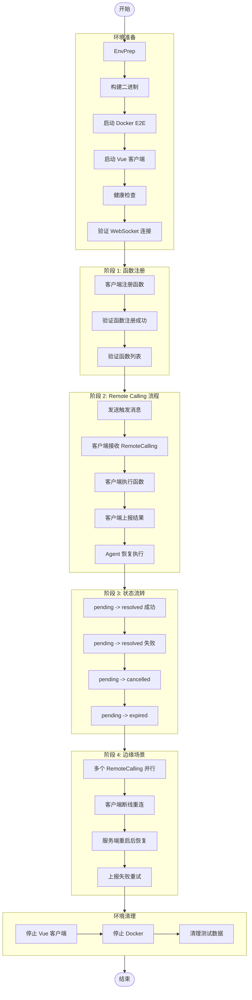

# TC-011-Vue: Remote Calling Vue 客户端联调测试

> **测试编号**: TC-011-Vue
> **测试类型**: 端到端联调测试
> **覆盖范围**: Vue 客户端函数注册、RemoteCalling Dialog 弹出、客户端执行函数、状态流转、边缘场景
> **环境**: Docker E2E + Vue 浏览器客户端
> **依赖**: [TC-011-Remote-Calling.md](TC-011-Remote-Calling.md)（Server 端测试用例）
> **最后更新**: 2026-07-22
> **版本**: v1.0

---

## 1. 概述

本测试用例覆盖 Xyncra Vue 客户端与 Server 的 **Remote Calling 联调测试**。验证 Vue 浏览器客户端能够正确处理 Remote Calling 的完整生命周期：函数注册、拉取 RemoteCallings、执行函数、上报结果。

**测试目标**：

- 验证 Vue 客户端 WebSocket 连接状态指示（FloatingAssistant）
- 验证客户端函数注册（`defineTestHelpers`）端到端流程
- 验证 RemoteCallingDialog 组件正确弹出并显示函数调用信息
- 验证 useRemoteCalling composable 的拉取、过滤、resolve 逻辑
- 验证客户端 IndexedDB 持久化（conversations, messages, remoteCallings, syncStates, retryQueue）
- 验证状态流转：pending -> resolved（成功/失败）、pending -> cancelled、pending -> expired
- 验证边缘场景：并行执行、断线重连、服务端重启恢复、上报失败重试

**覆盖的关键组件**：

| 组件 | 说明 |
|------|------|
| `FloatingAssistant` | 浮动助手按钮，显示连接状态 |
| `RemoteCallingDialog` | RemoteCalling 弹窗，显示函数调用信息 |
| `useRemoteCalling` | Composable，处理拉取、过滤、resolve 逻辑 |
| `SyncManager` | 同步管理器，处理 Update 事件 |
| `XyncraClient` | 核心客户端，WebSocket 连接和 RPC 调用 |

**覆盖的关键决策**：

- D-137: RemoteCalling 统一模型（Question 表废弃）
- D-138: 部分回答机制（所有 RemoteCalling resolved 后才触发 resume）
- D-115: 客户端函数动态注册
- D-118: pull-on-notification 模式
- D-124: updated_at 时间戳比较优化
- D-121: 幂等性 key
- D-123: 超时自动清理

---

## 2. 测试阶段划分

本测试用例按以下五个阶段组织：

| 阶段 | 名称 | 测试内容 | 用例数量 |
| --- | --- | --- | --- |
| 阶段 1 | 环境准备 | 启动服务器、Vue 客户端、验证 WebSocket 连接 | 3 |
| 阶段 2 | 函数注册测试 | 客户端注册函数、验证注册成功、验证函数列表 | 3 |
| 阶段 3 | Remote Calling 流程测试 | 发送触发消息、接收 RemoteCalling、执行函数、上报结果、Agent 恢复 | 5 |
| 阶段 4 | 状态流转测试 | pending->resolved(成功/失败)、pending->cancelled、pending->expired | 4 |
| 阶段 5 | 边缘场景测试 | 多个并行、断线重连、服务端重启、上报失败重试 | 4 |

**总计**: 5 个阶段，19 个测试用例

---

## 3. 环境拓扑

| 组件 | 容器/进程 | 端口 | 说明 |
|------|----------|------|------|
| Redis 7 | Docker | 16379 | DB 15，Checkpoint/锁/幂等性存储 |
| xyncra-server | Docker (xyncra-server-e2e) | 18080 | WebSocket + HTTP，SQLite: xyncra-e2e.db |
| Vue 客户端 | 浏览器 | 8848 | Vue Pure Admin 开发服务器（配置端口，若被占用 Vite 会自动选择其他端口） |
| LLM API | 外部服务 | - | 真实 LLM API 调用 |

**数据流向**：

```text
Vue 浏览器 --ws--> Server --llm--> LLM API
    |                    |
    v                    v
IndexedDB            SQLite DB
```

---

## 4. 前置条件

### 4.1 构建二进制

```bash
cd /path/to/xyncra-server
make build
```

确认产出：

- `bin/xyncra-server`
- `bin/xyncra-client`

### 4.2 启动 Docker E2E 环境

```bash
docker compose -f deploy/docker-compose.e2e.yml up -d
```

### 4.3 健康检查

```bash
curl -s http://localhost:18080/health
# 预期: {"status":"ok"}

redis-cli -p 16379 ping
# 预期: PONG
```

### 4.4 安装容器内工具

```bash
docker exec deploy-xyncra-server-e2e-1 apk add --no-cache sqlite
```

### 4.5 启动 Vue 客户端

```bash
cd demo/vue-pure-admin
pnpm install
pnpm dev
# 预期: 服务启动在 http://localhost:8848（若端口被占用，Vite 会自动选择其他端口，请查看终端输出）
```

### 4.6 配置 Agent

确认 Agent 配置中包含 `enable_client_tools: true`：

```bash
grep "enable_client_tools" agents/ui-assistant.md
# 预期: enable_client_tools: true
```

### 4.7 真实 LLM 配置 (.env)

确保 `.env` 已配置（参考 `.env.example`）：

```bash
test -f .env && echo "OK" || echo "MISSING"
```

| 变量 | 说明 |
|------|------|
| `XYNCRA_TEST_REAL_API_KEY` | LLM API 密钥 |
| `XYNCRA_TEST_REAL_BASE_URL` | LLM API 地址（可选，有默认值） |

### 4.8 测试前清理

测试前必须清理旧数据，避免 deviceID 冲突和状态污染：

```bash
# 1. 关闭所有浏览器 tab（避免旧设备连接冲突）
# 2. 清理 SQLite 中的 pending RemoteCallings
docker exec deploy-xyncra-server-e2e-1 sqlite3 /app/xyncra-e2e.db \
  "UPDATE remote_callings SET status='expired' WHERE status='pending';"
docker exec deploy-xyncra-server-e2e-1 sqlite3 /app/xyncra-e2e.db \
  "UPDATE conversations SET agent_status='idle', checkpoint_id=NULL WHERE agent_status!='idle';"

# 3. 清理 Redis 锁和函数注册
redis-cli -p 16379 -n 15 EVAL "for i,k in ipairs(redis.call('keys','agent:lock:*')) do redis.call('del',k) end" 0
redis-cli -p 16379 -n 15 EVAL "for i,k in ipairs(redis.call('keys','agent:checkpoint:*')) do redis.call('del',k) end" 0
redis-cli -p 16379 -n 15 EVAL "for i,k in ipairs(redis.call('keys','agent:processing:*')) do redis.call('del',k) end" 0
redis-cli -p 16379 -n 15 EVAL "for i,k in ipairs(redis.call('keys','xyncra:func:*')) do redis.call('del',k) end" 0

# 4. 重启 E2E Server 清除内存中的函数注册
docker compose -f deploy/docker-compose.e2e.yml restart xyncra-server-e2e
```

> **重要**: 如果有其他浏览器 tab 连接到 E2E Server，必须先关闭。否则 DynamicToolProvider 会使用旧设备的 deviceID 创建 RemoteCalling，导致新设备的 Dialog 不弹出。

---

## 5. 测试数据字典

| 变量 | 值 | 说明 |
|------|-----|------|
| `$SERVER_URL` | `ws://localhost:18080/ws` | E2E 服务器 WebSocket 地址 |
| `$VUE_URL` | `http://localhost:8848` | Vue Dev Server 地址（配置端口，若被占用请以 Vite 实际输出为准） |
| `$REDIS_ADDR` | `localhost:16379` | E2E Redis 地址 |
| `$REDIS_DB` | `15` | E2E Redis DB 编号 |
| `$USER_ID` | `test-user-vue` | 测试用户 ID |
| `$DEVICE_ID` | `test-device-<timestamp>` | 唯一设备 ID（每次测试动态生成） |
| `$CONV_ID` | (运行时获取) | 会话 ID |
| `$RC_ID` | (运行时获取) | RemoteCalling ID |
| `$CHECKPOINT_ID` | (运行时获取) | Checkpoint ID |

---

## 6. 完整流程图



---

## 7. 分步执行指南

# 阶段 1: 环境准备

> **目标**: 验证 Docker E2E 服务器、Vue 客户端启动成功，WebSocket 连接正常。

### 步骤 1.1: 启动服务器并验证健康检查

**操作**：

```bash
# 启动 Docker E2E 环境
docker compose -f deploy/docker-compose.e2e.yml up -d
sleep 5

# 健康检查
curl -s http://localhost:18080/health
redis-cli -p 16379 ping
```

**验证（服务器）**：

```bash
# 预期: {"status":"ok"}
# 预期: PONG
```

**判定**: Docker E2E 环境启动成功，服务器健康检查通过。

---

### 步骤 1.2: 启动 Vue 客户端并验证页面加载

**操作**：

```bash
# 启动 Vue Dev Server
cd demo/vue-pure-admin
pnpm dev
# 等待 Vite ready 输出
```

**验证（客户端）**：
- 打开浏览器访问 Vue Dev Server 地址
- 页面正常加载，无控制台错误

**判定**: Vue 客户端启动成功，页面正常加载。

---

### 步骤 1.3: 验证 WebSocket 连接（FloatingAssistant 状态）

**操作**：
1. 打开浏览器访问 Vue Dev Server 地址
2. 登录应用
3. 观察 FloatingAssistant 按钮颜色

**验证（客户端 -- DOM）**：
- FloatingAssistant 按钮显示为**绿色**（已连接）

**验证（服务器日志）**：

```bash
docker logs xyncra-server-e2e 2>&1 | grep -i "websocket\|connected" | tail -5
# 预期: 看到 WebSocket 连接建立日志
```

**验证（Redis）**：

```bash
redis-cli -p 16379 -n 15 SMEMBERS "xyncra:conn:user:test-user-vue"
# 预期: 包含至少一个 connID
```

**判定**: FloatingAssistant 按钮为绿色，Redis 中有连接记录，WebSocket 连接正常。

---

# 阶段 2: 函数注册测试

> **目标**: 验证 Vue 页面通过 `defineTestHelpers` 注册函数后，服务端收到 `register_functions` RPC 调用。

### 步骤 2.1: 导航到目标页面触发函数注册

**操作**：
1. 在 Vue 客户端导航到目标页面（如 ChatAI 页面）
2. 页面加载时自动调用 `defineTestHelpers` 注册函数

**验证（服务器日志）**：

```bash
docker logs xyncra-server-e2e 2>&1 | grep -i "register_functions" | tail -10
# 预期: 看到 register_functions 调用，count >= 1
```

**判定**: Server 收到 `system.register_functions` RPC 调用。

---

### 步骤 2.2: 验证函数命名规则

**验证（服务器日志）**：

```bash
docker logs xyncra-server-e2e 2>&1 | grep -i "register_functions" | grep -o "pg_[a-z_]*" | sort -u
# 预期: 看到符合 pg_{pageKey}_{functionName} 格式的函数名
```

**判定**: 函数命名规则正确，符合 `pg_{pageKey}_{functionName}` 格式。

---

### 步骤 2.3: 验证函数注册成功

**验证（服务器日志）**：

```bash
docker logs deploy-xyncra-server-e2e-1 2>&1 | grep -i "register_functions" | tail -5
# 预期: 看到 "system.register_functions: registered X functions for userID=xxx deviceID=xxx"
```

**说明**: 函数注册信息存储在服务器内存中（MemoryFunctionRegistry），而不是 Redis 中。这是因为函数注册是临时的，设备断开连接后函数注册信息会被清除。

**判定**: 服务器日志显示函数注册成功。

---

# 阶段 3: Remote Calling 流程测试

> **目标**: 验证 Remote Calling 完整流程：发送触发消息、客户端接收 RemoteCalling、执行函数、上报结果、Agent 恢复。

### 步骤 3.1: 发送消息触发 Agent 调用客户端函数

**操作**：

1. 先导航到有 pg_* 函数的页面（如 `/form/index`），确保函数已注册
2. 在 Vue 客户端的 FloatingAssistant 中打开聊天面板，创建新会话
3. 发送消息："请帮我填写标题为'测试任务'"
4. 点击发送按钮

> **注意**: Agent 会先调用 `get_page_description`、`get_current_page` 等探索函数，再调用 `pg_*` 执行函数。测试脚本需要逐个 resolve 每个 RemoteCalling Dialog。

**验证（数据库 -- SQLite）**：

```bash
DB="docker exec deploy-xyncra-server-e2e-1 sqlite3 /app/xyncra-e2e.db"

# 查看最近的 RemoteCalling 记录
$DB "SELECT id, conversation_id, method, device_id, status FROM remote_callings ORDER BY created_at DESC LIMIT 5;"
# 预期: 多条记录，method 包含 get_page_description、get_current_page、pg_* 等，status=pending
```

**验证（Redis Checkpoint）**：

```bash
R="redis-cli -p 16379 -n 15"

# 获取 checkpoint_id
CHECKPOINT_ID=$($DB "SELECT checkpoint_id FROM remote_callings WHERE status='pending' ORDER BY created_at DESC LIMIT 1;")
echo "CHECKPOINT_ID=$CHECKPOINT_ID"

$R EXISTS "agent:checkpoint:$CHECKPOINT_ID"
# 预期: 1
```

**验证（客户端 -- RemoteCallingDialog 弹出）**：
- RemoteCallingDialog 弹出
- Dialog 显示函数调用信息（method, params）

**判定**: Agent 决定调用客户端函数 -> Server 创建 RemoteCalling -> Vue 客户端收到 Update -> Dialog 弹出。

---

### 步骤 3.2: 验证 RemoteCallingDialog 显示内容

**验证（客户端 -- DOM）**：
- Dialog 标题正确显示
- 方法名显示正确
- 参数显示为 JSON 格式
- 结果输入框可编辑
- 提交按钮可用
- 取消按钮可点击

**验证（数据库 -- Conversation agent_status）**：

```bash
DB="docker exec deploy-xyncra-server-e2e-1 sqlite3 /app/xyncra-e2e.db"

CONV_ID=$($DB "SELECT conversation_id FROM remote_callings WHERE status='pending' ORDER BY created_at DESC LIMIT 1;")
$DB "SELECT agent_status, agent_id, checkpoint_id FROM conversations WHERE id='$CONV_ID';"
# 预期: agent_status=tool_calling, checkpoint_id 非空
```

**判定**: Dialog 正确显示 RemoteCalling 的方法名、参数，并提供结果输入框和取消按钮。

---

### 步骤 3.3: 客户端执行函数并上报结果

**操作**：
1. 在 RemoteCallingDialog 中查看函数信息
2. 客户端自动执行函数（或用户手动确认）
3. 函数执行完成后，客户端自动调用 `agent_resume` RPC

**验证（数据库 -- SQLite -- RemoteCalling 状态变更）**：

```bash
DB="docker exec deploy-xyncra-server-e2e-1 sqlite3 /app/xyncra-e2e.db"

RC_ID=$($DB "SELECT id FROM remote_callings ORDER BY created_at DESC LIMIT 1;")
$DB "SELECT id, status, success, result, resolved_at FROM remote_callings WHERE id='$RC_ID';"
# 预期: status=resolved, success=1, result 包含执行结果, resolved_at 非空
```

**验证（服务器日志）**：

```bash
docker logs xyncra-server-e2e 2>&1 | grep "agent_resume" | tail -5
# 预期: 看到 agent_resume 调用
```

**验证（客户端 -- Dialog 关闭）**：
- RemoteCallingDialog 关闭

**判定**: 客户端执行函数 -> 上报结果 -> RemoteCalling 状态变为 resolved。

---

### 步骤 3.4: Agent 恢复执行

**操作**：
1. 等待 Agent 恢复执行（约 10-15 秒）
2. 观察 ChatAI 页面是否收到 Agent 回复

**验证（数据库 -- SQLite）**：

```bash
DB="docker exec deploy-xyncra-server-e2e-1 sqlite3 /app/xyncra-e2e.db"

# 检查 Conversation agent_status
$DB "SELECT agent_status FROM conversations WHERE id='$CONV_ID';"
# 预期: 不再为 tool_calling（恢复为 idle）

# 检查 Agent 回复消息
$DB "SELECT sender_id, SUBSTR(content, 1, 100) FROM messages WHERE conversation_id='$CONV_ID' AND sender_id LIKE 'agent/%' ORDER BY created_at DESC LIMIT 3;"
# 预期: 包含 Agent 的最终回复
```

**验证（客户端）**：
- ChatAI 页面显示 Agent 的最终回复

**判定**: Agent 恢复执行，生成最终回复。

---

### 步骤 3.5: 完整流程验证

**判定**: Remote Calling 完整流程通过——Agent 调用函数 -> RemoteCalling 创建 -> 客户端接收并执行 -> 上报结果 -> Agent 恢复执行。

---

# 阶段 4: 状态流转测试

> **目标**: 验证 RemoteCalling 的状态流转：pending -> resolved（成功/失败）、pending -> cancelled、pending -> expired。

## 4.1 pending -> resolved（成功）

### 步骤 4.1.1: 创建新会话并触发 RemoteCalling

**操作**：
1. 在 Vue 客户端创建新会话
2. 发送消息触发函数调用

**预期结果**：
- RemoteCalling 创建，status=pending
- RemoteCallingDialog 弹出

### 步骤 4.1.2: 验证状态变为 resolved（成功）

**操作**：
1. 客户端执行函数成功
2. 上报 success=true, result="执行结果"

**验证（数据库）**：

```bash
DB="docker exec deploy-xyncra-server-e2e-1 sqlite3 /app/xyncra-e2e.db"

$DB "SELECT id, status, success, result, resolved_at FROM remote_callings ORDER BY created_at DESC LIMIT 1;"
# 预期: status=resolved, success=1, result 包含结果, resolved_at 非空
```

**判定**: pending -> resolved（成功）状态流转正确。

---

## 4.2 pending -> resolved（失败）

### 步骤 4.2.1: 创建新会话并触发 RemoteCalling

**操作**：
1. 在 Vue 客户端创建新会话
2. 发送消息触发函数调用

### 步骤 4.2.2: 验证状态变为 resolved（失败）

**操作**：
1. 客户端执行函数失败
2. 上报 success=false, error_message="执行失败原因"

**验证（数据库）**：

```bash
DB="docker exec deploy-xyncra-server-e2e-1 sqlite3 /app/xyncra-e2e.db"

$DB "SELECT id, status, success, error_message, resolved_at FROM remote_callings ORDER BY created_at DESC LIMIT 1;"
# 预期: status=resolved, success=0, error_message 非空, resolved_at 非空
```

### 步骤 4.2.3: 验证 Agent 恢复执行（携带错误信息）

**验证（数据库）**：

```bash
DB="docker exec deploy-xyncra-server-e2e-1 sqlite3 /app/xyncra-e2e.db"

CONV_ID=$($DB "SELECT conversation_id FROM remote_callings ORDER BY created_at DESC LIMIT 1;")
$DB "SELECT agent_status FROM conversations WHERE id='$CONV_ID';"
# 预期: 不再为 tool_calling（恢复为 idle）

$DB "SELECT sender_id, SUBSTR(content, 1, 100) FROM messages WHERE conversation_id='$CONV_ID' AND sender_id LIKE 'agent/%' ORDER BY created_at DESC LIMIT 3;"
# 预期: Agent 回复中包含对错误的处理说明
```

**判定**: pending -> resolved（失败）状态流转正确，Agent 恢复执行并处理错误。

---

## 4.3 pending -> cancelled（用户取消）

### 步骤 4.3.1: 创建新会话并触发 RemoteCalling

**操作**：
1. 在 Vue 客户端创建新会话
2. 发送消息触发函数调用
3. 等待 RemoteCallingDialog 弹出

### 步骤 4.3.2: 用户点击取消按钮

**操作**：
1. 在 RemoteCallingDialog 中点击"取消"按钮

**验证（数据库）**：

```bash
DB="docker exec deploy-xyncra-server-e2e-1 sqlite3 /app/xyncra-e2e.db"

# 获取 checkpoint_id
CHECKPOINT_ID=$($DB "SELECT checkpoint_id FROM remote_callings ORDER BY created_at DESC LIMIT 1;")

# 验证状态变更
$DB "SELECT id, status, cancelled_at, cancelled_by, cancel_reason FROM remote_callings WHERE checkpoint_id='$CHECKPOINT_ID';"
# 预期: status=cancelled, cancelled_at 非空, cancelled_by 包含用户 ID
```

### 步骤 4.3.3: 验证 CancelledBy 持久化

**验证（数据库）**：

```bash
DB="docker exec deploy-xyncra-server-e2e-1 sqlite3 /app/xyncra-e2e.db"

$DB "SELECT cancelled_by FROM remote_callings WHERE checkpoint_id='$CHECKPOINT_ID' LIMIT 1;"
# 预期: 包含用户 ID（如 test-user-vue）
```

### 步骤 4.3.4: 验证取消后锁释放

**验证（Redis）**：

```bash
R="redis-cli -p 16379 -n 15"

CONV_ID=$(docker exec deploy-xyncra-server-e2e-1 sqlite3 /app/xyncra-e2e.db "SELECT conversation_id FROM remote_callings WHERE checkpoint_id='$CHECKPOINT_ID' LIMIT 1;")
$R EXISTS "agent:lock:$CONV_ID"
# 预期: 0（锁已释放）
```

**判定**: pending -> cancelled 状态流转正确，CancelledBy 持久化，锁释放。

---

## 4.4 pending -> expired（超时过期）

### 步骤 4.4.1: 创建新会话并触发 RemoteCalling

**操作**：
1. 在 Vue 客户端创建新会话
2. 发送消息触发函数调用

### 步骤 4.4.2: 手动修改 expires_at 模拟过期

```bash
DB="docker exec deploy-xyncra-server-e2e-1 sqlite3 /app/xyncra-e2e.db"

RC_ID=$($DB "SELECT id FROM remote_callings WHERE status='pending' ORDER BY created_at DESC LIMIT 1;")

# 将 expires_at 设置为 1 小时前
$DB "UPDATE remote_callings SET expires_at = datetime('now', '-1 hour') WHERE id='$RC_ID';"
```

### 步骤 4.4.3: 等待后台清理任务执行

```bash
# 后台清理任务每 5 分钟执行一次，等待 360 秒确保至少执行一次
sleep 360
```

### 步骤 4.4.4: 验证状态变为 expired

**验证（数据库）**：

```bash
DB="docker exec deploy-xyncra-server-e2e-1 sqlite3 /app/xyncra-e2e.db"

$DB "SELECT id, status FROM remote_callings WHERE id='$RC_ID';"
# 预期: status=expired
```

### 步骤 4.4.5: 验证超时后对话清理

**验证（数据库）**：

```bash
DB="docker exec deploy-xyncra-server-e2e-1 sqlite3 /app/xyncra-e2e.db"

CONV_ID=$($DB "SELECT conversation_id FROM remote_callings WHERE id='$RC_ID';")
$DB "SELECT agent_status FROM conversations WHERE id='$CONV_ID';"
# 预期: 不再为 tool_calling（已清理为 idle）

# 检查是否发送了超时消息
$DB "SELECT sender_id, SUBSTR(content, 1, 50) FROM messages WHERE conversation_id='$CONV_ID' AND content LIKE '%超时%' ORDER BY created_at DESC LIMIT 1;"
# 预期: 包含 "远程函数调用超时" 的消息
```

**判定**: pending -> expired 状态流转正确，对话被清理，超时消息发送。

---

# 阶段 5: 边缘场景测试

> **目标**: 验证边缘场景：多个 RemoteCalling 并行执行、客户端断线重连、服务端重启后恢复、上报失败重试。

## 5.1 多个 RemoteCalling 并行执行

### 步骤 5.1.1: 创建会话并触发多函数调用

**操作**：

1. 在 Vue 客户端创建新会话
2. 发送消息："请帮我获取当前页面信息，然后填写表单标题为'测试'并点击提交按钮"

> **注意**: Agent 会并行或串行调用多个函数（如 get_current_page、get_page_description、pg_form_index_fillTitle、pg_form_index_clickSubmit 等）。实际调用的函数取决于 Agent 的 LLM 决策和页面注册的 pg_* 函数。

### 步骤 5.1.2: 验证多个 RemoteCalling 被创建

**验证（数据库）**：

```bash
DB="docker exec deploy-xyncra-server-e2e-1 sqlite3 /app/xyncra-e2e.db"

$DB "SELECT id, method, status FROM remote_callings ORDER BY created_at DESC LIMIT 10;"
# 预期: 多条记录，包含不同的 method
```

**验证（客户端）**：
- RemoteCallingDialog 显示多个 tab（使用 el-tabs 组件）

### 步骤 5.1.3: 验证全部 resolved 后 Agent 恢复

**操作**：
1. 逐个 resolve 所有 RemoteCalling
2. 等待 Agent 恢复

**验证（数据库）**：

```bash
DB="docker exec deploy-xyncra-server-e2e-1 sqlite3 /app/xyncra-e2e.db"

CONV_ID=$($DB "SELECT conversation_id FROM remote_callings ORDER BY created_at DESC LIMIT 1;")
$DB "SELECT status, COUNT(*) FROM remote_callings WHERE conversation_id='$CONV_ID' GROUP BY status;"
# 预期: 全部为 resolved

$DB "SELECT agent_status FROM conversations WHERE id='$CONV_ID';"
# 预期: 不再为 tool_calling
```

**判定**: 多个并行 RemoteCalling 被创建，客户端逐个处理，全部 resolved 后 Agent 恢复执行。

**注意**：当有多个 RemoteCalling 时，RemoteCallingDialog 使用 `el-tabs` 组件，每个 tab 都有自己的 textarea。测试时需要使用 `fillAllDialogResults` 函数或 `.first()` 选择器来避免 strict mode violation。

---

## 5.2 客户端断线重连

### 步骤 5.2.1: 触发 RemoteCalling 后断开 WebSocket

**操作**：
1. 在 Vue 客户端创建新会话
2. 发送消息触发函数调用
3. 等待 RemoteCallingDialog 弹出
4. 断开 WebSocket 连接（关闭浏览器标签页或断网）

**验证（客户端）**：
- FloatingAssistant 按钮变为红色（断开）

**验证（数据库）**：

```bash
DB="docker exec deploy-xyncra-server-e2e-1 sqlite3 /app/xyncra-e2e.db"

$DB "SELECT id, status FROM remote_callings WHERE status='pending' ORDER BY created_at DESC LIMIT 1;"
# 预期: 仍有 pending 记录（不因断线而消失）
```

### 步骤 5.2.2: 重新连接

**操作**：
1. 重新打开 Vue 客户端
2. 等待 WebSocket 自动重连

**验证（客户端）**：
- FloatingAssistant 按钮变为绿色（已连接）
- RemoteCallingDialog 重新弹出

### 步骤 5.2.3: 验证重连后自动拉取并处理

**验证（数据库）**：

```bash
DB="docker exec deploy-xyncra-server-e2e-1 sqlite3 /app/xyncra-e2e.db"

RC_ID=$($DB "SELECT id FROM remote_callings WHERE status='pending' ORDER BY created_at DESC LIMIT 1;")

# 等待客户端处理
sleep 15

$DB "SELECT id, status FROM remote_callings WHERE id='$RC_ID';"
# 预期: 状态变为 resolved（客户端重连后自动处理）
```

**判定**: 断线后 FloatingAssistant 变红 -> 重连后变绿 -> 自动拉取 -> 未处理的 RemoteCalling 不丢失 -> 可继续处理。

---

## 5.3 服务端重启后恢复

### 步骤 5.3.1: 触发 RemoteCalling

**操作**：
1. 在 Vue 客户端创建新会话
2. 发送消息触发函数调用
3. 等待 RemoteCallingDialog 弹出

### 步骤 5.3.2: 记录重启前状态

```bash
DB="docker exec deploy-xyncra-server-e2e-1 sqlite3 /app/xyncra-e2e.db"

RC_ID=$($DB "SELECT id FROM remote_callings WHERE status='pending' ORDER BY created_at DESC LIMIT 1;")
echo "RC_ID=$RC_ID"

echo "=== 重启前状态 ==="
$DB "SELECT id, status FROM remote_callings WHERE id='$RC_ID';"

R="redis-cli -p 16379 -n 15"
$R KEYS "agent:checkpoint:*"
```

### 步骤 5.3.3: 重启服务器

```bash
docker compose -f deploy/docker-compose.e2e.yml stop xyncra-server-e2e
sleep 2

docker compose -f deploy/docker-compose.e2e.yml start xyncra-server-e2e
sleep 8

curl -s http://localhost:18080/health
# 预期: {"status":"ok"}
```

### 步骤 5.3.4: 验证重启后数据存活

**验证（数据库）**：

```bash
DB="docker exec deploy-xyncra-server-e2e-1 sqlite3 /app/xyncra-e2e.db"

# RemoteCalling 记录仍在
$DB "SELECT id, status FROM remote_callings WHERE id='$RC_ID';"
# 预期: 与重启前一致（status=pending）

# Checkpoint 仍在（Redis 持久化）
R="redis-cli -p 16379 -n 15"
CHECKPOINT_ID=$($DB "SELECT checkpoint_id FROM remote_callings WHERE id='$RC_ID';")
$R EXISTS "agent:checkpoint:$CHECKPOINT_ID"
# 预期: 1（Checkpoint 仍在 Redis 中）
```

### 步骤 5.3.5: 客户端重新连接并处理

**操作**：
1. 刷新 Vue 客户端页面
2. 等待 WebSocket 重连
3. 等待客户端自动拉取 RemoteCalling

**验证（客户端）**：
- FloatingAssistant 按钮变为绿色（已连接）
- RemoteCallingDialog 弹出
- 用户可以正常 resolve

**验证（数据库）**：

```bash
sleep 15

DB="docker exec deploy-xyncra-server-e2e-1 sqlite3 /app/xyncra-e2e.db"

$DB "SELECT id, status FROM remote_callings WHERE id='$RC_ID';"
# 预期: 状态已更新（resolved 或被处理）
```

**判定**: 服务端重启后，RemoteCalling 和 Checkpoint 数据存活，客户端重连后自动拉取并处理。

---

## 5.4 上报失败重试

### 步骤 5.4.1: 验证客户端本地重试队列

**说明**：上报失败重试是客户端行为。当 `agent_resume` RPC 返回服务端错误时，客户端将结果保存到本地重试队列（IndexedDB `retryQueue` store），指数退避重试。

**验证方法（浏览器控制台）**：

```javascript
// 检查 IndexedDB 中的重试队列
const db = await Dexie.open('xyncra');
const retryItems = await db.retryQueue.toArray();
console.log('重试队列:', retryItems);
// 预期: 可能为空（如果没有失败的重试），或显示重试记录
```

### 步骤 5.4.2: 验证退避策略

**说明**：客户端使用指数退避策略，上限 16 秒。

| 重试次数 | 等待时间 |
| --- | --- |
| 1 | 1s |
| 2 | 2s |
| 3 | 4s |
| 4 | 8s |
| 5+ | 16s (上限) |

**验证方法**：
- 模拟服务端不可用
- 观察客户端重试日志中的时间间隔
- 确认符合指数退避策略

**判定**: 客户端上报失败时有重试机制。如果当前没有失败的重试任务，此场景标记为 INCONCLUSIVE（需要模拟服务端不可用来触发）。

---

## 8. 验证方法汇总

### 8.1 Server SQLite 验证命令速查

```bash
DB="docker exec deploy-xyncra-server-e2e-1 sqlite3 /app/xyncra-e2e.db"

# RemoteCallings 表 -- 完整字段
$DB "SELECT id, conversation_id, checkpoint_id, agent_id, method, device_id, status FROM remote_callings ORDER BY created_at DESC LIMIT 10;"

# RemoteCallings 状态统计
$DB "SELECT status, COUNT(*) FROM remote_callings GROUP BY status;"

# 按会话查询
$DB "SELECT id, method, status, success, result FROM remote_callings WHERE conversation_id='<conv-id>' ORDER BY created_at;"

# 取消记录
$DB "SELECT id, status, cancelled_at, cancelled_by, cancel_reason FROM remote_callings WHERE status='cancelled';"

# Conversation agent_status
$DB "SELECT id, agent_status, agent_id, checkpoint_id FROM conversations ORDER BY updated_at DESC LIMIT 5;"

# 消息
$DB "SELECT sender_id, SUBSTR(content, 1, 100) FROM messages WHERE conversation_id='<conv-id>' ORDER BY created_at DESC LIMIT 5;"

# 复合索引验证
$DB ".indices remote_callings"
# 预期: 包含 idx_rc_conversation_status, idx_rc_checkpoint_status, idx_rc_status_expires
```

### 8.2 Server Redis 验证命令速查

```bash
R="redis-cli -p 16379 -n 15"

# Checkpoint
$R KEYS "agent:checkpoint:*"
$R GET "agent:checkpoint:<checkpoint-id>"
$R TTL "agent:checkpoint:<checkpoint-id>"

# 会话锁
$R KEYS "agent:lock:*"
$R GET "agent:lock:<conversation-id>"

# 函数注册（存储在服务器内存中，不在 Redis 中）
# 通过服务器日志验证: docker logs deploy-xyncra-server-e2e-1 2>&1 | grep "register_functions"

# 连接信息
$R SMEMBERS "xyncra:conn:user:<user-id>"
```

### 8.3 Server 日志验证命令速查

```bash
# 应用日志
docker logs xyncra-server-e2e 2>&1 | tail -50

# 按级别过滤
docker logs xyncra-server-e2e 2>&1 | grep 'level=ERROR'
docker logs xyncra-server-e2e 2>&1 | grep 'level=WARN'

# 函数注册日志
docker logs xyncra-server-e2e 2>&1 | grep -i "register_functions"

# agent_resume 日志
docker logs xyncra-server-e2e 2>&1 | grep "agent_resume"

# cancel_remote_calls 日志
docker logs xyncra-server-e2e 2>&1 | grep "cancel_remote_calls"
```

### 8.4 客户端 IndexedDB 验证

| Store | 用途 | 关键字段 |
|-------|------|----------|
| `conversations` | 会话 | `id`, `agent_status`, `checkpoint_id` |
| `messages` | 消息 | `id`, `conversation_id`, `sender_id`, `content` |
| `remoteCallings` | RemoteCalling | `id`, `conversation_id`, `method`, `status` |
| `syncStates` | 同步状态 | `key` (`local_max_seq`, `latest_seq`) |
| `retryQueue` | 重试队列 | `remote_calling_id`, `retry_count`, `next_retry_at` |

**验证方法（浏览器控制台）**：

```javascript
// 打开 IndexedDB
const db = await Dexie.open('xyncra');

// 查询 RemoteCallings
const rcList = await db.remoteCallings.toArray();
console.log('RemoteCallings:', rcList);

// 查询重试队列
const retryList = await db.retryQueue.toArray();
console.log('重试队列:', retryList);

// 查询同步状态
const syncStates = await db.syncStates.toArray();
console.log('同步状态:', syncStates);
```

---

## 9. 通过/失败判定标准

| 阶段 | 判定条件 | 通过 | 失败处理 |
| --- | --- | :---: | --- |
| **阶段 1: 环境准备** | | | |
| 步骤 1.1 | Docker E2E 启动成功 | pass | 检查 docker compose 配置 |
| 步骤 1.2 | Vue 客户端启动成功 | pass | 检查 pnpm dev |
| 步骤 1.3 | FloatingAssistant 连接成功（绿色） | pass | 检查 WebSocket 连接 |
| **阶段 2: 函数注册** | | | |
| 步骤 2.1 | Server 收到 register_functions | pass | 检查 defineTestHelpers 调用 |
| 步骤 2.2 | 函数命名规则正确 | pass | 检查 pg_{pageKey}_{functionName} 格式 |
| 步骤 2.3 | 函数注册成功 | pass | 检查服务器日志 register_functions |
| **阶段 3: Remote Calling 流程** | | | |
| 步骤 3.1 | RemoteCalling 记录创建到 DB | pass | 检查 Agent 配置、LLM 调用 |
| 步骤 3.2 | RemoteCallingDialog 弹出 | pass | 检查 useRemoteCalling 挂载 |
| 步骤 3.3 | 客户端执行函数并上报 | pass | 检查 agent_resume RPC |
| 步骤 3.4 | Agent 恢复执行 | pass | 检查 Checkpoint、锁 |
| **阶段 4: 状态流转** | | | |
| 步骤 4.1.2 | pending -> resolved（成功） | pass | |
| 步骤 4.2.2 | pending -> resolved（失败） | pass | 检查 ResolveError 实现 |
| 步骤 4.3.2 | pending -> cancelled | pass | 检查 cancel_remote_calls RPC |
| 步骤 4.3.3 | CancelledBy 持久化 | pass | |
| 步骤 4.3.4 | 取消后锁释放 | pass | |
| 步骤 4.4.4 | pending -> expired | pass | 检查后台清理任务 |
| **阶段 5: 边缘场景** | | | |
| 步骤 5.1.2 | 多个 RemoteCalling 并行创建 | pass | |
| 步骤 5.1.3 | 全部 resolved 后 Agent 恢复 | pass | |
| 步骤 5.2.3 | 断线重连后自动处理 | pass | 检查 fullSync、重连逻辑 |
| 步骤 5.3.4 | 服务端重启后数据存活 | pass | 检查 Redis 持久化 |
| 步骤 5.3.5 | 重启后客户端重新处理 | pass | |
| 步骤 5.4.2 | 上报失败有重试机制 | pass / INCONCLUSIVE | |

---

## 10. 故障排查指南

| 症状 | 可能原因 | 解决方法 |
|------|---------|---------|
| FloatingAssistant 按钮不出现 | Vue 组件未加载 | 检查 `pnpm dev` 是否运行，检查路由 |
| 按钮为黄色（连接中） | WebSocket 连接中 | 等待 5 秒，检查 Server 是否启动 |
| 按钮为红色（断开） | WebSocket 连接失败 | 检查 Server URL、网络、token |
| Agent 不回复 | Docker E2E 未启动 | 检查 `docker compose up -d`，查看 Server 日志 |
| Agent 回复但无 RemoteCalling | Agent 未调用客户端函数 | 查看 LLM 日志 `tool_call` 阶段 |
| RemoteCallingDialog 不弹出 | useRemoteCalling 未挂载 | 检查 FloatingAssistant 组件是否使用了 composable |
| Dialog 显示但无参数 | params 解析失败 | 检查 Server 返回的 params 格式 |
| agent_resume 失败 | RemoteCalling 已过期 | 检查 `expires_at` 字段 |
| 提交后 Dialog 不关闭 | agent_resume 返回错误 | 查看 Server 日志、客户端控制台 |
| IndexedDB 无记录 | Dexie 事务失败 | 查看浏览器控制台错误 |
| 断线后不重连 | 重连逻辑异常 | 检查 XyncraClient 的 reconnect 逻辑 |
| 函数未注册 | defineTestHelpers 未调用 | 检查页面组件的 `<script setup>` 顶层 |
| DeviceID 过滤不生效 | 客户端过滤逻辑错误 | 检查 `useRemoteCalling` 的 filter 条件 |
| 超时后仍显示 expired 记录 | 客户端未过滤 expired | 检查 `fetchRemoteCallings` 的 WHERE 条件 |
| 取消后 Agent 未恢复 | cancel_remote_calls 未触发 resume | 检查 Server 的 cancel handler 逻辑 |
| 重连后 RemoteCalling 丢失 | fullSync 未执行 | 检查 SyncManager 的 fullSync 逻辑 |

### 10.1 已知问题与解决方案

#### 问题 1: Device ID 冲突导致 RemoteCallingDialog 不弹出

**现象**: 测试发送消息后，Agent 创建了 RemoteCalling（SQLite 中 status=pending），但客户端的 RemoteCallingDialog 不弹出。

**根因**: `DynamicToolProvider` 在 `BeforeAgent` 中通过 `GetFunctionsByUser` 获取所有设备注册的函数，然后按 deviceID 字典序去重——**选择字典序最小的 deviceID**。如果之前有浏览器 tab 以 UUID（如 `c2993800-...`）连接过，而测试使用 `test-device-...` 格式的 deviceID，Agent 会使用旧设备的 deviceID 创建 RemoteCalling。客户端的 `useRemoteCalling` composable 按 deviceID 过滤，新设备看不到旧设备的 RemoteCalling。

**解决方案**:
1. 测试前关闭所有浏览器 tab（包括手动测试留下的）
2. 重启 E2E Server 清除内存中的函数注册
3. 测试脚本在 `login()` 中设置 `localStorage.setItem('xyncra-device-id', DEVICE_ID)` 确保 deviceID 一致

#### 问题 2: Agent 调用过多函数导致超时

**现象**: Agent 发送 "抱歉，远程函数调用超时，请重新发送消息"，测试等待 Dialog 超时。

**根因**: `ui-assistant` 的 prompt 指示 Agent 先调用 `get_page_description`、`get_current_page`、`get_form_data` 等探索函数，再调用 `pg_*` 或 `type_text` 执行操作。每个函数调用创建一个 RemoteCalling（30 秒超时），测试脚本需要逐个 resolve。如果 Agent 在 30 秒内创建了 6+ 个 RemoteCalling，最后一个会超时。

**解决方案**:
1. 测试脚本的 Dialog resolve 循环需要更高效（减少等待时间）
2. 或者在 Agent 配置中增加 `call_timeout`
3. 或者简化 Agent prompt 减少探索函数调用

#### 问题 3: 多 Tab Dialog 导致 strict mode violation

**现象**: `locator.fill: Error: strict mode violation: locator('.rc-result-section textarea') resolved to 2 elements`

**根因**: RemoteCallingDialog 使用 `el-tabs` 组件，当有多个 RemoteCalling 时，每个 tab 都有自己的 textarea。选择器 `.rc-result-section textarea` 匹配所有 tab 的 textarea。

**解决方案**: 使用 `fillAllDialogResults` 函数，通过 `page.evaluate` 直接设置所有 textarea 的值，或使用 `.first()` 选择器。

---

## 11. 环境清理

```bash
# 停止 Docker E2E
docker compose -f deploy/docker-compose.e2e.yml down

# 停止 Vue Dev Server（如果在后台运行）
# Ctrl+C 或 kill 对应进程

# 清理 Redis（可选）
redis-cli -p 16379 -n 15 FLUSHDB
```

---

## 12. 关键源码参考

| 文件 | 说明 |
|------|------|
| `demo/vue-pure-admin/packages/xyncra-client-core/src/sync-manager.ts` | SyncManager: Update 处理、RemoteCalling 同步 |
| `demo/vue-pure-admin/packages/xyncra-client-core/src/db/models.ts` | 数据模型定义（RemoteCalling, RetryQueueItem 等） |
| `demo/vue-pure-admin/packages/xyncra-client-core/src/db/index.ts` | IndexedDB Schema 定义 |
| `demo/vue-pure-admin/packages/xyncra-client-vue/src/composables/useRemoteCalling.ts` | useRemoteCalling composable: 拉取、过滤、resolve 逻辑 |
| `demo/vue-pure-admin/packages/xyncra-client-vue/src/components/RemoteCallingDialog.vue` | RemoteCallingDialog 组件: UI 渲染 |
| `demo/vue-pure-admin/packages/xyncra-client-vue/src/internal/VueUpdateHandler.ts` | VueUpdateHandler: Update 事件分发 |
| `demo/vue-pure-admin/packages/xyncra-client-vue/src/defineTestHelpers.ts` | 声明式注册 API |
| `internal/store/model/remote_calling.go` | RemoteCalling 数据模型 |
| `internal/store/remote_calling.go` | RemoteCallingStore 实现 |
| `internal/handler/agent_resume.go` | agent_resume RPC handler |
| `internal/handler/cancel_remote_calls.go` | cancel_remote_calls RPC handler |
| `internal/agent/resume_handler.go` | Agent resume MQ handler |
| `internal/agent/remote_calling_cleanup.go` | 超时清理任务 |

---

## 13. 测试执行记录模板

```markdown
### TC-011-Vue 测试执行记录

| 字段 | 值 |
|------|-----|
| 日期 | YYYY-MM-DD |
| Git Commit | <sha> |
| 测试者 | <name> |
| 环境 | Docker E2E + Vue 浏览器客户端 |
| Vue Dev Server | http://localhost:<port> |
| Device ID | test-device-<timestamp> |

#### 阶段 1: 环境准备

| 步骤 | 结果 | 备注 |
| --- | --- | --- |
| 步骤 1.1: Docker E2E 启动 | pass / fail | |
| 步骤 1.2: Vue 客户端启动 | pass / fail | |
| 步骤 1.3: WebSocket 连接 | pass / fail | |

#### 阶段 2: 函数注册测试

| 步骤 | 结果 | 备注 |
| --- | --- | --- |
| 步骤 2.1: register_functions | pass / fail | D-115 |
| 步骤 2.2: 函数命名规则 | pass / fail | |
| 步骤 2.3: 函数注册成功 | pass / fail | |

#### 阶段 3: Remote Calling 流程

| 步骤 | 结果 | 备注 |
| --- | --- | --- |
| 步骤 3.1: RemoteCalling 创建 | pass / fail | D-137 |
| 步骤 3.2: RemoteCallingDialog 弹出 | pass / fail | |
| 步骤 3.3: 客户端执行并上报 | pass / fail | |
| 步骤 3.4: Agent 恢复执行 | pass / fail | |

#### 阶段 4: 状态流转测试

| 步骤 | 结果 | 备注 |
| --- | --- | --- |
| 步骤 4.1.2: resolved（成功） | pass / fail | |
| 步骤 4.2.2: resolved（失败） | pass / fail | |
| 步骤 4.3.2: cancelled | pass / fail | |
| 步骤 4.3.3: CancelledBy 持久化 | pass / fail | |
| 步骤 4.3.4: 取消后锁释放 | pass / fail | |
| 步骤 4.4.4: expired | pass / fail | D-123 |

#### 阶段 5: 边缘场景测试

| 步骤 | 结果 | 备注 |
| --- | --- | --- |
| 步骤 5.1.2: 并行调用 | pass / fail | D-138 |
| 步骤 5.1.3: 全部 resolved 后恢复 | pass / fail | |
| 步骤 5.2.3: 断线重连 | pass / fail | |
| 步骤 5.3.4: 服务端重启 | pass / fail | |
| 步骤 5.3.5: 重启后恢复 | pass / fail | |
| 步骤 5.4.2: 上报重试 | pass / fail / INCONCLUSIVE | |

**发现的问题**：
1. (描述)

**结论**：PASS / FAIL (X/Y 步骤通过)
```

---

## 14. 参考文档

- [TC-011-Remote-Calling.md](TC-011-Remote-Calling.md) — Server 端测试用例
- [remote-calling-design.md](../../wiki/flows/remote-calling-design.md) — RemoteCalling 设计文档
- [PRODUCT_DECISIONS.md](../../docs/decisions/PRODUCT_DECISIONS.md) — 产品决策记录
- [.claude/skills/xyncra-vue-demo-test/SKILL.md](../../.claude/skills/xyncra-vue-demo-test/SKILL.md) — Vue 测试技能文档
