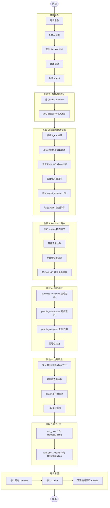

# TC-011: Remote Calling 完整流程测试

> **测试编号**: TC-011
> **测试类型**: 端到端集成测试
> **覆盖范围**: RemoteCalling 统一模型 (D-137)、客户端函数注册 (D-115)、函数调用链路、DeviceID 路由、状态流转 (pending/resolved/cancelled/expired)、幂等性、并行执行、断线重连、服务器重启恢复、上报失败重试、HITL 统一 (ask_user / ask_user_choice)
> **环境**: Docker E2E (D-043)
> **最后更新**: 2026-07-22

## 已知问题 (2026-07-22 测试发现)

> **重要**: 以下问题导致大部分测试用例无法自动执行。在修复这些问题之前，需要手动干预。
>
> 1. **BUG-001**: daemon 不会自动处理 RemoteCallings。需要手动调用 `agent-resume`。
> 2. **BUG-002**: RemoteCalling 过期后会形成无限循环。cleanup 任务重新触发 agent 执行。
> 3. **BUG-003**: cleanup 任务使用旧的 checkpoint_id 触发 resume。
> 4. **commit 602b9a9**: DynamicToolProvider 现在使用 agent 自己的 userID 查找函数，而不是调用者的 userID。函数必须注册在 agent 的 userID 下。
>
> 详细说明见测试报告: [TC-011-Remote-Calling-Test-Report.md](TC-011-Remote-Calling-Test-Report.md)

---

## 1. 概述

本测试用例覆盖 Xyncra 的 **Remote Calling 统一远程函数调用机制**。RemoteCalling 将 HITL（用户输入）和客户端函数调用统一为单一模型，Agent 不关心函数在哪里执行，只负责调用并等待结果。

**测试目标**：

- 验证客户端函数注册（`system.register_functions`）端到端流程
- 验证 Agent 调用客户端函数时 RemoteCalling 的创建、拉取、上报、恢复完整链路
- 验证 DeviceID 路由：指定设备拉取、任意设备拉取、客户端过滤
- 验证状态流转：pending -> resolved、pending -> cancelled、pending -> expired
- 验证幂等性：已 resolved 的调用重复上报不产生副作用
- 验证边缘场景：并行执行、断线重连、服务器重启恢复、上报失败重试
- 验证 HITL 统一：`ask_user` 和 `ask_user_choice` 作为 RemoteCalling 的特殊 method

**覆盖的关键决策**：

- D-137: RemoteCalling 统一模型（Question 表废弃）
- D-138: 部分回答机制（所有 RemoteCalling resolved 后才触发 resume）
- D-115: Daemon 内置函数自动注册
- D-116: Question 持久化（迁移到 RemoteCalling）
- D-083: CheckpointStore
- D-084: 并发锁
- D-085: agent_resume RPC
- D-121: 幂等性 key
- D-123: 超时自动清理
- D-114: agent-resume IPC-only

---

## 2. 环境拓扑

```
┌─────────────────────────────────────────────────────────────┐
│                     Docker E2E 网络                          │
│                                                             │
│  ┌──────────────┐         ┌──────────────────────┐         │
│  │  Redis 7     │◄────────│  xyncra-server       │         │
│  │  16379→6379  │         │  18080→8080           │         │
│  │  (DB 15)     │         │  SQLite: xyncra-e2e.db│        │
│  └──────────────┘         └──────────────────────┘         │
│         ▲                        ▲                         │
│         │ 16379                  │ 18080                   │
└─────────┼────────────────────────┼─────────────────────────┘
          │                        │
┌─────────┼────────────────────────┼─────────────────────────┐
│         ▼                        ▼                         │
│  ┌─────────────────┐    ┌─────────────────┐               │
│  │ xyncra-client   │    │ Agent           │               │
│  │ User: alice     │    │ (enable_client_ │               │
│  │ Daemon (IPC)    │    │  tools: true)   │               │
│  └─────────────────┘    └─────────────────┘               │
│                                                             │
│  工作目录: $E2E_HOME (mktemp -d)                            │
└─────────────────────────────────────────────────────────────┘
```

---

## 3. 前置条件

### 3.1 构建二进制

```bash
cd /path/to/xyncra-server
make build
```

确认产出：
- `bin/xyncra-server`
- `bin/xyncra-client`

### 3.2 启动 Docker E2E 环境

```bash
docker compose -f deploy/docker-compose.e2e.yml build --no-cache && \
docker compose -f deploy/docker-compose.e2e.yml up -d
```

### 3.3 健康检查

```bash
redis-cli -p 16379 ping
# 预期: PONG

curl -s http://localhost:18080/health
# 预期: {"status":"ok"}
```

### 3.4 安装容器内工具

```bash
docker exec deploy-xyncra-server-e2e-1 apk add --no-cache sqlite
# 预期: OK: xx MiB in xx packages
```

### 3.5 创建测试工作目录

```bash
export E2E_HOME=$(mktemp -d /tmp/xe2e-XXXXXX)
echo "E2E_HOME=$E2E_HOME"
```

### 3.6 配置 Agent

确认 `agents/weather-bot.md` 的 middleware 中包含 `enable_client_tools: true`：

```bash
grep "enable_client_tools" agents/weather-bot.md
# 预期: enable_client_tools: true
```

> **注意**: Docker 容器内的 `agents/` 目录是在镜像构建时通过 `COPY` 指令导入的，**并非运行时挂载**。修改宿主机文件后需 `docker cp` 到容器内再调用 `reload_agents`。

### 3.7 真实 LLM 配置 (.env)

确保 `.env` 已配置（参考 `.env.example`）：

```bash
test -f .env && echo "OK .env exists" || echo "MISSING .env"
```

| 变量 | 说明 |
|------|------|
| `XYNCRA_TEST_REAL_API_KEY` | LLM API 密钥 |
| `XYNCRA_TEST_REAL_BASE_URL` | LLM API 地址（可选，有默认值） |

> 安全提示: .env 已加入 .gitignore，不要提交到版本库。

---

## 4. 测试数据字典

| 变量 | 值 | 说明 |
|------|-----|------|
| `$SERVER_URL` | `ws://localhost:18080/ws` | E2E 服务器 WebSocket 地址 |
| `$REDIS_ADDR` | `localhost:16379` | E2E Redis 地址 |
| `$REDIS_DB` | `15` | E2E Redis DB 编号 |
| `$ALICE` | `alice` | 测试用户 Alice |
| `$DEVICE_A` | `device-a` | 设备 A |
| `$DEVICE_B` | `device-b` | 设备 B |
| `$E2E_HOME` | `/tmp/xe2e-XXXXXX` | 临时测试目录 |
| `$CONV_ID` | (运行时获取) | Agent 会话 ID |
| `$RC_ID` | (运行时获取) | RemoteCalling ID |
| `$CHECKPOINT_ID` | (运行时获取) | Checkpoint ID |

---

## 5. 完整流程图



---

## 6. 分步执行指南

# 阶段 1: 函数注册验证 (D-115)

> **重要变更 (commit 602b9a9)**: DynamicToolProvider 现在使用 agent 自己的 userID 查找函数，
> 而不是调用者的 userID。因此函数必须注册在 agent 的 userID 下，而不是 human 用户下。

### 步骤 1.1: 启动 Agent daemon（内置函数自动注册）

函数必须注册在 agent 的 userID 下，因为 DynamicToolProvider 使用 agent 的 userID 查找函数。

```bash
# Agent daemon - 注册函数在 agent/weather-bot 下
./bin/xyncra-client listen \
  --user-id "agent/weather-bot" \
  --device-id "agent-device-1" \
  --server ws://localhost:18080/ws \
  --device-info '{"name":"weather-bot-agent","os":"linux","type":"agent"}' \
  > "$E2E_HOME/agent-daemon.log" 2>&1 &
AGENT_PID=$!
sleep 3
```

**验证（进程）**：

```bash
ps -p $AGENT_PID
# 预期: 显示进程信息
```

**验证（Redis）**：

```bash
redis-cli -p 16379 -n 15 SMEMBERS "xyncra:conn:user:agent/weather-bot"
# 预期: 包含至少一个 connID
```

#### 步骤 1.2: 验证内置函数自动注册

```bash
docker compose -f deploy/docker-compose.e2e.yml logs xyncra-server-e2e --tail 50 2>&1 | grep -i "functions registered"
# 预期: 看到 "functions registered" 且 count>=3
```

```bash
grep -i "function\|register" "$E2E_HOME/agent-daemon.log"
# 预期: 看到函数注册相关日志
```

**记录变量**：

```bash
echo "AGENT_PID=$AGENT_PID"
```

**判定**: daemon 启动后 3 个内置函数（ping, get_device_info, get_time）自动注册成功。

### 步骤 1.3: 启动 Alice daemon（用于发送消息）

```bash
./bin/xyncra-client listen \
  --user-id alice \
  --device-id test-device-alice \
  --server ws://localhost:18080/ws \
  > "$E2E_HOME/alice-daemon.log" 2>&1 &
ALICE_PID=$!
sleep 3
```

---

# 阶段 2: 端到端调用链路

### 步骤 2.1: 创建 Agent 会话

```bash
CONV_ID=$(./bin/xyncra-client create-conversation \
  --user-id alice \
  --device-id test-device-alice \
  --server ws://localhost:18080/ws \
  --peer-id "agent/weather-bot" | grep "Conversation ID:" | awk '{print $3}')
echo "CONV_ID=$CONV_ID"
```

**验证（数据库）**：

```bash
DB="docker exec deploy-xyncra-server-e2e-1 sqlite3 /app/xyncra-e2e.db"
$DB "SELECT id, user_id1, user_id2, type FROM conversations WHERE id='$CONV_ID';"
# 预期: $CONV_ID|alice|agent/weather-bot|...
```

### 步骤 2.2: 发送消息触发客户端函数调用

```bash
./bin/xyncra-client send \
  --user-id alice \
  --device-id test-device-alice \
  --server ws://localhost:18080/ws \
  --conversation-id "$CONV_ID" \
  --content "请使用 ping 工具发送消息 hello"
```

### 步骤 2.3: 等待 Agent 处理并触发 RemoteCalling

```bash
sleep 20
```

### 步骤 2.4: 验证 RemoteCalling 记录创建到 DB (D-137)

```bash
DB="docker exec deploy-xyncra-server-e2e-1 sqlite3 /app/xyncra-e2e.db"

$DB "SELECT id, conversation_id, checkpoint_id, method, device_id, status FROM remote_callings WHERE conversation_id='$CONV_ID' ORDER BY created_at DESC LIMIT 5;"
# 预期: 至少一行记录，method=ping 或其他客户端函数，status=pending
```

**记录变量**：

```bash
RC_ID=$($DB "SELECT id FROM remote_callings WHERE conversation_id='$CONV_ID' AND status='pending' ORDER BY created_at DESC LIMIT 1;")
CHECKPOINT_ID=$($DB "SELECT checkpoint_id FROM remote_callings WHERE conversation_id='$CONV_ID' AND status='pending' ORDER BY created_at DESC LIMIT 1;")
echo "RC_ID=$RC_ID"
echo "CHECKPOINT_ID=$CHECKPOINT_ID"
```

### 步骤 2.5: 验证 Conversation agent_status 更新

```bash
$DB "SELECT agent_status, agent_id, checkpoint_id FROM conversations WHERE id='$CONV_ID';"
# 预期: agent_status=tool_calling, agent_id=agent/weather-bot, checkpoint_id 非空
```

### 步骤 2.6: 验证 Redis Checkpoint (D-083)

```bash
R="redis-cli -p 16379 -n 15"
$R EXISTS "agent:checkpoint:$CHECKPOINT_ID"
# 预期: 1

$R TTL "agent:checkpoint:$CHECKPOINT_ID"
# 预期: > 0（TTL 24h）
```

### 步骤 2.7: 验证客户端拉取 RemoteCallings

> **已知问题 (BUG-001)**: daemon 不会自动拉取和处理 RemoteCallings。
> 当前需要手动调用 `agent-resume` 来上报结果。
> 参见测试报告中的 BUG-001 详细说明。

```bash
# 检查 daemon 日志，确认收到 RemoteCalling 通知
grep -i "remote.calling\|get_remote_callings" "$E2E_HOME/agent-daemon.log" | tail -5
# 预期: 看到 get_remote_callings 调用或 RemoteCalling 处理日志
# 实际: 可能看不到，因为自动处理未实现
```

### 步骤 2.8: 手动调用 agent_resume 上报结果

> **注意**: 由于自动处理未实现，需要手动调用 agent-resume。
> RemoteCalling 有 30 秒超时，需要在超时前完成。

```bash
# 记录 RemoteCalling ID
RC_ID=$(docker exec deploy-xyncra-server-e2e-1 sqlite3 /app/xyncra-e2e.db \
  "SELECT id FROM remote_callings WHERE conversation_id='$CONV_ID' AND status='pending' ORDER BY created_at DESC LIMIT 1;")
echo "RC_ID=$RC_ID"

# 手动调用 agent-resume
./bin/xyncra-client agent-resume \
  --user-id alice \
  --device-id test-device-alice \
  --id "$RC_ID" \
  --agent-id "agent/weather-bot" \
  --success \
  --result "pong: hello"

# 检查 RemoteCalling 状态已变为 resolved
DB="docker exec deploy-xyncra-server-e2e-1 sqlite3 /app/xyncra-e2e.db"
$DB "SELECT id, status, success, result FROM remote_callings WHERE id='$RC_ID';"
# 预期: status=resolved, success=1
```

### 步骤 2.9: 验证 Agent 恢复执行

```bash
sleep 15

$DB "SELECT agent_status FROM conversations WHERE id='$CONV_ID';"
# 预期: 不再为 tool_calling（恢复为 idle 或有新的 agent_status）

$DB "SELECT sender_id, SUBSTR(content, 1, 100) FROM messages WHERE conversation_id='$CONV_ID' AND sender_id LIKE 'agent/%' ORDER BY created_at DESC LIMIT 3;"
# 预期: 包含 Agent 的最终回复
```

**验证（客户端命令）**：

```bash
./bin/xyncra-client sync-updates --user-id alice --device-id test-device-alice

./bin/xyncra-client get-messages \
  --user-id alice \
  --device-id test-device-alice \
  --conversation-id "$CONV_ID" \
  --limit 5
# 预期: 包含 Agent 的最终回复消息
```

**判定**: Agent 调用客户端函数 -> RemoteCalling 创建 -> 客户端拉取 -> 上报结果 -> Agent 恢复执行，完整链路通过。

---

# 阶段 3: DeviceID 路由

### 步骤 3.1: 启动 Device B daemon

```bash
./bin/xyncra-client listen \
  --user-id alice \
  --device-id device-b \
  --server ws://localhost:18080/ws \
  > "$E2E_HOME/device-b-daemon.log" 2>&1 &
DEVICE_B_PID=$!
sleep 3
```

### 步骤 3.2: 手动创建指定 DeviceID 的 RemoteCalling

> 通过服务器 API 或直接数据库插入来模拟指定设备的 RemoteCalling。

```bash
DB="docker exec deploy-xyncra-server-e2e-1 sqlite3 /app/xyncra-e2e.db"

# 获取当前 checkpoint（复用阶段 2 的会话或创建新会话）
NEW_CONV_ID=$(./bin/xyncra-client create-conversation \
  --user-id alice \
  --device-id test-device-alice \
  --server ws://localhost:18080/ws \
  --peer-id "agent/weather-bot" | grep "Conversation ID:" | awk '{print $3}')
echo "NEW_CONV_ID=$NEW_CONV_ID"
```

### 步骤 3.3: 发送消息触发带 DeviceID 的函数调用

```bash
./bin/xyncra-client send \
  --user-id alice \
  --device-id test-device-alice \
  --server ws://localhost:18080/ws \
  --conversation-id "$NEW_CONV_ID" \
  --content "请使用 ping 工具发送消息 test"

sleep 20
```

### 步骤 3.4: 验证 RemoteCalling 的 DeviceID 字段

```bash
DB="docker exec deploy-xyncra-server-e2e-1 sqlite3 /app/xyncra-e2e.db"

$DB "SELECT id, method, device_id, status FROM remote_callings WHERE conversation_id='$NEW_CONV_ID' ORDER BY created_at DESC LIMIT 5;"
# 预期: device_id 可能为空（任意设备）或非空（指定设备）
```

### 步骤 3.5: 验证指定 DeviceID 的调用只被目标设备拉取

```bash
# 如果 device_id=test-device-alice，则只有 test-device-alice daemon 应该处理
# 检查 device-b daemon 日志
grep -i "remote.calling\|filter" "$E2E_HOME/device-b-daemon.log" | tail -5
# 预期: device-b 不应处理 device_id=test-device-alice 的调用
```

### 步骤 3.6: 验证空 DeviceID 的调用可被任意设备拉取

```bash
# 如果 device_id 为空，两个 daemon 都应该能看到该调用
# 通过 RPC 直接查询验证
DB="docker exec deploy-xyncra-server-e2e-1 sqlite3 /app/xyncra-e2e.db"
$DB "SELECT id, device_id FROM remote_callings WHERE conversation_id='$NEW_CONV_ID' AND device_id='';"
# 预期: 如果存在空 device_id 的记录，说明任意设备可拉取
```

**判定**: DeviceID 路由正确——指定设备的调用只被目标设备处理，空 DeviceID 的调用可被任意设备处理。

---

# 阶段 4: 状态流转

## 4.1 pending -> resolved（正常完成）

### 步骤 4.1.1: 发送消息触发 RemoteCalling

```bash
RES_CONV_ID=$(./bin/xyncra-client create-conversation \
  --user-id alice \
  --device-id test-device-alice \
  --server ws://localhost:18080/ws \
  --peer-id "agent/weather-bot" | grep "Conversation ID:" | awk '{print $3}')

./bin/xyncra-client send \
  --user-id alice \
  --device-id test-device-alice \
  --server ws://localhost:18080/ws \
  --conversation-id "$RES_CONV_ID" \
  --content "请使用 get_time 工具获取当前时间"

sleep 20
```

### 步骤 4.1.2: 验证状态变为 resolved

```bash
DB="docker exec deploy-xyncra-server-e2e-1 sqlite3 /app/xyncra-e2e.db"

$DB "SELECT id, status, success, result, resolved_at FROM remote_callings WHERE conversation_id='$RES_CONV_ID' ORDER BY created_at DESC LIMIT 3;"
# 预期: status=resolved, resolved_at 非空
```

## 4.2 pending -> cancelled（用户取消）

### 步骤 4.2.1: 创建新会话并触发 RemoteCalling

```bash
CANCEL_CONV_ID=$(./bin/xyncra-client create-conversation \
  --user-id alice \
  --device-id test-device-alice \
  --server ws://localhost:18080/ws \
  --peer-id "agent/weather-bot" | grep "Conversation ID:" | awk '{print $3}')

./bin/xyncra-client send \
  --user-id alice \
  --device-id test-device-alice \
  --server ws://localhost:18080/ws \
  --conversation-id "$CANCEL_CONV_ID" \
  --content "请使用 ping 工具发送消息 cancel-test"

sleep 15
```

### 步骤 4.2.2: 获取 checkpoint_id

```bash
DB="docker exec deploy-xyncra-server-e2e-1 sqlite3 /app/xyncra-e2e.db"

CANCEL_CHECKPOINT=$($DB "SELECT checkpoint_id FROM remote_callings WHERE conversation_id='$CANCEL_CONV_ID' AND status='pending' ORDER BY created_at DESC LIMIT 1;")
echo "CANCEL_CHECKPOINT=$CANCEL_CHECKPOINT"
```

### 步骤 4.2.3: 调用 cancel_remote_calls RPC

```bash
# 通过 WebSocket RPC 调用 cancel_remote_calls
# 使用 python3 发送 WebSocket JSON-RPC 请求
python3 -c "
import json, asyncio, websockets

async def cancel():
    async with websockets.connect('$SERVER_URL') as ws:
        req = {
            'type': 0,
            'data': {
                'id': 'cancel-req-1',
                'method': 'cancel_remote_calls',
                'params': {
                    'checkpoint_id': '$CANCEL_CHECKPOINT',
                    'reason': 'user_cancelled'
                }
            }
        }
        await ws.send(json.dumps(req))
        resp = await asyncio.wait_for(ws.recv(), timeout=5)
        print(resp)

asyncio.run(cancel())
"
```

### 步骤 4.2.4: 验证状态变为 cancelled

```bash
DB="docker exec deploy-xyncra-server-e2e-1 sqlite3 /app/xyncra-e2e.db"

$DB "SELECT id, status, cancelled_at, cancel_reason FROM remote_callings WHERE checkpoint_id='$CANCEL_CHECKPOINT';"
# 预期: status=cancelled, cancelled_at 非空, cancel_reason=user_cancelled
```

## 4.3 pending -> expired（超时过期）

### 步骤 4.3.1: 创建新会话并触发 RemoteCalling

```bash
EXPIRE_CONV_ID=$(./bin/xyncra-client create-conversation \
  --user-id alice \
  --device-id test-device-alice \
  --server ws://localhost:18080/ws \
  --peer-id "agent/weather-bot" | grep "Conversation ID:" | awk '{print $3}')

./bin/xyncra-client send \
  --user-id alice \
  --device-id test-device-alice \
  --server ws://localhost:18080/ws \
  --conversation-id "$EXPIRE_CONV_ID" \
  --content "请使用 get_device_info 工具查看设备信息"

sleep 15
```

### 步骤 4.3.2: 手动修改 expires_at 模拟过期

```bash
DB="docker exec deploy-xyncra-server-e2e-1 sqlite3 /app/xyncra-e2e.db"

EXPIRE_RC_ID=$($DB "SELECT id FROM remote_callings WHERE conversation_id='$EXPIRE_CONV_ID' AND status='pending' ORDER BY created_at DESC LIMIT 1;")
echo "EXPIRE_RC_ID=$EXPIRE_RC_ID"

# 将 expires_at 设置为 1 小时前
$DB "UPDATE remote_callings SET expires_at = datetime('now', '-1 hour') WHERE id='$EXPIRE_RC_ID';"
```

### 步骤 4.3.3: 等待后台清理任务执行

```bash
# 后台清理任务每 5 分钟执行一次
sleep 360
```

### 步骤 4.3.4: 验证状态变为 expired

```bash
DB="docker exec deploy-xyncra-server-e2e-1 sqlite3 /app/xyncra-e2e.db"

$DB "SELECT id, status FROM remote_callings WHERE id='$EXPIRE_RC_ID';"
# 预期: status=expired
```

## 4.4 幂等性：已 resolved 的调用重复上报

### 步骤 4.4.1: 获取一个已 resolved 的 RemoteCalling ID

```bash
DB="docker exec deploy-xyncra-server-e2e-1 sqlite3 /app/xyncra-e2e.db"

IDEMPOTENT_RC_ID=$($DB "SELECT id FROM remote_callings WHERE status='resolved' ORDER BY created_at DESC LIMIT 1;")
echo "IDEMPOTENT_RC_ID=$IDEMPOTENT_RC_ID"
```

### 步骤 4.4.2: 重复调用 agent_resume

```bash
python3 -c "
import json, asyncio, websockets

async def resume():
    async with websockets.connect('$SERVER_URL') as ws:
        req = {
            'type': 0,
            'data': {
                'id': 'resume-idempotent-1',
                'method': 'agent_resume',
                'params': {
                    'id': '$IDEMPOTENT_RC_ID',
                    'agent_id': 'agent/weather-bot',
                    'success': True,
                    'result': 'duplicate_test'
                }
            }
        }
        await ws.send(json.dumps(req))
        resp = await asyncio.wait_for(ws.recv(), timeout=5)
        print(resp)

asyncio.run(resume())
"
# 预期: 返回 status=resolved, message="already processed"
```

### 步骤 4.4.3: 验证数据未被修改

```bash
DB="docker exec deploy-xyncra-server-e2e-1 sqlite3 /app/xyncra-e2e.db"

$DB "SELECT id, status, result FROM remote_callings WHERE id='$IDEMPOTENT_RC_ID';"
# 预期: status 仍为 resolved, result 不是 "duplicate_test"（原值不变）
```

**判定**: 已 resolved 的调用重复上报返回幂等成功，数据不被修改。

---

# 阶段 5: 边缘场景

## 5.1 多个 RemoteCalling 并行执行

### 步骤 5.1.1: 创建会话并触发多函数调用

```bash
PARALLEL_CONV_ID=$(./bin/xyncra-client create-conversation \
  --user-id alice \
  --device-id test-device-alice \
  --server ws://localhost:18080/ws \
  --peer-id "agent/weather-bot" | grep "Conversation ID:" | awk '{print $3}')

./bin/xyncra-client send \
  --user-id alice \
  --device-id test-device-alice \
  --server ws://localhost:18080/ws \
  --conversation-id "$PARALLEL_CONV_ID" \
  --content "请同时使用 ping、get_device_info、get_time 三个工具"

sleep 25
```

### 步骤 5.1.2: 验证多个 RemoteCalling 被创建

```bash
DB="docker exec deploy-xyncra-server-e2e-1 sqlite3 /app/xyncra-e2e.db"

$DB "SELECT id, method, status FROM remote_callings WHERE conversation_id='$PARALLEL_CONV_ID' ORDER BY created_at;"
# 预期: 多条记录，可能包含不同的 method
```

### 步骤 5.1.3: 验证全部 resolved 后 Agent 恢复

```bash
sleep 10

$DB "SELECT status, COUNT(*) FROM remote_callings WHERE conversation_id='$PARALLEL_CONV_ID' GROUP BY status;"
# 预期: 全部为 resolved（或部分 resolved + 已清理）

$DB "SELECT agent_status FROM conversations WHERE id='$PARALLEL_CONV_ID';"
# 预期: 不再为 tool_calling
```

## 5.2 客户端断线重连后拉取

### 步骤 5.2.1: 触发 RemoteCalling 后停止 daemon

```bash
RECONNECT_CONV_ID=$(./bin/xyncra-client create-conversation \
  --user-id alice \
  --device-id test-device-alice \
  --server ws://localhost:18080/ws \
  --peer-id "agent/weather-bot" | grep "Conversation ID:" | awk '{print $3}')

./bin/xyncra-client send \
  --user-id alice \
  --device-id test-device-alice \
  --server ws://localhost:18080/ws \
  --conversation-id "$RECONNECT_CONV_ID" \
  --content "请使用 ping 工具发送消息 reconnect-test"

sleep 10

# 停止 daemon（模拟断线）
./bin/xyncra-client kill --user-id alice --device-id test-device-alice
sleep 2
```

### 步骤 5.2.2: 确认 RemoteCalling 仍在 DB

```bash
DB="docker exec deploy-xyncra-server-e2e-1 sqlite3 /app/xyncra-e2e.db"

$DB "SELECT id, status FROM remote_callings WHERE conversation_id='$RECONNECT_CONV_ID' AND status='pending';"
# 预期: 仍有 pending 记录（不因 daemon 离线而消失）
```

### 步骤 5.2.3: 重启 daemon（模拟重连）

```bash
./bin/xyncra-client listen \
  --user-id alice \
  --device-id test-device-alice \
  --server ws://localhost:18080/ws \
  > "$E2E_HOME/alice-daemon-reconnect.log" 2>&1 &
ALICE_PID=$!
sleep 5
```

### 步骤 5.2.4: 验证重连后自动拉取并处理

```bash
sleep 15

DB="docker exec deploy-xyncra-server-e2e-1 sqlite3 /app/xyncra-e2e.db"

$DB "SELECT id, status FROM remote_callings WHERE conversation_id='$RECONNECT_CONV_ID';"
# 预期: status 变为 resolved（daemon 重连后自动处理）
```

## 5.3 服务端重启后恢复

### 步骤 5.3.1: 触发 RemoteCalling

```bash
RESTART_CONV_ID=$(./bin/xyncra-client create-conversation \
  --user-id alice \
  --device-id test-device-alice \
  --server ws://localhost:18080/ws \
  --peer-id "agent/weather-bot" | grep "Conversation ID:" | awk '{print $3}')

./bin/xyncra-client send \
  --user-id alice \
  --device-id test-device-alice \
  --server ws://localhost:18080/ws \
  --conversation-id "$RESTART_CONV_ID" \
  --content "请使用 ping 工具发送消息 restart-test"

sleep 10
```

### 步骤 5.3.2: 记录重启前状态

```bash
DB="docker exec deploy-xyncra-server-e2e-1 sqlite3 /app/xyncra-e2e.db"

echo "=== 重启前状态 ==="
$DB "SELECT id, status FROM remote_callings WHERE conversation_id='$RESTART_CONV_ID';"

R="redis-cli -p 16379 -n 15"
$R KEYS "agent:checkpoint:*"
```

### 步骤 5.3.3: 重启服务器

```bash
docker compose -f deploy/docker-compose.e2e.yml stop xyncra-server-e2e
sleep 2

docker compose -f deploy/docker-compose.e2e.yml start xyncra-server-e2e
sleep 8

curl -s http://localhost:18080/health
# 预期: {"status":"ok"}
```

### 步骤 5.3.4: 验证重启后数据存活

```bash
DB="docker exec deploy-xyncra-server-e2e-1 sqlite3 /app/xyncra-e2e.db"

# RemoteCalling 记录仍在
$DB "SELECT id, status FROM remote_callings WHERE conversation_id='$RESTART_CONV_ID';"
# 预期: 与重启前一致

# Checkpoint 仍在（Redis 持久化）
R="redis-cli -p 16379 -n 15"
$R KEYS "agent:checkpoint:*"
# 预期: checkpoint key 仍然存在
```

### 步骤 5.3.5: 重启后客户端重新连接并处理

```bash
# 重启 daemon（因为服务器重启后 WS 断开）
./bin/xyncra-client kill --user-id alice --device-id test-device-alice 2>/dev/null
sleep 1

./bin/xyncra-client listen \
  --user-id alice \
  --device-id test-device-alice \
  --server ws://localhost:18080/ws \
  > "$E2E_HOME/alice-daemon-after-restart.log" 2>&1 &
ALICE_PID=$!
sleep 5

sleep 15

DB="docker exec deploy-xyncra-server-e2e-1 sqlite3 /app/xyncra-e2e.db"

$DB "SELECT id, status FROM remote_callings WHERE conversation_id='$RESTART_CONV_ID';"
# 预期: 状态已更新（resolved 或被清理）
```

## 5.4 上报失败重试

### 步骤 5.4.1: 验证客户端本地重试队列

> 上报失败重试是客户端行为。当 `agent_resume` RPC 返回服务端错误时，客户端将结果保存到本地重试队列（`retry_tasks` 表），指数退避重试。

```bash
# 检查客户端本地 DB 中的重试队列
ALICE_DB=~/.xyncra/alice/test-device-alice/xyncra.db

sqlite3 "$ALICE_DB" "SELECT id, method, attempt, max_attempts, status FROM retry_tasks ORDER BY created_at DESC LIMIT 5;"
# 预期: 可能为空（如果没有失败的重试），或显示重试记录
```

### 步骤 5.4.2: 验证重试日志

```bash
grep -i "retry\|agent_resume.*fail\|exponential" "$E2E_HOME/alice-daemon.log" | tail -5
# 预期: 如果有重试，会看到相关日志
```

**判定**: 客户端上报失败时有重试机制。如果当前没有失败的重试任务，此场景标记为 INCONCLUSIVE（需要模拟服务端不可用来触发）。

---

# 阶段 6: HITL 统一

## 6.1 ask_user 作为 RemoteCalling 的一种

### 步骤 6.1.1: 配置 HITL Agent

创建 `agents/hitl-bot.md`：

```bash
cat > "$E2E_HOME/hitl-bot.md" << 'EOF'
---
id: agent/hitl-bot
name: HITL 测试助手
description: 需要用户确认的测试 Agent
model: qwen3.7-plus
api_key_env: XYNCRA_TEST_REAL_API_KEY
base_url: https://coding.dashscope.aliyuncs.com/v1
parameters:
  temperature: 0.3
  max_tokens: 500
context:
  max_tokens: 4000
  max_messages: 10
middleware:
  enable_client_tools: false
tools:
  - ask_user
---

你是一个需要用户确认的助手。当用户询问敏感操作时，你应该：
1. 解释操作的影响
2. 询问用户是否确认
3. 等待用户回复"确认"或"取消"
EOF
```

```bash
docker cp "$E2E_HOME/hitl-bot.md" deploy-xyncra-server-e2e-1:/app/agents/hitl-bot.md
curl -s -X POST http://localhost:18080/rpc \
  -H "Content-Type: application/json" \
  -d '{"jsonrpc":"2.0","method":"reload_agents","id":1}'
# 预期: {"result":{"count":N},"error":null}
```

### 步骤 6.1.2: 创建会话并触发 HITL

```bash
HITL_CONV_ID=$(./bin/xyncra-client create-conversation \
  --user-id alice \
  --device-id test-device-alice \
  --server ws://localhost:18080/ws \
  --peer-id "agent/hitl-bot" | grep "Conversation ID:" | awk '{print $3}')
echo "HITL_CONV_ID=$HITL_CONV_ID"

./bin/xyncra-client send \
  --user-id alice \
  --device-id test-device-alice \
  --server ws://localhost:18080/ws \
  --conversation-id "$HITL_CONV_ID" \
  --content "删除所有数据"

sleep 20
```

### 步骤 6.1.3: 验证 ask_user 创建了 RemoteCalling 记录

```bash
DB="docker exec deploy-xyncra-server-e2e-1 sqlite3 /app/xyncra-e2e.db"

$DB "SELECT id, method, interrupt_id, device_id, status FROM remote_callings WHERE conversation_id='$HITL_CONV_ID' ORDER BY created_at DESC LIMIT 5;"
# 预期: method=ask_user, device_id 为空（任意设备可回答）, status=pending
```

**记录变量**：

```bash
HITL_RC_ID=$($DB "SELECT id FROM remote_callings WHERE conversation_id='$HITL_CONV_ID' AND status='pending' AND method='ask_user' ORDER BY created_at DESC LIMIT 1;")
HITL_CHECKPOINT=$($DB "SELECT checkpoint_id FROM remote_callings WHERE conversation_id='$HITL_CONV_ID' AND status='pending' ORDER BY created_at DESC LIMIT 1;")
echo "HITL_RC_ID=$HITL_RC_ID"
echo "HITL_CHECKPOINT=$HITL_CHECKPOINT"
```

### 步骤 6.1.4: 验证 Conversation agent_status

```bash
$DB "SELECT agent_status, agent_id, checkpoint_id FROM conversations WHERE id='$HITL_CONV_ID';"
# 预期: agent_status=asking_user, agent_id=agent/hitl-bot, checkpoint_id 非空
```

### 步骤 6.1.5: 验证客户端收到 RemoteCalling 通知

```bash
grep -i "remote.calling\|ask_user\|hitl" "$E2E_HOME/alice-daemon.log" | tail -5
# 预期: 看到 ask_user 相关的 RemoteCalling 通知
```

### 步骤 6.1.6: 通过 agent_resume 回答

```bash
./bin/xyncra-client agent-resume \
  --user-id alice \
  --device-id test-device-alice \
  --id "$HITL_RC_ID" \
  --agent-id "agent/hitl-bot" \
  --success \
  --result "确认"
```

### 步骤 6.1.7: 验证 Agent 恢复

```bash
sleep 15

DB="docker exec deploy-xyncra-server-e2e-1 sqlite3 /app/xyncra-e2e.db"

$DB "SELECT id, status, result FROM remote_callings WHERE id='$HITL_RC_ID';"
# 预期: status=resolved, result=确认

$DB "SELECT agent_status FROM conversations WHERE id='$HITL_CONV_ID';"
# 预期: 不再为 asking_user
```

**判定**: ask_user 作为 RemoteCalling 的一种，走统一的创建 -> 拉取 -> 上报 -> 恢复流程。

## 6.2 ask_user_choice 作为 RemoteCalling 的一种

### 步骤 6.2.1: 配置支持 ask_user_choice 的 Agent

```bash
cat > "$E2E_HOME/hitl-choice-bot.md" << 'EOF'
---
id: agent/hitl-choice-bot
name: HITL 选择测试助手
description: 需要用户选择的测试 Agent
model: qwen3.7-plus
api_key_env: XYNCRA_TEST_REAL_API_KEY
base_url: https://coding.dashscope.aliyuncs.com/v1
parameters:
  temperature: 0.3
  max_tokens: 500
context:
  max_tokens: 4000
  max_messages: 10
middleware:
  enable_client_tools: false
tools:
  - ask_user
---

你是一个需要用户做选择的助手。当用户提出请求时，你应该提供多个选项让用户选择。

示例：
- 用户: "我想备份数据"
- 你: "请选择备份方式：1. 全量备份 2. 增量备份 3. 仅备份重要文件"
EOF
```

```bash
docker cp "$E2E_HOME/hitl-choice-bot.md" deploy-xyncra-server-e2e-1:/app/agents/hitl-choice-bot.md
curl -s -X POST http://localhost:18080/rpc \
  -H "Content-Type: application/json" \
  -d '{"jsonrpc":"2.0","method":"reload_agents","id":1}'
```

### 步骤 6.2.2: 创建会话并触发选择

```bash
CHOICE_CONV_ID=$(./bin/xyncra-client create-conversation \
  --user-id alice \
  --device-id test-device-alice \
  --server ws://localhost:18080/ws \
  --peer-id "agent/hitl-choice-bot" | grep "Conversation ID:" | awk '{print $3}')

./bin/xyncra-client send \
  --user-id alice \
  --device-id test-device-alice \
  --server ws://localhost:18080/ws \
  --conversation-id "$CHOICE_CONV_ID" \
  --content "我想备份数据"

sleep 20
```

### 步骤 6.2.3: 验证 ask_user 创建了 RemoteCalling

```bash
DB="docker exec deploy-xyncra-server-e2e-1 sqlite3 /app/xyncra-e2e.db"

$DB "SELECT id, method, params, device_id, status FROM remote_callings WHERE conversation_id='$CHOICE_CONV_ID' ORDER BY created_at DESC LIMIT 5;"
# 预期: method=ask_user, params 包含选项信息, status=pending
```

### 步骤 6.2.4: 通过 agent_resume 选择选项

```bash
CHOICE_RC_ID=$($DB "SELECT id FROM remote_callings WHERE conversation_id='$CHOICE_CONV_ID' AND status='pending' ORDER BY created_at DESC LIMIT 1;")

./bin/xyncra-client agent-resume \
  --user-id alice \
  --device-id test-device-alice \
  --id "$CHOICE_RC_ID" \
  --agent-id "agent/hitl-choice-bot" \
  --success \
  --result "1. 全量备份"
```

### 步骤 6.2.5: 验证 Agent 恢复

```bash
sleep 15

DB="docker exec deploy-xyncra-server-e2e-1 sqlite3 /app/xyncra-e2e.db"

$DB "SELECT id, status, result FROM remote_callings WHERE id='$CHOICE_RC_ID';"
# 预期: status=resolved, result=1. 全量备份

$DB "SELECT sender_id, SUBSTR(content, 1, 100) FROM messages WHERE conversation_id='$CHOICE_CONV_ID' AND sender_id LIKE 'agent/%' ORDER BY created_at DESC LIMIT 3;"
# 预期: 包含 Agent 针对选择的回复
```

**判定**: ask_user_choice 作为 RemoteCalling 的一种，走统一的创建 -> 拉取 -> 上报 -> 恢复流程。

---

## 7. 数据库验证汇总

### 7.1 Server DB 验证命令速查

```bash
DB="docker exec deploy-xyncra-server-e2e-1 sqlite3 /app/xyncra-e2e.db"

# RemoteCallings 表
$DB "SELECT id, conversation_id, method, device_id, status, success FROM remote_callings WHERE conversation_id='<conv-id>' ORDER BY created_at;"
$DB "SELECT status, COUNT(*) FROM remote_callings GROUP BY status;"
$DB "SELECT id, status, result, error_message, resolved_at FROM remote_callings WHERE id='<rc-id>';"
$DB "SELECT id, status, cancelled_at, cancel_reason FROM remote_callings WHERE checkpoint_id='<checkpoint-id>';"

# Conversation agent_status
$DB "SELECT agent_status, agent_id, checkpoint_id FROM conversations WHERE id='<conv-id>';"

# 消息
$DB "SELECT sender_id, SUBSTR(content, 1, 100) FROM messages WHERE conversation_id='<conv-id>' ORDER BY created_at DESC LIMIT 5;"
```

### 7.2 Server Redis 验证命令速查

```bash
R="redis-cli -p 16379 -n 15"

# Checkpoint
$R KEYS "agent:checkpoint:*"
$R GET "agent:checkpoint:<checkpoint-id>"
$R TTL "agent:checkpoint:<checkpoint-id>"

# 会话锁
$R KEYS "agent:lock:*"
$R GET "agent:lock:<conversation-id>"

# 幂等性
$R KEYS "agent:resume:*"
$R KEYS "agent:resume:processing:*"

# 连接信息
$R SMEMBERS "xyncra:conn:user:alice"

# 清理
$R FLUSHDB
```

### 7.3 Client DB SQLite 验证命令速查

```bash
ALICE_DB=~/.xyncra/alice/test-device-alice/xyncra.db

# Conversations
sqlite3 "$ALICE_DB" "SELECT id, agent_status FROM conversations WHERE id='<conv-id>';"

# Messages
sqlite3 "$ALICE_DB" "SELECT sender_id, SUBSTR(content, 1, 100) FROM messages WHERE conversation_id='<conv-id>' ORDER BY created_at DESC LIMIT 5;"

# Retry tasks
sqlite3 "$ALICE_DB" "SELECT id, method, attempt, status FROM retry_tasks ORDER BY created_at DESC LIMIT 5;"

# RPC logs
sqlite3 "$ALICE_DB" "SELECT id, method, status_code, error_msg FROM rpc_logs ORDER BY created_at DESC LIMIT 10;"
```

---

## 8. 通过/失败判定标准

| 阶段 | 判定条件 | 通过 | 失败处理 |
|------|---------|:---:|---------|
| **阶段 1: 函数注册** | | | |
| 步骤 1.2 | daemon 启动后内置函数自动注册 | ✅ | 检查 WS 连接、daemon 日志 |
| **阶段 2: 端到端链路** | | | |
| 步骤 2.4 | RemoteCalling 记录创建到 DB | ✅ | 检查 Agent 配置、LLM 调用 |
| 步骤 2.5 | Conversation agent_status 更新 | ✅ | |
| 步骤 2.6 | Redis Checkpoint 存在 | ✅ | |
| 步骤 2.7 | 客户端拉取 RemoteCallings | ✅ | |
| 步骤 2.8 | agent_resume 上报成功 | ✅ | |
| 步骤 2.9 | Agent 恢复执行 | ✅ | |
| **阶段 3: DeviceID 路由** | | | |
| 步骤 3.5 | 指定 DeviceID 只被目标设备拉取 | ✅ | |
| 步骤 3.6 | 空 DeviceID 任意设备可拉取 | ✅ | |
| **阶段 4: 状态流转** | | | |
| 步骤 4.1.2 | pending -> resolved | ✅ | |
| 步骤 4.2.4 | pending -> cancelled | ✅ | |
| 步骤 4.3.4 | pending -> expired | ✅ | |
| 步骤 4.4.3 | 幂等性：重复上报不修改数据 | ✅ | |
| **阶段 5: 边缘场景** | | | |
| 步骤 5.1.2 | 多个 RemoteCalling 并行创建 | ✅ | |
| 步骤 5.1.3 | 全部 resolved 后 Agent 恢复 | ✅ | |
| 步骤 5.2.4 | 断线重连后自动处理 | ✅ | |
| 步骤 5.3.4 | 服务器重启后数据存活 | ✅ | |
| 步骤 5.3.5 | 重启后客户端重新处理 | ✅ | |
| 步骤 5.4.2 | 上报失败有重试机制 | ✅ / INCONCLUSIVE | |
| **阶段 6: HITL 统一** | | | |
| 步骤 6.1.3 | ask_user 创建 RemoteCalling | ✅ | |
| 步骤 6.1.7 | ask_user 通过 agent_resume 恢复 | ✅ | |
| 步骤 6.2.3 | ask_user_choice 创建 RemoteCalling | ✅ | |
| 步骤 6.2.5 | ask_user_choice 通过 agent_resume 恢复 | ✅ | |

---

## 9. 故障排查指南

| 症状 | 可能原因 | 解决方法 |
|------|---------|---------|
| RemoteCalling 表为空 | Agent 未触发函数调用 | 检查 LLM 日志、Agent 配置中 tools 列表 |
| RemoteCalling 停在 pending | 客户端未拉取 | 检查 daemon 日志、WS 连接状态 |
| RemoteCalling 停在 pending | daemon 不会自动处理 (BUG-001) | 手动调用 agent-resume |
| agent_resume 返回 not found | RemoteCalling ID 不存在或已过期 | 检查 DB 中的记录状态 |
| agent_resume 返回 expired | expires_at 已过期 | 检查 RemoteCalling 的 expires_at 字段 |
| Agent 未恢复执行 | Checkpoint 过期或丢失 | 检查 Redis 中的 checkpoint key |
| Agent 未恢复执行 | cleanup 任务使用旧 checkpoint_id (BUG-003) | 检查 DB 中的 checkpoint_id |
| 客户端未收到通知 | WS 断开或 Update 未发送 | 检查 daemon 连接状态和服务器日志 |
| DeviceID 路由不正确 | 客户端过滤逻辑错误 | 检查 daemon 日志中的过滤信息 |
| 并行调用只处理了一个 | D-138 部分回答机制 | 检查 CountPendingByCheckpoint 逻辑 |
| 服务器重启后 Checkpoint 丢失 | Redis 未持久化 | 检查 Redis 持久化配置和 volumes |
| 客户端重试队列积压 | 服务端持续不可用 | 检查服务端状态、网络连接 |
| ask_user 未创建 RemoteCalling | Agent 未配置 ask_user tool | 检查 Agent 配置中 tools 列表 |
| HITL 会话卡在 asking_user | 后台清理任务未启动 | 检查 D-123 清理 goroutine |
| cancel_remote_calls 无效果 | checkpoint_id 不匹配 | 检查 DB 中的 checkpoint_id |
| 重复上报未被幂等拒绝 | status 检查逻辑错误 | 检查 ResolveResult/ResolveError 的 WHERE 条件 |
| RemoteCalling 无限循环 | cleanup 任务重新触发 agent (BUG-002) | 检查 cleanup 任务逻辑 |
| Agent 看不到注册的函数 | 函数注册在错误的 userID 下 | 确保函数注册在 agent 的 userID 下 (commit 602b9a9) |

---

## 10. 环境清理

```bash
# 停止所有 daemon
./bin/xyncra-client kill --user-id alice --device-id test-device-alice 2>/dev/null || true
./bin/xyncra-client kill --user-id alice --device-id device-b 2>/dev/null || true

# 停止 Docker E2E
docker compose -f deploy/docker-compose.e2e.yml down

# 清理临时目录
rm -rf "$E2E_HOME"

# 清理 ~/.xyncra 中的测试数据
rm -rf ~/.xyncra/alice

# 清理 Redis（可选）
redis-cli -p 16379 -n 15 FLUSHDB
```

---

## 11. 真实 LLM 测试配置 (.env)

本测试需要真实 LLM 交互来触发函数调用和 HITL 中断。

```bash
cp .env.example .env
# 编辑 .env 填入真实 API Key
```

| 变量 | 说明 |
|------|------|
| `XYNCRA_TEST_REAL_API_KEY` | LLM API 密钥 |
| `XYNCRA_TEST_REAL_BASE_URL` | LLM API 地址（可选，有默认值） |

> 安全提示: .env 已加入 .gitignore，不要提交到版本库。
> 成本控制: 本测试覆盖多个场景，预计消耗 ~10000-20000 tokens (D-090)。

---

## 12. 依赖关系说明

| 测试阶段 | 可独立执行 | 依赖 |
|---------|-----------|------|
| 阶段 1 (函数注册) | ✅ | 环境准备 |
| 阶段 2 (端到端链路) | ❌ | 阶段 1 |
| 阶段 3 (DeviceID 路由) | ✅* | 环境准备（独立会话） |
| 阶段 4.1 (resolved) | ✅* | 环境准备（独立会话） |
| 阶段 4.2 (cancelled) | ✅* | 环境准备（独立会话） |
| 阶段 4.3 (expired) | ✅* | 环境准备（独立会话） |
| 阶段 4.4 (幂等性) | ❌ | 阶段 2（需要已 resolved 的记录） |
| 阶段 5.1 (并行) | ✅* | 环境准备（独立会话） |
| 阶段 5.2 (断线重连) | ✅* | 环境准备（独立会话） |
| 阶段 5.3 (服务器重启) | ✅* | 环境准备（独立会话） |
| 阶段 5.4 (上报重试) | ✅* | 环境准备（独立会话） |
| 阶段 6.1 (ask_user) | ✅* | 环境准备（独立会话 + Agent 配置） |
| 阶段 6.2 (ask_user_choice) | ❌ | 阶段 6.1（Agent 配置复用） |

> 标记 * 的阶段可在环境准备完成后独立执行（使用独立会话），但建议按顺序执行以避免干扰。

**推荐执行顺序**: 1 → 2 → 3 → 4.1 → 4.2 → 4.3 → 4.4 → 5.1 → 5.2 → 5.3 → 5.4 → 6.1 → 6.2

---

## 13. 测试执行记录模板

```markdown
### TC-011 测试执行记录

| 字段 | 值 |
|------|-----|
| 日期 | YYYY-MM-DD |
| Git Commit | <sha> |
| 测试者 | <name> |
| 环境 | Docker E2E + 真实 LLM |
| E2E_HOME | /tmp/xe2e-XXXXXX |

#### 阶段 1: 函数注册

| 步骤 | 结果 | 备注 |
|------|------|------|
| 步骤 1.2: 内置函数自动注册 | ✅ / ❌ | D-115 |

#### 阶段 2: 端到端链路

| 步骤 | 结果 | 备注 |
|------|------|------|
| 步骤 2.4: RemoteCalling 创建 | ✅ / ❌ | D-137 |
| 步骤 2.5: agent_status 更新 | ✅ / ❌ | |
| 步骤 2.6: Redis Checkpoint | ✅ / ❌ | D-083 |
| 步骤 2.7: 客户端拉取 | ✅ / ❌ | |
| 步骤 2.8: agent_resume 上报 | ✅ / ❌ | D-085 |
| 步骤 2.9: Agent 恢复 | ✅ / ❌ | |

#### 阶段 3: DeviceID 路由

| 步骤 | 结果 | 备注 |
|------|------|------|
| 步骤 3.5: 指定设备拉取 | ✅ / ❌ | |
| 步骤 3.6: 任意设备拉取 | ✅ / ❌ | |

#### 阶段 4: 状态流转

| 步骤 | 结果 | 备注 |
|------|------|------|
| 步骤 4.1.2: resolved | ✅ / ❌ | |
| 步骤 4.2.4: cancelled | ✅ / ❌ | |
| 步骤 4.3.4: expired | ✅ / ❌ | D-123 |
| 步骤 4.4.3: 幂等性 | ✅ / ❌ | D-121 |

#### 阶段 5: 边缘场景

| 步骤 | 结果 | 备注 |
|------|------|------|
| 步骤 5.1.2: 并行调用 | ✅ / ❌ | D-138 |
| 步骤 5.2.4: 断线重连 | ✅ / ❌ | |
| 步骤 5.3.4: 服务器重启 | ✅ / ❌ | |
| 步骤 5.3.5: 重启后恢复 | ✅ / ❌ | |
| 步骤 5.4.2: 上报重试 | ✅ / ❌ / INCONCLUSIVE | |

#### 阶段 6: HITL 统一

| 步骤 | 结果 | 备注 |
|------|------|------|
| 步骤 6.1.3: ask_user 创建 RC | ✅ / ❌ | D-137 |
| 步骤 6.1.7: ask_user 恢复 | ✅ / ❌ | |
| 步骤 6.2.3: ask_user_choice 创建 RC | ✅ / ❌ | D-137 |
| 步骤 6.2.5: ask_user_choice 恢复 | ✅ / ❌ | |

**LLM 行为观察**：
- Agent 是否调用了客户端函数？是 / 否
- 如果未调用，使用的提示词是："..."
- HITL 中断是否正确触发？是 / 否

**发现的问题**：
1. (描述)

**结论**：PASS / FAIL (X/Y 步骤通过)
```

---

## 14. 参考文档

- [remote-calling-design.md](../../wiki/flows/remote-calling-design.md) — RemoteCalling 设计文档
- [PRODUCT_DECISIONS.md](../../docs/decisions/PRODUCT_DECISIONS.md) — D-137, D-138, D-115, D-116, D-083, D-085, D-121, D-123
- [TC-003-HITL完整流程测试.md](TC-003-HITL完整流程测试.md) — HITL 基础流程参考
- [TC-007-DynamicToolProvider客户端工具测试.md](TC-007-DynamicToolProvider客户端工具测试.md) — 客户端函数注册参考
- [internal/store/model/remote_calling.go](../../internal/store/model/remote_calling.go) — RemoteCalling 数据模型
- [internal/store/remote_calling.go](../../internal/store/remote_calling.go) — RemoteCallingStore 实现
- [internal/handler/agent_resume.go](../../internal/handler/agent_resume.go) — agent_resume RPC handler
- [internal/handler/get_remote_callings.go](../../internal/handler/get_remote_callings.go) — get_remote_callings RPC handler
- [internal/handler/cancel_remote_calls.go](../../internal/handler/cancel_remote_calls.go) — cancel_remote_calls RPC handler
- [internal/agent/resume_handler.go](../../internal/agent/resume_handler.go) — Agent resume MQ handler
- [internal/agent/remote_calling_cleanup.go](../../internal/agent/remote_calling_cleanup.go) — 超时清理任务
