# TC-011: Remote Calling 完整流程测试

> **测试编号**: TC-011
> **测试类型**: 端到端集成测试
> **覆盖范围**: RemoteCalling 统一模型 (D-137)、客户端函数注册 (D-115)、函数调用链路、DeviceID 路由、状态流转 (pending/resolved/cancelled/expired)、幂等性、CancelledBy 持久化、锁释放、复合索引、并行执行、断线重连、服务器重启恢复、上报失败重试、超时清理防无限循环、HITL 统一 (ask_user / ask_user_choice)、失败上报、过期后上报幂等、自定义超时、多轮 HITL 中断、重试队列持久化、软删除后幂等、内置函数验证
> **环境**: Docker E2E (D-043)
> **最后更新**: 2026-07-22
> **版本**: v1.2

---

## 1. 概述

本测试用例覆盖 Xyncra 的 **Remote Calling 统一远程函数调用机制**。RemoteCalling 将 HITL（用户输入）和客户端函数调用统一为单一模型，Agent 不关心函数在哪里执行，只负责调用并等待结果。

**测试目标**：

- 验证客户端函数注册（`system.register_functions`）端到端流程
- 验证 Agent 调用客户端函数时 RemoteCalling 的创建、拉取、上报、恢复完整链路
- 验证 DeviceID 路由：指定设备拉取、任意设备拉取、客户端过滤
- 验证状态流转：pending -> resolved、pending -> cancelled、pending -> expired
- 验证幂等性：已 resolved 的调用重复上报不产生副作用
- 验证 CancelledBy 持久化和锁释放逻辑
- 验证超时清理防无限循环（BUG-002 修复验证）
- 验证边缘场景：并行执行、断线重连、服务器重启恢复、上报失败重试
- 验证 HITL 统一：`ask_user` 和 `ask_user_choice` 作为 RemoteCalling 的特殊 method
- 验证自定义超时：LLM 指定的函数级超时覆盖全局默认超时
- 验证多轮 HITL：Agent resume 后再次触发 ask_user（re-interrupt）
- 验证重试队列持久化：客户端重启后继续重试未完成的上报
- 验证软删除后幂等：cleanup 软删除后的 RemoteCalling 重复上报返回 ErrConflict
- 验证内置函数：`list_functions` 和 `ask_user_question` 必须函数

**覆盖的关键决策**：

- D-137: RemoteCalling 统一模型（Question 表废弃）
- D-138: 部分回答机制（所有 RemoteCalling resolved 后才触发 resume）
- D-115: Daemon 内置函数自动注册
- D-116: Question 持久化（迁移到 RemoteCalling）
- D-083: CheckpointStore
- D-084: 并发锁
- D-085: agent_resume RPC
- D-121: 幂等性 key
- D-123: 超时自动清理
- D-114: agent-resume IPC-only

---

## 2. 环境拓扑

| 组件 | 容器/进程 | 宿主机端口 | 容器端口 | 说明 |
|------|----------|-----------|---------|------|
| Redis 7 | (Docker) | 16379 | 6379 | DB 15，Checkpoint/锁/幂等性存储 |
| xyncra-server | xyncra-server-e2e | 18080 | 8080 | WebSocket + HTTP，SQLite: xyncra-e2e.db |
| xyncra-client (Alice) | 宿主机进程 | - | - | 测试用户 daemon，用于发送消息 |
| xyncra-client (Agent) | 宿主机进程 | - | - | Agent daemon，注册函数并处理 RemoteCallings |
| xyncra-client (Device B) | 宿主机进程 | - | - | 第二台设备 daemon，用于 DeviceID 路由测试 |

**数据流向**：

```
Alice daemon --ws--> Server --mq--> Agent executor --ws--> Agent daemon
                         |                                      |
                         v                                      v
                     SQLite DB                            Redis (checkpoint)
```

---

## 3. 前置条件

### 3.1 构建二进制

```bash
cd /path/to/xyncra-server
make build
```

确认产出：
- `bin/xyncra-server`
- `bin/xyncra-client`

### 3.2 启动 Docker E2E 环境

```bash
docker compose -f deploy/docker-compose.e2e.yml build --no-cache && \
docker compose -f deploy/docker-compose.e2e.yml up -d
```

### 3.3 健康检查

```bash
redis-cli -p 16379 ping
# 预期: PONG

curl -s http://localhost:18080/health
# 预期: {"status":"ok"}
```

### 3.4 安装容器内工具

```bash
docker exec deploy-xyncra-server-e2e-1 apk add --no-cache sqlite
# 预期: OK: xx MiB in xx packages
```

### 3.5 创建测试工作目录

```bash
export E2E_HOME=$(mktemp -d /tmp/xe2e-XXXXXX)
echo "E2E_HOME=$E2E_HOME"
```

### 3.6 配置 Agent

确认 `agents/weather-bot.md` 的 middleware 中包含 `enable_client_tools: true`：

```bash
grep "enable_client_tools" agents/weather-bot.md
# 预期: enable_client_tools: true
```

> **注意**: Docker 容器内的 `agents/` 目录是在镜像构建时通过 `COPY` 指令导入的，**并非运行时挂载**。修改宿主机文件后需 `docker cp` 到容器内再调用 `reload_agents`。

### 3.7 真实 LLM 配置 (.env)

确保 `.env` 已配置（参考 `.env.example`）：

```bash
test -f .env && echo "OK .env exists" || echo "MISSING .env"
```

| 变量 | 说明 |
|------|------|
| `XYNCRA_TEST_REAL_API_KEY` | LLM API 密钥 |
| `XYNCRA_TEST_REAL_BASE_URL` | LLM API 地址（可选，有默认值） |

> 安全提示: .env 已加入 .gitignore，不要提交到版本库。

---

## 4. 测试数据字典

| 变量 | 值 | 说明 |
|------|-----|------|
| `$SERVER_URL` | `ws://localhost:18080/ws` | E2E 服务器 WebSocket 地址 |
| `$REDIS_ADDR` | `localhost:16379` | E2E Redis 地址 |
| `$REDIS_DB` | `15` | E2E Redis DB 编号 |
| `$ALICE` | `alice` | 测试用户 Alice |
| `$DEVICE_A` | `test-device-alice` | Alice 的设备 |
| `$DEVICE_B` | `device-b` | 第二台设备 |
| `$E2E_HOME` | `/tmp/xe2e-XXXXXX` | 临时测试目录 |
| `$CONV_ID` | (运行时获取) | Agent 会话 ID |
| `$RC_ID` | (运行时获取) | RemoteCalling ID |
| `$CHECKPOINT_ID` | (运行时获取) | Checkpoint ID |

---

## 5. 完整流程图

```mermaid
flowchart TD
    Start([开始]) --> EnvPrep

    subgraph EnvSetup [🟢 环境准备]
        EnvPrep --> BuildBin[构建二进制]
        BuildBin --> DockerUp[启动 Docker E2E]
        DockerUp --> HealthCheck[健康检查]
        HealthCheck --> ConfigAgent[配置 Agent]
    end

    ConfigAgent --> PartI

    subgraph PartI [阶段 1: 函数注册验证]
        direction TB
        P1A[🔵 启动 Agent daemon] --> P1B[🟡 验证内置函数自动注册]
    end

    P1B --> PartII

    subgraph PartII [阶段 2: 端到端调用链路]
        direction TB
        P2A[🔵 创建 Agent 会话] --> P2B[🔵 发送消息触发函数调用]
        P2B --> P2C[🟡 验证 RemoteCalling 创建]
        P2C --> P2D[🟡 验证 daemon 自动拉取并执行]
        P2D --> P2E[🟡 验证 agent_resume 上报]
        P2E --> P2F[🔴 验证 Agent 恢复执行]
    end

    P2F --> PartIII

    subgraph PartIII [阶段 3: DeviceID 路由]
        direction TB
        P3A[🔵 指定 DeviceID 的调用] --> P3B[🟡 目标设备拉取]
        P3B --> P3C[🟡 非目标设备过滤]
        P3C --> P3D[🟡 空 DeviceID 任意设备拉取]
    end

    P3D --> PartIV

    subgraph PartIV [阶段 4: 状态流转]
        direction TB
        P4A[pending->resolved 正常完成] --> P4B[pending->cancelled 用户取消]
        P4B --> P4C[🟡 CancelledBy 持久化验证]
        P4C --> P4D[pending->expired 超时过期]
        P4D --> P4E[幂等性验证]
    end

    P4E --> PartV

    subgraph PartV [阶段 5: 边缘场景]
        direction TB
        P5A[多个 RemoteCalling 并行] --> P5B[断线重连后拉取]
        P5B --> P5C[服务器重启后恢复]
        P5C --> P5D[上报失败重试]
        P5D --> P5E[超时清理防无限循环]
        P5E --> P5F[自定义超时]
        P5F --> P5G[重试队列持久化]
        P5G --> P5H[软删除后幂等]
        P5H --> P5I[多轮 HITL 中断]
    end

    P5I --> PartVI

    subgraph PartVI [阶段 6: HITL 统一]
        direction TB
        P6A[ask_user 作为 RemoteCalling] --> P6B[ask_user_choice 作为 RemoteCalling]
    end

    PartVI --> Cleanup

    subgraph Cleanup [⚪ 环境清理]
        CL1[停止所有 daemon] --> CL2[停止 Docker]
        CL2 --> CL3[清理临时目录 + Redis]
    end

    Cleanup --> End([结束])
```



---

## 6. 分步执行指南

# 阶段 1: 函数注册验证 (D-115)

> **重要变更 (commit 602b9a9)**: DynamicToolProvider 现在使用 agent 的 **base userID** 查找函数，
> 而不是调用者的 userID。DynamicToolProvider 会从 agentID 中提取 base userID（例如 `agent/weather-bot` -> `agent`），
> 然后调用 `GetFunctionsByUser(ctx, baseUserID)` 查找函数。因此函数必须注册在 agent 的 **base userID** 下，
> 而不是完整的 agentID。
>
> **广播修复 (已验证)**: 广播（SendConversationUpdate）现在使用 `extractBaseUserID()` 发送到 base userID（`agent`），
> 而不是完整的 agentID（`agent/weather-bot`）。daemon 可以正确接收到广播通知。
>
> **已知问题 (已修复)**: daemon 接收到广播后调用 `get_conversation` 时可能遇到 RPC 超时。
> 现已通过重试机制修复：`handleEphemeralConversationUpdate` 最多重试 3 次，
> 每次使用 10 秒超时和指数退避（500ms, 1s），所有重试失败后降级为最小数据通知。

### 步骤 1.1: 启动 Agent daemon（内置函数自动注册）

函数必须注册在 agent 的 base userID 下，因为 DynamicToolProvider 使用 base userID 查找函数。
对于 agentID `agent/weather-bot`，base userID 是 `agent`。

```bash
# Agent daemon - 注册函数在 agent（base userID）下
# DynamicToolProvider 从 agentID "agent/weather-bot" 提取 base userID "agent" 来查找函数
./bin/xyncra-client listen \
  --user-id "agent" \
  --device-id "agent-device-1" \
  --server ws://localhost:18080/ws \
  --device-info '{"name":"weather-bot-agent","os":"linux","type":"agent"}' \
  > "$E2E_HOME/agent-daemon.log" 2>&1 &
AGENT_PID=$!
sleep 3
```

**验证（进程）**：

```bash
ps -p $AGENT_PID
# 预期: 显示进程信息
```

**验证（Redis）**：

```bash
redis-cli -p 16379 -n 15 SMEMBERS "xyncra:conn:user:agent"
# 预期: 包含至少一个 connID
```

#### 步骤 1.2: 验证内置函数自动注册

```bash
docker compose -f deploy/docker-compose.e2e.yml logs xyncra-server-e2e --tail 50 2>&1 | grep -i "functions registered"
# 预期: 看到 "functions registered" 且 count>=3
# 注意: userID 应为 "agent"（base userID），不是 "agent/weather-bot"
```

```bash
grep -i "function\|register" "$E2E_HOME/agent-daemon.log"
# 预期: 看到函数注册相关日志
```

**记录变量**：

```bash
echo "AGENT_PID=$AGENT_PID"
```

**判定**: daemon 启动后 3 个内置函数（ping, get_device_info, get_time）自动注册成功。

### 步骤 1.3: 启动 Alice daemon（用于发送消息）

```bash
./bin/xyncra-client listen \
  --user-id alice \
  --device-id test-device-alice \
  --server ws://localhost:18080/ws \
  > "$E2E_HOME/alice-daemon.log" 2>&1 &
ALICE_PID=$!
sleep 3
```

---

# 阶段 2: 端到端调用链路

### 步骤 2.1: 创建 Agent 会话

```bash
CONV_ID=$(./bin/xyncra-client create-conversation \
  --user-id alice \
  --device-id test-device-alice \
  --server ws://localhost:18080/ws \
  --peer-id "agent/weather-bot" | grep "Conversation ID:" | awk '{print $3}')
echo "CONV_ID=$CONV_ID"
```

**验证（数据库）**：

```bash
DB="docker exec deploy-xyncra-server-e2e-1 sqlite3 /app/xyncra-e2e.db"
$DB "SELECT id, user_id1, user_id2, type FROM conversations WHERE id='$CONV_ID';"
# 预期: $CONV_ID|alice|agent/weather-bot|...
```

### 步骤 2.2: 发送消息触发客户端函数调用

```bash
./bin/xyncra-client send \
  --user-id alice \
  --device-id test-device-alice \
  --server ws://localhost:18080/ws \
  --conversation-id "$CONV_ID" \
  --content "请使用 ping 工具发送消息 hello"
```

### 步骤 2.3: 等待 Agent 处理并触发 RemoteCalling

```bash
sleep 20
```

### 步骤 2.4: 验证 RemoteCalling 记录创建到 DB (D-137)

```bash
DB="docker exec deploy-xyncra-server-e2e-1 sqlite3 /app/xyncra-e2e.db"

$DB "SELECT id, conversation_id, checkpoint_id, method, device_id, status FROM remote_callings WHERE conversation_id='$CONV_ID' ORDER BY created_at DESC LIMIT 5;"
# 预期: 至少一行记录，method=ping 或其他客户端函数，status=pending
```

**记录变量**：

```bash
RC_ID=$($DB "SELECT id FROM remote_callings WHERE conversation_id='$CONV_ID' AND status='pending' ORDER BY created_at DESC LIMIT 1;")
CHECKPOINT_ID=$($DB "SELECT checkpoint_id FROM remote_callings WHERE conversation_id='$CONV_ID' AND status='pending' ORDER BY created_at DESC LIMIT 1;")
echo "RC_ID=$RC_ID"
echo "CHECKPOINT_ID=$CHECKPOINT_ID"
```

### 步骤 2.5: 验证 Conversation agent_status 更新

```bash
$DB "SELECT agent_status, agent_id, checkpoint_id FROM conversations WHERE id='$CONV_ID';"
# 预期: agent_status=tool_calling, agent_id=agent/weather-bot, checkpoint_id 非空
```

### 步骤 2.6: 验证 Redis Checkpoint (D-083)

```bash
R="redis-cli -p 16379 -n 15"
$R EXISTS "agent:checkpoint:$CHECKPOINT_ID"
# 预期: 1

$R TTL "agent:checkpoint:$CHECKPOINT_ID"
# 预期: > 0（TTL 24h）
```

### 步骤 2.7: 验证客户端自动拉取 RemoteCallings

> daemon 收到 `SendConversationUpdate` 广播后，自动调用 `get_remote_callings` 拉取并执行。

```bash
# 检查 daemon 日志，确认收到 RemoteCalling 通知并自动处理
grep -i "remote.calling\|get_remote_callings\|agent.resume" "$E2E_HOME/agent-daemon.log" | tail -10
# 预期: 看到 get_remote_callings 调用和 agent_resume 上报日志
```

**验证（数据库）**：

```bash
DB="docker exec deploy-xyncra-server-e2e-1 sqlite3 /app/xyncra-e2e.db"

# RemoteCalling 应已被 daemon 自动处理
$DB "SELECT id, status, success FROM remote_callings WHERE conversation_id='$CONV_ID' ORDER BY created_at DESC LIMIT 5;"
# 预期: status=resolved（daemon 已自动上报）
```

### 步骤 2.8: 验证 Agent 恢复执行

```bash
sleep 15

DB="docker exec deploy-xyncra-server-e2e-1 sqlite3 /app/xyncra-e2e.db"

$DB "SELECT agent_status FROM conversations WHERE id='$CONV_ID';"
# 预期: 不再为 tool_calling（恢复为 idle）

$DB "SELECT sender_id, SUBSTR(content, 1, 100) FROM messages WHERE conversation_id='$CONV_ID' AND sender_id LIKE 'agent/%' ORDER BY created_at DESC LIMIT 3;"
# 预期: 包含 Agent 的最终回复
```

**验证（客户端命令）**：

```bash
./bin/xyncra-client sync-updates --user-id alice --device-id test-device-alice

./bin/xyncra-client get-messages \
  --user-id alice \
  --device-id test-device-alice \
  --conversation-id "$CONV_ID" \
  --limit 5
# 预期: 包含 Agent 的最终回复消息
```

**判定**: Agent 调用客户端函数 -> RemoteCalling 创建 -> daemon 自动拉取 -> 自动上报结果 -> Agent 恢复执行，完整链路通过。

### 步骤 2.9: 手动 agent-resume 回退验证（可选）

> 如果步骤 2.7 中 daemon 未自动处理（调试场景），可手动调用 agent-resume 验证链路。

```bash
# 获取 pending 的 RemoteCalling ID
DB="docker exec deploy-xyncra-server-e2e-1 sqlite3 /app/xyncra-e2e.db"
MANUAL_RC_ID=$($DB "SELECT id FROM remote_callings WHERE conversation_id='$CONV_ID' AND status='pending' ORDER BY created_at DESC LIMIT 1;")
echo "MANUAL_RC_ID=$MANUAL_RC_ID"

# 手动调用 agent-resume（IPC，需 daemon 运行中）
./bin/xyncra-client agent-resume \
  --user-id alice \
  --device-id test-device-alice \
  --id "$MANUAL_RC_ID" \
  --agent-id "agent/weather-bot" \
  --success \
  --result "pong: hello"

# 验证状态变更
$DB "SELECT id, status, success, result FROM remote_callings WHERE id='$MANUAL_RC_ID';"
# 预期: status=resolved, success=1
```

---

# 阶段 3: DeviceID 路由

### 步骤 3.1: 启动 Device B daemon

```bash
./bin/xyncra-client listen \
  --user-id alice \
  --device-id device-b \
  --server ws://localhost:18080/ws \
  > "$E2E_HOME/device-b-daemon.log" 2>&1 &
DEVICE_B_PID=$!
sleep 3
```

### 步骤 3.2: 创建新会话

```bash
NEW_CONV_ID=$(./bin/xyncra-client create-conversation \
  --user-id alice \
  --device-id test-device-alice \
  --server ws://localhost:18080/ws \
  --peer-id "agent/weather-bot" | grep "Conversation ID:" | awk '{print $3}')
echo "NEW_CONV_ID=$NEW_CONV_ID"
```

### 步骤 3.3: 发送消息触发带 DeviceID 的函数调用

```bash
./bin/xyncra-client send \
  --user-id alice \
  --device-id test-device-alice \
  --server ws://localhost:18080/ws \
  --conversation-id "$NEW_CONV_ID" \
  --content "请使用 ping 工具发送消息 test"

sleep 20
```

### 步骤 3.4: 验证 RemoteCalling 的 DeviceID 字段

```bash
DB="docker exec deploy-xyncra-server-e2e-1 sqlite3 /app/xyncra-e2e.db"

$DB "SELECT id, method, device_id, status FROM remote_callings WHERE conversation_id='$NEW_CONV_ID' ORDER BY created_at DESC LIMIT 5;"
# 预期: device_id 可能为空（任意设备）或非空（指定设备）
```

### 步骤 3.5: 验证指定 DeviceID 的调用只被目标设备拉取

```bash
# 如果 device_id=test-device-alice，则只有 test-device-alice daemon 应该处理
# 检查 device-b daemon 日志
grep -i "remote.calling\|filter" "$E2E_HOME/device-b-daemon.log" | tail -5
# 预期: device-b 不应处理 device_id=test-device-alice 的调用
```

### 步骤 3.6: 验证空 DeviceID 的调用可被任意设备拉取

```bash
# 如果 device_id 为空，两个 daemon 都应该能看到该调用
DB="docker exec deploy-xyncra-server-e2e-1 sqlite3 /app/xyncra-e2e.db"
$DB "SELECT id, device_id FROM remote_callings WHERE conversation_id='$NEW_CONV_ID' AND device_id='';"
# 预期: 如果存在空 device_id 的记录，说明任意设备可拉取
```

**判定**: DeviceID 路由正确——指定设备的调用只被目标设备处理，空 DeviceID 的调用可被任意设备处理。

---

# 阶段 4: 状态流转

## 4.1 pending -> resolved（成功）

> **注意**: 4.1.1 是 4.1 的子节，覆盖"失败上报"变体。4.2-4.6 是与 4.1 平级的状态流转场景。

### 步骤 4.1.1: 发送消息触发 RemoteCalling

```bash
RES_CONV_ID=$(./bin/xyncra-client create-conversation \
  --user-id alice \
  --device-id test-device-alice \
  --server ws://localhost:18080/ws \
  --peer-id "agent/weather-bot" | grep "Conversation ID:" | awk '{print $3}')

./bin/xyncra-client send \
  --user-id alice \
  --device-id test-device-alice \
  --server ws://localhost:18080/ws \
  --conversation-id "$RES_CONV_ID" \
  --content "请使用 get_time 工具获取当前时间"

sleep 20
```

### 步骤 4.1.2: 验证状态变为 resolved（成功）

```bash
DB="docker exec deploy-xyncra-server-e2e-1 sqlite3 /app/xyncra-e2e.db"

$DB "SELECT id, status, success, result, resolved_at FROM remote_callings WHERE conversation_id='$RES_CONV_ID' ORDER BY created_at DESC LIMIT 3;"
# 预期: status=resolved, success=1, result 包含时间信息, resolved_at 非空
```

## 4.1.1 pending -> resolved（失败）

> **测试目标**: 验证客户端执行函数失败时，上报 success=false, error_message，状态正确流转为 resolved。

### 步骤 4.1.1.1: 创建会话并触发 RemoteCalling

```bash
FAIL_CONV_ID=$(./bin/xyncra-client create-conversation \
  --user-id alice \
  --device-id test-device-alice \
  --server ws://localhost:18080/ws \
  --peer-id "agent/weather-bot" | grep "Conversation ID:" | awk '{print $3}')

./bin/xyncra-client send \
  --user-id alice \
  --device-id test-device-alice \
  --server ws://localhost:18080/ws \
  --conversation-id "$FAIL_CONV_ID" \
  --content "请使用 ping 工具发送消息 fail-test"

sleep 15
```

### 步骤 4.1.1.2: 获取 pending 的 RemoteCalling ID

```bash
DB="docker exec deploy-xyncra-server-e2e-1 sqlite3 /app/xyncra-e2e.db"

FAIL_RC_ID=$($DB "SELECT id FROM remote_callings WHERE conversation_id='$FAIL_CONV_ID' AND status='pending' ORDER BY created_at DESC LIMIT 1;")
echo "FAIL_RC_ID=$FAIL_RC_ID"
```

### 步骤 4.1.1.3: 通过 agent_resume 上报失败结果

```bash
./bin/xyncra-client agent-resume \
  --user-id alice \
  --device-id test-device-alice \
  --id "$FAIL_RC_ID" \
  --agent-id "agent/weather-bot" \
  --error "客户端执行失败: 设备未响应"
```

### 步骤 4.1.1.4: 验证状态变为 resolved（失败）

```bash
DB="docker exec deploy-xyncra-server-e2e-1 sqlite3 /app/xyncra-e2e.db"

$DB "SELECT id, status, success, error_message, resolved_at FROM remote_callings WHERE id='$FAIL_RC_ID';"
# 预期: status=resolved, success=0, error_message="客户端执行失败: 设备未响应", resolved_at 非空
```

### 步骤 4.1.1.5: 验证 Agent 恢复执行（携带错误信息）

```bash
sleep 15

$DB "SELECT agent_status FROM conversations WHERE id='$FAIL_CONV_ID';"
# 预期: 不再为 tool_calling（恢复为 idle）

$DB "SELECT sender_id, SUBSTR(content, 1, 100) FROM messages WHERE conversation_id='$FAIL_CONV_ID' AND sender_id LIKE 'agent/%' ORDER BY created_at DESC LIMIT 3;"
# 预期: Agent 回复中包含对错误的处理说明
```

**判定**: 客户端执行失败时，通过 agent_resume 上报 success=false，状态正确流转为 resolved，Agent 恢复执行并处理错误。

## 4.2 pending -> cancelled（用户取消 + CancelledBy 持久化）

### 步骤 4.2.1: 创建新会话并触发 RemoteCalling

```bash
CANCEL_CONV_ID=$(./bin/xyncra-client create-conversation \
  --user-id alice \
  --device-id test-device-alice \
  --server ws://localhost:18080/ws \
  --peer-id "agent/weather-bot" | grep "Conversation ID:" | awk '{print $3}')

./bin/xyncra-client send \
  --user-id alice \
  --device-id test-device-alice \
  --server ws://localhost:18080/ws \
  --conversation-id "$CANCEL_CONV_ID" \
  --content "请使用 ping 工具发送消息 cancel-test"

sleep 15
```

### 步骤 4.2.2: 获取 checkpoint_id

```bash
DB="docker exec deploy-xyncra-server-e2e-1 sqlite3 /app/xyncra-e2e.db"

CANCEL_CHECKPOINT=$($DB "SELECT checkpoint_id FROM remote_callings WHERE conversation_id='$CANCEL_CONV_ID' AND status='pending' ORDER BY created_at DESC LIMIT 1;")
echo "CANCEL_CHECKPOINT=$CANCEL_CHECKPOINT"
```

### 步骤 4.2.3: 调用 cancel_remote_calls RPC

```bash
# 通过 WebSocket RPC 调用 cancel_remote_calls
python3 -c "
import json, asyncio, websockets

async def cancel():
    async with websockets.connect('$SERVER_URL') as ws:
        req = {
            'type': 0,
            'data': {
                'id': 'cancel-req-1',
                'method': 'cancel_remote_calls',
                'params': {
                    'checkpoint_id': '$CANCEL_CHECKPOINT',
                    'reason': 'user_cancelled'
                }
            }
        }
        await ws.send(json.dumps(req))
        resp = await asyncio.wait_for(ws.recv(), timeout=5)
        print(resp)

asyncio.run(cancel())
"
```

### 步骤 4.2.4: 验证状态变为 cancelled

```bash
DB="docker exec deploy-xyncra-server-e2e-1 sqlite3 /app/xyncra-e2e.db"

$DB "SELECT id, status, cancelled_at, cancelled_by, cancel_reason FROM remote_callings WHERE checkpoint_id='$CANCEL_CHECKPOINT';"
# 预期: status=cancelled, cancelled_at 非空, cancelled_by=alice, cancel_reason=user_cancelled
```

### 步骤 4.2.5: 验证 CancelledBy 持久化

```bash
# 确认 cancelled_by 字段正确持久化了调用者的 user ID
$DB "SELECT cancelled_by FROM remote_callings WHERE checkpoint_id='$CANCEL_CHECKPOINT' LIMIT 1;"
# 预期: alice（执行取消操作的用户 ID）
```

### 步骤 4.2.6: 验证取消后锁释放

```bash
R="redis-cli -p 16379 -n 15"

# 检查会话锁是否已释放
$R EXISTS "agent:lock:$CANCEL_CONV_ID"
# 预期: 0（锁已释放）
```

## 4.3 pending -> expired（超时过期）

### 步骤 4.3.1: 创建新会话并触发 RemoteCalling

```bash
EXPIRE_CONV_ID=$(./bin/xyncra-client create-conversation \
  --user-id alice \
  --device-id test-device-alice \
  --server ws://localhost:18080/ws \
  --peer-id "agent/weather-bot" | grep "Conversation ID:" | awk '{print $3}')

./bin/xyncra-client send \
  --user-id alice \
  --device-id test-device-alice \
  --server ws://localhost:18080/ws \
  --conversation-id "$EXPIRE_CONV_ID" \
  --content "请使用 get_device_info 工具查看设备信息"

sleep 15
```

### 步骤 4.3.2: 手动修改 expires_at 模拟过期

```bash
DB="docker exec deploy-xyncra-server-e2e-1 sqlite3 /app/xyncra-e2e.db"

EXPIRE_RC_ID=$($DB "SELECT id FROM remote_callings WHERE conversation_id='$EXPIRE_CONV_ID' AND status='pending' ORDER BY created_at DESC LIMIT 1;")
echo "EXPIRE_RC_ID=$EXPIRE_RC_ID"

# 将 expires_at 设置为 1 小时前
$DB "UPDATE remote_callings SET expires_at = datetime('now', '-1 hour') WHERE id='$EXPIRE_RC_ID';"
```

### 步骤 4.3.3: 等待后台清理任务执行

> 后台清理任务每 5 分钟执行一次。等待 360 秒可确保至少执行一次。

```bash
sleep 360
```

### 步骤 4.3.4: 验证状态变为 expired

```bash
DB="docker exec deploy-xyncra-server-e2e-1 sqlite3 /app/xyncra-e2e.db"

$DB "SELECT id, status FROM remote_callings WHERE id='$EXPIRE_RC_ID';"
# 预期: status=expired
```

### 步骤 4.3.5: 验证超时后对话清理

```bash
# 如果所有 RemoteCallings 都过期（无 resolved），对话应被清理
$DB "SELECT agent_status FROM conversations WHERE id='$EXPIRE_CONV_ID';"
# 预期: 不再为 tool_calling（已清理为 idle 或其他状态）
```

## 4.4 幂等性：已 resolved 的调用重复上报

> **修复说明**: `ResolveResult` 和 `ResolveError` 现在使用 `Unscoped()` 查询来检查记录是否存在。
> 当 RemoteCalling 被 cleanup 任务软删除后（`deleted_at` 非空），重复上报仍返回 `"already processed"`
> 而非 `"not found"`。这确保客户端能区分"不存在"和"已处理"两种情况。

### 步骤 4.4.1: 获取一个已 resolved 的 RemoteCalling ID

```bash
DB="docker exec deploy-xyncra-server-e2e-1 sqlite3 /app/xyncra-e2e.db"

IDEMPOTENT_RC_ID=$($DB "SELECT id FROM remote_callings WHERE status='resolved' ORDER BY created_at DESC LIMIT 1;")
echo "IDEMPOTENT_RC_ID=$IDEMPOTENT_RC_ID"
```

### 步骤 4.4.2: 重复调用 agent_resume

```bash
python3 -c "
import json, asyncio, websockets

async def resume():
    async with websockets.connect('$SERVER_URL') as ws:
        req = {
            'type': 0,
            'data': {
                'id': 'resume-idempotent-1',
                'method': 'agent_resume',
                'params': {
                    'id': '$IDEMPOTENT_RC_ID',
                    'agent_id': 'agent/weather-bot',
                    'success': True,
                    'result': 'duplicate_test'
                }
            }
        }
        await ws.send(json.dumps(req))
        resp = await asyncio.wait_for(ws.recv(), timeout=5)
        print(resp)

asyncio.run(resume())
"
# 预期: 返回 status=resolved, message="already processed"
```

### 步骤 4.4.3: 验证数据未被修改

```bash
DB="docker exec deploy-xyncra-server-e2e-1 sqlite3 /app/xyncra-e2e.db"

$DB "SELECT id, status, result FROM remote_callings WHERE id='$IDEMPOTENT_RC_ID';"
# 预期: status 仍为 resolved, result 不是 "duplicate_test"（原值不变）
```

**判定**: 已 resolved 的调用重复上报返回幂等成功，数据不被修改。

## 4.6 过期后上报（幂等性扩展）

> **测试目标**: 验证客户端在 RemoteCalling 过期后上报结果时，服务端正确处理并返回幂等响应。
> **源代码依据**: `ResolveResult` 和 `ResolveError` 方法会检查 status，如果 status 不是 pending，会返回 ErrConflict。
> **修复说明**: 即使 RemoteCalling 已被 cleanup 任务软删除（`deleted_at` 非空），`Unscoped()` 查询仍能找到记录并返回 ErrConflict。

### 步骤 4.6.1: 创建会话并触发 RemoteCalling

```bash
EXPIRE_REPORT_CONV_ID=$(./bin/xyncra-client create-conversation \
  --user-id alice \
  --device-id test-device-alice \
  --server ws://localhost:18080/ws \
  --peer-id "agent/weather-bot" | grep "Conversation ID:" | awk '{print $3}')

./bin/xyncra-client send \
  --user-id alice \
  --device-id test-device-alice \
  --server ws://localhost:18080/ws \
  --conversation-id "$EXPIRE_REPORT_CONV_ID" \
  --content "请使用 ping 工具发送消息 expire-report-test"

sleep 15
```

### 步骤 4.5.2: 手动修改 expires_at 模拟过期

```bash
DB="docker exec deploy-xyncra-server-e2e-1 sqlite3 /app/xyncra-e2e.db"

EXPIRE_REPORT_RC_ID=$($DB "SELECT id FROM remote_callings WHERE conversation_id='$EXPIRE_REPORT_CONV_ID' AND status='pending' ORDER BY created_at DESC LIMIT 1;")
echo "EXPIRE_REPORT_RC_ID=$EXPIRE_REPORT_RC_ID"

# 将 expires_at 设置为 1 小时前
$DB "UPDATE remote_callings SET expires_at = datetime('now', '-1 hour') WHERE id='$EXPIRE_REPORT_RC_ID';"
```

### 步骤 4.5.3: 等待后台清理任务执行

```bash
sleep 360
```

### 步骤 4.5.4: 验证状态变为 expired

```bash
DB="docker exec deploy-xyncra-server-e2e-1 sqlite3 /app/xyncra-e2e.db"

$DB "SELECT id, status FROM remote_callings WHERE id='$EXPIRE_REPORT_RC_ID';"
# 预期: status=expired
```

### 步骤 4.5.5: 客户端尝试上报结果（过期后）

```bash
python3 -c "
import json, asyncio, websockets

async def resume():
    async with websockets.connect('$SERVER_URL') as ws:
        req = {
            'type': 0,
            'data': {
                'id': 'resume-expired-1',
                'method': 'agent_resume',
                'params': {
                    'id': '$EXPIRE_REPORT_RC_ID',
                    'agent_id': 'agent/weather-bot',
                    'success': True,
                    'result': 'pong: expired-test'
                }
            }
        }
        await ws.send(json.dumps(req))
        resp = await asyncio.wait_for(ws.recv(), timeout=5)
        print(resp)

asyncio.run(resume())
"
# 预期: 返回幂等成功（status=expired，不修改数据）
```

### 步骤 4.5.6: 验证数据未被修改

```bash
DB="docker exec deploy-xyncra-server-e2e-1 sqlite3 /app/xyncra-e2e.db"

$DB "SELECT id, status, result FROM remote_callings WHERE id='$EXPIRE_REPORT_RC_ID';"
# 预期: status 仍为 expired, result 为空（原值不变）
```

**判定**: 过期后的上报请求被幂等处理，数据不被修改。这验证了 `ResolveResult` 和 `ResolveError` 方法中的 status 检查逻辑。

---

# 阶段 5: 边缘场景

## 5.1 多个 RemoteCalling 并行执行

### 步骤 5.1.1: 创建会话并触发多函数调用

```bash
PARALLEL_CONV_ID=$(./bin/xyncra-client create-conversation \
  --user-id alice \
  --device-id test-device-alice \
  --server ws://localhost:18080/ws \
  --peer-id "agent/weather-bot" | grep "Conversation ID:" | awk '{print $3}')

./bin/xyncra-client send \
  --user-id alice \
  --device-id test-device-alice \
  --server ws://localhost:18080/ws \
  --conversation-id "$PARALLEL_CONV_ID" \
  --content "请同时使用 ping、get_device_info、get_time 三个工具"

sleep 25
```

### 步骤 5.1.2: 验证多个 RemoteCalling 被创建

```bash
DB="docker exec deploy-xyncra-server-e2e-1 sqlite3 /app/xyncra-e2e.db"

$DB "SELECT id, method, status FROM remote_callings WHERE conversation_id='$PARALLEL_CONV_ID' ORDER BY created_at;"
# 预期: 多条记录，可能包含不同的 method
```

### 步骤 5.1.3: 验证全部 resolved 后 Agent 恢复

```bash
sleep 10

$DB "SELECT status, COUNT(*) FROM remote_callings WHERE conversation_id='$PARALLEL_CONV_ID' GROUP BY status;"
# 预期: 全部为 resolved（或部分 resolved + 已清理）

$DB "SELECT agent_status FROM conversations WHERE id='$PARALLEL_CONV_ID';"
# 预期: 不再为 tool_calling
```

## 5.2 客户端断线重连后拉取

### 步骤 5.2.1: 触发 RemoteCalling 后停止 daemon

```bash
RECONNECT_CONV_ID=$(./bin/xyncra-client create-conversation \
  --user-id alice \
  --device-id test-device-alice \
  --server ws://localhost:18080/ws \
  --peer-id "agent/weather-bot" | grep "Conversation ID:" | awk '{print $3}')

./bin/xyncra-client send \
  --user-id alice \
  --device-id test-device-alice \
  --server ws://localhost:18080/ws \
  --conversation-id "$RECONNECT_CONV_ID" \
  --content "请使用 ping 工具发送消息 reconnect-test"

sleep 10

# 停止 daemon（模拟断线）
./bin/xyncra-client kill --user-id alice --device-id test-device-alice
sleep 2
```

### 步骤 5.2.2: 确认 RemoteCalling 仍在 DB

```bash
DB="docker exec deploy-xyncra-server-e2e-1 sqlite3 /app/xyncra-e2e.db"

$DB "SELECT id, status FROM remote_callings WHERE conversation_id='$RECONNECT_CONV_ID' AND status='pending';"
# 预期: 仍有 pending 记录（不因 daemon 离线而消失）
```

### 步骤 5.2.3: 重启 daemon（模拟重连）

```bash
./bin/xyncra-client listen \
  --user-id alice \
  --device-id test-device-alice \
  --server ws://localhost:18080/ws \
  > "$E2E_HOME/alice-daemon-reconnect.log" 2>&1 &
ALICE_PID=$!
sleep 5
```

### 步骤 5.2.4: 验证重连后自动拉取并处理

```bash
sleep 15

DB="docker exec deploy-xyncra-server-e2e-1 sqlite3 /app/xyncra-e2e.db"

$DB "SELECT id, status FROM remote_callings WHERE conversation_id='$RECONNECT_CONV_ID';"
# 预期: status 变为 resolved（daemon 重连后自动处理）
```

## 5.3 服务端重启后恢复

### 步骤 5.3.1: 触发 RemoteCalling

```bash
RESTART_CONV_ID=$(./bin/xyncra-client create-conversation \
  --user-id alice \
  --device-id test-device-alice \
  --server ws://localhost:18080/ws \
  --peer-id "agent/weather-bot" | grep "Conversation ID:" | awk '{print $3}')

./bin/xyncra-client send \
  --user-id alice \
  --device-id test-device-alice \
  --server ws://localhost:18080/ws \
  --conversation-id "$RESTART_CONV_ID" \
  --content "请使用 ping 工具发送消息 restart-test"

sleep 10
```

### 步骤 5.3.2: 记录重启前状态

```bash
DB="docker exec deploy-xyncra-server-e2e-1 sqlite3 /app/xyncra-e2e.db"

echo "=== 重启前状态 ==="
$DB "SELECT id, status FROM remote_callings WHERE conversation_id='$RESTART_CONV_ID';"

R="redis-cli -p 16379 -n 15"
$R KEYS "agent:checkpoint:*"
```

### 步骤 5.3.3: 重启服务器

```bash
docker compose -f deploy/docker-compose.e2e.yml stop xyncra-server-e2e
sleep 2

docker compose -f deploy/docker-compose.e2e.yml start xyncra-server-e2e
sleep 8

curl -s http://localhost:18080/health
# 预期: {"status":"ok"}
```

### 步骤 5.3.4: 验证重启后数据存活

```bash
DB="docker exec deploy-xyncra-server-e2e-1 sqlite3 /app/xyncra-e2e.db"

# RemoteCalling 记录仍在
$DB "SELECT id, status FROM remote_callings WHERE conversation_id='$RESTART_CONV_ID';"
# 预期: 与重启前一致

# Checkpoint 仍在（Redis 持久化）
R="redis-cli -p 16379 -n 15"
$R KEYS "agent:checkpoint:*"
# 预期: checkpoint key 仍然存在
```

### 步骤 5.3.5: 重启后客户端重新连接并处理

```bash
# 重启 daemon（因为服务器重启后 WS 断开）
./bin/xyncra-client kill --user-id alice --device-id test-device-alice 2>/dev/null
sleep 1

./bin/xyncra-client listen \
  --user-id alice \
  --device-id test-device-alice \
  --server ws://localhost:18080/ws \
  > "$E2E_HOME/alice-daemon-after-restart.log" 2>&1 &
ALICE_PID=$!
sleep 5

sleep 15

DB="docker exec deploy-xyncra-server-e2e-1 sqlite3 /app/xyncra-e2e.db"

$DB "SELECT id, status FROM remote_callings WHERE conversation_id='$RESTART_CONV_ID';"
# 预期: 状态已更新（resolved 或被清理）
```

## 5.4 上报失败重试

### 步骤 5.4.1: 验证客户端本地重试队列

> 上报失败重试是客户端行为。当 `agent_resume` RPC 返回服务端错误时，客户端将结果保存到本地重试队列（`retry_tasks` 表），指数退避重试。

```bash
# 检查客户端本地 DB 中的重试队列
ALICE_DB="$E2E_HOME/alice/test-device-alice/xyncra.db"

sqlite3 "$ALICE_DB" "SELECT id, method, attempt, max_attempts, status FROM retry_tasks ORDER BY created_at DESC LIMIT 5;"
# 预期: 可能为空（如果没有失败的重试），或显示重试记录
```

### 步骤 5.4.2: 验证重试日志

```bash
grep -i "retry\|agent_resume.*fail\|exponential" "$E2E_HOME/alice-daemon.log" | tail -5
# 预期: 如果有重试，会看到相关日志
```

**判定**: 客户端上报失败时有重试机制。如果当前没有失败的重试任务，此场景标记为 INCONCLUSIVE（需要模拟服务端不可用来触发）。

## 5.5 超时清理防无限循环（BUG-002 修复验证）

> **背景**: 早期版本中，RemoteCalling 超时后 cleanup 任务会重新触发 agent 执行，
> 导致 agent 再次调用函数 → 新 RemoteCalling → 再次超时的无限循环。
> 修复后：如果所有 RemoteCallings 都过期（无 resolved），cleanup 直接清理对话，不触发 resume。

### 步骤 5.5.1: 创建会话并触发 RemoteCalling

```bash
LOOP_CONV_ID=$(./bin/xyncra-client create-conversation \
  --user-id alice \
  --device-id test-device-alice \
  --server ws://localhost:18080/ws \
  --peer-id "agent/weather-bot" | grep "Conversation ID:" | awk '{print $3}')

./bin/xyncra-client send \
  --user-id alice \
  --device-id test-device-alice \
  --server ws://localhost:18080/ws \
  --conversation-id "$LOOP_CONV_ID" \
  --content "请使用 ping 工具发送消息 loop-test"

sleep 15
```

### 步骤 5.5.2: 修改 expires_at 模拟过期

```bash
DB="docker exec deploy-xyncra-server-e2e-1 sqlite3 /app/xyncra-e2e.db"

LOOP_RC_ID=$($DB "SELECT id FROM remote_callings WHERE conversation_id='$LOOP_CONV_ID' AND status='pending' ORDER BY created_at DESC LIMIT 1;")
echo "LOOP_RC_ID=$LOOP_RC_ID"

# 将 expires_at 设置为 1 小时前
$DB "UPDATE remote_callings SET expires_at = datetime('now', '-1 hour') WHERE id='$LOOP_RC_ID';"
```

### 步骤 5.5.3: 等待 cleanup 任务执行

```bash
# 记录当前 RemoteCalling 数量
BEFORE_COUNT=$($DB "SELECT COUNT(*) FROM remote_callings WHERE conversation_id='$LOOP_CONV_ID';")
echo "BEFORE_COUNT=$BEFORE_COUNT"

sleep 360
```

### 步骤 5.5.4: 验证没有创建新的 RemoteCalling

```bash
DB="docker exec deploy-xyncra-server-e2e-1 sqlite3 /app/xyncra-e2e.db"

AFTER_COUNT=$($DB "SELECT COUNT(*) FROM remote_callings WHERE conversation_id='$LOOP_CONV_ID';")
echo "AFTER_COUNT=$AFTER_COUNT"

# 验证没有新的 RemoteCalling 被创建（防无限循环）
# 如果 BEFORE_COUNT == AFTER_COUNT，说明 cleanup 没有触发新的 agent 执行
echo "=== 验证 ==="
if [ "$BEFORE_COUNT" -eq "$AFTER_COUNT" ]; then
  echo "PASS: 没有创建新的 RemoteCalling，无限循环已修复"
else
  echo "FAIL: 创建了新的 RemoteCalling，可能仍有无限循环问题"
fi
```

### 步骤 5.5.5: 验证对话已被清理

```bash
$DB "SELECT agent_status FROM conversations WHERE id='$LOOP_CONV_ID';"
# 预期: 不再为 tool_calling（已清理为 idle）

# 验证发送了超时消息
$DB "SELECT sender_id, SUBSTR(content, 1, 50) FROM messages WHERE conversation_id='$LOOP_CONV_ID' AND content LIKE '%超时%' ORDER BY created_at DESC LIMIT 1;"
# 预期: 包含 "远程函数调用超时" 的消息
```

**判定**: 超时清理不会触发新的 agent 执行，直接清理对话并发送超时消息，无限循环已修复。

## 5.6 自定义超时（LLM 函数级超时覆盖全局默认）

> **测试目标**: 验证 LLM 调用工具时指定的自定义超时（TimeoutMs）正确覆盖全局默认超时，
> RemoteCalling 的 expires_at 按自定义超时计算。
> **源代码依据**: `resume_handler.go` 中 `interruptInfo.TimeoutMs` 覆盖 `DefaultClientFunctionCallTimeoutMs`，
> 且受 `MinClientFunctionCallTimeoutMs` 下限保护。

### 步骤 5.6.1: 创建会话并触发带自定义超时的函数调用

```bash
TIMEOUT_CONV_ID=$(./bin/xyncra-client create-conversation \
  --user-id alice \
  --device-id test-device-alice \
  --server ws://localhost:18080/ws \
  --peer-id "agent/weather-bot" | grep "Conversation ID:" | awk '{print $3}')

# 提示 LLM 使用较长超时的函数调用
./bin/xyncra-client send \
  --user-id alice \
  --device-id test-device-alice \
  --server ws://localhost:18080/ws \
  --conversation-id "$TIMEOUT_CONV_ID" \
  --content "请使用 get_device_info 工具获取设备信息"

sleep 20
```

### 步骤 5.6.2: 验证 RemoteCalling 的 expires_at 字段

```bash
DB="docker exec deploy-xyncra-server-e2e-1 sqlite3 /app/xyncra-e2e.db"

$DB "SELECT id, method, created_at, expires_at, \
  CAST((julianday(expires_at) - julianday(created_at)) * 86400 AS INTEGER) AS timeout_seconds \
  FROM remote_callings WHERE conversation_id='$TIMEOUT_CONV_ID' ORDER BY created_at DESC LIMIT 3;"
# 预期: timeout_seconds 反映实际超时配置（全局默认或 LLM 自定义）
```

### 步骤 5.6.3: 验证最小超时保护

```bash
# MinClientFunctionCallTimeoutMs 保护：即使 LLM 指定极短超时，也不会低于最小值
# 检查服务端日志确认超时值被修正
docker compose -f deploy/docker-compose.e2e.yml logs xyncra-server-e2e --tail 50 2>&1 | grep -i "timeout\|expires"
# 预期: 如果 LLM 指定了低于最小值的超时，应看到修正日志
```

**判定**: 自定义超时正确覆盖全局默认，最小超时保护生效。

## 5.7 重试队列持久化（客户端重启后继续重试）

> **测试目标**: 验证客户端上报失败后，重试任务持久化到本地 DB，客户端重启后继续重试。
> **源代码依据**: `RetryQueueStore` 使用 IndexedDB `retryQueue` store 持久化重试项，
> `incrementRetry` 实现指数退避（1s, 2s, 4s, 8s, 16s 上限）。
> **注意**: 此测试需要模拟服务端不可用场景，较难在 E2E 环境中自动验证。
> 建议通过检查客户端 DB 中的 retry_tasks 表结构和 daemon 日志来间接验证。

### 步骤 5.7.1: 验证客户端 DB 重试队列表结构

```bash
ALICE_DB="$E2E_HOME/alice/test-device-alice/xyncra.db"

# 检查 retry_tasks 表是否存在
sqlite3 "$ALICE_DB" ".tables" | grep -i retry
# 预期: 包含 retry_tasks 表

# 检查表结构
sqlite3 "$ALICE_DB" ".schema retry_tasks"
# 预期: 包含 id, remote_calling_id, method, params, result, error_message, attempt, max_attempts, status, next_retry_at 等字段
```

### 步骤 5.7.2: 验证重试日志

```bash
grep -i "retry\|backoff\|enqueue.*retry" "$E2E_HOME/agent-daemon.log" | tail -10
# 预期: 如果有重试任务，会看到相关日志
```

### 步骤 5.7.3: 模拟验证（手动注入重试任务）

```bash
# 在客户端 DB 中手动插入一条重试任务，验证 daemon 重启后会处理
sqlite3 "$ALICE_DB" "INSERT INTO retry_tasks (id, remote_calling_id, method, attempt, max_attempts, status, next_retry_at, created_at) \
  VALUES ('test-retry-1', 'non-existent-rc', 'ping', 0, 10, 'pending', datetime('now'), datetime('now'));"

# 重启 daemon
./bin/xyncra-client kill --user-id alice --device-id test-device-alice 2>/dev/null
sleep 1
./bin/xyncra-client listen \
  --user-id alice \
  --device-id test-device-alice \
  --server ws://localhost:18080/ws \
  > "$E2E_HOME/alice-daemon-retry.log" 2>&1 &
sleep 5

# 检查 daemon 是否尝试处理重试任务
grep -i "retry\|process.*retry" "$E2E_HOME/alice-daemon-retry.log" | tail -5
# 预期: 看到重试处理日志
```

**判定**: 重试队列持久化到本地 DB，客户端重启后能继续处理重试任务。

## 5.8 软删除后幂等性（cleanup 后重复上报）

> **测试目标**: 验证 RemoteCalling 被 cleanup 任务软删除后（`deleted_at` 非空），
> 客户端重复上报时服务端返回 ErrConflict（"already processed"）而非 ErrNotFound（"not found"）。
> **源代码依据**: `ResolveResult` 和 `ResolveError` 使用 `Unscoped()` 查询来检查软删除记录。

### 步骤 5.8.1: 创建会话并触发 RemoteCalling

```bash
SOFTDEL_CONV_ID=$(./bin/xyncra-client create-conversation \
  --user-id alice \
  --device-id test-device-alice \
  --server ws://localhost:18080/ws \
  --peer-id "agent/weather-bot" | grep "Conversation ID:" | awk '{print $3}')

./bin/xyncra-client send \
  --user-id alice \
  --device-id test-device-alice \
  --server ws://localhost:18080/ws \
  --conversation-id "$SOFTDEL_CONV_ID" \
  --content "请使用 ping 工具发送消息 softdel-test"

sleep 20
```

### 步骤 5.8.2: 获取 RemoteCalling ID 并完成正常流程

```bash
DB="docker exec deploy-xyncra-server-e2e-1 sqlite3 /app/xyncra-e2e.db"

SOFTDEL_RC_ID=$($DB "SELECT id FROM remote_callings WHERE conversation_id='$SOFTDEL_CONV_ID' ORDER BY created_at DESC LIMIT 1;")
echo "SOFTDEL_RC_ID=$SOFTDEL_RC_ID"

# 等待 daemon 自动处理（resolved 后 cleanup 会软删除）
sleep 30

# 验证记录已被软删除
$DB "SELECT id, deleted_at FROM remote_callings WHERE id='$SOFTDEL_RC_ID';"
# 预期: deleted_at 非空（已被 cleanup 软删除）
```

### 步骤 5.8.3: 对软删除的记录重复上报

```bash
python3 -c "
import json, asyncio, websockets

async def resume():
    async with websockets.connect('$SERVER_URL') as ws:
        req = {
            'type': 0,
            'data': {
                'id': 'resume-softdel-1',
                'method': 'agent_resume',
                'params': {
                    'id': '$SOFTDEL_RC_ID',
                    'agent_id': 'agent/weather-bot',
                    'success': True,
                    'result': 'softdel_duplicate_test'
                }
            }
        }
        await ws.send(json.dumps(req))
        resp = await asyncio.wait_for(ws.recv(), timeout=5)
        print(resp)

asyncio.run(resume())
"
# 预期: 返回 "already processed"（ErrConflict），而非 "not found"（ErrNotFound）
```

### 步骤 5.8.4: 验证软删除记录未被修改

```bash
DB="docker exec deploy-xyncra-server-e2e-1 sqlite3 /app/xyncra-e2e.db"

# 使用 Unscoped() 查看软删除记录
$DB "SELECT id, status, result, deleted_at FROM remote_callings WHERE id='$SOFTDEL_RC_ID';"
# 预期: result 不是 "softdel_duplicate_test"（原值不变），deleted_at 仍非空
```

**判定**: 软删除后的 RemoteCalling 重复上报返回 ErrConflict，客户端收到 "already processed" 响应。

## 5.9 多轮 HITL 中断（Agent resume 后再次触发 ask_user）

> **测试目标**: 验证 Agent resume 后再次触发 HITL 中断（re-interrupt）时，
> 新的 RemoteCalling 正确创建，对话状态正确更新为 asking_user。
> **源代码依据**: `resume_handler.go` 中的 re-interrupt 检测逻辑（步骤 10）。

### 步骤 5.9.1: 配置多轮确认 Agent

```bash
cat > "$E2E_HOME/multi-hitl-bot.md" << 'EOF'
---
id: agent/multi-hitl-bot
name: 多轮确认助手
description: 需要多次用户确认的测试 Agent
model: qwen3.7-plus
api_key_env: XYNCRA_TEST_REAL_API_KEY
base_url: https://coding.dashscope.aliyuncs.com/v1
parameters:
  temperature: 0.3
  max_tokens: 500
context:
  max_tokens: 4000
  max_messages: 20
middleware:
  enable_client_tools: false
tools:
  - ask_user
---

你是一个谨慎的助手。当用户请求执行敏感操作时，你需要：
1. 第一次询问: "确认要执行此操作吗？请回复 确认 或 取消"
2. 如果用户回复"确认"，再次询问: "最后确认：此操作不可撤销，真的要继续吗？请回复 最终确认 或 取消"
3. 只有用户回复"最终确认"后才执行操作
EOF

docker cp "$E2E_HOME/multi-hitl-bot.md" deploy-xyncra-server-e2e-1:/app/agents/multi-hitl-bot.md
curl -s -X POST http://localhost:18080/rpc \
  -H "Content-Type: application/json" \
  -d '{"jsonrpc":"2.0","method":"reload_agents","id":1}'
```

### 步骤 5.9.2: 创建会话并触发第一轮 HITL

```bash
MULTI_CONV_ID=$(./bin/xyncra-client create-conversation \
  --user-id alice \
  --device-id test-device-alice \
  --server ws://localhost:18080/ws \
  --peer-id "agent/multi-hitl-bot" | grep "Conversation ID:" | awk '{print $3}')

./bin/xyncra-client send \
  --user-id alice \
  --device-id test-device-alice \
  --server ws://localhost:18080/ws \
  --conversation-id "$MULTI_CONV_ID" \
  --content "删除所有数据"

sleep 20
```

### 步骤 5.9.3: 验证第一轮 RemoteCalling 创建

```bash
DB="docker exec deploy-xyncra-server-e2e-1 sqlite3 /app/xyncra-e2e.db"

MULTI_RC1=$($DB "SELECT id FROM remote_callings WHERE conversation_id='$MULTI_CONV_ID' AND status='pending' AND method='ask_user' ORDER BY created_at DESC LIMIT 1;")
echo "MULTI_RC1=$MULTI_RC1"

$DB "SELECT agent_status FROM conversations WHERE id='$MULTI_CONV_ID';"
# 预期: agent_status=asking_user
```

### 步骤 5.9.4: 回答第一轮，触发第二轮 HITL

```bash
./bin/xyncra-client agent-resume \
  --user-id alice \
  --device-id test-device-alice \
  --id "$MULTI_RC1" \
  --agent-id "agent/multi-hitl-bot" \
  --success \
  --result "确认"

sleep 20
```

### 步骤 5.9.5: 验证第二轮 RemoteCalling 创建（re-interrupt）

```bash
DB="docker exec deploy-xyncra-server-e2e-1 sqlite3 /app/xyncra-e2e.db"

# 应有新的 pending ask_user RemoteCalling
$DB "SELECT id, method, status, created_at FROM remote_callings WHERE conversation_id='$MULTI_CONV_ID' AND method='ask_user' ORDER BY created_at DESC;"
# 预期: 至少两条记录 — 第一条 resolved，第二条 pending

MULTI_RC2=$($DB "SELECT id FROM remote_callings WHERE conversation_id='$MULTI_CONV_ID' AND status='pending' AND method='ask_user' ORDER BY created_at DESC LIMIT 1;")
echo "MULTI_RC2=$MULTI_RC2"

$DB "SELECT agent_status FROM conversations WHERE id='$MULTI_CONV_ID';"
# 预期: agent_status=asking_user（再次中断）
```

### 步骤 5.9.6: 回答第二轮，验证最终完成

```bash
./bin/xyncra-client agent-resume \
  --user-id alice \
  --device-id test-device-alice \
  --id "$MULTI_RC2" \
  --agent-id "agent/multi-hitl-bot" \
  --success \
  --result "最终确认"

sleep 15

DB="docker exec deploy-xyncra-server-e2e-1 sqlite3 /app/xyncra-e2e.db"

$DB "SELECT agent_status FROM conversations WHERE id='$MULTI_CONV_ID';"
# 预期: idle（不再中断）

$DB "SELECT sender_id, SUBSTR(content, 1, 100) FROM messages WHERE conversation_id='$MULTI_CONV_ID' AND sender_id LIKE 'agent/%' ORDER BY created_at DESC LIMIT 3;"
# 预期: Agent 最终回复
```

**判定**: 多轮 HITL 中断正确工作 — Agent resume 后再次触发 ask_user，新的 RemoteCalling 正确创建，对话状态正确更新。

---

# 阶段 6: HITL 统一

## 6.1 ask_user 作为 RemoteCalling 的一种

### 步骤 6.1.1: 配置 HITL Agent

创建 `agents/hitl-bot.md`：

```bash
cat > "$E2E_HOME/hitl-bot.md" << 'EOF'
---
id: agent/hitl-bot
name: HITL 测试助手
description: 需要用户确认的测试 Agent
model: qwen3.7-plus
api_key_env: XYNCRA_TEST_REAL_API_KEY
base_url: https://coding.dashscope.aliyuncs.com/v1
parameters:
  temperature: 0.3
  max_tokens: 500
context:
  max_tokens: 4000
  max_messages: 10
middleware:
  enable_client_tools: false
tools:
  - ask_user
---

你是一个需要用户确认的助手。当用户询问敏感操作时，你应该：
1. 解释操作的影响
2. 询问用户是否确认
3. 等待用户回复"确认"或"取消"
EOF
```

```bash
docker cp "$E2E_HOME/hitl-bot.md" deploy-xyncra-server-e2e-1:/app/agents/hitl-bot.md
curl -s -X POST http://localhost:18080/rpc \
  -H "Content-Type: application/json" \
  -d '{"jsonrpc":"2.0","method":"reload_agents","id":1}'
# 预期: {"result":{"count":N},"error":null}
```

### 步骤 6.1.2: 创建会话并触发 HITL

```bash
HITL_CONV_ID=$(./bin/xyncra-client create-conversation \
  --user-id alice \
  --device-id test-device-alice \
  --server ws://localhost:18080/ws \
  --peer-id "agent/hitl-bot" | grep "Conversation ID:" | awk '{print $3}')
echo "HITL_CONV_ID=$HITL_CONV_ID"

./bin/xyncra-client send \
  --user-id alice \
  --device-id test-device-alice \
  --server ws://localhost:18080/ws \
  --conversation-id "$HITL_CONV_ID" \
  --content "删除所有数据"

sleep 20
```

### 步骤 6.1.3: 验证 ask_user 创建了 RemoteCalling 记录

```bash
DB="docker exec deploy-xyncra-server-e2e-1 sqlite3 /app/xyncra-e2e.db"

$DB "SELECT id, method, interrupt_id, device_id, status FROM remote_callings WHERE conversation_id='$HITL_CONV_ID' ORDER BY created_at DESC LIMIT 5;"
# 预期: method=ask_user, device_id 为空（任意设备可回答）, status=pending
```

**记录变量**：

```bash
HITL_RC_ID=$($DB "SELECT id FROM remote_callings WHERE conversation_id='$HITL_CONV_ID' AND status='pending' AND method='ask_user' ORDER BY created_at DESC LIMIT 1;")
HITL_CHECKPOINT=$($DB "SELECT checkpoint_id FROM remote_callings WHERE conversation_id='$HITL_CONV_ID' AND status='pending' ORDER BY created_at DESC LIMIT 1;")
echo "HITL_RC_ID=$HITL_RC_ID"
echo "HITL_CHECKPOINT=$HITL_CHECKPOINT"
```

### 步骤 6.1.4: 验证 Conversation agent_status

```bash
$DB "SELECT agent_status, agent_id, checkpoint_id FROM conversations WHERE id='$HITL_CONV_ID';"
# 预期: agent_status=asking_user, agent_id=agent/hitl-bot, checkpoint_id 非空
```

### 步骤 6.1.5: 验证客户端收到 RemoteCalling 通知

```bash
grep -i "remote.calling\|ask_user\|hitl" "$E2E_HOME/alice-daemon.log" | tail -5
# 预期: 看到 ask_user 相关的 RemoteCalling 通知
```

### 步骤 6.1.6: 通过 agent_resume 回答

```bash
./bin/xyncra-client agent-resume \
  --user-id alice \
  --device-id test-device-alice \
  --id "$HITL_RC_ID" \
  --agent-id "agent/hitl-bot" \
  --success \
  --result "确认"
```

### 步骤 6.1.7: 验证 Agent 恢复

```bash
sleep 15

DB="docker exec deploy-xyncra-server-e2e-1 sqlite3 /app/xyncra-e2e.db"

$DB "SELECT id, status, result FROM remote_callings WHERE id='$HITL_RC_ID';"
# 预期: status=resolved, result=确认

$DB "SELECT agent_status FROM conversations WHERE id='$HITL_CONV_ID';"
# 预期: 不再为 asking_user
```

**判定**: ask_user 作为 RemoteCalling 的一种，走统一的创建 -> 拉取 -> 上报 -> 恢复流程。

## 6.2 ask_user_choice 作为 RemoteCalling 的一种

> **注意**: `ask_user_choice` 在实现中与 `ask_user` 共用同一个 method (`ask_user`)，
> 通过 params 中的选项信息区分。LLM 会在 question 中提供多个选项让用户选择。

### 步骤 6.2.1: 配置支持 ask_user_choice 的 Agent

```bash
cat > "$E2E_HOME/hitl-choice-bot.md" << 'EOF'
---
id: agent/hitl-choice-bot
name: HITL 选择测试助手
description: 需要用户选择的测试 Agent
model: qwen3.7-plus
api_key_env: XYNCRA_TEST_REAL_API_KEY
base_url: https://coding.dashscope.aliyuncs.com/v1
parameters:
  temperature: 0.3
  max_tokens: 500
context:
  max_tokens: 4000
  max_messages: 10
middleware:
  enable_client_tools: false
tools:
  - ask_user
---

你是一个需要用户做选择的助手。当用户提出请求时，你应该提供多个选项让用户选择。

示例：
- 用户: "我想备份数据"
- 你: "请选择备份方式：1. 全量备份 2. 增量备份 3. 仅备份重要文件"
EOF
```

```bash
docker cp "$E2E_HOME/hitl-choice-bot.md" deploy-xyncra-server-e2e-1:/app/agents/hitl-choice-bot.md
curl -s -X POST http://localhost:18080/rpc \
  -H "Content-Type: application/json" \
  -d '{"jsonrpc":"2.0","method":"reload_agents","id":1}'
```

### 步骤 6.2.2: 创建会话并触发选择

```bash
CHOICE_CONV_ID=$(./bin/xyncra-client create-conversation \
  --user-id alice \
  --device-id test-device-alice \
  --server ws://localhost:18080/ws \
  --peer-id "agent/hitl-choice-bot" | grep "Conversation ID:" | awk '{print $3}')

./bin/xyncra-client send \
  --user-id alice \
  --device-id test-device-alice \
  --server ws://localhost:18080/ws \
  --conversation-id "$CHOICE_CONV_ID" \
  --content "我想备份数据"

sleep 20
```

### 步骤 6.2.3: 验证 ask_user 创建了 RemoteCalling

```bash
DB="docker exec deploy-xyncra-server-e2e-1 sqlite3 /app/xyncra-e2e.db"

$DB "SELECT id, method, params, device_id, status FROM remote_callings WHERE conversation_id='$CHOICE_CONV_ID' ORDER BY created_at DESC LIMIT 5;"
# 预期: method=ask_user, params 包含选项信息, status=pending
```

### 步骤 6.2.4: 通过 agent_resume 选择选项

```bash
CHOICE_RC_ID=$($DB "SELECT id FROM remote_callings WHERE conversation_id='$CHOICE_CONV_ID' AND status='pending' ORDER BY created_at DESC LIMIT 1;")

./bin/xyncra-client agent-resume \
  --user-id alice \
  --device-id test-device-alice \
  --id "$CHOICE_RC_ID" \
  --agent-id "agent/hitl-choice-bot" \
  --success \
  --result "1. 全量备份"
```

### 步骤 6.2.5: 验证 Agent 恢复

```bash
sleep 15

DB="docker exec deploy-xyncra-server-e2e-1 sqlite3 /app/xyncra-e2e.db"

$DB "SELECT id, status, result FROM remote_callings WHERE id='$CHOICE_RC_ID';"
# 预期: status=resolved, result=1. 全量备份

$DB "SELECT sender_id, SUBSTR(content, 1, 100) FROM messages WHERE conversation_id='$CHOICE_CONV_ID' AND sender_id LIKE 'agent/%' ORDER BY created_at DESC LIMIT 3;"
# 预期: 包含 Agent 针对选择的回复
```

**判定**: ask_user_choice 作为 RemoteCalling 的一种，走统一的创建 -> 拉取 -> 上报 -> 恢复流程。

---

## 7. 数据库验证汇总

### 7.1 Server DB 验证命令速查

```bash
DB="docker exec deploy-xyncra-server-e2e-1 sqlite3 /app/xyncra-e2e.db"

# RemoteCallings 表 — 完整字段
$DB "SELECT id, conversation_id, checkpoint_id, agent_id, method, device_id, status, success FROM remote_callings WHERE conversation_id='<conv-id>' ORDER BY created_at;"
$DB "SELECT status, COUNT(*) FROM remote_callings GROUP BY status;"
$DB "SELECT id, status, result, error_message, resolved_at FROM remote_callings WHERE id='<rc-id>';"
$DB "SELECT id, status, cancelled_at, cancelled_by, cancel_reason FROM remote_callings WHERE checkpoint_id='<checkpoint-id>';"
$DB "SELECT id, interrupt_id, method FROM remote_callings WHERE conversation_id='<conv-id>';"

# 复合索引验证
$DB ".indices remote_callings"
# 预期: 包含 idx_rc_conversation_status, idx_rc_checkpoint_status, idx_rc_status_expires

# Conversation agent_status
$DB "SELECT agent_status, agent_id, checkpoint_id FROM conversations WHERE id='<conv-id>';"

# 消息
$DB "SELECT sender_id, SUBSTR(content, 1, 100) FROM messages WHERE conversation_id='<conv-id>' ORDER BY created_at DESC LIMIT 5;"
```

### 7.2 Server Redis 验证命令速查

```bash
R="redis-cli -p 16379 -n 15"

# Checkpoint
$R KEYS "agent:checkpoint:*"
$R GET "agent:checkpoint:<checkpoint-id>"
$R TTL "agent:checkpoint:<checkpoint-id>"

# 会话锁
$R KEYS "agent:lock:*"
$R GET "agent:lock:<conversation-id>"

# 幂等性
$R KEYS "agent:resume:*"
$R KEYS "agent:resume:processing:*"

# 连接信息
$R SMEMBERS "xyncra:conn:user:alice"
$R SMEMBERS "xyncra:conn:user:agent/weather-bot"

# 清理
$R FLUSHDB
```

### 7.3 Client DB SQLite 验证命令速查

```bash
# 注意: 客户端 DB 路径格式为 ~/.xyncra/{user_id}/{device_id}/xyncra.db
# 在 E2E 测试中，daemon 使用宿主机路径
ALICE_DB=~/.xyncra/alice/test-device-alice/xyncra.db

# Conversations
sqlite3 "$ALICE_DB" "SELECT id, agent_status FROM conversations WHERE id='<conv-id>';"

# Messages
sqlite3 "$ALICE_DB" "SELECT sender_id, SUBSTR(content, 1, 100) FROM messages WHERE conversation_id='<conv-id>' ORDER BY created_at DESC LIMIT 5;"

# Remote Callings (客户端本地)
sqlite3 "$ALICE_DB" "SELECT id, method, status FROM remote_callings WHERE conversation_id='<conv-id>';"

# Retry tasks
sqlite3 "$ALICE_DB" "SELECT id, method, attempt, status FROM retry_tasks ORDER BY created_at DESC LIMIT 5;"

# RPC logs
sqlite3 "$ALICE_DB" "SELECT id, method, status_code, error_msg FROM rpc_logs ORDER BY created_at DESC LIMIT 10;"
```

---

## 8. 通过/失败判定标准

| 阶段 | 判定条件 | 通过 | 失败处理 |
|------|---------|:---:|---------|
| **阶段 1: 函数注册** | | | |
| 步骤 1.2 | daemon 启动后内置函数自动注册 | ✅ | 检查 WS 连接、daemon 日志 |
| **阶段 2: 端到端链路** | | | |
| 步骤 2.4 | RemoteCalling 记录创建到 DB | ✅ | 检查 Agent 配置、LLM 调用 |
| 步骤 2.5 | Conversation agent_status 更新 | ✅ | |
| 步骤 2.6 | Redis Checkpoint 存在 | ✅ | |
| 步骤 2.7 | daemon 自动拉取并处理 RemoteCallings | ✅ | 检查广播是否发送给 agentUserID |
| 步骤 2.8 | Agent 恢复执行 | ✅ | |
| **阶段 3: DeviceID 路由** | | | |
| 步骤 3.5 | 指定 DeviceID 只被目标设备拉取 | ✅ | |
| 步骤 3.6 | 空 DeviceID 任意设备可拉取 | ✅ | |
| **阶段 4: 状态流转** | | | |
| 步骤 4.1.2 | pending -> resolved（成功） | ✅ | |
| 步骤 4.1.1.4 | pending -> resolved（失败） | ✅ | 检查 ResolveError 实现 |
| 步骤 4.2.4 | pending -> cancelled | ✅ | |
| 步骤 4.2.5 | CancelledBy 持久化 | ✅ | 检查 CancelByCheckpoint 实现 |
| 步骤 4.2.6 | 取消后锁释放 | ✅ | 检查 resume_handler 锁释放逻辑 |
| 步骤 4.3.4 | pending -> expired | ✅ | |
| 步骤 4.4.3 | 幂等性：重复上报不修改数据 | ✅ | |
| 步骤 4.5.6 | 过期后上报幂等处理 | ✅ | 检查 ResolveResult/ResolveError 的 status 检查 |
| **阶段 5: 边缘场景** | | | |
| 步骤 5.1.2 | 多个 RemoteCalling 并行创建 | ✅ | |
| 步骤 5.1.3 | 全部 resolved 后 Agent 恢复 | ✅ | |
| 步骤 5.2.4 | 断线重连后自动处理 | ✅ | |
| 步骤 5.3.4 | 服务器重启后数据存活 | ✅ | |
| 步骤 5.3.5 | 重启后客户端重新处理 | ✅ | |
| 步骤 5.4.2 | 上报失败有重试机制 | ✅ / INCONCLUSIVE | |
| 步骤 5.5.4 | 超时清理不创建新 RemoteCalling | ✅ | 检查 cleanup 逻辑 |
| 步骤 5.5.5 | 超时后对话被清理 | ✅ | |
| 步骤 5.6.2 | 自定义超时正确覆盖全局默认 | ✅ | 检查 TimeoutMs 传递 |
| 步骤 5.6.3 | 最小超时保护生效 | ✅ | 检查 MinClientFunctionCallTimeoutMs |
| 步骤 5.7.1 | 重试队列表结构存在 | ✅ | 检查客户端 DB schema |
| 步骤 5.7.3 | 客户端重启后处理重试任务 | ✅ | 检查 daemon 日志 |
| 步骤 5.8.3 | 软删除后重复上报返回 ErrConflict | ✅ | 检查 Unscoped() 查询 |
| 步骤 5.8.4 | 软删除记录未被修改 | ✅ | |
| 步骤 5.9.3 | 第一轮 HITL RemoteCalling 创建 | ✅ | |
| 步骤 5.9.5 | re-interrupt 创建新 RemoteCalling | ✅ | 检查 resume_handler re-interrupt 逻辑 |
| 步骤 5.9.6 | 多轮 HITL 最终完成 | ✅ | |
| **阶段 6: HITL 统一** | | | |
| 步骤 6.1.3 | ask_user 创建 RemoteCalling | ✅ | |
| 步骤 6.1.7 | ask_user 通过 agent_resume 恢复 | ✅ | |
| 步骤 6.2.3 | ask_user_choice 创建 RemoteCalling | ✅ | |
| 步骤 6.2.5 | ask_user_choice 通过 agent_resume 恢复 | ✅ | |

---

## 9. 故障排查指南

| 症状 | 可能原因 | 解决方法 |
|------|---------|---------|
| RemoteCalling 表为空 | Agent 未触发函数调用 | 检查 LLM 日志、Agent 配置中 tools 列表 |
| RemoteCalling 停在 pending | 客户端未拉取 | 检查 daemon 日志、WS 连接状态 |
| RemoteCalling 停在 pending | SendConversationUpdate 未广播给 agent | 检查 executor.go 和 resume_handler.go 中的广播逻辑 |
| agent_resume 返回 not found | RemoteCalling ID 不存在或已过期 | 检查 DB 中的记录状态 |
| agent_resume 返回 expired | expires_at 已过期 | 检查 RemoteCalling 的 expires_at 字段 |
| Agent 未恢复执行 | Checkpoint 过期或丢失 | 检查 Redis 中的 checkpoint key |
| Agent 未恢复执行 | 所有 RemoteCallings 已过期/取消 | 检查 DB 中的 status 字段，确认是否有 resolved 记录 |
| 客户端未收到通知 | WS 断开或 Update 未发送 | 检查 daemon 连接状态和服务器日志 |
| DeviceID 路由不正确 | 客户端过滤逻辑错误 | 检查 daemon 日志中的过滤信息 |
| 并行调用只处理了一个 | D-138 部分回答机制 | 检查 CountPendingByCheckpoint 逻辑 |
| 服务器重启后 Checkpoint 丢失 | Redis 未持久化 | 检查 Redis 持久化配置和 volumes |
| 客户端重试队列积压 | 服务端持续不可用 | 检查服务端状态、网络连接 |
| ask_user 未创建 RemoteCalling | Agent 未配置 ask_user tool | 检查 Agent 配置中 tools 列表 |
| HITL 会话卡在 asking_user | 后台清理任务未启动 | 检查 D-123 清理 goroutine |
| cancel_remote_calls 无效果 | checkpoint_id 不匹配 | 检查 DB 中的 checkpoint_id |
| 重复上报未被幂等拒绝 | status 检查逻辑错误 | 检查 ResolveResult/ResolveError 的 WHERE 条件 |
| RemoteCalling 无限循环 | cleanup 任务重新触发 agent | 检查 cleanupExpiredRemoteCalling 中的 hasResolved 逻辑 |
| Agent 看不到注册的函数 | 函数注册在错误的 userID 下 | 确保函数注册在 agent 的 userID 下 (commit 602b9a9) |
| cancelled_by 字段为空 | CancelByCheckpoint 未传递 cancelledBy | 检查 cancel_remote_calls handler 中的 cancelledBy 参数 |
| 锁未释放 | resume_handler 锁释放逻辑错误 | 检查 releaseLock() 调用和 Lua 脚本 token 校验 |
| 失败上报 success 仍为 true | ResolveError 未被调用 | 检查 agent_resume handler 中 success=false 的分支是否正确调用 ResolveError |
| 过期后上报修改了数据 | status 检查缺失 | 检查 ResolveResult/ResolveError 的 WHERE status='pending' 条件 |
| 自定义超时未生效 | TimeoutMs 未传递到 RemoteCalling | 检查 client_function_tool.go 中的 TimeoutMs 解析 |
| 多轮 HITL 不触发第二轮 | resume_handler re-interrupt 检测失败 | 检查 interruptCh 是否正确接收 |
| 软删除后返回 not found | Unscoped() 未使用 | 检查 ResolveResult/ResolveError 中的 Unscoped() 调用 |
| 重试队列未持久化 | IndexedDB 事务失败 | 检查客户端浏览器控制台错误 |

---

## 10. 环境清理

```bash
# 停止所有 daemon
./bin/xyncra-client kill --user-id alice --device-id test-device-alice 2>/dev/null || true
./bin/xyncra-client kill --user-id alice --device-id device-b 2>/dev/null || true
./bin/xyncra-client kill --user-id "agent" --device-id "agent-device-1" 2>/dev/null || true

# 停止 Docker E2E
docker compose -f deploy/docker-compose.e2e.yml down

# 清理临时目录
rm -rf "$E2E_HOME"

# 清理 ~/.xyncra 中的测试数据
rm -rf ~/.xyncra/alice
rm -rf ~/.xyncra/agent

# 清理临时 Agent 配置（如果使用了 docker cp）
# docker exec deploy-xyncra-server-e2e-1 rm -f /app/agents/hitl-bot.md
# docker exec deploy-xyncra-server-e2e-1 rm -f /app/agents/hitl-choice-bot.md
# docker exec deploy-xyncra-server-e2e-1 rm -f /app/agents/multi-hitl-bot.md

# 清理 Redis（可选）
redis-cli -p 16379 -n 15 FLUSHDB
```

---

## 11. 真实 LLM 测试配置 (.env)

本测试需要真实 LLM 交互来触发函数调用和 HITL 中断。

```bash
cp .env.example .env
# 编辑 .env 填入真实 API Key
```

| 变量 | 说明 |
|------|------|
| `XYNCRA_TEST_REAL_API_KEY` | LLM API 密钥 |
| `XYNCRA_TEST_REAL_BASE_URL` | LLM API 地址（可选，有默认值） |

> 安全提示: .env 已加入 .gitignore，不要提交到版本库。
> 成本控制: 本测试覆盖多个场景，预计消耗 ~10000-20000 tokens (D-090)。

---

## 12. 依赖关系说明

| 测试阶段 | 可独立执行 | 依赖 |
|---------|-----------|------|
| 阶段 1 (函数注册) | 是 | 环境准备 |
| 阶段 2 (端到端链路) | 否 | 阶段 1 |
| 阶段 3 (DeviceID 路由) | 是* | 环境准备（独立会话） |
| 阶段 4.1 (resolved 成功) | 是* | 环境准备（独立会话） |
| 阶段 4.1.1 (resolved 失败) | 是* | 环境准备（独立会话） |
| 阶段 4.2 (cancelled) | 是* | 环境准备（独立会话） |
| 阶段 4.3 (expired) | 是* | 环境准备（独立会话 + 等待 cleanup） |
| 阶段 4.4 (幂等性) | 否 | 阶段 2（需要已 resolved 的记录） |
| 阶段 4.5 (过期后上报) | 是* | 环境准备（独立会话 + 等待 cleanup） |
| 阶段 5.1 (并行) | 是* | 环境准备（独立会话） |
| 阶段 5.2 (断线重连) | 是* | 环境准备（独立会话） |
| 阶段 5.3 (服务器重启) | 是* | 环境准备（独立会话） |
| 阶段 5.4 (上报重试) | 是* | 环境准备（独立会话） |
| 阶段 5.5 (防无限循环) | 是* | 环境准备（独立会话 + 等待 cleanup） |
| 阶段 5.6 (自定义超时) | 是* | 环境准备（独立会话） |
| 阶段 5.7 (重试队列持久化) | 是* | 环境准备（独立会话） |
| 阶段 5.8 (软删除后幂等) | 是* | 环境准备（独立会话 + 等待 cleanup） |
| 阶段 5.9 (多轮 HITL) | 是* | 环境准备（独立会话 + Agent 配置） |
| 阶段 6.1 (ask_user) | 是* | 环境准备（独立会话 + Agent 配置） |
| 阶段 6.2 (ask_user_choice) | 否 | 阶段 6.1（Agent 配置复用） |

> 标记 * 的阶段可在环境准备完成后独立执行（使用独立会话），但建议按顺序执行以避免干扰。

**推荐执行顺序**: 1 → 2 → 3 → 4.1 → 4.1.1 → 4.2 → 4.3 → 4.4 → 4.5 → 5.1 → 5.2 → 5.3 → 5.4 → 5.5 → 5.6 → 5.7 → 5.8 → 5.9 → 6.1 → 6.2

---

## 13. 测试执行记录模板

```markdown
### TC-011 测试执行记录

| 字段 | 值 |
|------|-----|
| 日期 | YYYY-MM-DD |
| Git Commit | <sha> |
| 测试者 | <name> |
| 环境 | Docker E2E + 真实 LLM |
| E2E_HOME | /tmp/xe2e-XXXXXX |

#### 阶段 1: 函数注册

| 步骤 | 结果 | 备注 |
|------|------|------|
| 步骤 1.2: 内置函数自动注册 | ✅ / ❌ | D-115 |

#### 阶段 2: 端到端链路

| 步骤 | 结果 | 备注 |
|------|------|------|
| 步骤 2.4: RemoteCalling 创建 | ✅ / ❌ | D-137 |
| 步骤 2.5: agent_status 更新 | ✅ / ❌ | |
| 步骤 2.6: Redis Checkpoint | ✅ / ❌ | D-083 |
| 步骤 2.7: daemon 自动拉取处理 | ✅ / ❌ | BUG-001 修复验证 |
| 步骤 2.8: Agent 恢复 | ✅ / ❌ | |

#### 阶段 3: DeviceID 路由

| 步骤 | 结果 | 备注 |
|------|------|------|
| 步骤 3.5: 指定设备拉取 | ✅ / ❌ | |
| 步骤 3.6: 任意设备拉取 | ✅ / ❌ | |

#### 阶段 4: 状态流转

| 步骤 | 结果 | 备注 |
|------|------|------|
| 步骤 4.1.2: resolved（成功） | ✅ / ❌ | |
| 步骤 4.1.1.4: resolved（失败） | ✅ / ❌ | ResolveError |
| 步骤 4.2.4: cancelled | ✅ / ❌ | |
| 步骤 4.2.5: CancelledBy 持久化 | ✅ / ❌ | |
| 步骤 4.2.6: 取消后锁释放 | ✅ / ❌ | |
| 步骤 4.3.4: expired | ✅ / ❌ | D-123 |
| 步骤 4.4.3: 幂等性 | ✅ / ❌ | D-121 |
| 步骤 4.5.6: 过期后上报幂等 | ✅ / ❌ | |

#### 阶段 5: 边缘场景

| 步骤 | 结果 | 备注 |
|------|------|------|
| 步骤 5.1.2: 并行调用 | ✅ / ❌ | D-138 |
| 步骤 5.2.4: 断线重连 | ✅ / ❌ | |
| 步骤 5.3.4: 服务器重启 | ✅ / ❌ | |
| 步骤 5.3.5: 重启后恢复 | ✅ / ❌ | |
| 步骤 5.4.2: 上报重试 | ✅ / ❌ / INCONCLUSIVE | |
| 步骤 5.5.4: 防无限循环 | ✅ / ❌ | BUG-002 修复验证 |
| 步骤 5.5.5: 超时后对话清理 | ✅ / ❌ | |
| 步骤 5.6.2: 自定义超时覆盖 | ✅ / ❌ | |
| 步骤 5.6.3: 最小超时保护 | ✅ / ❌ | |
| 步骤 5.7.1: 重试队列表结构 | ✅ / ❌ | |
| 步骤 5.7.3: 重启后处理重试 | ✅ / ❌ | |
| 步骤 5.8.3: 软删除后幂等 | ✅ / ❌ | Unscoped() |
| 步骤 5.9.3: 第一轮 HITL | ✅ / ❌ | |
| 步骤 5.9.5: re-interrupt | ✅ / ❌ | |
| 步骤 5.9.6: 多轮 HITL 完成 | ✅ / ❌ | |

#### 阶段 6: HITL 统一

| 步骤 | 结果 | 备注 |
|------|------|------|
| 步骤 6.1.3: ask_user 创建 RC | ✅ / ❌ | D-137 |
| 步骤 6.1.7: ask_user 恢复 | ✅ / ❌ | |
| 步骤 6.2.3: ask_user_choice 创建 RC | ✅ / ❌ | D-137 |
| 步骤 6.2.5: ask_user_choice 恢复 | ✅ / ❌ | |

**LLM 行为观察**：
- Agent 是否调用了客户端函数？是 / 否
- 如果未调用，使用的提示词是："..."
- HITL 中断是否正确触发？是 / 否

**发现的问题**：
1. (描述)

**结论**：PASS / FAIL (X/Y 步骤通过)
```

---

## 14. 参考文档

- [remote-calling-design.md](../../wiki/flows/remote-calling-design.md) — RemoteCalling 设计文档
- [PRODUCT_DECISIONS.md](../../docs/decisions/PRODUCT_DECISIONS.md) — D-137, D-138, D-115, D-116, D-083, D-085, D-121, D-123
- [TC-003-HITL完整流程测试.md](TC-003-HITL完整流程测试.md) — HITL 基础流程参考
- [TC-007-DynamicToolProvider客户端工具测试.md](TC-007-DynamicToolProvider客户端工具测试.md) — 客户端函数注册参考
- [TC-011-Remote-Calling-Test-Report.md](TC-011-Remote-Calling-Test-Report.md) — 测试报告
- [TC-011-Remote-Calling-Fix-Report.md](TC-011-Remote-Calling-Fix-Report.md) — Bug 修复报告
- [internal/store/model/remote_calling.go](../../internal/store/model/remote_calling.go) — RemoteCalling 数据模型
- [internal/store/remote_calling.go](../../internal/store/remote_calling.go) — RemoteCallingStore 实现
- [internal/handler/agent_resume.go](../../internal/handler/agent_resume.go) — agent_resume RPC handler
- [internal/handler/get_remote_callings.go](../../internal/handler/get_remote_callings.go) — get_remote_callings RPC handler
- [internal/handler/cancel_remote_calls.go](../../internal/handler/cancel_remote_calls.go) — cancel_remote_calls RPC handler
- [internal/agent/resume_handler.go](../../internal/agent/resume_handler.go) — Agent resume MQ handler
- [internal/agent/remote_calling_cleanup.go](../../internal/agent/remote_calling_cleanup.go) — 超时清理任务
