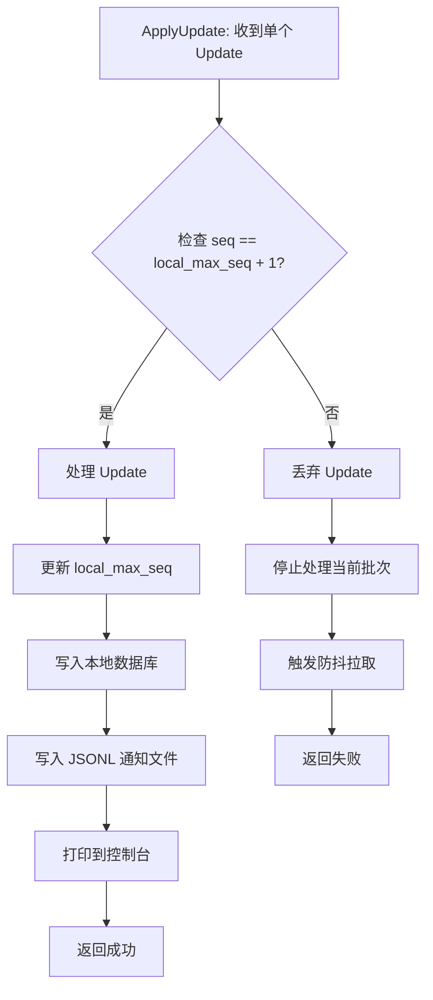
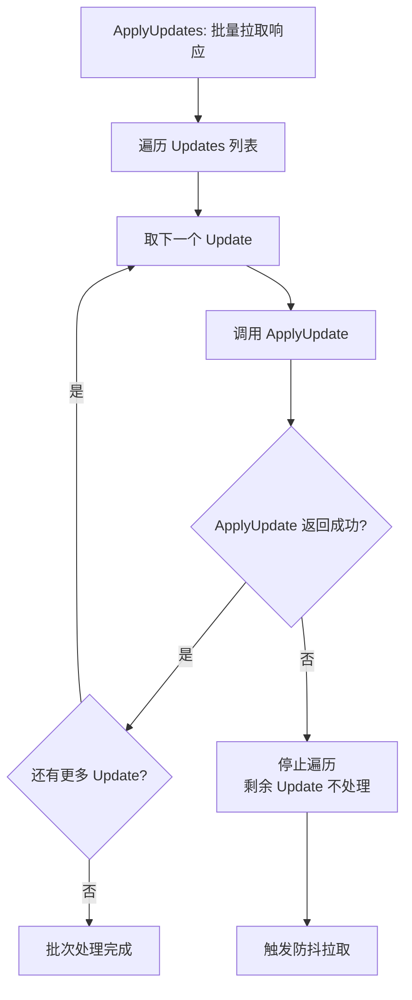
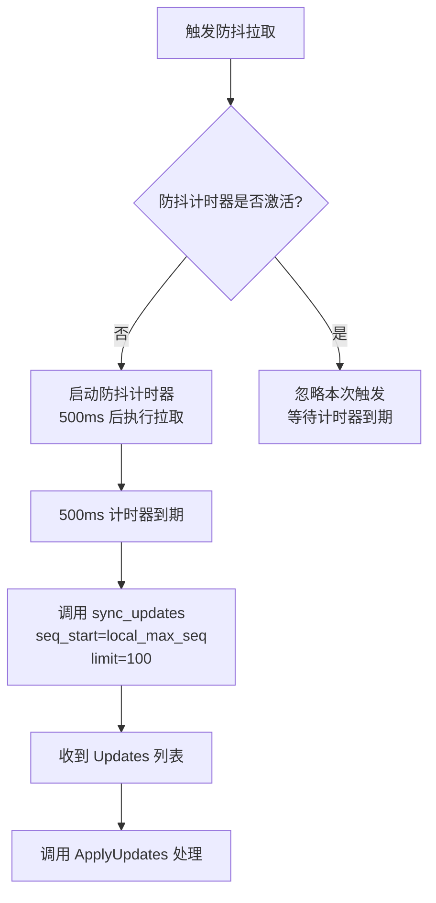
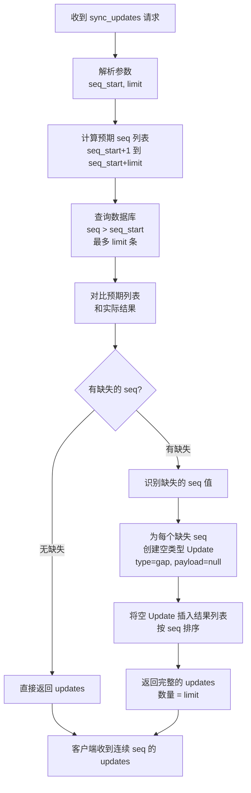
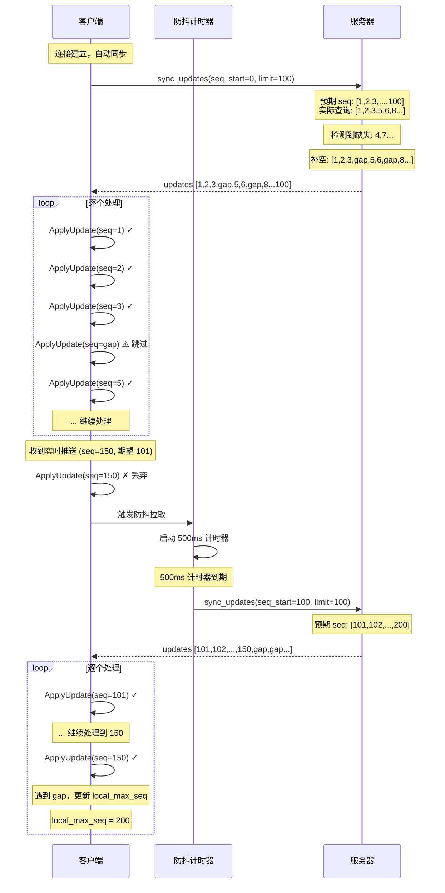
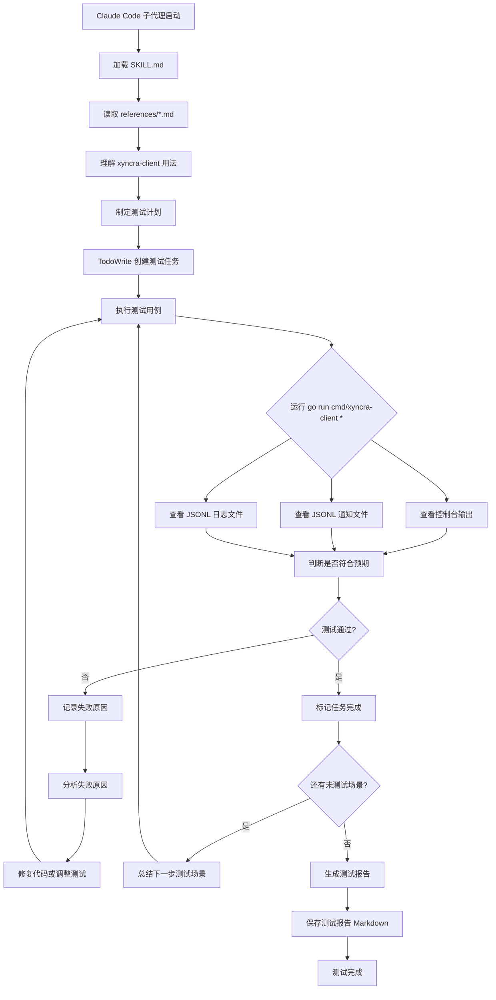

# Xyncra Client 设计文档

**日期**：2026-07-08  
**版本**：v1.0  
**状态**：已批准

---

## 目录

- [1. 概述](#1-概述)
- [2. 架构设计](#2-架构设计)
- [3. 通信层（pkg/client）](#3-通信层pkgclient)
- [4. 数据层（pkg/store）](#4-数据层pkgstore)
- [5. 命令层（internal/cli）](#5-命令层internalcli)
- [6. 错误处理策略](#6-错误处理策略)
- [7. 测试策略](#7-测试策略)
- [8. SKILL 文档结构](#8-skill-文档结构)
- [9. Claude Code 子代理驱动的测试](#9-claude-code-子代理驱动的测试)

---

## 1. 概述

### 1.1 项目目标

实现一个完整的 xyncra-client CLI 工具，包含：
- WebSocket 通信客户端
- 本地 SQLite 数据库（无 CGO）
- 持久化重试队列
- 命令行界面（支持所有 RPC 方法）
- SKILL 文档（教会 LLM 如何使用）
- Claude Code 子代理驱动的测试框架

### 1.2 核心需求

1. **完整的客户端应用**（CLI 形态）
2. **本地优先架构**：
   - 本地数据库存储（会话、消息、同步状态、草稿、已读位置）
   - 持久化重试队列
3. **Updates 完整性保证**：
   - 客户端检测 seq 间隙，触发防抖拉取
   - 服务器补空设计（缺失 seq 用空 Update 填充）
4. **单连接保证**：整个应用只维护一条 WebSocket 连接
5. **进程间通信**：listen 命令作为守护进程，其他命令通过 Unix Socket 通信

### 1.3 技术选型

- **CLI 框架**：cobra
- **SQLite**：modernc.org/sqlite（纯 Go，无 CGO）
- **ORM**：GORM（自动迁移）
- **WebSocket**：gorilla/websocket
- **文件锁**：github.com/gofrs/flock
- **日志**：标准库 log + JSONL 文件

---

## 2. 架构设计

### 2.1 项目结构

```
xyncra-server/
├── cmd/xyncra-client/
│   └── main.go                      # CLI 入口，命令注册和解析
│
├── pkg/client/
│   ├── client.go                    # XyncraClient 核心接口
│   ├── connection.go                # WebSocket 连接管理（重连、心跳）
│   ├── sync.go                      # 增量同步逻辑（sync_updates）
│   ├── retry.go                     # 重试队列（指数退避）
│   └── options.go                   # Functional Options 配置
│
├── pkg/store/
│   ├── clientdb.go                  # ClientDB 主接口（SQLite）
│   ├── conversation_store.go        # 会话存储
│   ├── message_store.go             # 消息存储
│   ├── sync_state_store.go          # 同步状态存储（last_seq, last_message_id）
│   ├── draft_store.go               # 草稿存储
│   ├── read_position_store.go       # 已读位置存储
│   ├── queue_store.go               # 持久化重试队列
│   └── models.go                    # 数据模型定义
│
├── internal/cli/
│   ├── app.go                       # CLI 应用框架（cobra 配置）
│   ├── listen.go                    # listen 命令实现
│   ├── send.go                      # send 命令实现
│   ├── conversations.go             # 会话相关命令
│   ├── messages.go                  # 消息相关命令
│   ├── sync.go                      # sync-updates 命令
│   └── output/
│       ├── console.go               # 控制台输出格式化
│       └── jsonl.go                 # JSONL 文件输出
│
└── pkg/protocol/                    # 已有：复用现有协议定义
```

### 2.2 职责分离

1. **pkg/client** - 通信层
   - WebSocket 连接管理（自动重连、心跳）
   - RPC 请求/响应处理
   - Updates 接收和分发
   - 重试队列管理

2. **pkg/store** - 数据层
   - SQLite 数据库操作（纯 Go，无 CGO）
   - 本地数据持久化（会话、消息、同步状态、草稿、已读位置）
   - 重试任务持久化
   - GORM 自动迁移

3. **internal/cli** - 命令层
   - CLI 命令定义和参数解析
   - 调用 pkg/client 执行操作
   - 格式化输出（控制台 + JSONL 文件）
   - 进程锁管理

---

## 3. 通信层（pkg/client）

### 3.1 核心职责

- WebSocket 连接管理（建立、维护、断开、重连）
- **单连接保证**：整个应用生命周期内只维护一条 WebSocket 连接
- RPC 请求/响应处理（请求 ID 匹配、超时处理）
- 服务器推送消息接收（Updates、Requests）
- **Updates 完整性处理**：检测 seq 间隙，触发防抖拉取逻辑
- 重试队列管理（失败任务持久化、指数退避重试）
- 增量同步协调（自动拉取离线期间的 Updates）

### 3.2 关键设计决策

#### 3.2.1 单连接保证

- 全局唯一的 WebSocket 连接实例，通过连接管理器控制
- `listen` 命令持有并管理该连接
- 其他命令（send、list-conversations 等）复用 `listen` 的连接，或通过 Unix Socket/共享内存与 `listen` 进程通信
- 连接断开时自动重连，重连期间其他命令排队等待

#### 3.2.2 连接管理

- **自动重连**：连接断开后使用指数退避策略重连
- **心跳保活**：固定 30 秒间隔发送 heartbeat，维持连接活跃状态
- **连接状态**：提供查询当前连接状态的方法

#### 3.2.3 消息路由

- **发送请求**：通过唯一 RequestID 关联请求和响应
- **接收 Updates**：分发给 ApplyUpdates 处理器
- **接收 Requests**：分发给注册的处理器（服务器主动调用的场景）

#### 3.2.4 Updates 完整性保证（客户端侧）

**ApplyUpdate vs ApplyUpdates**：
- **ApplyUpdate**（单数）：处理单个 Update，逐个调用，每个都要检查 `seq == local_max_seq + 1`
- **ApplyUpdates**（复数）：批量拉取 Updates 的入口，内部逐个调用 ApplyUpdate

**处理流程**：
1. 批量拉取 Updates（`seq_start` 到 `seq_start + limit`）
2. 收到 Updates 列表后，**逐个处理**每个 Update
3. 每个 Update 调用 `ApplyUpdate`：
   - 检查 `seq == local_max_seq + 1`
   - 如果符合：处理 → 更新 `local_max_seq` → 继续下一个
   - 如果不符合：**停止处理当前批次**，触发防抖拉取

**防抖策略**：
- 拉取请求合并，最小间隔 500ms，避免堆积和重复请求

#### 3.2.5 重试队列

- **持久化存储**：失败的任务写入 SQLite 队列，应用重启后自动恢复
- **指数退避**：重试间隔按 1s → 2s → 4s → 8s → 16s 递增，最多 5 次
- **最终失败处理**：达到最大重试次数后标记为永久失败，保留在数据库中供人工处理

#### 3.2.6 增量同步

- **自动触发**：连接建立后自动拉取离线期间的 Updates
- **分页拉取**：使用 `seq_start` + `limit` 作为参数
- **状态持久化**：同步进度（local_max_seq）写入本地数据库

### 3.3 服务器侧 Updates 补空设计（需新增）

#### 3.3.1 拉取参数

- 客户端传入 `seq_start`（排他性下界）和 `limit`（期望数量）
- 服务器返回 `[seq_start+1, seq_start+limit]` 范围内的所有 updates

#### 3.3.2 服务器处理流程

1. 计算预期 seq 列表：`[seq_start+1, seq_start+2, ..., seq_start+limit]`
2. 查询数据库中实际的 updates
3. 对比预期列表和实际结果
4. 如果有缺失的 seq，用空类型 Update 补充
5. 返回完整的 updates 列表（保证 seq 连续，数量等于 limit）

#### 3.3.3 空类型 Update 定义

- `seq`: 缺失的 seq 值
- `type`: `"gap"`
- `payload`: `null` 或空对象
- `created_at`: 当前时间戳

### 3.4 流程图

#### 图 1：客户端 ApplyUpdate 逻辑流程（单个处理）



#### 图 2：客户端 ApplyUpdates 批量处理流程



#### 图 3：防抖拉取逻辑



#### 图 4：服务器 sync_updates_handler 处理流程（需新增补空逻辑）



#### 图 5：完整时序图（正常流程 + 防抖）



---

## 4. 数据层（pkg/store）

### 4.1 职责

- 使用 GORM 进行数据库操作（SQLite 后端，纯 Go 实现）
- 本地数据持久化（会话、消息、同步状态、草稿、已读位置）
- 持久化重试队列
- **自动迁移**：每次运行 `xyncra-client` 命令时自动创建表和索引

### 4.2 GORM 配置

**推荐配置**：
```go
gorm.Config{
    DisableAutomaticPing: true,
    Logger: logger.Default.LogMode(logger.Warn),
}
```

**SQLite 配置**（通过 GORM 的 PrepareStmt 和原生 SQL）：
- WAL 模式：`PRAGMA journal_mode=WAL;`
- Busy Timeout：`PRAGMA busy_timeout=5000;`
- Cache Size：`PRAGMA cache_size=-8000;`
- Synchronous：`PRAGMA synchronous=NORMAL;`
- Foreign Keys：`PRAGMA foreign_keys=ON;`

**连接池配置**：
- `SetMaxOpenConns(1)`：SQLite 单写连接
- `SetMaxIdleConns(1)`：保持连接
- `SetConnMaxLifetime(0)`：不过期

### 4.3 自动迁移策略

**迁移时机**：每次运行任何 `xyncra-client` 命令时自动执行

**迁移内容**：

1. **表结构迁移**
   - Conversation
   - Message
   - UserUpdate
   - SyncState
   - Draft
   - ReadPosition
   - RetryTask

2. **索引迁移**（通过 GORM 标签定义）
   ```
   Message 表索引：
   - conversation_id + message_id（复合索引，加速消息查询）
   - conversation_id + sender_id（复合索引，加速发送者过滤）
   - client_message_id（唯一索引，幂等性保证）
   
   UserUpdate 表索引：
   - user_id + seq（复合索引，加速增量同步）
   - seq（单列索引，加速排序）
   
   RetryTask 表索引：
   - next_retry（单列索引，加速重试轮询）
   - status（单列索引，加速状态过滤）
   
   ReadPosition 表索引：
   - conversation_id + user_id（复合唯一索引）
   ```

3. **GORM 标签示例**
   ```go
   type Message struct {
       ConversationID string `gorm:"index:idx_conv_msg,priority:1"`
       MessageID      uint32 `gorm:"index:idx_conv_msg,priority:2"`
       ClientMessageID string `gorm:"uniqueIndex"`
       // ...
   }
   
   type UserUpdate struct {
       UserID string `gorm:"index:idx_user_seq,priority:1"`
       Seq    uint32 `gorm:"index:idx_user_seq,priority:2;index:idx_seq"`
       // ...
   }
   
   type RetryTask struct {
       NextRetry time.Time `gorm:"index"`
       Status    string    `gorm:"index"`
       // ...
   }
   ```

### 4.4 核心接口设计

**ClientDB 主接口**：
- 提供统一的数据库访问入口
- 管理数据库连接和事务
- 提供子 Store 的访问方法

**子 Store 划分**：

1. **ConversationStore** - 会话存储
   - 保存、更新、删除会话
   - 按 LastMessageAt 排序查询
   - 支持软删除和恢复

2. **MessageStore** - 消息存储
   - 保存、删除消息
   - 按 MessageID 排序查询
   - 支持按会话 ID 过滤
   - 支持内容搜索

3. **SyncStateStore** - 同步状态存储
   - 存储 `local_max_seq`（最后一次同步的 seq）
   - 存储 `latest_seq`（服务器最新 seq）
   - 原子更新操作

4. **DraftStore** - 草稿存储
   - 保存、读取、删除草稿
   - 按会话 ID 关联

5. **ReadPositionStore** - 已读位置存储
   - 存储每个会话的已读游标位置
   - 与 Conversation 的 LastReadMessageID1/2 同步

6. **QueueStore** - 持久化重试队列
   - 保存失败的重试任务
   - 按 NextRetry 时间排序查询
   - 更新重试状态（Attempt、NextRetry）
   - 标记永久失败的任务

### 4.5 数据模型

**本地数据模型**（与服务器协议对应，但增加本地字段）：

1. **Conversation**
   - 字段：ID, UserID1, UserID2, Type, Title, Pinned, Muted, AvatarURL, Description, LastProcessedMessageID, CreatedAt, UpdatedAt, LastMessageAt, LastReadMessageID1, LastReadMessageID2, DeletedAt
   - 本地字段：`synced_at`（最后同步时间）

2. **Message**
   - 字段：ID, ClientMessageID, ConversationID, MessageID, SenderID, Content, Type, ReplyTo, Status, CreatedAt, DeletedAt
   - 本地字段：`applied`（是否已应用到 UI）

3. **UserUpdate**
   - 字段：ID, UserID, Seq, Payload, CreatedAt
   - 本地字段：`type`（update 类型，用于快速过滤）

4. **SyncState**
   - 字段：Key, Value
   - 预定义 Key：`local_max_seq`, `latest_seq`, `last_sync_time`

5. **Draft**
   - 字段：ID, ConversationID, Content, CreatedAt, UpdatedAt

6. **ReadPosition**
   - 字段：ConversationID, UserID, LastReadMessageID, UpdatedAt

7. **RetryTask**
   - 字段：ID, Method, Params, Attempt, MaxAttempts, NextRetry, CreatedAt, Status

### 4.6 SQLite 配置和业务读写需求

#### 4.6.1 SQLite 配置

**推荐配置**（基于业务场景）：

1. **WAL 模式（Write-Ahead Logging）**
   - 允许并发读写（读不阻塞写，写不阻塞读）
   - 提高 `listen` 持续写入时的查询性能
   - 适合长连接 + 短查询的场景

2. **Busy Timeout**
   - 遇到锁时等待 5 秒，而不是立即报错
   - 避免进程内多个 goroutine 的锁冲突

3. **Cache Size**
   - 增大缓存减少磁盘 IO
   - 适合频繁读取消息历史的场景

4. **Synchronous**
   - 平衡性能和安全性
   - WAL 模式下 NORMAL 足够安全（崩溃恢复）

5. **Foreign Keys**
   - 保证数据完整性（会话删除时级联删除消息）

#### 4.6.2 业务读写需求分析

**写操作场景**：

1. **ApplyUpdate（高频写入）**
   - 触发频率：每条 Update 推送或拉取时
   - 写入内容：消息、会话更新、同步状态
   - 事务策略：单条 Update 一个事务
   - 并发：`listen` 进程的单个 goroutine 处理（串行化）

2. **发送消息（中频写入）**
   - 触发频率：用户主动发送
   - 写入内容：消息、重试队列
   - 事务策略：单条消息一个事务

3. **草稿保存（低频写入）**
   - 触发频率：用户主动保存
   - 写入内容：Draft 表

4. **已读位置更新（中频写入）**
   - 触发频率：用户查看消息时
   - 写入内容：ReadPosition 表、Conversation 表

5. **批量同步（低频写入）**
   - 触发频率：连接建立时、手动触发时
   - 写入内容：大量消息、会话、同步状态
   - 事务策略：整个批次一个事务

**读操作场景**：

1. **listen 命令启动时（低频读取）**
   - 读取内容：SyncState（local_max_seq）

2. **list-conversations 命令（中频读取）**
   - 读取内容：Conversation 列表

3. **get-messages 命令（中频读取）**
   - 读取内容：指定会话的消息列表

4. **search-messages 命令（低频读取）**
   - 读取内容：按内容搜索消息

5. **重试队列轮询（高频读取）**
   - 读取内容：NextRetry <= now 的重试任务
   - 触发频率：每 1 秒轮询一次

#### 4.6.3 并发模型

**进程内并发**：
- `listen` 命令：
  - 主 goroutine：接收 WebSocket 消息、调用 ApplyUpdate（写）
  - 心跳 goroutine：每 30 秒发送 heartbeat（写）
  - 重试队列 goroutine：每 1 秒轮询重试任务（读+写）
  - 同步 goroutine：连接建立时批量拉取（读+写）

- 其他命令：短生命周期，读取数据后退出

**并发控制**：
- SQLite WAL 模式支持并发读写
- 进程内多个 goroutine 共享同一个 `*sql.DB` 连接池
- 使用 `busy_timeout` 避免锁冲突
- 关键操作使用事务保证一致性

#### 4.6.4 性能优化建议

1. **批量写入优化**
   - 批量同步时使用事务包裹
   - 使用 `INSERT OR REPLACE` 简化幂等性处理

2. **查询优化**
   - 为常用查询创建索引

3. **缓存策略**
   - 热点数据使用内存缓存
   - 定期同步到数据库

---

## 5. 命令层（internal/cli）

### 5.1 职责

- CLI 命令定义和参数解析
- 调用 `pkg/client` 和 `pkg/store` 执行操作
- 格式化输出（控制台 + JSONL 文件）
- 进程锁管理（保证单实例）

### 5.2 命令结构

**全局参数**（所有命令共享）：
```
--user-id, -u          用户 ID（必填）
--device-id            设备 ID（默认：主机名）
--server, -s           服务器 URL（默认：ws://localhost:8080/ws）
--log-dir              日志目录（默认：~/.xyncra/{user_id}/{device_id}/logs/）
```

**命令列表**：

1. **listen** - 长连接监听
   ```
   功能：建立 WebSocket 连接，接收 Updates 和 Requests
   行为：
   - 获取进程锁（防止重复启动）
   - 初始化数据库（AutoMigrate）
   - 建立 WebSocket 连接
   - 自动同步（拉取离线 Updates）
   - 启动心跳（每 30 秒）
   - 启动重试队列轮询（每 1 秒）
   - 接收消息并处理
   - 输出到控制台 + JSONL 文件
   - Ctrl+C 优雅退出
   ```

2. **send** - 发送消息
   ```
   参数：
   --conversation-id, -c    会话 ID（必填）
   --content, -m            消息内容（必填）
   --type                   消息类型（默认：text）
   --reply-to               回复的消息 ID
   
   行为：
   - 初始化数据库（AutoMigrate）
   - 连接到 listen 进程（通过 Unix Socket）
   - 发送消息 RPC
   - 输出结果
   ```

3. **list-conversations** - 列出会话
   ```
   参数：
   --offset                 分页偏移（默认：0）
   --limit                  每页数量（默认：20）
   ```

4. **create-conversation** - 创建会话
   ```
   参数：
   --user-id                对方用户 ID（必填）
   --title                  会话标题（默认：空）
   ```

5. **get-conversation** - 获取会话详情
   ```
   参数：
   --conversation-id, -c    会话 ID（必填）
   ```

6. **delete-conversation** - 删除会话
   ```
   参数：
   --conversation-id, -c    会话 ID（必填）
   ```

7. **restore-conversation** - 恢复会话
   ```
   参数：
   --conversation-id, -c    会话 ID（必填）
   ```

8. **get-messages** - 获取消息历史
   ```
   参数：
   --conversation-id, -c    会话 ID（必填）
   --after-message-id       分页游标（默认：0）
   --limit                  每页数量（默认：50）
   ```

9. **search-messages** - 搜索消息
   ```
   参数：
   --conversation-id, -c    会话 ID（必填）
   --query, -q              搜索关键词（必填）
   --after-message-id       分页游标（默认：0）
   --limit                  每页数量（默认：50）
   ```

10. **delete-message** - 删除消息
    ```
    参数：
    --message-id             消息 ID（必填）
    ```

11. **mark-as-read** - 标记已读
    ```
    参数：
    --conversation-id, -c    会话 ID（必填）
    --message-id             消息 ID（默认：全部已读）
    ```

12. **sync-updates** - 手动触发同步
    ```
    行为：
    - 初始化数据库（AutoMigrate）
    - 连接到 listen 进程
    - 调用 sync_updates RPC（批量拉取）
    - 应用到本地数据库
    - 输出结果
    ```

13. **draft** - 草稿管理
    ```
    子命令：
    - draft save --conversation-id -c --content -m
    - draft get --conversation-id -c
    - draft delete --conversation-id -c
    ```

### 5.3 进程间通信（IPC）

**listen 命令**作为守护进程，其他命令需要与之通信：

1. **Unix Socket**
   - 路径：`~/.xyncra/{user_id}/{device_id}/xyncra.sock`
   - 协议：JSON-RPC over Unix Socket
   - 用途：其他命令通过 Socket 向 listen 发送 RPC 请求

2. **通信流程**
   ```
   CLI 命令 → Unix Socket → listen 进程 → WebSocket → 服务器
   服务器响应 → WebSocket → listen 进程 → Unix Socket → CLI 命令
   ```

3. **fallback 方案**
   - 如果 listen 未运行，其他命令直接建立 WebSocket 连接
   - 执行完操作后关闭连接（短连接模式）

### 5.4 输出格式

**控制台输出**：
- 人类友好的格式化文本
- 支持颜色（可选，通过 `--no-color` 禁用）

**JSONL 文件输出**：

1. **notifications.jsonl** - Update 通知
   ```json
   {"timestamp":"2026-07-08T12:00:00Z","type":"update","seq":123,"payload":{...}}
   ```

2. **rpc.log.jsonl** - RPC 请求/响应日志
   ```json
   {"timestamp":"2026-07-08T12:00:00Z","type":"request","id":"req-001","method":"send_message","params":{...}}
   {"timestamp":"2026-07-08T12:00:01Z","type":"response","id":"req-001","code":0,"data":{...}}
   ```

3. **日志轮转**
   - 按日期轮转：`notifications-2026-07-08.jsonl`
   - 保留最近 7 天
   - 可配置（默认 7 天）

### 5.5 进程锁管理

**锁文件路径**：`~/.xyncra/{user_id}/{device_id}/xyncra.lock`

**锁策略**：
- `listen` 命令：获取排他锁（Exclusive Lock）
- 其他命令：获取共享锁（Shared Lock）或直接连接 listen
- 锁内容：PID + 启动时间
- 锁检测：读取锁文件，检查 PID 是否存活

**锁行为**：
- `listen` 启动时：检查锁文件，如果已存在且 PID 存活，报错退出
- `listen` 退出时：释放锁（删除锁文件）
- 其他命令：不获取锁，直接连接 listen 的 Unix Socket

---

## 6. 错误处理策略

### 6.1 错误分类

1. **协议错误**（pkg/protocol）
   - 已定义：ValidationError(-100), NotFound(-101), PermissionDenied(-200), InternalError(-300)
   - 客户端复用服务器的错误码体系
   - 客户端新增错误码：
     - `-400` ConnectionError：WebSocket 连接失败
     - `-401` TimeoutError：RPC 调用超时
     - `-402` SyncError：增量同步失败

2. **本地错误**（pkg/store）
   - 数据库错误：SQLite 错误（锁冲突、约束违反等）
   - 迁移错误：AutoMigrate 失败
   - 队列错误：重试任务处理失败

3. **CLI 错误**（internal/cli）
   - 参数错误：缺少必填参数、参数格式错误
   - 进程锁错误：listen 已在运行
   - IPC 错误：Unix Socket 连接失败

### 6.2 错误处理原则

1. **错误传播**
   - 底层错误包装为高层错误（保留原始错误信息）
   - 使用 Go 1.13+ 的 `%w` 格式化错误
   - 示例：`fmt.Errorf("send message: %w", err)`

2. **错误日志**
   - 所有错误写入日志文件（`error.log`）
   - 日志格式：`[时间] [级别] [模块] 错误信息 | 原始错误`
   - 日志级别：ERROR, WARN, INFO, DEBUG

3. **用户友好输出**
   - 控制台输出人类友好的错误信息
   - 隐藏技术细节（堆栈、SQL 错误等）
   - 示例：
     ```
     错误：会话不存在（conversation_id: conv-123）
     建议：请检查会话 ID 是否正确，或先创建会话
     ```

4. **重试策略**
   - 网络错误：自动重试（指数退避）
   - 数据库错误：不重试，立即报错
   - 参数错误：不重试，提示用户修正

5. **优雅降级**
   - 非关键错误不阻塞主流程
   - 示例：JSONL 文件写入失败时，仅记录日志，不阻塞消息处理

### 6.3 错误示例

1. **WebSocket 连接失败**
   ```
   控制台：错误：无法连接到服务器（ws://localhost:8080/ws）
   日志：[ERROR] [client] WebSocket 连接失败 | dial tcp 127.0.0.1:8080: connect: connection refused
   建议：请检查服务器是否运行，或网络连接是否正常
   ```

2. **RPC 调用超时**
   ```
   控制台：错误：请求超时（method: send_message, timeout: 30s）
   日志：[ERROR] [client] RPC 调用超时 | request_id: req-001, method: send_message
   建议：请检查网络连接，或稍后重试
   ```

3. **数据库锁冲突**
   ```
   控制台：错误：数据库繁忙，请稍后重试
   日志：[ERROR] [store] 数据库锁冲突 | database is locked (busy_timeout: 5000ms)
   建议：请等待几秒后重试，或检查是否有其他进程正在访问数据库
   ```

---

## 7. 测试策略

### 7.1 测试层次

1. **单元测试**（Unit Tests）
   - 覆盖率目标：80%+
   - 测试对象：
     - `pkg/store`：数据库操作（使用 SQLite 内存数据库）
     - `pkg/client`：重试队列逻辑、防抖逻辑
     - `internal/cli/output`：输出格式化

2. **集成测试**（Integration Tests）
   - 测试对象：
     - WebSocket 客户端 + 服务器（需要启动真实服务器）
     - CLI 命令端到端测试（启动 listen + 执行其他命令）
   - 测试场景：
     - 发送消息 → 接收消息
     - 增量同步（有 gap 的情况）
     - 重试队列（失败 → 重试 → 成功）
     - 进程锁（重复启动 listen）

3. **端到端测试**（E2E Tests）
   - 完整的用户场景测试
   - 使用 docker-compose 启动服务器 + Redis + PostgreSQL
   - 测试场景：
     - 多用户消息传递
     - 多设备同步
     - 离线消息同步

### 7.2 测试工具

1. **测试框架**
   - 标准库 `testing`
   - `github.com/stretchr/testify`（断言和模拟）

2. **Mock 工具**
   - `github.com/golang/mock`（生成 Mock 对象）
   - 用于模拟 WebSocket 连接、数据库操作

3. **测试数据库**
   - SQLite 内存数据库（单元测试）
   - SQLite 文件数据库（集成测试）

4. **性能测试**
   - `testing.B`（基准测试）
   - 测试对象：
     - ApplyUpdate 性能（每秒处理多少条 Update）
     - 批量同步性能（1000 条 Updates 的同步时间）
     - 数据库查询性能（消息列表查询）

### 7.3 测试数据

1. **Fixture 数据**
   - 预定义的会话、消息、用户
   - 用于集成测试和 E2E 测试

2. **随机数据生成**
   - 使用 `github.com/brianvoe/gofakeit` 生成测试数据
   - 用于压力测试和性能测试

### 7.4 测试覆盖率报告

```bash
# 生成覆盖率报告
go test -coverprofile=coverage.out ./...
go tool cover -html=coverage.out -o coverage.html

# 目标覆盖率
# pkg/store: 85%+
# pkg/client: 80%+
# internal/cli: 70%+
```

### 7.5 持续集成（CI）

1. **测试阶段**
   - 单元测试（每次提交）
   - 集成测试（每次 PR）
   - E2E 测试（每次合并到 main）

2. **覆盖率检查**
   - 覆盖率低于目标值时，CI 失败
   - 生成覆盖率报告并上传

3. **性能基准测试**
   - 每周运行一次
   - 检测性能退化

---

## 8. SKILL 文档结构

### 8.1 目的

教会 LLM（Claude Code）如何使用 xyncra-client，包括：
- 安装和配置
- 各个命令的用法
- 常见场景的最佳实践
- 故障排查

### 8.2 目录结构

```
.claude/skills/xyncra-client-usage/
├── SKILL.md                          # 目录索引（入口）
└── references/
    ├── getting-started.md            # 快速开始
    ├── commands/
    │   ├── listen.md                 # listen 命令详解
    │   ├── send.md                   # send 命令详解
    │   ├── conversations.md          # 会话管理命令
    │   ├── messages.md               # 消息操作命令
    │   ├── sync.md                   # 同步命令
    │   └── draft.md                  # 草稿管理命令
    ├── architecture/
    │   ├── overview.md               # 架构概述
    │   ├── database.md               # 本地数据库说明
    │   ├── ipc.md                    # 进程间通信说明
    │   └── logging.md                # 日志和通知说明
    ├── scenarios/
    │   ├── basic-usage.md            # 基础使用场景
    │   ├── multi-device.md           # 多设备同步场景
    │   ├── offline-sync.md           # 离线同步场景
    │   ├── error-handling.md         # 错误处理场景
    │   └── advanced.md               # 高级用法
    └── troubleshooting/
        ├── common-issues.md          # 常见问题
        └── debugging.md              # 调试指南
```

### 8.3 SKILL.md 内容（目录索引）

```markdown
# Xyncra Client Usage Skill

本 SKILL 教你如何如何使用 xyncra-client CLI 工具。

## 快速开始

- [getting-started.md](references/getting-started.md) - 安装、配置、第一次使用

## 命令参考

- [listen.md](references/commands/listen.md) - 长连接监听（核心命令）
- [send.md](references/commands/send.md) - 发送消息
- [conversations.md](references/commands/conversations.md) - 会话管理
- [messages.md](references/commands/messages.md) - 消息操作
- [sync.md](references/commands/sync.md) - 增量同步
- [draft.md](references/commands/draft.md) - 草稿管理

## 架构说明

- [overview.md](references/architecture/overview.md) - 架构概述
- [database.md](references/architecture/database.md) - 本地数据库
- [ipc.md](references/architecture/ipc.md) - 进程间通信
- [logging.md](references/architecture/logging.md) - 日志和通知

## 使用场景

- [basic-usage.md](references/scenarios/basic-usage.md) - 基础使用
- [multi-device.md](references/scenarios/multi-device.md) - 多设备同步
- [offline-sync.md](references/scenarios/offline-sync.md) - 离线同步
- [error-handling.md](references/scenarios/error-handling.md) - 错误处理
- [advanced.md](references/scenarios/advanced.md) - 高级用法

## 故障排查

- [common-issues.md](references/troubleshooting/common-issues.md) - 常见问题
- [debugging.md](references/troubleshooting/debugging.md) - 调试指南
```

---

## 9. Claude Code 子代理驱动的测试

### 9.1 测试流程



### 9.2 测试场景覆盖

1. **基础功能测试**
   - [ ] listen 命令启动和停止
   - [ ] send 命令发送消息
   - [ ] list-conversations 列出会话
   - [ ] create-conversation 创建会话
   - [ ] get-messages 获取消息历史
   - [ ] search-messages 搜索消息
   - [ ] mark-as-read 标记已读

2. **增量同步测试**
   - [ ] 首次同步（local_max_seq=0）
   - [ ] 增量同步（有 Updates）
   - [ ] 有 gap 的同步（seq 不连续）
   - [ ] 大批量同步（1000+ Updates）
   - [ ] 离线后重连同步

3. **多设备同步测试**
   - [ ] 设备 A 发送消息 → 设备 B 接收
   - [ ] 设备 A 标记已读 → 设备 B 同步已读状态
   - [ ] 设备 A 删除消息 → 设备 B 同步删除

4. **极端场景测试**
   - [ ] 网络断开重连
   - [ ] 服务器重启
   - [ ] 高频消息推送（100 条/秒）
   - [ ] 超大消息内容（1MB+）
   - [ ] 并发发送消息（10 个 send 命令同时执行）
   - [ ] listen 进程崩溃恢复

5. **错误处理测试**
   - [ ] 无效的 user_id
   - [ ] 不存在的会话 ID
   - [ ] 无权限操作（删除他人消息）
   - [ ] 服务器不可达
   - [ ] 数据库损坏

6. **数据完整性测试**
   - [ ] 消息顺序正确性
   - [ ] 已读位置同步正确性
   - [ ] 草稿保存和读取
   - [ ] 重试队列持久化

7. **性能测试**
   - [ ] 单条 ApplyUpdate 延迟
   - [ ] 批量同步吞吐量
   - [ ] 数据库查询性能
   - [ ] 内存占用

### 9.3 测试用例文档格式

**文件名**：`tests/xyncra-client-test-cases.md`

**格式示例**：

```markdown
# Xyncra Client 测试用例

## 测试用例 1：基础消息发送

**场景**：用户 Alice 向 Bob 发送消息

**前置条件**：
- Alice 和 Bob 的账号已创建
- listen 命令已启动

**测试步骤**：
1. 执行命令：
   ```bash
   go run cmd/xyncra-client/main.go send \
     --user-id alice \
     --server ws://localhost:8080/ws \
     --conversation-id conv-123 \
     --content "Hello, Bob!"
   ```

2. 查看控制台输出：
   ```
   预期：消息发送成功，显示消息 ID
   ```

3. 查看 JSONL 日志文件：
   ```bash
   cat ~/.xyncra/alice/device1/logs/rpc.log.jsonl
   ```
   预期：包含 send_message 请求和响应

**预期结果**：
- 控制台输出消息发送成功
- 本地数据库中消息已保存
- JSONL 日志文件包含 RPC 记录

**实际结果**：
- [待填写]

**状态**：⏳ 待测试 / ✅ 通过 / ❌ 失败
```

### 9.4 测试报告格式

**文件名**：`tests/xyncra-client-test-report-YYYY-MM-DD.md`

**格式示例**：

```markdown
# Xyncra Client 测试报告

**测试日期**：2026-07-08
**测试人**：Claude Code 子代理
**测试版本**：v1.0.0

## 测试摘要

| 类别 | 总数 | 通过 | 失败 | 跳过 |
|------|------|------|------|------|
| 基础功能 | 10 | 9 | 1 | 0 |
| 增量同步 | 8 | 8 | 0 | 0 |
| 多设备同步 | 5 | 4 | 1 | 0 |
| 极端场景 | 12 | 10 | 2 | 0 |
| 错误处理 | 8 | 7 | 1 | 0 |
| 数据完整性 | 6 | 6 | 0 | 0 |
| 性能测试 | 4 | 4 | 0 | 0 |
| **总计** | **53** | **48** | **5** | **0** |

**通过率**：90.6%

## 失败用例分析

### 失败用例 1：高频消息推送

**用例 ID**：EXTREME-003
**场景**：100 条消息/秒推送
**预期**：所有消息按顺序处理
**实际**：部分消息丢失（seq 间隙）
**原因分析**：ApplyUpdate 处理速度跟不上推送速度
**建议修复**：优化 ApplyUpdate 性能，或增加批量处理

### 失败用例 2：listen 进程崩溃恢复

**用例 ID**：EXTREME-006
**场景**：listen 进程被 kill -9 杀死后重启
**预期**：自动恢复，继续处理 Updates
**实际**：启动时报错"进程锁已被占用"
**原因分析**：进程锁未正确释放
**建议修复**：添加锁文件清理逻辑

## 下一步测试建议

1. 优先修复失败的 5 个用例
2. 增加更多并发场景测试
3. 添加长时间稳定性测试（24 小时运行）

## 附录

- [测试用例详情](./xyncra-client-test-cases.md)
- [JSONL 日志样本](./logs/sample-rpc.log.jsonl)
```

### 9.5 Claude Code 子代理测试工作流

1. **加载 SKILL**
   ```bash
   # Claude Code 子代理启动时
   读取 .claude/skills/xyncra-client-usage/SKILL.md
   读取 references/*.md（按需加载）
   ```

2. **制定测试计划**
   ```markdown
   根据 SKILL 内容，制定测试计划：
   - 覆盖所有命令
   - 覆盖所有场景（正常、异常、极端）
   - 使用 TodoWrite 创建任务列表
   ```

3. **执行测试**
   ```bash
   # 运行命令
   go run cmd/xyncra-client/main.go listen --user-id alice --server ws://localhost:8080/ws
   
   # 另一个终端
   go run cmd/xyncra-client/main.go send --user-id alice --conversation-id conv-123 --content "test"
   
   # 查看输出
   cat ~/.xyncra/alice/device1/logs/notifications.jsonl
   cat ~/.xyncra/alice/device1/logs/rpc.log.jsonl
   ```

4. **判断结果**
   ```markdown
   对比预期结果和实际结果：
   - 控制台输出是否符合预期？
   - JSONL 文件内容是否正确？
   - 本地数据库数据是否完整？
   ```

5. **总结下一步**
   ```markdown
   完成当前场景后，总结：
   - 哪些场景已测试？
   - 哪些场景未测试？
   - 下一个应该测试什么？
   ```

6. **生成报告**
   ```markdown
   所有测试完成后，生成测试报告：
   - 测试摘要
   - 失败用例分析
   - 下一步建议
   ```

---

## 附录

### A. 关键决策记录

1. **D-020：单连接保证**
   - 决策：整个应用只维护一条 WebSocket 连接
   - 原因：简化连接管理，避免重复连接和消息重复

2. **D-021：Updates 完整性保证**
   - 决策：客户端检测 seq 间隙，服务器补空设计
   - 原因：保证数据完整性，避免消息丢失

3. **D-022：进程间通信**
   - 决策：使用 Unix Socket 进行进程间通信
   - 原因：listen 作为守护进程，其他命令复用连接

4. **D-023：GORM 自动迁移**
   - 决策：每次运行命令时自动执行 AutoMigrate
   - 原因：零配置，首次运行自动创建数据库

### B. 性能指标

1. **ApplyUpdate 性能**：目标 1000 条/秒
2. **批量同步性能**：1000 条 Updates 同步时间 < 5 秒
3. **数据库查询性能**：消息列表查询 < 100ms
4. **内存占用**：< 100MB（1000 条消息）

### C. 安全考虑

1. **进程锁**：防止重复启动 listen
2. **文件权限**：数据库和日志文件权限 600
3. **Unix Socket**：仅本地访问，权限 600

---

**文档结束**
