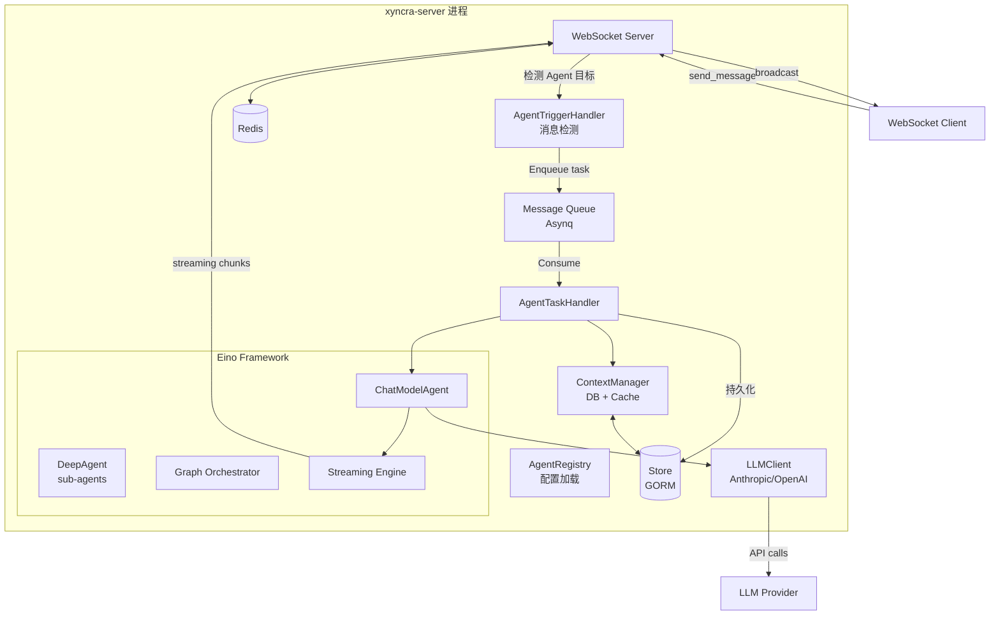
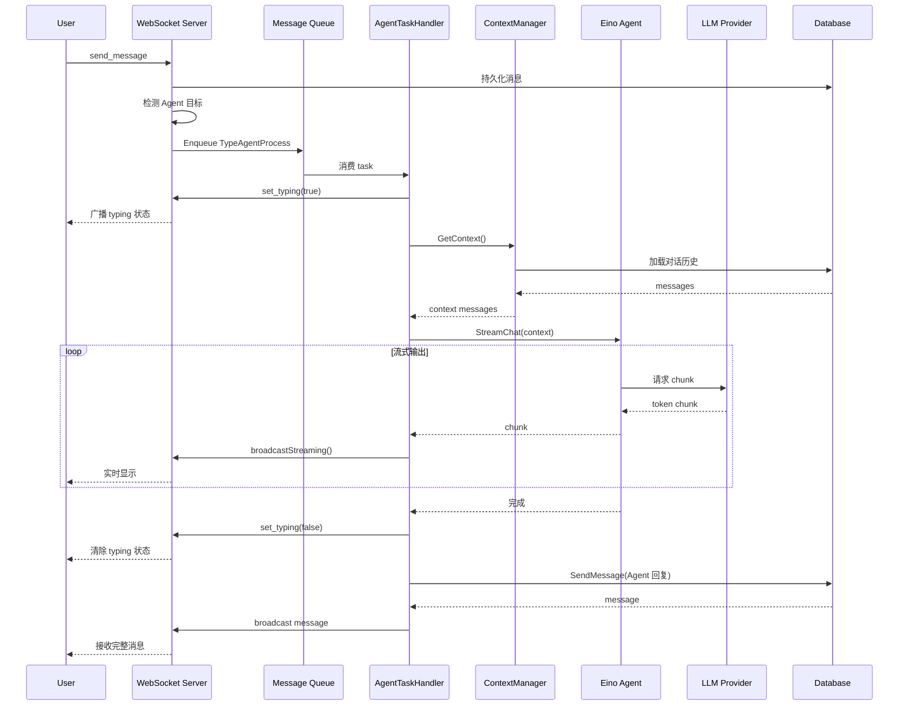
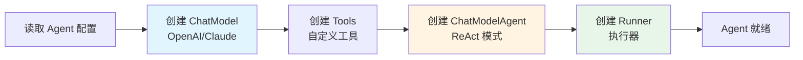
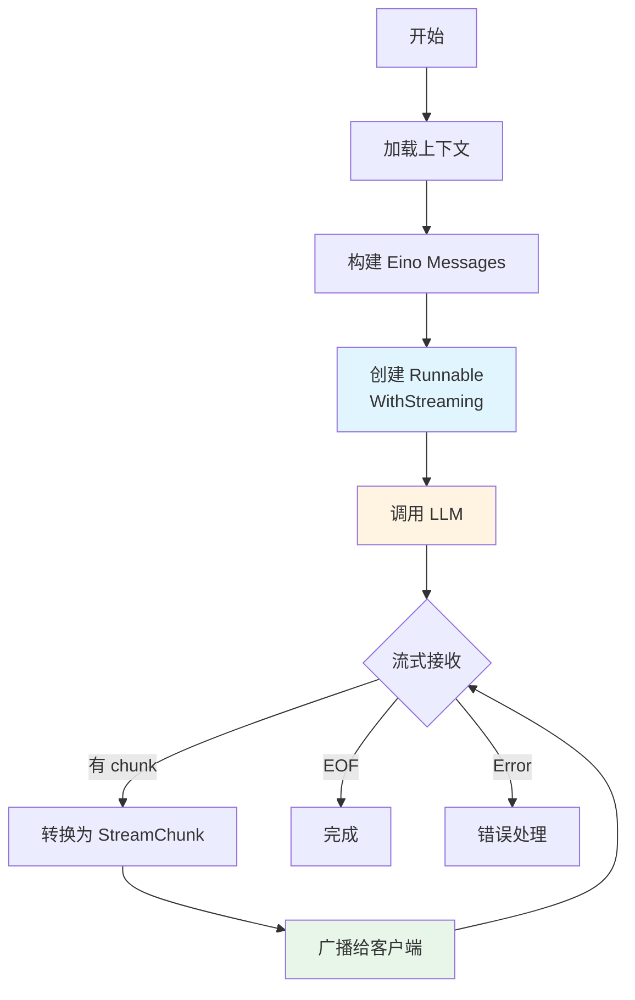
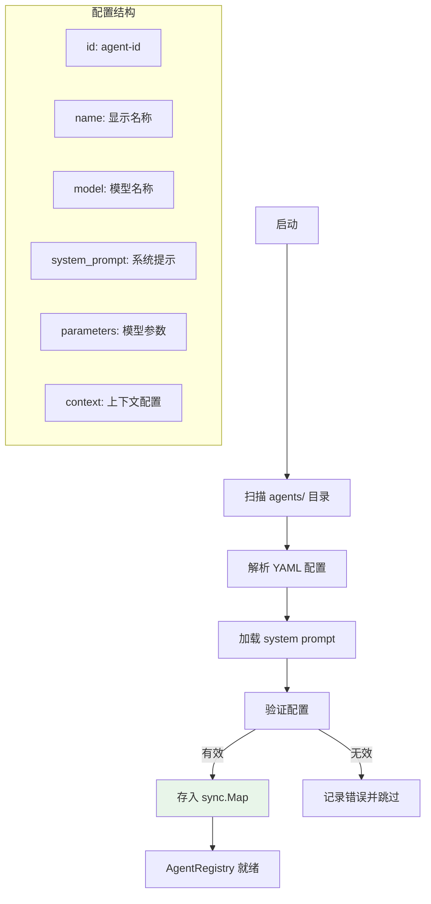
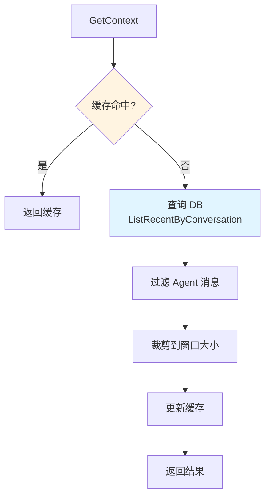
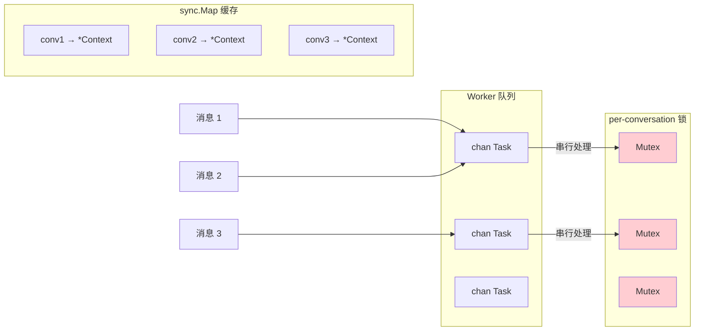
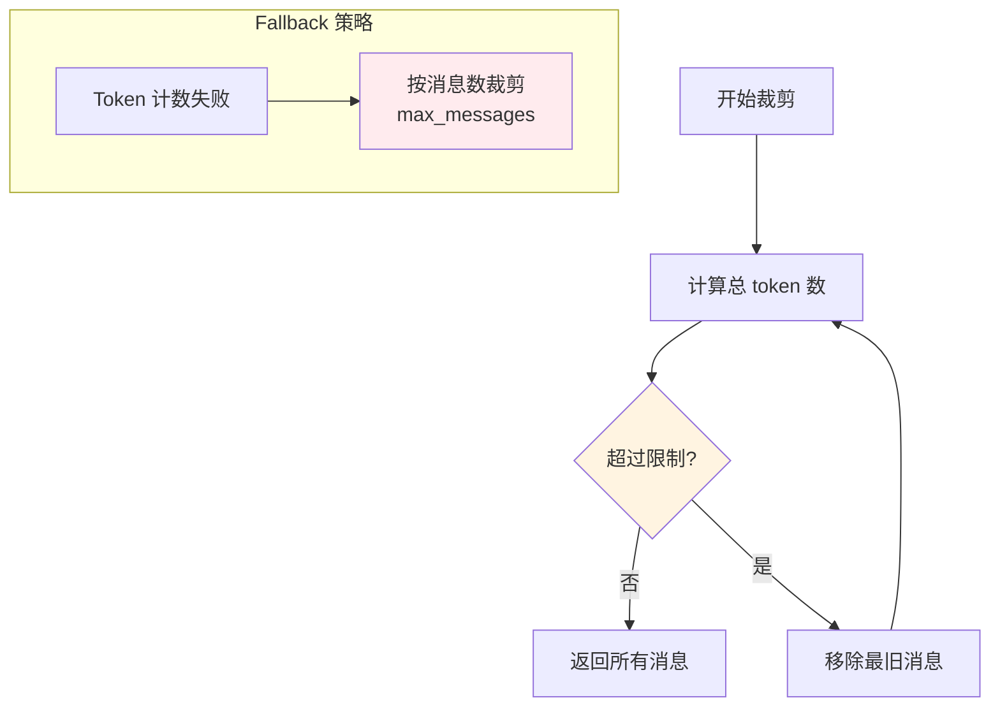
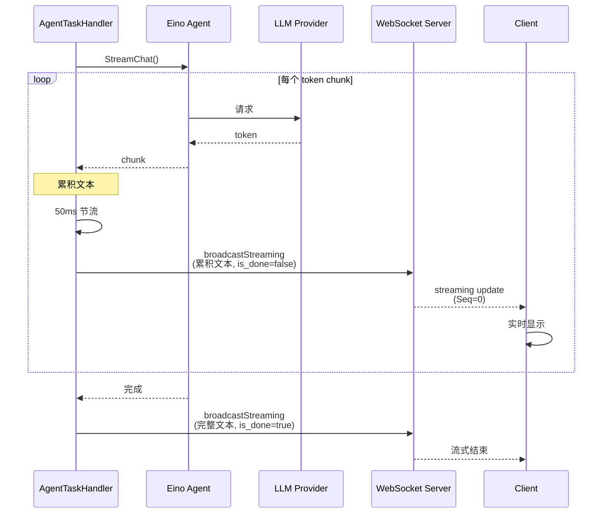
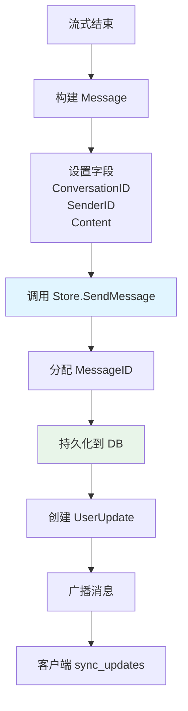

# Xyncra AI Agent 系统设计文档

**日期**：2026-07-10  
**版本**：v2.0  
**状态**：已批准

---

## 目录

- [1. 概述](#1-概述)
- [2. 架构设计](#2-架构设计)
- [3. Eino 框架集成](#3-eino-框架集成)
- [4. Agent 配置系统](#4-agent-配置系统)
- [5. 上下文管理](#5-上下文管理)
- [6. 流式输出处理](#6-流式输出处理)
- [7. 消息协议兼容性](#7-消息协议兼容性)
- [8. 实施阶段](#8-实施阶段)
- [9. 产品决策](#9-产品决策)
- [10. 关键文件清单](#10-关键文件清单)

---

## 1. 概述

### 1.1 项目目标

为 Xyncra 即时通讯系统添加 AI Agent 功能，使用户可以与 AI 助手进行对话。核心需求：

1. **Agent 作为特殊用户**：Agent 有 User ID，用户给 Agent 发消息，Agent 调用 LLM 处理后回复
2. **流式输出**：Agent 的回复实时流式推送给用户（类似 ChatGPT 的打字效果）
3. **上下文管理**：支持多轮对话，记住之前的对话内容
4. **配置化**：通过 Markdown+YAML 文件定义 Agent（User ID、名字、描述、system prompt 等）
5. **零协议改动（MVP）**：Phase 1 不修改现有消息协议，复用现有机制

### 1.2 技术选型决策

经过调研，选择以下技术方案：

| 决策点 | 选择 | 理由 |
|--------|------|------|
| **Agent 框架** | Eino (github.com/cloudwego/eino) | Go 原生、功能完整、12.2k stars、字节跳动维护 |
| **LLM Provider** | Anthropic Claude / OpenAI | 通过 eino-ext 支持，灵活切换 |
| **集成方式** | 进程内集成（非 subprocess） | 零额外进程开销，纯 Go 依赖 |
| **上下文存储** | DB + 内存缓存 | 从 messages 表读取，sync.Map 缓存热路径 |
| **流式输出** | 复用现有 stream_text 机制 | 零协议改动，客户端已有处理逻辑 |

**为什么不用 Claude Code / Codex CLI？**
- 无 Go SDK，需要 subprocess 集成（200-500ms 启动延迟 + 50-100MB 内存开销）
- 部署复杂（需要安装 Node.js 或 Rust binary）
- 不适合 IM 系统的低延迟场景

**为什么不用直接调用 LLM API？**
- 需要自己实现上下文管理、tools、sub-agents、MCP 等功能
- 工作量巨大，重复造轮子

**为什么选 Eino？**
- Go 原生，零语言鸿沟
- 提供 ChatModelAgent、DeepAgent（sub-agents）、graph orchestration、streaming、tools、sessions
- 流式输出是核心强项，可直接对接 Xyncra 的 WebSocket streaming
- 纯 Go 依赖，部署简单

**Eino 的唯一缺陷**：无原生 MCP 支持，但可以通过 Tool 系统桥接，不是 blocker。

### 1.3 Eino 官方 Skill 参考

本项目使用 Eino 官方提供的四个 Claude Code skill 作为开发指南：

| Skill              | 用途                                               | 参考文档                                    |
| ------------------ | -------------------------------------------------- | ------------------------------------------- |
| **eino-guide**     | 框架概览、核心概念、导航                           | `.claude/skills/eino-guide/SKILL.md`        |
| **eino-component** | 组件选择、配置、使用（ChatModel、Tool、Retriever 等） | `.claude/skills/eino-component/SKILL.md`  |
| **eino-compose**   | 编排系统（Graph、Chain、Workflow）                 | `.claude/skills/eino-compose/SKILL.md`      |
| **eino-agent**     | Agent 构建、Middleware、Runner、Human-in-the-Loop  | `.claude/skills/eino-agent/SKILL.md`        |

这些 skill 提供了 Eino 框架的最佳实践和完整 API 参考，开发时应遵循其指导。

### 1.4 核心设计原则

1. **最小改动原则**：Phase 1 不修改任何协议定义，仅通过 UserID 约定实现
2. **向后兼容**：所有增强均为可选，旧客户端不受影响
3. **复用优先**：stream_text 和 set_typing 已满足 Agent 80% 的需求
4. **渐进增强**：从 MVP 到生产的平滑过渡路径

---

## 2. 架构设计

### 2.1 整体架构



### 2.2 数据流



### 2.3 关键组件

#### AgentRegistry
- 从 `agents/` 目录加载 YAML 配置
- 管理 Agent 配置的生命周期
- 提供 `IsAgent(userID string) bool` 查询

#### AgentTaskHandler
- MQ task handler，处理 `TypeAgentProcess` 任务
- 使用 Eino 框架调用 LLM
- 通过 `broadcastFn` 流式推送给客户端

#### ContextManager
- 从 `messages` 表读取对话历史
- `sync.Map` 缓存热路径
- Token 计数裁剪（`tiktoken-go`）+ 固定消息数 fallback
- per-conversation worker 串行处理

#### LLMClient (Eino 封装)
- 封装 Eino 的 ChatModel 接口
- 支持 Anthropic Claude 和 OpenAI
- 提供流式输出能力

---

## 3. Eino 框架集成

### 3.1 Eino 核心概念

Eino 提供以下核心能力：

- **ChatModelAgent**：带 tool use 的 agent
- **DeepAgent**：任务分解、sub-agent 委派
- **Graph Orchestration**：图编排（节点、边、编译、执行）
- **Streaming**：全链路流式处理
- **Tools**：自定义 tools + GraphTool
- **Sessions**：持久对话支持
- **Interrupt/Resume**：Human-in-the-loop

### 3.2 Agent 初始化流程



### 3.3 流式调用流程



### 3.4 关键 Eino 组件

根据 **eino-component** skill 的指导，我们将使用以下组件：

- **ChatModel**: 使用 `openai.NewChatModel` 或 `claude.NewChatModel`
- **Tool**: 自定义工具实现 `tool.InvokableTool` 接口
- **Callback**: 使用 Callback Handler 实现可观测性

根据 **eino-agent** skill 的指导：

- **ChatModelAgent**: ReAct 模式，适合大多数场景
- **DeepAgent**: 需要规划、文件系统、子 agent 时使用
- **Runner**: 管理 agent 生命周期，支持 interrupt/resume
- **Middleware**: 可扩展 agent 行为（filesystem、summarization 等）

根据 **eino-compose** skill 的指导：

- **Graph**: 复杂流程，支持分支和循环
- **Chain**: 线性管道
- **Workflow**: DAG 编排，支持并行分支

---

## 4. Agent 配置系统

### 4.1 配置文件格式

Agent 通过 YAML 文件定义，存放于 `agents/` 目录：

```yaml
# agents/weather-bot.yaml
id: weather-bot
name: Weather Bot
description: "Provides weather information"
model: "claude-3-5-sonnet-20241022"  # 或 "gpt-4"
api_key_env: "ANTHROPIC_API_KEY"     # 从环境变量读取 API key
base_url: ""                          # 可选：自定义 endpoint
system_prompt_file: "./prompts/weather-bot.md"
parameters:
  temperature: 0.7
  max_tokens: 4096
context:
  max_tokens: 4096
  max_messages: 20
tools: []  # 可选：自定义 tools
```

### 4.2 System Prompt 文件

```markdown
# agents/prompts/weather-bot.md

You are a helpful weather assistant. You provide accurate weather information.

Current time: {{current_time}}
User location: {{user_location}}

Be concise and friendly.
```

### 4.3 AgentRegistry 加载流程



---

## 5. 上下文管理

### 5.1 设计原则

- **DB 存储 + 内存缓存**：从 `messages` 表读取历史（数据已存在），`sync.Map` 缓存热路径
- **Token 计数裁剪**：使用 `tiktoken-go` 计算 token 数，保留最近的消息直到达到上限
- **per-conversation 串行处理**：保证同一对话的消息串行处理，避免上下文不一致

### 5.2 上下文加载流程



### 5.3 并发控制



### 5.4 Token 裁剪策略



---

## 6. 流式输出处理

### 6.1 复用现有机制

Agent 的流式输出完全复用 `stream_text` RPC（D-051）和累积文本模式：

- **协议层**：使用 `UpdateTypeStreaming` (Seq=0, ephemeral)
- **广播函数**：通过 `BroadcastUpdates` 推送给会话成员
- **客户端处理**：复用 `StreamingHandler.OnStreaming` 回调

### 6.2 流式广播流程



### 6.3 消息持久化



---

## 7. 消息协议兼容性

### 7.1 Phase 1（MVP）：零协议改动

**核心原则**：Agent 就是特殊的 UserID，复用所有现有机制。

#### Agent UserID 命名约定

```
agent/weather-bot
agent/code-reviewer
agent/translator
```

- `agent/` 前缀为系统保留命名空间
- Agent 在协议层与普通用户完全等价
- 客户端通过 `strings.HasPrefix(userID, "agent/")` 识别

#### 客户端改动（MVP）

客户端仅需新增一个 helper 函数：

```
function isAgentUser(userID):
    return userID.startsWith("agent/")
```

在 `TypingHandler.OnTyping` 和 `StreamingHandler.OnStreaming` 中根据此函数决定 UI 展示。

### 7.2 Phase 2（可选增强）

#### 新增 agent_status ephemeral push

新增协议常量 `UpdateTypeAgentStatus`，支持以下状态：

- `thinking`: Agent 正在调用 LLM
- `tool_calling`: Agent 正在调用工具
- `generating`: Agent 正在生成回复
- `idle`: Agent 空闲

#### 新增 reload_agents RPC

触发 server 重新扫描 agents 目录，实现配置热更新。

---

## 8. 实施阶段

### Phase 1: MVP（预计 1-2 周）

**目标**：实现基本 Agent 功能，零协议改动

**任务**：

1. ✅ 新建 `internal/agent/` 包
2. ✅ 实现 `AgentRegistry`（从 YAML 加载配置）
3. ✅ 实现 `EinoAgent`（封装 Eino 框架）
4. ✅ 实现 `ContextManager`（DB 存储 + 简单缓存）
5. ✅ 实现 `AgentTaskHandler` 注册为 `TypeAgentProcess` MQ handler
6. ✅ 在 `send_message` handler 中检测 Agent 目标，enqueue task
7. ✅ 新增 `MessageStore.ListRecentByConversation()` 方法
8. ✅ Agent 配置目录 `agents/`（可选，默认无 Agent）
9. ✅ 客户端新增 `isAgentUser()` helper（仅 UI 层）

**协议改动**：**零**

### Phase 2: 生产化（预计 1 周）

**目标**：优化和监控

**任务**：

1. ✅ Token 计数裁剪（集成 tiktoken-go）
2. ✅ per-conversation worker 串行队列
3. ✅ 配置热更新（`reload_agents` RPC）
4. ✅ 并发控制（semaphore）和超时配置
5. ✅ 监控和日志（LLM 调用延迟、token 使用量）

**可选增强**：

- `agent_status` ephemeral push（thinking/tool_calling 状态）
- System prompt 动态注入（当前时间、用户信息等）

### Phase 3: 高级功能（可选）

**目标**：扩展 Agent 能力

**任务**：

1. ✅ Sub-agents（DeepAgent）
2. ✅ 自定义 tools（天气查询、数据库查询等）
3. ✅ Graph orchestration（复杂工作流）
4. ✅ MCP 桥接（如果需要使用 MCP tools）

---

## 9. 产品决策

建议新增以下产品决策：

### D-054: Agent UserID 命名约定

Agent 使用 `agent/<agent-id>` 格式的 UserID。`agent/` 前缀为系统保留命名空间。Agent 在协议层与普通用户完全等价，客户端通过前缀识别。

### D-055: Agent 消息格式复用

Agent 的消息与普通用户消息格式完全相同。不新增 Message.Type 枚举值，不新增 Package 类型。Agent 通过 `agent/` 前缀的 UserID 标识。

### D-056: Agent 流式输出复用 stream_text

Agent 的流式输出完全复用 `stream_text` RPC（D-051）和累积文本模式。客户端通过 broadcast payload 中的 `user_id` 前缀判断来源。

### D-057: Agent 思考状态复用 set_typing

Agent 的思考状态使用 `set_typing` RPC（D-050）。客户端通过 `user_id` 前缀区分 "typing" 和 "thinking" 的 UI 展示。

### D-058: Agent 配置格式

Agent 通过 YAML 文件定义，存放于 `agents/` 目录。server 启动时加载。配置文件包含 id、name、model、system_prompt_file、parameters 等。

### D-059: Agent 框架选型

使用 Eino 框架（github.com/cloudwego/eino）作为 AI Agent 的核心框架。Eino 提供 ChatModelAgent、DeepAgent、graph orchestration、streaming、tools、sessions 等能力，Go 原生集成。

### D-060: Agent 上下文策略

Agent 使用 DB 存储 + 内存缓存的上下文管理策略。从 `messages` 表读取历史消息，使用 Token 计数裁剪（fallback 为固定消息数）。per-conversation worker 串行处理保证一致性。

---

## 10. 关键文件清单

### 新增文件

- `internal/agent/registry.go` - Agent 配置注册表
- `internal/agent/eino_agent.go` - Eino Agent 封装
- `internal/agent/context.go` - ContextManager 接口
- `internal/agent/db_context_manager.go` - DB 实现
- `internal/agent/task_handler.go` - AgentTaskHandler
- `internal/agent/broadcast.go` - 流式广播辅助函数
- `internal/agent/agent.go` - Agent 核心逻辑
- `agents/` - 配置文件目录
- `pkg/client/agent.go` - 客户端 `isAgentUser()` helper

### 修改文件

- `internal/mq/mq.go` - 新增 `TypeAgentProcess` task type
- `internal/handler/send_message.go` - 检测 Agent 目标，enqueue task
- `internal/store/message.go` - 新增 `ListRecentByConversation()` 方法
- `cmd/xyncra-server/main.go` - 初始化 AgentRegistry 和 AgentTaskHandler

---

## 附录：风险与缓解

| 风险                | 缓解措施                                |
| ------------------- | --------------------------------------- |
| LLM 调用超时/失败   | MQ 自动重试（Asynq retry 机制）         |
| LLM 调用阻塞 server | MQ worker 隔离，semaphore 并发控制      |
| Token 超限          | Token 计数裁剪 + 单条消息截断           |
| 并发冲突            | per-conversation worker 串行处理        |
| Agent 配置错误      | 启动时验证，运行时忽略无效配置          |
| 内存泄漏            | 缓存 TTL 清理机制                       |
| Eino 框架学习曲线   | 有中文文档和示例，社区活跃              |

---

## 下一步行动

1. ✅ 创建设计文档（本文档）
2. ⏳ 提交设计文档到 git
3. ⏳ 创建实施计划（使用 writing-plans skill）
4. ⏳ Phase 1 实施

---

**文档版本历史**：

| 日期       | 版本 | 变更                                                                 |
| ---------- | ---- | -------------------------------------------------------------------- |
| 2026-07-10 | v2.0 | 移除真实代码，改用 mermaid 流程图；添加 Eino 官方 skill 引用         |
| 2026-07-10 | v1.0 | 初始版本，基于四位专家调研综合                                       |
