# Xyncra AI Agent 系统设计文档

**日期**：2026-07-10  
**版本**：v2.0  
**状态**：已批准

---

## 目录

- [1. 概述](#1-概述)
- [2. 架构设计](#2-架构设计)
- [3. Eino 框架集成](#3-eino-框架集成)
- [4. Agent 配置系统](#4-agent-配置系统)
- [5. 上下文管理](#5-上下文管理)
- [6. 流式输出处理](#6-流式输出处理)
- [7. 消息协议兼容性](#7-消息协议兼容性)
- [8. 实施阶段](#8-实施阶段)
- [9. 产品决策](#9-产品决策)
- [10. 关键文件清单](#10-关键文件清单)

---

## 1. 概述

### 1.1 项目目标

为 Xyncra 即时通讯系统添加 AI Agent 功能，使用户可以与 AI 助手进行对话。核心需求：

1. **Agent 作为特殊用户**：Agent 有 User ID，用户给 Agent 发消息，Agent 调用 LLM 处理后回复
2. **流式输出**：Agent 的回复实时流式推送给用户（类似 ChatGPT 的打字效果）
3. **上下文管理**：支持多轮对话，记住之前的对话内容
4. **配置化**：通过 Markdown+YAML 文件定义 Agent（User ID、名字、描述、system prompt 等）
5. **零协议改动（MVP）**：Phase 1 不修改现有消息协议，复用现有机制

### 1.2 技术选型决策

经过调研，选择以下技术方案：

| 决策点 | 选择 | 理由 |
|--------|------|------|
| **Agent 框架** | Eino (github.com/cloudwego/eino) | Go 原生、功能完整、12.2k stars、字节跳动维护 |
| **LLM Provider** | Anthropic Claude / OpenAI | 通过 eino-ext 支持，灵活切换 |
| **集成方式** | 进程内集成（非 subprocess） | 零额外进程开销，纯 Go 依赖 |
| **上下文存储** | DB + 内存缓存 | 从 messages 表读取，sync.Map 缓存热路径 |
| **流式输出** | 复用现有 stream_text 机制 | 零协议改动，客户端已有处理逻辑 |

**为什么不用 Claude Code / Codex CLI？**
- 无 Go SDK，需要 subprocess 集成（200-500ms 启动延迟 + 50-100MB 内存开销）
- 部署复杂（需要安装 Node.js 或 Rust binary）
- 不适合 IM 系统的低延迟场景

**为什么不用直接调用 LLM API？**
- 需要自己实现上下文管理、tools、sub-agents、MCP 等功能
- 工作量巨大，重复造轮子

**为什么选 Eino？**
- Go 原生，零语言鸿沟
- 提供 ChatModelAgent、DeepAgent（sub-agents）、graph orchestration、streaming、tools、sessions
- 流式输出是核心强项，可直接对接 Xyncra 的 WebSocket streaming
- 纯 Go 依赖，部署简单

**Eino 的唯一缺陷**：无原生 MCP 支持，但可以通过 Tool 系统桥接，不是 blocker。

### 1.3 Eino 官方 Skill 参考

本项目使用 Eino 官方提供的四个 Claude Code skill 作为开发指南：

| Skill              | 用途                                               | 参考文档                                    |
| ------------------ | -------------------------------------------------- | ------------------------------------------- |
| **eino-guide**     | 框架概览、核心概念、导航                           | `.claude/skills/eino-guide/SKILL.md`        |
| **eino-component** | 组件选择、配置、使用（ChatModel、Tool、Retriever 等） | `.claude/skills/eino-component/SKILL.md`  |
| **eino-compose**   | 编排系统（Graph、Chain、Workflow）                 | `.claude/skills/eino-compose/SKILL.md`      |
| **eino-agent**     | Agent 构建、Middleware、Runner、Human-in-the-Loop  | `.claude/skills/eino-agent/SKILL.md`        |

这些 skill 提供了 Eino 框架的最佳实践和完整 API 参考，开发时应遵循其指导。

### 1.4 核心设计原则

1. **最小改动原则**：Phase 1 不修改任何协议定义，仅通过 UserID 约定实现
2. **向后兼容**：所有增强均为可选，旧客户端不受影响
3. **复用优先**：stream_text 和 set_typing 已满足 Agent 80% 的需求
4. **渐进增强**：从 MVP 到生产的平滑过渡路径

---

## 2. 架构设计

### 2.1 整体架构

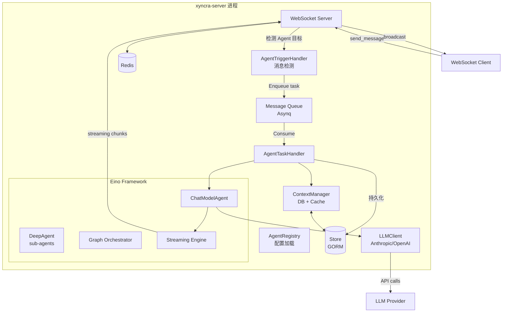
```mermaid
graph TB
    subgraph "xyncra-server 进程"
        WS[WebSocket Server]
        AR[AgentRegistry<br/>配置加载]
        ATH[AgentTriggerHandler<br/>消息检测]
        MQ[Message Queue<br/>Asynq]
        ATH2[AgentTaskHandler]
        
        subgraph "Eino Framework"
            CM[ChatModelAgent]
            DA[DeepAgent<br/>sub-agents]
            GO[Graph Orchestrator]
            SE[Streaming Engine]
        end
        
        CMGR[ContextManager<br/>DB + Cache]
        LC[LLMClient<br/>Anthropic/OpenAI]
        RD[(Redis)]
        ST[(Store<br/>GORM)]
    end
    
    Client[WebSocket Client] -->|send_message| WS
    WS -->|检测 Agent 目标| ATH
    ATH -->|Enqueue task| MQ
    MQ -->|Consume| ATH2
    ATH2 --> CMGR
    ATH2 --> CM
    CM --> SE
    SE -->|streaming chunks| WS
    ATH2 -->|持久化| ST
    WS -->|broadcast| Client
    CM --> LC
    LC -->|API calls| LLM[LLM Provider]
    WS <--> RD
    CMGR <--> ST
```

### 2.2 消息路由与触发

**触发条件**：当用户发送消息时，检查**对话对方的 UserID** 是否是 Agent。

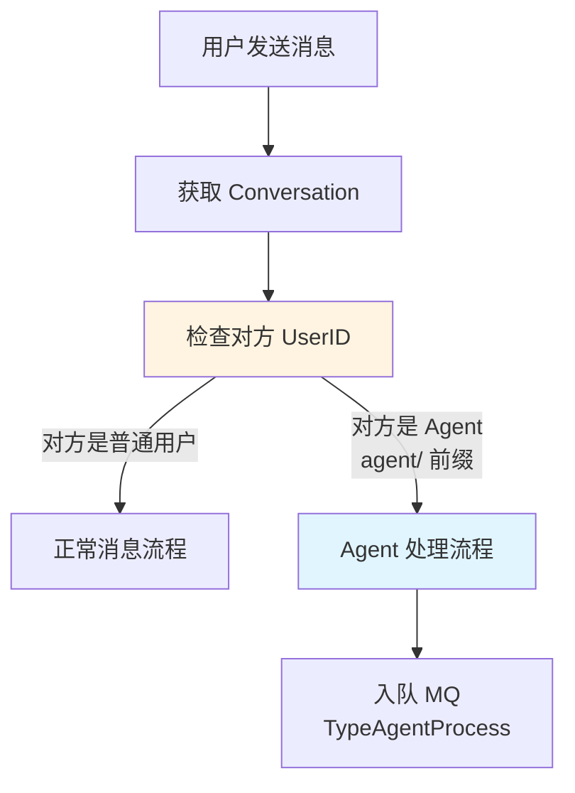
```mermaid
graph TB
    SendMsg[用户发送消息] --> GetConv[获取 Conversation]
    GetConv --> CheckPeer[检查对方 UserID]
    CheckPeer -->|对方是普通用户| NormalFlow[正常消息流程]
    CheckPeer -->|对方是 Agent<br/>agent/ 前缀| AgentFlow[Agent 处理流程]
    AgentFlow --> EnqueueMQ[入队 MQ<br/>TypeAgentProcess]
    
    style CheckPeer fill:#fff4e1
    style AgentFlow fill:#e1f5ff
```

**为什么检查对方 UserID？**

- Conversation 模型是 1-on-1 的，有 `UserID1` 和 `UserID2`
- 发送消息时，sender 是当前用户，receiver 是对话的另一方
- 如果 receiver 是 Agent（`agent/` 前缀），则触发 Agent 处理

### 2.3 分布式处理保障

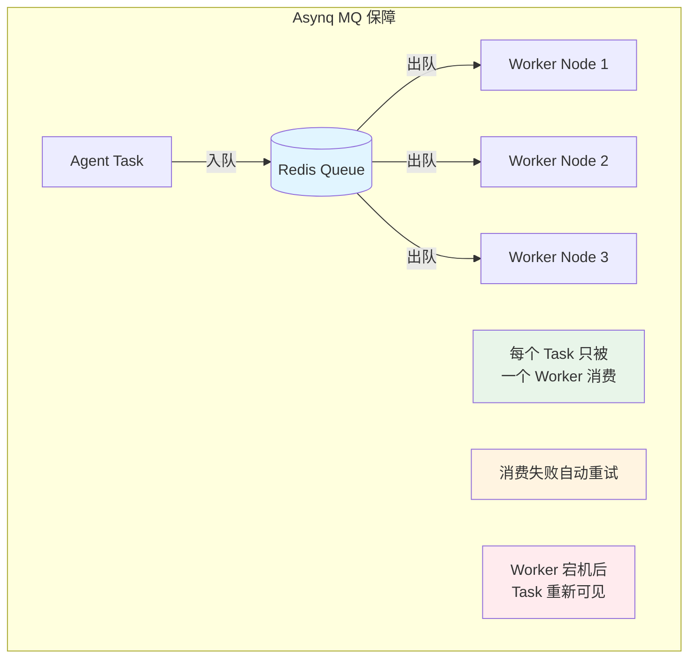
```mermaid
graph TB
    subgraph "Asynq MQ 保障"
        Task[Agent Task] -->|入队| Queue[(Redis Queue)]
        Queue -->|出队| Worker1[Worker Node 1]
        Queue -->|出队| Worker2[Worker Node 2]
        Queue -->|出队| Worker3[Worker Node 3]
        
        Note1[每个 Task 只被<br/>一个 Worker 消费]
        Note2[消费失败自动重试]
        Note3[Worker 宕机后<br/>Task 重新可见]
    end
    
    style Queue fill:#e1f5ff
    style Note1 fill:#e8f5e9
    style Note2 fill:#fff4e1
    style Note3 fill:#ffebee
```

#### 2.3.1 消费者唯一性

**问题**：分布式系统中，多个节点可能同时消费同一个 Task。

**解决方案**：Asynq MQ 保障 **Exactly-Once 语义**

- 每个 Task 出队时被 Redis 标记为 processing
- 其他 Worker 看不到该 Task，避免重复消费
- 消费完成后，Task 从队列中移除

#### 2.3.2 消费失败处理

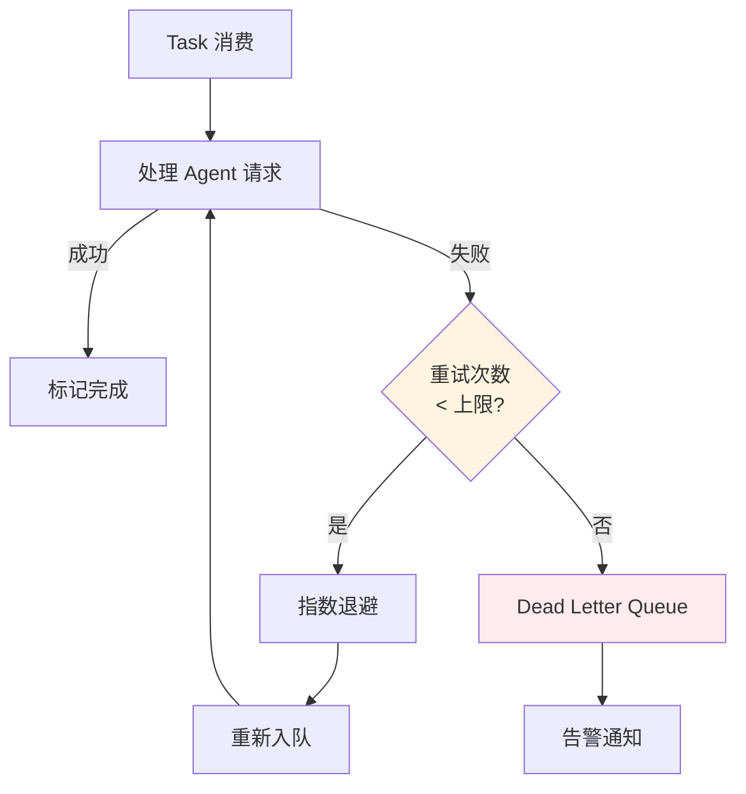
```mermaid
graph TB
    Start[Task 消费] --> Process[处理 Agent 请求]
    Process -->|成功| Complete[标记完成]
    Process -->|失败| CheckRetry{重试次数<br/>< 上限?}
    CheckRetry -->|是| Backoff[指数退避]
    Backoff --> Retry[重新入队]
    Retry --> Process
    CheckRetry -->|否| DeadLetter[Dead Letter Queue]
    DeadLetter --> Alert[告警通知]
    
    style CheckRetry fill:#fff4e1
    style DeadLetter fill:#ffebee
```

**失败场景与处理**：

| 失败类型 | 处理策略 | 重试配置 |
| -------- | -------- | -------- |
| LLM API 超时 | 自动重试 | MaxRetries=3, Backoff=1s/2s/4s |
| LLM API 限流 | 延迟重试 | Backoff=5s/10s/20s |
| 网络错误 | 自动重试 | MaxRetries=5 |
| 数据库错误 | 自动重试 | MaxRetries=3 |
| 业务逻辑错误 | 不重试，记录错误 | 进入 Dead Letter Queue |

#### 2.3.3 消费中重启

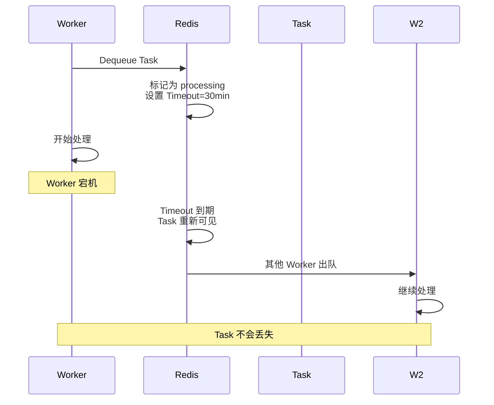
```mermaid
sequenceDiagram
    participant W as Worker
    participant R as Redis
    participant T as Task
    
    W->>R: Dequeue Task
    R->>R: 标记为 processing<br/>设置 Timeout=30min
    W->>W: 开始处理
    Note over W: Worker 宕机
    R->>R: Timeout 到期<br/>Task 重新可见
    R->>W2: 其他 Worker 出队
    W2->>W2: 继续处理
    
    Note over W,W2: Task 不会丢失
```

**问题**：Worker 在处理 Task 过程中宕机。

**解决方案**：

1. **Processing Timeout**：Asynq 为每个 processing Task 设置超时（如 30 分钟）
2. **自动恢复**：超时后，Task 重新变为可见，其他 Worker 可以消费
3. **幂等性保障**：Task 处理逻辑必须幂等，或支持断点续传

#### 2.3.4 幂等性设计

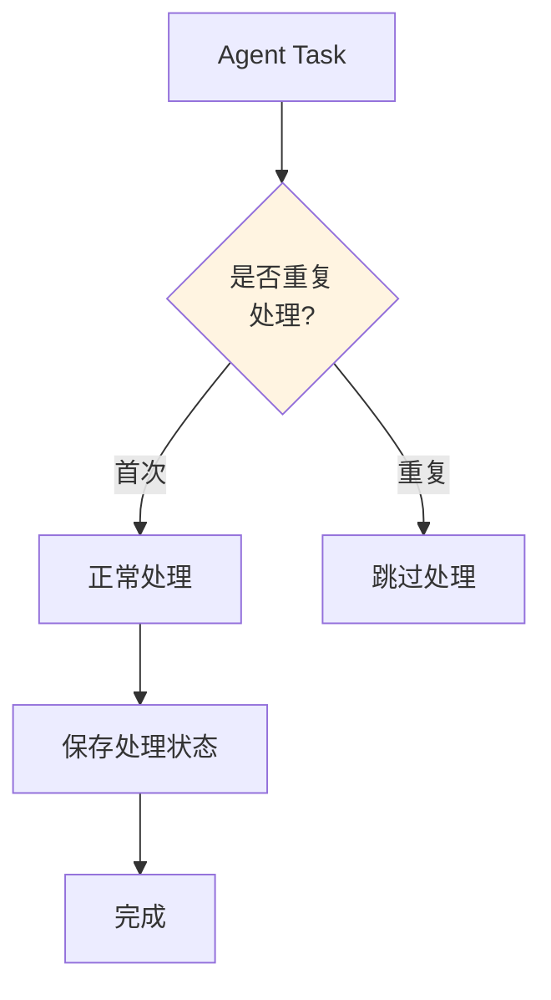
```mermaid
graph TB
    Task[Agent Task] --> CheckDup{是否重复<br/>处理?}
    CheckDup -->|首次| Process[正常处理]
    CheckDup -->|重复| Skip[跳过处理]
    Process --> SaveState[保存处理状态]
    SaveState --> Complete[完成]
    
    style CheckDup fill:#fff4e1
```

**幂等性保障**：

- Task Payload 包含唯一标识（MessageID + ConversationID）
- 处理前检查是否已处理（通过 DB 或 Redis）
- 已处理则跳过，未处理则执行

#### 2.3.5 断点续传（高级）

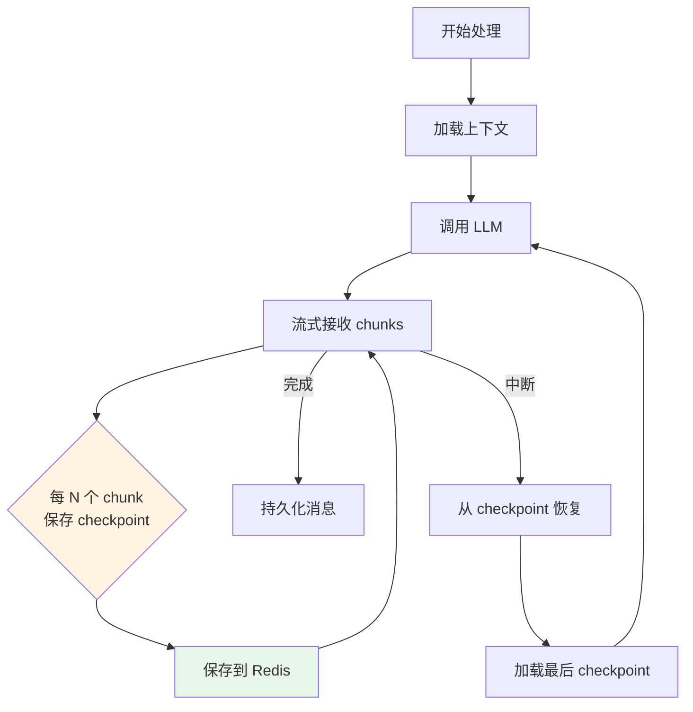
```mermaid
graph TB
    Start[开始处理] --> LoadContext[加载上下文]
    LoadContext --> CallLLM[调用 LLM]
    CallLLM --> StreamChunks[流式接收 chunks]
    StreamChunks --> Checkpoint{每 N 个 chunk<br/>保存 checkpoint}
    Checkpoint --> Save[保存到 Redis]
    Save --> StreamChunks
    StreamChunks -->|完成| Finalize[持久化消息]
    
    StreamChunks -->|中断| Resume[从 checkpoint 恢复]
    Resume --> LoadLast[加载最后 checkpoint]
    LoadLast --> CallLLM
    
    style Checkpoint fill:#fff4e1
    style Save fill:#e8f5e9
```

**适用场景**：长对话、多轮 tool 调用

**实现方式**：

- 每处理完一轮 LLM 调用或 tool 调用，保存 checkpoint
- Checkpoint 包含：已处理的消息、当前上下文、tool 调用结果
- 中断后从 checkpoint 恢复，避免重复处理

### 2.4 数据流

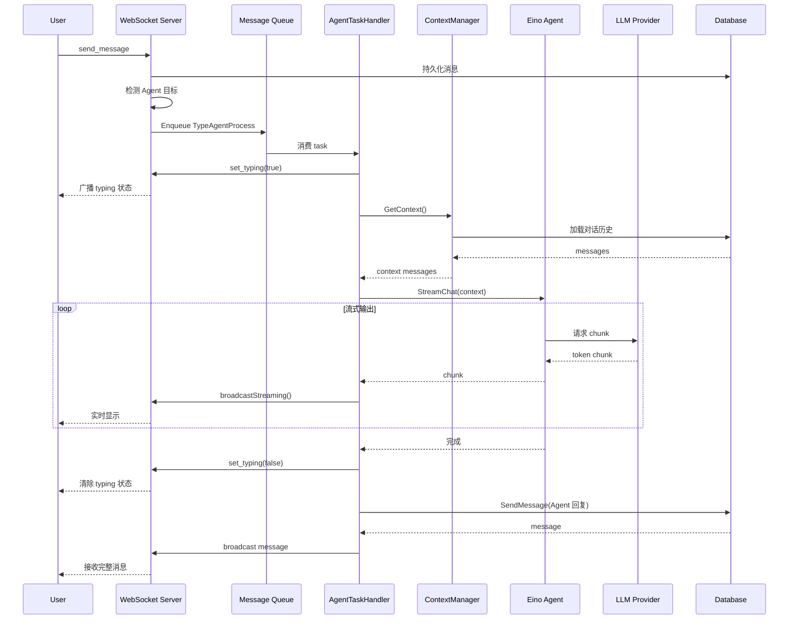
```mermaid
sequenceDiagram
    participant User
    participant WS as WebSocket Server
    participant MQ as Message Queue
    participant ATH as AgentTaskHandler
    participant CM as ContextManager
    participant Eino as Eino Agent
    participant LLM as LLM Provider
    participant Store as Database
    
    User->>WS: send_message
    WS->>Store: 持久化消息
    WS->>WS: 检测 Agent 目标
    WS->>MQ: Enqueue TypeAgentProcess
    
    MQ->>ATH: 消费 task
    ATH->>WS: set_typing(true)
    WS-->>User: 广播 typing 状态
    
    ATH->>CM: GetContext()
    CM->>Store: 加载对话历史
    Store-->>CM: messages
    CM-->>ATH: context messages
    
    ATH->>Eino: StreamChat(context)
    loop 流式输出
        Eino->>LLM: 请求 chunk
        LLM-->>Eino: token chunk
        Eino-->>ATH: chunk
        ATH->>WS: broadcastStreaming()
        WS-->>User: 实时显示
    end
    
    Eino-->>ATH: 完成
    ATH->>WS: set_typing(false)
    WS-->>User: 清除 typing 状态
    
    ATH->>Store: SendMessage(Agent 回复)
    Store-->>ATH: message
    ATH->>WS: broadcast message
    WS-->>User: 接收完整消息
```

### 2.3 关键组件

#### AgentRegistry
- 从 `agents/` 目录加载 YAML 配置
- 管理 Agent 配置的生命周期
- 提供 `IsAgent(userID string) bool` 查询

#### AgentTaskHandler
- MQ task handler，处理 `TypeAgentProcess` 任务
- 使用 Eino 框架调用 LLM
- 通过 `broadcastFn` 流式推送给客户端

#### ContextManager
- 从 `messages` 表读取对话历史
- `sync.Map` 缓存热路径
- Token 计数裁剪（`tiktoken-go`）+ 固定消息数 fallback
- per-conversation worker 串行处理

#### LLMClient (Eino 封装)
- 封装 Eino 的 ChatModel 接口
- 支持 Anthropic Claude 和 OpenAI
- 提供流式输出能力

### 2.5 并发消息处理策略

**场景**：用户发送消息 A，Agent 正在处理时，用户又发送了 B、C、D

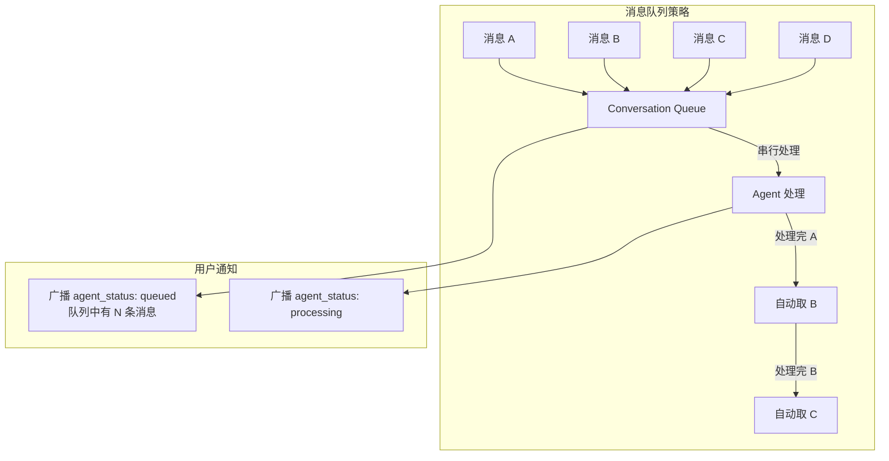
```mermaid
graph TB
    subgraph "消息队列策略"
        A[消息 A] --> Q1[Conversation Queue]
        B[消息 B] --> Q1
        C[消息 C] --> Q1
        D[消息 D] --> Q1
        
        Q1 -->|串行处理| Process[Agent 处理]
        Process -->|处理完 A| Next[自动取 B]
        Next -->|处理完 B| Next2[自动取 C]
    end
    
    subgraph "用户通知"
        Process --> Status1[广播 agent_status: processing]
        Q1 --> Status2[广播 agent_status: queued<br/>队列中有 N 条消息]
    end
```

**三种策略选择**：

| 策略       | 行为                                             | 优点                   | 缺点               | 适用场景           |
| ---------- | ------------------------------------------------ | ---------------------- | ------------------ | ------------------ |
| **串行队列** | B、C、D 排队等待 A 完成                          | 保证顺序，上下文一致   | 用户等待时间长     | 大多数场景（推荐） |
| **取消当前** | 取消 A 的处理，合并 A+B+C+D 重新处理             | 响应快，避免过时回复   | 浪费已处理的计算   | 用户明确取消       |
| **并行处理** | A、B、C、D 并行处理                              | 速度快                 | 上下文混乱，可能冲突 | 独立问题           |

**推荐**：默认使用**串行队列**，但提供 CLI 命令让用户可以取消当前处理。

### 2.6 Human-in-the-Loop（Ask User Question）

**场景**：Agent 处理过程中需要向用户提问，等待回答后继续

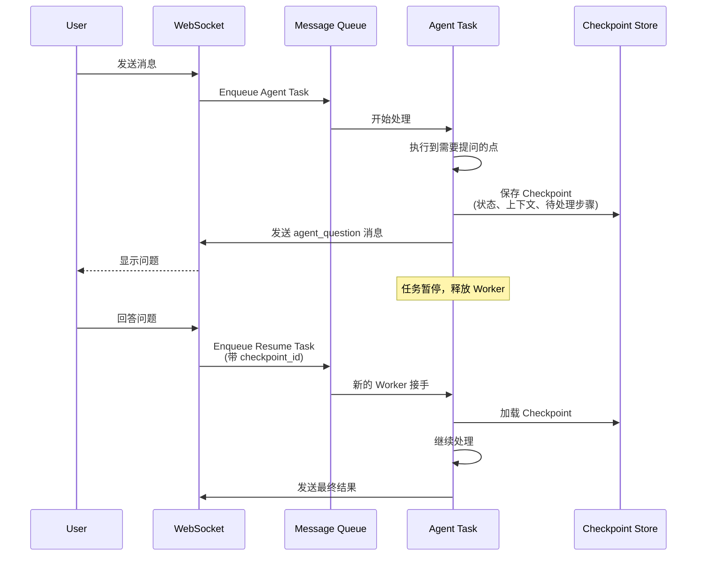
```mermaid
sequenceDiagram
    participant User
    participant WS as WebSocket
    participant MQ as Message Queue
    participant Agent as Agent Task
    participant CP as Checkpoint Store
    
    User->>WS: 发送消息
    WS->>MQ: Enqueue Agent Task
    MQ->>Agent: 开始处理
    
    Agent->>Agent: 执行到需要提问的点
    Agent->>CP: 保存 Checkpoint<br/>(状态、上下文、待处理步骤)
    Agent->>WS: 发送 agent_question 消息
    WS-->>User: 显示问题
    
    Note over Agent: 任务暂停，释放 Worker
    
    User->>WS: 回答问题
    WS->>MQ: Enqueue Resume Task<br/>(带 checkpoint_id)
    MQ->>Agent: 新的 Worker 接手
    Agent->>CP: 加载 Checkpoint
    Agent->>Agent: 继续处理
    
    Agent->>WS: 发送最终结果
```

**关键设计**：

1. **Checkpoint 存储**：

```text
Checkpoint {
  id: uuid
  conversation_id: string
  agent_id: string
  created_at: timestamp
  expires_at: timestamp (如 24 小时后过期)
  
  // Agent 状态
  context_messages: []Message
  current_step: string
  pending_tool_calls: []ToolCall
  
  // 等待的问题
  question: string
  question_context: any
  
  // 恢复信息
  resume_task_type: string
  resume_payload: any
}
```

1. **新增 Update 类型**：
   - `agent_question`: Agent 向用户提问
   - `agent_status`: 状态变更（thinking, tool_calling, asking_user, resumed）
   - `agent_checkpoint_created`: 通知客户端 checkpoint 已创建

1. **超时处理**：
   - Checkpoint 设置 TTL（如 24 小时）
   - 超时后自动取消，发送 `agent_timeout` 消息
   - 用户可以选择重新开始

### 2.7 上下文压缩机制

Eino 框架内置了两个核心的上下文压缩中间件：

#### 2.7.1 Summarization Middleware（摘要压缩）

**工作原理**：
- 基于 LLM 的智能摘要压缩
- 在 `BeforeModelRewriteState` 钩子中执行（每次调用 LLM 之前）
- 自动检查并压缩上下文

**触发条件**：
- Token 阈值：当对话总 token 数超过 `ContextTokens`（默认 160k）
- 消息数量：当消息总数超过 `ContextMessages`（如果配置）

**执行流程**：

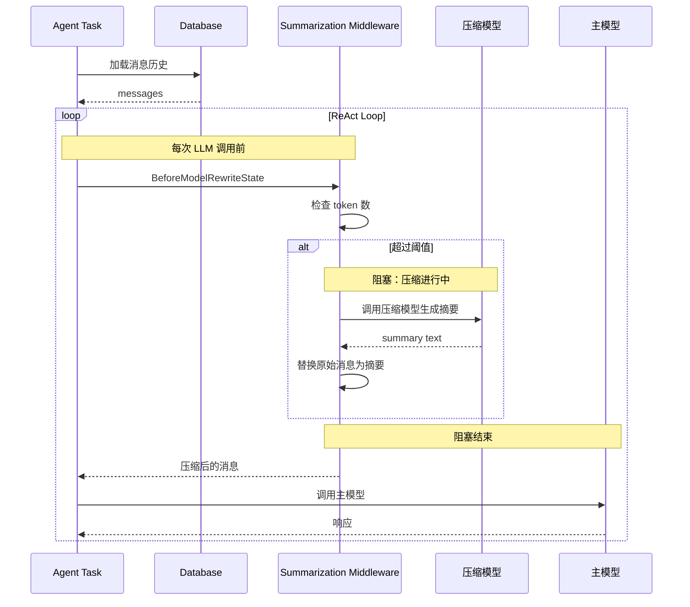
```mermaid
sequenceDiagram
    participant Task as Agent Task
    participant DB as Database
    participant MW as Summarization Middleware
    participant CompModel as 压缩模型
    participant MainModel as 主模型
    
    Task->>DB: 加载消息历史
    DB-->>Task: messages
    
    loop ReAct Loop
        Note over Task,MW: 每次 LLM 调用前
        Task->>MW: BeforeModelRewriteState
        MW->>MW: 检查 token 数
        
        alt 超过阈值
            Note over MW,CompModel: 阻塞：压缩进行中
            MW->>CompModel: 调用压缩模型生成摘要
            CompModel-->>MW: summary text
            MW->>MW: 替换原始消息为摘要
        end
        
        Note over MW,MainModel: 阻塞结束
        MW-->>Task: 压缩后的消息
        Task->>MainModel: 调用主模型
        MainModel-->>Task: 响应
    end
```

**关键理解**：

- 压缩发生在**每次 LLM 调用之前**，通过 `BeforeModelRewriteState` 中间件钩子
- 压缩是**同步阻塞**的：压缩完成前，任务处理被阻塞，不能继续调用主模型
- 不会阻塞消息队列（其他 Task 可以被其他 Worker 处理），但会延迟当前 Task 的响应时间
- 压缩延迟：1-10 秒（取决于上下文长度和压缩模型速度）

**关键配置**：

| 参数 | 默认值 | 说明 |
|------|--------|------|
| `ContextTokens` | 160000 | Token 阈值 |
| `PreserveUserMessages.Enabled` | true | 保留用户消息 |
| `PreserveUserMessages.MaxTokens` | 30000 | 保留的用户消息 token 上限 |
| `Retry.MaxRetries` | 3 | 最大重试次数 |

#### 2.7.2 ToolReduction Middleware（工具结果压缩）

**两阶段策略**：

**阶段 1：截断（Truncation）**
- 触发时机：工具执行完成后立即检查
- 触发条件：工具输出长度 > `MaxLengthForTrunc`（默认 50000 字符）
- 处理方式：
  - 保存完整内容到 Backend（文件系统）
  - 返回截断通知给 LLM（前 25000 + 后 25000 字符）
  - 告知文件路径，LLM 可通过 `read_file` 读取完整内容

**阶段 2：清理（Clear）**
- 触发时机：`BeforeModelRewriteState` 中
- 触发条件：总 token 数 > `MaxTokensForClear`（默认 160000）
- 处理方式：
  - 遍历历史消息中的工具调用
  - 将工具参数和结果替换为占位符
  - 保存到 Backend
  - 保留最近 N 轮工具调用（默认 1）

**性能影响**：
- 截断：~1-10ms（文件写入）
- 清理：~5-50ms（遍历消息 + 文件写入）
- **不阻塞消息队列**，仅延迟当前请求

#### 2.7.3 是否阻塞消息队列？

**结论**：**不阻塞消息队列，但会延迟当前请求**

- Summarization 在 Agent Task Worker 内部同步执行
- 压缩期间，Worker 被占用，无法处理其他 Task
- 但 MQ 队列本身不受影响，其他 Task 可以继续出队

**阻塞时间估算**：
- Summarization：1-10 秒（取决于上下文长度和模型速度）
- ToolReduction：< 50ms（可忽略）

#### 2.7.4 推荐配置

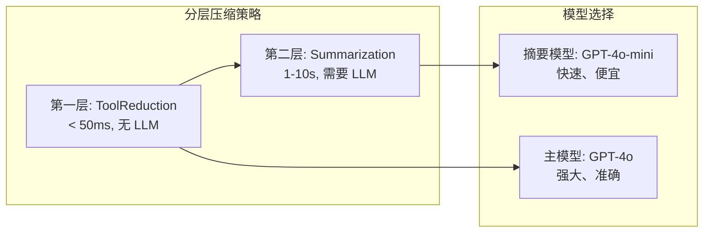
```mermaid
graph LR
    subgraph "分层压缩策略"
        L1[第一层: ToolReduction<br/>< 50ms, 无 LLM] --> L2[第二层: Summarization<br/>1-10s, 需要 LLM]
    end
    
    subgraph "模型选择"
        M1[摘要模型: GPT-4o-mini<br/>快速、便宜] 
        M2[主模型: GPT-4o<br/>强大、准确]
    end
    
    L2 --> M1
    L1 --> M2
```

**最佳实践**：

1. **阈值设置**：
   - Summarization: 设置为模型上下文窗口的 80%（如 128k 模型设为 100k）
   - ToolReduction: `MaxLengthForTrunc` 设为 50k-100k
   - ToolReduction: `MaxTokensForClear` 与 Summarization 阈值一致

2. **用户感知**：
   - 使用 `EmitInternalEvents` 检测压缩
   - 在 UI 中显示"正在优化上下文..."提示
   - 避免用户误以为系统卡住

3. **监控指标**：
   - 压缩触发频率
   - 压缩比例（压缩前/后 token 数）
   - 压缩延迟

### 2.8 工具结果截取与检索

当工具调用返回超长内容时，需要截取以避免超出上下文限制，同时提供检索完整内容的能力。

#### 2.8.1 截取策略

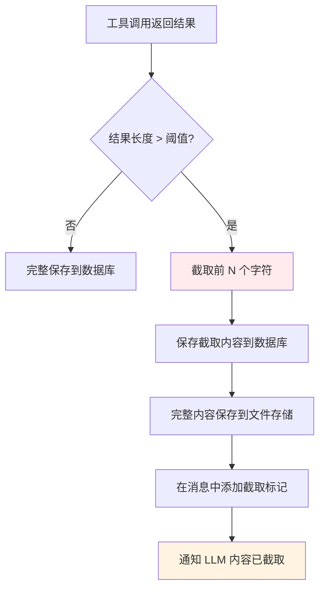
```mermaid
graph TB
    A[工具调用返回结果] --> B{结果长度 > 阈值?}
    B -->|否| C[完整保存到数据库]
    B -->|是| D[截取前 N 个字符]
    D --> E[保存截取内容到数据库]
    E --> F[完整内容保存到文件存储]
    F --> G[在消息中添加截取标记]
    G --> H[通知 LLM 内容已截取]
    
    style D fill:#ffebee
    style H fill:#fff4e1
```

**截取规则**：

- 阈值：50,000 字符（可配置）
- 截取长度：保留前 40,000 字符
- 存储位置：
  - 截取内容 → 数据库 `messages` 表
  - 完整内容 → 文件存储（本地/S3）

#### 2.8.2 消息格式

被截取的工具结果消息包含特殊标记：

```json
{
  "id": "msg_123",
  "conversation_id": "conv_456",
  "sender_id": "agent/weather-bot",
  "content": "工具返回的前 40,000 个字符...",
  "type": "tool_result",
  "metadata": {
    "tool_name": "search_web",
    "truncated": true,
    "original_length": 125000,
    "truncated_length": 40000,
    "full_content_path": "/tmp/xyncra/tool_results/msg_123_full.txt"
  },
  "created_at": "2026-07-10T10:30:00Z"
}
```

#### 2.8.3 检索工具

提供 `retrieve_tool_result` 工具供 LLM 调用：

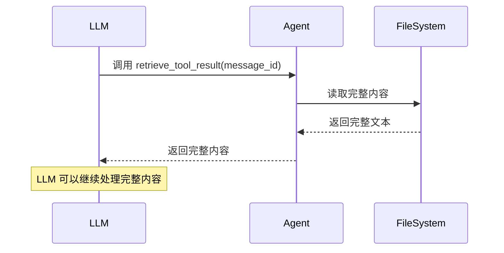
```mermaid
sequenceDiagram
    participant LLM
    participant Agent
    participant FileSystem
    
    LLM->>Agent: 调用 retrieve_tool_result(message_id)
    Agent->>FileSystem: 读取完整内容
    FileSystem-->>Agent: 返回完整文本
    Agent-->>LLM: 返回完整内容
    Note over LLM: LLM 可以继续处理完整内容
```

**工具定义**：

```yaml
name: retrieve_tool_result
description: 检索被截取的完整工具结果。当工具结果被截取时，消息中会包含截取标记和 message_id，调用此工具可获取完整内容。
parameters:
  message_id:
    type: string
    description: 被截取的消息 ID
```

#### 2.8.4 上下文加载策略

加载上下文时，根据消息类型决定是否加载完整内容：

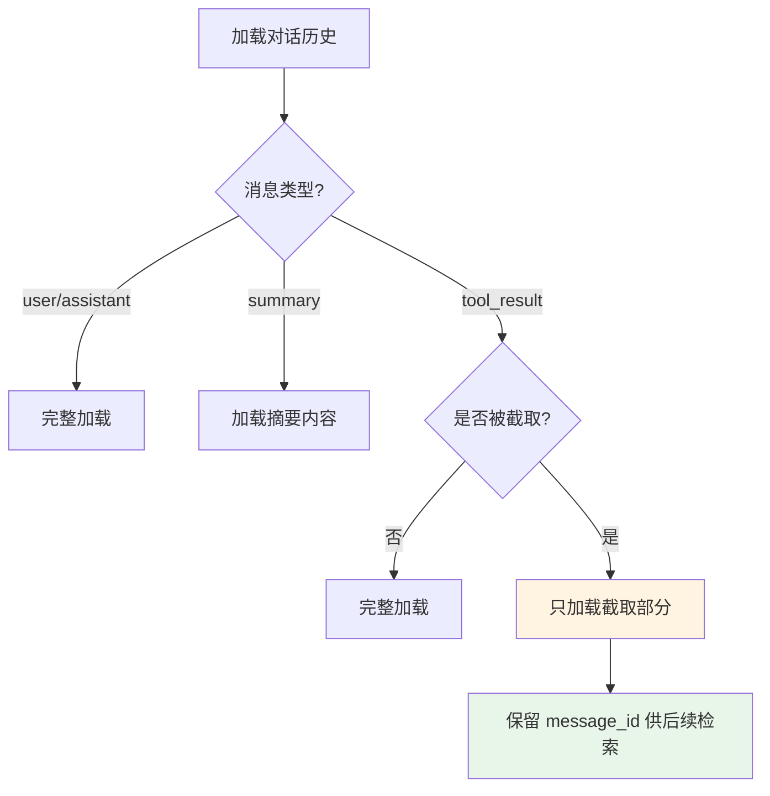
```mermaid
graph TB
    A[加载对话历史] --> B{消息类型?}
    B -->|user/assistant| C[完整加载]
    B -->|summary| D[加载摘要内容]
    B -->|tool_result| E{是否被截取?}
    E -->|否| F[完整加载]
    E -->|是| G[只加载截取部分]
    G --> H[保留 message_id 供后续检索]
    
    style G fill:#fff4e1
    style H fill:#e8f5e9
```

**关键点**：

- 被截取的工具结果只加载截取部分到上下文
- 保留 `message_id` 供 LLM 需要时检索完整内容
- 避免一次性加载大量内容导致上下文溢出

### 2.9 新增 Update 类型

为了支持上述场景，需要新增以下 Update 类型：

| Update Type | Seq | 用途 | Payload 示例 |
| ----------- | --- | ---- | ------------ |
| `agent_status` | 0 | Agent 状态变更 | `{status: "thinking", conversation_id: "..."}` |
| `agent_question` | 0 | Agent 向用户提问 | `{question: "请确认...", checkpoint_id: "..."}` |
| `agent_checkpoint_created` | 0 | Checkpoint 创建通知 | `{checkpoint_id: "...", expires_at: "..."}` |
| `agent_timeout` | 0 | Agent 处理超时 | `{conversation_id: "...", reason: "checkpoint_expired"}` |

**注意**：所有 Agent 相关的 Update 都是 ephemeral（Seq=0），不持久化。

---

## 3. Eino 框架集成

> **知识来源**：本节内容基于 `.claude/skills/eino-guide/`、`.claude/skills/eino-agent/`、`.claude/skills/eino-component/`、`.claude/skills/eino-compose/` 四个官方 skill 的深度调研。

### 3.1 Eino 核心概念

Eino 提供以下核心能力：

- **ChatModelAgent**：带 tool use 的 agent
- **DeepAgent**：任务分解、sub-agent 委派
- **Graph Orchestration**：图编排（节点、边、编译、执行）
- **Streaming**：全链路流式处理
- **Tools**：自定义 tools + GraphTool
- **Sessions**：持久对话支持
- **Interrupt/Resume**：Human-in-the-loop

> 📚 **来源**：`.claude/skills/eino-guide/SKILL.md` 第 12-25 行

### 3.2 Agent 类型选择

#### ChatModelAgent（推荐用于大多数场景）

**核心特性**：
- ReAct 模式：LLM 推理 → 工具调用 → 观察结果 → 循环
- 支持最多 20 次迭代（可配置 `MaxIterations`）
- 流式输出通过 Runner 的 `EnableStreaming: true` 开启
- 当没有配置 Tools 时，退化为单次 ChatModel 调用

**关键配置**：

```go
type ChatModelAgentConfig struct {
    Name             string                    // Agent 名称，全局唯一
    Description      string                    // 能力描述
    Instruction      string                    // System prompt，支持 f-string 占位符
    Model            model.BaseModel[M]        // LLM 模型（必须支持 tool calling）
    ToolsConfig      ToolsConfig               // 工具配置
    MaxIterations    int                       // 最大 ReAct 迭代次数，默认 20
    ModelRetryConfig *ModelRetryConfig         // 模型重试配置
    ModelFailoverConfig *ModelFailoverConfig[M] // 模型故障转移配置
    Handlers         []ChatModelAgentMiddleware // Middleware 列表
}
```

**使用场景**：
- 单 Agent + Tools 的标准场景
- 需要精细控制工具和 prompt 的场景
- 简单的单轮/多轮对话

> 📚 **来源**：`.claude/skills/eino-agent/reference/chat-model-agent.md`

#### DeepAgent（需要规划和文件系统时使用）

**核心特性**：
- 内置任务规划（WriteTodos 工具）
- 内置文件系统操作（read_file, write_file, edit_file, glob, grep）
- 内置 Shell 命令执行（execute 工具）
- 子 Agent 委派（通过 TaskTool）
- 自动摘要压缩

**与 ChatModelAgent 的区别**：

| 特性 | DeepAgent | ChatModelAgent |
|------|-----------|----------------|
| 规划能力 | 内置 WriteTodos | 需手动实现 |
| 上下文隔离 | 子 Agent 独立上下文 | 无隔离（共享历史） |
| Token 成本 | 较高（规划开销） | 较低 |
| 模型要求 | 更高（需擅长规划） | 较低 |
| 文件系统 | 开箱即用 | 需手动配置 Middleware |
| 自定义控制 | 中等 | 完全控制 |

**使用场景**：
- 需要任务分解和规划的复杂任务
- 需要文件读写和 Shell 操作的场景
- 需要上下文隔离子 Agent 的委派任务

> 📚 **来源**：`.claude/skills/eino-agent/reference/deep-agents.md`

### 3.3 Runner 执行引擎

**核心作用**：
- 管理 Agent 生命周期
- 上下文传递
- 多 Agent 协调
- Interrupt/Resume 机制

**关键配置**：

```go
runner := adk.NewRunner(ctx, adk.RunnerConfig{
    Agent:           myAgent,
    EnableStreaming:  true,                // 建议流式输出
    CheckPointStore: myCheckPointStore,    // Interrupt/Resume 必需
})
```

**执行方式**：

```go
// 便捷方式：单条用户消息
iter := runner.Query(ctx, "What is the weather?")

// 完全控制：多条消息 + 选项
iter := runner.Run(ctx, []*schema.Message{
    schema.UserMessage("Hello"),
    schema.AssistantMessage("Hi!", nil),
    schema.UserMessage("What's the weather?"),
}, adk.WithSessionValues(map[string]any{"user": "Alice"}))
```

**事件流处理**：

Runner 返回 `AsyncIterator[*AgentEvent]`，每个事件包含：

| 字段 | 类型 | 说明 |
|------|------|------|
| `AgentName` | string | 产生事件的 Agent 名称 |
| `Output` | *AgentOutput | 消息输出 |
| `Action` | *AgentAction | 控制动作（Exit / Interrupted / BreakLoop） |
| `Err` | error | 错误（含 CancelError / RetryExhaustedError） |

**Cancel 机制**：

```go
cancelOpt, cancelFn := adk.WithCancel()
iter := runner.Query(ctx, "do work", cancelOpt)

// 安全取消
handle, ok := cancelFn(
    adk.WithAgentCancelMode(adk.CancelAfterChatModel),
    adk.WithAgentCancelTimeout(5*time.Second),
    adk.WithRecursive(),
)
if ok { handle.Wait() }
```

**Xyncra 集成建议**：
- 始终通过 Runner 执行 Agent，不直接调用 `agent.Run()`
- 启用流式输出（`EnableStreaming: true`）以提供实时反馈
- 使用 `SessionValues` 传递 Xyncra 的运行时上下文（用户信息、session 信息等）
- 生产环境 CheckPointStore 使用 Redis，开发环境可用 InMemoryStore

> 📚 **来源**：`.claude/skills/eino-agent/reference/runner-and-events.md`

### 3.4 Middleware 系统

**核心作用**：通过钩子扩展 ChatModelAgent 的行为，实现日志、状态修改、工具增强、上下文压缩等功能。

**接口定义**：

```go
type TypedChatModelAgentMiddleware[M MessageType] interface {
    BeforeAgent(ctx, runCtx)                          // Agent.Run 开始前
    AfterAgent(ctx, state)                            // Agent.Run 结束后
    BeforeModelRewriteState(ctx, state, mc)           // 模型调用前修改消息
    AfterModelRewriteState(ctx, state, mc)            // 模型响应后修改消息
    WrapInvokableToolCall(ctx, endpoint, tCtx)        // 包装非流式工具调用
    WrapStreamableToolCall(ctx, endpoint, tCtx)       // 包装流式工具调用
    WrapEnhancedInvokableToolCall(ctx, endpoint, tCtx)  // 包装增强非流式工具
    WrapEnhancedStreamableToolCall(ctx, endpoint, tCtx) // 包装增强流式工具
    WrapModel(ctx, model, mc)                         // 包装模型
}
```

**执行流程**：

```
Agent.Run(input)
  -> BeforeAgent（执行一次）
  -> [ReAct 循环]
       -> BeforeModelRewriteState（修改发送给模型的消息）
       -> WrapModel（包装模型）
       -> Model.Generate/Stream
       -> AfterModelRewriteState（修改模型响应后的消息）
       -> 如有工具调用：
            -> WrapInvokableToolCall / WrapStreamableToolCall
            -> Tool.Run()
            -> 结果加入消息
       -> 继续循环
  -> AfterAgent（执行一次）
  -> Agent.Run() 结束
```

**八种内置 Middleware**：

| Middleware | 包路径 | 功能 |
|-----------|---------|------|
| FileSystem | `adk/middlewares/filesystem` | 文件系统操作和 Shell 执行 |
| ToolSearch | `adk/middlewares/dynamictool/toolsearch` | 动态工具选择 |
| ToolReduction | `adk/middlewares/reduction` | 工具结果截断和清理 |
| Summarization | `adk/middlewares/summarization` | 对话历史压缩 |
| PlanTask | `adk/middlewares/plantask` | 任务管理 |
| Skill | `adk/middlewares/skill` | 技能渐进式披露 |
| PatchToolCalls | `adk/middlewares/patchtoolcalls` | 修复悬挂工具调用 |
| Agents.md | `adk/middlewares/agentsmd` | 注入参考文档 |

**推荐 Middleware 顺序**：

```go
Handlers: []adk.ChatModelAgentMiddleware{
    patchToolCallsMW,    // 1. 先修复消息历史
    agentsMdMW,          // 2. 注入参考文档
    summarizationMW,     // 3. 压缩历史
    reductionMW,         // 4. 处理大型工具结果
    filesystemMW,        // 5. 添加文件工具
    skillMW,             // 6. 添加技能发现
    planTaskMW,          // 7. 添加任务管理
}
```

**Xyncra 推荐配置**：

```go
Handlers: []adk.ChatModelAgentMiddleware{
    patchToolCallsMW,    // 消息历史修复（特别是 HITL 场景）
    summarizationMW,     // 长对话压缩（Xyncra 可能需要长时间对话）
    reductionMW,         // 工具结果裁剪（控制 token 成本）
}
```

> 📚 **来源**：`.claude/skills/eino-agent/reference/middleware.md`

### 3.5 Human-in-the-Loop（HITL）

**核心机制**：
1. **Interrupt**: Agent 暂停并将信息发送给用户
2. **Checkpoint**: 框架将执行状态保存到 CheckPointStore
3. **Resume**: 用户提供输入后，框架恢复状态并继续执行

**Interrupt API**：

| API | 用途 |
|-----|------|
| `adk.Interrupt(ctx, info)` | 简单中断，发送信息给用户 |
| `adk.StatefulInterrupt(ctx, info, state)` | 带状态中断，保存自定义状态 |
| `adk.CompositeInterrupt(ctx, info, parentState, subSignals...)` | 复合中断（多 Agent 场景） |

**完整的 Approval 模式**：

**Step 1**: 创建可中断的工具

```go
bookTool, _ := utils.InferTool("BookTicket", "Book a ticket",
    func(ctx context.Context, input *bookInput) (string, error) {
        // 检查是否是 resume
        if isResume, hasData, data := compose.GetResumeContext[bool](ctx); isResume && hasData {
            if data { return "Booked!", nil }
            return "Rejected", nil
        }
        // 首次运行：中断等待批准
        return "", compose.Interrupt(ctx, "Approve booking?")
    })
```

**Step 2**: 配置 Runner 带 CheckPointStore

```go
runner := adk.NewRunner(ctx, adk.RunnerConfig{
    Agent:           agent,
    CheckPointStore: store.NewInMemoryStore(),  // 生产环境用 Redis
})
```

**Step 3**: 运行并处理中断

```go
iter := runner.Query(ctx, "Book a ticket to Beijing", adk.WithCheckPointID("session-1"))
// 遍历事件直到 event.Action.Interrupted != nil
// 记录 interruptID
```

**Step 4**: 使用 ResumeWithParams 恢复

```go
iter, err := runner.ResumeWithParams(ctx, "session-1", &adk.ResumeParams{
    Targets: map[string]any{
        interruptID: true,  // 用户批准
    },
})
```

**CheckPointStore 接口**：

```go
type CheckPointStore interface {
    Set(ctx context.Context, key string, value []byte) error
    Get(ctx context.Context, key string) ([]byte, bool, error)
}
```

**Xyncra 集成建议**：
- 对危险操作（如消息删除、系统配置修改）使用 **Approval 模式**
- 对不明确的请求使用 **Follow-up 模式**（Agent 追问澄清）
- 生产环境 CheckPointStore 使用 **Redis**，开发环境可用 InMemoryStore
- 配合 Xyncra 的 WebSocket 推送机制，将 Interrupt 信息实时推送给客户端

> 📚 **来源**：`.claude/skills/eino-agent/reference/human-in-the-loop.md`

### 3.6 ChatModel 组件集成

**支持的 LLM Provider**：

| Provider | 包路径 | 特殊能力 |
|----------|---------|---------|
| **OpenAI** | `model/openai` | Azure 支持，Request/Response Modifier |
| **Claude** | `model/claude` | AWS Bedrock，Google Vertex AI，Prompt Caching，Extended Thinking |
| **Gemini** | `model/gemini` | Thinking 支持 |
| **Ark (Volcengine)** | `model/ark` | 豆包模型 |
| **Ollama** | `model/ollama` | 本地模型，仅需 BaseURL + Model |
| **DeepSeek** | `model/deepseek` | Reasoning 支持 |
| **Qwen (DashScope)** | `model/qwen` | 阿里云通义千问 |

**OpenAI 配置示例**：

```go
chatModel, err := openai.NewChatModel(ctx, &openai.ChatModelConfig{
    APIKey:  "your-key",
    Model:   "gpt-4o",
    BaseURL: "",               // 可选，自定义 endpoint
    Temperature: func() *float32 { t := float32(0.7); return &t }(),
    MaxCompletionTokens: func() *int { t := 4096; return &t }(),
})
```

**Claude 配置示例**：

```go
chatModel, err := claude.NewChatModel(ctx, &claude.Config{
    APIKey:    "your-key",
    Model:     "claude-sonnet-4-20250514",
    MaxTokens: 3000,
})
```

**Claude 特殊能力**：

**Prompt Caching**（推荐开启）：

```go
resp, err := chatModel.Generate(ctx, messages, claude.WithEnableAutoCache(true))
```

**Extended Thinking**：

```go
resp, err := chatModel.Generate(ctx, messages, claude.WithThinking(&claude.Thinking{
    Enable: true, BudgetTokens: 1024,
}))
thinking, ok := claude.GetThinking(resp)
```

**流式输出**：

```go
reader, err := chatModel.Stream(ctx, messages)
defer reader.Close()
for {
    chunk, err := reader.Recv()
    if errors.Is(err, io.EOF) { break }
    if err != nil { return err }
    fmt.Print(chunk.Content)
}
```

**Tool Calling**：

```go
withTools, err := chatModel.WithTools([]*schema.ToolInfo{toolInfo})
resp, err := withTools.Generate(ctx, messages)
for _, tc := range resp.ToolCalls {
    fmt.Printf("Tool: %s, Args: %s\n", tc.Function.Name, tc.Function.Arguments)
}
```

**Xyncra 集成建议**：
- 内部部署（无 auth）场景，Ollama 是最简单选择（仅需 BaseURL + Model）
- 需要高质量推理：Claude + Extended Thinking 或 DeepSeek Reasoner
- 多 Provider 路由：OpenRouter 统一接入
- Xyncra 的无 auth 设计匹配 Ollama 本地部署模式

> 📚 **来源**：`.claude/skills/eino-component/reference/model/overview.md`, `model/openai.md`, `model/claude.md`

### 3.7 Tool 系统集成

**Tool 接口层级**：

```go
// 基础接口 - 仅获取工具元信息
type BaseTool interface {
    Info(ctx context.Context) (*schema.ToolInfo, error)
}

// 同步调用 - 输入 JSON 字符串，输出字符串
type InvokableTool interface {
    BaseTool
    InvokableRun(ctx context.Context, argumentsInJSON string, opts ...Option) (string, error)
}

// 流式调用 - 输出为 StreamReader
type StreamableTool interface {
    BaseTool
    StreamableRun(ctx context.Context, argumentsInJSON string, opts ...Option) (*schema.StreamReader[string], error)
}

// 增强同步调用 - 支持多模态输入/输出
type EnhancedInvokableTool interface {
    BaseTool
    InvokableRun(ctx context.Context, toolArgument *schema.ToolArgument, opts ...Option) (*schema.ToolResult, error)
}
```

**创建自定义 Tool（推荐方式）**：

```go
type WeatherInput struct {
    City string `json:"city" jsonschema:"required" jsonschema_description:"City name"`
    Unit string `json:"unit" jsonschema:"enum=celsius|fahrenheit" jsonschema_description:"Temperature unit"`
}

weatherTool, _ := utils.InferTool(
    "get_weather",
    "Get current weather for a city",
    func(ctx context.Context, input *WeatherInput) (string, error) {
        return fmt.Sprintf("Weather in %s: 22 %s", input.City, input.Unit), nil
    },
)
```

**内置 Tool 实现**：

| Tool | 包路径 | 说明 |
|------|--------|------|
| **MCP** | `tool/mcp` | 将 MCP Server 工具转为 Eino Tool |
| **Google Search** | `tool/googlesearch` | Google Custom Search JSON API |
| **DuckDuckGo** | `tool/duckduckgo/v2` | 免费 Web 搜索 |
| **Bing Search** | `tool/bingsearch` | Bing Web Search API |
| **HTTP Request** | `tool/httprequest` | 通用 HTTP 请求 |
| **Command Line** | `tool/commandline` | Shell 命令执行 |
| **Browser Use** | `tool/browseruse` | 浏览器自动化 |

**与 ChatModel 配合使用**：

```go
// 1. 收集 tool infos
var toolInfos []*schema.ToolInfo
for _, t := range tools { info, _ := t.Info(ctx); toolInfos = append(toolInfos, info) }

// 2. 绑定到模型
modelWithTools, _ := chatModel.WithTools(toolInfos)

// 3. 生成（模型可能产生 tool calls）
resp, _ := modelWithTools.Generate(ctx, messages)

// 4. 执行工具并追加结果到消息历史
for _, tc := range resp.ToolCalls {
    result, _ := matchingTool.InvokableRun(ctx, tc.Function.Arguments)
    messages = append(messages, resp)
    messages = append(messages, &schema.Message{
        Role: schema.Tool, Content: result, ToolCallID: tc.ID,
    })
}
resp, _ = modelWithTools.Generate(ctx, messages) // 最终回答
```

**Xyncra 集成建议**：
- Xyncra 的消息推送（`stream_text`、`set_typing`）可封装为自定义 `InvokableTool`
- 使用 `utils.InferTool` 从 struct tag 自动推断 schema，降低维护成本
- MCP 协议可对接外部工具生态

> 📚 **来源**：`.claude/skills/eino-component/reference/tool/overview.md`, `tool/mcp.md`

### 3.8 Callback 系统

**Handler 接口**：

```go
type Handler interface {
    OnStart(ctx context.Context, info *RunInfo, input CallbackInput) context.Context
    OnEnd(ctx context.Context, info *RunInfo, output CallbackOutput) context.Context
    OnError(ctx context.Context, info *RunInfo, err error) context.Context
    OnStartWithStreamInput(ctx context.Context, info *RunInfo, input *schema.StreamReader[CallbackInput]) context.Context
    OnEndWithStreamOutput(ctx context.Context, info *RunInfo, output *schema.StreamReader[CallbackOutput]) context.Context
}
```

**Callback 作用域**：
- **Components 层** -- 直接调用 ChatModel、Embedder、Retriever 等
- **Compose 编排层** -- Graph、Chain、Workflow 节点自动追踪
- **ADK Agent 层** -- ChatModelAgent、DeepAgent 的工具调用、多轮循环、子 Agent 全部被追踪

**一次全局注册，全层级生效**。

**注册方式**：

```go
// 全局注册 -- 覆盖所有组件、Compose 图和 ADK Agent
callbacks.AppendGlobalHandlers(handler1, handler2)

// 单次请求注册 -- 通过 context 传递
ctx = callbacks.CtxWithHandlers(ctx, handler)
```

**内置 Callback Handler**：

| Handler | 包路径 | 功能 |
|---------|--------|------|
| **Langfuse** | `callbacks/langfuse` | 开源 LLM 可观测性平台 |
| **LangSmith** | `callbacks/langsmith` | LangChain 的追踪和评估平台 |
| **CozeLoop** | `callbacks/cozeloop` | Coze 平台的可观测性 |
| **APMPlus** | `callbacks/apmplus` | 字节跳动 APM，追踪+指标+Token 用量 |

**Langfuse 配置示例**：

```go
cbh, flusher := langfuse.NewLangfuseHandler(&langfuse.Config{
    Host:             "https://cloud.langfuse.com",
    PublicKey:        "pk-lf-...",
    SecretKey:        "sk-lf-...",
    Threads:          1,
    Timeout:          0,
    MaxTaskQueueSize: 100,
    FlushAt:          15,
    FlushInterval:    500 * time.Millisecond,
    SampleRate:       1.0,
    MaxRetry:         3,
})
callbacks.AppendGlobalHandlers(cbh)
defer flusher()
```

**Xyncra 集成建议**：
- 推荐使用 Langfuse（开源、自部署）或 APMPlus 实现 Agent 全链路追踪
- 全局注册 `callbacks.AppendGlobalHandlers(handler)` 一次即可覆盖所有层
- 独立组件调用需显式 `callbacks.InitCallbacks`

> 📚 **来源**：`.claude/skills/eino-component/reference/callback/overview.md`, `callback/langfuse.md`

### 3.9 编排系统（Graph/Chain/Workflow）

> **注意**：Xyncra Agent 系统当前**不需要复杂的 Eino 编排**。Agent 任务主要是单 Agent + Tools 的场景，使用 ChatModelAgent + Runner 即可满足需求。Graph/Chain/Workflow 仅在需要复杂多步骤工作流时使用。

#### Graph vs Chain vs Workflow 选择指南

| 决策维度 | 选择 | 理由 |
|---------|------|------|
| 需要循环（ReAct agent） | **Graph** | 唯一支持 Pregel 循环 |
| 简单线性管道（prompt->model->parse） | **Chain** | 最简洁的 API，无需管理边 |
| 节点类型不同，需要字段映射 | **Workflow** | 字段级映射，无需胶水 Lambda |
| 需要条件分支但无循环 | **Graph** 或 **Chain** | Chain 的分支也能满足 |
| 需要 fan-out/fan-in | **Graph** 或 **Workflow** | Graph 用多前驱边，Workflow 用 AddInput |

**默认推荐**：大多数场景使用 **Graph**。它是功能最全的原语，Chain 和 Workflow 能做的 Graph 都能做。

#### Runnable 抽象

`Runnable[I, O]` 是 Graph、Chain、Workflow 编译后的统一运行时接口，提供四种执行模式：

| 模式 | 输入 | 输出 | Lambda 构造器 |
|------|------|------|--------------|
| Invoke | `I` | `O` | `compose.InvokableLambda` |
| Stream | `I` | `*StreamReader[O]` | `compose.StreamableLambda` |
| Collect | `*StreamReader[I]` | `O` | `compose.CollectableLambda` |
| Transform | `*StreamReader[I]` | `*StreamReader[O]` | `compose.TransformableLambda` |

#### Checkpoint 和状态持久化

```go
type CheckpointStore interface {
    Get(ctx context.Context, key string) (value []byte, existed bool, err error)
    Set(ctx context.Context, key string, value []byte) (err error)
}
```

**启用 Checkpoint**：

```go
r, err := g.Compile(ctx,
    compose.WithCheckPointStore(store),
    compose.WithInterruptBeforeNodes([]string{"human_review"}),
    compose.WithInterruptAfterNodes([]string{"data_fetch"}),
)
```

**Xyncra 集成建议**：
- 如果未来需要复杂编排，优先使用 **Graph**（Pregel 模式）
- CheckpointStore 可用 Redis 实现（项目已有 Redis 基础设施）
- 当前 Phase 1 不需要编排，直接使用 ChatModelAgent + Runner

> 📚 **来源**：`.claude/skills/eino-compose/reference/graph.md`, `chain.md`, `workflow.md`, `checkpoint-and-state.md`

### 3.10 上下文压缩中间件（详细）

#### Summarization Middleware 详细配置

```go
mw, err := summarization.New(ctx, &summarization.Config{
    // 必填：用于生成摘要的 ChatModel
    Model: summarizationModel,

    // 触发条件（满足任一即触发）
    Trigger: &summarization.TriggerCondition{
        ContextTokens:   160000,  // 默认 160000 tokens
        ContextMessages: 0,       // 默认 0（不启用消息数触发）
    },

    // 可选：完整对话记录保存路径
    TranscriptFilePath: "/path/to/transcript.txt",

    // 可选：保留最近用户消息
    PreserveUserMessages: &summarization.PreserveUserMessages{
        Enabled:   true,    // 默认 true
        MaxTokens: 30000,   // 默认 TriggerCondition.ContextTokens / 3
    },

    // 可选：重试配置
    Retry: &summarization.RetryConfig{
        MaxRetries: ptrOf(2),
    },

    // 可选：Failover 配置
    Failover: &summarization.FailoverConfig{
        MaxRetries: ptrOf(3),
        GetFailoverModel: func(ctx, fctx) (model, messages, error) { ... },
    },
})
```

**Token 计数策略**：
- 默认使用 `len(content)/4` 的启发式估算
- 生产环境建议使用 `tiktoken-go` 精确计数

**性能影响**：
- 额外 LLM 调用：每次触发摘要增加 1-5 秒延迟
- Token 消耗：摘要调用本身消耗 token，但减少后续所有调用的输入 token
- Transcript 写入：< 10ms

#### ToolReduction Middleware 详细配置

```go
mw, err := reduction.New(ctx, &reduction.Config{
    // 必填：存储后端
    Backend: filesystemBackend,

    // Truncation 配置
    MaxLengthForTrunc: 50000,     // 默认 50000 字符
    SkipTruncation:    false,

    // Clear 配置
    MaxTokensForClear:           160000,  // 默认 160000 tokens
    ClearRetentionSuffixLimit:   2,       // 保留最近 2 轮工具调用
    ClearAtLeastTokens:          10000,   // 每次至少释放的 token 数
    SkipClear:                   false,

    // 排除特定工具
    TruncExcludeTools: []string{"search_tool"},
    ClearExcludeTools: []string{"read_file"},
})
```

**两阶段策略详解**：

**Phase 1: Truncation（截断）**
- 触发时机：工具调用返回后立即执行
- 触发条件：工具结果字符串长度 > `MaxLengthForTrunc`
- 处理方式：完整内容保存到 Backend，截断后的消息中保留前部分内容 + 文件路径引用

**Phase 2: Clear（清理）**
- 触发时机：`BeforeModelRewriteState` 钩子中
- 触发条件：所有消息的总 token 数 > `MaxTokensForClear`
- 处理方式：从最旧的工具调用开始，将参数和结果保存到 Backend，用文件路径引用替换

**Backend 存储**：
- `filesystem.NewInMemoryBackend()` -- 内存存储（测试用）
- `eino-ext/adk/backend/local` -- 本地文件系统（生产推荐）
- `eino-ext/adk/backend/agentkit` -- Volcengine 沙箱

#### 组合使用策略

**推荐 Middleware 顺序**（非常重要）：

```go
Handlers: []adk.ChatModelAgentMiddleware{
    patchToolCallsMW,    // 1. 首先修复悬挂的工具调用
    agentsMdMW,          // 2. 注入参考文档（不被摘要压缩）
    summarizationMW,     // 3. 语义压缩对话历史
    reductionMW,         // 4. 处理大型工具结果
    filesystemMW,        // 5. 添加文件工具
}
```

顺序逻辑：
1. PatchToolCalls 最先 -- 确保消息历史干净
2. Summarization 在 Reduction 之前 -- 先做语义压缩，再做工具结果清理
3. Reduction 在文件工具之前 -- 确保文件工具可用，让模型可以从 Backend 读取被清理的内容

#### 阈值设置建议

| 模型上下文窗口 | Summarization ContextTokens | ToolReduction MaxTokensForClear | MaxLengthForTrunc |
|---------------|----------------------------|-------------------------------|-------------------|
| 128K | 80000-100000 | 100000 | 30000-50000 |
| 200K | 120000-160000 | 160000 | 50000 |
| 1M（Gemini） | 500000-700000 | 800000 | 100000 |

**原则**：
- Summarization 阈值 = 模型窗口的 50-70%（为摘要后的工作留出空间）
- ToolReduction MaxTokensForClear = 模型窗口的 70-80%
- MaxLengthForTrunc = 根据工具特性调整

#### 监控和调优

1. **监控 token 使用**：通过 Callback Handler 记录每次 Model 调用的 token 消耗
2. **监控摘要触发频率**：过于频繁说明阈值过低或对话过长
3. **监控 Clear 触发频率**：频繁触发可能需要增大 MaxTokensForClear
4. **Transcript 审计**：定期检查 Transcript 文件，评估摘要质量

> 📚 **来源**：`.claude/skills/eino-agent/reference/middleware.md` 第 123-150 行

### 3.11 Agent 初始化流程

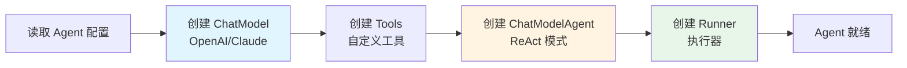
```mermaid
graph LR
    A[读取 Agent 配置] --> B[创建 ChatModel<br/>OpenAI/Claude]
    B --> C[创建 Tools<br/>自定义工具]
    C --> D[创建 ChatModelAgent<br/>ReAct 模式]
    D --> E[创建 Runner<br/>执行器]
    E --> F[Agent 就绪]
    
    style B fill:#e1f5ff
    style D fill:#fff4e1
    style E fill:#e8f5e9
```

### 3.3 流式调用流程

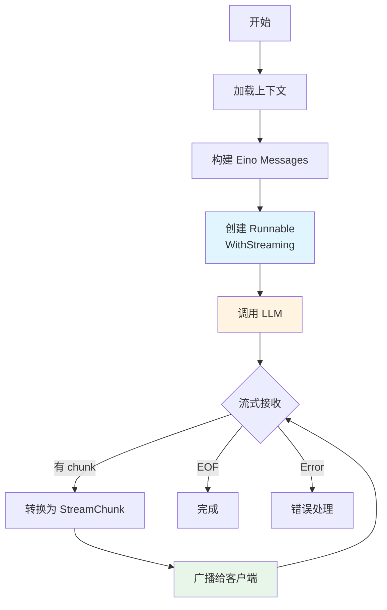
```mermaid
graph TB
    Start[开始] --> LoadCtx[加载上下文]
    LoadCtx --> BuildMsg[构建 Eino Messages]
    BuildMsg --> CreateRunnable[创建 Runnable<br/>WithStreaming]
    CreateRunnable --> Invoke[调用 LLM]
    Invoke --> Stream{流式接收}
    Stream -->|有 chunk| Convert[转换为 StreamChunk]
    Convert --> Broadcast[广播给客户端]
    Broadcast --> Stream
    Stream -->|EOF| Done[完成]
    Stream -->|Error| Error[错误处理]
    
    style CreateRunnable fill:#e1f5ff
    style Invoke fill:#fff4e1
    style Broadcast fill:#e8f5e9
```

### 3.4 关键 Eino 组件

根据 **eino-component** skill 的指导，我们将使用以下组件：

- **ChatModel**: 使用 `openai.NewChatModel` 或 `claude.NewChatModel`
- **Tool**: 自定义工具实现 `tool.InvokableTool` 接口
- **Callback**: 使用 Callback Handler 实现可观测性

根据 **eino-agent** skill 的指导：

- **ChatModelAgent**: ReAct 模式，适合大多数场景
- **DeepAgent**: 需要规划、文件系统、子 agent 时使用
- **Runner**: 管理 agent 生命周期，支持 interrupt/resume
- **Middleware**: 可扩展 agent 行为（filesystem、summarization 等）

根据 **eino-compose** skill 的指导：

- **Graph**: 复杂流程，支持分支和循环
- **Chain**: 线性管道
- **Workflow**: DAG 编排，支持并行分支

---

## 4. Agent 配置系统

### 4.1 单文件格式（Front Matter）

Agent 配置使用**单文件格式**，YAML Front Matter 包含配置，正文是 system prompt：

```markdown
---
# agents/weather-bot.md
id: weather-bot
name: Weather Bot
description: "Provides weather information"
model: "claude-3-5-sonnet-20241022"
api_key_env: "ANTHROPIC_API_KEY"
base_url: ""
parameters:
  temperature: 0.7
  max_tokens: 4096
context:
  max_tokens: 4096
  max_messages: 20
tools: []
---

You are a helpful weather assistant. You provide accurate weather information.

Current time: {{current_time}}
User location: {{user_location}}

Be concise and friendly.
```

**优势**：

- 配置和 prompt 在同一文件，易于管理
- 使用 `go:embed` 嵌入到二进制中
- 支持 Markdown 格式的 prompt，可读性强

### 4.2 使用 go:embed 嵌入

```go
// internal/agent/embed.go
package agent

import "embed"

//go:embed agents/*.md
var agentConfigs embed.FS
```

**加载流程**：

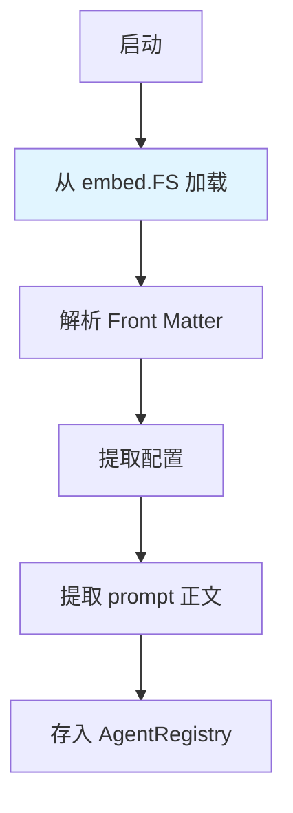
```mermaid
graph TB
    Start[启动] --> LoadEmbed[从 embed.FS 加载]
    LoadEmbed --> ParseFrontMatter[解析 Front Matter]
    ParseFrontMatter --> ExtractConfig[提取配置]
    ExtractConfig --> ExtractPrompt[提取 prompt 正文]
    ExtractPrompt --> Store[存入 AgentRegistry]
    
    style LoadEmbed fill:#e1f5ff
```

### 4.3 消息类型与压缩策略

数据库中的消息有类型，用于控制上下文加载和压缩：

| 消息类型 | 说明 | 加载策略 | 压缩策略 |
| -------- | ---- | -------- | -------- |
| `user` | 用户消息 | 正常加载 | 可被压缩为摘要 |
| `assistant` | Agent 回复 | 正常加载 | 可被压缩为摘要 |
| `summary` | 压缩摘要 | 正常加载 | 不再压缩 |
| `tool_call` | 工具调用 | 正常加载 | 可能截取，保留引用 |
| `tool_result` | 工具结果 | 可能截取 | 截取后保留引用 |

**压缩流程**：

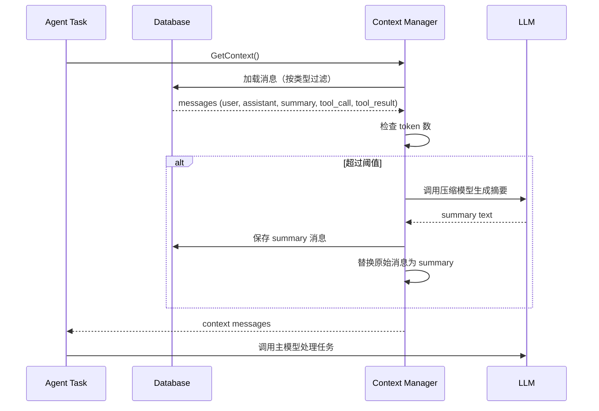
```mermaid
sequenceDiagram
    participant Task as Agent Task
    participant DB as Database
    participant CM as Context Manager
    participant LLM as LLM
    
    Task->>CM: GetContext()
    CM->>DB: 加载消息（按类型过滤）
    DB-->>CM: messages (user, assistant, summary, tool_call, tool_result)
    
    CM->>CM: 检查 token 数
    
    alt 超过阈值
        CM->>LLM: 调用压缩模型生成摘要
        LLM-->>CM: summary text
        CM->>DB: 保存 summary 消息
        CM->>CM: 替换原始消息为 summary
    end
    
    CM-->>Task: context messages
    Task->>LLM: 调用主模型处理任务
```

**关键点**：

- 压缩发生在任务处理过程中，不是独立步骤
- 压缩后的 `summary` 消息不再被压缩
- `tool_result` 可能被截取，但保留原始引用

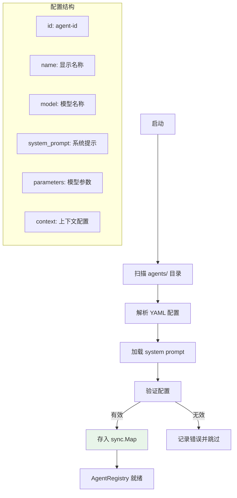
```mermaid
graph TB
    Start[启动] --> ScanDir[扫描 agents/ 目录]
    ScanDir --> ParseYAML[解析 YAML 配置]
    ParseYAML --> LoadPrompt[加载 system prompt]
    LoadPrompt --> Validate[验证配置]
    Validate -->|有效| Store[存入 sync.Map]
    Validate -->|无效| Log[记录错误并跳过]
    Store --> Ready[AgentRegistry 就绪]
    
    subgraph "配置结构"
        ID[id: agent-id]
        Name[name: 显示名称]
        Model[model: 模型名称]
        Prompt[system_prompt: 系统提示]
        Params[parameters: 模型参数]
        Ctx[context: 上下文配置]
    end
    
    style Store fill:#e8f5e9
```

---

## 5. 上下文管理

### 5.1 设计原则

- **DB 存储 + 内存缓存**：从 `messages` 表读取历史（数据已存在），`sync.Map` 缓存热路径
- **Token 计数裁剪**：使用 `tiktoken-go` 计算 token 数，保留最近的消息直到达到上限
- **per-conversation 串行处理**：保证同一对话的消息串行处理，避免上下文不一致

### 5.2 上下文加载流程

```mermaid
graph TB
    Start[GetContext] --> CheckCache{缓存命中?}
    CheckCache -->|是| ReturnCache[返回缓存]
    CheckCache -->|否| QueryDB[查询 DB<br/>ListRecentByConversation]
    QueryDB --> FilterMsgs[过滤 Agent 消息]
    FilterMsgs --> TrimWindow[裁剪到窗口大小]
    TrimWindow --> UpdateCache[更新缓存]
    UpdateCache --> ReturnDB[返回结果]
    
    style CheckCache fill:#fff4e1
    style QueryDB fill:#e1f5ff
```

### 5.3 并发控制

```mermaid
graph LR
    subgraph "sync.Map 缓存"
        C1[conv1 → *Context]
        C2[conv2 → *Context]
        C3[conv3 → *Context]
    end
    
    subgraph "per-conversation 锁"
        L1[Mutex]
        L2[Mutex]
        L3[Mutex]
    end
    
    subgraph "Worker 队列"
        W1[chan Task]
        W2[chan Task]
        W3[chan Task]
    end
    
    M1[消息 1] --> W1
    M2[消息 2] --> W1
    M3[消息 3] --> W2
    
    W1 -->|串行处理| L1
    W2 -->|串行处理| L2
    
    style L1 fill:#ffcdd2
    style L2 fill:#ffcdd2
    style L3 fill:#ffcdd2
```

### 5.4 Token 裁剪策略

```mermaid
graph TB
    Start[开始裁剪] --> CalcTokens[计算总 token 数]
    CalcTokens --> CheckLimit{超过限制?}
    CheckLimit -->|否| ReturnAll[返回所有消息]
    CheckLimit -->|是| RemoveOldest[移除最旧消息]
    RemoveOldest --> CalcTokens
    
    subgraph "Fallback 策略"
        TokenFail[Token 计数失败] --> CountMsg[按消息数裁剪<br/>max_messages]
    end
    
    style CheckLimit fill:#fff4e1
    style CountMsg fill:#ffebee
```

---

## 6. 流式输出处理

### 6.1 复用现有机制

Agent 的流式输出完全复用 `stream_text` RPC（D-051）和累积文本模式：

- **协议层**：使用 `UpdateTypeStreaming` (Seq=0, ephemeral)
- **广播函数**：通过 `BroadcastUpdates` 推送给会话成员
- **客户端处理**：复用 `StreamingHandler.OnStreaming` 回调

### 6.2 流式广播流程

```mermaid
sequenceDiagram
    participant ATH as AgentTaskHandler
    participant Eino as Eino Agent
    participant LLM as LLM Provider
    participant WS as WebSocket Server
    participant Client
    
    ATH->>Eino: StreamChat()
    
    loop 每个 token chunk
        Eino->>LLM: 请求
        LLM-->>Eino: token
        Eino-->>ATH: chunk
        
        Note over ATH: 累积文本
        
        ATH->>ATH: 50ms 节流
        ATH->>WS: broadcastStreaming<br/>(累积文本, is_done=false)
        WS-->>Client: streaming update<br/>(Seq=0)
        Client->>Client: 实时显示
    end
    
    Eino-->>ATH: 完成
    
    ATH->>WS: broadcastStreaming<br/>(完整文本, is_done=true)
    WS-->>Client: 流式结束
```

### 6.3 消息持久化

```mermaid
graph TB
    StreamEnd[流式结束] --> BuildMsg[构建 Message]
    BuildMsg --> SetFields[设置字段<br/>ConversationID<br/>SenderID<br/>Content]
    SetFields --> CallStore[调用 Store.SendMessage]
    CallStore --> AllocID[分配 MessageID]
    AllocID --> Persist[持久化到 DB]
    Persist --> CreateUpdate[创建 UserUpdate]
    CreateUpdate --> Broadcast[广播消息]
    Broadcast --> Sync[客户端 sync_updates]
    
    style CallStore fill:#e1f5ff
    style Persist fill:#e8f5e9
```

---

## 7. 消息协议兼容性

### 7.1 Phase 1（MVP）：零协议改动

**核心原则**：Agent 就是特殊的 UserID，复用所有现有机制。

#### Agent UserID 命名约定

```
agent/weather-bot
agent/code-reviewer
agent/translator
```

- `agent/` 前缀为系统保留命名空间
- Agent 在协议层与普通用户完全等价
- 客户端通过 `strings.HasPrefix(userID, "agent/")` 识别

#### 客户端改动（MVP）

客户端仅需新增一个 helper 函数：

```
function isAgentUser(userID):
    return userID.startsWith("agent/")
```

在 `TypingHandler.OnTyping` 和 `StreamingHandler.OnStreaming` 中根据此函数决定 UI 展示。

### 7.2 Phase 2（可选增强）

#### 新增 agent_status ephemeral push

新增协议常量 `UpdateTypeAgentStatus`，支持以下状态：

- `thinking`: Agent 正在调用 LLM
- `tool_calling`: Agent 正在调用工具
- `generating`: Agent 正在生成回复
- `idle`: Agent 空闲

#### 新增 reload_agents RPC

触发 server 重新扫描 agents 目录，实现配置热更新。

---

## 8. 实施阶段

### Phase 1: MVP（预计 1-2 周）

**目标**：实现基本 Agent 功能，零协议改动

**任务**：

1. ✅ 新建 `internal/agent/` 包
2. ✅ 实现 `AgentRegistry`（从 YAML 加载配置）
3. ✅ 实现 `EinoAgent`（封装 Eino 框架）
4. ✅ 实现 `ContextManager`（DB 存储 + 简单缓存）
5. ✅ 实现 `AgentTaskHandler` 注册为 `TypeAgentProcess` MQ handler
6. ✅ 在 `send_message` handler 中检测 Agent 目标，enqueue task
7. ✅ 新增 `MessageStore.ListRecentByConversation()` 方法
8. ✅ Agent 配置目录 `agents/`（可选，默认无 Agent）
9. ✅ 客户端新增 `isAgentUser()` helper（仅 UI 层）

**协议改动**：**零**

### Phase 2: 生产化（预计 1 周）

**目标**：优化和监控

**任务**：

1. ✅ Token 计数裁剪（集成 tiktoken-go）
2. ✅ per-conversation worker 串行队列
3. ✅ 配置热更新（`reload_agents` RPC）
4. ✅ 并发控制（semaphore）和超时配置
5. ✅ 监控和日志（LLM 调用延迟、token 使用量）

**可选增强**：

- `agent_status` ephemeral push（thinking/tool_calling 状态）
- System prompt 动态注入（当前时间、用户信息等）

### Phase 3: 高级功能（可选）

**目标**：扩展 Agent 能力

**任务**：

1. ✅ Sub-agents（DeepAgent）
2. ✅ 自定义 tools（天气查询、数据库查询等）
3. ✅ Graph orchestration（复杂工作流）
4. ✅ MCP 桥接（如果需要使用 MCP tools）

---

## 9. 产品决策

建议新增以下产品决策：

### D-054: Agent UserID 命名约定

Agent 使用 `agent/<agent-id>` 格式的 UserID。`agent/` 前缀为系统保留命名空间。Agent 在协议层与普通用户完全等价，客户端通过前缀识别。

### D-055: Agent 消息格式复用

Agent 的消息与普通用户消息格式完全相同。不新增 Message.Type 枚举值，不新增 Package 类型。Agent 通过 `agent/` 前缀的 UserID 标识。

### D-056: Agent 流式输出复用 stream_text

Agent 的流式输出完全复用 `stream_text` RPC（D-051）和累积文本模式。客户端通过 broadcast payload 中的 `user_id` 前缀判断来源。

### D-057: Agent 思考状态复用 set_typing

Agent 的思考状态使用 `set_typing` RPC（D-050）。客户端通过 `user_id` 前缀区分 "typing" 和 "thinking" 的 UI 展示。

### D-058: Agent 配置格式

Agent 通过 YAML 文件定义，存放于 `agents/` 目录。server 启动时加载。配置文件包含 id、name、model、system_prompt_file、parameters 等。

### D-059: Agent 框架选型

使用 Eino 框架（github.com/cloudwego/eino）作为 AI Agent 的核心框架。Eino 提供 ChatModelAgent、DeepAgent、graph orchestration、streaming、tools、sessions 等能力，Go 原生集成。

### D-060: Agent 上下文策略

Agent 使用 DB 存储 + 内存缓存的上下文管理策略。从 `messages` 表读取历史消息，使用 Token 计数裁剪（fallback 为固定消息数）。per-conversation worker 串行处理保证一致性。

---

## 10. 关键文件清单

### 新增文件

- `internal/agent/registry.go` - Agent 配置注册表
- `internal/agent/eino_agent.go` - Eino Agent 封装
- `internal/agent/context.go` - ContextManager 接口
- `internal/agent/db_context_manager.go` - DB 实现
- `internal/agent/task_handler.go` - AgentTaskHandler
- `internal/agent/broadcast.go` - 流式广播辅助函数
- `internal/agent/agent.go` - Agent 核心逻辑
- `internal/agent/semaphore.go` - 并发控制 semaphore
- `internal/agent/checkpoint_store.go` - Redis-backed CheckPointStore 实现
- `internal/agent/stream_bridge.go` - Eino StreamReader -> WebSocket 流式桥接
- `internal/agent/middleware_metrics.go` - WrapModel middleware for LLM metrics
- `agents/` - 配置文件目录
- `pkg/client/agent.go` - 客户端 `isAgentUser()` helper

### 修改文件

- `internal/mq/mq.go` - 新增 `TypeAgentProcess` task type
- `internal/handler/send_message.go` - 检测 Agent 目标，enqueue task
- `internal/store/message.go` - 新增 `ListRecentByConversation()` 方法
- `cmd/xyncra-server/main.go` - 初始化 AgentRegistry 和 AgentTaskHandler

---

## 附录：风险与缓解

| 风险                | 缓解措施                                |
| ------------------- | --------------------------------------- |
| LLM 调用超时/失败   | MQ 自动重试（Asynq retry 机制）         |
| LLM 调用阻塞 server | MQ worker 隔离，semaphore 并发控制      |
| Token 超限          | Token 计数裁剪 + 单条消息截断           |
| 并发冲突            | per-conversation worker 串行处理        |
| Agent 配置错误      | 启动时验证，运行时忽略无效配置          |
| 内存泄漏            | 缓存 TTL 清理机制                       |
| Eino 框架学习曲线   | 有中文文档和示例，社区活跃              |

---

## 下一步行动

1. ✅ 创建设计文档（本文档）
2. ⏳ 提交设计文档到 git
3. ⏳ 创建实施计划（使用 writing-plans skill）
4. ⏳ Phase 1 实施

---

**文档版本历史**：

| 日期       | 版本 | 变更                                                                 |
| ---------- | ---- | -------------------------------------------------------------------- |
| 2026-07-10 | v2.0 | 移除真实代码，改用 mermaid 流程图；添加 Eino 官方 skill 引用         |
| 2026-07-10 | v1.0 | 初始版本，基于四位专家调研综合                                       |
