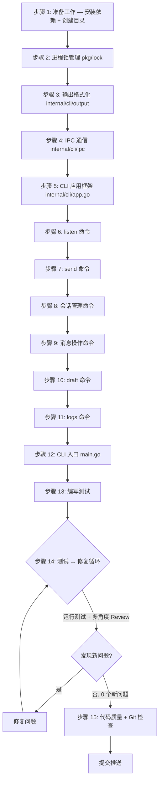

# Internal CLI 层实现提示词

中文和我沟通。任务执行过程中，如果必须询问我，就来问我。
子代理驱动，串行执行，你作为子代理调度者。注意润色提示词，保证上下文充分完整。子代理必须频繁使用 TodoWrite tool。子代理必须阅读并了解 `docs/PRODUCT_DECISIONS.md`。

---

## 任务概述

为 xyncra-client CLI 工具实现命令层（`internal/cli`），包含 Cobra 命令框架、Unix Socket IPC 通信、进程锁管理、输出格式化。这是 CLI 工具的"大脑"，协调通信层（`pkg/client`）和数据层（`pkg/store`），为用户和其他进程提供统一的操作入口。

## 工作流程



## 背景上下文

### 项目现状

xyncra-server 已完成以下核心组件：
- **协议层**（`pkg/protocol/`）：Package、Request、Response、Updates 定义完整
- **服务器层**（`internal/server/`）：WebSocket 服务器、连接管理、12 个 RPC 方法
- **数据层**（`internal/store/`）：GORM + SQLite，Conversation/Message/UserUpdate 存储

### 本次任务的上下游依赖

- **下游**：`pkg/client`（通信层，正在实现）— 提供 WebSocket 连接、RPC 调用、增量同步
- **下游**：`pkg/store`（数据层，正在实现）— 提供 SQLite 本地数据库操作
- **复用**：`pkg/protocol` — 直接 import 复用协议定义
- **新增**：`internal/cli` — 本次实现

### 相关的产品决策

| 编号 | 决策 | 对 CLI 层的影响 |
|------|------|----------------|
| D-001 | 开箱即用，零配置 | CLI 提供合理默认值，`--server` 默认 `ws://localhost:8080/ws`，`--device-id` 默认主机名 |
| D-002 | 认证由业务服务器负责 | CLI 使用 `--user-id` 参数直接传入用户 ID |
| D-006 | client_message_id 幂等 | send 命令自动生成 UUID 作为 client_message_id |
| D-009 | sync_updates 分页 | sync-updates 命令使用 after_seq + limit |
| D-010 | 被动续期 | listen 命令每 30 秒发送 heartbeat |
| D-012 | mark_as_read MAX 语义 | mark-as-read 命令直接传递参数，服务器负责 MAX 逻辑 |

### 关键约束

1. **单连接保证**：整个应用只维护一条 WebSocket 连接，由 listen 命令持有
2. **进程间通信**：其他命令通过 Unix Socket 复用 listen 的连接
3. **SQLite 并发**：`SetMaxOpenConns(1)` + WAL 模式 + `busy_timeout=5000`
4. **gorilla/websocket 单写者**：只能有一个 goroutine 执行写操作
5. **消息大小限制**：默认 64KiB（`defaultMaxMessageSize`）
6. **环境变量前缀**：所有环境变量使用 `XYNCRA_` 前缀

## 详细实现步骤

### 步骤 1：准备工作

**安装新依赖**：
```bash
go get github.com/spf13/cobra      # CLI 框架
go get github.com/gofrs/flock       # 进程锁
```

**创建目录结构**：
```
internal/cli/
├── app.go              # Cobra root command
├── listen.go           # listen 命令
├── send.go             # send 命令
├── conversations.go    # 会话命令
├── messages.go         # 消息命令
├── sync.go             # sync-updates 命令
├── draft.go            # draft 命令
├── logs.go             # logs 命令
├── mode.go             # 模式检测
├── context.go          # CLI context
├── ipc/
│   ├── types.go        # JSON-RPC 类型
│   ├── server.go       # IPC 服务端
│   └── client.go       # IPC 客户端
├── lock/
│   └── lock.go         # 进程锁管理
└── output/
    ├── formatter.go    # 输出格式化接口
    ├── console.go      # 控制台格式化
    ├── csv.go          # CSV 导出
    └── json.go         # JSON 导出
```

**注意事项**：
- `internal/cli/` 位于 `internal/` 下，只对本模块可见
- 所有命令文件使用 `package cli`
- IPC 和 lock 使用子包，避免循环依赖

---

### 步骤 2：进程锁管理（`internal/cli/lock/lock.go`）

**文件路径**：`internal/cli/lock/lock.go`

**设计要点**：
- 使用 `github.com/gofrs/flock` 封装文件锁
- 锁文件路径：`~/.xyncra/{user_id}/{device_id}/xyncra.lock`
- listen 命令使用排他锁（`TryLock()`）
- 锁文件内容：PID + 启动时间（JSON 格式）
- 自动创建锁文件所在目录
- 提供 PID 存活检查（检测 stale lock）
- 支持 SIGINT/SIGTERM 时自动释放锁

**接口定义**：
```go
package lock

type LockInfo struct {
    PID       int       `json:"pid"`
    StartedAt time.Time `json:"started_at"`
    DeviceID  string    `json:"device_id"`
}

type Manager struct {
    lockPath string
    flock    *flock.Flock
}

func NewManager(userDir string) *Manager
func (m *Manager) LockPath() string
func (m *Manager) TryLock(info *LockInfo) error
func (m *Manager) Unlock() error
func (m *Manager) ReadLockInfo() (*LockInfo, error)
func (m *Manager) IsStale() bool
func (m *Manager) CleanupStale() error
func EnsureUserDir(userID, deviceID string) (string, error)
```

**错误处理**：
- `ErrAlreadyRunning`：listen 已在运行（排他锁获取失败）
- 提供清晰的错误信息，包含当前运行进程的 PID

**代码示例**：
```go
package lock

import (
    "encoding/json"
    "fmt"
    "os"
    "path/filepath"
    "syscall"
    "time"

    "github.com/gofrs/flock"
)

var ErrAlreadyRunning = fmt.Errorf("xyncra-client: already running")

type LockInfo struct {
    PID       int       `json:"pid"`
    StartedAt time.Time `json:"started_at"`
    DeviceID  string    `json:"device_id"`
}

type Manager struct {
    lockPath string
    flock    *flock.Flock
}

func NewManager(userDir string) *Manager {
    return &Manager{
        lockPath: filepath.Join(userDir, "xyncra.lock"),
        flock:    flock.New(filepath.Join(userDir, "xyncra.lock")),
    }
}

func (m *Manager) TryLock(info *LockInfo) error {
    if err := os.MkdirAll(filepath.Dir(m.lockPath), 0700); err != nil {
        return fmt.Errorf("create lock dir: %w", err)
    }
    locked, err := m.flock.TryLock()
    if err != nil {
        return fmt.Errorf("try lock: %w", err)
    }
    if !locked {
        existing, readErr := m.ReadLockInfo()
        if readErr == nil && isProcessAlive(existing.PID) {
            return fmt.Errorf("%w (pid: %d)", ErrAlreadyRunning, existing.PID)
        }
        // stale lock — cleanup and retry
        _ = m.flock.Unlock()
        locked, err = m.flock.TryLock()
        if err != nil {
            return fmt.Errorf("retry lock: %w", err)
        }
        if !locked {
            return ErrAlreadyRunning
        }
    }
    data, _ := json.Marshal(info)
    return os.WriteFile(m.lockPath, data, 0600)
}

func (m *Manager) Unlock() error {
    _ = os.Remove(m.lockPath)
    return m.flock.Unlock()
}

func (m *Manager) ReadLockInfo() (*LockInfo, error) {
    data, err := os.ReadFile(m.lockPath)
    if err != nil {
        return nil, fmt.Errorf("read lock file: %w", err)
    }
    var info LockInfo
    if err := json.Unmarshal(data, &info); err != nil {
        return nil, fmt.Errorf("parse lock info: %w", err)
    }
    return &info, nil
}

func (m *Manager) LockPath() string { return m.lockPath }

func isProcessAlive(pid int) bool {
    if pid <= 0 {
        return false
    }
    process, err := os.FindProcess(pid)
    if err != nil {
        return false
    }
    err = process.Signal(syscall.Signal(0))
    return err == nil
}
```

**测试要点**：
- 排他锁获取/释放
- 重复获取排他锁返回 ErrAlreadyRunning
- LockInfo 序列化/反序列化
- Stale lock 检测和清理

---

### 步骤 3：输出格式化（`internal/cli/output/`）

**文件路径**：`internal/cli/output/formatter.go`, `console.go`, `csv.go`, `json.go`

**接口定义**：
```go
package output

type Formatter interface {
    // FormatTable formats data as a table (for list commands)
    FormatTable(headers []string, rows [][]string) string
    // FormatDetail formats a single object's details
    FormatDetail(fields map[string]string) string
    // FormatSuccess formats a success message
    FormatSuccess(msg string) string
    // FormatError formats an error message with optional error code
    FormatError(msg string, code int) string
    // FormatList formats a list of items
    FormatList(items []string) string
}
```

**ConsoleFormatter**：
- 人类友好的格式化输出
- 表格对齐（使用 `text/tabwriter`）
- 颜色支持（通过 `--no-color` 或 `NO_COLOR` 环境变量禁用）
- 错误信息包含错误码和建议

**CSVFormatter**：
- 使用 `encoding/csv` 标准库
- 正确处理特殊字符（逗号、换行、引号）
- UTF-8 BOM 支持（Excel 兼容）

**JSONFormatter**：
- `json.MarshalIndent` 美化输出
- 时间格式化为 ISO 8601
- nil/空值正确处理

**代码示例**：
```go
// console.go
package output

import (
    "fmt"
    "os"
    "strings"
    "text/tabwriter"
)

type ConsoleFormatter struct {
    noColor bool
}

func NewConsoleFormatter() *ConsoleFormatter {
    noColor := os.Getenv("NO_COLOR") != ""
    return &ConsoleFormatter{noColor: noColor}
}

func (f *ConsoleFormatter) FormatTable(headers []string, rows [][]string) string {
    var buf strings.Builder
    w := tabwriter.NewWriter(&buf, 0, 0, 2, ' ', 0)
    // header
    fmt.Fprintln(w, strings.Join(headers, "\t"))
    fmt.Fprintln(w, strings.Repeat("-\t", len(headers)))
    // rows
    for _, row := range rows {
        fmt.Fprintln(w, strings.Join(row, "\t"))
    }
    w.Flush()
    return buf.String()
}

func (f *ConsoleFormatter) FormatError(msg string, code int) string {
    if f.noColor {
        return fmt.Sprintf("Error [%d]: %s", code, msg)
    }
    return fmt.Sprintf("\033[31mError [%d]\033[0m: %s", code, msg)
}

func (f *ConsoleFormatter) FormatSuccess(msg string) string {
    if f.noColor {
        return fmt.Sprintf("OK: %s", msg)
    }
    return fmt.Sprintf("\033[32mOK\033[0m: %s", msg)
}
```

**测试要点**：
- Console 格式化：表格对齐、颜色开关、空数据处理
- CSV 格式化：特殊字符转义、BOM 头
- JSON 格式化：时间格式、nil 值、嵌套结构

---

### 步骤 4：IPC 通信（`internal/cli/ipc/`）

**文件路径**：`internal/cli/ipc/types.go`, `server.go`, `client.go`

#### 4.1 JSON-RPC 类型定义（`types.go`）

```go
package ipc

type Request struct {
    JSONRPC string          `json:"jsonrpc"`
    ID      string          `json:"id"`
    Method  string          `json:"method"`
    Params  json.RawMessage `json:"params,omitempty"`
}

type Response struct {
    JSONRPC string          `json:"jsonrpc"`
    ID      string          `json:"id"`
    Result  json.RawMessage `json:"result,omitempty"`
    Error   *RPCError       `json:"error,omitempty"`
}

type RPCError struct {
    Code    int             `json:"code"`
    Message string          `json:"message"`
    Data    json.RawMessage `json:"data,omitempty"`
}

func NewRequest(method string, params interface{}) (*Request, error)
func (r *Request) Validate() error
func NewResponse(id string, result interface{}) (*Response, error)
func NewErrorResponse(id string, code int, message string) *Response
func (r *Response) IsError() bool
```

#### 4.2 IPC 服务端（`server.go`）

**设计要点**：
- listen 命令内启动
- 监听 `~/.xyncra/{user_id}/{device_id}/xyncra.sock`
- 每个连接一个 goroutine 处理
- 支持并发请求
- 使用 `net.Listener` + `net.UnixConn`
- 每次只读取一个完整的 JSON 请求（以换行符分隔）
- 消息大小限制（1MB）
- 支持优雅关闭

**接口定义**：
```go
type HandlerFunc func(ctx context.Context, req *Request) (*Response, error)

type Server struct {
    listener net.Listener
    sockPath string
    handlers map[string]HandlerFunc
    ctx      context.Context
    cancel   context.CancelFunc
    wg       sync.WaitGroup
}

func NewServer(sockPath string) *Server
func (s *Server) Register(method string, handler HandlerFunc)
func (s *Server) Start(ctx context.Context) error
func (s *Server) Stop() error
func (s *Server) SocketPath() string
```

**关键实现**：
- 启动前删除残留的 sock 文件
- 设置 socket 文件权限为 0600
- 使用 `bufio.Scanner` 读取换行分隔的 JSON 消息
- 每个连接独立 goroutine，handler 内部保证线程安全

#### 4.3 IPC 客户端（`client.go`）

**设计要点**：
- 其他命令（send、list-conversations 等）使用
- 连接到 listen 进程的 Unix Socket
- 支持超时控制
- 自动重连（最多 3 次）
- 连接失败时返回清晰错误

**接口定义**：
```go
type Client struct {
    sockPath string
    timeout  time.Duration
    conn     net.Conn
}

func NewClient(sockPath string, timeout time.Duration) *Client
func (c *Client) Call(ctx context.Context, method string, params interface{}) (*Response, error)
func (c *Client) Connect(ctx context.Context) error
func (c *Client) Close() error
func (c *Client) IsConnected() bool
```

**代码示例**（客户端调用）：
```go
func (c *Client) Call(ctx context.Context, method string, params interface{}) (*Response, error) {
    if err := c.Connect(ctx); err != nil {
        return nil, fmt.Errorf("connect to daemon: %w", err)
    }
    defer c.Close()

    req, err := NewRequest(method, params)
    if err != nil {
        return nil, fmt.Errorf("create request: %w", err)
    }

    data, err := json.Marshal(req)
    if err != nil {
        return nil, fmt.Errorf("marshal request: %w", err)
    }
    data = append(data, '\n')

    if _, err := c.conn.Write(data); err != nil {
        return nil, fmt.Errorf("send request: %w", err)
    }

    resp, err := c.readResponse(ctx)
    if err != nil {
        return nil, fmt.Errorf("read response: %w", err)
    }
    return resp, nil
}
```

**测试要点**：
- IPC 服务端：启动/停止、并发请求处理、消息大小限制
- IPC 客户端：连接/断开、请求/响应、超时处理
- JSON-RPC：请求/响应序列化、错误处理
- 端到端：客户端 -> 服务端 -> handler -> 响应

---

### 步骤 5：CLI 应用框架（`internal/cli/app.go`）

**文件路径**：`internal/cli/app.go`, `internal/cli/context.go`

**设计要点**：
- 使用 Cobra 创建 root command
- 全局 persistent flags：`--user-id`、`--device-id`、`--server`、`--log-dir`、`--no-color`
- 环境变量回退（`XYNCRA_USER_ID`、`XYNCRA_SERVER` 等）
- PreRun 中验证必填参数
- 提供 `CLIContext` 贯穿命令执行

**CLIContext 结构**：
```go
type CLIContext struct {
    UserID     string
    DeviceID   string
    ServerURL  string
    LogDir     string
    UserDir    string  // ~/.xyncra/{user_id}/{device_id}
    NoColor    bool
    Formatter  output.Formatter
}

func NewCLIContext(cmd *cobra.Command) (*CLIContext, error)
func (c *CLIContext) SocketPath() string
func (c *CLIContext) LockDir() string
func (c *CLIContext) DBPath() string
```

**Cobra root command**：
```go
func NewRootCommand() *cobra.Command {
    rootCmd := &cobra.Command{
        Use:   "xyncra-client",
        Short: "Xyncra messaging client CLI",
    }

    // Persistent flags
    rootCmd.PersistentFlags().StringP("user-id", "u", "", "User ID (required)")
    rootCmd.PersistentFlags().String("device-id", "", "Device ID (default: hostname)")
    rootCmd.PersistentFlags().StringP("server", "s", "ws://localhost:8080/ws", "Server URL")
    rootCmd.PersistentFlags().String("log-dir", "", "Log directory")
    rootCmd.PersistentFlags().Bool("no-color", false, "Disable color output")

    // Environment variable fallback
    viper.BindPFlag("user-id", rootCmd.PersistentFlags().Lookup("user-id"))
    viper.SetEnvPrefix("XYNCRA")
    viper.AutomaticEnv()

    // Add subcommands
    rootCmd.AddCommand(newListenCommand())
    rootCmd.AddCommand(newSendCommand())
    rootCmd.AddCommand(newListConversationsCommand())
    // ... etc

    return rootCmd
}
```

**注意事项**：
- 环境变量优先级：命令行 flag > 环境变量 > 默认值
- `--device-id` 默认值为主机名的 SHA256 前 8 位（匿名化）
- `--user-id` 是必填参数（除 listen 外），在 PreRunE 中验证

---

### 步骤 6：listen 命令（`internal/cli/listen.go`）

**文件路径**：`internal/cli/listen.go`

**设计要点**：
- 核心命令：建立 WebSocket 连接，接收 Updates 和 Requests
- 获取排他锁（防止重复启动）
- 初始化数据库（AutoMigrate）
- 启动 IPC 服务端
- 自动同步（拉取离线 Updates）
- 启动心跳（每 30 秒）
- 启动重试队列轮询（每 1 秒）
- 启动日志自动清理（每 1 小时）
- 接收消息并处理（输出到控制台 + 写入 SQLite 日志表）
- Ctrl+C 优雅退出

**执行流程**：
1. 验证参数
2. 获取排他锁
3. 初始化数据库
4. 启动 IPC 服务端
5. 创建 XyncraClient
6. 注册 IPC handlers
7. 连接 WebSocket
8. 自动同步
9. 启动心跳/重试/清理 goroutines
10. 等待退出信号
11. 优雅关闭

**代码示例**：
```go
func newListenCommand() *cobra.Command {
    return &cobra.Command{
        Use:   "listen",
        Short: "Start listening for updates (daemon mode)",
        RunE: func(cmd *cobra.Command, args []string) error {
            cliCtx, err := NewCLIContext(cmd)
            if err != nil {
                return err
            }

            // 1. 获取排他锁
            lockMgr := lock.NewManager(cliCtx.UserDir)
            lockInfo := &lock.LockInfo{
                PID:       os.Getpid(),
                StartedAt: time.Now(),
                DeviceID:  cliCtx.DeviceID,
            }
            if err := lockMgr.TryLock(lockInfo); err != nil {
                return fmt.Errorf("cannot start listen: %w", err)
            }
            defer lockMgr.Unlock()

            // 2. 初始化数据库
            db, err := clientdb.New(cliCtx.DBPath())
            if err != nil {
                return fmt.Errorf("init database: %w", err)
            }
            defer db.Close()
            if err := db.AutoMigrate(context.Background()); err != nil {
                return fmt.Errorf("auto migrate: %w", err)
            }

            // 3. 启动 IPC 服务端
            ipcServer := ipc.NewServer(cliCtx.SocketPath())
            defer ipcServer.Stop()

            // 4. 创建 XyncraClient
            xc, err := client.New(
                client.WithServerURL(cliCtx.ServerURL),
                client.WithUserID(cliCtx.UserID),
                client.WithStore(db),
            )
            if err != nil {
                return fmt.Errorf("create client: %w", err)
            }

            // 5. 注册 IPC handlers
            registerIPCHandlers(ipcServer, xc, db)

            // 6. 连接并启动
            ctx, cancel := context.WithCancel(context.Background())
            defer cancel()

            // 信号处理
            sigCh := make(chan os.Signal, 1)
            signal.Notify(sigCh, syscall.SIGINT, syscall.SIGTERM)
            go func() {
                <-sigCh
                cancel()
            }()

            // 启动 IPC 服务端
            if err := ipcServer.Start(ctx); err != nil {
                return fmt.Errorf("start IPC server: %w", err)
            }

            // 连接 WebSocket
            if err := xc.Connect(ctx); err != nil {
                return fmt.Errorf("connect: %w", err)
            }
            defer xc.Close()

            // 启动心跳
            go xc.StartHeartbeat(ctx, 30*time.Second)

            // 启动重试轮询
            go xc.StartRetryLoop(ctx, 1*time.Second)

            // 启动日志清理
            go startLogCleanup(ctx, db, 1*time.Hour, 7*24*time.Hour)

            // 等待 Updates
            fmt.Println("Listening for updates... (Ctrl+C to stop)")
            go xc.ReceiveUpdates(ctx)

            <-ctx.Done()
            fmt.Println("\nShutting down...")
            return nil
        },
    }
}
```

**IPC Handlers 注册**：
```go
func registerIPCHandlers(s *ipc.Server, xc *client.XyncraClient, db *clientdb.ClientDB) {
    // 转发 RPC 请求到 WebSocket 服务器
    rpcMethods := []string{
        "send_message", "sync_updates", "create_conversation",
        "list_conversations", "get_messages", "search_messages",
        "get_conversation", "delete_conversation", "restore_conversation",
        "delete_message", "mark_as_read", "heartbeat",
    }
    for _, method := range rpcMethods {
        s.Register(method, func(ctx context.Context, req *ipc.Request) (*ipc.Response, error) {
            result, err := xc.CallRPC(ctx, method, req.Params)
            if err != nil {
                return ipc.NewErrorResponse(req.ID, -1, err.Error()), nil
            }
            return ipc.NewResponse(req.ID, result)
        })
    }

    // 本地操作（不需要通过 WebSocket）
    s.Register("draft.save", handleDraftSave(db))
    s.Register("draft.get", handleDraftGet(db))
    s.Register("draft.delete", handleDraftDelete(db))
}
```

---

### 步骤 7：send 命令（`internal/cli/send.go`）

**文件路径**：`internal/cli/send.go`

**参数**：
- `--conversation-id, -c`（必填）
- `--content, -m`（必填）
- `--type`（默认 `text`）
- `--reply-to`（可选）

**执行逻辑**：
1. 验证参数
2. 初始化数据库（AutoMigrate）
3. 尝试连接 listen 进程（IPC 模式）
4. 如果 IPC 连接失败，切换到独立模式（直接 WebSocket）
5. 自动生成 client_message_id（UUID v4）
6. 发送消息 RPC
7. 输出结果

**代码示例**：
```go
func newSendCommand() *cobra.Command {
    cmd := &cobra.Command{
        Use:   "send",
        Short: "Send a message",
        RunE: func(cmd *cobra.Command, args []string) error {
            cliCtx, err := NewCLIContext(cmd)
            if err != nil {
                return err
            }
            convID, _ := cmd.Flags().GetString("conversation-id")
            content, _ := cmd.Flags().GetString("content")
            msgType, _ := cmd.Flags().GetString("type")
            replyTo, _ := cmd.Flags().GetString("reply-to")

            // 初始化数据库
            db, err := clientdb.New(cliCtx.DBPath())
            if err != nil {
                return err
            }
            defer db.Close()
            if err := db.AutoMigrate(context.Background()); err != nil {
                return err
            }

            params := map[string]interface{}{
                "conversation_id":   convID,
                "content":           content,
                "type":              msgType,
                "client_message_id": uuid.New().String(),
            }
            if replyTo != "" {
                params["reply_to"] = replyTo
            }

            // 尝试 IPC 模式
            ipcClient := ipc.NewClient(cliCtx.SocketPath(), 30*time.Second)
            resp, err := ipcClient.Call(context.Background(), "send_message", params)
            if err == nil {
                // IPC 模式成功
                return printResponse(cliCtx.Formatter, resp)
            }

            // Fallback: 独立模式
            fmt.Fprintln(os.Stderr, "Daemon not running, using standalone mode")
            xc, err := client.New(
                client.WithServerURL(cliCtx.ServerURL),
                client.WithUserID(cliCtx.UserID),
                client.WithStore(db),
            )
            if err != nil {
                return err
            }
            if err := xc.Connect(context.Background()); err != nil {
                return err
            }
            defer xc.Close()

            result, err := xc.CallRPC(context.Background(), "send_message", params)
            if err != nil {
                return err
            }
            // 输出结果
            fmt.Println(cliCtx.Formatter.FormatSuccess("Message sent"))
            return nil
        },
    }
    cmd.Flags().StringP("conversation-id", "c", "", "Conversation ID (required)")
    cmd.Flags().StringP("content", "m", "", "Message content (required)")
    cmd.Flags().String("type", "text", "Message type")
    cmd.Flags().String("reply-to", "", "Reply to message ID")
    cmd.MarkFlagRequired("conversation-id")
    cmd.MarkFlagRequired("content")
    return cmd
}
```

---

### 步骤 8：会话管理命令（`internal/cli/conversations.go`）

**文件路径**：`internal/cli/conversations.go`

**命令清单**：

| 命令 | 必填参数 | 可选参数 | 说明 |
|------|---------|---------|------|
| `list-conversations` | - | `--offset`, `--limit` | 列出会话（默认 20 条） |
| `create-conversation` | `--user-id`（对方） | `--title` | 创建会话 |
| `get-conversation` | `--conversation-id` | - | 获取会话详情 |
| `delete-conversation` | `--conversation-id` | - | 软删除会话 |
| `restore-conversation` | `--conversation-id` | - | 恢复会话 |

**模式切换逻辑**：所有会话命令都复用 send 命令中的 IPC 优先、独立模式 fallback 模式。

**提取公共函数**：
```go
// callOrStandalone 封装了 IPC 优先 + 独立模式 fallback 的通用逻辑
func callOrStandalone(cliCtx *CLIContext, method string, params interface{}) (*ipc.Response, error) {
    // 1. 尝试 IPC
    ipcClient := ipc.NewClient(cliCtx.SocketPath(), 30*time.Second)
    resp, err := ipcClient.Call(context.Background(), method, params)
    if err == nil {
        return resp, nil
    }

    // 2. Fallback: 独立模式
    db, err := clientdb.New(cliCtx.DBPath())
    if err != nil {
        return nil, err
    }
    defer db.Close()
    if err := db.AutoMigrate(context.Background()); err != nil {
        return nil, err
    }

    xc, err := client.New(
        client.WithServerURL(cliCtx.ServerURL),
        client.WithUserID(cliCtx.UserID),
        client.WithStore(db),
    )
    if err != nil {
        return nil, err
    }
    if err := xc.Connect(context.Background()); err != nil {
        return nil, err
    }
    defer xc.Close()

    result, err := xc.CallRPC(context.Background(), method, params)
    if err != nil {
        return nil, err
    }
    return ipc.NewResponse("", result)
}
```

---

### 步骤 9：消息操作命令（`internal/cli/messages.go`）

**文件路径**：`internal/cli/messages.go`

**命令清单**：

| 命令 | 必填参数 | 可选参数 | 说明 |
|------|---------|---------|------|
| `get-messages` | `--conversation-id` | `--after-message-id`, `--limit` | 获取消息历史 |
| `search-messages` | `--conversation-id`, `--query` | `--after-message-id`, `--limit` | 搜索消息 |
| `delete-message` | `--message-id` | - | 删除消息 |
| `mark-as-read` | `--conversation-id` | `--message-id` | 标记已读 |

**注意事项**：
- `get-messages` 按 MessageID **升序**（从旧到新）
- `search-messages` 按 MessageID **降序**（从新到旧）
- `mark-as-read` 的 `--message-id` 默认表示全部已读（传 0 或最大值）

---

### 步骤 10：sync-updates 命令（`internal/cli/sync.go`）

**文件路径**：`internal/cli/sync.go`

**执行逻辑**：
1. 初始化数据库
2. 读取本地 `local_max_seq`
3. 调用 `sync_updates(after_seq=local_max_seq, limit=100)`
4. 应用 Updates 到本地数据库
5. 输出同步结果（新消息数量、最新 seq）

**参数**：
- `--limit`（默认 100，上限 500）
- `--after-seq`（默认使用本地存储的 local_max_seq）

---

### 步骤 11：draft 命令（`internal/cli/draft.go`）

**文件路径**：`internal/cli/draft.go`

**子命令**：
- `draft save --conversation-id -c --content -m` — 保存草稿
- `draft get --conversation-id -c` — 获取草稿
- `draft delete --conversation-id -c` — 删除草稿

**特殊点**：草稿操作是纯本地操作，直接读写 SQLite，不需要通过 IPC 或 WebSocket。

```go
func newDraftCommand() *cobra.Command {
    cmd := &cobra.Command{
        Use:   "draft",
        Short: "Manage message drafts",
    }
    cmd.AddCommand(newDraftSaveCommand())
    cmd.AddCommand(newDraftGetCommand())
    cmd.AddCommand(newDraftDeleteCommand())
    return cmd
}
```

---

### 步骤 12：logs 命令（`internal/cli/logs.go`）

**文件路径**：`internal/cli/logs.go`

**子命令**：

| 子命令 | 说明 | 参数 |
|--------|------|------|
| `logs tail` | 最近 N 条日志 | `--type`, `--limit`, `--since` |
| `logs search` | 搜索日志 | `--method`, `--error`, `--from`, `--to`, `--conversation-id`, `--request-id` |
| `logs stats` | 统计聚合 | `--since`, `--interval` |
| `logs export` | 导出 CSV/JSON | `--format`, `--output`, `--method`, `--from`, `--to` |
| `logs cleanup` | 清理旧日志 | `--retain`, `--dry-run` |

**特殊点**：
- logs 命令是纯本地操作，直接查询 SQLite 数据库
- `logs export` 使用 CSVFormatter 或 JSONFormatter
- `logs cleanup --dry-run` 只统计不删除
- `logs stats` 使用 SQL 聚合查询

---

### 步骤 13：CLI 入口（`cmd/xyncra-client/main.go`）

**文件路径**：`cmd/xyncra-client/main.go`

```go
package main

import (
    "fmt"
    "os"

    "github.com/PineappleBond/xyncra-server/internal/cli"
)

func main() {
    rootCmd := cli.NewRootCommand()
    if err := rootCmd.Execute(); err != nil {
        fmt.Fprintln(os.Stderr, err)
        os.Exit(1)
    }
}
```

---

### 步骤 14：编写测试

**测试文件**：

| 文件 | 测试对象 | 测试类型 |
|------|---------|---------|
| `internal/cli/lock/lock_test.go` | 进程锁管理 | 单元测试 |
| `internal/cli/output/console_test.go` | 控制台格式化 | 单元测试 |
| `internal/cli/output/csv_test.go` | CSV 导出 | 单元测试 |
| `internal/cli/output/json_test.go` | JSON 导出 | 单元测试 |
| `internal/cli/ipc/types_test.go` | JSON-RPC 类型 | 单元测试 |
| `internal/cli/ipc/server_test.go` | IPC 服务端 | 集成测试 |
| `internal/cli/ipc/client_test.go` | IPC 客户端 | 集成测试 |
| `internal/cli/ipc/ipc_test.go` | IPC 端到端 | 集成测试 |
| `internal/cli/mode_test.go` | 模式检测 | 单元测试 |
| `internal/cli/listen_test.go` | listen 命令 | 集成测试 |
| `internal/cli/send_test.go` | send 命令 | 集成测试 |
| `internal/cli/conversations_test.go` | 会话命令 | 集成测试 |
| `internal/cli/messages_test.go` | 消息命令 | 集成测试 |
| `internal/cli/logs_test.go` | logs 命令 | 集成测试 |

**测试场景清单**（优先级 P0/P1/P2）：

**P0（必须通过）**：
1. IPC 服务端启动/停止
2. IPC 客户端连接/断开
3. JSON-RPC 请求/响应
4. 排他锁获取/释放
5. 重复启动 listen 返回错误
6. send 命令（IPC 模式）
7. send 命令（独立模式）
8. 会话 CRUD
9. 消息查询
10. draft 本地操作
11. logs tail/search
12. 信号处理（优雅退出）

**P1（应该通过）**：
13. IPC 并发请求
14. Stale lock 检测和清理
15. CSV/JSON 导出
16. logs stats 聚合
17. logs cleanup
18. 模式自动切换
19. 环境变量配置
20. 错误信息友好性

**P2（最好通过）**：
21. 大消息处理
22. 网络断开恢复
23. 数据库锁冲突
24. 长时间运行稳定性

**测试环境要求**：
- Redis 7（用于 ConnectionStore）
- PostgreSQL 15（服务器数据库）
- SQLite（本地数据库，无需外部依赖）
- 临时目录（用于测试 socket/lock 文件）

---

### 步骤 15：测试 ↔ 修复循环

> 进入循环。调度子代理执行测试和多角度 Review，发现问题则修复后重新循环，直到没有新问题。

**每轮循环执行以下子步骤：**

1. **运行测试** — 执行 `go test ./internal/cli/... ./pkg/client/... ./pkg/store/... ./cmd/xyncra-client/...`，记录所有失败

2. **多角度 Review** — 串行调度以下子代理审查当前代码：
   - **后端架构师**：检查架构合理性、接口一致性、错误处理、doc.go 文档完整性
   - **QA 工程师**：检查测试覆盖是否充分、边界场景是否遗漏
   - **产品经理**：检查是否符合 PRODUCT_DECISIONS.md、开发者体验是否合理

3. **汇总问题** — 收集所有子代理发现的问题，去重合并

4. **判断是否退出循环**：
   - 如果本轮发现 0 个新问题 → **退出循环**，进入步骤 16
   - 如果发现新问题 → 调度修复子代理逐一修复，然后**回到第 1 步重新循环**

**约束：**
- 每轮修复后必须重新运行测试 + Review，不能跳过
- 同一问题连续出现 2 轮未修复，标记为阻塞项，询问用户
- 循环次数记录在 TodoWrite 中

---

### 步骤 16：代码质量与 Git 提交检查

1. **代码规范检查**
   - `go fmt ./...`
   - `go vet ./...`

2. **目录结构检查**
   - 确认新文件在正确目录
   - 无遗留临时文件或调试代码
   - 测试文件与源文件在同一目录

3. **Git 状态检查**
   - 确认 `.gitignore` 包含 `*.sock`、`*.lock`
   - `git status` 查看所有变更

4. **测试验证**
   - `go test ./...` 全部通过
   - 覆盖率达标

5. **提交与推送**
   - Commit message: `feat(cli): implement internal/cli layer with IPC and process management`
   - `git add` + `git commit` + `git push`

---

## 设计决策

### 决策 1：IPC vs 共享内存 vs Named Pipe

**选择**：Unix Socket + JSON-RPC 2.0

**理由**：
- 跨语言兼容（JSON 格式）
- 调试方便（可用 `socat` 手动测试）
- 标准协议（JSON-RPC 2.0）
- Go 标准库 `net` 包原生支持

### 决策 2：进程锁实现方式

**选择**：`github.com/gofrs/flock`（fcntl 文件锁）

**理由**：
- 跨平台（macOS + Linux）
- 内核级别锁，自动在进程崩溃时释放
- 成熟稳定，广泛使用
- 支持 TryLock（非阻塞获取）

### 决策 3：daemon 进程检测方式

**选择**：Unix Socket 连接探测（而非 PID 检查或 PID 文件）

**理由**：
- 更准确（PID 可能复用）
- 更简单（无需额外文件）
- 更可靠（连接失败 = daemon 未运行）

### 决策 4：Unix Socket 认证

**当前**：不认证（仅依赖文件权限 0600 + 本地访问）

**未来**：可添加 cookie-based 认证（daemon 启动时生成随机 cookie，其他命令读取）

### 决策 5：输出格式选择

**选择**：`--format` 全局 flag，支持 `table`（默认）/ `csv` / `json`

**理由**：
- 默认 table 人类友好
- csv/json 供程序解析
- 统一接口，所有命令一致

## 代码规范

- 注释使用英文，godoc 风格
- 错误使用 `fmt.Errorf("context: %w", err)` 包装
- 遵循 Functional Options 模式
- 新功能必须有单元测试
- 测试文件放在对应包目录下
- 使用 `github.com/google/uuid` 生成 ID
- 使用 `text/tabwriter` 进行表格对齐
- 颜色输出通过 `NO_COLOR` 环境变量或 `--no-color` flag 控制
