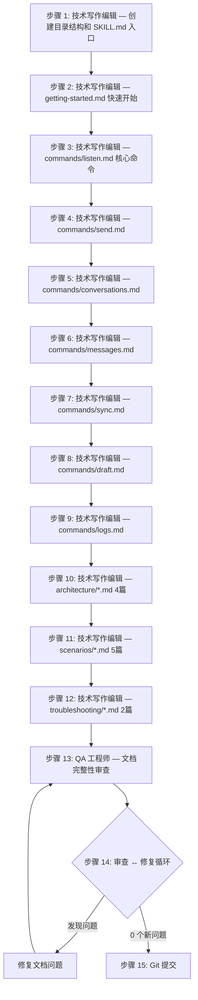

中文和我沟通。任务执行过程中，如果必须询问我，就来问我。
子代理驱动，串行执行，你作为子代理调度者。注意润色提示词，保证上下文充分完整。子代理必须频繁使用 TodoWrite tool。子代理必须阅读并了解 `docs/PRODUCT_DECISIONS.md`。

---

## 任务概述

为 xyncra-client CLI 工具创建完整的 SKILL 文档结构（`.claude/skills/xyncra-client-usage/`），教会 Claude Code 子代理如何安装、配置和使用 xyncra-client 的全部 14 个命令，涵盖架构说明、使用场景和故障排查。

## 工作流程



## 背景上下文

### 当前状态

- xyncra-client 的详细设计文档已完成：`docs/plans/2026-07-08-xyncra-client-design.md`
- 设计文档第 8 章明确定义了 SKILL 文档结构的目录和内容要求
- xyncra-client 代码尚未实现（本文档先于代码编写，为后续开发和测试提供指导）
- 项目已有多个 SKILL（参考 `.claude/skills/xyncra-task-planner/SKILL.md` 了解 SKILL 格式规范）

### 相关文件

| 文件 | 用途 |
|------|------|
| `docs/plans/2026-07-08-xyncra-client-design.md` | 客户端设计文档（命令定义、架构、数据模型） |
| `docs/PRODUCT_DECISIONS.md` | 产品决策文档（D-001~D-019） |
| `.claude/skills/xyncra-task-planner/SKILL.md` | SKILL 格式参考 |
| `pkg/protocol/protocol.go` | 协议定义（Package/Request/Response/Updates） |
| `internal/server/websocket_handler.go` | 已注册的 12 个 RPC 方法 |

### 关键产品决策（与客户端相关）

| 编号 | 决策 | 对文档的影响 |
|------|------|-------------|
| D-001 | 开箱即用，零配置 | 文档需强调默认配置的便利性 |
| D-002 | 认证由业务服务器负责 | 文档说明 `--user-id` 是开发便利设计 |
| D-006 | client_message_id 幂等性 | send 命令文档需说明幂等性机制 |
| D-008 | MessageID uint32 递增 | 消息排序和分页游标的文档说明 |
| D-009 | sync_updates 分页 | sync 命令文档需说明 after_seq + limit 模型 |
| D-010 | 被动续期策略 | listen 命令文档需说明 heartbeat 重要性 |
| D-011 | create_conversation 幂等 | 创建会话文档需说明 find-or-create 行为 |
| D-012 | mark_as_read MAX 语义 | 已读标记文档需说明只向前推进 |
| D-013 | delete_conversation 级联软删除 | 删除会话文档需说明级联行为和恢复方式 |
| D-014 | delete_message 发送者权限 | 删除消息文档需说明权限限制 |
| D-015 | restore_conversation 级联恢复 | 恢复会话文档需说明级联恢复行为 |

### 约束条件

1. 所有文档使用中文编写（面向中文开发团队）
2. 代码示例使用英文注释（与代码规范一致）
3. Markdown 格式必须规范（标题层级、代码块语言标注、链接有效性）
4. 每个命令文档必须包含：命令描述、参数列表、使用示例、输出示例、错误处理
5. 文档内容必须与设计文档 `2026-07-08-xyncra-client-design.md` 严格一致
6. SKILL 文档面向 Claude Code 子代理，需要足够详细以支撑自动化测试

---

## 详细实现步骤

### 步骤 1：创建目录结构和 SKILL.md 入口

- **子代理角色**：技术写作编辑
- **任务**：创建 `.claude/skills/xyncra-client-usage/` 完整目录结构，编写 SKILL.md 入口文件
- **文件路径**：
  ```
  .claude/skills/xyncra-client-usage/
  ├── SKILL.md
  └── references/
      ├── getting-started.md      （占位）
      ├── commands/
      │   ├── listen.md            （占位）
      │   ├── send.md              （占位）
      │   ├── conversations.md     （占位）
      │   ├── messages.md          （占位）
      │   ├── sync.md              （占位）
      │   ├── draft.md             （占位）
      │   └── logs.md              （占位）
      ├── architecture/
      │   ├── overview.md          （占位）
      │   ├── database.md          （占位）
      │   ├── ipc.md               （占位）
      │   └── logging.md           （占位）
      ├── scenarios/
      │   ├── basic-usage.md       （占位）
      │   ├── multi-device.md      （占位）
      │   ├── offline-sync.md      （占位）
      │   ├── error-handling.md    （占位）
      │   └── advanced.md          （占位）
      └── troubleshooting/
          ├── common-issues.md     （占位）
          └── debugging.md         （占位）
  ```

- **SKILL.md 内容模板**：

  ```markdown
  ---
  name: xyncra-client-usage
  description: >
    Xyncra Client 使用指南 — 教会 Claude Code 如何安装、配置和使用 xyncra-client CLI 工具。
    覆盖全部 14 个命令（listen、send、conversations、messages、sync、draft、logs 等），
    包含架构说明、使用场景最佳实践和故障排查指南。
    当用户需要测试 xyncra-client、调试消息同步、或验证 CLI 行为时使用此技能。
  ---
  
  # Xyncra Client Usage Skill
  
  本 SKILL 教你如何使用 xyncra-client CLI 工具。
  
  xyncra-client 是 Xyncra 消息系统的命令行客户端，支持：
  - 实时消息监听（WebSocket 长连接）
  - 消息发送和管理
  - 会话管理（创建、删除、恢复）
  - 增量同步（离线消息拉取）
  - 草稿管理
  - RPC 日志查询、聚合、导出
  
  ## 快速开始
  
  - [getting-started.md](references/getting-started.md) - 安装、配置、第一次使用
  
  ## 命令参考
  
  - [listen.md](references/commands/listen.md) - 长连接监听（核心命令）
  - [send.md](references/commands/send.md) - 发送消息
  - [conversations.md](references/commands/conversations.md) - 会话管理
  - [messages.md](references/commands/messages.md) - 消息操作
  - [sync.md](references/commands/sync.md) - 增量同步
  - [draft.md](references/commands/draft.md) - 草稿管理
  - [logs.md](references/commands/logs.md) - 日志查询、聚合、导出
  
  ## 架构说明
  
  - [overview.md](references/architecture/overview.md) - 架构概述
  - [database.md](references/architecture/database.md) - 本地数据库
  - [ipc.md](references/architecture/ipc.md) - 进程间通信
  - [logging.md](references/architecture/logging.md) - 日志和通知
  
  ## 使用场景
  
  - [basic-usage.md](references/scenarios/basic-usage.md) - 基础使用
  - [multi-device.md](references/scenarios/multi-device.md) - 多设备同步
  - [offline-sync.md](references/scenarios/offline-sync.md) - 离线同步
  - [error-handling.md](references/scenarios/error-handling.md) - 错误处理
  - [advanced.md](references/scenarios/advanced.md) - 高级用法
  
  ## 故障排查
  
  - [common-issues.md](references/troubleshooting/common-issues.md) - 常见问题
  - [debugging.md](references/troubleshooting/debugging.md) - 调试指南
  ```

- **注意事项**：
  - SKILL.md 的 frontmatter（`---` 之间的 YAML）必须包含 `name` 和 `description`
  - 所有链接使用相对路径
  - 目录结构中的占位文件后续步骤逐步填充

### 步骤 2：编写 getting-started.md

- **子代理角色**：技术写作编辑
- **文件路径**：`.claude/skills/xyncra-client-usage/references/getting-started.md`
- **实现内容**：

  ```markdown
  # 快速开始
  
  ## 前置条件
  
  - Go 1.21+
  - Xyncra Server 运行中（参考服务器文档）
  - Redis 运行中（服务器依赖）
  
  ## 安装
  
  ```bash
  # 从源码构建
  cd xyncra-server
  go build -o xyncra-client ./cmd/xyncra-client/
  
  # 或直接运行
  go run cmd/xyncra-client/main.go <command>
  ```
  
  ## 全局参数
  
  所有命令共享以下全局参数：
  
  | 参数 | 简写 | 说明 | 默认值 |
  |------|------|------|--------|
  | `--user-id` | `-u` | 用户 ID（必填） | 无 |
  | `--device-id` | | 设备 ID | 主机名 |
  | `--server` | `-s` | 服务器 URL | `ws://localhost:8080/ws` |
  | `--log-dir` | | 日志目录 | `~/.xyncra/{user_id}/{device_id}/logs/` |
  
  ## 第一次使用
  
  ### 1. 启动监听（守护进程模式）
  
  ```bash
  go run cmd/xyncra-client/main.go listen \
    --user-id alice \
    --server ws://localhost:8080/ws
  ```
  
  listen 命令会：
  - 建立 WebSocket 长连接
  - 自动同步离线消息
  - 每 30 秒发送心跳
  - 接收并显示实时消息
  
  **重要**：保持此终端运行，打开新终端执行其他命令。
  
  ### 2. 创建会话（新终端）
  
  ```bash
  go run cmd/xyncra-client/main.go create-conversation \
    --user-id alice \
    --user-id bob
  ```
  
  > 注意：create-conversation 使用 find-or-create 模式（D-011），
  > 如果 alice 和 bob 之间已有会话，直接返回已有会话。
  
  ### 3. 发送消息
  
  ```bash
  go run cmd/xyncra-client/main.go send \
    --user-id alice \
    --conversation-id <conv-id> \
    --content "Hello, Bob!"
  ```
  
  ### 4. 查看消息历史
  
  ```bash
  go run cmd/xyncra-client/main.go get-messages \
    --user-id alice \
    --conversation-id <conv-id>
  ```
  
  ## 两种运行模式
  
  ### 守护进程模式（推荐）
  
  先启动 `listen` 命令，其他命令通过 Unix Socket 复用 listen 的 WebSocket 连接。
  
  - 优势：单连接、高效、可接收实时推送
  - Unix Socket 路径：`~/.xyncra/{user_id}/{device_id}/xyncra.sock`
  
  ### 独立模式（自动 fallback）
  
  如果 `listen` 未运行，其他命令直接建立 WebSocket 短连接。
  
  - 劣势：短连接、无法接收实时推送、性能较差
  - 模式切换自动检测，无需用户干预
  
  ## 数据文件位置
  
  | 文件 | 路径 |
  |------|------|
  | SQLite 数据库 | `~/.xyncra/{user_id}/{device_id}/xyncra.db` |
  | Unix Socket | `~/.xyncra/{user_id}/{device_id}/xyncra.sock` |
  | 进程锁 | `~/.xyncra/{user_id}/{device_id}/xyncra.lock` |
  | RPC 日志 | SQLite `rpc_logs` 表 |
  | 通知日志 | SQLite `notifications` 表 |
  
  ## 下一步
  
  - 了解每个命令的详细用法：[命令参考](../SKILL.md#命令参考)
  - 了解架构设计：[架构概述](architecture/overview.md)
  - 查看使用场景：[基础使用](scenarios/basic-usage.md)
  ```

- **注意事项**：
  - 代码示例使用 `go run cmd/xyncra-client/main.go` 格式（开发阶段）
  - 明确说明两种运行模式的区别
  - 引用相关的产品决策编号（如 D-011）

### 步骤 3：编写 commands/listen.md

- **子代理角色**：技术写作编辑
- **文件路径**：`.claude/skills/xyncra-client-usage/references/commands/listen.md`
- **实现内容**：listen 命令是最核心的命令，需要详细说明。内容应包括：
  - 命令描述：建立 WebSocket 长连接，作为守护进程运行
  - 参数列表：`--user-id`, `--device-id`, `--server`, `--log-dir`
  - 行为说明：
    - 获取进程锁（防止重复启动）
    - 初始化数据库（GORM AutoMigrate）
    - 建立 WebSocket 连接
    - 自动同步（拉取离线 Updates）
    - 启动心跳（每 30 秒）
    - 启动重试队列轮询（每 1 秒）
    - 启动日志自动清理（每 1 小时）
    - 接收消息并处理（ApplyUpdate 逻辑）
    - 输出到控制台 + 写入 SQLite 日志表
    - Ctrl+C 优雅退出
  - 使用示例
  - 输出示例（控制台格式化输出）
  - 错误处理：进程锁冲突、连接失败、同步失败
  - 关键设计决策：D-010（被动续期）、D-020（单连接保证）
  - 注意事项：必须先启动 listen 才能使用守护进程模式

### 步骤 4：编写 commands/send.md

- **子代理角色**：技术写作编辑
- **文件路径**：`.claude/skills/xyncra-client-usage/references/commands/send.md`
- **实现内容**：
  - 参数：`--conversation-id`, `--content`, `--type`（默认 text）, `--reply-to`
  - 行为：初始化数据库 → 连接 listen（Unix Socket）→ 发送 RPC → 输出结果
  - 幂等性说明（D-006）：client_message_id 自动生成 UUID，重复发送返回 duplicate=true
  - 输出示例
  - 错误处理：会话不存在、连接失败
  - Fallback 模式说明（listen 未运行时直接 WebSocket）

### 步骤 5：编写 commands/conversations.md

- **子代理角色**：技术写作编辑
- **文件路径**：`.claude/skills/xyncra-client-usage/references/commands/conversations.md`
- **实现内容**：覆盖 5 个会话管理命令
  - `list-conversations`：`--offset`, `--limit`，分页输出
  - `create-conversation`：`--user-id`（对方）, `--title`，find-or-create（D-011）
  - `get-conversation`：`--conversation-id`，详情输出
  - `delete-conversation`：`--conversation-id`，级联软删除（D-013），双方会话都消失
  - `restore-conversation`：`--conversation-id`，级联恢复（D-015）

### 步骤 6：编写 commands/messages.md

- **子代理角色**：技术写作编辑
- **文件路径**：`.claude/skills/xyncra-client-usage/references/commands/messages.md`
- **实现内容**：覆盖 4 个消息操作命令
  - `get-messages`：`--conversation-id`, `--after-message-id`, `--limit`，游标分页（D-008）
  - `search-messages`：`--conversation-id`, `--query`, `--after-message-id`, `--limit`
  - `delete-message`：`--message-id`，仅发送者可删除（D-014）
  - `mark-as-read`：`--conversation-id`, `--message-id`，MAX 语义（D-012）

### 步骤 7：编写 commands/sync.md

- **子代理角色**：技术写作编辑
- **文件路径**：`.claude/skills/xyncra-client-usage/references/commands/sync.md`
- **实现内容**：
  - `sync-updates` 命令：手动触发增量同步
  - 参数说明：通过 listen 进程（Unix Socket）调用 sync_updates RPC
  - 分页模型（D-009）：after_seq + limit
  - 自动同步说明：listen 启动时自动执行
  - 输出示例：同步了多少条 Updates，latest_seq 值

### 步骤 8：编写 commands/draft.md

- **子代理角色**：技术写作编辑
- **文件路径**：`.claude/skills/xyncra-client-usage/references/commands/draft.md`
- **实现内容**：3 个子命令
  - `draft save --conversation-id -c --content -m`
  - `draft get --conversation-id -c`
  - `draft delete --conversation-id -c`
  - 草稿存储在本地 SQLite（draft_store），不上传服务器

### 步骤 9：编写 commands/logs.md

- **子代理角色**：技术写作编辑
- **文件路径**：`.claude/skills/xyncra-client-usage/references/commands/logs.md`
- **实现内容**：5 个子命令，这是文档最复杂的命令页面
  - `logs tail`：`--type`(rpc|notifications), `--limit`, `--since`(30s/5m/1h/24h)
  - `logs search`：`--method`, `--error`, `--from/--to`(ISO 8601), `--conversation-id`, `--request-id`, `--limit`
  - `logs stats`：`--since`, `--interval`(1m/5m/10m/1h)，输出：总请求数、成功率、平均延迟、P95/P99、错误分布
  - `logs export`：`--format`(csv|json), `--output`, `--method`, `--from/--to`
  - `logs cleanup`：`--retain`(默认 7d), `--dry-run`
  - 每个子命令都需要完整的参数表、使用示例、输出示例

### 步骤 10：编写 architecture/*.md（4 篇）

- **子代理角色**：技术写作编辑
- **文件路径**：`.claude/skills/xyncra-client-usage/references/architecture/`

  **10.1 overview.md — 架构概述**
  - 三层架构：pkg/client（通信层）、pkg/store（数据层）、internal/cli（命令层）
  - 项目结构树（参考设计文档 2.1）
  - 数据流图（CLI → Unix Socket → listen → WebSocket → Server）
  - 职责分离说明

  **10.2 database.md — 本地数据库**
  - SQLite 数据库说明
  - GORM AutoMigrate（D-023）：每次运行自动迁移，零配置
  - 核心数据表：conversations, messages, sync_state, drafts, queue, rpc_logs, notifications
  - 数据模型字段说明（参考设计文档 4.5）
  - 数据库文件路径

  **10.3 ipc.md — 进程间通信**
  - Unix Socket：路径 `~/.xyncra/{user_id}/{device_id}/xyncra.sock`
  - JSON-RPC 2.0 协议
  - 请求/响应格式示例
  - 两种运行模式：守护进程 vs 独立模式
  - 通信流程图
  - 进程锁机制：`~/.xyncra/{user_id}/{device_id}/xyncra.lock`

  **10.4 logging.md — 日志和通知**
  - SQLite 日志存储（D-024）
  - rpc_logs 表结构（字段、索引）
  - notifications 表结构（字段、索引）
  - 写入策略（ApplyUpdate 时同步写入）
  - 日志轮转策略（默认保留 7 天，每小时自动清理）
  - 控制台输出格式

### 步骤 11：编写 scenarios/*.md（5 篇）

- **子代理角色**：技术写作编辑
- **文件路径**：`.claude/skills/xyncra-client-usage/references/scenarios/`

  **11.1 basic-usage.md — 基础使用**
  - 完整的新用户上手流程
  - 两个用户（Alice、Bob）互相发消息
  - 创建会话 → 发送消息 → 查看历史 → 标记已读
  - 完整的命令序列和预期输出

  **11.2 multi-device.md — 多设备同步**
  - 场景：Alice 在手机和电脑上同时使用
  - 设备 A 发送 → 设备 B 通过 listen 接收
  - 设备 A 标记已读 → 设备 B 同步已读状态
  - 设备 A 删除消息 → 设备 B 同步删除
  - 关键：两个设备使用相同 user_id，不同 device_id

  **11.3 offline-sync.md — 离线同步**
  - 场景：设备离线一段时间后重连
  - listen 断开 → 恢复 → 自动拉取离线 Updates
  - 增量同步流程：after_seq 从上次位置开始
  - 防抖拉取机制说明（500ms 合并）
  - 大量消息同步（分页拉取，has_more 循环）

  **11.4 error-handling.md — 错误处理**
  - 各种错误场景和处理方式
  - 网络断开：自动重连（指数退避）
  - 服务器不可达：错误提示和建议
  - 进程锁冲突：listen 已在运行
  - 无效 user_id：连接被拒绝
  - 数据库损坏：错误提示和恢复建议
  - 错误码对照表（-100~-199 客户端、-200~-299 权限、-300~-399 服务端、-400~-499 客户端新增）

  **11.5 advanced.md — 高级用法**
  - 日志分析工作流
  - 性能调优参数
  - 自定义日志保留策略
  - 导出日志用于外部分析
  - 手动触发同步（调试用）
  - 重试队列管理

### 步骤 12：编写 troubleshooting/*.md（2 篇）

- **子代理角色**：技术写作编辑
- **文件路径**：`.claude/skills/xyncra-client-usage/references/troubleshooting/`

  **12.1 common-issues.md — 常见问题**
  - 按问题-原因-解决方案格式组织
  - 至少覆盖以下问题：
    - "listen 启动报错：进程锁已被占用"
    - "send 命令报错：Unix Socket 连接失败"
    - "消息收不到：服务器不可达"
    - "消息重复：幂等性说明"
    - "同步不工作：seq 间隙说明"
    - "数据库文件过大：日志清理"
  
  **12.2 debugging.md — 调试指南**
  - 使用 logs 命令调试
  - 查看 SQLite 数据库内容
  - 检查进程状态
  - 网络连接诊断
  - 调试模式（如果有的话）

### 步骤 13：文档完整性审查

- **子代理角色**：QA 工程师
- **任务**：审查所有已创建的文档，确保完整性和一致性
- **审查清单**：
  1. **结构完整性**：所有 20 个文件是否已创建并填充内容
  2. **链接有效性**：SKILL.md 中的所有链接是否指向正确文件
  3. **命令覆盖**：14 个命令是否全部有文档覆盖
  4. **参数一致性**：文档中的参数列表是否与设计文档一致
  5. **产品决策引用**：相关的产品决策编号是否正确引用
  6. **代码示例**：所有代码示例是否可执行（格式正确）
  7. **输出示例**：是否包含预期输出示例
  8. **错误处理**：每个命令是否包含错误场景说明
  9. **交叉引用**：文档之间的交叉链接是否正确

### 步骤 14：审查 ↔ 修复循环

> 进入循环。发现问题则修复后重新循环，直到没有新问题。

**每轮循环执行以下子步骤：**

1. **运行审查** — QA 工程师子代理检查上述 9 项审查清单
2. **汇总问题** — 收集所有发现的问题，去重合并
3. **判断是否退出循环**：
   - 如果本轮发现 0 个新问题 → **退出循环**，进入步骤 15
   - 如果发现新问题 → 调度技术写作编辑子代理逐一修复，然后**回到第 1 步重新循环**

**约束：**
- 每轮修复后必须重新审查，不能跳过
- 同一问题连续出现 2 轮未修复，标记为阻塞项，询问用户
- 循环次数记录在 TodoWrite 中

### 步骤 15：Git 提交

1. **检查变更**
   - `git status` 确认所有新增文件
   - 确认没有遗留临时文件

2. **提交**
   - `git add .claude/skills/xyncra-client-usage/`
   - Commit message: `docs(client): add xyncra-client SKILL documentation structure`

---

## 设计决策

### D-027（实现级）：SKILL 文档使用中文

- **决策**：所有 SKILL 文档内容使用中文编写
- **理由**：团队使用中文沟通，设计文档也是中文，保持一致性
- **例外**：代码示例中的注释使用英文（与代码规范一致）

### D-028（实现级）：命令文档按功能分组

- **决策**：`commands/` 目录下，相关命令合并到同一文件
  - `conversations.md` 覆盖 5 个会话命令（list/create/get/delete/restore）
  - `messages.md` 覆盖 4 个消息命令（get/search/delete/mark-as-read）
  - `logs.md` 覆盖 5 个日志子命令（tail/search/stats/export/cleanup）
  - `draft.md` 覆盖 3 个草稿子命令（save/get/delete）
- **理由**：减少文件数量，按使用场景组织更符合 LLM 查阅习惯
- **对照**：设计文档 8.2 的目录结构已经采用此分组方式

### D-029（实现级）：文档面向 Claude Code 子代理

- **决策**：文档的首要读者是 Claude Code 子代理（而非人类开发者）
- **理由**：
  - 子代理需要明确的参数列表和类型信息
  - 子代理需要知道预期输出格式以判断命令是否成功
  - 子代理需要错误场景说明以处理异常情况
  - 子代理需要完整的命令示例以直接执行
- **影响**：
  - 每个命令必须包含完整的参数表（名称、类型、默认值、是否必填）
  - 每个命令必须包含预期输出示例（控制台 + 日志）
  - 每个命令必须包含错误场景和错误信息示例
  - 使用场景文档需要包含可执行的命令序列

---

## 代码规范

- Markdown 格式规范：
  - 标题层级：`#` 仅用于文件名标题，内容从 `##` 开始
  - 代码块标注语言（`bash`, `json`, `go`, `text`）
  - 表格对齐
  - 链接使用相对路径
- 文档内容规范：
  - 中文正文，英文代码注释
  - 参数名称使用反引号包裹（`--user-id`）
  - 产品决策引用格式：`（D-xxx）`
  - 文件名与内容标题一致

---

## 测试要点

由于这是纯文档任务，测试重点在于文档质量而非功能验证：

1. **结构测试**：验证目录结构和文件数量（20 个文件）
2. **链接测试**：验证所有 Markdown 链接指向存在的文件
3. **内容测试**：抽查关键命令文档的参数列表与设计文档一致
4. **格式测试**：验证 Markdown 格式正确（标题层级、代码块、表格）
5. **完整性测试**：14 个命令全部有对应文档覆盖

### 验收标准

- [ ] `.claude/skills/xyncra-client-usage/SKILL.md` 包含有效的 frontmatter 和完整目录
- [ ] `references/` 下共 20 个 Markdown 文件
- [ ] 每个命令文档包含：参数表、使用示例、输出示例、错误处理
- [ ] SKILL.md 中所有链接可解析（指向存在的文件）
- [ ] 设计文档中定义的 14 个命令全部有文档
- [ ] 架构文档覆盖 4 个主题（overview/database/ipc/logging）
- [ ] 场景文档覆盖 5 个场景
- [ ] 故障排查文档覆盖常见问题和调试指南
- [ ] 产品决策引用准确（D-001~D-026 相关决策）

---

## 注意事项

1. **设计文档为准**：所有命令参数、行为描述必须与 `docs/plans/2026-07-08-xyncra-client-design.md` 严格一致。如有歧义，以设计文档为准。

2. **不要假设代码已实现**：xyncra-client 代码尚未实现，文档是为未来的开发和测试做准备。文档中描述的是预期行为。

3. **保持一致的术语**：
   - "Update"（大写 U）指服务器推送的增量更新
   - "ApplyUpdate" 指客户端处理单个 Update 的方法
   - "ApplyUpdates" 指批量处理入口
   - "seq" 指序列号（uint32 递增）
   - "local_max_seq" 指客户端已处理的最大 seq
   - "latest_seq" 指服务器全局最新 seq

4. **SKILL 格式要求**：SKILL.md 必须有 YAML frontmatter（`name` 和 `description` 字段），这是 Claude Code 识别 SKILL 的必要条件。

5. **面向 LLM 优化**：文档的首要读者是 Claude Code 子代理。确保信息密度高、结构清晰、可解析性强。避免含糊的描述，使用具体的参数名和值。

6. **文件路径注意**：所有文件创建在项目根目录下的 `.claude/skills/xyncra-client-usage/` 中，不是在 `docs/` 目录下。
