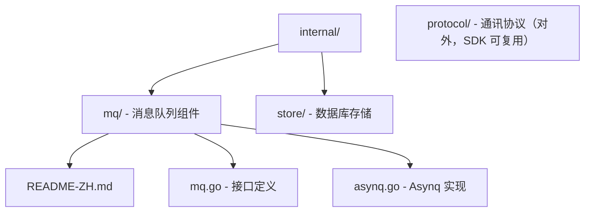
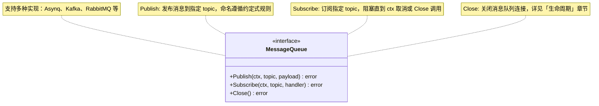
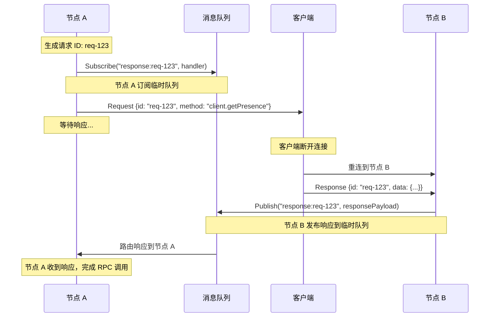
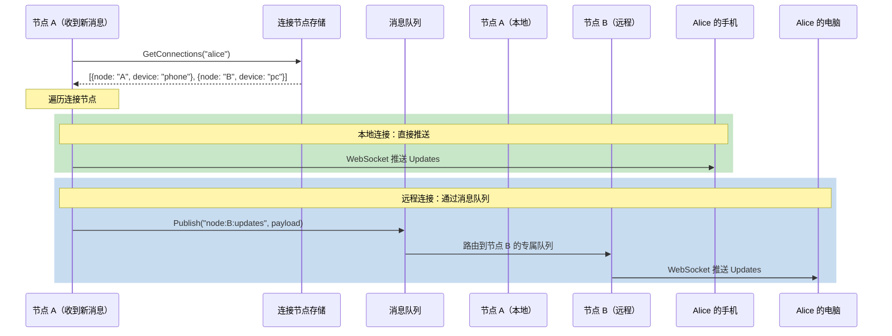
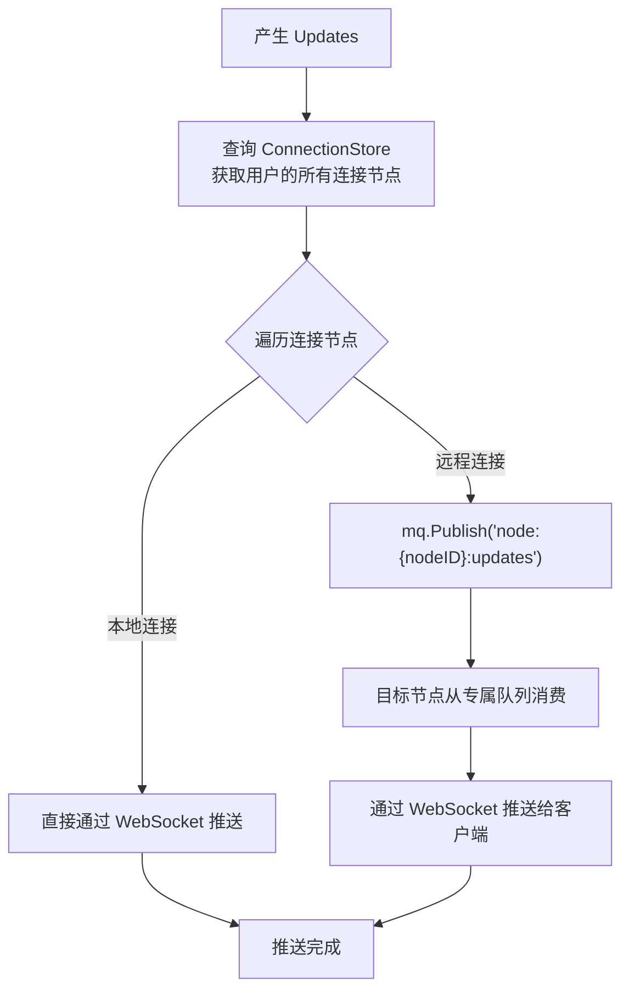
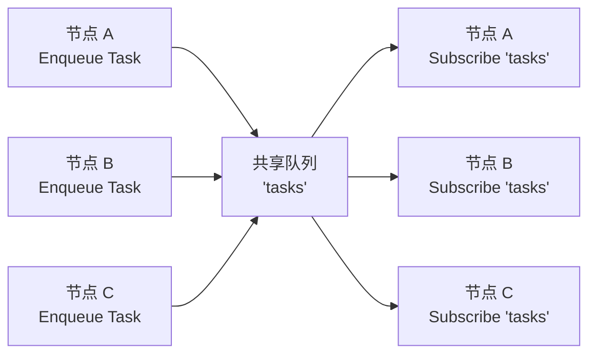
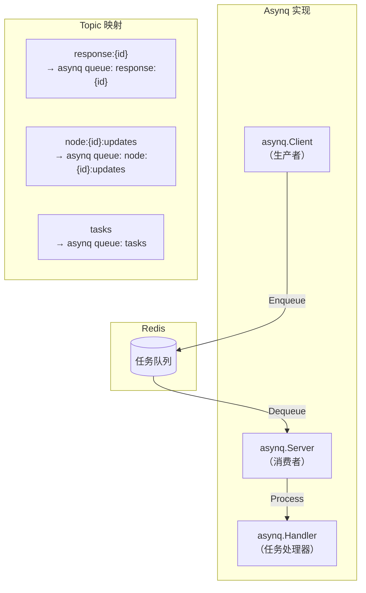
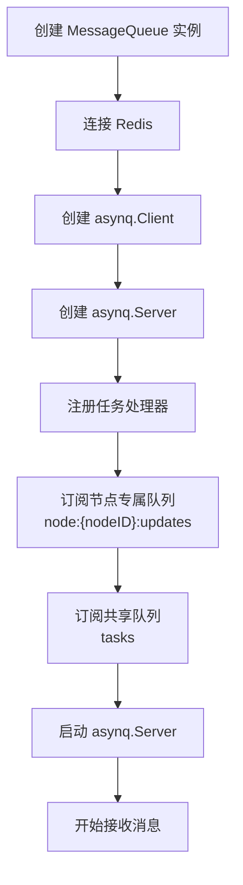
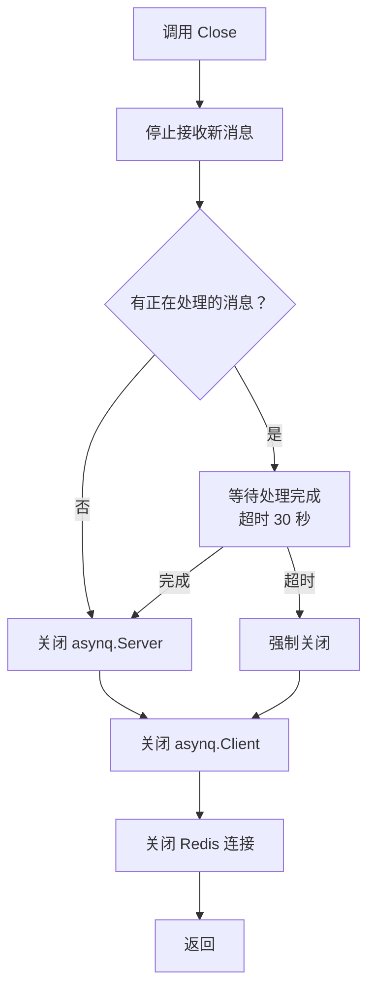

# 消息队列组件设计文档

## 概述

消息队列是 Xyncra 分布式即时通讯系统的核心基础设施，用于解决以下问题：

1. **RPC 响应路由**：在分布式环境下，服务端向客户端发起 RPC 调用后，客户端可能断开并重连到其他节点，消息队列负责将响应路由回发起请求的节点
2. **远程 Updates 推送**：当用户多设备登录分布在不同节点时，通过消息队列将 Updates 转发到目标节点
3. **通用异步任务**：支持通用的异步任务处理

本组件采用**抽象接口 + 多实现**的设计模式，第一步实现 Asynq（基于 Redis 的任务队列）。

## 设计决策

| 决策项 | 选择 | 原因 |
| --- | --- | --- |
| 消息模式 | 单体订阅（point-to-point） | 所有场景都是主动订阅，不需要广播模式 |
| 消息格式 | 简单 Payload（topic + []byte） | 最小化抽象，业务层自行序列化 |
| 接口粒度 | 统一接口（Publish + Subscribe + Close） | 简单直观，适合大多数场景 |
| Topic 命名 | 约定式命名 | Topic 名称隐含用途，无需额外声明 |
| 底层实现 | Asynq（第一步） | 成熟稳定，支持重试、延迟任务、唯一任务等特性 |

### 关于广播模式的决策

**决策：不支持广播模式。**

当需要向用户的所有在线设备推送 Updates 时，采用以下流程：

1. 查询连接节点存储，获取用户的所有连接节点
2. 遍历连接节点：
   - 本地连接：直接通过 WebSocket 推送
   - 远程连接：通过消息队列发送到目标节点的专属队列

这样避免了消息队列的广播模式，简化了设计。

## 目录结构



## 接口设计

### MessageQueue 接口



### Topic 命名约定

| Topic 格式 | 用途 | 队列类型 | 示例 |
| --- | --- | --- | --- |
| `response:{requestID}` | RPC 响应路由 | 临时队列 | `response:550e8400-e29b-41d4-a716-446655440000` |
| `node:{nodeID}:updates` | 远程 Updates 推送 | 节点专属队列 | `node:node-A:updates` |
| `tasks` | 通用异步任务 | 共享队列 | `tasks` |

**命名规则说明**：

- **临时队列**（`response:{requestID}`）：每个 RPC 请求创建一个临时队列，请求完成后销毁。只有发起请求的节点订阅此队列。
- **节点专属队列**（`node:{nodeID}:updates`）：每个节点在启动时创建并订阅自己的专属队列，用于接收远程 Updates。
- **共享队列**（`tasks`）：所有节点竞争消费，任务只会被一个节点处理。

## 使用场景

### 场景 1：RPC 响应路由

**问题**：分布式环境下，服务端节点 A 向客户端发起 RPC 调用，等待响应期间客户端断开并重连到节点 B，响应被发送给了节点 B，但节点 A 在等待响应。

**解决方案**：通过消息队列的临时队列将响应路由回发起请求的节点。



**关键流程**：

1. 节点 A 发送 Request 前，订阅临时队列 `response:{requestID}`
2. 客户端断开后重连到节点 B，发送 Response
3. 节点 B 收到 Response 后，发布到 `response:{requestID}` 临时队列
4. 只有节点 A 在订阅这个队列，响应被精确路由回节点 A
5. 请求完成后，临时队列自动销毁

### 场景 2：远程 Updates 推送

**问题**：用户 Alice 在两个设备登录，手机连接节点 A，电脑连接节点 B。当有新消息时，需要推送给两个设备。

**解决方案**：查询连接节点存储，遍历推送（本地直接推送，远程通过消息队列转发）。



**完整流程图**：



### 场景 3：通用异步任务

**问题**：需要处理异步任务（如邮件发送、日志处理、数据同步等），任务只被一个节点处理。

**解决方案**：所有节点竞争消费共享队列 `tasks`。



> **注意**：任务只会被一个节点消费（竞争消费模式）

## Asynq 实现

### 简介

Asynq 是基于 Redis 的分布式任务队列库，提供以下特性：

- 任务队列（point-to-point）
- 自动重试
- 延迟任务
- 唯一任务（去重）
- 优先级队列
- 任务监控

### 架构



### Topic 到 Asynq 队列的映射

| Topic | Asynq 队列名 | Asynq 任务类型 | 说明 |
| --- | --- | --- | --- |
| `response:{requestID}` | `response:{requestID}` | `response` | 临时队列，每个请求一个 |
| `node:{nodeID}:updates` | `node:{nodeID}:updates` | `remote-update` | 节点专属队列 |
| `tasks` | `tasks` | 动态（根据 payload） | 共享队列 |

### Publish 实现逻辑

```text
FUNCTION Publish(topic, payload):
    task = createAsynqTask(type=topic, payload=payload)
    options = []

    IF topic starts with "response:":
        # 临时队列：设置 TTL，防止无人消费时堆积
        options.append(retention = 5 minutes)

    err = client.enqueue(task, options)
    RETURN err
```

### Subscribe 实现逻辑

```text
FUNCTION Subscribe(topic, handler):
    # 注册 asynq handler，将 asynq 任务转换为统一接口
    mux.handleFunc(topic, func(task):
        RETURN handler(ctx, task.type, task.payload)
    )

    # 启动 server，监听指定队列
    # 注意：asynq.Server 启动时会监听所有注册 handler 的队列
    RETURN server.start(ctx)
```

## 生命周期管理

### 启动流程



### 关闭流程



### 生命周期规则

| 规则 | 说明 |
| --- | --- |
| **初始化顺序** | 先创建 Client，再创建 Server |
| **关闭顺序** | 先关闭 Server，再关闭 Client |
| **优雅关闭** | Close 会等待正在处理的消息完成（默认超时 30 秒） |
| **重复关闭** | Close 可以安全地多次调用，不会 panic |
| **关闭后调用** | Close 后调用 Publish 或 Subscribe 返回 `ErrClosed` 错误 |
| **Subscribe 阻塞** | Subscribe 是阻塞的，直到 ctx 被取消或 Close 被调用 |
| **临时队列清理** | `response:{requestID}` 临时队列在 TTL 后自动清理（Asynq Retention） |

### Context 使用规范

```text
# 场景 1：带超时的 Publish
ctx = withTimeout(background(), timeout=5 seconds)
defer cancel()
err = mq.Publish(ctx, topic, payload)

# 场景 2：可取消的 Subscribe
ctx = withCancel(background())
SPAWN goroutine:
    err = mq.Subscribe(ctx, topic, handler)
    # err 可能是 nil（正常取消）或实际错误
# 需要停止时：
cancel()

# 场景 3：优雅关闭
ctx = background()
err = mq.Close()  # 等待正在处理的消息完成
```

## 错误处理

### 错误类型

```text
DEFINE errors:
    ErrClosed       = "mq: queue is closed"
    ErrTimeout      = "mq: operation timeout"
    ErrInvalidTopic = "mq: invalid topic format"
```

### 重试策略

| 场景 | 重试策略 | 说明 |
| --- | --- | --- |
| RPC 响应 | 不重试 | 响应是幂等的，重复处理可能导致错误 |
| 远程 Updates | 重试 3 次 | 保证 Updates 最终送达 |
| 通用异步任务 | 可配置 | 由业务层决定重试策略 |

### 错误处理示例

```text
# Publish 错误处理
err = mq.Publish(ctx, topic, payload)
IF err != nil:
    IF err is ErrClosed:
        # 队列已关闭，忽略或记录日志
        RETURN
    IF err is ErrTimeout:
        # 超时，可以重试或返回错误
        RETURN ErrTimeout
    # 其他错误
    RETURN err

# Subscribe handler 错误处理
FUNCTION handler(ctx, topic, payload):
    err = processMessage(payload)
    IF err != nil:
        # 返回 error，Asynq 会自动重试
        RETURN wrapError("process message", err)
    RETURN nil
```

## 配置

### Asynq 实现配置

```text
STRUCT AsynqConfig:
    # Redis 配置
    RedisAddr     string    # Redis 地址，如 "localhost:6379"
    RedisPassword string    # Redis 密码
    RedisDB       int       # Redis 数据库编号

    # 节点配置
    NodeID        string    # 当前节点 ID

    # 性能配置
    Concurrency   int       # 并发处理数，默认 10
    MaxRetries    int       # 最大重试次数，默认 3

    # 超时配置
    CloseTimeout  duration  # Close 等待超时，默认 30 秒
```

## 测试

### 单元测试

```text
FUNCTION TestPublishSubscribe():
    mq = NewAsynqMQ(config={
        RedisAddr: "localhost:6379",
        NodeID: "test-node"
    })
    DEFER mq.Close()

    ctx = background()

    # 订阅
    received = channel(capacity=1)
    SPAWN goroutine:
        mq.Subscribe(ctx, "test-topic", handler):
            received <- payload
            RETURN nil

    # 发布
    err = mq.Publish(ctx, "test-topic", payload="hello")
    ASSERT err == nil

    # 验证
    AWAIT received OR timeout(5 seconds)
    ASSERT received == "hello"
```

### 集成测试

```text
FUNCTION TestRPCResponseRouting():
    # 模拟分布式环境
    mqA = NewAsynqMQ(config={NodeID: "A"})
    mqB = NewAsynqMQ(config={NodeID: "B"})
    DEFER mqA.Close()
    DEFER mqB.Close()

    # 节点 A 订阅临时队列
    responseCh = channel(capacity=1)
    SPAWN goroutine:
        mqA.Subscribe(ctx, "response:req-123", handler):
            responseCh <- payload
            RETURN nil

    # 节点 B 发布响应
    SPAWN goroutine:
        mqB.Publish(ctx, "response:req-123", payload="response-data")

    # 验证：节点 A 收到响应
    AWAIT responseCh OR timeout(5 seconds)
    ASSERT responseCh == "response-data"
```
