# WebSocket 服务器组件设计文档

## 概述

WebSocket 服务器是 Xyncra 分布式即时通讯系统的核心通讯组件，负责：

1. **管理客户端连接**：处理 WebSocket 连接的建立、维护和断开
2. **双向 RPC 通讯**：实现客户端与服务端之间的双向 RPC 调用
3. **Updates 推送**：向客户端推送数据同步事件
4. **分布式协调**：在分布式环境下管理用户连接信息

本组件采用**内存存储 + 持久化注册表**的设计模式，支持水平扩展。

## 设计决策

| 决策项 | 选择 | 原因 |
| --- | --- | --- |
| 传输层 | 仅 WebSocket | 浏览器原生支持，防火墙友好，适合 Web 和移动端 |
| 认证方式 | URL 参数（user_id, device_id） | 不做鉴权，由反向代理处理，服务器代码简洁 |
| 内存连接存储 | 双层 Map（byID + byUser） | 支持按连接 ID 和用户 ID 快速查询 |
| 持久化存储 | 实时同步，简单注册表接口 | 用于分布式查询用户连接所在节点 |
| Keepalive | Request/Response 机制（ping 方法） | 使用统一协议，客户端和服务端都支持 |
| 连接限制 | 不限制 | 由反向代理或负载均衡器控制 |

### 关于认证的决策

**决策：服务器不做鉴权，由反向代理处理。**

- 用户 ID 和设备 ID 通过 URL 参数传递：`ws://server/ws?user_id=alice&device_id=phone-001`
- 反向代理（如 nginx、Kong 等）负责验证用户身份
- 服务器信任反向代理传递的参数
- 使用者可以灵活选择自己的鉴权方案（JWT、OAuth、自定义等）

## 目录结构

```text
internal/
  server/                # WebSocket 服务器组件
    README-ZH.md         # 本文档
    server.go            # 服务器主逻辑
    connection.go        # 连接管理
    store.go             # 内存连接存储
    registry.go          # 持久化注册表接口
  mq/                    # 消息队列组件
  store/                 # 数据库存储
protocol/                # 通讯协议（对外，SDK 可复用）
```

## 核心组件

### Server（服务器）

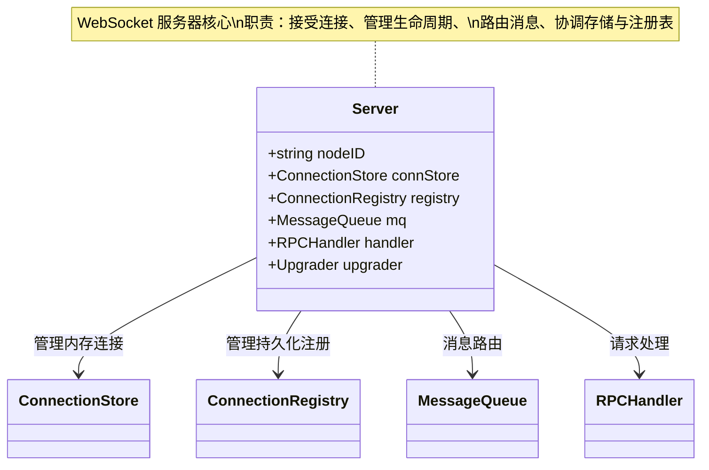

**职责**：

- 接受 WebSocket 连接
- 管理连接生命周期
- 路由消息到 RPC 处理器
- 协调内存存储和持久化注册表

### ConnectionStore（内存连接存储）

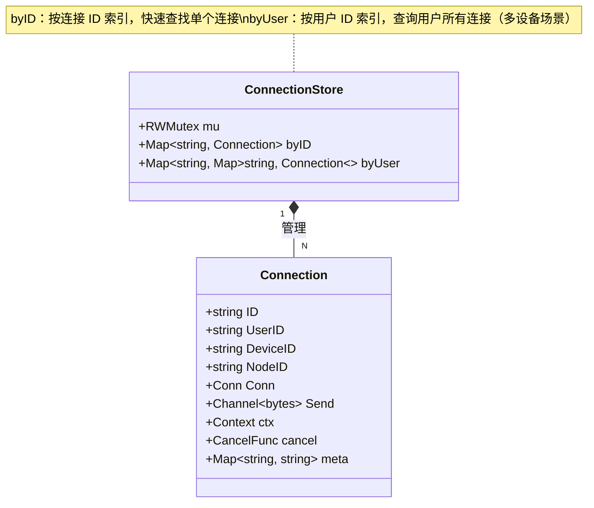

**核心方法**：

```text
FUNCTION Add(conn):
    LOCK store
    byID[conn.ID] = conn
    IF byUser[conn.UserID] is nil:
        byUser[conn.UserID] = new empty map
    byUser[conn.UserID][conn.ID] = conn

FUNCTION Remove(connID):
    LOCK store
    conn = byID[connID]
    IF conn not found:
        RETURN
    DELETE byID[connID]
    DELETE byUser[conn.UserID][connID]
    IF byUser[conn.UserID] is empty:
        DELETE byUser[conn.UserID]

FUNCTION Get(connID) -> Connection:
    READ LOCK store
    RETURN byID[connID]

FUNCTION GetUserConnections(userID) -> List of Connection:
    READ LOCK store
    IF byUser[userID] not found:
        RETURN empty list
    RETURN all connections in byUser[userID]
```

### ConnectionRegistry（持久化注册表）

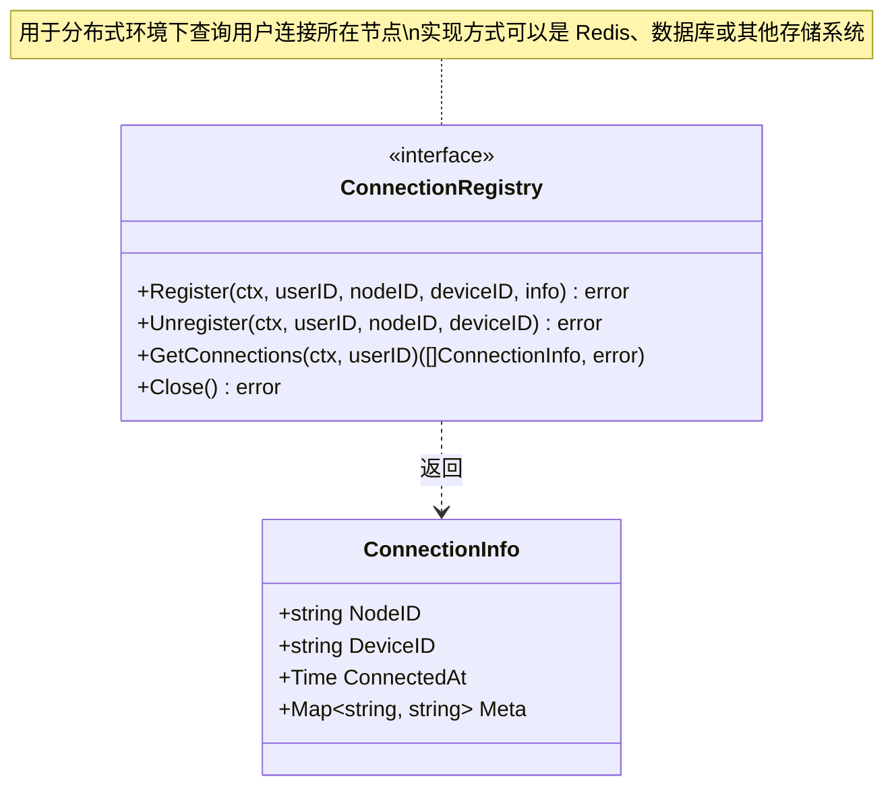

**Redis 实现伪代码**：

```text
// Redis 注册表实现
STRUCT RedisRegistry:
    client: RedisClient

FUNCTION Register(userID, nodeID, deviceID, info):
    key = "user:{userID}:connections"
    field = "{nodeID}:{deviceID}"
    data = JSON.serialize(info)
    RETURN client.HSET(key, field, data)

FUNCTION Unregister(userID, nodeID, deviceID):
    key = "user:{userID}:connections"
    field = "{nodeID}:{deviceID}"
    RETURN client.HDEL(key, field)

FUNCTION GetConnections(userID) -> List of ConnectionInfo:
    key = "user:{userID}:connections"
    result = client.HGETALL(key)
    connections = []
    FOR EACH data IN result:
        info = JSON.deserialize(data)
        connections.APPEND(info)
    RETURN connections
```

## 连接生命周期

### 建立流程

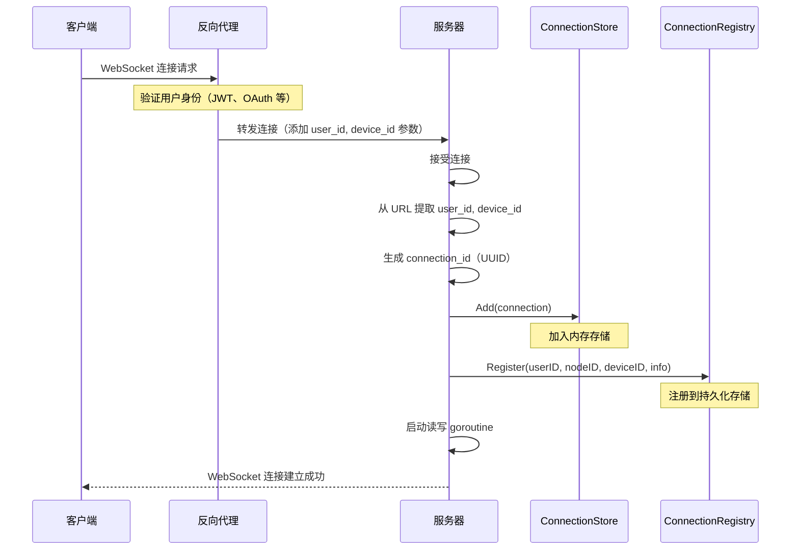

### 活跃状态

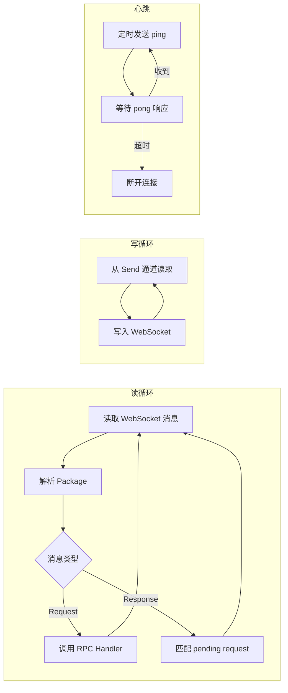

### 断开流程

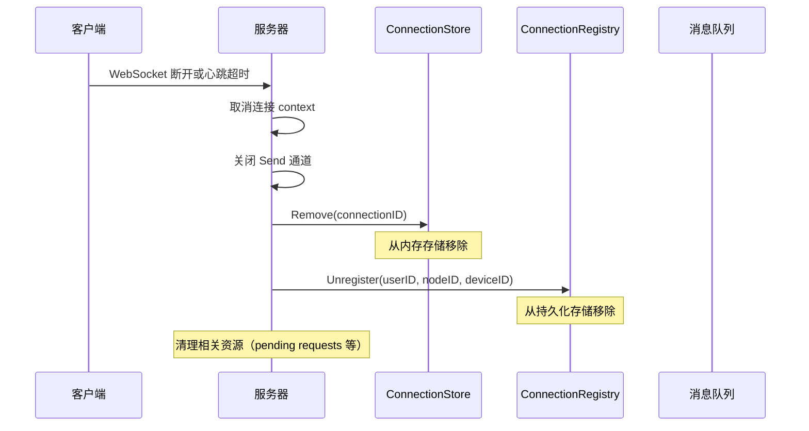

## Keepalive 机制

### 设计原则

使用统一的 Request/Response 机制实现心跳，而不是 WebSocket 原生的 Ping/Pong：

- **客户端主动发送 `ping` 请求**（不是服务端发送）
- 服务端收到 `ping` 请求后，返回响应
- 客户端超时未收到响应，则认为连接断开，主动重连
- 服务端监控是否收到客户端的 `ping`，长时间未收到则认为连接断开

**为什么是客户端发送心跳？**

在分布式系统中，如果服务端向客户端发送 Request，而客户端已经断开并重连到其他节点，响应需要通过消息队列路由回原节点。这会导致：

1. 心跳机制依赖消息队列，形成循环依赖
2. 增加不必要的复杂性和延迟
3. 无法快速检测连接状态

因此，**客户端主动发送心跳**是更合理的设计。

### 心跳流程

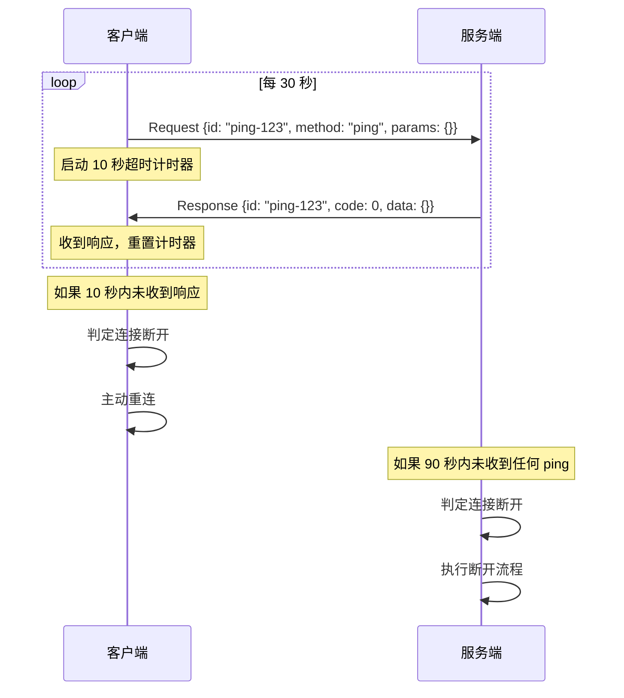

### 心跳实现

```text
// 客户端发送心跳
FUNCTION startHeartbeat():
    CREATE ticker (every 30 seconds)
    LOOP each tick:
        reqID = generateUUID()
        req = new Request(id=reqID, method="ping", params={})

        ctx = withTimeout(10 seconds)
        resp, err = sendRequest(ctx, req)

        IF err != nil:
            // 超时或错误，重连
            reconnect()
            RETURN

// 服务端处理客户端的 ping 请求（续约）
FUNCTION handlePing(conn, params) -> MethodResult:
    conn.lastPing = now()
    RETURN {code: 0, data: {}}

// 服务端监控客户端心跳（检测超时）
FUNCTION monitorClientHeartbeat(conn):
    timeout = 90 seconds  // 3 倍心跳间隔
    CREATE ticker (every 10 seconds)
    LOOP:
        SELECT:
            CASE ticker fires:
                IF now() - conn.lastPing > timeout:
                    conn.cancel()
                    RETURN
            CASE conn.ctx.Done():
                RETURN
```

### 心跳配置参数

| 参数 | 类型 | 默认值 | 说明 |
| --- | --- | --- | --- |
| Interval | Duration | 30 秒 | 心跳发送间隔 |
| Timeout | Duration | 10 秒 | 响应超时时间 |
| MaxFailures | int | 3 次 | 最大失败次数 |

## 分布式系统设计

### Updates 推送流程

当需要向用户推送 Updates 时，需要查询用户在所有节点的连接：

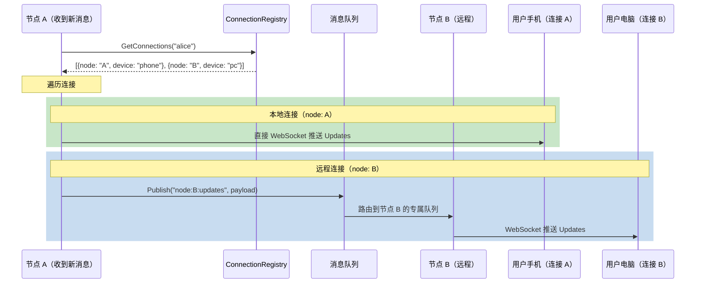

### RPC 响应路由

服务端向客户端发起 RPC 调用，客户端可能重连到其他节点：

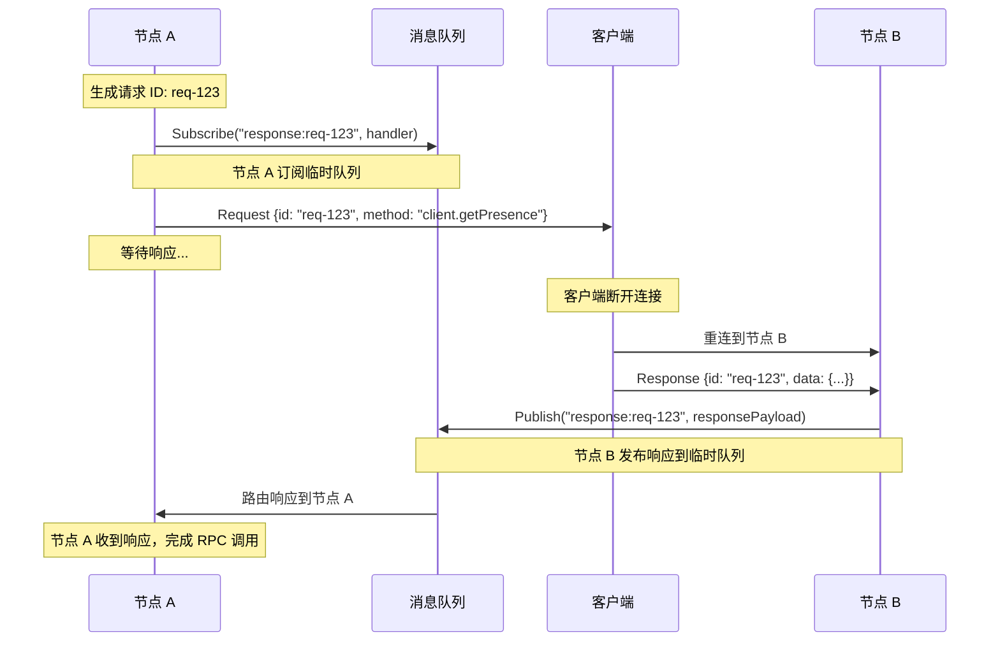

## 接口设计

### Server 接口

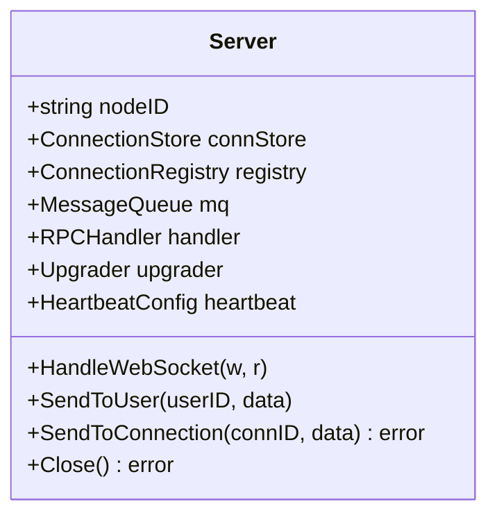

**HandleWebSocket 伪代码**：

```text
FUNCTION HandleWebSocket(w, r):
    // 1. 从 URL 提取参数
    userId = r.URL.query.get("user_id")
    deviceId = r.URL.query.get("device_id")

    IF missing userId or deviceId:
        RETURN HTTP 400 error

    // 2. 升级 WebSocket 连接
    conn = upgrader.Upgrade(w, r)
    IF error:
        RETURN

    // 3. 创建 Connection 对象
    connection = new Connection{
        ID:       generateUUID(),
        UserID:   userId,
        DeviceID: deviceId,
        NodeID:   self.nodeID,
        Conn:     conn,
        Send:     make channel (buffer=256),
    }
    connection.ctx, connection.cancel = context.WithCancel()

    // 4. 加入内存存储
    connStore.Add(connection)

    // 5. 注册到持久化存储
    registry.Register(ctx, userId, nodeID, deviceId, ConnectionInfo{...})

    // 6. 启动读写 goroutine
    START readPump(connection)
    START writePump(connection)
    START startHeartbeat(connection)

FUNCTION SendToUser(userID, data):
    connections = connStore.GetUserConnections(userID)
    FOR EACH conn IN connections:
        SELECT:
            CASE conn.Send <- data:
                // 发送成功
            DEFAULT:
                // Send 通道满了，跳过

FUNCTION SendToConnection(connID, data) -> error:
    conn = connStore.Get(connID)
    IF conn is nil:
        RETURN ErrConnectionNotFound
    SELECT:
        CASE conn.Send <- data:
            RETURN nil
        DEFAULT:
            RETURN ErrSendChannelFull

FUNCTION Close() -> error:
    // 1. 停止接受新连接
    // 2. 关闭所有现有连接
    // 3. 清理资源
    RETURN nil
```

### RPC 处理器

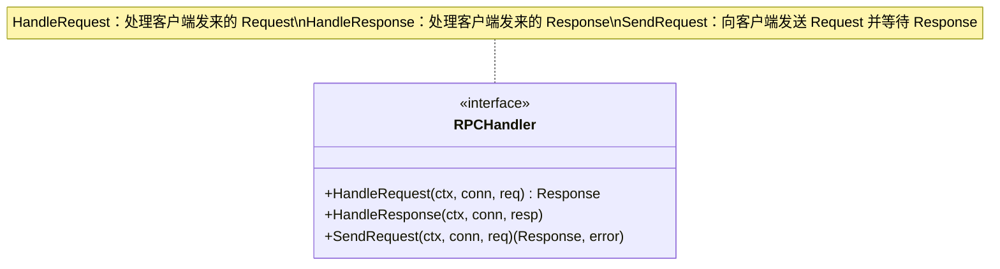

## 配置

### Server 配置

| 参数 | 类型 | 默认值 | 说明 |
| --- | --- | --- | --- |
| NodeID | string | - | 当前节点 ID |
| ReadBufferSize | int | 4096 | 读缓冲区大小 |
| WriteBufferSize | int | 4096 | 写缓冲区大小 |
| MaxMessageSize | int64 | 65536 | 最大消息大小 |
| EnableCompression | bool | false | 是否启用压缩 |
| SendChannelSize | int | 256 | Send 通道缓冲区大小 |
| Heartbeat | HeartbeatConfig | - | 心跳配置（见上文） |
| Registry | ConnectionRegistry | - | 持久化注册表 |
| MQ | MessageQueue | - | 消息队列 |

## 错误处理

### 错误类型

| 错误 | 说明 |
| --- | --- |
| ErrConnectionNotFound | 连接不存在 |
| ErrSendChannelFull | 发送通道已满 |
| ErrHeartbeatTimeout | 心跳超时 |
| ErrInvalidParams | 参数无效 |

### 错误处理策略

| 场景 | 处理方式 |
| --- | --- |
| 缺少 user_id 或 device_id | 返回 HTTP 400 错误，拒绝连接 |
| WebSocket 升级失败 | 记录日志，返回错误 |
| 心跳超时 | 断开连接，清理资源 |
| Send 通道满 | 跳过消息，记录警告 |
| RPC 处理失败 | 返回错误响应给客户端 |
| 持久化注册失败 | 记录错误，但不影响连接（降级处理） |

## 测试

### 单元测试

```text
FUNCTION TestConnectionStore():
    store = new ConnectionStore()

    // 添加连接
    conn = new Connection{ID: "conn-1", UserID: "alice", DeviceID: "phone-001"}
    store.Add(conn)

    // 按 ID 查询 -> 应该找到 conn
    ASSERT store.Get("conn-1") == conn

    // 按用户查询 -> 应该有 1 个连接
    ASSERT store.GetUserConnections("alice").length == 1

    // 移除连接
    store.Remove("conn-1")

    // 再次查询 -> 应该返回 nil
    ASSERT store.Get("conn-1") == nil

FUNCTION TestHeartbeat():
    server = new Server(Heartbeat: {Interval: 1s, Timeout: 500ms})

    conn = createTestConnection()
    server.connStore.Add(conn)

    START server.startHeartbeat(conn)

    // 验证：正常响应
    WAIT 2 seconds
    ASSERT conn.IsAlive() == true

    // 验证：超时断开
    conn.SetPongDelay(1 second)  // 模拟延迟
    WAIT 3 seconds
    ASSERT conn.IsAlive() == false
```

### 集成测试

```text
FUNCTION TestDistributedUpdates():
    // 启动两个节点
    registry = new RedisRegistry(redisClient)
    mq = new AsynqMQ(asynqConfig)

    nodeA = new Server(NodeID: "A", Registry: registry, MQ: mq)
    nodeB = new Server(NodeID: "B", Registry: registry, MQ: mq)

    // 模拟用户连接
    connA = createTestConnection("alice", "phone", nodeA)
    connB = createTestConnection("alice", "pc", nodeB)

    // 注册连接
    registry.Register(ctx, "alice", "A", "phone", ...)
    registry.Register(ctx, "alice", "B", "pc", ...)

    // 节点 A 推送 Updates
    updates = [{Seq: 1, Payload: "test"}]
    nodeA.PushUpdates(ctx, "alice", updates)

    // 验证：两个连接都收到 Updates
    ASSERT connA received updates
    ASSERT connB received updates
```
