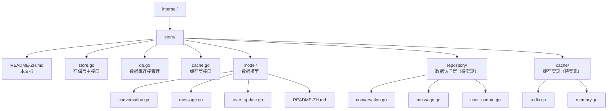
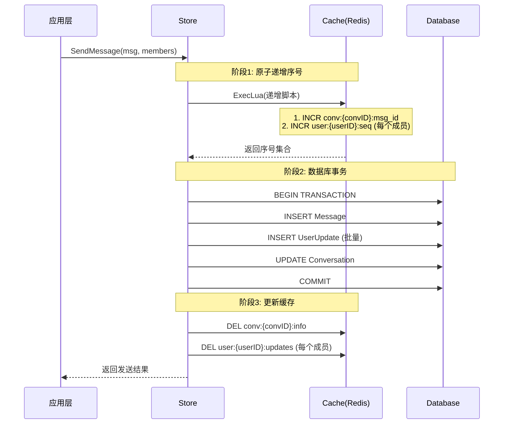
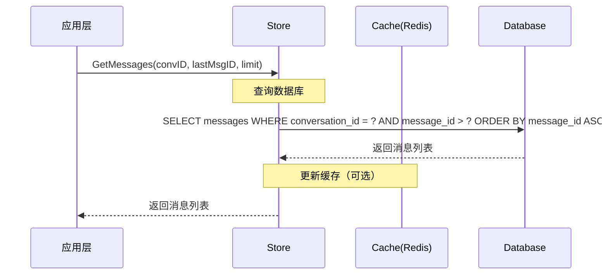

# 存储层设计文档

## 概述

存储层是 Xyncra 即时通讯系统的数据持久化和缓存组件，负责：

1. **数据持久化**：将消息、会话、用户更新等数据持久化到数据库
2. **缓存加速**：使用 Redis 缓存热点数据，提升读写性能
3. **原子操作**：保证分布式环境下的数据一致性
4. **抽象接口**：支持多种数据库和缓存实现

本组件采用**数据库 + 缓存**的双层存储架构，通过抽象接口支持多种实现。

## 设计决策

| 决策项 | 选择 | 原因 |
| --- | --- | --- |
| 数据库 | PostgreSQL（首选） | 支持 JSONB、数组类型，性能优异 |
| ORM | GORM | 功能完善，社区活跃，支持多种数据库 |
| 缓存 | Redis | 高性能，支持原子操作，适合分布式场景 |
| 存储模式 | 读写分离 | 读操作优先查缓存，写操作同时更新数据库和缓存 |
| 事务处理 | 数据库事务 | 保证数据一致性 |

### 关于数据库选择的决策

**决策：支持多种数据库，首选 PostgreSQL。**

- PostgreSQL：功能强大，支持 JSONB、数组类型，适合复杂查询
- MySQL：兼容性好，广泛使用
- SQLite：适合开发和测试环境

通过 GORM 抽象，可以无缝切换数据库实现。

## 目录结构



## 核心组件

### Store（存储层主接口）

```text
CLASS Store:
    FIELD db: *gorm.DB       // 数据库连接
    FIELD cache: Cache       // 缓存层

FUNCTION NewStore(db, cache) -> Store:
    RETURN Store{db, cache}
```

**职责**：

- 管理数据库连接
- 管理缓存连接
- 提供事务支持
- 协调数据库和缓存操作

### Database（数据库层）

```text
CLASS Database:
    FIELD db: *gorm.DB

CLASS Config:
    FIELD Driver: string          // 驱动类型：postgres, mysql, sqlite
    FIELD DSN: string             // 连接字符串
    FIELD MaxIdleConns: int       // 最大空闲连接数
    FIELD MaxOpenConns: int       // 最大打开连接数
    FIELD ConnMaxLifetime: Duration // 连接最大生命周期

FUNCTION NewDatabase(cfg: Config) -> Database:
    db = gorm.Open(openDriver(cfg.Driver, cfg.DSN))
    IF error THEN RETURN nil, error

    // 配置连接池
    sqlDB = db.DB()
    sqlDB.SetMaxIdleConns(cfg.MaxIdleConns)
    sqlDB.SetMaxOpenConns(cfg.MaxOpenConns)
    sqlDB.SetConnMaxLifetime(cfg.ConnMaxLifetime)

    RETURN Database{db}, nil
```

### Cache（缓存层）

```text
INTERFACE Cache:
    FUNCTION Get(ctx, key) -> bytes, error
    FUNCTION Set(ctx, key, value, expiration) -> error
    FUNCTION Delete(ctx, key) -> error
    FUNCTION Exists(ctx, key) -> bool, error
    FUNCTION Incr(ctx, key) -> int64, error
    FUNCTION IncrBy(ctx, key, increment) -> int64, error
    FUNCTION ExecLua(ctx, script, keys, args...) -> interface, error
    FUNCTION Close() -> error
```

**Redis 实现**：

```text
CLASS RedisCache:
    FIELD client: *redis.Client

FUNCTION NewRedisCache(addr, password, db) -> RedisCache:
    client = redis.NewClient(addr, password, db)
    result = client.Ping(timeout=5s)
    IF error THEN RETURN nil, error
    RETURN RedisCache{client}

FUNCTION Get(ctx, key) -> bytes, error:
    result = client.Get(key).Bytes()
    IF result == redis.Nil THEN RETURN nil, ErrCacheMiss
    RETURN result, error

FUNCTION Set(ctx, key, value, expiration) -> error:
    RETURN client.Set(key, value, expiration).Err()

FUNCTION Incr(ctx, key) -> int64, error:
    RETURN client.Incr(key).Result()

FUNCTION ExecLua(ctx, script, keys, args) -> interface, error:
    RETURN client.Eval(script, keys, args).Result()
```

## 缓存策略

### 缓存键设计

```mermaid
graph LR
    subgraph 用户相关
        UP["user:&#123;userID&#125;:profile<br/>用户资料"]
        US["user:&#123;userID&#125;:seq<br/>用户更新序列号"]
    end
    subgraph 会话相关
        CI["conv:&#123;convID&#125;:info<br/>会话信息"]
        CM["conv:&#123;convID&#125;:members<br/>会话成员列表"]
        MID["conv:&#123;convID&#125;:msg_id<br/>会话消息序号"]
    end
    subgraph 连接相关
        UC["user:&#123;userID&#125;:connections<br/>用户连接信息 (Hash)"]
    end
```



### 缓存更新策略

**写操作**：

1. 更新数据库
2. 删除相关缓存（Cache Aside 模式）
3. 下次读取时重新加载到缓存

**读操作**：

1. 查询缓存
2. 如果缓存命中，返回缓存值
3. 如果缓存未命中，查询数据库
4. 将数据库结果写入缓存
5. 返回结果

### 原子操作

使用 Lua 脚本保证多个操作的原子性：

```text
-- 递增会话消息序号和用户序列号
-- KEYS[1] = conv:{conversationID}:msg_id
-- KEYS[2...] = user:{userID}:seq (每个成员一个)

FUNCTION atomicIncrSeq(KEYS):
    results = []
    msgID = REDIS.INCR(KEYS[1])      // 递增对话的消息序号
    results.append(msgID)

    FOR i = 2 TO LENGTH(KEYS):       // 递增每个成员的 SEQ
        seq = REDIS.INCR(KEYS[i])
        results.append(seq)

    RETURN results
```

## 数据访问模式

### 发消息流程



### 查询消息流程



## 事务处理

### 事务接口

```text
INTERFACE Transaction:
    FUNCTION Commit() -> error
    FUNCTION Rollback() -> error
    FUNCTION DB() -> *gorm.DB      // 获取事务中的数据库连接

FUNCTION BeginTransaction() -> Transaction, error:
    tx = db.Begin()
    IF tx.Error THEN RETURN nil, tx.Error
    RETURN storeTransaction{tx}, nil
```

### 事务使用示例

```text
FUNCTION SendMessage(msg, updates, conv) -> error:
    tx, err = BeginTransaction()
    IF err THEN RETURN err
    DEFER tx.Rollback()

    // 1. 插入消息
    err = tx.DB().Create(msg)
    IF err THEN RETURN err

    // 2. 批量插入用户更新
    err = tx.DB().Create(updates)
    IF err THEN RETURN err

    // 3. 更新会话状态
    err = tx.DB().Updates(conv, {
        "last_message_at":          msg.CreatedAt,
        "last_processed_message_id": msg.MessageID,
    })
    IF err THEN RETURN err

    RETURN tx.Commit()
```

## 错误处理

### 错误类型

```text
ERRORS:
    ErrNotFound     = "store: record not found"
    ErrCacheMiss    = "store: cache miss"
    ErrDuplicateKey = "store: duplicate key"
    ErrTransaction  = "store: transaction error"
    ErrConnection   = "store: connection error"
```

### 错误处理策略

| 场景 | 处理方式 |
| --- | --- |
| 数据库连接失败 | 返回错误，上层重试或降级 |
| 缓存连接失败 | 降级到数据库查询，记录警告 |
| 缓存未命中 | 查询数据库，回填缓存 |
| 重复键冲突 | 返回 ErrDuplicateKey，上层处理 |
| 事务失败 | 回滚事务，返回错误 |

## 配置

### 存储层配置

```text
CLASS StoreConfig:
    FIELD Database: DatabaseConfig
    FIELD Cache: CacheConfig

CLASS DatabaseConfig:
    FIELD Driver: string          // postgres, mysql, sqlite
    FIELD DSN: string             // 连接字符串
    FIELD MaxIdleConns: int       // 最大空闲连接数，默认 10
    FIELD MaxOpenConns: int       // 最大打开连接数，默认 100
    FIELD ConnMaxLifetime: Duration // 连接最大生命周期，默认 1 小时

CLASS CacheConfig:
    FIELD Type: string            // redis, memory
    FIELD Addr: string            // Redis 地址
    FIELD Password: string        // Redis 密码
    FIELD DB: int                 // Redis 数据库编号
    FIELD KeyPrefix: string       // 键前缀
    FIELD DefaultTTL: Duration    // 默认过期时间，默认 1 小时
```

## 测试

### 单元测试

```text
FUNCTION TestStoreSendMessage():
    // 准备测试数据
    db = setupTestDB()
    cache = setupTestCache()
    store = NewStore(db, cache)

    msg = Message{
        ID:             uuid.NewString(),
        ClientMessageID: uuid.NewString(),
        ConversationID:  "conv-123",
        SenderID:        "user-alice",
        Content:         "Hello",
    }

    updates = [
        UserUpdate{ID: uuid, UserID: "user-alice", Seq: 101},
        UserUpdate{ID: uuid, UserID: "user-bob",   Seq: 201},
    ]

    conv = Conversation{ID: "conv-123"}

    // 执行发送
    err = store.SendMessage(msg, updates, conv)
    ASSERT err == nil

    // 验证数据库
    savedMsg = db.First("id = ?", msg.ID)
    ASSERT savedMsg.Content == "Hello"

    // 验证缓存
    seq = cache.Incr("user:user-alice:seq")
    ASSERT seq == 101
```

### 集成测试

```text
FUNCTION TestStoreIntegration():
    // 启动真实数据库和缓存
    db = startPostgres()
    cache = startRedis()
    store = NewStore(db, cache)

    // 测试完整流程
    ...
```

## 性能优化

### 连接池配置

```text
// 数据库连接池
db.SetMaxIdleConns(10)                // 空闲连接数
db.SetMaxOpenConns(100)               // 最大连接数
db.SetConnMaxLifetime(1 * Hour)       // 连接生命周期

// Redis 连接池
redisOptions = {
    PoolSize:     100,                // 连接池大小
    MinIdleConns: 10,                 // 最小空闲连接
    MaxRetries:   3,                  // 最大重试次数
}
```

### 批量操作

```text
FUNCTION BatchCreateUpdates(updates) -> error:
    RETURN db.Create(updates)

FUNCTION BatchDeleteCache(keys) -> error:
    pipe = cache.Pipeline()
    FOR EACH key IN keys:
        pipe.Del(key)
    RETURN pipe.Exec()
```

### 索引优化

参考 [数据模型文档](model/README-ZH.md) 中的索引策略：

- 会话表：`(UserID1, DeletedAt)`, `(UserID2, DeletedAt)`, `(LastMessageAt, DeletedAt)`
- 消息表：`(ConversationID, MessageID, DeletedAt)`, `(ClientMessageID)`
- 用户更新表：`(UserID, Seq)`

## 监控

### 监控指标

```text
CLASS StoreMetrics:
    // 数据库指标
    FIELD DBQueryCount: Counter
    FIELD DBQueryDuration: Histogram
    FIELD DBErrorCount: Counter

    // 缓存指标
    FIELD CacheHitCount: Counter
    FIELD CacheMissCount: Counter
    FIELD CacheErrorCount: Counter

    // 连接池指标
    FIELD DBIdleConns: Gauge
    FIELD DBOpenConns: Gauge
    FIELD RedisPoolConns: Gauge
```

### 日志记录

```text
// 数据库日志
db.Logger = Logger(
    SlowThreshold: 200ms,
    LogLevel:      Warn,
    Output:        stdout,
)

// 缓存日志
FUNCTION onCacheError(key, err):
    LOG "cache error: key=%s, err=%v", key, err
```
