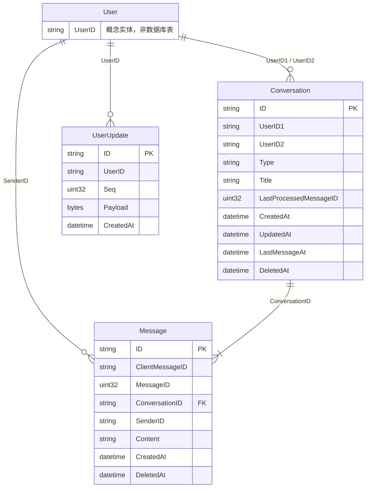
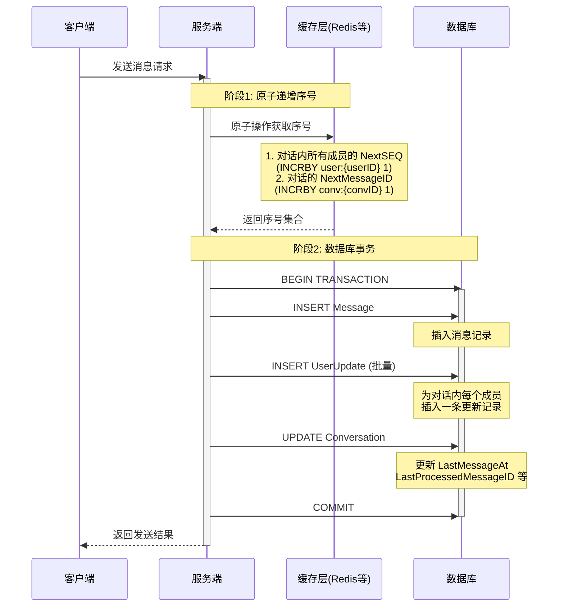

# 数据模型文档

本模块定义了 Xyncra 即时通讯系统的核心数据模型。

## 概述

系统采用 **无用户表设计**，仅通过 User ID（字符串）来标识用户身份。所有与用户相关的关联都是松散引用，不存在外键约束。

## 表关系图



## 数据表详解

### 1. Conversation（会话表）

会话实体，支持三种类型：单聊（1-on-1）、群组（group）和频道（channel）。

| 字段 | 类型 | 说明 |
| --- | --- | --- |
| ID | string(36) | 主键，UUID格式，会话唯一标识 |
| UserID1 | string(64) | 参与者1的用户ID |
| UserID2 | string(64) | 参与者2的用户ID（仅单聊时非空） |
| Type | string(20) | 会话类型：1-on-1 / group / channel |
| Title | string(255) | 会话标题 |
| LastProcessedMessageID | uint32 | 最后处理的消息ID（用于同步） |
| CreatedAt | datetime | 创建时间 |
| UpdatedAt | datetime | 更新时间 |
| LastMessageAt | datetime | 最后消息时间（用于排序） |
| DeletedAt | datetime | 软删除时间戳（带索引） |

**设计说明**：

- 单聊（1-on-1）：UserID1 和 UserID2 分别表示两个参与者
- 群组/频道：参与者关系通过其他方式管理，这两个字段可能为空

### 2. Message（消息表）

会话中的消息记录。

| 字段 | 类型 | 说明 |
| --- | --- | --- |
| ID | string(36) | 主键，UUID格式，消息唯一标识 |
| ClientMessageID | string(36) | 客户端消息ID，UUID格式，用于幂等性和客户端去重 |
| MessageID | uint32 | 消息序号（会话内有序） |
| ConversationID | string(36) | 所属会话ID，UUID格式 |
| SenderID | string(64) | 发送者用户ID |
| Content | text | 消息内容 |
| CreatedAt | datetime | 创建时间 |
| DeletedAt | datetime | 软删除时间戳（带索引） |

**设计说明**：

- ClientMessageID 用于防止客户端重复提交
- MessageID 是会话内的有序序号，便于消息同步和排序
- 消息与用户是松散关联，仅通过 SenderID 标识发送者

### 3. UserUpdate（用户更新表）

记录用户状态更新的有序事件流，用于同步用户配置、状态等变更。

| 字段 | 类型 | 说明 |
| --- | --- | --- |
| ID | string(36) | 主键，UUID格式，更新记录唯一标识 |
| UserID | string(64) | 用户ID |
| Seq | uint32 | 序列号（用于排序和同步） |
| Payload | bytea/bytes | 更新内容（通常是 JSON 或 Protobuf 编码） |
| CreatedAt | datetime | 创建时间 |

**设计说明**：

- 采用事件溯源模式，通过 Seq 序号保证更新的有序性
- Payload 存储实际的更新数据，格式灵活
- 客户端可通过 Seq 实现增量同步

## 数据关系说明

### 会话与消息

- **一对多关系**：一个会话包含多条消息
- 通过 Message.ConversationID 关联到 Conversation.ID

### 用户关联（无外键约束）

由于系统不包含用户表，所有用户关联都是**逻辑引用**：

- Conversation.UserID1 / UserID2：会话参与者
- Message.SenderID：消息发送者
- UserUpdate.UserID：更新记录所属用户

这种设计的优势：

1. **解耦**：消息系统与用户系统完全独立
2. **灵活性**：支持对接外部用户系统
3. **简化**：避免用户表同步的复杂性

## 软删除机制

Conversation 和 Message 表使用 GORM 的软删除功能：

- DeletedAt 字段带索引
- 删除操作只设置时间戳，不物理删除记录
- 查询自动过滤已删除记录
- 支持数据恢复和审计

## 索引策略

所有索引均兼容 PostgreSQL、MySQL 和 SQLite。

### Conversation 表

| 索引名称 | 字段 | 类型 | 用途 |
| --- | --- | --- | --- |
| PRIMARY | ID | 主键 | 会话唯一标识 |
| idx_conversation_user1_deleted | UserID1, DeletedAt | 复合索引 | 查询用户作为参与者1的会话，支持软删除过滤 |
| idx_conversation_user2_deleted | UserID2, DeletedAt | 复合索引 | 查询用户作为参与者2的会话，支持软删除过滤 |
| idx_conversation_lastmsg_deleted | LastMessageAt, DeletedAt | 复合索引 | 按最后消息时间排序查询会话 |
| idx_conversations_type | Type | 单列索引 | 按会话类型过滤 |
| idx_conversations_created_at | CreatedAt | 单列索引 | 按创建时间查询 |
| idx_conversations_deleted_at | DeletedAt | 单列索引 | 软删除查询过滤 |

**索引顺序说明**：

- 复合索引 `(UserID, DeletedAt)`：先按 UserID 过滤，再按 DeletedAt 过滤未删除记录，优化用户会话查询
- 复合索引 `(LastMessageAt, DeletedAt)`：先按 LastMessageAt 排序，再按 DeletedAt 过滤，优化会话列表排序

### Message 表

| 索引名称 | 字段 | 类型 | 用途 |
| --- | --- | --- | --- |
| PRIMARY | ID | 主键 | 消息唯一标识 |
| udx_messages_client_message_id | ClientMessageID | 唯一索引 | 保证客户端消息ID唯一性，防止重复提交 |
| idx_message_conv_msg_deleted | ConversationID, MessageID, DeletedAt | 复合索引 | 会话内消息查询和排序，支持软删除过滤 |
| idx_messages_sender_id | SenderID | 单列索引 | 查询用户发送的消息 |
| idx_messages_created_at | CreatedAt | 单列索引 | 按创建时间查询 |
| idx_messages_deleted_at | DeletedAt | 单列索引 | 软删除查询过滤 |

**索引顺序说明**：

- 复合索引 `(ConversationID, MessageID, DeletedAt)`：先按会话过滤，再按消息序号排序/范围查询，最后过滤软删除记录。这是消息查询的核心索引，完美支持 `WHERE conversation_id = ? AND message_id > ? ORDER BY message_id` 查询模式

### UserUpdate 表

| 索引名称 | 字段 | 类型 | 用途 |
| --- | --- | --- | --- |
| PRIMARY | ID | 主键 | 更新记录唯一标识 |
| idx_user_update_user_seq | UserID, Seq | 复合索引 | 用户增量同步查询和排序 |
| idx_user_updates_user_id | UserID | 单列索引 | 按用户ID查询更新记录 |
| idx_user_updates_created_at | CreatedAt | 单列索引 | 按创建时间查询 |

**索引顺序说明**：

- 复合索引 `(UserID, Seq)`：先按用户过滤，再按序列号排序/范围查询，完美支持 `WHERE user_id = ? AND seq > ? ORDER BY seq` 增量同步模式

### 数据库兼容性

- 所有索引使用 GORM 标准语法，自动适配 PostgreSQL、MySQL、SQLite
- 复合索引字段顺序基于实际查询模式优化，确保最高效的查询路径
- 软删除索引支持 GORM 的自动过滤机制

## 发消息流程

### 流程图



### 详细步骤

#### 阶段1：原子递增序号

在插入消息之前，需要同时获取两类序号：

1. **用户更新序号（NextSEQ）**
   - 为对话内的每个成员递增其 SEQ
   - 格式：`user:{userID}` 的 SEQ 字段
   - 用途：客户端增量同步用户更新
   - 写扩散：群聊中 N 个成员 = N 次递增

2. **消息序号（NextMessageID）**
   - 为对话递增消息序号
   - 格式：`conv:{conversationID}` 的 MessageID 字段
   - 用途：会话内消息排序和同步

**原子性保证**：

这两类序号的递增必须是原子操作，确保：

- 同一消息的所有成员 SEQ 相同或有序递增
- 消息序号严格递增，不重复不跳号

**实现方式（示例）**：

```go
// Redis Lua 脚本示例（仅作为参考实现）
luaScript := `
    local results = {}
    
    -- 递增对话的消息序号
    local msgID = redis.call('INCR', KEYS[1])
    results[1] = msgID
    
    -- 递增每个成员的 SEQ
    for i = 2, #KEYS do
        local seq = redis.call('INCR', KEYS[i])
        results[i] = seq
    end
    
    return results
`

// KEYS[1] = "conv:{conversationID}:msg_id"
// KEYS[2...] = "user:{userID}:seq" (每个成员一个)
```

**多存储后端支持**：

不局限于 Redis，可以有多种实现：

- **Redis**：Lua 脚本保证原子性
- **PostgreSQL/MySQL**：使用 `UPDATE ... RETURNING` 或存储过程
- **SQLite**：使用事务内的 `UPDATE` + `SELECT`
- **分布式系统**：使用 Snowflake ID 或其他分布式 ID 生成器

#### 阶段2：数据库事务

获取序号后，在单个数据库事务中完成以下操作：

```go
func SendMessage(db *gorm.DB, msg *Message, updates []UserUpdate, conv *Conversation) error {
    return db.Transaction(func(tx *gorm.DB) error {
        // 1. 插入消息
        if err := tx.Create(msg).Error; err != nil {
            return err
        }
        
        // 2. 批量插入用户更新（写扩散）
        if err := tx.Create(&updates).Error; err != nil {
            return err
        }
        
        // 3. 更新会话状态
        if err := tx.Model(conv).Updates(map[string]interface{}{
            "last_message_at":          msg.CreatedAt,
            "last_processed_message_id": msg.MessageID,
        }).Error; err != nil {
            return err
        }
        
        return nil
    })
}
```

**事务内的操作**：

1. **INSERT Message**
   - 插入消息记录
   - 字段：ID, ClientMessageID, MessageID, ConversationID, SenderID, Content, CreatedAt

2. **INSERT UserUpdate（批量）**
   - 为对话内每个成员插入一条更新记录
   - 字段：ID, UserID, Seq, Payload（消息元数据）, CreatedAt
   - 写扩散：群聊中 N 个成员 = N 条记录

3. **UPDATE Conversation**
   - 更新会话的最后消息时间
   - 更新最后处理的消息ID
   - 用于会话列表排序和未读计数

### 数据流示例

假设群聊场景：对话 `conv:abc123` 有 3 个成员 `user:alice`, `user:bob`, `user:charlie`

#### 示例阶段1：获取序号

```text
Before:
  user:alice:seq = 100
  user:bob:seq = 200
  user:charlie:seq = 150
  conv:abc123:msg_id = 42

After INCR:
  user:alice:seq = 101
  user:bob:seq = 201
  user:charlie:seq = 151
  conv:abc123:msg_id = 43
```

#### 示例阶段2：数据库事务

```sql
-- 1. 插入消息
INSERT INTO messages (id, client_message_id, message_id, conversation_id, sender_id, content, created_at)
VALUES ('msg-uuid-123', 'client-uuid-456', 43, 'conv-abc123', 'user-alice', 'Hello!', NOW());

-- 2. 批量插入用户更新（3个成员 = 3条记录）
INSERT INTO user_updates (id, user_id, seq, payload, created_at) VALUES
('update-uuid-1', 'user-alice', 101, '{"type":"msg","conv_id":"conv-abc123","msg_id":43}', NOW()),
('update-uuid-2', 'user-bob', 201, '{"type":"msg","conv_id":"conv-abc123","msg_id":43}', NOW()),
('update-uuid-3', 'user-charlie', 151, '{"type":"msg","conv_id":"conv-abc123","msg_id":43}', NOW());

-- 3. 更新会话
UPDATE conversations 
SET last_message_at = NOW(), last_processed_message_id = 43
WHERE id = 'conv-abc123';
```

### 客户端增量同步

客户端通过 `UserUpdate` 表实现增量同步：

```go
// 客户端上次同步的 SEQ
lastSeq := getLastSyncSeq(userID)

// 查询增量更新
db.Where("user_id = ? AND seq > ?", userID, lastSeq).
    Order("seq ASC").
    Find(&updates)

// 处理更新（新消息通知等）
for _, update := range updates {
    processUpdate(update)
}

// 更新本地 SEQ
updateLastSyncSeq(userID, updates[len(updates)-1].Seq)
```

## 使用示例

```go
// 查询用户的会话列表
db.Where("user_id1 = ? OR user_id2 = ?", userID, userID).
    Order("last_message_at DESC").
    Find(&conversations)

// 查询会话的消息（按序号排序）
db.Where("conversation_id = ? AND message_id > ?", 
    conversationID, lastMessageID).
    Order("message_id ASC").
    Limit(50).
    Find(&messages)

// 查询用户的增量更新
db.Where("user_id = ? AND seq > ?", userID, lastSeq).
    Order("seq ASC").
    Find(&updates)
```
