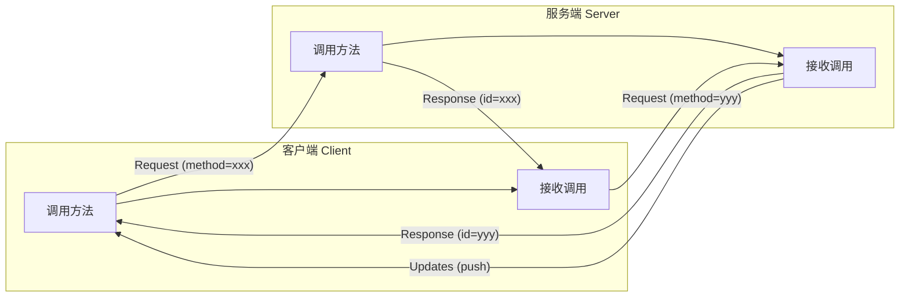
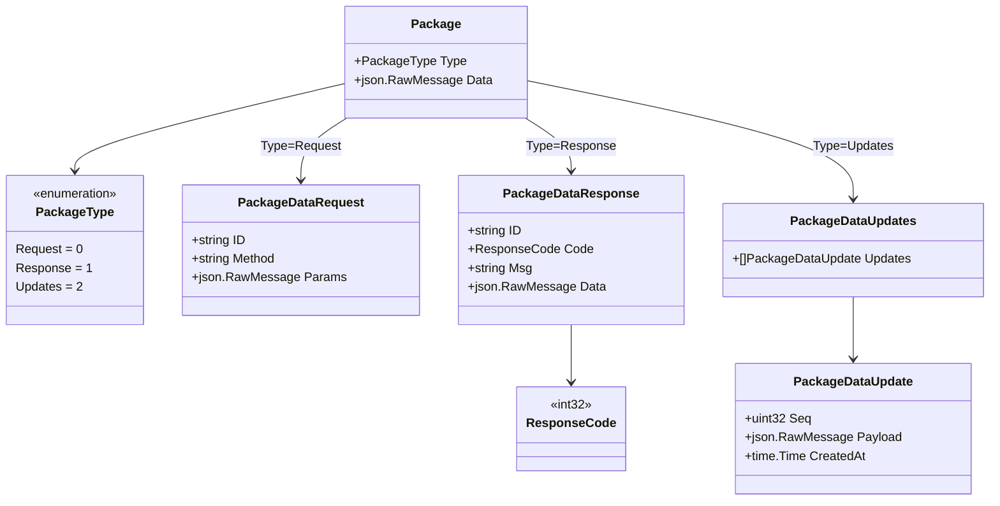
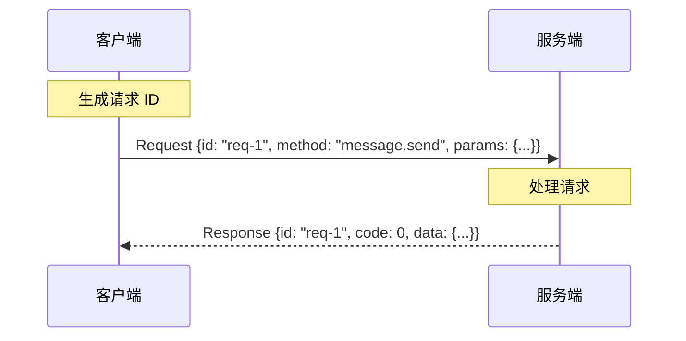
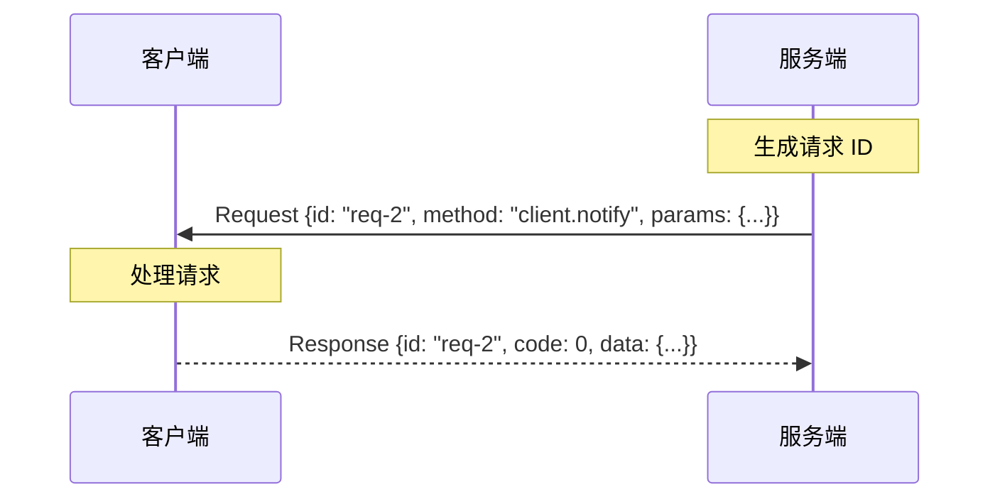
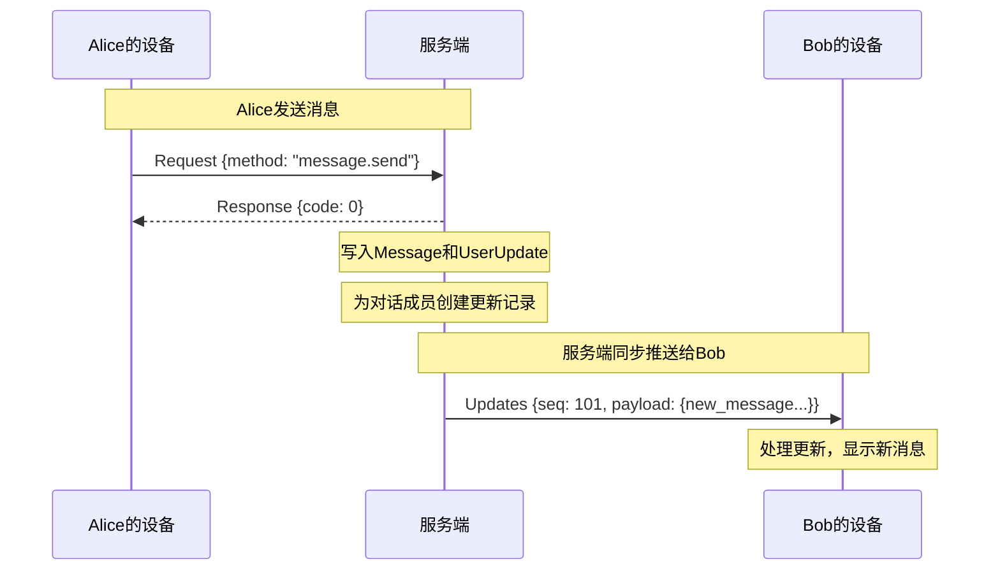
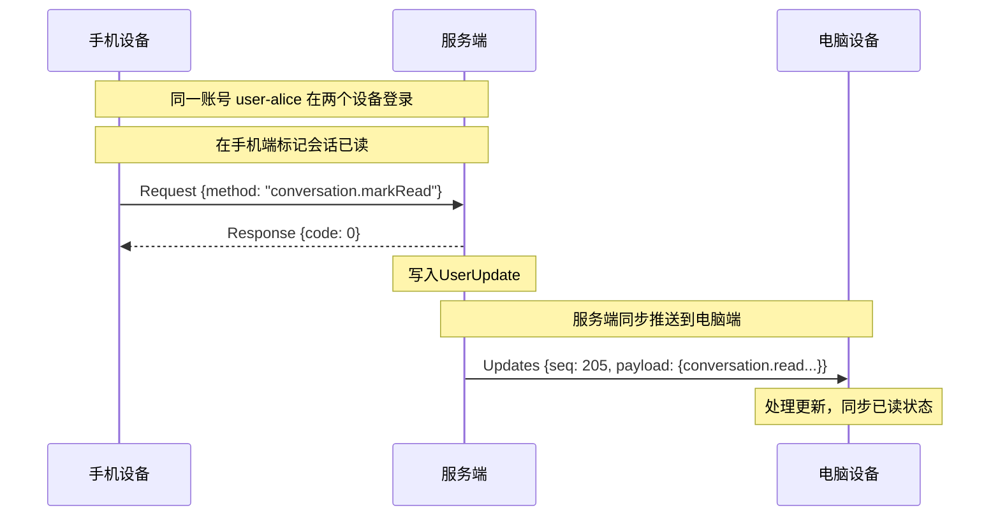
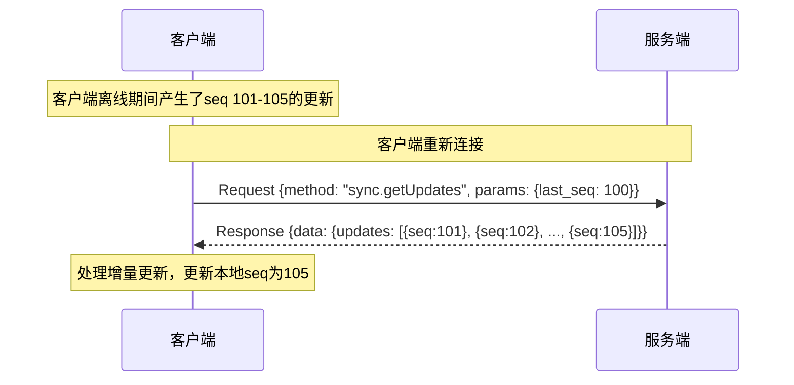
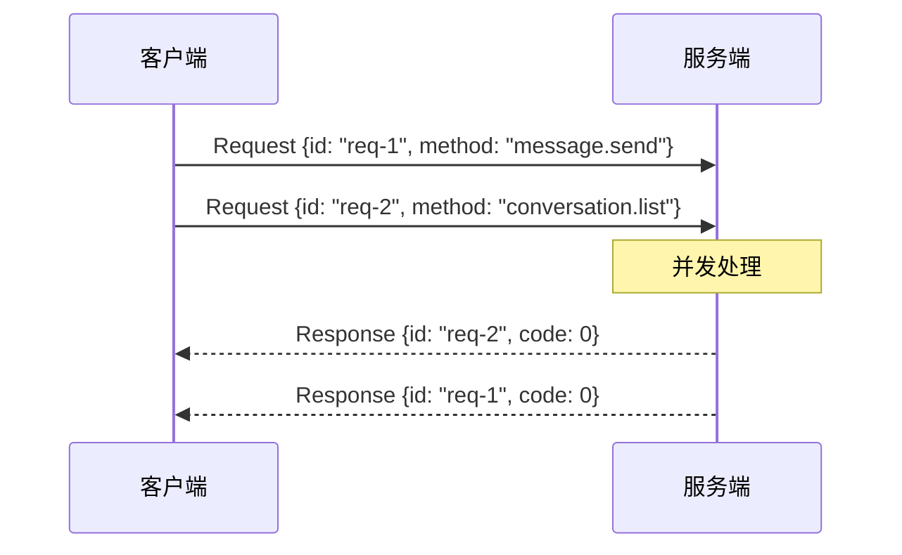

# 通信协议文档

本模块定义了 Xyncra 即时通讯系统的**双向 RPC 通信协议**。

## 概述

系统采用**单长连接双向通信**架构：

- 客户端与服务端之间只维护**一条长连接**（WebSocket/TCP）
- **双方都可以主动发起 RPC 调用**，都可以提供 `method`
- **双方都可以接收调用**，都需要返回响应
- 通过请求 ID 匹配请求和响应，支持并发调用
- 服务端通过 `Updates` 向客户端推送**数据同步事件**（无需响应）

**`Updates` 的核心作用**：

`Updates` 是服务端专属的**同步机制**（只能服务端 → 客户端，客户端不会发送 Updates），用于：

1. **对话内消息同步** - 当对话中其他人发送新消息时，推送给相关客户端
2. **多设备同步** - 同一账号在手机、电脑等多设备登录时，一个设备的操作需要同步到其他设备

这种设计类似于：

- JSON-RPC 2.0（双向版本）
- LSP（Language Server Protocol）
- gRPC 双向流

## 架构设计



**关键点**：

- 客户端和服务端地位对等，都可以发起 `Request`
- `Response` 通过 `ID` 匹配对应的 `Request`
- `Updates` 是服务端专属的同步推送，只能由服务端发送给客户端，不需要响应
- `Updates` 用于数据同步：消息同步 + 多设备同步

## 包结构关系



## 数据结构详解

### 1. Package（数据包）

所有通信的最外层包装，通过 `Type` 字段区分包类型。

| 字段 | 类型 | 说明 |
| --- | --- | --- |
| Type | PackageType | 包类型：Request(0) / Response(1) / Updates(2) |
| Data | json.RawMessage | 实际数据，根据 Type 解析为对应的结构 |

**JSON 示例**：

```json
{
  "type": 0,
  "data": { ... }
}
```

### 2. PackageDataRequest（请求包）

用于发起方法调用。**客户端和服务端都可以发送**。

| 字段 | 类型 | 说明 |
| --- | --- | --- |
| ID | string | 请求唯一标识（UUID），用于匹配响应 |
| Method | string | 调用的方法名（如 `message.send`, `conversation.list`） |
| Params | json.RawMessage | 方法参数（JSON 格式） |

**JSON 示例**：

```json
{
  "id": "req-uuid-123",
  "method": "message.send",
  "params": {
    "conversation_id": "conv-abc",
    "content": "Hello"
  }
}
```

**设计说明**：

- `ID` 由调用方生成，响应方必须原样返回
- `Method` 采用点分命名空间，如 `user.getProfile`、`message.send`
- `Params` 是任意 JSON，具体结构由 Method 定义

### 3. PackageDataResponse（响应包）

用于回复请求。**收到 Request 的一方必须返回 Response**。

| 字段 | 类型 | 说明 |
| --- | --- | --- |
| ID | string | 对应请求的 ID（必须匹配） |
| Code | ResponseCode | 响应码（0 表示成功，非 0 表示错误） |
| Msg | string | 错误信息或提示（成功时可为空） |
| Data | json.RawMessage | 响应数据（JSON 格式，具体结构由 Method 定义） |

**JSON 示例（成功）**：

```json
{
  "id": "req-uuid-123",
  "code": 0,
  "msg": "",
  "data": {
    "message_id": 42,
    "created_at": "2026-07-07T10:30:00Z"
  }
}
```

**JSON 示例（失败）**：

```json
{
  "id": "req-uuid-123",
  "code": 404,
  "msg": "conversation not found",
  "data": null
}
```

### 4. PackageDataUpdates（更新包）

服务端专属的**数据同步推送**。**只能由服务端发送给客户端，客户端不会发送 Updates**。

**核心用途**：

1. **对话内消息同步** - 对话中其他人发送新消息时，推送给对话成员
2. **多设备同步** - 同一账号在多个设备登录时，一个设备的操作同步到其他设备

**工作原理**：

- 服务端将数据变更写入 `UserUpdate` 表（参见 [数据模型文档](../internal/store/model/README-ZH.md)）
- 每个更新带有递增的 `Seq` 序列号
- 客户端收到 Updates 后处理数据变更，并记录最新的 `Seq`
- 如果客户端离线，重新上线后通过 `Seq` 查询缺失的更新（增量同步）

| 字段 | 类型 | 说明 |
| --- | --- | --- |
| Updates | []PackageDataUpdate | 批量更新事件 |

### 5. PackageDataUpdate（单个更新事件）

| 字段 | 类型 | 说明 |
| --- | --- | --- |
| Seq | uint32 | 序列号（**关键字段**，用于增量同步和排序，对应 `UserUpdate.Seq`） |
| Payload | json.RawMessage | 事件数据（JSON 格式，对应 `UserUpdate.Payload`） |
| CreatedAt | time.Time | 创建时间 |

**Seq 的重要性**：

- 每个用户的 `Seq` 是独立递增的序列号
- 客户端记录上次同步的最大 `Seq`
- 重新连接时，客户端向服务端报告上次同步的 `Seq`
- 服务端返回 `Seq` 大于上次值的所有更新
- 这保证了即使离线期间产生的更新也不会丢失

**JSON 示例（对话内消息同步）**：

```json
{
  "updates": [
    {
      "seq": 101,
      "payload": {
        "type": "new_message",
        "conversation_id": "conv-abc",
        "message_id": 43,
        "sender_id": "user-alice",
        "content": "Hello!"
      },
      "created_at": "2026-07-07T10:30:00Z"
    }
  ]
}
```

**JSON 示例（多设备同步）**：

```json
{
  "updates": [
    {
      "seq": 205,
      "payload": {
        "type": "conversation.read",
        "conversation_id": "conv-abc",
        "device_id": "phone-001"
      },
      "created_at": "2026-07-07T10:35:00Z"
    }
  ]
}
```

## 通信流程

### 场景1：客户端调用服务端



### 场景2：服务端调用客户端



### 场景3：对话内消息同步



### 场景4：多设备同步



### 场景5：离线后增量同步



### 场景6：并发调用



## 方法命名规范

建议采用**点分命名空间**：

```text
<模块>.<操作>

示例：
- message.send         发送消息
- message.list         获取消息列表
- conversation.create  创建会话
- conversation.list    获取会话列表
- user.getProfile      获取用户资料
- user.updateProfile   更新用户资料
```

## 响应码定义

| Code | 含义 | 说明 |
| --- | --- | --- |
| 0 | 成功 | 请求处理成功 |
| 400 | 请求错误 | 参数错误、格式错误等 |
| 401 | 未授权 | 需要认证 |
| 403 | 禁止访问 | 无权限 |
| 404 | 未找到 | 资源不存在 |
| 500 | 服务器错误 | 内部错误 |
| 自定义 | 业务错误 | 根据业务需求定义 |

## 完整示例

### 示例1：客户端发送消息

**客户端发送**：

```json
{
  "type": 0,
  "data": {
    "id": "req-uuid-001",
    "method": "message.send",
    "params": {
      "conversation_id": "conv-abc123",
      "client_message_id": "client-uuid-456",
      "content": "Hello, World!"
    }
  }
}
```

**服务端响应**：

```json
{
  "type": 1,
  "data": {
    "id": "req-uuid-001",
    "code": 0,
    "msg": "",
    "data": {
      "message_id": 43,
      "created_at": "2026-07-07T10:30:00Z"
    }
  }
}
```

### 示例2：服务端调用客户端（获取在线状态）

**服务端发送**：

```json
{
  "type": 0,
  "data": {
    "id": "req-uuid-002",
    "method": "client.getPresence",
    "params": {
      "user_ids": ["user-alice", "user-bob"]
    }
  }
}
```

**客户端响应**：

```json
{
  "type": 1,
  "data": {
    "id": "req-uuid-002",
    "code": 0,
    "msg": "",
    "data": {
      "presence": {
        "user-alice": "online",
        "user-bob": "away"
      }
    }
  }
}
```

### 示例3：对话内消息同步（服务端推送）

**场景**：Alice 在对话中发送消息，服务端推送给对话成员 Bob

**服务端推送给 Bob**：

```json
{
  "type": 2,
  "data": {
    "updates": [
      {
        "seq": 101,
        "payload": {
          "type": "new_message",
          "conversation_id": "conv-abc123",
          "message_id": 43,
          "sender_id": "user-alice",
          "content": "Hello, World!"
        },
        "created_at": "2026-07-07T10:30:00Z"
      }
    ]
  }
}
```

### 示例4：多设备同步（服务端推送）

**场景**：用户 Alice 在手机端标记会话已读，服务端推送给电脑端

**服务端推送给 Alice 的电脑端**：

```json
{
  "type": 2,
  "data": {
    "updates": [
      {
        "seq": 205,
        "payload": {
          "type": "conversation.read",
          "conversation_id": "conv-abc123",
          "device_id": "phone-001",
          "read_up_to_message_id": 43
        },
        "created_at": "2026-07-07T10:35:00Z"
      }
    ]
  }
}
```

### 示例5：离线后增量同步

**场景**：客户端离线期间错过了 seq 101-105 的更新，重新连接后同步

**客户端请求增量更新**：

```json
{
  "type": 0,
  "data": {
    "id": "req-uuid-003",
    "method": "sync.getUpdates",
    "params": {
      "last_seq": 100
    }
  }
}
```

**服务端响应**：

```json
{
  "type": 1,
  "data": {
    "id": "req-uuid-003",
    "code": 0,
    "msg": "",
    "data": {
      "updates": [
        {"seq": 101, "payload": {"type": "new_message", ...}},
        {"seq": 102, "payload": {"type": "conversation.read", ...}},
        {"seq": 103, "payload": {"type": "new_message", ...}},
        {"seq": 104, "payload": {"type": "user.profile_update", ...}},
        {"seq": 105, "payload": {"type": "new_message", ...}}
      ],
      "has_more": false
    }
  }
}
```

## 错误处理

### 请求超时

客户端发送请求后，如果在指定时间内未收到响应，应该：

1. 标记请求为超时
2. 可以选择重试或返回错误
3. 建议超时时间：10-30 秒

### 连接断开

如果长连接断开：

1. 所有未完成的请求应该标记为失败
2. 客户端应该自动重连
3. 重连后通过 `Updates` 的 `Seq` 进行增量同步

### 未知方法

如果收到未知的 `Method`：

1. 必须返回 `Response`，`Code` 设为 404
2. `Msg` 说明方法不存在

```json
{
  "id": "req-uuid-xxx",
  "code": 404,
  "msg": "method 'unknown.method' not found",
  "data": null
}
```

## 实现建议

### 客户端实现

```text
CLASS RequestManager:
    FIELDS:
        pending: map<string, channel<Response>>
        mu: ReadWriteMutex

    FUNCTION SendRequest(method, params) -> (Response, error):
        id = generateUUID()
        request = PackageDataRequest{id, method, marshalJSON(params)}
        ch = newChannel(capacity=1)
        pending[id] = ch
        DEFER: delete(pending, id)

        sendPackage(type=Request, data=request)

        WAIT for response on ch with timeout 30s:
            CASE response received from ch:
                RETURN response, nil
            CASE timeout:
                RETURN nil, ErrTimeout

    FUNCTION HandlePackage(pkg):
        SWITCH pkg.Type:
            CASE Response:
                resp = unmarshalJSON(pkg.Data) -> PackageDataResponse
                pending[resp.ID] <- resp

            CASE Request:
                req = unmarshalJSON(pkg.Data) -> PackageDataRequest
                result = callMethod(req.Method, req.Params)
                sendPackage(type=Response, data=PackageDataResponse{
                    ID:   req.ID,
                    Code: result.Code,
                    Msg:  result.Msg,
                    Data: result.Data
                })

            CASE Updates:
                updates = unmarshalJSON(pkg.Data) -> PackageDataUpdates
                FOR EACH update IN updates.Updates:
                    handleUpdate(update)
```

### 方法注册

```text
TYPE MethodHandler = FUNCTION(params: json) -> MethodResult

STRUCT MethodResult:
    Code: ResponseCode
    Msg: string
    Data: json

// 方法注册表
METHODS = map<string, MethodHandler>:
    "message.send"        -> handleMessageSend
    "message.list"        -> handleMessageList
    "conversation.create" -> handleConversationCreate
    "conversation.list"   -> handleConversationList
    // ...

FUNCTION RegisterMethod(name: string, handler: MethodHandler):
    METHODS[name] = handler
```

## 与数据模型的关系

本协议与 `internal/store/model` 中定义的数据模型紧密配合：

### RPC 方法操作的数据

- **Message** - 通过 `message.send`、`message.list`、`message.get` 等方法操作
- **Conversation** - 通过 `conversation.create`、`conversation.list`、`conversation.markRead` 等方法操作

### Updates 同步机制

`Updates` 推送的数据来源于 **`UserUpdate` 表**：

| 协议字段 | 数据模型字段 | 说明 |
| --- | --- | --- |
| `PackageDataUpdate.Seq` | `UserUpdate.Seq` | 用户的序列号，用于增量同步 |
| `PackageDataUpdate.Payload` | `UserUpdate.Payload` | 更新内容（JSON 编码） |
| `PackageDataUpdate.CreatedAt` | `UserUpdate.CreatedAt` | 更新时间 |

**同步流程**：

1. **产生更新** - 服务端在处理 RPC 请求时，将数据变更写入 `UserUpdate` 表
2. **在线推送** - 通过 `Updates` 包实时推送给在线客户端
3. **离线补偿** - 客户端重新连接时，通过 `sync.getUpdates` 方法查询缺失的 `UserUpdate`
4. **增量同步** - 客户端记录本地最大 `Seq`，只请求更大的 `Seq`

详细的数据模型说明请参考：[internal/store/model/README-ZH.md](../internal/store/model/README-ZH.md)
