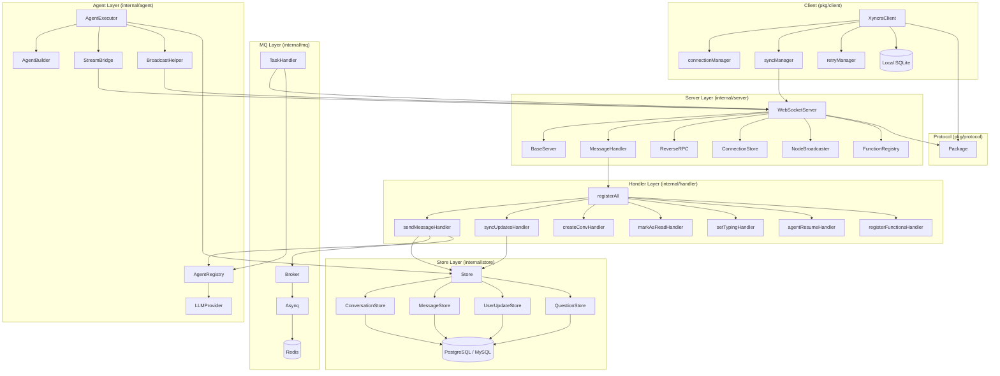

# 组件关系

## 概览

```
               ┌─────────────────────────┐
               │    xyncra-server CLI     │
               │   (cmd/xyncra-server)    │
               └───────────┬─────────────┘
                           │
               ┌───────────▼─────────────┐
               │    WebSocketServer       │
               │   (internal/server)      │
               │                          │
               │  ┌──────────────────┐   │
               │  │ DefaultMessage    │   │
               │  │ Handler           │──┼─── RPC Method Handlers
               │  └──────────────────┘   │        (internal/handler)
               │                          │
               │  ┌──────────────────┐   │
               │  │ ReverseRPC       │   │─── Server-initiated RPC
               │  └──────────────────┘   │
               │                          │
               │  ┌──────────────────┐   │
               │  │ NodeBroadcaster   │   │─── Cross-node Pub/Sub
               │  └──────────────────┘   │
               │                          │
               │  ┌──────────────────┐   │
               │  │ FunctionRegistry  │   │─── Client func mgmt
               │  └──────────────────┘   │
               └────┬──────┬──────┬─────┘
                    │      │      │
           ┌────────┘      │      └────────┐
           ▼               ▼               ▼
   ┌────────────┐  ┌────────────┐  ┌──────────────┐
   │   Store    │  │   MQ       │  │   Agent      │
   │(internal/  │  │(internal/  │  │(internal/    │
   │ store)     │  │ mq)        │  │ agent)       │
   │            │  │            │  │              │
   │ PostgreSQL │  │ Asynq      │  │ Eino ADK     │
   │ MySQL      │  │ (Redis)    │  │ (LLM + Tools)│
   └────────────┘  └────────────┘  └──────────────┘
```

## Server ↔ Store 依赖

### 接口定义

`internal/server/server.go`：

```go
type ServerDeps interface {
    Store() store.StoreAPI
    Broker() mq.Broker
    ConnectionStore() ConnectionStore
}
```

### StoreAPI 接口

`internal/store/store.go`：

```go
type StoreAPI interface {
    ConversationStore() *ConversationStore
    MessageStore() *MessageStore
    UserUpdateStore() *UserUpdateStore
    QuestionStore() *QuestionStore

    // 复合操作
    SendMessage(ctx context.Context, msg *model.Message, memberIDs []string) (*SendMessageResult, error)

    Transaction(ctx context.Context, fn func(tx *gorm.DB) error) error
    AutoMigrate(ctx context.Context) error
    Ping(ctx context.Context) error
    HealthCheck(ctx context.Context) error
}
```

### Handler → Store 调用关系

| Handler | Store 调用 | 说明 |
|---------|-----------|------|
| `sendMessageHandler` | `Store.SendMessage()`, `ConversationStore.Get()`, `MessageStore.GetByClientMessageID()` | 事务持久化 + 幂等性回查 |
| `syncUpdatesHandler` | `UserUpdateStore.GetLatestSeq()`, `UserUpdateStore.ListByUserRange()` | 增量同步 |
| `createConversationHandler` | `ConversationStore.FindOrCreate()` | find-or-create 幂等 |
| `listConversationsHandler` | `ConversationStore.ListByUser()` | 会话列表 |
| `getMessagesHandler` | `MessageStore.ListByConversation()` | 消息分页 |
| `searchMessagesHandler` | `MessageStore.SearchByConversation()` | 全文搜索 |
| `getConversationHandler` | `ConversationStore.Get()`, `MessageStore.CountUnread()`, `QuestionStore.GetByConversation()` | 会话详情 + 未读 + HITL |
| `deleteConversationHandler` | `ConversationStore.FindForDelete()`, `SoftDelete + MessageStore cascade` | 级联删除 |
| `restoreConversationHandler` | `ConversationStore.FindForRestore()`, `Restore + MessageStore cascade` | 级联恢复 |
| `deleteMessageHandler` | `MessageStore.Get()`, `MessageStore.SoftDelete()` | 消息删除 |
| `markAsReadHandler` | `ConversationStore.UpdateLastRead()` | MAX 语义更新读指针 |
| `agentResumeHandler` | `ConversationStore.Get()`, `QuestionStore` | HITL 恢复 |

**设计原则**：
- Handler 只通过 `StoreAPI` 接口操作数据，不直接访问数据库
- 复合操作（`SendMessage`）在 Store 层封装事务边界
- 每个 Handler 有完整单元测试（`*_test.go`），使用 mock store

## Server ↔ MQ 依赖

### Broker 接口

`internal/mq/mq.go`：

```go
type Broker interface {
    Enqueue(ctx context.Context, task *Task, opts ...EnqueueOption) (string, error)
    Start(ctx context.Context, handler Handler) error
    Stop()
    GetTaskState(ctx context.Context, taskID string) (TaskState, error)
}

type Task struct {
    Type      string          // 任务类型，如 "mq:send_message"
    Payload   json.RawMessage // 任务数据
    ID        string          // 可选任务 ID
    Queue     string          // 目标队列（critical/default/low）
    MaxRetry  int
    Timeout   time.Duration
    Retention time.Duration
    ProcessIn time.Duration
}
```

### Handler → MQ 调用关系

Handler 作为 MQ 的生产者：

| 场景 | 任务类型 | 生产者 | 说明 |
|------|----------|--------|------|
| 发送消息 | `mq:send_message` | `sendMessageHandler` | 广播实时消息 |
| 发送给 Agent | `mq:agent_process` | `sendMessageHandler` | Agent AI 处理 |
| Agent 恢复 | `mq:agent_resume` | `agentResumeHandler` | HITL 恢复 |
| 会话创建 | `mq:send_message` | `createConversationHandler` | 广播新会话 |
| 会话删除 | `mq:send_message` | `deleteConversationHandler` | 广播删除 |
| 会话恢复 | `mq:send_message` | `restoreConversationHandler` | 广播恢复 |
| 消息删除 | `mq:send_message` | `deleteMessageHandler` | 广播删除 |
| 读指针更新 | `mq:send_message` | `markAsReadHandler` | 广播读指针 |

Handler 作为 MQ 的消费者（`internal/mq/handler.go`）：

| 任务类型 | 消费者 | 说明 |
|----------|--------|------|
| `mq:send_message` | `NewSendMessageTaskHandler` | 调用 `BroadcastUpdates` 推送 |
| `mq:agent_process` | `AgentTaskHandler` | 执行 Agent 处理管道 |
| `mq:agent_resume` | `NewAgentResumeHandler` | 恢复 HITL 中断的 Agent |

### 关键设计

**Fire-and-Forget 模式**（D-007）：
- MQ 入队失败不阻塞 Handler 响应
- 数据已持久化，通过 `sync_updates` 最终一致
- 消费端失败返回 nil（错误已转化为友好消息，D-073）

**队列优先级**：
- `critical`：权重 6（消息推送）
- `default`：权重 3（普通任务）
- `low`：权重 1（后台任务）

**Agent 任务特殊配置**：
- `max_retry = 20`（Agent 处理可重试 20 次）
- `mq:agent_process` 默认重试 3 次，消耗完转为错误消息

## Server ↔ Agent 依赖

### AgentRegistry

`internal/agent/config.go`：

```go
type AgentRegistry struct {
    // 从磁盘目录加载 Agent 配置，支持运行时热更新
}
```

Agent 通过 Handler 间接与 Server 交互：

```
sendMessageHandler
    │
    ├─ Is peer an agent? ──→ agentRegistry.IsAgent(peerID)
    │                             │
    │                             └─ config loaded from disk (D-077)
    │
    └─ Enqueue mq:agent_process ──→ MQ
                                       │
                              AgentTaskHandler
                                       │
                              AgentExecutor.Execute()
                                       │
                              ┌────────┼────────┐
                              │        │        │
                              ▼        ▼        ▼
                         Store     Stream    Broadcast
                         (persist  Bridge   Helper
                          msg/     (stream   (agent_status,
                          conv)    text      agent_timeout)
                                   push)
```

### StreamBridge：Agent → Client 实时反馈

Agent 执行期间通过 StreamBridge 发送实时状态：

| 事件 | 推送内容 |
|------|----------|
| Agent 正在思考 | `agent_status = "thinking"` |
| Agent 调用工具 | `agent_status = "tool_calling"` |
| Agent 生成回复 | `agent_status = "generating"` → `stream_text` 流式输出 |
| Agent 空闲 | `agent_status = "idle"` |
| Agent 询问用户 | `agent_status = "asking_user"`（HITL 中断） |
| Agent 超时 | `agent_timeout` |

### Agent Tool 调用链

Agent 可以调用客户端注册的函数（`system.register_functions`，D-098）：

```
Agent(LLM) ── Tool Call ──→ DynamicToolProvider
                                │
                     ReverseRPC.ServerRequest(userID, deviceID, "client.callFunction", params)
                                │
                     WebSocket ──→ Client
                     Client ──→ WebSocket (response)
                                │
                     AgentExecutor 继续执行
```

## Client ↔ Server 协议契约

### 传输协议

```
WebSocket TextMessage, JSON encoded
URL: ws://server/ws?user_id={userID}&device_id={deviceID}
```

### 连接生命周期

```
Client                           Server
  │                                │
  │──── HTTP Upgrade ────────────→│
  │    (user_id + device_id)      │
  │                                │
  │◄── Connection Established ────│
  │                                │
  │──── system.reconnect ────────→│  (if reconnecting)
  │◄── {replay_requests} ─────────│
  │                                │
  │──── system.register_functions→│  (optional)
  │◄── {ok} ──────────────────────│
  │                                │
  │──── sync_updates(after_seq=0)→│  FullSync
  │◄── {updates, has_more} ───────│
  │     ... paginated ...         │
  │                                │
  │~~~~ message send/receive ~~~~~│
  │                                │
  │──── heartbeat ───────────────→│  (periodic)
  │◄── {ok} ──────────────────────│
  │                                │
  │◄── PackageTypeUpdates ────────│  (push)
  │     (seq, type, payload)      │
  │                                │
  │◄── PackageTypeRequest ────────│  ReverseRPC
  │──── PackageTypeResponse ─────→│  (D-092)
  │                                │
  │              OR                │
  │◄── 4001 Close Frame ──────────│  Device replacement (D-095)
  │      Client exits (exit 0)    │
  │                                │
  │              OR                │
  │ Network disconnect            │
  │ Exponential backoff reconnect  │
  │                                │
```

### 客户端本地优先读（D-035）

对于读操作，客户端 SDK 优先从本地 SQLite 读取：

| 读操作 | 读取来源 | 补充机制 |
|--------|----------|----------|
| `ListConversations` | 本地 DB | 创建/删除/恢复后同步 |
| `GetMessages` | 本地 DB | `FetchMoreMessages` 按需拉取（D-126） |
| `GetConversation` | 本地 DB | `Pull-on-Notification` 保持最新 |
| `SearchMessages` | 本地 DB | - |

写操作都走 RPC：

| 写操作 | 路径 |
|--------|------|
| `SendMessage` | RPC → Server → Store → MQ |
| `CreateConversation` | RPC → Server → Store → MQ |
| `DeleteConversation` | RPC → Server → Store → MQ |
| `DeleteMessage` | RPC → Server → Store → MQ |
| `MarkAsRead` | RPC → Server → Store → MQ |

## 接口边界总览

```
                    ┌─────── Interface Boundary ───────┐
                    │                                   │
  pkg/protocol ◄───┤  protocol.Package                  │
  (protocol        │  protocol.PackageDataRequest       │
   definition)     │  protocol.PackageDataResponse      │
                    │  protocol.PackageDataUpdates       │
                    │  protocol.HandlerError             │
                    └────────┬──────────────────────────┘
                             │
                    ┌────────▼──────────────────────────┐
  internal/server   │  Server interface                  │
  (server layer)    │    Start / Stop / GracefulStop     │
                    │    Store() → store.StoreAPI         │
                    │    Broker() → mq.Broker             │
                    │  MessageHandler interface           │
                    │  ConnectionStore interface          │
                    │  NodeBroadcaster interface          │
                    │  ReverseRPC (ServerRequest)         │
                    │  FunctionRegistry interface         │
                    └────────┬──────────────────────────┘
                             │
                    ┌────────▼──────────────────────────┐
  internal/handler  │  MethodHandler interface            │
  (business         │    HandleRequest(ctx, client, req)  │
   logic)          │  Dependencies struct                 │
                    │    Store, Broker, BroadcastFn,       │
                    │    AgentRegistry, ReverseRPC         │
                    └────────┬──────────────────────────┘
                             │
              ┌──────────────┼──────────────┐
              │              │              │
              ▼              ▼              ▼
  ┌──────────────┐ ┌──────────────┐ ┌──────────────┐
  │ store.StoreAPI││ mq.Broker    ││ agent.        │
  │ (internal/   ││ (internal/   ││ AgentRegistry │
  │  store)      ││  mq)         ││ (internal/    │
  │              ││              ││  agent)       │
  │ GORM / SQL   ││ Asynq/Redis ││ Eino ADK      │
  └──────────────┘ └──────────────┘ └──────────────┘
```

## 模块依赖关系（package 层面）

```
cmd/xyncra-server
    ├── internal/server
    │   ├── internal/store
    │   │   ├── internal/store/model
    │   │   └── gorm.io/gorm
    │   ├── internal/mq
    │   │   └── github.com/hibiken/asynq
    │   ├── internal/handler
    │   │   ├── internal/server
    │   │   ├── internal/store
    │   │   ├── internal/mq
    │   │   └── internal/agent
    │   └── pkg/protocol
    │
    pkg/client
    ├── pkg/protocol
    └── pkg/store
        └── gorm.io/gorm + glebarez/sqlite
```

## Mermaid 组件关系图


