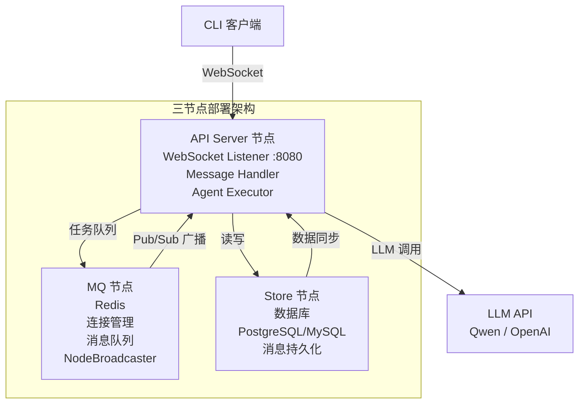
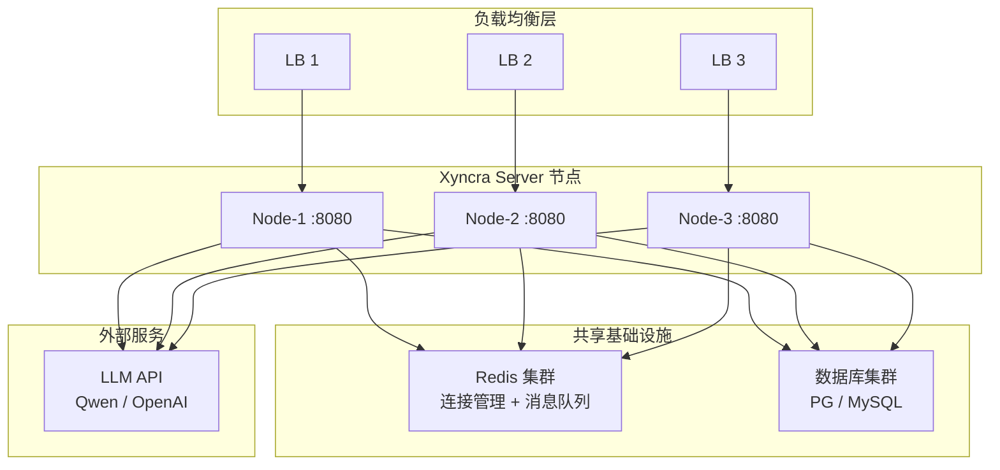

# 部署拓扑

> last_updated: 2026-07-17

## 概述

Xyncra Server 是一个实时消息 + AI Agent 服务器，支持多种部署方式。本文档描述不同部署模式的拓扑结构和组件关系。

## 核心架构



```
┌─────────────────────────────┐
│      负载均衡 / 反向代理      │
│    (Nginx / ALB / Cloud LB) │
└──────────┬──────────────────┘
           │
           ▼
┌─────────────────────────────┐
│     Xyncra Server 节点       │
│  ┌───────────────────────┐  │
│  │  WebSocket Listener    │  │ 端口 8080
│  │  /ws (WebSocket)      │  │
│  │  /health (HTTP)       │  │
│  └──────────┬────────────┘  │
│             │               │
│  ┌──────────▼────────────┐  │
│  │    Message Handler     │  │
│  │  (路由、业务逻辑)      │  │
│  └──────────┬────────────┘  │
│             │               │
│  ┌──────────▼────────────┐  │
│  │    Agent Executor      │  │
│  │  (Eino ADK 运行时)     │  │
│  └──────────┬────────────┘  │
└─────────────┼────────────────┘
              │
    ┌─────────┴───────────────┐
    │           │              │
    ▼           ▼              ▼
┌────────┐ ┌────────┐ ┌──────────────┐
│ Redis  │ │ SQLite │ │ LLM API      │
│ 缓存/  │ │/MySQL  │ │ (Qwen/       │
│ 消息队列│ │/PG     │ │  OpenAI)     │
└────────┘ └────────┘ └──────────────┘
```

## 部署模式

### 模式一：单二进制部署（开发/测试）

最简单的部署方式，适用于开发和测试环境。

```
┌───────────────────────────────────┐
│         单台服务器                  │
│  ┌─────────────────────────────┐  │
│  │ xyncra-server               │  │
│  │  - 内嵌 SQLite 数据库       │  │
│  │  - 连接本地 Redis           │  │
│  │  - 提供 WebSocket :8080     │  │
│  └─────────────────────────────┘  │
└───────────────────────────────────┘
```

**启动命令**：
```bash
make build
./bin/xyncra-server \
  -addr :8080 \
  -redis-addr localhost:6379 \
  -db-driver sqlite \
  -db-dsn xyncra.db
```

**依赖**：
- Redis 实例（必须）

### 模式二：Docker Compose 部署（生产推荐）

适用于生产环境，使用 Docker Compose 编排。

```
┌──────────────────────────────────────┐
│             Docker Host               │
│                                      │
│  ┌──────────────┐  ┌──────────────┐  │
│  │ xyncra-server │  │    Redis     │  │
│  │   镜像        │  │ 7-alpine     │  │
│  │ 端口 8080    │  │ 端口 6379    │  │
│  │ 数据卷 /data │  │ 数据卷 /data │  │
│  └──────┬───────┘  └──────┬───────┘  │
│         │                 │          │
│         │   网络: xyncra-net         │
└─────────┼────────────────────────────┘
          │
          ▼
    外部客户端 (WebSocket)
```

**deploy/docker-compose.yml**：
```yaml
services:
  xyncra-server:
    build: .
    ports:
      - "8080:8080"
    environment:
      - XYNCRA_ADDR=:8080
      - XYNCRA_REDIS_ADDR=redis:6379
      - XYNCRA_DB_DRIVER=sqlite
      - XYNCRA_DB_DSN=/data/xyncra.db
    volumes:
      - xyncra-data:/data
    depends_on:
      redis:
        condition: service_healthy
    restart: unless-stopped

  redis:
    image: redis:7-alpine
    volumes:
      - redis-data:/data
    healthcheck:
      test: ["CMD", "redis-cli", "ping"]
      interval: 10s
      timeout: 5s
      retries: 3
    restart: unless-stopped

volumes:
  xyncra-data:
  redis-data:
```

### 模式三：水平扩展部署（高可用）

适用于需要水平扩展的生产环境。



**关键点**：
│ :8080  │ │ :8080  │ │ :8080  │
└───┬────┘ └───┬────┘ └───┬────┘
    │         │         │
    └─────────┼─────────┘
              │
              ▼
      ┌──────────────┐
      │  Redis 集群   │  ← 共享状态（连接管理 + 消息队列）
      │  (主从/集群)  │
      └──────────────┘

      ┌──────────────┐
      │  数据库集群   │  ← 持久化存储
      │ (PG/MySQL)   │
      └──────────────┘
```

**关键点**：
- WebSocket 连接有状态，需要负载均衡器支持会话亲和性（sticky session）
- 跨节点消息路由通过 Redis Pub/Sub 实现（NodeBroadcaster）
- 所有节点共享同一个 Redis 实例
- 数据库建议使用 PostgreSQL 或 MySQL（非 SQLite）

## 网络端口

| 端口 | 协议 | 用途 | 绑定 |
|------|------|------|------|
| 8080 | TCP | WebSocket + HTTP | 服务端口 |
| 6379 | TCP | Redis | 内部依赖 |
| 4317 | TCP | Jaeger OTLP gRPC | 追踪数据接收 |
| 4318 | TCP | Jaeger OTLP HTTP | 追踪数据接收 |
| 16686 | TCP | Jaeger UI | 链路可视化 |
| 18080 | TCP | E2E 测试服务器 | 测试环境 |
| 16379 | TCP | E2E 测试 Redis | 测试环境 |
| 14317 | TCP | E2E Jaeger OTLP gRPC | 测试环境 |
| 14318 | TCP | E2E Jaeger OTLP HTTP | 测试环境 |
| 16687 | TCP | E2E Jaeger UI | 测试环境 |
| 24317 | TCP | Multi-Node Jaeger OTLP gRPC | 多节点环境 |
| 24318 | TCP | Multi-Node Jaeger OTLP HTTP | 多节点环境 |
| 26686 | TCP | Multi-Node Jaeger UI | 多节点环境 |

## 所需基础设施

### 必须组件

| 组件 | 用途 | 最低版本 |
|------|------|----------|
| Redis | 连接管理、消息队列、Agent 状态管理 | 7.x |
| 数据库 | 消息持久化、配置存储 | SQLite/MySQL 8/PostgreSQL 15 |

### 可选组件

| 组件 | 用途 | 适用场景 |
|------|------|----------|
| Nginx/ALB | 负载均衡、TLS 终止 | 多节点部署 |
| LLM API | AI Agent 推理 | 启用 Agent 功能 |
| MCP Server | 外部工具供应 | Agent 需调用外部工具 |
| Jaeger | 分布式链路追踪可视化 | 启用链路排查 |
| Prometheus | 指标采集 | 启用监控 |
| Grafana | 指标可视化 | 启用监控 |
| Loki/ELK | 日志聚合 | 多节点日志收集 |

## Docker 镜像规范

参考 `deploy/Dockerfile`：

- **基础镜像**：`alpine:3.20`
- **Go 版本**：`1.26`（构建阶段）
- **用户**：`xyncra`（UID 1000，非 root）
- **健康检查**：`curl -f http://localhost:8080/health`
- **暴露端口**：`8080`
- **Agent 配置**：镜像中包含 `agents/` 目录
- **二进制优化**：`CGO_ENABLED=0`，`-ldflags="-s -w"`

## E2E 测试环境

参考 `deploy/docker-compose.e2e.yml`：

```
┌──────────────────────────────┐
│      Docker E2E 环境          │
│                              │
│  ┌──────────────────────┐   │
│  │ xyncra-server-e2e    │   │
│  │ 端口 18080 → 8080   │   │
│  │ SQLite 数据库        │   │
│  │ LLM 日志卷           │   │
│  │ .env                  │   │
│  └──────────┬───────────┘   │
│             │                │
│  ┌──────────▼───────────┐   │
│  │ redis-e2e             │   │
│  │ 端口 16379 → 6379   │   │
│  │ DB 15 (隔离数据)     │   │
│  └──────────────────────┘   │
└──────────────────────────────┘
```

端口选择遵循 D-043 规范，避免与本地开发环境冲突。

## Jaeger 链路追踪部署

所有 docker-compose 文件都集成了 Jaeger All-in-One 作为链路追踪后端，使用 Badger 嵌入式存储（无需外部数据库）。

### deploy/docker-compose.yml（开发/生产）

```
┌──────────────────────────────┐
│      Docker 环境              │
│                              │
│  ┌──────────────────────┐   │
│  │ xyncra-server        │   │
│  │ 端口 8080            │   │
│  │ TRACING_ENABLED=true │   │
│  │ OTLP→jaeger:4317    │   │
│  └──────────┬───────────┘   │
│             │                │
│  ┌──────────▼───────────┐   │
│  │ jaeger               │   │
│  │ 4317 (OTLP gRPC)    │   │
│  │ 4318 (OTLP HTTP)    │   │
│  │ 16686 (Jaeger UI)   │   │
│  │ Badger 持久化存储     │   │
│  └──────────────────────┘   │
└──────────────────────────────┘
```

### deploy/docker-compose.e2e.yml（E2E 测试）

端口偏移避免与开发环境冲突：

| 服务 | 端口映射 |
|------|----------|
| jaeger-e2e OTLP gRPC | 14317:4317 |
| jaeger-e2e OTLP HTTP | 14318:4318 |
| jaeger-e2e UI | 16687:16686 |

### deploy/docker-compose.multi-node.yml（多节点）

多节点环境共享同一个 Jaeger 实例：

| 服务 | 端口映射 |
|------|----------|
| jaeger-mn OTLP gRPC | 24317:4317 |
| jaeger-mn OTLP HTTP | 24318:4318 |
| jaeger-mn UI | 26686:16686 |

三个 server 节点（xyncra-node-a/b/c）均配置 `XYNCRA_TRACING_OTLP_ENDPOINT=jaeger-mn:4317`。

### Jaeger 配置详情

所有环境使用统一的 Jaeger 配置：

- **镜像**：`jaegertracing/all-in-one:latest`
- **存储**：Badger（嵌入式 KV 存储）
  - `SPAN_STORAGE_TYPE=badger`
  - `BADGER_EPHEMERAL=false`（持久化到 volume）
  - `BADGER_DIRECTORY_KEY=/badger/data_keys`
  - `BADGER_DIRECTORY_VALUE=/badger/data`
- **健康检查**：`wget --spider http://localhost:16686`，间隔 10s，超时 5s，重试 3 次
- **数据卷**：
  - 开发：`jaeger-badger`
  - E2E：`jaeger-badger-e2e`
  - 多节点：`jaeger-badger-mn`

### Server 端追踪环境变量

```bash
XYNCRA_TRACING_ENABLED=true
XYNCRA_TRACING_OTLP_ENDPOINT=jaeger:4317   # docker 内；本地开发用 localhost:4317
XYNCRA_TRACING_OTLP_INSECURE=true
XYNCRA_TRACING_SAMPLING_RATE=1.0
```

详见 [分布式追踪](../observability/distributed-tracing.md) 和 [配置参考](../onboarding/configuration.md)。
