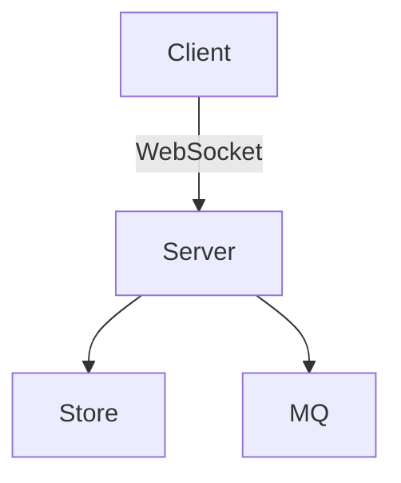

# 文档编写指南

> last_updated: 2026-07-17

## 概述

本文档定义 Xyncra Wiki 文档的编写规范，包含写作风格、文档模板、创建新视角/主题的决策标准、审阅流程、版本追踪策略，以及"不该写什么"的原则。所有文档贡献者必须遵守本指南。

---

## 写作风格

### 语言

所有 Wiki 文档使用**简体中文**写作。原因：

1. 项目主要使用中文进行内部沟通
2. 目标读者以中文使用者为主
3. 与现有文档保持一致

技术术语使用英文原文，首次出现时在括号内标注中文翻译：

```
WebSocket（全双工通信协议）
ReverseRPC（反向远程过程调用）
HITL（Human-in-the-Loop，人工介入）
```

### 语气和风格

| 维度 | 要求 | 说明 |
|------|------|------|
| 语气 | 客观、平实 | 避免"令人惊叹"、"非常简单"等主观表述 |
| 句式 | 短句优先 | 每句话控制在 30 字以内，避免多层嵌套 |
| 人称 | 不使用第一人称 | 使用"开发者"、"用户"、"系统"等第三人称 |
| 情绪 | 中性 | 不评价好坏，只陈述事实和理由 |
| 复杂度 | 循序渐进 | 先概述再详述，先背景再决策 |

### 结构要求

1. **标题层级清晰**：H1 为文档标题，H2 为章节，H3 为子章节，最多到 H4
2. **段落简洁**：每个段落不超过 5 句话，表达一个完整意思
3. **列表适度**：列表不超过 7 项，超过则考虑表格
4. **代码示例**：必要的代码示例必须可运行或可验证

### 标点规范

| 符号 | 使用规范 |
|------|----------|
| 逗号 `，` | 中文句子内使用全角逗号 |
| 句号 `。` | 中文句子结尾使用全角句号 |
| 括号 `（）` | 中文括号内使用全角括号，英文术语使用半角括号 |
| 冒号 `：` | 中文句子内使用全角冒号 |
| 引号 `""` | 中文文本中使用全角引号 |
| 代码/路径 | 使用反引号 `` ` `` 包裹 |
| 连字符 `-` | 用于无序列表，项目符号后加空格 |

**正确示例**：
```
消息发送使用 WebSocket（全双工通信协议）传输，通过 `send_message` 方法
实现。序列号从 1 开始递增，每对 `(user_id, conversation_id)` 独立计数。

支持的消息类型包括：
- 文本消息（text）
- 图片消息（image）
- 系统消息（system）
```

**错误示例**：
```
消息发送使用WebSocket传输。序列号从1开始递增。每对(user_id,conversation_id)独立计数。
```

### 数量词规范

- 数字和单位之间不加空格：`5ms`、`200KB`、`10个连接`
- 数字使用阿拉伯数字：`3 层`、`5 个组件`，非 `三层`、`五个组件`
- 范围使用 `~` 而不是 `-`：`100~500ms`、`3~5 个节点`
- 百分数使用 `%`：`99.9%`

---

## 文档模板

### 主题文档模板

```markdown
# 文档标题

## 概述

<一句话说明本文档的主题和读者预期收获。>

<1-2 段概述性内容，帮助读者判断本文档是否对其有用。>

## <核心概念或背景>

<如果有必要，先介绍背景知识。不是所有文档都需要这部分。>

## <主章节 1>

<文档核心内容。通常每个章节聚焦一个子主题。>

## <主章节 2>

...

## 注意事项

<可选章节。列出使用或理解本文档内容时需要注意的事项。>

## 相关文档

- <交叉引用 1>
- <交叉引用 2>
```

### 模板使用说明

- H1 `#` 只能有一个，即文档标题
- 章节标题从 H2 `##` 开始
- `概述` 章节是必须的，让读者快速了解文档范围
- `相关文档` 章节在最后列出交叉引用
- 代码示例必须标注语言类型
- 表格必须有表头行（表头与内容之间的分隔线不可省略）

### 代码块规范

```markdown
```go
// Go 代码示例
func Hello() string {
    return "world"
}
```

```bash
# Shell 命令
$ make build
```

```json
{
  "key": "value"
}
```

```text
# 纯文本
ASCII art 或日志输出
```
```

代码块规则：

1. 必须标注语言类型，不允许使用未标注的代码块
2. 代码块中的代码应当是完整的、可理解的片段
3. 避免在代码块中使用省略号 `...` 除非上下文非常清晰
4. 注释使用英文（与代码注释规范一致）

### 表格规范

```markdown
| 左对齐列 | 居中列 | 右对齐列 |
|----------|:------:|---------:|
| 内容     | 内容   | 内容     |
```

表格规则：

1. 表头分隔线不可省略
2. 列数尽量控制在 5 列以内
3. 单元格内容尽量简洁，避免换行
4. 必要时使用 HTML `<br>` 实现单元格内换行

---

## 创建新视角 vs 新主题

### 决策树

```
有一个新的文档需求
    │
    ├─ 是否属于已有视角？
    │   ├─ 是 → 是否适合归入已有主题？
    │   │   ├─ 是 → 扩展现有主题文档
    │   │   └─ 否 → 创建新的主题文档
    │   └─ 否 → 是否有 3 个以上候选主题？
    │       ├─ 是 → 评估创建新视角
    │       └─ 否 → 暂时放入最接近的已有视角
    │
    └─ 创建后检查：
        ├─ index.md 是否已更新？
        ├─ 交叉引用是否已添加？
        └─ 是否通知了相关读者？
```

### 创建新主题的判断标准

满足以下任一条件时，应创建新的主题文档而非扩展现有文档：

1. **主题独立性**：新内容与现有文档的内容无明显重叠，可以独立阅读
2. **篇幅适中**：新内容预计超过 200 行，放入现有文档将导致文档过长
3. **读者群体**：新内容的读者群体与现有文档不同（例如，有的是给开发者看的，有的是给运维看的）
4. **关注频率**：新内容对应的主题会被频繁单独查阅

### 扩展已有主题的判断标准

以下情况应扩展现有文档而非创建新文档：

1. 新内容是现有主题的补充细节，不改变主题范围
2. 新内容少于 50 行，不值得独立成文
3. 新内容与现有文档的读者群体完全一致
4. 新内容是对现有内容的修正或更新

### 创建新视角的判断标准

以下所有条件满足时才考虑创建新视角：

1. 有至少 3 个以上候选主题文档
2. 有明确的、区别于现有视角的目标读者群体
3. 有维护者愿意持续维护该视角
4. 内容不会与现有视角产生严重重叠

### 创建流程

创建新主题文档：

1. 确定文档名称（遵循文件命名规范）
2. 使用模板创建文档内容
3. 更新所在视角的 `index.md`，添加主题文档条目
4. 检查是否需要更新 `wiki/index.md`
5. 添加必要的交叉引用

创建新视角目录：

1. 提出视角 proposal 说明理由
2. 列出至少 3 个候选主题文档
3. 确定维护者
4. 创建视角目录和 `index.md`
5. 更新 `wiki/index.md` 的视角列表
6. 逐步完善各主题文档

---

## 文档审阅流程

### 审阅级别

| 级别 | 适用范围 | 审阅者 | 要求 |
|------|----------|--------|------|
| L1 快速检查 | 小型修正（错别字、格式） | 提交者自行检查 | 无需正式审阅 |
| L2 同级审阅 | 新增主题文档、重大更新 | 至少 1 名同事 | 需要确认内容准确 |
| L3 团队审阅 | 新视角创建、跨视角变更 | 团队 Lead + 相关维护者 | 需要在 PR 中讨论 |

### 审阅检查项

审阅者按以下维度检查文档：

**准确性**：
- 技术描述是否与代码行为一致
- 配置项、API 参数是否正确
- 代码示例是否可运行

**完整性**：
- 是否覆盖了读者需要了解的全部内容
- 是否遗漏了关键的前置条件或注意事项
- 交叉引用是否完整

**可理解性**：
- 读者是否能从文档中获取所需信息
- 是否有未解释的术语或缩写
- 步骤是否清晰可执行

**格式规范性**：
- 是否符合本文档定义的写作规范
- Markdown 渲染是否正确
- 文件名和路径是否符合规范

### PR 中的文档变更

当 PR 包含文档变更时：

1. PR 标题添加 `[docs]` 前缀（如：`[docs] 更新 WebSocket 协议说明`）
2. PR 描述说明文档变更的范围和原因
3. 如果涉及代码变更，PR 应指出代码变更对应的文档更新
4. 如果文档变更涉及多个视角，列出所有修改的文件

### PR 文档审查 Checklist

PR 审查者在审查包含文档变更的 PR 时，应逐项核对以下清单：

**同步检查**：
- [ ] 代码变更是否有对应的文档更新？
- [ ] 新增功能是否有对应的文档？
- [ ] 修改的 API/配置是否更新了相关文档？
- [ ] 废弃的功能是否在文档中标记？

**准确性检查**：
- [ ] 代码示例是否可编译/可运行？
- [ ] 参数名、配置项名与代码一致？
- [ ] 文件路径和行号引用正确？
- [ ] 设计决策 ID（D-xxx）引用正确？

**格式检查**：
- [ ] 遵循本文档的写作规范（标点、术语、数量词）？
- [ ] 代码块标注了语言类型？
- [ ] 内部链接可跳转？
- [ ] Mermaid/ASCII 图渲染正确？

**完整性检查**：
- [ ] 是否需要更新 `index.md`？
- [ ] 交叉引用是否已添加？
- [ ] 跨视角变更是否通知了相关维护者？

### 审阅自动检查

在 CI 中应包含以下文档检查（可选，逐步实施）：

1. **内部链接检查**：确保所有 `wiki/` 内的交叉引用指向存在的文件
2. **代码块语言标注**：检查是否存在未标记语言的代码块（使用正则 ```` ```[^\n]` 匹配）
3. **文件名规范**：检查文件名是否遵循小写字母、连字符分隔的规范
4. **index.md 一致性**：验证 `index.md` 中的文档链接与实际文件列表一致
5. **Frontmatter 完整性**：检查文档是否包含 `last_updated` 字段

推荐使用 `markdownlint-cli` 配合自定义规则进行自动化检查：

```bash
# 安装
npm install -g markdownlint-cli

# 运行检查
markdownlint wiki/ --ignore wiki/node_modules
```

---

## 版本追踪

### 文档版本策略

Wiki 文档与项目代码**不独立版本化**。文档的状态跟随代码版本：

| 场景 | 版本策略 |
|------|----------|
| 文档随代码变更 | 文档与代码在同一 commit 中更新，版本与代码一致 |
| 纯文档改进（无代码变更） | 不需要版本号，建议在 Front Matter 更新 `updated` 日期 |
| 文档重组（移动、重命名） | 在 CHANGELOG 或 PR 描述中记录 |

### Front Matter 日期管理

每次对文档进行实质性修改后，建议更新 Front Matter 中的 `updated` 字段：

```yaml
---
updated: 2026-07-16
---
```

日期使用 `YYYY-MM-DD` 格式。仅格式化调整（如修正 Markdown 格式）不需要更新日期。

### 代码映射追踪

对于描述代码行为的文档（如 API 参考、配置说明），在文档中注明对应的代码位置：

```markdown
// internal/handler/send_message.go:42
// internal/store/conversation.go:88-120
```

这有助于在代码变更时快速定位需要更新的文档。

### 变更日志

不要求为每个文档维护独立的变更日志。重大文档变更有两种记录方式：

1. **跨文档变革**：在 `wiki/docs-management/` 下记录
2. **单个文档重大重写**：在 PR 描述中详细说明
3. **小型增量更新**：无需记录，通过 git log 追溯

---

## 什么是文档，什么不是

### 代码即事实

核心原则：**代码是最终的真相来源（Source of Truth）**。文档的目的是：

1. **解释为什么**——代码无法表达的上下文和决策理由
2. **概括全景**——代码片段无法展示的整体架构
3. **提供入门路径**——新读者需要的是引导而非全部细节
4. **记录约定和规范**——代码无法强制执行的团队约定

### 不应该文档化的内容

| 类别 | 原因 | 替代方案 |
|------|------|----------|
| 显而易见的代码逻辑 | 文档会与代码不同步 | 在代码中使用清晰的命名和注释 |
| 实现细节（变量名、函数内部逻辑） | 变化快，文档总是过时 | 代码自身 + 单元测试 |
| 所有配置项的穷举列表 | 篇幅太长，难以维护 | 指向代码中的配置结构体或默认值 |
| 人员信息（"由张三开发"） | 人会变动，信息很快过时 | git blame 和 CODEOWNERS |
| 计划中的功能 | 计划会变，文档产生误导 | 使用 Issue 或设计文档跟踪 |
| 重复的教程内容 | 增加维护负担 | 保持单一的"官方"教程 |
| 第三方库的详细使用文档 | 库本身有文档 | 只记录选择该库的理由和注意事项 |
| 完整的 Changelog | git log 已经记录了 | 只记录重大变更和不兼容的修改 |
| 示例代码的运行结果 | 结果可能随版本变化 | 让读者自行运行代码 |

### 应该文档化的内容

| 类别 | 说明 | 示例 |
|------|------|------|
| 设计决策和权衡 | 为什么选择 A 而不是 B | ADR 记录 |
| 架构概览和组件关系 | 整体视角，代码无法表达 | 系统架构、组件关系图 |
| 开发规范和约定 | 代码无法强制执行的约定 | 编码规范、命名约定 |
| 配置和环境说明 | 如何搭建和运行 | 开发环境设置 |
| 协议和接口规范 | 面向外部读者 | API 参考 |
| 测试策略和方法 | 如何保证质量 | 测试策略 |
| 运维和部署流程 | 如何运维 | 部署拓扑、CI/CD |
| 运维Playbook | 故障排查步骤 | 健康检查、错误码说明 |

### "文档债"处理

与代码债类似，文档也可能产生债务。识别并处理文档债：

| 文档债类型 | 表现 | 处理方式 |
|-----------|------|----------|
| 过时文档 | 描述的行为与代码不一致 | 更新或标记为废弃 |
| 缺失文档 | 新功能没有配套文档 | 尽快补充 |
| 重复文档 | 同一信息在多处出现 | 合并并交叉引用 |
| 错位文档 | 内容放在错误的视角中 | 移动到正确的视角 |

---

## 特殊内容处理

### 图表和图形

- 优先使用 Mermaid 语法绘制图表（架构图、流程图、状态机）
- Mermaid 图必须标注语言类型 `mermaid`
- 避免使用图片文件（难以维护、diff 不可读）

```markdown

```

### ASCII Art

仅在 Mermaid 无法表达的复杂布局中使用 ASCII art。ASCII art 必须：

- 使用等宽字体布局
- 标注为 `text` 代码块
- 包含图例说明

### 文件名和路径

- 所有文件路径使用反引号包裹：`/internal/handler/send_message.go`
- 路径使用相对于项目根目录的路径
- 目录名后加斜杠：`internal/handler/`

### 命令行示例

- Shell 命令使用 `bash` 代码块
- 命令输出使用 `text` 或 `bash` 代码块
- 需要以 root 执行的命令加 `sudo` 前缀
- 敏感信息（密码、token）使用占位符：`<your-api-key>`

---

## 辅助工具

### 推荐编辑器插件

- Markdownlint：检查 Markdown 格式规范
- Prettier：自动格式化 Markdown
- Code Spell Checker：检查拼写

### 本地预览

提交前在本地预览文档渲染效果：

```bash
# 使用 VS Code 内置预览（Cmd+Shift+V 或 Ctrl+Shift+V）
# 或使用 grip（GitHub 风格渲染）
grip wiki/<path-to-file>.md
```
