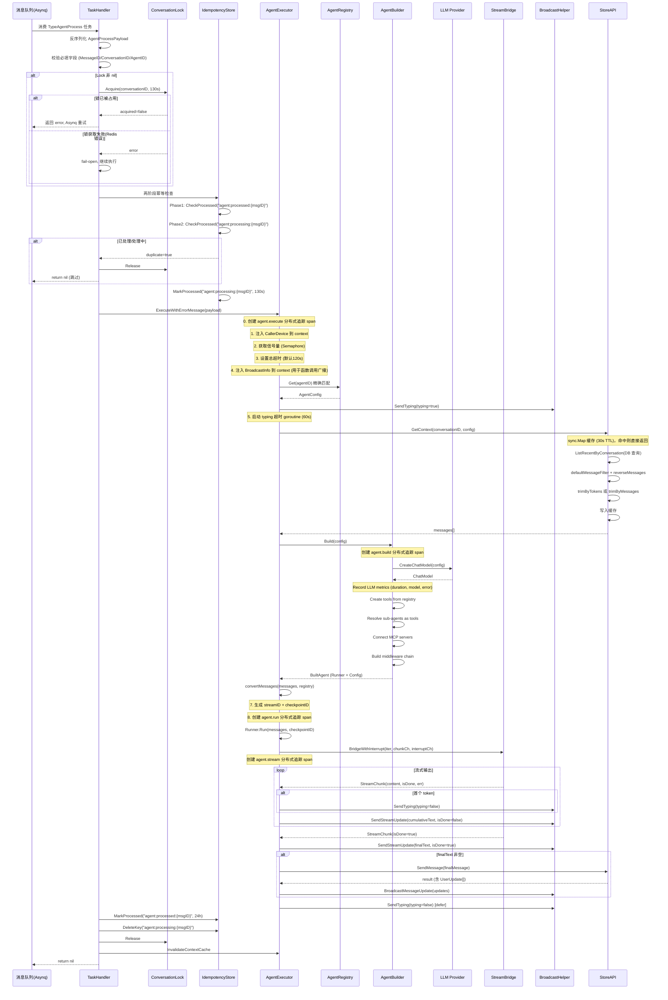
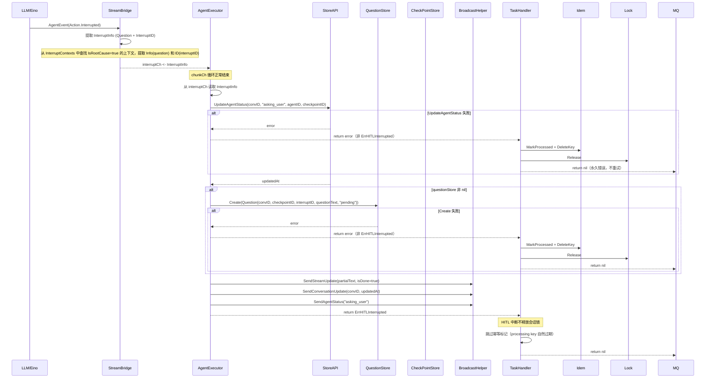
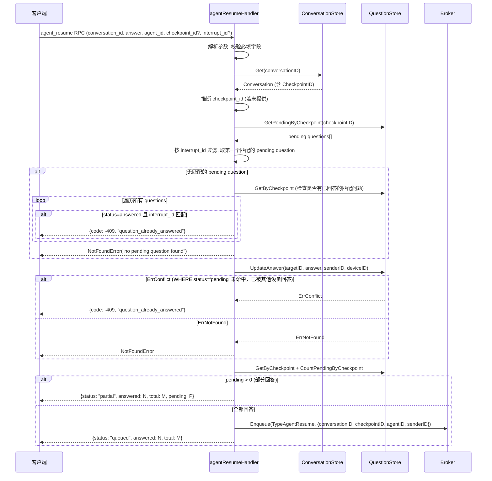
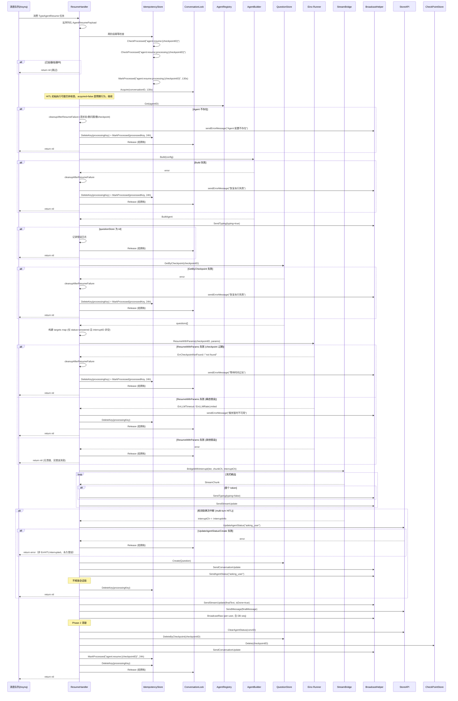
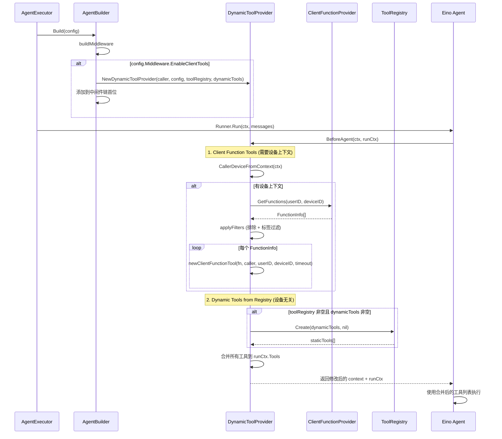
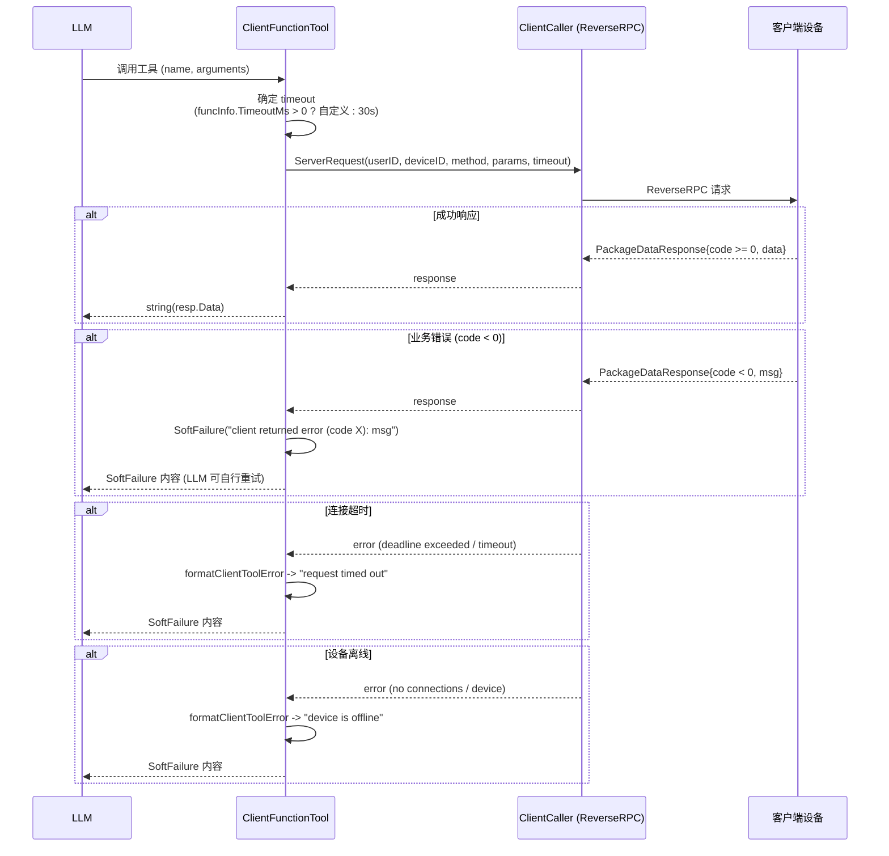
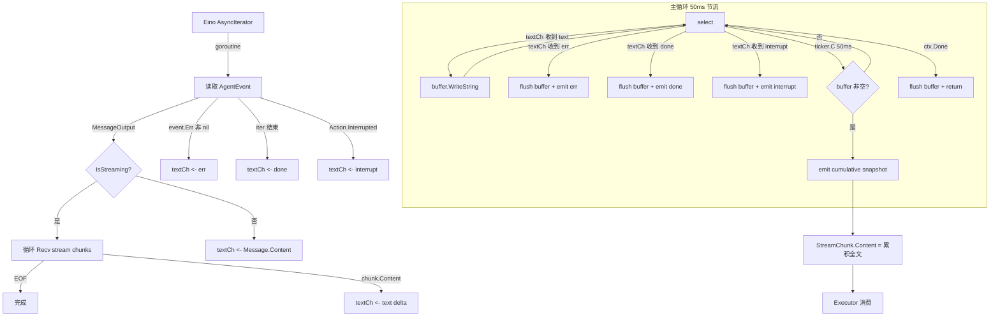
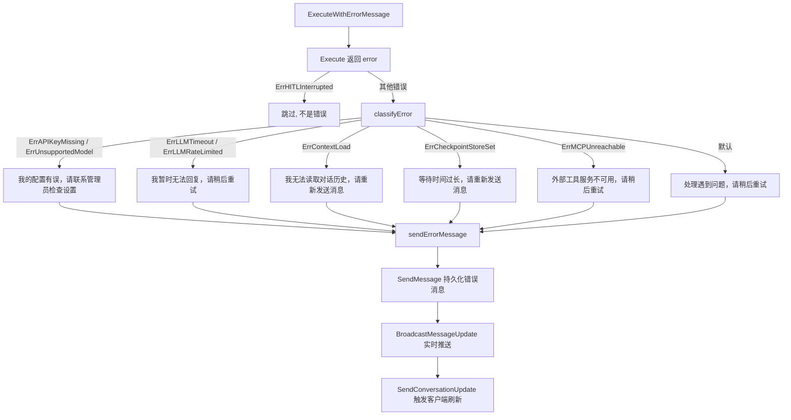

# Agent 执行引擎 & LLM 交互

> Agent 任务的完整生命周期：从 MQ 消费到 LLM 调用、流式输出、HITL 中断/恢复。

## 场景 1: Agent 任务执行主流程

### 主流程



### 边缘场景

#### 1. 信号量耗尽 (并发上限)
- 触发条件: 当前活跃 agent 执行数已达 maxConcurrent 上限
- 处理逻辑: Semaphore.Acquire 阻塞等待，若 ctx 被取消则返回 ctx.Err()
- 最终结果: 任务失败，错误通过 ExecuteWithErrorMessage 发送用户友好消息后返回 nil 给 MQ

#### 2. Agent 配置未找到
- 触发条件: registry.Get(agentID) 返回 false
- 处理逻辑: 返回 ErrAgentNotFound，classifyError 映射为 "抱歉，处理遇到问题，请稍后重试。"
- 最终结果: 错误消息持久化到对话，返回 nil 给 MQ（不重试）

#### 3. LLM 流式输出中途错误
- 触发条件: chunk.Err 非 nil（超时/限流/500/502/503/其他）
- 处理逻辑:
  - 将已累积的 partialText 通过 SendStreamUpdate(isDone=true) 广播
  - 若 partialText 非空则持久化为部分响应
  - 错误分类: context.DeadlineExceeded -> ErrLLMTimeout; 429/rate -> ErrLLMRateLimited; 500/502/503 -> ErrLLMTimeout; 其他未知错误 -> 不包装（直接透传原始错误，classifyError 兜底为 "处理遇到问题"）
- 最终结果: 返回包装后的错误，由 ExecuteWithErrorMessage 发送用户友好消息

#### 4. Typing 超时
- 触发条件: 60s 内无首个 token 到达
- 处理逻辑: typing 超时 goroutine 触发 clearTyping()，清除打字指示器
- 最终结果: 用户不再看到 "正在输入"，但执行继续直到总超时

#### 5. 消息持久化失败
- 触发条件: store.SendMessage 返回 error
- 处理逻辑: 返回 error（Execute 内部直接返回），ExecuteWithErrorMessage 捕获后通过 classifyError 发送用户友好错误消息
- 最终结果: 用户通过 WebSocket 已看到完整流式回复，但持久化失败导致返回 error。task_handler 中 isTransientError 为 false（非 ErrLLMTimeout/ErrLLMRateLimited），标记 processed 并返回 nil 给 MQ（不重试）

#### 6. 上下文缓存 (ContextManager)
- 实现: DBContextManager 使用 sync.Map + 30s TTL 缓存对话消息
- 缓存命中: 直接返回内存中的消息列表，跳过 DB 查询
- 缓存失效: task_handler 在任务完成后调用 InvalidateContextCache 清除缓存，确保重试时加载最新消息
- 清理机制: 后台 goroutine 每 5 分钟清理过期条目（panic-safe）
- 裁剪策略: 优先按 token 数裁剪 (MaxTokens)，否则按消息数裁剪 (MaxMessages)

#### 7. 会话锁获取失败 (Redis 错误)
- 触发条件: lock.Acquire 返回 error
- 处理逻辑: fail-open 模式，记录错误日志后继续执行（不持有锁）
- 最终结果: 任务正常执行，但失去并发保护

#### 8. 会话锁已被占用
- 触发条件: lock.Acquire 返回 acquired=false
- 处理逻辑: 返回 error 给 MQ，Asynq 指数退避重试
- 最终结果: 任务稍后重试

### 涉及文件
- `executor.go`: 核心执行流水线，编排 Build/Run/Broadcast/Persist
- `task_handler.go`: MQ 任务处理入口，幂等检查，会话锁管理
- `db_context_manager.go`: ContextManager 实现，sync.Map 缓存 + token 裁剪
- `eino_agent.go`: LLM Provider 工厂，Agent 构建器
- `stream_bridge.go`: 流式输出桥接，HITL 中断检测
- `broadcast.go`: WebSocket 广播（流式/typing/状态/消息）
- `semaphore.go`: 并发信号量
- `errors.go`: 哨兵错误定义

---

## 场景 2: HITL (Human-In-The-Loop) 中断流程

### 主流程



### 边缘场景

#### 1. Question 持久化失败
- 触发条件: questionStore.Create 返回 error
- 处理逻辑: 返回普通 error（非 ErrHITLInterrupted），task_handler 将其视为永久错误，标记 processed 并释放锁
- 最终结果: HITL 流程中断，会话状态已标记 asking_user 但无 Question 记录，processing key 被删除，会话锁释放

#### 2. 会话状态更新失败
- 触发条件: UpdateAgentStatus 返回 error
- 处理逻辑: 返回普通 error（非 ErrHITLInterrupted），不继续持久化 Question，task_handler 标记 processed 并释放锁
- 最终结果: HITL 流程中断，checkpoint 已保存但会话未标记 asking_user，processing key 被删除，会话锁释放

#### 3. 流式输出有部分文本后遇到中断
- 触发条件: agent 在输出部分文本后触发 HITL 中断
- 处理逻辑: chunkCh 循环先接收所有文本 chunk，最后收到 interrupt 信号
- 最终结果: 部分文本通过 SendStreamUpdate(isDone=true) 关闭流，中断信息通过 interruptCh 传递

#### 4. InterruptInfo 中 Data 和 InterruptContexts 都为空

- 触发条件: Eino 版本不兼容或中断数据格式异常
- 处理逻辑: InterruptInfo 的 Question 和 InterruptID 为空字符串
- 最终结果: Question 持久化时 questionText 为空，resume 时 targets map 为空

#### 5. 流式输出中途遇到 chunk.Err（非 HITL）

- 触发条件: 流式输出中 chunk.Err 非 nil（LLM 超时/限流/5xx）
- 处理逻辑: 广播 partialText(isDone=true)，若 partialText 非空则持久化部分响应，映射为 sentinel 错误后返回
- 最终结果: ExecuteWithErrorMessage 发送用户友好错误消息，task_handler 根据 isTransientError 决定是否重试

### 涉及文件
- `stream_bridge.go`: BridgeWithInterrupt 检测 HITL 事件并提取 InterruptInfo
- `executor.go`: HITL 中断处理，更新会话状态，持久化 Question
- `task_handler.go`: HITL 中断时保持会话锁不释放
- `errors.go`: ErrHITLInterrupted 哨兵错误

---

## 场景 2B: agent_resume RPC 处理流程

> 客户端调用 `agent_resume` RPC 方法，持久化用户答案并在所有问题回答完毕后入队恢复任务。

### 描述

当 Agent 处于 `asking_user` 状态时，客户端通过 `agent_resume` RPC 提交答案。该 Handler 负责：

1. 验证参数并推断 checkpoint_id
2. 查找待回答的 Question
3. 幂等更新答案
4. 统计剩余待回答问题
5. 若全部回答完毕，入队 `TypeAgentResume` MQ 任务

### 主流程



### 边缘场景

#### 1. checkpoint_id 未提供

- 触发条件: 客户端未在 params 中提供 checkpoint_id
- 处理逻辑: 从 Conversation.CheckpointID 推断
- 最终结果: 若 Conversation 也无 CheckpointID，返回 ValidationError

#### 2. 多设备并发回答同一问题

- 触发条件: 两个设备同时对同一 Question 调用 agent_resume
- 处理逻辑: QuestionStore.UpdateAnswer 使用 `WHERE status='pending'` 幂等更新，后到者返回 ErrConflict
- 最终结果: 先到者成功，后到者收到 409

#### 3. 多个 Question 需要依次回答

- 触发条件: Agent 中断时产生多个 Question
- 处理逻辑: 每次 RPC 只回答一个 Question，返回 "partial" 状态
- 最终结果: 客户端需多次调用 agent_resume 直到 status="queued"

#### 4. Conversation 不存在

- 触发条件: conversation_id 无效
- 处理逻辑: 返回 NotFoundError

### 涉及文件

- `internal/handler/agent_resume.go`: RPC Handler，参数校验，答案持久化，MQ 入队
- `internal/store/question.go`: QuestionStore 操作
- `internal/store/conversation.go`: ConversationStore.Get

---

## 场景 3: HITL 恢复 (Resume) MQ 处理流程

### 主流程



### 边缘场景

#### 1. Checkpoint 已过期/不存在
- 触发条件: Runner.ResumeWithParams 返回 ErrCheckpointNotFound 或 "not found"
- 处理逻辑: 调用 cleanupAfterResumeFailure（清状态/删问题/删 checkpoint），发送 "等待时间过长" 错误消息，标记幂等 processed
- 最终结果: 会话恢复到 idle 状态，用户收到提示重新发送消息

#### 1b. ResumeWithParams 其他非瞬态错误

- 触发条件: Runner.ResumeWithParams 返回非 checkpoint-not-found 且非瞬态的错误
- 处理逻辑: 代码中 checkpoint-not-found 和 transient 是两个独立的 if 分支，其他错误不进入任一分支，直接 releaseLock + return nil。**不调用 cleanupAfterResumeFailure，不发送错误消息，不清理幂等 key**（processingKey 在 130s 后自然过期）
- 最终结果: 用户看不到任何反馈，会话停留在 asking_user 状态，需要等待 HITL 超时清理兜底。task_handler 标记 processed 并释放锁

#### 2. 无已回答的 Question
- 触发条件: GetByCheckpoint 返回空或所有 Question 状态非 answered（或 InterruptID 为空）
- 处理逻辑: targets map 为空，记录 info 日志 "no answered questions found for checkpoint"，ResumeWithParams 正常调用
- 最终结果: agent 可能重新提问或直接结束

#### 3. LLM 暂时不可用 (限流/超时)
- 触发条件: 流式输出中 isTransientError(chunk.Err) 为 true
- 处理逻辑: 不自动重试（与 task_handler 不同），直接通知用户 "服务暂时不可用"，删除 processingKey 允许立即重试
- 最终结果: 用户决定是否手动重试（已投入交互成本）

#### 4. Agent Build 失败
- 触发条件: executor.agentBuilder.Build 返回 error
- 处理逻辑: cleanupAfterResumeFailure + sendErrorMessage + 清理幂等 key + 释放锁
- 最终结果: 会话恢复到 idle，用户收到错误提示

#### 5. QuestionStore 为 nil
- 触发条件: executor.questionStore 未配置
- 处理逻辑: 记录错误日志，释放锁，直接返回 nil
- 最终结果: 恢复流程中止，无清理操作

#### 6. Multi-turn HITL (恢复后再次中断)
- 触发条件: Resume 后 agent 再次触发 HITL 中断
- 处理逻辑: resume handler 在内部直接处理 re-interrupt——更新会话状态为 asking_user，持久化新 Question，广播 conversation update 和 agent status，删除 processingKey 允许后续 resume，然后 return nil 给 MQ（不释放锁）
- 注意: resume handler 对 re-interrupt 返回 nil（不是 error），task_handler 不介入。re-interrupt 路径在 releaseLock 之前直接 return，因此无论 weOwnLock 是否为 true，锁都不会被释放（defer releaseLock 不会被执行到）
- 最终结果: 同一 checkpoint 可多次 resume 和中断，实现多轮人机交互

#### 7. cleanupAfterResumeFailure 的非致命错误
- 触发条件: ClearAgentStatus / DeleteByCheckpoint / Delete 任一操作失败
- 处理逻辑: 每步独立执行，错误仅记录日志不影响后续步骤
- 最终结果: 最终一致性，TTL 机制兜底清理

#### 8. Re-interrupt 时 UpdateAgentStatus 或 Create Question 失败

- 触发条件: multi-turn HITL re-interrupt 路径中 UpdateAgentStatus 或 questionStore.Create 返回 error
- 处理逻辑: releaseLock() 后返回普通 error（非 ErrHITLInterrupted）给 MQ。task_handler 将其视为永久错误，标记 processed 并释放锁
- 最终结果: 用户看不到错误提示（无 sendErrorMessage），会话可能停留在中间状态，需要等待 HITL 超时清理兜底

#### 9. 流式输出错误时无部分文本持久化

- 触发条件: resume handler 流式输出中 chunk.Err 非 nil
- 处理逻辑: 广播 partialText(isDone=true) 关闭流，发送错误消息给用户，清理幂等 key，释放锁。**不持久化部分文本到 DB**（与 task_handler 的初始执行路径不同）
- 最终结果: 用户通过 WebSocket 看到了部分流式文本，但该文本不会作为消息记录在 DB 中

### 涉及文件
- `resume_handler.go`: 恢复处理主逻辑，cleanupAfterResumeFailure
- `executor.go`: cleanupAfterResume (checkpoint 删除)
- `stream_bridge.go`: 流式桥接 + 中断检测
- `question_store (store 层)`: Question 持久化
- `checkpoint_store.go`: Redis checkpoint 存储/删除

---

## 场景 4: HITL 超时清理

### 主流程

```mermaid
flowchart TD
    A[HITLCleanupTask.Run] -->|定时器触发| B[cleanupOnce]
    B --> C[convStore.ListStaleHITLConversations<br/>查询超过 MaxAge 的 asking_user 会话]
    C -->|空结果| D[返回, 等待下次 tick]
    C -->|有结果| E[遍历每个会话]

    E --> F[cleanupConversation]
    F --> G[Redis SETNX 获取分布式锁<br/>key: hitl:cleanup:{convID}<br/>TTL: 30s]

    G -->|锁获取失败| H[跳过, 其他节点处理]
    G -->|锁获取成功| I[重新查询会话状态]

    I -->|非 asking_user| J[跳过, 已被解决]
    I -->|仍是 asking_user| K[清理步骤]

    K --> K1[ClearAgentStatus -> idle]
    K1 --> K2[DeleteByCheckpoint 软删除 Questions]
    K2 --> K3[Delete checkpoint from Redis]
    K3 --> K4[SendMessage 超时提示消息]
    K4 --> K5[SendAgentTimeout 临时通知]
    K5 --> K5b[SendConversationUpdate]

    K5b --> L[记录清理完成日志]
```

### 边缘场景

#### 1. 多节点并发清理同一会话
- 触发条件: 多个 cleanup 实例同时发现同一 stale 会话
- 处理逻辑: Redis SETNX 分布式锁保证只有一个节点执行清理，其他节点 skip
- 最终结果: 只有一次清理执行

#### 2. 清理过程中会话已被用户解决
- 触发条件: 在获取锁和重新检查之间，用户已回答问题
- 处理逻辑: 重新查询 fresh.AgentStatus 不是 asking_user，跳过清理
- 最终结果: 已恢复的会话不被误清理

#### 3. 单个会话清理 panic
- 触发条件: cleanupConversation 内部 panic
- 处理逻辑: defer recover 捕获 panic，记录错误日志，继续处理下一个会话
- 最终结果: 单会话失败不影响批次内其他会话

#### 4. 整个 cleanupOnce panic
- 触发条件: ListStaleHITLConversations 或其他顶层操作 panic
- 处理逻辑: Run 循环中的 defer recover 捕获，记录日志后继续等待下次 tick
- 最终结果: 清理任务不会因 panic 崩溃

#### 5. 各清理步骤部分失败
- 触发条件: ClearAgentStatus 成功但 DeleteByCheckpoint 失败
- 处理逻辑: 每步独立执行，错误记录日志但不中断后续步骤
- 最终结果: 可能残留 Question 记录，但 TTL 兜底

### 涉及文件
- `hitl_cleanup.go`: 后台清理任务，分布式锁，清理步骤编排
- `conversation_lock.go`: Redis SETNX 分布式锁实现
- `checkpoint_store.go`: checkpoint 删除

---

## 场景 5: Agent 构建与 LLM Provider 选择

### 主流程

```mermaid
flowchart TD
    A[AgentBuilder.Build] --> B[startAgentBuildSpan]
    B --> C[LLMClientFactory.Create]

    C --> D[detectProvider]
    D -->|URL 含 anthropic/claude| E[ClaudeProvider]
    D -->|URL 含 ollama/11434| F[OllamaProvider]
    D -->|URL 含 dashscope/qwen| G[QwenProvider]
    D -->|model 以 claude 开头| E
    D -->|model 以 qwen 开头| G
    D -->|model 以 llama/mistral/gemma 开头| F
    D -->|默认| H[OpenAIProvider]

    E --> I[读取 API Key<br/>从 config.APIKeyEnv 环境变量]
    F --> I
    G --> I
    H --> I

    I -->|API Key 缺失| J[返回 ErrAPIKeyMissing]
    I -->|API Key 存在| K[Provider.CreateChatModel]
    K -->|失败| L[返回 ErrAgentBuild]
    K -->|成功| M[ChatModel]

    M --> N{toolRegistry 非空<br/>且 config.Tools 非空?}
    N -->|是| O[toolRegistry.Create tools]
    N -->|否| P[einoTools = 空]

    O --> Q{registry 非空<br/>且 config.SubAgents 非空?}
    P --> Q
    Q -->|是| R[resolveSubAgents]
    Q -->|否| S[跳过]

    R --> T{mcpBridge 非空<br/>且 config.MCPServers 非空?}
    S --> T
    T -->|是| U[连接 MCP 服务器]
    T -->|否| V[跳过]

    U --> W[buildMiddleware]
    V --> W

    W --> W1[DynamicToolProvider (首位, 若 EnableClientTools)]
    W1 --> W2[PatchToolCalls (若 EnablePatchToolCalls)]
    W2 --> W3[Summarization (若 EnableSummarization)]
    W3 --> W4[ToolReduction (若 EnableToolReduction)]
    W4 --> W5[LoggingMiddleware (若 llmLogger 非 nil)]
    W5 --> W6[TracingMiddleware (若 tracingEnabled, 含 debug user/device 过滤)]

    W6 --> X[adk.NewChatModelAgent]
    X --> Y[adk.NewRunner<br/>EnableStreaming=true<br/>可选 CheckPointStore]
    Y --> Z[返回 BuiltAgent]
```

### 边缘场景

#### 1. Ollama Provider 忽略 API Key
- 触发条件: config.Model 匹配 ollama 本地模型
- 处理逻辑: OllamaProvider.CreateChatModel 忽略 apiKey 参数
- 最终结果: 无需配置 API Key 即可使用本地模型

#### 2. API Key 环境变量未设置
- 触发条件: config.APIKeyEnv 非空但 os.Getenv 返回空
- 处理逻辑: 返回 ErrAPIKeyMissing（API Key 值不包含在错误消息中，安全考虑）
- 最终结果: classifyError 映射为 "我的配置有误，请联系管理员"

#### 3. 部分工具创建失败
- 触发条件: toolRegistry.Create 部分工具失败
- 处理逻辑: 记录日志但继续，成功创建的工具正常注入
- 最终结果: agent 可用但缺少部分工具

#### 4. 子代理构建失败
- 触发条件: resolveSubAgents 中某个子代理 Build 失败
- 处理逻辑: 记录错误，跳过失败的子代理，返回已成功的子代理工具 + error
- 最终结果: 父 agent 可用但缺少部分子代理能力

#### 5. 子代理递归深度限制
- 触发条件: 子代理配置中又声明了 sub_agents
- 处理逻辑: resolveSubAgents 在 Build 子代理前清除 childConfig.SubAgents = nil（深度限制 1）
- 最终结果: 最多两层 agent 嵌套

#### 6. MCP 服务器连接失败
- 触发条件: mcpBridge.ConnectSSE/ConnectStdio 返回 error
- 处理逻辑: fail-open，记录警告日志，跳过该 MCP 服务器
- 最终结果: agent 可用但缺少该 MCP 服务器的工具

#### 7. MCP 传输类型不支持
- 触发条件: config.MCPServers[].Transport 不是 "sse" 或 "stdio"
- 处理逻辑: 返回错误，跳过该服务器
- 最终结果: 同 MCP 连接失败

### 涉及文件
- `eino_agent.go`: LLMProvider 接口及 4 个实现，LLMClientFactory，AgentBuilder.Build
- `config.go`: AgentConfig 结构定义，MCPServerConfig，Validate
- `subagent.go`: resolveSubAgents 递归防护
- `middleware.go`: buildMiddleware 中间件链构建

---

## 场景 6: 动态工具注入 (DynamicToolProvider)

### 主流程



### 边缘场景

#### 1. 设备上下文缺失
- 触发条件: CallerDeviceFromContext 返回 hasDevice=false
- 处理逻辑: 跳过 client function tools 注入，仅注入 registry dynamic tools
- 最终结果: agent 无客户端设备工具，但 registry 工具正常

#### 2. GetFunctions 失败
- 触发条件: ClientFunctionProvider.GetFunctions 返回 error
- 处理逻辑: fail-open，记录错误日志，跳过客户端工具注入
- 最终结果: agent 继续执行但无客户端工具

#### 3. 单个函数工具创建失败
- 触发条件: newClientFunctionTool 返回 error
- 处理逻辑: 记录错误日志，跳过该函数，继续创建其他工具
- 最终结果: 缺少部分工具但不阻塞

#### 4. 函数被排除或标签不匹配
- 触发条件: ExcludedFunctions 包含函数名，或 FunctionTags 非空且函数无匹配标签
- 处理逻辑: applyFilters 过滤掉不匹配的函数
- 最终结果: 只有符合条件的函数被注入

#### 5. DynamicTools 从 Registry 创建失败
- 触发条件: toolRegistry.Create 返回 error
- 处理逻辑: 记录错误日志，跳过 registry 工具注入
- 最终结果: 仅客户端工具（如有）被注入

### 涉及文件
- `dynamic_tool_provider.go`: DynamicToolProvider 中间件，applyFilters 过滤逻辑
- `client_function_tool.go`: 客户端函数工具创建与执行
- `middleware.go`: 中间件链构建，DynamicToolProvider 放在首位

---

## 场景 7: 客户端函数远程调用

### 主流程



### 边缘场景

#### 1. 设备离线
- 触发条件: ClientCaller.ServerRequest 返回 "no connections" 或 "device" 错误
- 处理逻辑: formatClientToolError 映射为 "device is offline"，返回 SoftFailure
- 最终结果: LLM 看到错误信息，可决定重试或通知用户

#### 2. 请求超时
- 触发条件: ServerRequest 超出 timeout（默认 30s 或 funcInfo.TimeoutMs）
- 处理逻辑: formatClientToolError 映射为 "request timed out"，返回 SoftFailure
- 最终结果: LLM 看到超时信息，可重试或降级

#### 3. 客户端返回业务错误
- 触发条件: resp.Code < 0
- 处理逻辑: 返回 SoftFailure("client returned error (code X): msg")，不返回 Go error
- 最终结果: LLM 看到具体错误原因，可自行调整策略

#### 4. 空参数 Schema 标准化
- 触发条件: FunctionInfo.Parameters 为空或 nil
- 处理逻辑: buildToolInfo 标准化为 `{"type":"object","properties":{}}`
- 最终结果: 避免 OpenAI 兼容端点的 400 验证错误

### 涉及文件
- `client_function_tool.go`: 工具创建，executeClientFunction，formatClientToolError
- `dynamic_tool_provider.go`: 工具注入时机

---

## 场景 8: 流式输出桥接与节流

### 主流程



### 边缘场景

#### 1. Context 取消时缓冲区有数据
- 触发条件: ctx.Done() 触发但 buffer 有累积文本
- 处理逻辑: flush buffer 到 outCh，然后返回
- 最终结果: 不丢失已累积的文本

#### 2. Tool 结果事件被过滤
- 触发条件: event.Output.MessageOutput.Role == schema.Tool
- 处理逻辑: continue 跳过，不发送到 textCh
- 最终结果: LLM 内部工具调用结果不暴露给用户

#### 3. 高频 token 产生（超过 20fps）
- 触发条件: LLM 产生 token 速度超过 50ms/次
- 处理逻辑: 50ms ticker 节流，中间的 token 累积到 buffer，ticker 触发时发送累积全文
- 最终结果: 最多 20 帧/秒，每帧是累积全文快照，丢帧不影响正确性

#### 4. 流式读取中 Recv 错误
- 触发条件: mv.MessageStream.Recv() 返回非 EOF 错误
- 处理逻辑: textCh <- err，主循环发出 StreamChunk.Err
- 最终结果: Executor 收到错误并执行部分响应持久化

### 涉及文件
- `stream_bridge.go`: StreamBridge.Bridge 和 BridgeWithInterrupt

---

## 场景 9: 错误分类与用户友好消息

### 主流程



### 边缘场景

#### 1. 错误消息持久化本身失败
- 触发条件: store.SendMessage 返回 error
- 处理逻辑: 记录错误日志，不返回错误（避免级联失败）
- 最终结果: 用户看不到错误提示，但不会导致系统异常

#### 2. 瞬态错误的 MQ 重试策略
- 触发条件: isTransientError(execErr) 为 true (ErrLLMTimeout/ErrLLMRateLimited)
- 处理逻辑: ExecuteWithErrorMessage 内部调用 Execute 失败后，classifyError 映射为用户友好消息并通过 sendErrorMessage 持久化+广播，然后将原始 error 返回给 task_handler。task_handler 检测到 isTransientError 为 true，不标记 processed、不删除 processing key（130s 后自然过期），返回 error 给 MQ 触发 Asynq 指数退避重试
- 最终结果: 用户已在首次执行时看到错误消息；若重试成功，用户将看到额外的成功回复（两次响应）

#### 3. 永久错误不重试
- 触发条件: isTransientError(execErr) 为 false（如 Agent 配置错误）
- 处理逻辑: 标记 processed (24h)，返回 nil 给 MQ
- 最终结果: 不重试，用户看到错误消息

### 涉及文件
- `executor.go`: ExecuteWithErrorMessage, classifyError, sendErrorMessage
- `task_handler.go`: isTransientError, isHITLInterrupt
- `errors.go`: 所有哨兵错误定义

---

## 场景 10: 并发控制与会话锁

### 主流程

```mermaid
flowchart TD
    subgraph 信号量 [全局并发控制]
        A[Semaphore.Acquire] --> B{capacity <= 0?}
        B -->|是| C[立即返回 nil]
        B -->|否| D[select ch / ctx.Done]
        D -->|ch 可写| E[active++, peak 更新, totalAcq++]
        D -->|ctx 取消| F[返回 ctx.Err]
        E --> G[执行 agent]
        G --> H[Release: 从 ch 读取, active--]
    end

    subgraph 会话锁 [Per-Conversation 锁]
        I[lock.Acquire] --> J[Redis SETNX<br/>key: agent:lock:{convID}<br/>value: random token<br/>TTL: 130s]
        J -->|成功| K[acquired=true, weOwnLock=true]
        J -->|已存在| L[acquired=false]
        J -->|Redis 错误| M[error, fail-open]

        N[lock.Release] --> O[Redis Lua 脚本<br/>GET+比较 token + DEL<br/>原子操作]
        O -->|token 匹配| P[删除成功]
        O -->|token 不匹配| Q[返回 0, 不删除]
    end
```

### 边缘场景

#### 1. 信号量 nil receiver
- 触发条件: Semaphore 为 nil（未配置并发限制）
- 处理逻辑: Acquire/Release 都是 no-op
- 最终结果: 无并发限制

#### 2. 会话锁 token 不匹配（误释放）
- 触发条件: 锁已过期被其他实例获取，原实例尝试释放
- 处理逻辑: Lua 脚本检查 token，不匹配则不删除
- 最终结果: 防止误释放其他实例的锁

#### 3. HITL 中断不释放锁
- 触发条件: Execute 返回 ErrHITLInterrupted（通过 ExecuteWithErrorMessage 透传）
- 处理逻辑: task_handler 检测到 isHITLInterrupt 为 true，跳过幂等标记（processing key 自然过期）、跳过 releaseLock()、直接 return nil 给 MQ
- 最终结果: 锁自然过期（130s），resume 任务到达时可检测到锁仍被持有（acquired=false 是预期行为）

#### 4. Resume 任务与初始执行共享锁
- 触发条件: resume 任务到达时初始执行的锁仍被持有
- 处理逻辑: Acquire 返回 acquired=false，但 resume handler 将其视为预期（HITL 进行中），继续执行
- 最终结果: weOwnLock=false，结束时不释放锁

### 涉及文件
- `semaphore.go`: 全局并发信号量
- `conversation_lock.go`: Redis 分布式会话锁
- `task_handler.go`: 锁的获取/释放策略
- `resume_handler.go`: 恢复时的锁策略
