# Agent 执行引擎业务流程

本文档描述 Xyncra Agent 执行引擎的核心业务流程，包括完整执行管线、HITL 交互、流式输出、子代理委托、动态工具注入等关键流程。

---

## 目录

1. [Agent 完整执行流程](#1-agent-完整执行流程)
2. [HITL 交互流程](#2-hitl-交互流程)
3. [HITL 超时清理流程](#3-hitl-超时清理流程)
4. [流式输出流程](#4-流式输出流程)
5. [子代理委托流程](#5-子代理委托流程)
6. [动态工具注入流程](#6-动态工具注入流程)
7. [Agent 配置注册流程](#7-agent-配置注册流程)
8. [广播推送流程](#8-广播推送流程)
9. [并发控制机制](#9-并发控制机制)
10. [幂等控制机制](#10-幂等控制机制)
11. [Agent Resume 流程](#11-agent-resume-流程)

---

## 1. Agent 完整执行流程

从 MQ 消费任务消息开始，经过并发控制、幂等检查、会话锁、上下文加载、Agent 构建、LLM 流式调用、广播推送、消息持久化的完整执行管线。

### 流程图

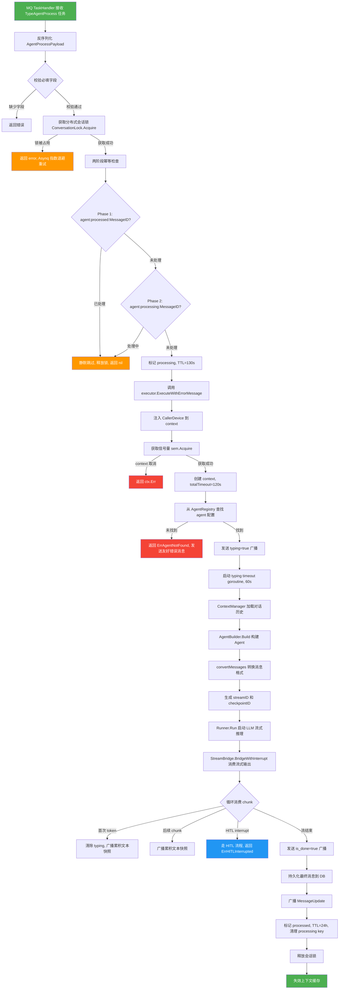

### 边缘场景

| 场景 | 处理方式 |
|------|----------|
| **信号量满** | Acquire 阻塞等待，context 取消时返回 `ctx.Err()` |
| **会话锁被占用** | 返回 error，由 Asynq 以指数退避重试 |
| **幂等命中** | 静默跳过，释放锁，返回 nil |
| **Agent 未注册** | 返回 `ErrAgentNotFound`，走 `classifyError` 发送友好错误消息 |
| **LLM 超时** | 映射为 `ErrLLMTimeout`，发送"暂时无法回复"消息，作为 transient error 返回给 MQ 重试 |
| **LLM 限流 (429)** | 映射为 `ErrLLMRateLimited`，同上 |
| **HTTP 500/502/503** | 映射为 `ErrLLMTimeout` (transient) |
| **流式中途错误** | 广播 `is_done=true` + 已累积的部分文本，持久化部分消息 |
| **持久化失败** | 流式中途错误时部分文本持久化为 fail-open；最终消息持久化失败时返回错误，触发 `ExecuteWithErrorMessage` 发送通用错误消息给用户 |
| **API Key 缺失** | 返回 `ErrAPIKeyMissing`，发送"配置有误"消息 |
| **MCP 服务不可用** | 跳过该 MCP server 的工具 (fail-open)，不阻断构建 |
| **context 超时** | 总超时 120s 后所有操作被取消 |

---

## 2. HITL 交互流程

Agent 在执行过程中通过 Eino 框架的 interrupt 机制暂停，等待用户回答后通过 resume 恢复执行。支持多轮 HITL（re-interrupt）。

### 流程图

```mermaid
flowchart TD
    subgraph interrupt_phase [Interrupt 阶段]
        A[Agent 调用 ask_user 工具] --> B[Eino 框架触发 interrupt]
        B --> C[StreamBridge 检测到 Action.Interrupted]
        C --> D[提取 InterruptInfo: Question + InterruptID]
        D --> E[Executor 收到 interruptCh 信号]
        E --> F[更新 Conversation 状态为 asking_user]
        F --> G[写入 checkpointID]
        G --> H[持久化 Question 到 DB]
        H --> I[关闭流式输出, is_done=true]
        I --> J[广播 conversation_update]
        J --> K[广播 agent_status = asking_user]
        K --> L[返回 ErrHITLInterrupted, 不释放会话锁]
    end

    subgraph resume_phase [Resume 阶段]
        M[用户回答] --> N[客户端调用 agent_resume RPC]
        N --> O[NewAgentResumeHandler 处理]
        O --> P[反序列化 AgentResumePayload]
        P --> Q[两阶段幂等检查]
        Q --> R[获取会话锁]
        R --> S[从 DB 读取已回答 Questions]
        S --> T[构建 targets map]
        T --> U[AgentBuilder.Build 重新构建 Agent]
        U --> V[Runner.ResumeWithParams 恢复执行]
        V --> W[桥接流式输出, 广播结果]
        W --> X[持久化最终消息]
        X --> Y[清理状态]
        Y --> Y1[ClearAgentStatus]
        Y1 --> Y2[Delete Questions]
        Y2 --> Y3[Delete Redis checkpoint]
        Y3 --> Z[广播 conversation_update]
        Z --> AA[释放会话锁]
    end

    L -.->|等待用户回答| M

    style A fill:#4CAF50,color:#fff
    style L fill:#FF9800,color:#fff
    style M fill:#2196F3,color:#fff
    style AA fill:#4CAF50,color:#fff
```

### 边缘场景

| 场景 | 处理方式 |
|------|----------|
| **checkpoint 过期/丢失** | 调用 `cleanupAfterResumeFailure`，发送"等待时间过长"消息 |
| **re-interrupt (多轮HITL)** | resume 后再次 interrupt，重新进入 `asking_user` 状态，不释放锁，删除 processing key 允许后续 resume |
| **resume 永久失败** | 清理状态 + 删除 checkpoint + 删除 questions + 发送错误消息 |
| **resume transient 失败** | 不自动 MQ 重试，而是通知用户自行决定是否重试 |
| **并发 resume** | 幂等检查确保同一 checkpoint 只 resume 一次 |
| **questionStore 为 nil** | 初始中断时 Question 创建被跳过 (nil-safe)；resume 时中止恢复流程并释放锁（非 nil-safe，需配置 questionStore） |

---

## 3. HITL 超时清理流程

后台定时任务扫描停留在 `asking_user` 状态的过期会话并清理资源。

### 流程图

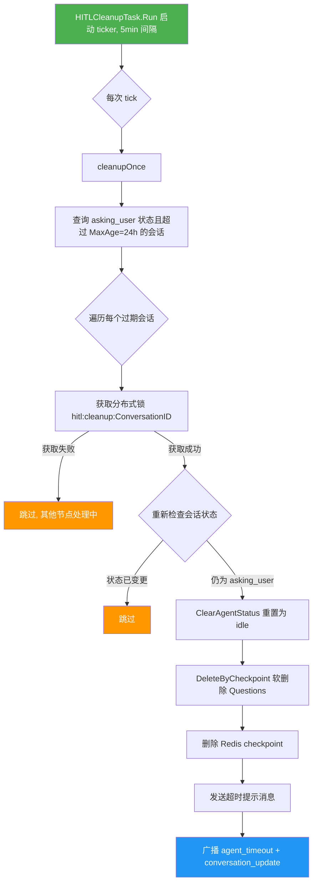

### 边缘场景

| 场景 | 处理方式 |
|------|----------|
| **并发清理** | 分布式锁确保同一会话只被一个节点处理 |
| **状态已变更** | re-check 发现不再是 `asking_user` 则跳过 |
| **单个会话 panic** | 每个会话独立 recover，不影响批次中其他会话 |
| **全局 panic** | `cleanupOnce` 外层也有 recover，不崩溃后台 goroutine |

---

## 4. 流式输出流程

将 Eino 的 AsyncIterator 流式输出转换为 Xyncra 的 StreamChunk，通过 50ms 节流控制帧率，累积文本快照推送给客户端。

### 流程图

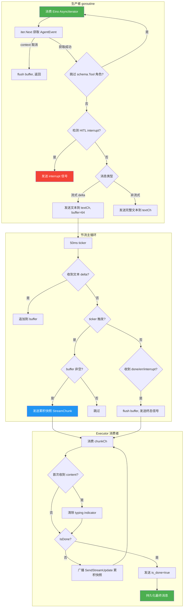

### 边缘场景

| 场景 | 处理方式 |
|------|----------|
| **context 取消** | flush 剩余 buffer 后返回 |
| **iter.Next 阻塞** | 通过 goroutine + select 包装使其可取消 |
| **textCh 满 (64)** | 生产者阻塞，主循环 ticker 继续发送已累积的快照 |
| **流式中途错误** | 广播 `is_done` + 部分文本，持久化部分消息 |
| **无文本输出** | buffer 为空时不发送空 chunk |

---

## 5. 子代理委托流程

父 Agent 通过配置声明子 Agent，构建时将子 Agent 包装为 Eino AgentTool，作为普通工具注入父 Agent 的工具列表。

### 流程图

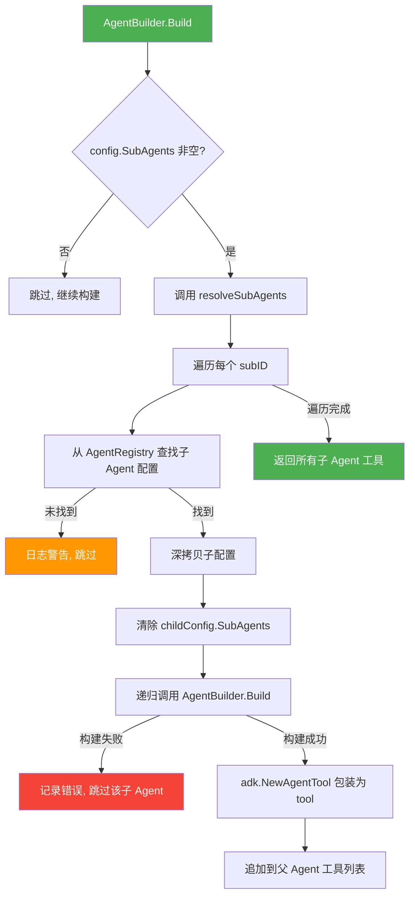

### 边缘场景

| 场景 | 处理方式 |
|------|----------|
| **子 Agent 未注册** | 日志警告并跳过 (fail-open) |
| **子 Agent 构建失败** | 记录错误，跳过该子 Agent，其他子 Agent 继续构建 |
| **递归深度** | 通过清除 `childConfig.SubAgents` 硬限制为 1 层 |
| **子 Agent 无 Name/Description** | 由 `AgentConfig.Validate` 保证非空 |

---

## 6. 动态工具注入流程

通过 Eino 中间件在每次 Agent 运行前动态注入客户端设备函数和注册表工具。两条注入路径独立：客户端工具依赖设备上下文，注册表工具不依赖。

### 流程图

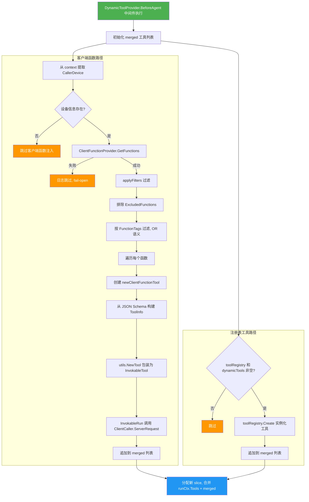

### 边缘场景

| 场景 | 处理方式 |
|------|----------|
| **无设备上下文** | 跳过客户端函数注入，注册表工具仍可注入 |
| **GetFunctions 失败** | 日志跳过 (fail-open) |
| **单个函数创建失败** | 跳过该函数，其他函数继续 |
| **设备离线** | SoftFailure 返回 "device is offline"，LLM 可感知并调整 |
| **请求超时** | SoftFailure 返回 "request timed out" |
| **客户端返回业务错误** | SoftFailure 返回错误码和消息 |
| **空参数 schema** | 自动补全为 `{"type":"object","properties":{}}`，防止 LLM 格式层产生非法 schema |

---

## 7. Agent 配置注册流程

从 `.md` 文件目录加载 Agent 配置（front matter + system prompt），支持热重载。

### 流程图

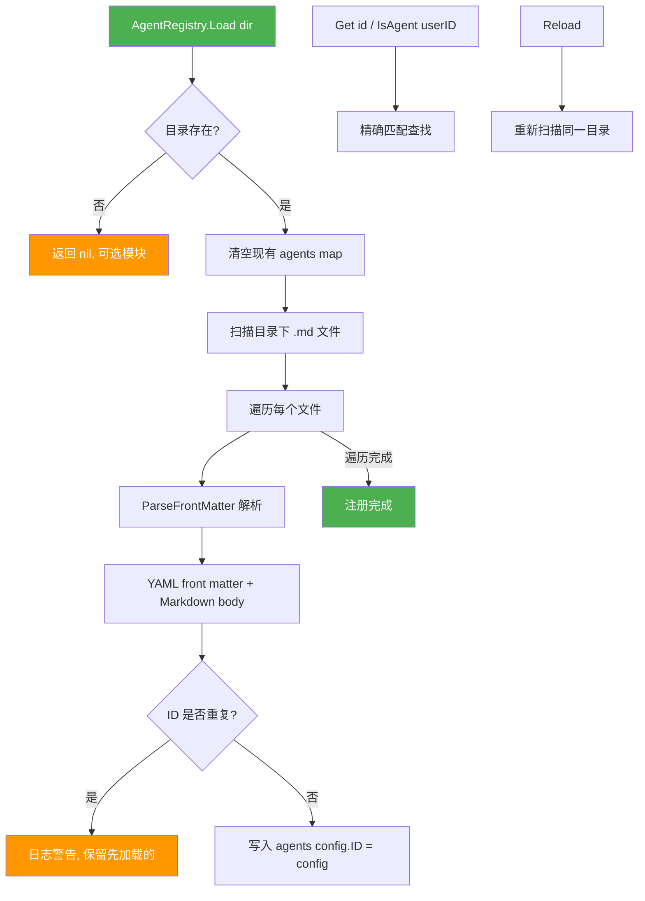

### 边缘场景

| 场景 | 处理方式 |
|------|----------|
| **目录不存在** | 返回 nil (可选模块) |
| **无效配置** | 日志跳过，不中断其他文件加载 |
| **重复 ID** | 日志警告，保留先加载的 |
| **并发访问** | RWMutex 保护所有读写操作 |

---

## 8. 广播推送流程

通过 WebSocket 向用户推送实时更新，所有广播均为 fire-and-forget。

### 流程图

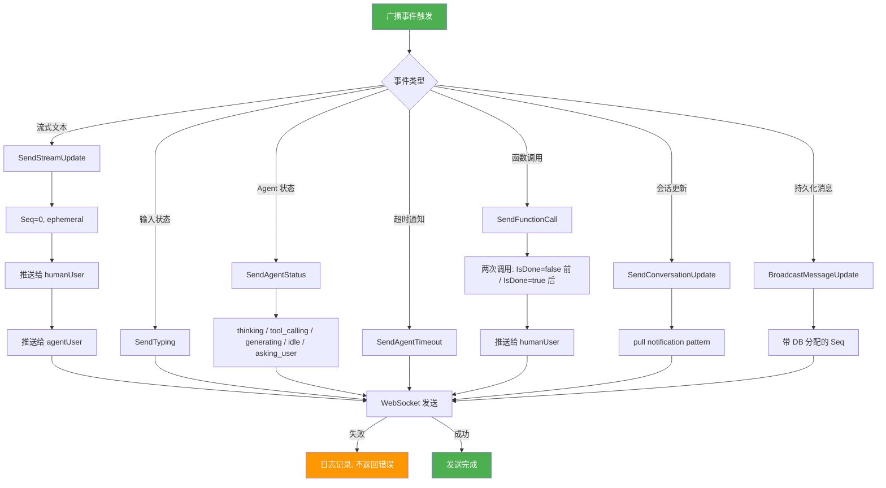

### 边缘场景

| 场景 | 处理方式 |
|------|----------|
| **WebSocket 发送失败** | 日志记录但不返回错误 (fire-and-forget) |
| **JSON 序列化失败** | 日志记录并跳过 |
| **registry 为 nil** | `isAgent` 始终返回 false (nil-safe) |
| **函数调用广播** | `SendFunctionCall` 由 LoggingMiddleware 调用，每次函数调用发送两次：执行前 (`IsDone=false`, 携带 name + args) 和执行后 (`IsDone=true`, 携带 result 或 error) |

---

## 9. 并发控制机制

通过信号量限制 Agent 并发执行数，通过分布式会话锁保证同一会话串行执行。

### 流程图

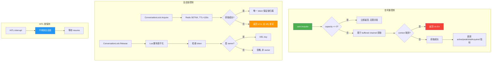

### 边缘场景

| 场景 | 处理方式 |
|------|----------|
| **信号量 nil** | Acquire/Release 均为 no-op |
| **Redis 不可用** | 会话锁获取失败时 fail-open，继续执行 |
| **锁过期 (TTL)** | 自然释放，不阻塞后续任务 |
| **非 owner 释放锁** | Lua 脚本检查 token，非 owner 的 DEL 被忽略 |

---

## 10. 幂等控制机制

两阶段幂等检查防止重复处理同一消息。Phase 1 防重放，Phase 2 防并发。Resume 路径使用相同的两阶段机制，但 key 格式不同。

### 流程图

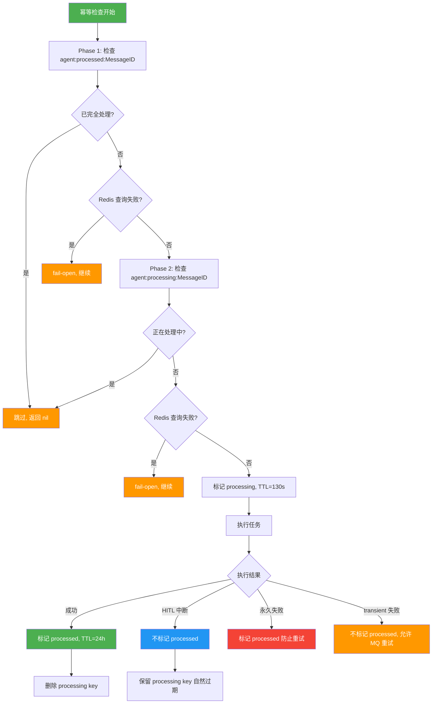

### 边缘场景

| 场景 | 处理方式 |
|------|----------|
| **Redis 不可用** | 幂等检查失败时继续执行 (fail-open) |
| **processing key 过期但任务仍在执行** | 新任务可能并发进入，被会话锁拦截 |
| **processed 和 processing key 都存在** | 跳过 (某处异常导致) |
| **Resume 路径 key 格式** | Phase 1: `agent:resume:CheckpointID`, Phase 2: `agent:resume:processing:CheckpointID`。成功后标记 processed (24h) 并删除 processing key；transient 失败时删除 processing key 允许立即重试；re-interrupt 时删除 processing key 允许后续 resume |
| **Agent 执行 vs Resume key 差异** | Agent 执行: `agent:processed:{MessageID}` / `agent:processing:{MessageID}`；Resume: `agent:resume:{CheckpointID}` / `agent:resume:processing:{CheckpointID}`。两套 key 独立，互不干扰 |

---

## 11. Agent Resume 流程

处理 HITL 恢复任务，从 DB 读取用户答案，通过 Eino 的 `ResumeWithParams` 恢复被中断的 Agent 执行。

### 流程图

```mermaid
flowchart TD
    A[agent_resume RPC 调用] --> B[反序列化 AgentResumePayload]
    B --> C[两阶段幂等检查 agent:resume:CheckpointID]
    C -->|已 resume| C1[跳过, 返回 nil]
    C -->|未 resume| D[获取会话锁]

    D -->|Redis 错误| D1[fail-open, 继续]
    D -->|锁被占用 (HITL 预期)| D2[weOwnLock=false, 继续]
    D -->|获取成功| E[从 DB 读取已回答 Questions]

    E --> F[构建 targets map]
    F --> G[AgentBuilder.Build 重新构建 Agent]

    G -->|构建失败| G1[cleanupAfterResumeFailure]
    G1 --> G2[发送错误消息 + 清理幂等 key]
    G -->|构建成功| H[Runner.ResumeWithParams 恢复执行]

    H --> I[桥接流式输出]
    I --> J[广播结果]
    J --> K[持久化最终消息]

    K --> L[清理状态]
    L --> L1[ClearAgentStatus]
    L1 --> L2[Delete Questions]
    L2 --> L3[Delete Redis checkpoint]

    L3 --> M[标记 processed (24h) + 删除 processing key]
    M --> M1[广播 conversation_update]
    M1 --> N[释放会话锁]

    H -->|再次 interrupt| O[重新进入 asking_user 状态]
    O --> O1[不释放锁]
    O1 --> O2[删除 processing key 允许后续 resume]

    style A fill:#4CAF50,color:#fff
    style C1 fill:#FF9800,color:#fff
    style D1 fill:#FF9800,color:#fff
    style D2 fill:#FF9800,color:#fff
    style G2 fill:#f44336,color:#fff
    style N fill:#4CAF50,color:#fff
    style O fill:#2196F3,color:#fff
```

### 边缘场景

| 场景 | 处理方式 |
|------|----------|
| **Resume 路径的 transient 错误** | 不自动 MQ 重试，而是发送"服务暂时不可用"消息通知用户，同时删除 processing key 允许立即重试。用户已投入交互成本，应自行决定是否重试 |
| **Eino 的 resume 路径** | 会用原 checkpointID 保存 re-interrupt 的 checkpoint |
| **成功 resume 后** | 执行完整清理：ClearAgentStatus + Delete Questions + Delete Redis checkpoint |
| **checkpoint 过期/丢失** | 调用 `cleanupAfterResumeFailure`，发送超时提示消息 |
| **并发 resume** | 幂等检查确保同一 checkpoint 只 resume 一次 |

---

## 关键组件关系

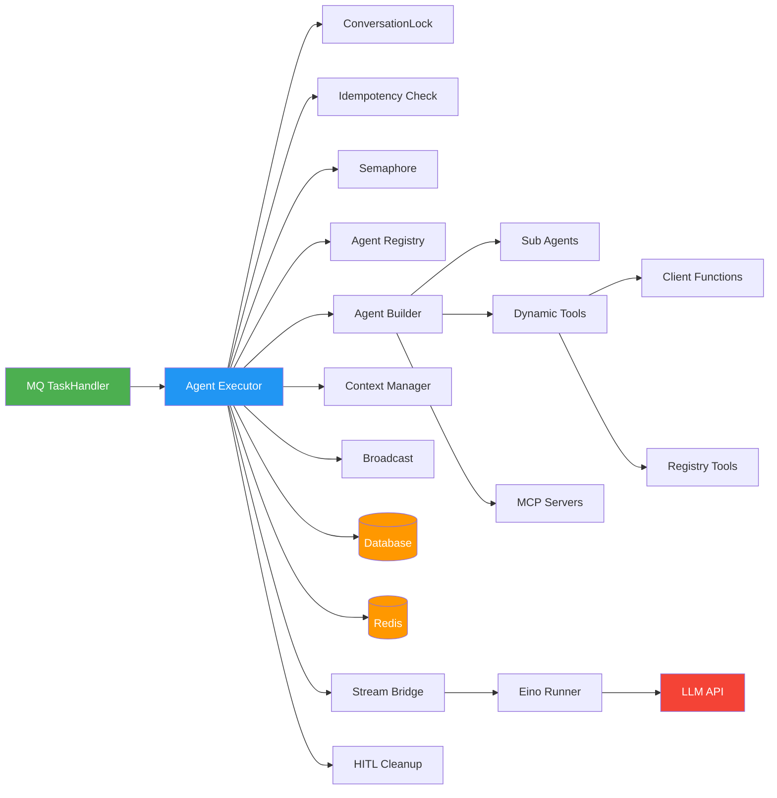

---

## 错误分类与处理策略

| 错误类型 | 分类 | 处理策略 |
|----------|------|----------|
| `ErrLLMTimeout` | Transient | MQ 重试 + 用户提示"暂时无法回复" |
| `ErrLLMRateLimited` | Transient | MQ 重试 + 用户提示"暂时无法回复" |
| HTTP 500/502/503 | Transient | MQ 重试 |
| `ErrAgentNotFound` | Permanent | 发送友好错误消息，标记 processed |
| `ErrAPIKeyMissing` | Permanent | 发送"配置有误"消息，标记 processed |
| `ErrHITLInterrupted` | Special | 不标记 processed，保留锁，等待 resume |
| 流式中途持久化失败 | Fail-open | 日志记录，不阻断主流程（部分文本已广播） |
| 最终消息持久化失败 | Permanent | 返回错误，发送通用错误消息给用户，标记 processed |
| MCP 不可用 | Fail-open | 跳过该 MCP server，不阻断构建 |
