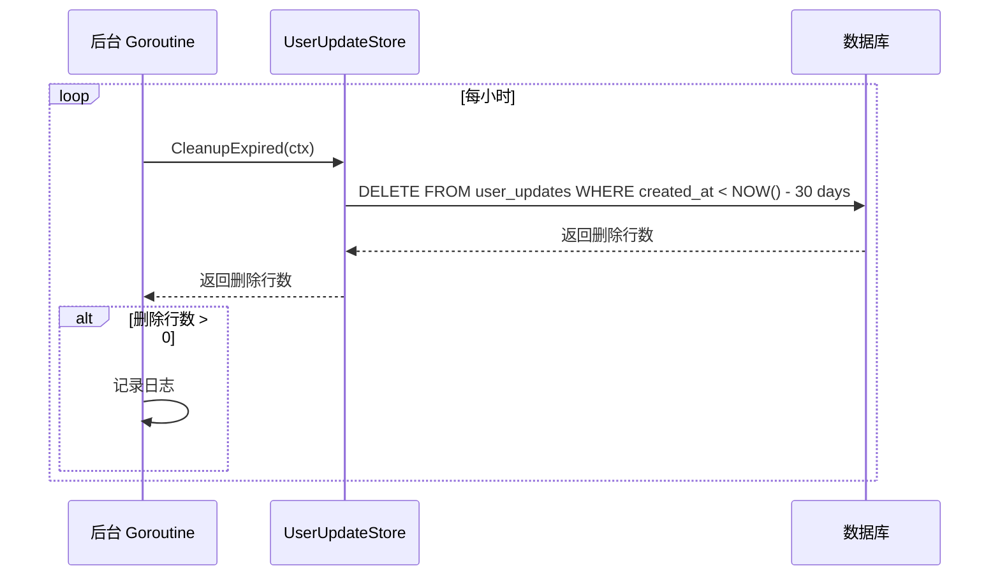
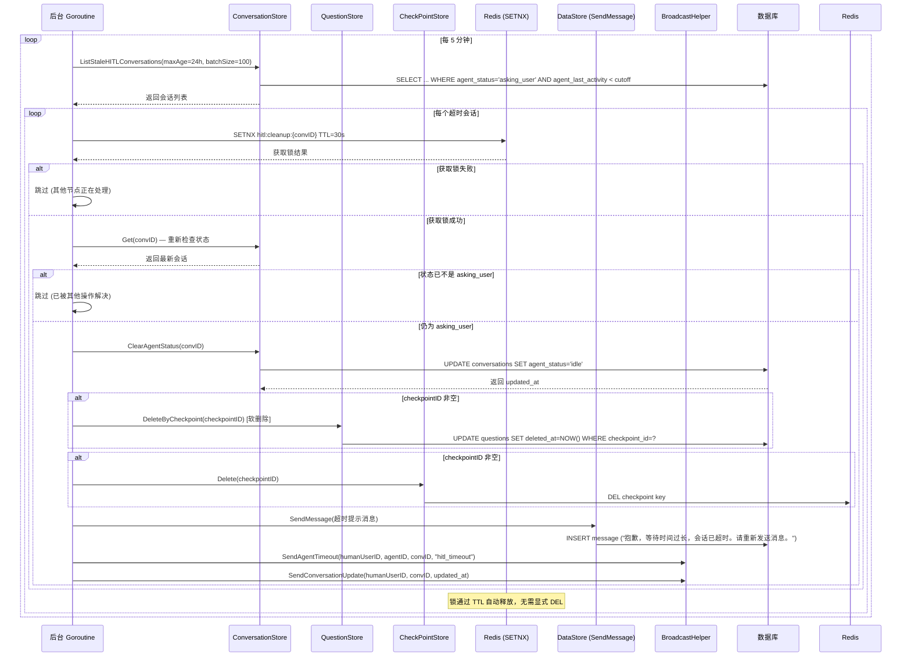
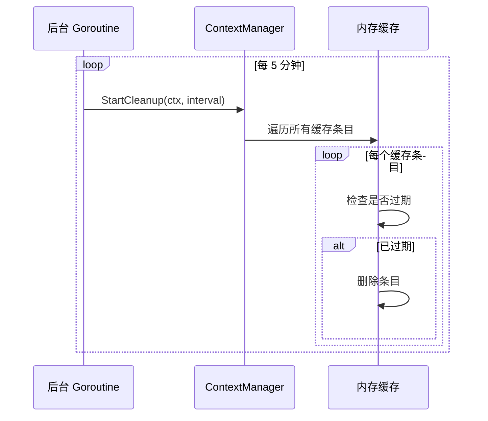
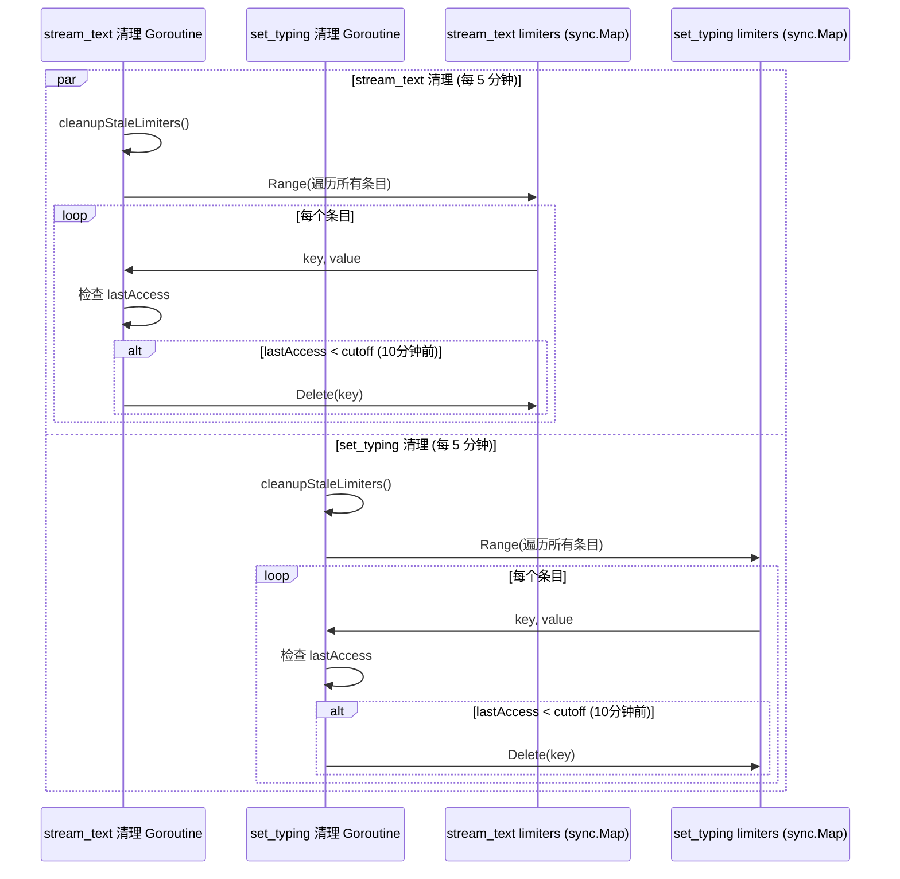
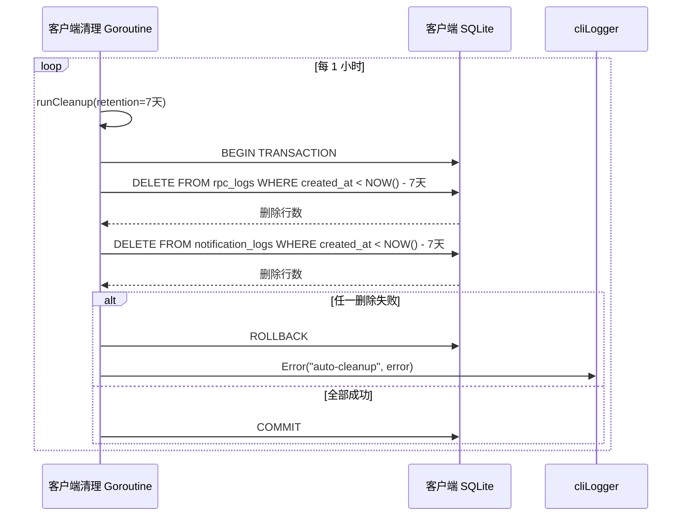

# Background Cleanup 业务流程

本文档描述 Xyncra 服务器和服务端/客户端中的后台清理任务，包括 UserUpdate 过期清理、HITL 超时清理、上下文缓存清理、工具结果清理、Rate Limiter 清理和客户端日志清理。

---

## 目录

- [概述](#概述)
- [UserUpdate 过期清理](#userupdate-过期清理)
- [HITL 超时清理](#hitl-超时清理)
- [上下文缓存清理](#上下文缓存清理)
- [工具结果清理](#工具结果清理)
- [Rate Limiter 清理](#rate-limiter-清理)
- [客户端日志清理](#客户端日志清理)
- [依赖关系](#依赖关系)
- [关键设计决策](#关键设计决策)

---

## 概述

Xyncra 服务器运行多个后台清理任务，用于维护系统健康状态和防止资源泄漏。这些任务在服务器启动时自动运行，无需手动触发。

### 清理任务列表

| 任务 | 间隔 | 保留期 | 说明 |
|------|------|--------|------|
| UserUpdate 过期清理 | 1 小时 | 30 天 | 清理过期的 UserUpdate 记录 |
| HITL 超时清理 | 5 分钟 | 24 小时 | 清理超时的 HITL 会话（可配置） |
| 上下文缓存清理 | 5 分钟 | 30 秒 | 清理过期的对话上下文缓存（TTL 可配置） |
| 工具结果清理 | 调用方配置 | 1 小时 | 清理过期的工具执行结果（TTL 可配置） |
| Rate Limiter 清理（stream_text） | 5 分钟 | 10 分钟 | 清理未使用的 stream_text rate limiter 条目 |
| Rate Limiter 清理（set_typing） | 5 分钟 | 10 分钟 | 清理未使用的 set_typing rate limiter 条目 |
| 客户端日志清理 | 1 小时 | 7 天 | 清理客户端 RPC 日志和通知日志（客户端侧） |

---

## UserUpdate 过期清理

### 概述

定期清理过期的 UserUpdate 记录，防止数据库无限增长。过期记录定义为 `created_at` 超过 30 天的记录。

### 流程图

### 详细步骤

1. **定时触发**：每小时触发一次
2. **执行清理**：调用 `UserUpdateStore.CleanupExpired(ctx)`
3. **SQL 操作**：`DELETE FROM user_updates WHERE created_at < NOW() - INTERVAL 30 DAY`
4. **记录日志**：如果删除行数 > 0，记录日志
5. **错误处理**：清理失败仅记录日志，不中断循环

### 边缘场景

| 场景 | 处理方式 |
|------|----------|
| 数据库不可达 | 记录错误日志，下次重试 |
| 无过期记录 | 静默跳过，不记录日志 |
| 清理期间 panic | recover 后继续运行 |

---

## HITL 超时清理

### 概述

定期扫描处于 `asking_user` 状态超过 24 小时的会话，清理其 HITL 相关资源（checkpoint、questions），发送超时消息通知用户，并广播 `agent_timeout` 事件。

### 流程图

### 详细步骤

1. **定时触发**：每 5 分钟触发一次（默认值，可配置）
2. **查询超时会话**：调用 `ListStaleHITLConversations`，获取所有 `agent_status='asking_user'` 且 `agent_last_activity < NOW() - 24h` 的会话，限制最多 100 条
3. **分布式锁**：对每个会话使用 Redis `SETNX` 获取分布式锁（key: `hitl:cleanup:{conversationID}`，TTL: 30 秒），防止多节点重复处理
4. **重新检查状态**：获取锁后重新查询会话最新状态，确认仍为 `asking_user`（其他节点或用户操作可能已解决）
5. **清理操作**（所有步骤非致命，失败仅记录日志）：
   - 清除会话的 agent 状态（重置为 idle），返回 `updated_at`
   - 如果 `checkpointID` 非空，软删除该 checkpoint 的所有 questions（GORM `Delete`）
   - 如果 `checkpointID` 非空，删除 Redis 中的 checkpoint key
6. **发送超时消息**：通过 `DataStore.SendMessage` 向用户发送超时提示消息（"抱歉，等待时间过长，会话已超时。请重新发送消息。"）
7. **广播通知**：发送 `agent_timeout` 临时事件通知和 `conversation_update` 通知客户端刷新状态
8. **锁释放**：通过 Redis TTL（30 秒）自动释放，无需显式 DEL

### 边缘场景

| 场景 | 处理方式 |
|------|----------|
| 获取锁失败 | 跳过该会话，其他节点正在处理 |
| 获取锁后状态已变更 | 重新检查后跳过，避免误清理 |
| 清理期间 panic | 每个会话独立 recover，不影响其他会话 |
| 数据库不可达 | 记录错误日志，下次重试 |
| Redis 不可达 | 锁获取失败，跳过该会话 |
| questionStore 为 nil | 跳过 questions 清理（nil-safe, D-063） |
| checkpointStore 为 nil | 跳过 checkpoint 清理（nil-safe） |
| 发送超时消息失败 | 记录错误日志，不影响其他清理步骤 |
| 批量处理上限 | 每次最多处理 100 条，剩余下次处理 |

---

## 上下文缓存清理

### 概述

定期清理过期的对话上下文缓存，防止内存泄漏。上下文缓存（`DBContextManager` 的 `sync.Map`）用于加速 Agent 执行，避免每次都从数据库加载消息。默认 TTL 为 30 秒（可通过 `WithCacheTTL` 配置）。

### 流程图

### 详细步骤

1. **定时触发**：每 5 分钟触发一次（默认值，可通过 `interval` 参数配置）
2. **遍历缓存**：使用 `sync.Map.Range` 遍历所有缓存条目
3. **检查过期**：检查每个条目的 `fetchedAt` 时间，与当前时间比较是否超过 TTL（默认 30 秒）
4. **删除过期条目**：删除超过 TTL 的条目，同时删除类型不正确的损坏条目
5. **Panic Recovery**：`cleanupExpired` 方法有 `defer recover()` 保护，防止清理 panic 终止 goroutine

### 边缘场景

| 场景 | 处理方式 |
|------|----------|
| 缓存为空 | 静默跳过 |
| 并发访问 | `sync.Map` 支持并发读写，无需额外锁 |
| 清理期间有新请求 | 新请求正常处理，不受影响 |
| 条目类型损坏 | 检测后删除损坏条目 |

---

## 工具结果清理

### 概述

定期清理过期的工具执行结果，防止内存泄漏。工具结果存储（`ToolResultStore`）用于 `retrieve_tool_result` 工具，允许 Agent 异步获取被截断的工具执行结果。默认 TTL 为 1 小时（`DefaultTTL`），最大条目数 10000（`DefaultMaxSize`）。

### 流程图

### 详细步骤

1. **定时触发**：由调用方通过 `StartCleanup(ctx, interval)` 启动，间隔由调用方配置
2. **遍历结果**：遍历 `map[string]storedResult` 中的所有条目
3. **检查过期**：检查每个结果的 `createdAt` 时间，与当前时间比较是否超过 TTL（默认 1 小时）
4. **删除过期结果**：删除超过 TTL 的结果
5. **容量驱逐**：当条目数超过 `maxSize`（默认 10000）时，`Store` 方法会主动驱逐最旧的条目

### 边缘场景

| 场景 | 处理方式 |
|------|----------|
| 存储为空 | 静默跳过 |
| 并发访问 | `sync.RWMutex` 保护，支持并发读写 |
| 清理期间有新请求 | 新请求正常处理，不受影响 |
| 超过最大容量 | 写入时主动驱逐最旧条目 |

---

## Rate Limiter 清理

### 概述

定期清理未使用的 rate limiter 条目，防止内存泄漏。`set_typing` 和 `stream_text` handler 各自维护独立的 per-user-per-conversation rate limiter（`sync.Map`），各自运行独立的清理 goroutine。

- `stream_text`：50ms 间隔限制（20/s），使用 `streamingRateLimiter`
- `set_typing`：1 秒间隔限制，使用 `typingRateLimiter`

### 流程图

### 详细步骤

1. **定时触发**：每 5 分钟触发一次（两个独立 goroutine，分别在 `NewStreamTextHandler` 和 `NewSetTypingHandler` 时启动）
2. **遍历条目**：遍历 `sync.Map` 中的所有条目
3. **检查访问时间**：获取每个条目的 `lastAccess` 时间（加锁读取后立即释放）
4. **删除过期条目**：删除 10 分钟未访问的条目
5. **注意**：`cleanupLoop` 没有 panic recovery，也没有 context 取消机制（`for range ticker.C`），goroutine 依赖 ticker 的 GC 回收

### 边缘场景

| 场景 | 处理方式 |
|------|----------|
| Map 为空 | 静默跳过 |
| 并发访问 | `sync.Map` 支持并发读写 |
| 清理期间有新请求 | 新请求正常处理，`LoadOrStore` 原子操作 |
| 条目被访问时清理 | 读取 `lastAccess` 时加锁，避免数据竞争 |

---

## 客户端日志清理

### 概述

客户端 daemon（`xyncra listen`）定期清理本地 SQLite 数据库中的过期 RPC 日志和通知日志，防止数据库无限增长。这是唯一运行在客户端侧的清理任务（D-040）。

### 流程图

### 详细步骤

1. **定时触发**：每 1 小时触发一次（`defaultCleanupInterval`）
2. **事务执行**：在单个数据库事务中执行两个 DELETE 操作（L-1 原子性）
3. **清理 RPC 日志**：`DELETE FROM rpc_logs WHERE created_at < NOW() - 7天`
4. **清理通知日志**：`DELETE FROM notification_logs WHERE created_at < NOW() - 7天`
5. **错误处理**：清理失败仅记录日志，不终止 daemon

### 边缘场景

| 场景 | 处理方式 |
|------|----------|
| 数据库不可达 | 记录错误日志，下次重试 |
| 无过期记录 | 事务正常提交，无副作用 |
| 部分删除失败 | 事务回滚，两个表保持一致 |

---

## 依赖关系

### 服务端内部依赖

| 组件 | 包路径 | 用途 |
|------|--------|------|
| `UserUpdateStore` | `internal/store` | UserUpdate 过期清理 |
| `UserUpdateCleaner` | `internal/cleanup` | UserUpdate 清理调度器 |
| `ConversationStore` | `internal/store` | HITL 超时清理（ListStaleHITLConversations, ClearAgentStatus, Get） |
| `QuestionStore` | `internal/store` | HITL 超时清理（DeleteByCheckpoint，可选） |
| `DeletableCheckPointStore` | `internal/agent` | HITL 超时清理（Delete，可选） |
| `BroadcastHelper` | `internal/agent` | HITL 清理后广播通知 |
| `StoreAPI` (DataStore) | `internal/store` | HITL 超时消息发送（SendMessage） |
| `redisClient` | `internal/agent` | HITL 分布式锁（SetNX） |
| `DBContextManager` | `internal/agent` | 上下文缓存清理 |
| `ToolResultStore` | `internal/agent/tools` | 工具结果清理 |
| `streamTextHandler` | `internal/handler` | stream_text rate limiter 清理 |
| `setTypingHandler` | `internal/handler` | set_typing rate limiter 清理 |

### 客户端内部依赖

| 组件 | 包路径 | 用途 |
|------|--------|------|
| `ClientDB` | `pkg/store` | 客户端日志清理（RPCLog, NotificationLog） |
| `cliLogger` | `internal/cli` | 清理日志输出 |

### 外部依赖

| 组件 | 用途 |
|------|------|
| Database (GORM) | UserUpdate、Conversation、Question、RPCLog、NotificationLog 表 |
| Redis | CheckPoint 存储、分布式锁（SETNX + TTL） |

---

## 关键设计决策

### 1. Fire-and-Forget

清理任务采用 fire-and-forget 模式：
- **原因**：清理失败不影响业务逻辑
- **行为**：失败仅记录日志，下次重试
- **优点**：避免清理任务阻塞业务流程

### 2. Distributed Lock

HITL 清理使用分布式锁：
- **原因**：多节点部署时避免重复清理
- **实现**：Redis SETNX（key: `hitl:cleanup:{conversationID}`）
- **TTL**：30 秒（通过 TTL 自动释放，无需显式 DEL）

### 3. Panic Recovery（部分覆盖）

部分清理任务有 panic recovery：
- **有 recovery**：UserUpdateCleaner（per-cycle）、HITLCleanupTask（per-cycle + per-conversation）、DBContextManager.cleanupExpired
- **无 recovery**：ToolResultStore.StartCleanup、streamTextHandler.cleanupLoop、setTypingHandler.cleanupLoop、startLogCleanup
- **原因**：防止清理任务崩溃导致 goroutine 泄漏
- **行为**：recover 后继续运行
- **日志**：记录 panic 信息用于调试

### 4. Graceful Degradation

部分清理失败不影响其他清理：
- **原因**：提高系统容错性
- **行为**：每个会话的清理独立进行（HITL 清理中每个会话有独立的 recover）
- **日志**：记录具体失败信息

### 5. 客户端日志清理事务原子性（L-1）

客户端日志清理使用数据库事务：
- **原因**：RPC 日志和通知日志应在同一事务中清理
- **行为**：任一删除失败则回滚，两个表保持一致
- **优点**：避免部分清理导致的数据不一致

---

## 相关文档

- [Agent 执行流程](agent-execution.md)
- [Agent Resume (HITL)](agent-resume.md)
- [WebSocket 连接管理](websocket-connection.md)
- [存储层](storage.md)
