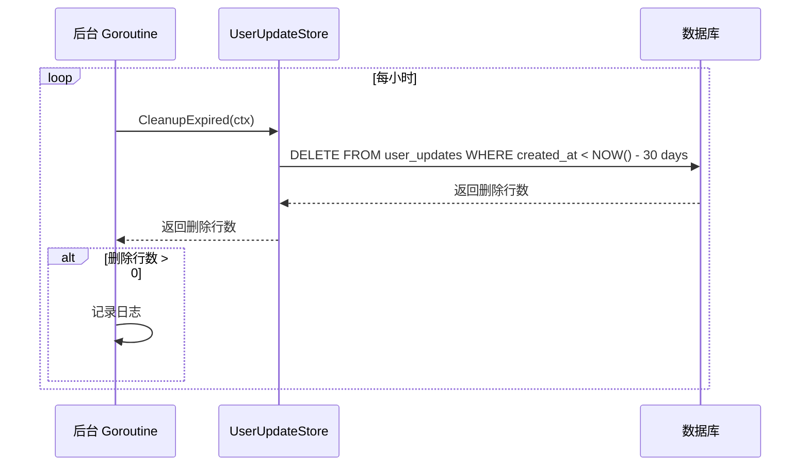
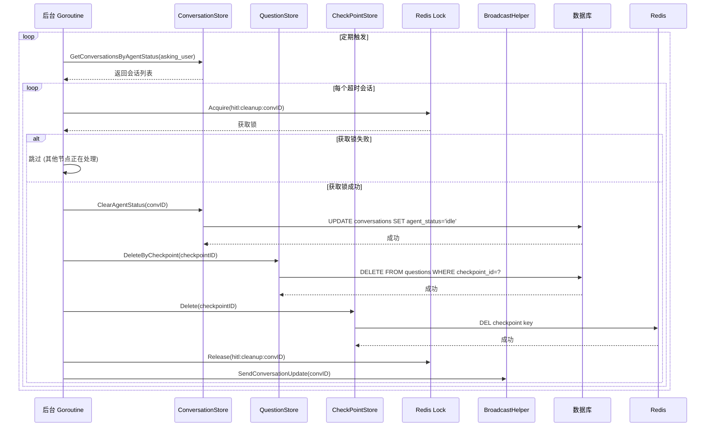
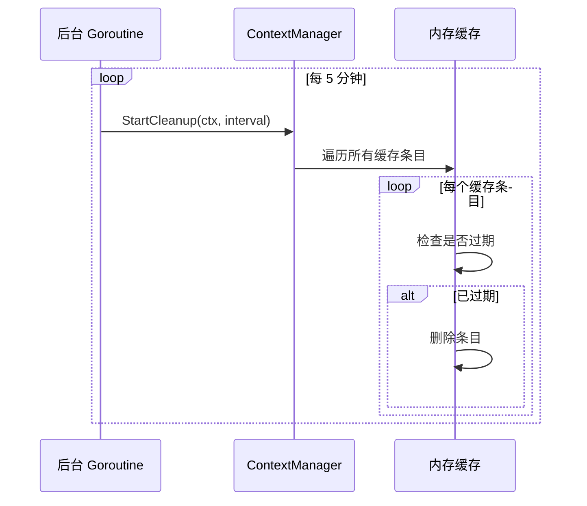
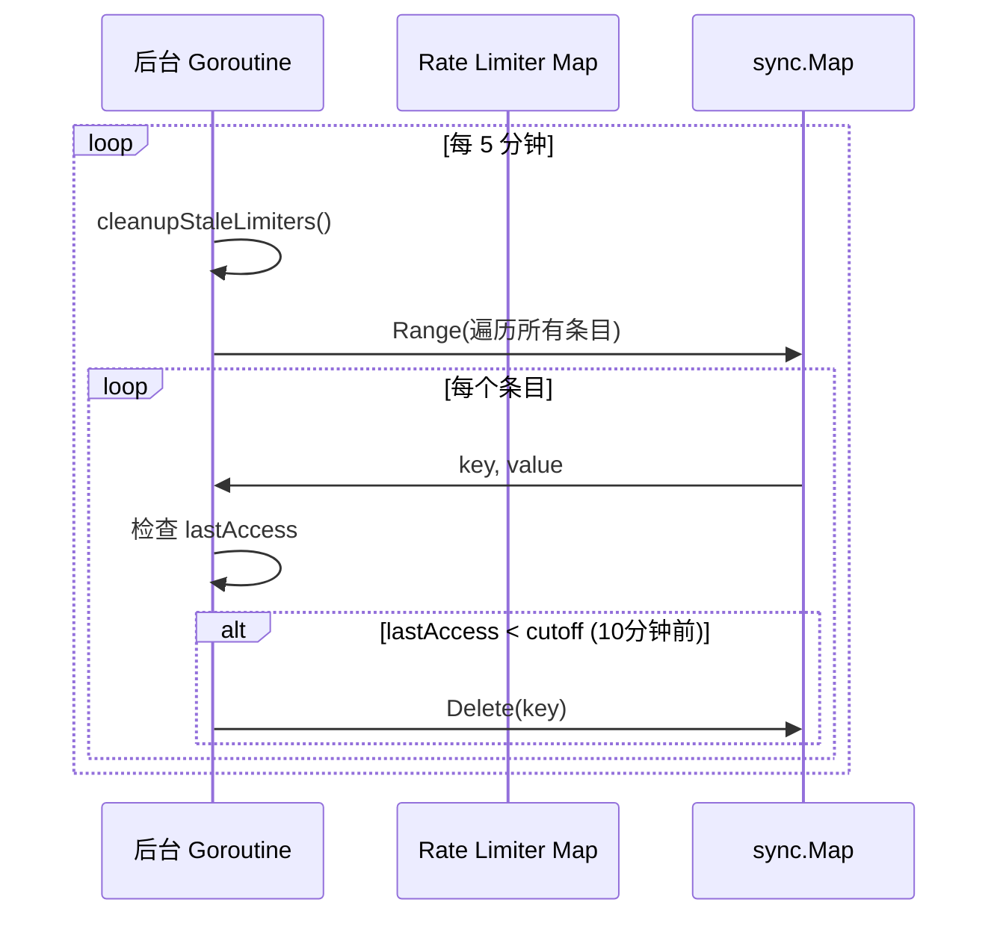

# Background Cleanup 业务流程

本文档描述 Xyncra 服务器中的后台清理任务，包括 UserUpdate 过期清理、HITL 超时清理和上下文缓存清理。

---

## 目录

- [概述](#概述)
- [UserUpdate 过期清理](#userupdate-过期清理)
- [HITL 超时清理](#hitl-超时清理)
- [上下文缓存清理](#上下文缓存清理)
- [工具结果清理](#工具结果清理)
- [Rate Limiter 清理](#rate-limiter-清理)
- [依赖关系](#依赖关系)
- [关键设计决策](#关键设计决策)

---

## 概述

Xyncra 服务器运行多个后台清理任务，用于维护系统健康状态和防止资源泄漏。这些任务在服务器启动时自动运行，无需手动触发。

### 清理任务列表

| 任务 | 间隔 | 保留期 | 说明 |
|------|------|--------|------|
| UserUpdate 过期清理 | 1 小时 | 30 天 | 清理过期的 UserUpdate 记录 |
| HITL 超时清理 | 可配置 | 24 小时 | 清理超时的 HITL 会话 |
| 上下文缓存清理 | 5 分钟 | 可配置 | 清理过期的对话上下文缓存 |
| 工具结果清理 | 5 分钟 | 可配置 | 清理过期的工具执行结果 |
| Rate Limiter 清理 | 5 分钟 | 10 分钟 | 清理未使用的 rate limiter 条目 |

---

## UserUpdate 过期清理

### 概述

定期清理过期的 UserUpdate 记录，防止数据库无限增长。过期记录定义为 `created_at` 超过 30 天的记录。

### 流程图

### 详细步骤

1. **定时触发**：每小时触发一次
2. **执行清理**：调用 `UserUpdateStore.CleanupExpired(ctx)`
3. **SQL 操作**：`DELETE FROM user_updates WHERE created_at < NOW() - INTERVAL 30 DAY`
4. **记录日志**：如果删除行数 > 0，记录日志
5. **错误处理**：清理失败仅记录日志，不中断循环

### 边缘场景

| 场景 | 处理方式 |
|------|----------|
| 数据库不可达 | 记录错误日志，下次重试 |
| 无过期记录 | 静默跳过，不记录日志 |
| 清理期间 panic | recover 后继续运行 |

---

## HITL 超时清理

### 概述

定期扫描处于 `asking_user` 状态超过 24 小时的会话，清理其 HITL 相关资源（锁、checkpoint、questions）。

### 流程图

### 详细步骤

1. **定时触发**：按配置的间隔触发
2. **查询超时会话**：获取所有 `agent_status='asking_user'` 且 `agent_status_updated_at < NOW() - 24h` 的会话
3. **分布式锁**：对每个会话获取分布式锁，防止多节点重复处理
4. **清理操作**：
   - 清除会话的 agent 状态（重置为 idle）
   - 删除该 checkpoint 的所有 questions
   - 删除 Redis 中的 checkpoint
5. **释放锁**：清理完成后释放分布式锁
6. **广播通知**：发送 conversation update 通知客户端

### 边缘场景

| 场景 | 处理方式 |
|------|----------|
| 获取锁失败 | 跳过该会话，其他节点正在处理 |
| 清理期间 panic | recover 后继续处理其他会话 |
| 数据库不可达 | 记录错误日志，下次重试 |
| Redis 不可达 | 跳过 Redis 操作，仅清理数据库 |

---

## 上下文缓存清理

### 概述

定期清理过期的对话上下文缓存，防止内存泄漏。上下文缓存用于加速 Agent 执行，避免每次都从数据库加载消息。

### 流程图

### 详细步骤

1. **定时触发**：每 5 分钟触发一次
2. **遍历缓存**：遍历所有缓存条目
3. **检查过期**：检查每个条目的最后访问时间
4. **删除过期条目**：删除超过 TTL 的条目
5. **记录日志**：可选记录清理数量

### 边缘场景

| 场景 | 处理方式 |
|------|----------|
| 缓存为空 | 静默跳过 |
| 并发访问 | 缓存使用互斥锁保护 |
| 清理期间有新请求 | 新请求正常处理，不受影响 |

---

## 工具结果清理

### 概述

定期清理过期的工具执行结果，防止内存泄漏。工具结果存储用于 `retrieve_tool_result` 工具，允许 Agent 异步获取工具执行结果。

### 流程图

### 详细步骤

1. **定时触发**：每 5 分钟触发一次
2. **遍历结果**：遍历所有工具执行结果
3. **检查过期**：检查每个结果的创建时间
4. **删除过期结果**：删除超过 TTL 的结果
5. **记录日志**：可选记录清理数量

---

## Rate Limiter 清理

### 概述

定期清理未使用的 rate limiter 条目，防止内存泄漏。`set_typing` 和 `stream_text` handler 使用 per-user-per-conversation 的 rate limiter，需要定期清理不再使用的条目。

### 流程图

### 详细步骤

1. **定时触发**：每 5 分钟触发一次
2. **遍历条目**：遍历 `sync.Map` 中的所有条目
3. **检查访问时间**：检查每个条目的 `lastAccess` 时间
4. **删除过期条目**：删除 10 分钟未访问的条目
5. **记录日志**：可选记录清理数量

### 边缘场景

| 场景 | 处理方式 |
|------|----------|
| Map 为空 | 静默跳过 |
| 并发访问 | `sync.Map` 支持并发读写 |
| 清理期间有新请求 | 新请求正常处理，不受影响 |

---

## 依赖关系

### 内部依赖

| 组件 | 用途 |
|------|------|
| `store.UserUpdateStore` | UserUpdate 过期清理 |
| `store.ConversationStore` | HITL 超时清理 |
| `store.QuestionStore` | HITL 超时清理 |
| `agent.CheckPointStore` | HITL 超时清理 |
| `agent.ContextManager` | 上下文缓存清理 |
| `agenttools.ToolResultStore` | 工具结果清理 |
| `agent.BroadcastHelper` | HITL 清理后通知客户端 |

### 外部依赖

| 组件 | 用途 |
|------|------|
| Database | UserUpdate、Conversation、Question 表 |
| Redis | CheckPoint、分布式锁 |

---

## 关键设计决策

### 1. Fire-and-Forget

清理任务采用 fire-and-forget 模式：
- **原因**：清理失败不影响业务逻辑
- **行为**：失败仅记录日志，下次重试
- **优点**：避免清理任务阻塞业务流程

### 2. Distributed Lock

HITL 清理使用分布式锁：
- **原因**：多节点部署时避免重复清理
- **实现**：Redis SETNX
- **TTL**：与清理任务间隔匹配

### 3. Panic Recovery

所有清理任务都有 panic recovery：
- **原因**：防止清理任务崩溃导致 goroutine 泄漏
- **行为**：recover 后继续运行
- **日志**：记录 panic 信息用于调试

### 4. Graceful Degradation

部分清理失败不影响其他清理：
- **原因**：提高系统容错性
- **行为**：每个会话的清理独立进行
- **日志**：记录具体失败信息

---

## 相关文档

- [Agent 执行流程](agent-execution.md)
- [Agent Resume (HITL)](agent-resume.md)
- [WebSocket 连接管理](websocket-connection.md)
- [存储层](storage.md)
