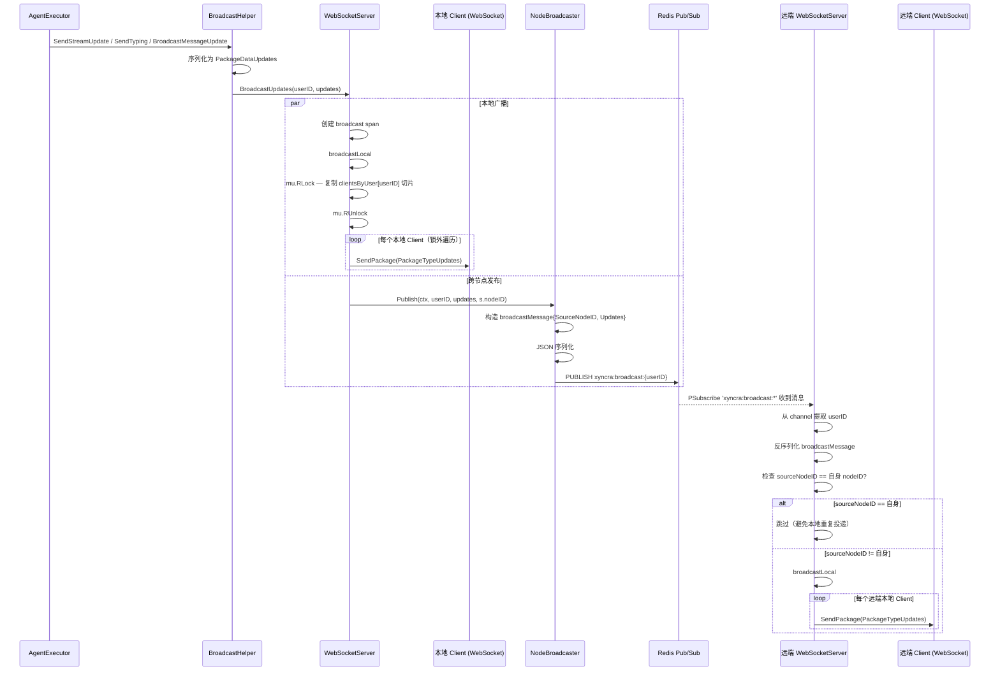
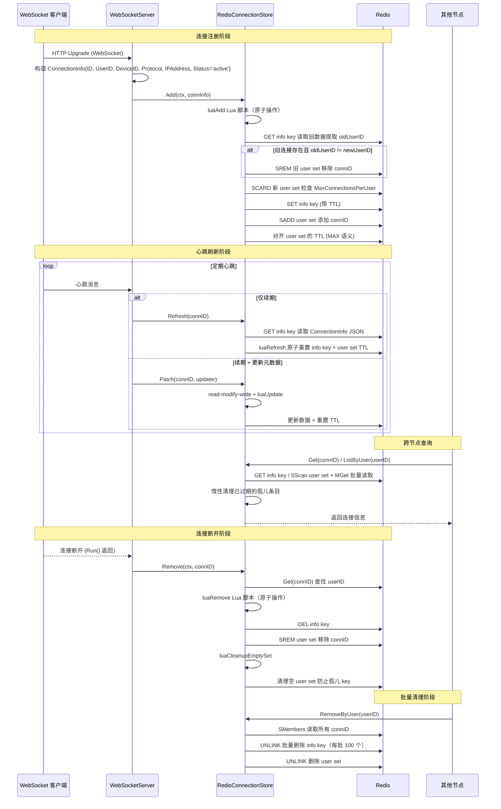
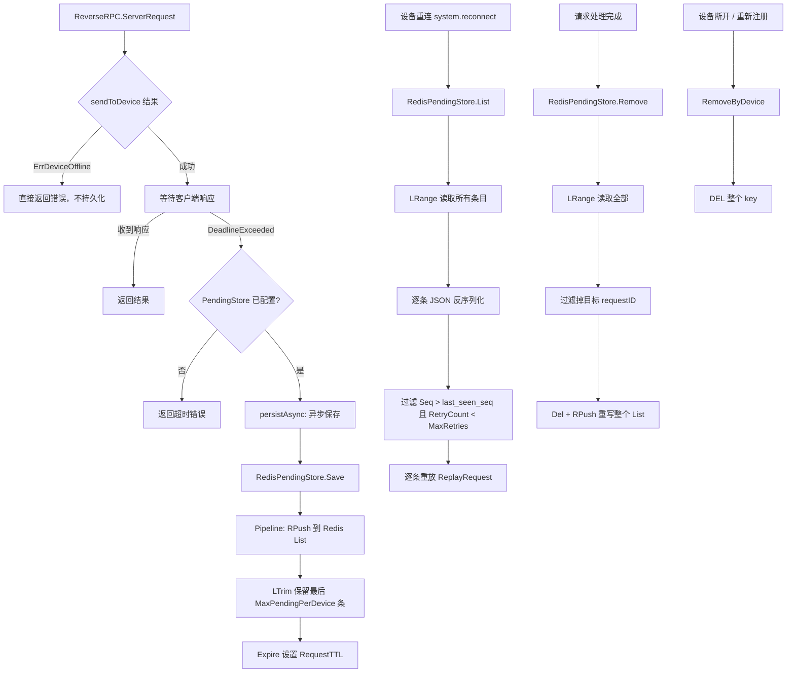
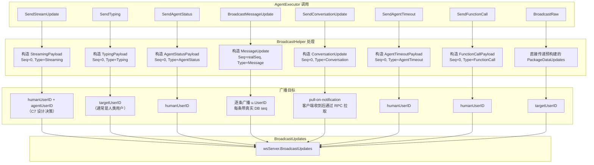
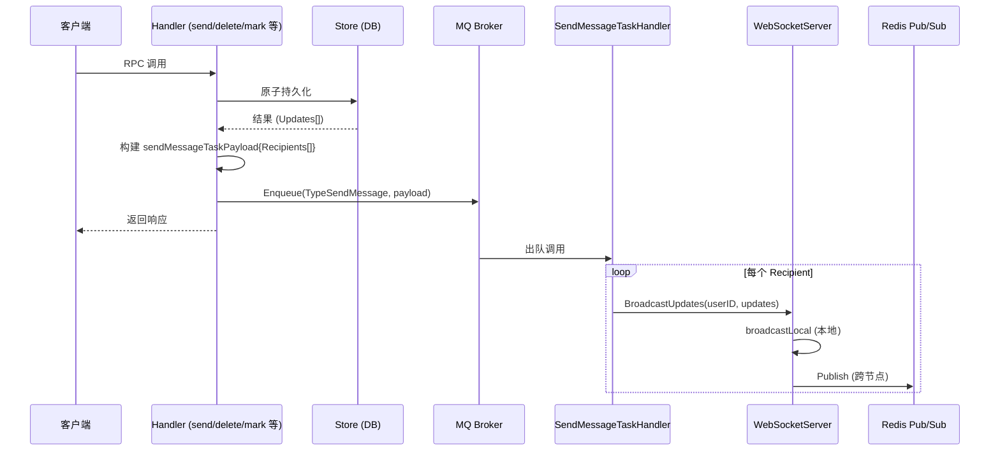
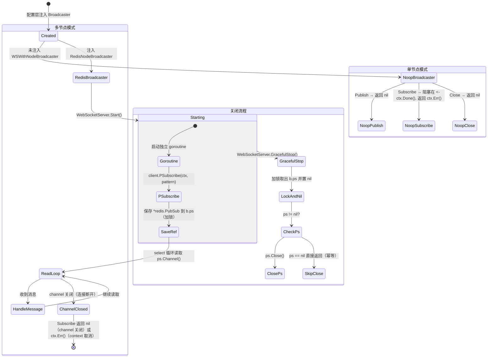

# 多节点广播 业务流程文档

本文档描述 Xyncra Server 中多节点广播的核心业务流程，涵盖消息跨节点投递、连接状态同步、待处理请求存储、Agent 事件广播以及广播器生命周期管理。

---

## 1. 跨节点消息广播 (cross_node_message_broadcast)

### 概述

当 Agent 执行器产生更新（streaming、typing、message 等）时，`BroadcastHelper` 通过 `WebSocketServer.BroadcastUpdates` 将更新同时投递到本地连接和远程节点。本地通过内存 map 直接写 WebSocket，远程通过 Redis Pub/Sub 扇出。

### 流程图

### 详细步骤

1. **AgentExecutor 调用 BroadcastHelper**：调用 `SendStreamUpdate(ctx, ...)` / `SendTyping(ctx, ...)` / `BroadcastMessageUpdate(ctx, ...)` 等方法（所有 BroadcastHelper 方法均接受 `context.Context` 作为第一个参数，当前保留用于未来取消支持），BroadcastHelper 将 payload 序列化为 `protocol.PackageDataUpdates`，调用 `wsServer.BroadcastUpdates(userID, updates)`。

2. **本地广播**：`WebSocketServer.BroadcastUpdates`（不接受 caller context，内部使用 `context.Background()` 作为 broadcast span 的 parent context）创建 broadcast span，调用 `broadcastLocal`。`broadcastLocal` 在 `mu.RLock` 下从 `clientsByUser[userID]` 复制一份 Client 引用切片后立即释放读锁，然后在锁外遍历切片逐个调用 `client.SendPackage` 发送 `PackageTypeUpdates` 包（复制后释放锁避免持锁期间 Send 阻塞影响其他并发操作）。

3. **跨节点发布**：调用 `nodeBroadcaster.Publish(ctx, userID, updates, s.nodeID)`，`s.nodeID` 是每个 WebSocketServer 实例启动时生成的 UUID。若 `userID` 为空，`Publish` 返回错误（`"server: broadcast publish: user ID is required"`），`BroadcastUpdates` 将此 error 仅记录日志（fire-and-forget）。

4. **Redis 发布**：`RedisNodeBroadcaster.Publish` 构造 `broadcastMessage{SourceNodeID, Updates}`，JSON 序列化后 `PUBLISH` 到 Redis channel `{keyPrefix}:broadcast:{userID}`（`keyPrefix` 默认 `"xyncra"`，通过 `NewRedisNodeBroadcaster` 第二个参数配置）。

5. **远端订阅接收**：远端节点的 `RedisNodeBroadcaster.Subscribe` 通过 `PSubscribe('{keyPrefix}:broadcast:*')` 订阅所有用户频道（默认 `xyncra:broadcast:*`），收到消息后从 channel 名提取 userID，反序列化 `broadcastMessage`。`Subscribe` 有 `defer ps.Close()` 确保返回时自动关闭 PubSub 连接。

6. **远端本地投递**：远端节点 `WebSocketServer.handleRemoteBroadcast` 处理远程消息——检查 `sourceNodeID == s.nodeID` 则跳过（避免本地重复投递），否则以 `context.Background()` 作为 context 调用 `broadcastLocal` 将更新推送给本节点上该用户的所有 WebSocket 连接。

### 边缘场景

| 场景 | 行为 |
|------|------|
| **updates 参数为 nil** | `BroadcastUpdates` 开头检查 `updates == nil`，若为 nil 直接返回 error（`"websocket: updates is nil"`），不执行本地广播和跨节点发布。这是唯一 `BroadcastUpdates` 返回非 nil error 的路径。 |
| **userID 为空字符串** | `RedisNodeBroadcaster.Publish` 开头检查 `userID == ""`，若为空返回 error（`"server: broadcast publish: user ID is required"`）。`BroadcastUpdates` 中此 error 仅记录日志，不传播给调用方（fire-and-forget）。 |
| **Redis Pub/Sub 发布失败** | `BroadcastUpdates` 调用 `nodeBroadcaster.Publish` 后若返回 error，仅 `logger.Error` 记录，`BroadcastUpdates` 仍返回 nil，符合 fire-and-forget 策略 (D-007)。数据已持久化，客户端可通过 `sync_updates` 拉取。 |
| **Redis 连接断开 / 网络分区** | `Subscribe` 的 `PSubscribe` 底层 channel 会关闭（`ok==false`），`Subscribe` 返回 nil。因为 `Subscribe` 在独立 goroutine 中运行且仅记录日志，不会导致节点崩溃。节点失去 Pub/Sub 能力但本地广播仍正常。 |
| **消息体畸形（JSON 反序列化失败）** | `Subscribe` 循环中反序列化失败直接 `continue` 跳过该消息，不中断订阅循环。 |
| **节点重启后 nodeID 变化** | 每个 WebSocketServer 实例在 `NewWebSocketServer` 构造时 `uuid.New()` 生成新 nodeID，重启后旧消息不会被错误跳过（因为旧 nodeID 不再匹配），但重启瞬间可能有短暂的消息间隙（Subscribe 尚未建立）。 |
| **用户在所有节点均无连接** | `broadcastLocal` 从 `clientsByUser` 取出空 slice，循环不执行。消息被 Redis Pub/Sub 投递后无人消费（fire-and-forget），数据持久化在 DB 中。 |

---

## 2. 连接状态同步 (connection_state_sync)

### 概述

每个 WebSocket 连接的生命周期通过 `RedisConnectionStore` 跨节点同步。连接注册（Add）、心跳刷新（Refresh/Patch）、断开移除（Remove）都写入 Redis，使得任何节点都能查询到全局连接状态。Redis key 采用双结构：info key 存连接元数据（带 TTL），user set 存该用户所有连接 ID。

### 流程图

### 详细步骤

1. **新连接注册**：`WebSocketServer` HTTP Upgrade 成功后构造 `ConnectionInfo{ID, UserID, DeviceID, Protocol, IPAddress, Status='active'}`，调用 `ConnectionStore().Add(ctx, connInfo)`。

2. **原子写入 Redis**：`RedisConnectionStore.Add` 通过 Lua 脚本 `luaAdd` 原子执行——`GET` info key 读取旧数据并提取 `oldUserID`，若旧连接存在且 `oldUserID != newUserID` 则先 `SREM` 旧 user set 移除 connID，然后检查 `SCARD` 新 user set 是否超过 `MaxConnectionsPerUser`，`SET` info key（带 TTL），`SADD` user set 添加 connID，对齐 user set 的 TTL（MAX 语义）。

3. **连接信息查询（跨节点可见）**：任何节点可通过 `Get(connID)` 读取 info key，或 `ListByUser(userID)` 使用 `SScan` 增量遍历 user set 并通过 `MGet` 批量读取 info key（非逐个 GET），同时惰性清理已过期的孤儿条目。`CountByUser` 使用 `SCARD` 近似计数（可能包含已过期但尚未清理的条目）。

4. **心跳刷新连接 TTL**：客户端定期发送心跳，服务端调用 `ConnectionStore.Refresh(connID)` 重置 Redis key TTL（仅续期，不修改数据字段）。若需同时更新连接元数据（如 `LastHeartbeatAt`），则调用 `Patch(connID, updater)` 执行 read-modify-write 并重置 TTL。

5. **连接断开移除**：`client.Run()` 返回后（客户端断开）调用 `ConnectionStore().Remove(cleanupCtx, connID)`。`Remove` 先通过 `Get` 查找 userID，再调用 `luaRemove` 原子删除 info key 并 `SREM` user set（Get 和 Lua 之间存在短暂窗口，若 info key 在此期间过期，SREM 仍会执行但移除的是已过期条目，属于安全的 no-op），随后调用 `luaCleanupEmptySet` 清理空 user set 防止孤儿 key。

6. **设备替换时异步清理旧连接**：同一 `(userID, deviceID)` 新连接到来时先在内存 map 中替换，然后异步 goroutine `performDeviceReplacement` 发送 4001 close frame 给旧连接、Close 旧 client、`removeClient` 清理本地索引。旧连接的 `ConnectionStore.Remove` 由其自身的 `handleWebSocket` defer 完成。

7. **更新连接元数据**：`Update(connID, metadata)` 执行非原子 read-modify-write——先 `Get` 读取当前 `ConnectionInfo`，替换 `Metadata` 字段后通过 `luaUpdate` 写回（`luaUpdate` 仅检查 key 是否存在，不做 CAS）。并发 `Update` 调用可能互相覆盖。需原子语义时应使用 `Patch`。

8. **检查连接是否存在**：`Exists(connID)` 通过 `Redis EXISTS` 命令检查 info key 是否存在，返回 bool。

9. **批量删除用户所有连接**：`RemoveByUser(userID)` 先通过 `SMembers` 读取 user set 中所有 connID，构建 info key 列表后通过 `UNLINK`（异步删除，不阻塞 Redis）每批 100 个删除 info key，最后 `UNLINK` 删除 user set 本身。

10. **全局连接计数**：`CountAll()` 使用 `SCAN` 命令遍历所有 `{keyPrefix}xyncra:conn:info:*` key（`keyPrefix` 默认为空，即 `xyncra:conn:info:*`）进行近似计数，适用于监控和诊断。

### 边缘场景

| 场景 | 行为 |
|------|------|
| **Redis 不可达（Add 失败）** | `Add` 返回 error，`handleWebSocket` 中关闭 client 并 `removeClient` 清理本地 map，连接不建立，不会出现本地有连接但 Redis 无记录的不一致。 |
| **Redis 不可达（Remove 失败）** | `Remove` 错误仅 `logger.Error` 不阻塞后续清理，info key 有 TTL 会自动过期，user set entry 成为孤儿但 `luaCleanupEmptySet` 会在下次 Remove 时清理，最终一致性。 |
| **服务器崩溃未执行 Remove** | info key 有 TTL（默认 30 分钟）到期自动删除。user set 中的 connID 成为孤儿条目，但下次 `ListByUser` 时 `Get` 该 connID 返回 `ErrConnectionNotFound` 会被跳过，`CountByUser` 是近似值。 |
| **MaxConnectionsPerUser 限制的 TOCTOU 竞争** | 存在检查和连接数限制检查都在 Lua 脚本中原子执行，避免了 info key 在 Go 侧 GET 和 Lua 调用之间过期导致绕过限制的竞态 (R3-001)。 |
| **连接 UserID 变更（overwrite）** | Lua 脚本检测到 `oldUserID != newUserID` 时先 `SREM` 从旧 user set 移除再 `SADD` 到新 user set，同时检查新用户的连接数限制。 |
| **设备替换时旧连接的 4001 close frame 丢失** | `WriteControl` 写入 TCP send buffer 后 `sleep(10ms)` 等待 flush 再 Close。若客户端仍收不到，旧连接最终因 TCP reset 断开，defer 中的 Remove 仍会执行清理。 |
| **ListByUser 遇到孤儿条目** | `ListByUser` 使用 `SScan` 遍历 user set，通过 `MGet` 批量读取 info key。若某个 connID 的 info key 已过期（`MGet` 返回 nil），该条目被收集到 `staleIDs` 列表，遍历完成后通过 `SRem` 批量移除并调用 `luaCleanupEmptySet` 清理空 set，实现惰性清理。 |

---

## 3. 待处理请求存储 (pending_request_storage)

### 概述

当服务端通过 ReverseRPC 向客户端发起请求（如 tool_call）但请求超时（`DeadlineExceeded`）时，请求被异步持久化到 `RedisPendingStore`。设备重新上线后通过 `system.reconnect` RPC 拉取并重放待处理请求。每个设备有独立的 Redis List，带容量上限和 TTL。

> **注意**：若设备离线（`sendToDevice` 返回 `ErrDeviceOffline`），`ServerRequest` 直接返回错误，不进入 pending 逻辑。仅当请求已发送但超时未收到响应时才持久化。

### 流程图

### 详细步骤

1. **请求超时进入 pending**：`ReverseRPC.ServerRequest` 通过 `sendFunc` 发送请求到指定 `(userID, deviceID)`。若发送成功但等待响应超时（`DeadlineExceeded`）且 `PendingStore` 已配置，`persistAsync` 在独立 goroutine 中异步调用 `PendingStore.Save` 持久化请求。若设备离线（`sendToDevice` 返回 `ErrDeviceOffline`），`ServerRequest` 直接返回错误，不持久化。

2. **持久化待处理请求**：`RedisPendingStore.Save` 将 `PendingRequest` JSON 序列化，通过 Pipeline 执行 `RPush` 追加到 Redis List key `pending:{userID}\x00{deviceID}`，`LTrim` 保留最后 `MaxPendingPerDevice` 条（淘汰最旧），`Expire` 设置 `RequestTTL`。

3. **查询待处理请求**：`RedisPendingStore.List` 通过 `LRange(key, 0, -1)` 读取所有条目逐条 JSON 反序列化，损坏条目跳过不报错，返回 `[]*PendingRequest` 按插入序（Seq 升序）。

4. **删除已处理请求**：`RedisPendingStore.Remove` 执行 `LRange` 读取全部，过滤掉目标 requestID，`Del` + `RPush` 重写整个 List。非原子操作（Pipeline 而非 Transaction），采用 fail-open 语义 (D-103)。若过滤后无剩余条目，仅执行 `Del` 删除 key，不设置 `Expire`（key 直接消失）。

5. **更新请求状态**：`RedisPendingStore.Update` 与 Remove 相同的 read-filter-rewrite 模式，找到匹配 ID 的条目替换为新版本，其余保留。与 Remove 相同，若过滤后无剩余条目，仅 `Del` 不设 `Expire`。

6. **清空设备所有待处理请求**：`RedisPendingStore.RemoveByDevice` 直接 `DEL` 整个 key，用于设备断开或重新注册时清理。

> **注意**：`RemoveByDevice` 已实现，但 WebSocketServer 层尚未自动在设备断开/重连时调用此方法。上层应用需自行在设备生命周期事件中调用 `RemoveByDevice` 清理残留请求。

### 边缘场景

| 场景 | 行为 |
|------|------|
| **设备离线（ErrDeviceOffline）** | `ServerRequest` 直接返回错误，不进入 pending 持久化逻辑。仅当请求已发送到设备但超时未响应（`DeadlineExceeded`）时才持久化。 |
| **上下文取消（非超时）** | 父 context 被取消时 `ServerRequest` 返回 `ctx.Err()`，不持久化。仅 `DeadlineExceeded` 触发持久化。 |
| **Remove/Update 在 Del 和 RPush 之间进程崩溃** | 这不是真正事务，崩溃可能导致条目丢失。采用 fail-open 语义 (D-103)，丢几条待处理请求可接受，因为客户端会重新发起。 |
| **List 中存在损坏的 JSON 条目** | `List` 和 `Remove/Update` 中反序列化失败的条目被 skip（`continue`），不影响其他正常条目。 |
| **MaxPendingPerDevice 超限** | `Save` 使用 `LTrim` 保留最后 N 条，最旧的请求被静默丢弃，不返回错误。 |
| **RequestTTL 过期** | Redis key 过期后整个 List 被删除，设备上线后 `List` 返回空，请求丢失。这是设计意图——过期请求不再有意义。 |
| **设备重新上线但 pending 请求已被 RemoveByDevice 清理** | 设备断开时 `CancelDevice` 取消所有 pending reverse-RPC。若上层应用调用了 `RemoveByDevice`，则 pending List 被清空；重新上线后不会有残留请求，新请求从零开始。 |
| **并发 Save 和 Remove 操作同一设备的 List** | Redis 单线程保证命令串行执行，但 read-then-write 的 `Remove/Update` 不是原子的。两个并发 Remove 可能各自读到完整列表后分别重写，导致其中一个的删除被覆盖。注释标注为可接受（fail-open）。 |

---

## 4. Agent 事件广播 (agent_broadcast_helper)

### 概述

`BroadcastHelper` 是 Agent 层对 `WebSocketServer.BroadcastUpdates` 的封装，负责将 Agent 执行过程中的实时事件（streaming 文本、typing 指示器、agent 状态、对话更新）广播给用户。除 `BroadcastMessageUpdate`（使用真实 DB seq 号）外，所有广播都是 ephemeral（Seq=0），不持久化。

### 流程图

### 详细步骤

1. **SendStreamUpdate**：`AgentExecutor` 调用 `BroadcastHelper.SendStreamUpdate` 传入 `humanUserID, agentUserID, conversationID, streamID, text, isDone`。BroadcastHelper 构造 `StreamingPayload` JSON 序列化后封装为 `PackageDataUpdate{Seq:0, Type:UpdateTypeStreaming}`。同时广播给 `humanUserID` 和 `agentUserID`（C7 设计决策），确保所有参与者都看到实时流文本。

2. **SendTyping**：广播打字指示器，构造 `TypingPayload{UserID: agentUserID, IsTyping}`，仅广播给 `targetUserID`（通常是人类用户）。

3. **SendAgentStatus**：广播 Agent 状态，构造 `AgentStatusPayload{Status: thinking/tool_calling/generating/idle/asking_user}`，通过 `broadcastEphemeral` 发送给 `humanUserID`。

4. **BroadcastMessageUpdate**：广播持久化消息。`store.SendMessage` 返回的 `UserUpdate` 列表每条带真实 DB seq 号，BroadcastHelper 逐条构造 `PackageDataUpdate{Seq: realSeq, Type:UpdateTypeMessage}` 广播给对应的 `u.UserID`（群聊场景下每个成员各自收到带自己 seq 的更新）。这些有真实 seq，客户端会纳入 sync state。

5. **SendConversationUpdate**：广播对话变更通知，构造轻量通知 `{conversation_id, action:'update', updated_at}`。`updatedAt` 参数（`time.Time`）非零时序列化为 Unix 秒写入 `updated_at` 字段，客户端可据此检测过期通知 (D-124)。采用 pull-on-notification 模式，客户端收到通知后通过 `get_conversation` RPC 拉取完整状态。

6. **SendAgentTimeout**：广播 Agent 超时通知，构造 `AgentTimeoutPayload{UserID: agentUserID, Reason}`，通过 `broadcastEphemeral` 发送给 `humanUserID`。

7. **SendFunctionCall**：广播函数调用信息，构造 `FunctionCallPayload{Name, Args, Result, Error, DurationMs, IsDone}`。每个函数调用应发送两次——执行前（`IsDone=false`，携带 name 和 args）和执行后（`IsDone=true`，携带 result 或 error）。通过 `broadcastEphemeral` 发送给 `humanUserID`。

8. **BroadcastRaw**：发送预构建的 `PackageDataUpdates` 给指定用户。由 resume handler 用于实时投递持久化的消息更新，直接调用 `wsServer.BroadcastUpdates` 并返回 error（非 fire-and-forget）。

### 边缘场景

| 场景 | 行为 |
|------|------|
| **BroadcastUpdates 返回 error** | 除 `BroadcastRaw` 外，所有 BroadcastHelper 方法都是 fire-and-forget，error 仅 `logger.Error` 不向调用方传播，Agent 执行不会因广播失败而中断。`BroadcastRaw` 直接返回 error 给调用方（resume handler 用于持久化消息投递，调用方自行处理错误）。 |
| **AgentRegistry 为 nil（nil-safe D-063）** | `isAgent()` 检查 `registry == nil` 时返回 false，BroadcastHelper 在 registry 为 nil 时仍正常工作，只是 `isAgent` 字段始终为 false。 |
| **JSON Marshal 失败** | 各 Send 方法中 marshal 失败直接 return 不发送任何消息，error 被 `logger.Error` 记录。 |
| **同一用户有多设备连接** | `BroadcastUpdates` -> `broadcastLocal` 遍历 `clientsByUser[userID]` 中所有连接，每个设备都收到更新，这是预期行为。 |

---

## 5. MQ 异步广播路径 (mq_broadcast_path)

### 概述

除直接调用 `BroadcastUpdates` 外，多个 handler 通过 MQ broker 异步广播更新。数据持久化后，handler 将 `PackageDataUpdates` 封装为 `TypeSendMessage` MQ task 入队（fire-and-forget），broker 出队后调用 `NewSendMessageTaskHandler` 逐个 recipient 调用 `broadcastFn`（即 `WebSocketServer.BroadcastUpdates`）广播。

所有使用此路径的 handler 共享相同的 `sendMessageTaskPayload` 结构和 `TypeSendMessage` task 类型：

| Handler | 触发操作 | 广播的 UpdateType |
|---------|---------|-------------------|
| `sendMessageHandler` | `send_message` RPC | `UpdateTypeMessage`（带真实 DB seq） |
| `deleteMessageHandler` | `delete_message` RPC | `UpdateTypeMessage`（删除标记） |
| `markAsReadHandler` | `mark_as_read` RPC | `UpdateTypeMarkRead` |
| `deleteConversationHandler` | `delete_conversation` RPC | `UpdateTypeConversation` |
| `restoreConversationHandler` | `restore_conversation` RPC | `UpdateTypeConversation` |
| `createConversationHandler` | `create_conversation` RPC | `UpdateTypeConversation` |

### 流程图

### 详细步骤

1. **数据持久化**：各 handler 调用对应的 store 方法原子持久化数据并分配 per-user seq，返回包含 `Updates` 的结果。以 `sendMessageHandler` 为例，调用 `store.SendMessage(msg, members)` 返回 `SendMessageResult{Message, Updates[]}`。

2. **构建 MQ task**：handler 将 `Updates` 按 recipient 分组为 `sendMessageTaskPayload{Recipients[]}`，每个 recipient 包含 `UserID` 和 `Updates`（带真实 DB seq）。JSON 序列化后入队 `mq.Task{Type: TypeSendMessage}`。所有 handler 复用相同的 payload 结构和 task 类型。

3. **MQ 出队广播**：`NewSendMessageTaskHandler` 出队后遍历 `Recipients`，对每个 recipient 调用 `broadcastFn(userID, updates)` 即 `WebSocketServer.BroadcastUpdates`，触发本地广播和跨节点发布。

4. **错误处理**：broadcast 失败仅 `logger.Error` 记录，继续处理下一个 recipient（fire-and-forget, D-007）。数据已持久化，客户端可通过 `sync_updates` 拉取。

### 边缘场景

| 场景 | 行为 |
|------|------|
| **MQ 入队失败** | `logger.Info` 记录，不阻塞响应返回。数据已持久化。 |
| **MQ payload 反序列化失败** | `logger.Error` 记录，return nil 不重试（数据已持久化，重试无意义）。 |
| **部分 recipient 广播失败** | 失败的 recipient 仅记录日志，继续处理剩余 recipient。 |

---

## 6. 广播器生命周期 (node_broadcaster_lifecycle)

### 概述

`NodeBroadcaster` 的创建、启动订阅、关闭的完整生命周期。单节点部署使用 `NoopBroadcaster`（空操作），多节点部署使用 `RedisNodeBroadcaster`（Redis Pub/Sub）。

### 流程图

### 详细步骤

1. **配置注入**：配置层通过 `WSWithNodeBroadcaster` option 注入 `Broadcaster` 实现。未注入时默认 `NoopBroadcaster`（单节点无跨节点路由）。

2. **启动 Pub/Sub 订阅**：`WebSocketServer.Start` 在独立 goroutine 中调用 `nodeBroadcaster.Subscribe(s.Context(), s.handleRemoteBroadcast)`。订阅 pattern 为 `{keyPrefix}:broadcast:*`（默认 `xyncra:broadcast:*`），阻塞直到 ctx 取消。

3. **RedisNodeBroadcaster.Subscribe**：建立 `PSubscribe` 并保存引用——调用 `client.PSubscribe(ctx, pattern)` 将返回的 `*redis.PubSub` 保存到 `b.ps`（加锁），然后进入 select 循环读取 `ps.Channel()`。

4. **关闭 Broadcaster**：`WebSocketServer.GracefulStop` 调用 `nodeBroadcaster.Close()`。`RedisNodeBroadcaster.Close` 加锁读取 `b.ps` 到本地变量并立即将 `b.ps` 置 nil（防止重复 close），解锁后若 ps 非 nil 则调用 `ps.Close()`。

5. **NoopBroadcaster 单节点模式**：`Publish` 直接返回 nil，`Subscribe` 阻塞在 `<-ctx.Done()`，`Close` 返回 nil，零开销。

### 边缘场景

| 场景 | 行为 |
|------|------|
| **Subscribe goroutine 中 Redis 连接断开** | `ps.Channel()` 返回的 channel 会被关闭（`ok==false`），`Subscribe` 返回 nil。`Subscribe` 函数自带 `defer ps.Close()`，返回时自动关闭 PubSub 连接。WebSocketServer 中仅记录日志（如果 ctx 未取消），节点失去跨节点广播能力但不崩溃。 |
| **Close 被多次调用** | `b.ps` 在第一次 Close 时被置 nil，后续调用检测 `ps == nil` 直接返回 nil，幂等安全。 |
| **Publish 和 Subscribe 使用同一 redis.Client** | 文档注释要求 Pub/Sub 使用专用连接（go-redis 限制）。如果共享 client，Subscribe 会独占连接导致其他命令阻塞。 |
| **GracefulStop 时 Subscribe 尚未建立** | Subscribe 在独立 goroutine 中启动，Close 时 `b.ps` 可能为 nil（Subscribe 还没执行到 PSubscribe）。Close 检查 `ps==nil` 直接返回，无 panic。 |
| **Subscribe 返回后调用 Close** | `GracefulStop` 先调用 `nodeBroadcaster.Close()`（置 `b.ps=nil` 并关闭 PubSub），然后调用 `BaseServer.GracefulStop` 取消 context。`Subscribe` 的 `defer ps.Close()` 在 context 取消后触发，对已关闭的 PubSub 再次 Close。这是无害的双重关闭，error 仅记录日志，不影响关闭流程。 |

---

## 设计决策索引

| 编号 | 决策 | 涉及流程 |
|------|------|----------|
| D-007 | Fire-and-forget 广播策略，失败不阻塞 Agent 执行 | 跨节点消息广播、Agent 事件广播、MQ 异步广播路径 |
| D-010 | 被动续期策略，user SET TTL 采用 MAX 语义对齐 | 连接状态同步 |
| D-018 | 跨节点广播使用 Redis Pub/Sub | 跨节点消息广播、广播器生命周期 |
| D-063 | AgentRegistry nil-safe，nil 时 isAgent 始终 false | Agent 事件广播 |
| D-103 | Fail-open 语义，pending 请求允许少量丢失 | 待处理请求存储 |
| D-124 | ConversationUpdate 携带 updatedAt 供客户端检测过期通知 | Agent 事件广播 |
| R3-001 | Lua 脚本原子操作避免 TOCTOU 竞争 | 连接状态同步 |
| C7 | StreamUpdate 同时广播给 human 和 agent | Agent 事件广播 |

---

## 相关文档

- [WebSocket 连接管理](websocket-connection.md) — 连接建立、断开、设备替换、跨节点广播概览
- [Heartbeat 业务流程](heartbeat.md) — 应用层心跳与 ConnectionStore TTL 刷新
- [反向 RPC](reverse-rpc.md) — ServerRequest、PendingStore、重放流程
- [断线重连](reconnection.md) — system.reconnect 与待处理请求重放
- [消息队列](message-queue.md) — MQ broker 与异步任务处理
- [业务流程索引](index.md)
