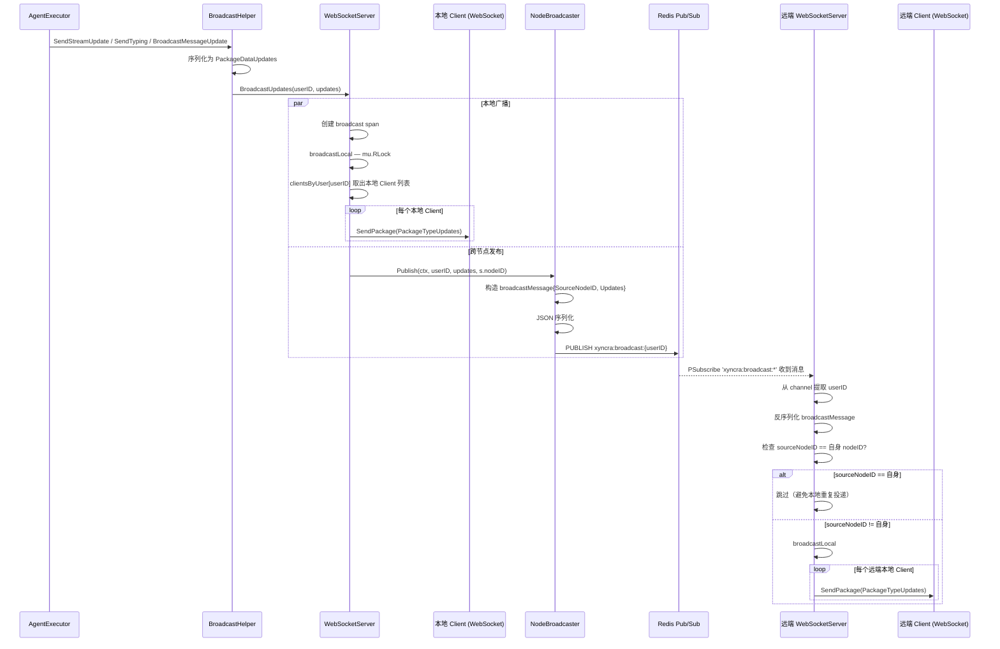
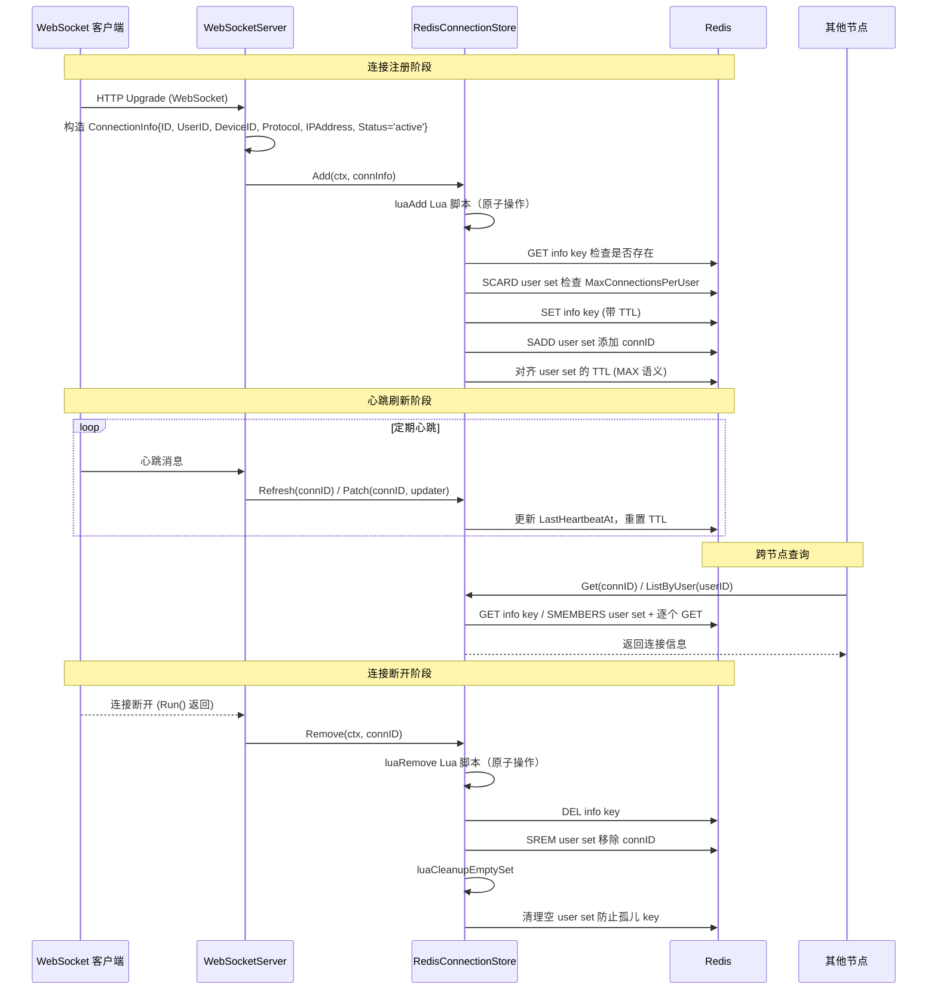
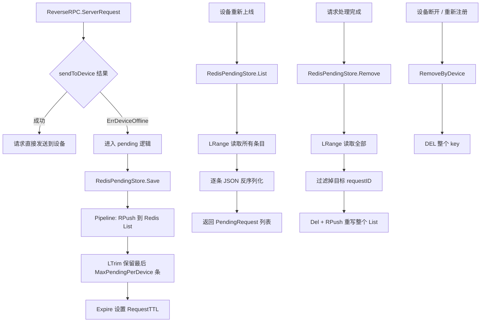
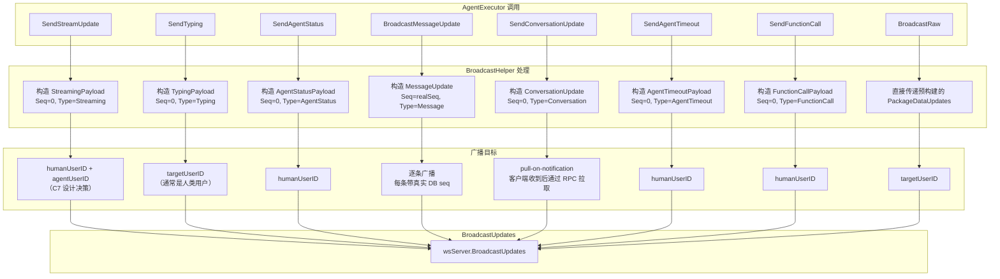
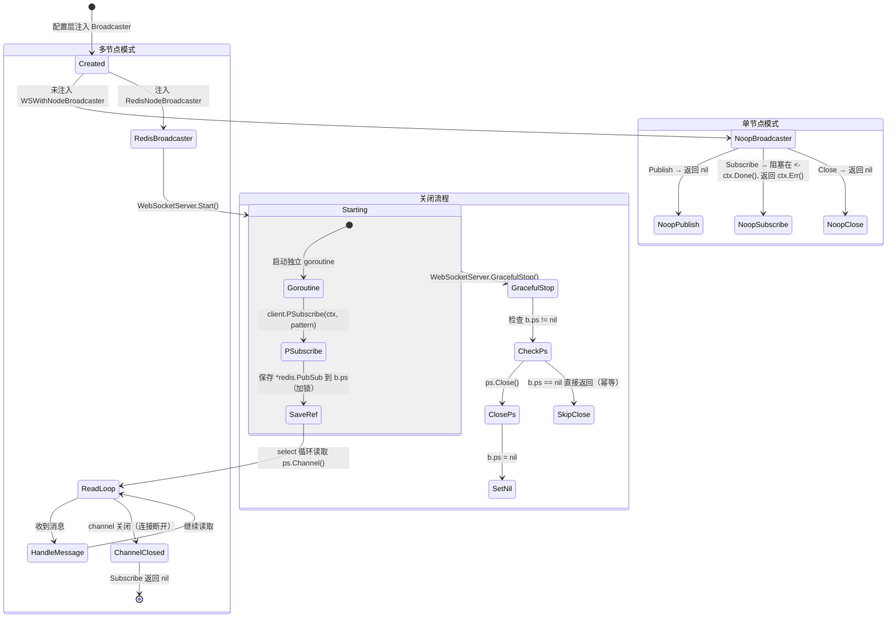

# 多节点广播 业务流程文档

本文档描述 Xyncra Server 中多节点广播的核心业务流程，涵盖消息跨节点投递、连接状态同步、待处理请求存储、Agent 事件广播以及广播器生命周期管理。

---

## 1. 跨节点消息广播 (cross_node_message_broadcast)

### 概述

当 Agent 执行器产生更新（streaming、typing、message 等）时，`BroadcastHelper` 通过 `WebSocketServer.BroadcastUpdates` 将更新同时投递到本地连接和远程节点。本地通过内存 map 直接写 WebSocket，远程通过 Redis Pub/Sub 扇出。

### 流程图

### 详细步骤

1. **AgentExecutor 调用 BroadcastHelper**：调用 `SendStreamUpdate` / `SendTyping` / `BroadcastMessageUpdate` 等方法，BroadcastHelper 将 payload 序列化为 `protocol.PackageDataUpdates`，调用 `wsServer.BroadcastUpdates(userID, updates)`。

2. **本地广播**：`WebSocketServer.BroadcastUpdates` 创建 broadcast span，调用 `broadcastLocal`，在 `mu.RLock` 下从 `clientsByUser[userID]` 取出所有本地 Client，逐个调用 `client.SendPackage` 发送 `PackageTypeUpdates` 包。

3. **跨节点发布**：调用 `nodeBroadcaster.Publish(ctx, userID, updates, s.nodeID)`，`s.nodeID` 是每个 WebSocketServer 实例启动时生成的 UUID。

4. **Redis 发布**：`RedisNodeBroadcaster.Publish` 构造 `broadcastMessage{SourceNodeID, Updates}`，JSON 序列化后 `PUBLISH` 到 Redis channel `xyncra:broadcast:{userID}`。

5. **远端订阅接收**：远端节点的 `RedisNodeBroadcaster.Subscribe` 通过 `PSubscribe('xyncra:broadcast:*')` 订阅所有用户频道，收到消息后从 channel 名提取 userID，反序列化 `broadcastMessage`。

6. **远端本地投递**：远端节点 `WebSocketServer.handleRemoteBroadcast` 处理远程消息——检查 `sourceNodeID == s.nodeID` 则跳过（避免本地重复投递），否则调用 `broadcastLocal` 将更新推送给本节点上该用户的所有 WebSocket 连接。

### 边缘场景

| 场景 | 行为 |
|------|------|
| **Redis Pub/Sub 发布失败** | `BroadcastUpdates` 调用 `nodeBroadcaster.Publish` 后若返回 error，仅 `logger.Error` 记录，`BroadcastUpdates` 仍返回 nil，符合 fire-and-forget 策略 (D-007)。数据已持久化，客户端可通过 `sync_updates` 拉取。 |
| **Redis 连接断开 / 网络分区** | `Subscribe` 的 `PSubscribe` 底层 channel 会关闭（`ok==false`），`Subscribe` 返回 nil。因为 `Subscribe` 在独立 goroutine 中运行且仅记录日志，不会导致节点崩溃。节点失去 Pub/Sub 能力但本地广播仍正常。 |
| **消息体畸形（JSON 反序列化失败）** | `Subscribe` 循环中反序列化失败直接 `continue` 跳过该消息，不中断订阅循环。 |
| **节点重启后 nodeID 变化** | 每个 WebSocketServer 实例启动时 `uuid.New()` 生成新 nodeID，重启后旧消息不会被错误跳过（因为旧 nodeID 不再匹配），但重启瞬间可能有短暂的消息间隙（Subscribe 尚未建立）。 |
| **用户在所有节点均无连接** | `broadcastLocal` 从 `clientsByUser` 取出空 slice，循环不执行。消息被 Redis Pub/Sub 投递后无人消费（fire-and-forget），数据持久化在 DB 中。 |

---

## 2. 连接状态同步 (connection_state_sync)

### 概述

每个 WebSocket 连接的生命周期通过 `RedisConnectionStore` 跨节点同步。连接注册（Add）、心跳刷新（Refresh/Patch）、断开移除（Remove）都写入 Redis，使得任何节点都能查询到全局连接状态。Redis key 采用双结构：info key 存连接元数据（带 TTL），user set 存该用户所有连接 ID。

### 流程图

### 详细步骤

1. **新连接注册**：`WebSocketServer` HTTP Upgrade 成功后构造 `ConnectionInfo{ID, UserID, DeviceID, Protocol, IPAddress, Status='active'}`，调用 `ConnectionStore().Add(ctx, connInfo)`。

2. **原子写入 Redis**：`RedisConnectionStore.Add` 通过 Lua 脚本 `luaAdd` 原子执行——`GET` info key 检查是否已存在，若新连接则检查 `SCARD` user set 是否超过 `MaxConnectionsPerUser`，`SET` info key（带 TTL），`SADD` user set 添加 connID，对齐 user set 的 TTL（MAX 语义）。

3. **连接信息查询（跨节点可见）**：任何节点可通过 `Get(connID)` 读取 info key，或 `ListByUser(userID)` 读取 user set 中所有 connID 再逐个 GET，`CountByUser` 使用 `SCARD` 近似计数。

4. **心跳刷新连接 TTL**：客户端定期发送心跳，服务端调用 `ConnectionStore.Refresh(connID)` 或 `Patch(connID, updater)` 更新 `LastHeartbeatAt` 并重置 Redis key TTL。

5. **连接断开移除**：`client.Run()` 返回后（客户端断开）调用 `ConnectionStore().Remove(cleanupCtx, connID)`。`Remove` 通过 `luaRemove` 原子删除 info key 并 `SREM` user set，随后调用 `luaCleanupEmptySet` 清理空 user set 防止孤儿 key。

6. **设备替换时异步清理旧连接**：同一 `(userID, deviceID)` 新连接到来时先在内存 map 中替换，然后异步 goroutine `performDeviceReplacement` 发送 4001 close frame 给旧连接、Close 旧 client、`removeClient` 清理本地索引。旧连接的 `ConnectionStore.Remove` 由其自身的 `handleWebSocket` defer 完成。

### 边缘场景

| 场景 | 行为 |
|------|------|
| **Redis 不可达（Add 失败）** | `Add` 返回 error，`handleWebSocket` 中关闭 client 并 `removeClient` 清理本地 map，连接不建立，不会出现本地有连接但 Redis 无记录的不一致。 |
| **Redis 不可达（Remove 失败）** | `Remove` 错误仅 `logger.Error` 不阻塞后续清理，info key 有 TTL 会自动过期，user set entry 成为孤儿但 `luaCleanupEmptySet` 会在下次 Remove 时清理，最终一致性。 |
| **服务器崩溃未执行 Remove** | info key 有 TTL（默认 30 分钟）到期自动删除。user set 中的 connID 成为孤儿条目，但下次 `ListByUser` 时 `Get` 该 connID 返回 `ErrConnectionNotFound` 会被跳过，`CountByUser` 是近似值。 |
| **MaxConnectionsPerUser 限制的 TOCTOU 竞争** | 存在检查和连接数限制检查都在 Lua 脚本中原子执行，避免了 info key 在 Go 侧 GET 和 Lua 调用之间过期导致绕过限制的竞态 (R3-001)。 |
| **连接 UserID 变更（overwrite）** | Lua 脚本检测到 `oldUserID != newUserID` 时先 `SREM` 从旧 user set 移除再 `SADD` 到新 user set，同时检查新用户的连接数限制。 |
| **设备替换时旧连接的 4001 close frame 丢失** | `WriteControl` 写入 TCP send buffer 后 `sleep(10ms)` 等待 flush 再 Close。若客户端仍收不到，旧连接最终因 TCP reset 断开，defer 中的 Remove 仍会执行清理。 |

---

## 3. 待处理请求存储 (pending_request_storage)

### 概述

当服务端通过 ReverseRPC 向客户端发起请求（如 tool_call）但目标设备离线时，请求被持久化到 `RedisPendingStore`。设备重新上线后可拉取待处理请求。每个设备有独立的 Redis List，带容量上限和 TTL。

### 流程图

### 详细步骤

1. **请求进入 pending**：`ReverseRPC.ServerRequest` 通过 `sendFunc` 发送请求到指定 `(userID, deviceID)`，若设备离线（`sendToDevice` 返回 `ErrDeviceOffline`），请求进入 pending 逻辑。

2. **持久化待处理请求**：`RedisPendingStore.Save` 将 `PendingRequest` JSON 序列化，通过 Pipeline 执行 `RPush` 追加到 Redis List key `pending:{userID}\x00{deviceID}`，`LTrim` 保留最后 `MaxPendingPerDevice` 条（淘汰最旧），`Expire` 设置 `RequestTTL`。

3. **查询待处理请求**：`RedisPendingStore.List` 通过 `LRange(key, 0, -1)` 读取所有条目逐条 JSON 反序列化，损坏条目跳过不报错，返回 `[]*PendingRequest` 按插入序（Seq 升序）。

4. **删除已处理请求**：`RedisPendingStore.Remove` 执行 `LRange` 读取全部，过滤掉目标 requestID，`Del` + `RPush` 重写整个 List。非原子操作（Pipeline 而非 Transaction），采用 fail-open 语义 (D-103)。

5. **更新请求状态**：`RedisPendingStore.Update` 与 Remove 相同的 read-filter-rewrite 模式，找到匹配 ID 的条目替换为新版本，其余保留。

6. **清空设备所有待处理请求**：`RedisPendingStore.RemoveByDevice` 直接 `DEL` 整个 key，用于设备断开或重新注册时清理。

### 边缘场景

| 场景 | 行为 |
|------|------|
| **Remove/Update 在 Del 和 RPush 之间进程崩溃** | 这不是真正事务，崩溃可能导致条目丢失。采用 fail-open 语义 (D-103)，丢几条待处理请求可接受，因为客户端会重新发起。 |
| **List 中存在损坏的 JSON 条目** | `List` 和 `Remove/Update` 中反序列化失败的条目被 skip（`continue`），不影响其他正常条目。 |
| **MaxPendingPerDevice 超限** | `Save` 使用 `LTrim` 保留最后 N 条，最旧的请求被静默丢弃，不返回错误。 |
| **RequestTTL 过期** | Redis key 过期后整个 List 被删除，设备上线后 `List` 返回空，请求丢失。这是设计意图——过期请求不再有意义。 |
| **设备重新上线但 pending 请求已被 RemoveByDevice 清理** | 设备断开时 `CancelDevice` 取消所有 pending reverse-RPC，随后 `RemoveByDevice` 清理。重新上线后不会有残留请求，新请求从零开始。 |
| **并发 Save 和 Remove 操作同一设备的 List** | Redis 单线程保证命令串行执行，但 read-then-write 的 `Remove/Update` 不是原子的。两个并发 Remove 可能各自读到完整列表后分别重写，导致其中一个的删除被覆盖。注释标注为可接受（fail-open）。 |

---

## 4. Agent 事件广播 (agent_broadcast_helper)

### 概述

`BroadcastHelper` 是 Agent 层对 `WebSocketServer.BroadcastUpdates` 的封装，负责将 Agent 执行过程中的实时事件（streaming 文本、typing 指示器、agent 状态、对话更新）广播给用户。所有广播都是 ephemeral（Seq=0），不持久化。

### 流程图

### 详细步骤

1. **SendStreamUpdate**：`AgentExecutor` 调用 `BroadcastHelper.SendStreamUpdate` 传入 `humanUserID, agentUserID, conversationID, streamID, text, isDone`。BroadcastHelper 构造 `StreamingPayload` JSON 序列化后封装为 `PackageDataUpdate{Seq:0, Type:UpdateTypeStreaming}`。同时广播给 `humanUserID` 和 `agentUserID`（C7 设计决策），确保所有参与者都看到实时流文本。

2. **SendTyping**：广播打字指示器，构造 `TypingPayload{UserID: agentUserID, IsTyping}`，仅广播给 `targetUserID`（通常是人类用户）。

3. **SendAgentStatus**：广播 Agent 状态，构造 `AgentStatusPayload{Status: thinking/tool_calling/generating/idle/asking_user}`，通过 `broadcastEphemeral` 发送给 `humanUserID`。

4. **BroadcastMessageUpdate**：广播持久化消息。`store.SendMessage` 返回的 `UserUpdate` 列表每条带真实 DB seq 号，BroadcastHelper 逐条构造 `PackageDataUpdate{Seq: realSeq, Type:UpdateTypeMessage}` 广播。这些有真实 seq，客户端会纳入 sync state。

5. **SendConversationUpdate**：广播对话变更通知，构造轻量通知 `{conversation_id, action:'update', updated_at}`。采用 pull-on-notification 模式，客户端收到通知后通过 `get_conversation` RPC 拉取完整状态。

6. **SendAgentTimeout**：广播 Agent 超时通知，构造 `AgentTimeoutPayload{UserID: agentUserID, Reason}`，通过 `broadcastEphemeral` 发送给 `humanUserID`。

7. **SendFunctionCall**：广播函数调用信息，构造 `FunctionCallPayload{Name, Args, Result, Error, DurationMs, IsDone}`。每个函数调用应发送两次——执行前（`IsDone=false`，携带 name 和 args）和执行后（`IsDone=true`，携带 result 或 error）。通过 `broadcastEphemeral` 发送给 `humanUserID`。

8. **BroadcastRaw**：发送预构建的 `PackageDataUpdates` 给指定用户。由 resume handler 用于实时投递持久化的消息更新，直接调用 `wsServer.BroadcastUpdates` 并返回 error（非 fire-and-forget）。

### 边缘场景

| 场景 | 行为 |
|------|------|
| **BroadcastUpdates 返回 error** | 所有 BroadcastHelper 方法都是 fire-and-forget，error 仅 `logger.Error` 不向调用方传播，Agent 执行不会因广播失败而中断。 |
| **AgentRegistry 为 nil（nil-safe D-063）** | `isAgent()` 检查 `registry == nil` 时返回 false，BroadcastHelper 在 registry 为 nil 时仍正常工作，只是 `isAgent` 字段始终为 false。 |
| **JSON Marshal 失败** | 各 Send 方法中 marshal 失败直接 return 不发送任何消息，error 被 `logger.Error` 记录。 |
| **同一用户有多设备连接** | `BroadcastUpdates` -> `broadcastLocal` 遍历 `clientsByUser[userID]` 中所有连接，每个设备都收到更新，这是预期行为。 |

---

## 5. 广播器生命周期 (node_broadcaster_lifecycle)

### 概述

`NodeBroadcaster` 的创建、启动订阅、关闭的完整生命周期。单节点部署使用 `NoopBroadcaster`（空操作），多节点部署使用 `RedisNodeBroadcaster`（Redis Pub/Sub）。

### 流程图

### 详细步骤

1. **配置注入**：配置层通过 `WSWithNodeBroadcaster` option 注入 `Broadcaster` 实现。未注入时默认 `NoopBroadcaster`（单节点无跨节点路由）。

2. **启动 Pub/Sub 订阅**：`WebSocketServer.Start` 在独立 goroutine 中调用 `nodeBroadcaster.Subscribe(s.Context(), s.handleRemoteBroadcast)`。订阅 pattern 为 `xyncra:broadcast:*`，阻塞直到 ctx 取消。

3. **RedisNodeBroadcaster.Subscribe**：建立 `PSubscribe` 并保存引用——调用 `client.PSubscribe(ctx, pattern)` 将返回的 `*redis.PubSub` 保存到 `b.ps`（加锁），然后进入 select 循环读取 `ps.Channel()`。

4. **关闭 Broadcaster**：`WebSocketServer.GracefulStop` 调用 `nodeBroadcaster.Close()`。`RedisNodeBroadcaster.Close` 加锁取出 `ps` 引用并置 nil（防止重复 close），然后调用 `ps.Close()`。

5. **NoopBroadcaster 单节点模式**：`Publish` 直接返回 nil，`Subscribe` 阻塞在 `<-ctx.Done()`，`Close` 返回 nil，零开销。

### 边缘场景

| 场景 | 行为 |
|------|------|
| **Subscribe goroutine 中 Redis 连接断开** | `ps.Channel()` 返回的 channel 会被关闭（`ok==false`），`Subscribe` 返回 nil。WebSocketServer 中仅记录日志（如果 ctx 未取消），节点失去跨节点广播能力但不崩溃。 |
| **Close 被多次调用** | `b.ps` 在第一次 Close 时被置 nil，后续调用检测 `ps == nil` 直接返回 nil，幂等安全。 |
| **Publish 和 Subscribe 使用同一 redis.Client** | 文档注释要求 Pub/Sub 使用专用连接（go-redis 限制）。如果共享 client，Subscribe 会独占连接导致其他命令阻塞。 |
| **GracefulStop 时 Subscribe 尚未建立** | Subscribe 在独立 goroutine 中启动，Close 时 `b.ps` 可能为 nil（Subscribe 还没执行到 PSubscribe）。Close 检查 `ps==nil` 直接返回，无 panic。 |

---

## 设计决策索引

| 编号 | 决策 | 涉及流程 |
|------|------|----------|
| D-007 | Fire-and-forget 广播策略，失败不阻塞 Agent 执行 | 跨节点消息广播、Agent 事件广播 |
| D-063 | AgentRegistry nil-safe，nil 时 isAgent 始终 false | Agent 事件广播 |
| D-103 | Fail-open 语义，pending 请求允许少量丢失 | 待处理请求存储 |
| R3-001 | Lua 脚本原子操作避免 TOCTOU 竞争 | 连接状态同步 |
| C7 | StreamUpdate 同时广播给 human 和 agent | Agent 事件广播 |
