# CLI 与 IPC 通信业务流程文档

本文档详细描述 Xyncra 客户端 CLI 命令的执行流程、IPC 通信机制以及各业务子流程的完整行为和边界条件。

---

## 目录

1. [CLI 命令执行总流程](#1-cli-命令执行总流程)
2. [IPC 通信机制](#2-ipc-通信机制)
3. [守护进程模式 (listen)](#3-守护进程模式-listen)
4. [发送消息 (send)](#4-发送消息-send)
5. [会话管理](#5-会话管理)
6. [消息管理](#6-消息管理)
7. [草稿管理](#7-草稿管理)
8. [终止守护进程 (kill)](#8-终止守护进程-kill)
9. [进程锁管理](#9-进程锁管理)
10. [日志管理](#10-日志管理)
11. [同步更新 (sync_updates)](#11-同步更新-sync_updates)
12. [Agent 恢复 (agent_resume)](#12-agent-恢复-agent_resume)
13. [设置输入状态 (set_typing)](#13-设置输入状态-set_typing)
14. [流式文本 (stream_text)](#14-流式文本-stream_text)
15. [内置诊断函数](#15-内置诊断函数)
16. [重载 Agent 配置 (reload_agents)](#16-重载-agent-配置-reload_agents)

---

## 1. CLI 命令执行总流程

每个 CLI 子命令遵循统一的执行模式：解析全局标志、构建 CLIContext、优先尝试 IPC、降级到独立 WebSocket、或从本地 DB 读取（查询命令）。

### 流程图

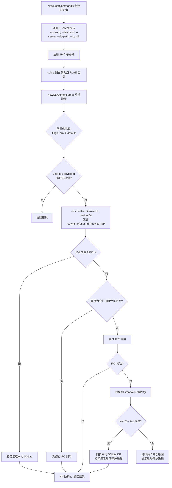

### 关键路径说明

| 路径 | 说明 |
|------|------|
| SocketPath | `~/.xyncra/{user_id}/{device_id}/xyncra.sock` |
| LockPath | `~/.xyncra/{user_id}/{device_id}/xyncra.lock` |
| DBPathDefault | `~/.xyncra/{user_id}/{device_id}/xyncra.db` |
| standaloneRPC 超时 | 连接 5s，读写 5s |

### 边缘场景

| 场景 | 行为 |
|------|------|
| user-id 或 device-id 缺失 | `NewCLIContext` 立即返回错误 |
| ensureUserDir 失败（如主目录不可用、权限不足） | 返回包装错误 |
| IPC 和 standalone 均失败 | 打印两个错误原因及提示信息，返回非 nil 错误 |
| standalone WebSocket 连接超时 (5s) | 返回 `dial: context deadline exceeded` |
| standalone WebSocket 读取超时 | 返回 `standalone read: server timed out`，附带 `net.Error` 检测 |
| isMutationMethod 为 true 且 standalone 成功 | 打印提示：本地 DB 将在守护进程启动时更新 |
| device-id 未指定 | `NewCLIContext` 返回错误（必填）。`defaultDeviceID()`（`SHA256(hostname)[:8]`）已实现但未接入主流程，目前仅在测试中使用 |

---

## 2. IPC 通信机制

IPC 层使用 Unix 域套接字，配合换行分隔的 JSON-RPC 2.0 协议。守护进程运行 IPCServer；CLI 命令使用 IPCClient，每次调用建立新连接。

### 流程图

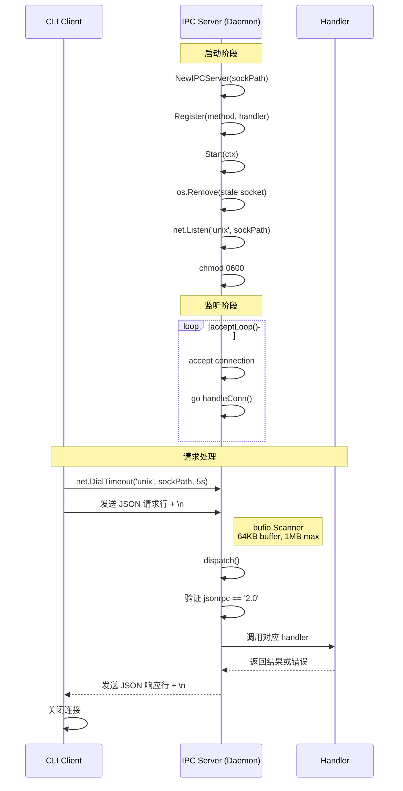

### 协议格式

**请求**:
```json
{"jsonrpc": "2.0", "id": 1, "method": "send_message", "params": {...}}
```

**成功响应**:
```json
{"jsonrpc": "2.0", "id": 1, "result": {...}}
```

**错误响应**:
```json
{"jsonrpc": "2.0", "id": 1, "error": {"code": -32601, "message": "Method not found"}}
```

### 错误码

| 错误码 | 含义 |
|--------|------|
| -32700 | JSON 解析错误 |
| -32600 | 无效的 JSONRPC 版本 |
| -32601 | 未知方法 |
| -32602 | 参数解析错误（IPC handler 内部 `json.Unmarshal` 失败） |
| -32000 | 通用服务器错误（`dispatch()` 层：handler 返回 Go error 而非 `*IPCResponse`） |
| -300 | 业务逻辑错误（IPC handler 内部：`XyncraClient` RPC 调用失败但非 `*client.ClientError`） |
| 自定义 | `*client.ClientError` 中提取的 .Code 和 .Message |

### 已注册的 IPC 方法

`send_message`、`sync_updates`、`create_conversation`、`delete_conversation`、`restore_conversation`、`delete_message`、`mark_as_read`、`set_typing`、`stream_text`、`agent_resume`、`reload_agents`

### 边缘场景

| 场景 | 行为 |
|------|------|
| 上次崩溃残留的 socket 文件 | `Start()` 先调用 `os.Remove`；若失败且非 `ErrNotExist` 则返回错误 |
| 残留锁文件且进程已死 | `acquireLock` 读取 `LockInfo`，通过 `signal(0)` 检测进程存活，已死则移除锁文件重试 |
| IPC 客户端连接超时 (5s) | 返回 `ipc client dial: ...` 错误 |
| IPC 客户端读取超时 | `SetReadDeadline` 导致 `scanner.Scan()` 失败，返回 `ipc client read response: ...` |
| Handler 返回 `*client.ClientError` | 提取 `.Code` 和 `.Message` 作为结构化 IPC 错误返回 |
| Handler 返回 generic error | 包装为 IPC 错误码 -32000 |
| `restore_conversation` handler 本地 `Restore()` 返回 `ErrNotFound` | 降级为直接调用 `xc.Call('get_conversation', ...)` 从服务器获取并 upsert |
| `mark_as_read` handler | 使用服务器返回的 `last_read_message_id`（MAX 语义）更新本地读游标 |
| acceptLoop 瞬态错误 | 休眠 100ms 后继续 |
| `Stop()` | 取消 context、关闭 listener、调用 `wg.Wait()` 排空进行中的连接 |

---

## 3. 守护进程模式 (listen)

`listen` 子命令启动一个长运行守护进程，维持与服务器的 WebSocket 连接、接受 IPC 命令、接收推送更新并管理本地 SQLite 数据库。

### 流程图

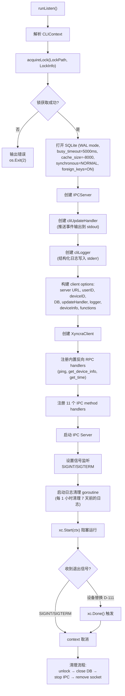

### 边缘场景

| 场景 | 行为 |
|------|------|
| 守护进程已在运行（锁被活跃进程持有） | `acquireLock` 返回 `'listen already running (PID: %d)'`，`runListen` 调用 `os.Exit(2)` |
| 锁被死进程持有（stale lock） | `acquireLock` 通过 `isProcessAlive` 检测，移除 stale 锁文件后重试 |
| 写入锁文件失败（已获取 flock 后） | 解锁 flock 并返回错误 |
| 设备替换 (D-111) | 服务器发送关闭码 4001，`XyncraClient` 自行停止，`xc.Done()` channel 触发，watcher goroutine 取消信号 context，`xc.Start()` 解除阻塞，defer 链执行清理 |
| SIGINT/SIGTERM | `signal.NotifyContext` 取消 context，`xc.Start()` 返回 |
| 测试环境变量 | `XYNCRA_TEST_RECONNECT_BASE_DELAY` / `XYNCRA_TEST_RECONNECT_MAX_DELAY` 可覆盖重连延迟 |
| `parseDeviceInfo('')` | 返回 nil |
| `parseDeviceInfo('invalid')` | 返回空 map（fail-open） |
| 日志清理失败 | 通过 `cliLogger.Error` 记录到 stderr，不会终止守护进程 |

---

## 4. 发送消息 (send)

`send` 命令向指定会话发送消息，采用 IPC 优先 + standalone WebSocket 降级的双路径模式。发送成功后清除该会话的草稿。

### 流程图

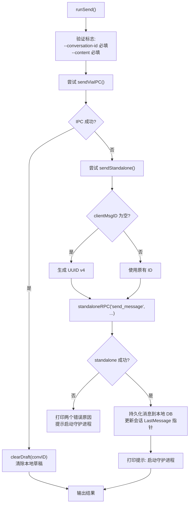

### 边缘场景

| 场景 | 行为 |
|------|------|
| clientMsgID 为空 | IPC 路径：`XyncraClient` 自动生成 UUID v4；standalone 路径：显式生成 |
| content 为空字符串 | 允许（`--content` 必须通过 `--content` 显式提供，`--content ""` 合法；未提供则 `cmd.Flags().Changed("content")` 返回 false 并报错） |
| reply_to 为 0 | 不设置回复上下文 |
| 消息持久化成功但 UpdateLastMessage 失败 | 警告输出到 stderr（`ErrNotFound` 被静默忽略），不影响发送结果 |
| 消息持久化时 `ErrDuplicateKey` | 静默忽略（幂等语义，消息已存在） |
| clearDraft 失败 | 警告输出到 stderr，不影响发送结果（best-effort） |
| 重复消息（基于 client_message_id 幂等） | `SendMessageResult.Duplicate` 为 true，输出到 stdout |

---

## 5. 会话管理

会话的 CRUD 操作：创建、删除、恢复、列表、详情。变更操作采用 IPC 优先 + standalone 降级；查询操作直接读取本地 DB。

### 流程图

```mermaid
flowchart TD
    subgraph 创建会话
        CA["create-conversation"] --> CB["IPC 调用 create_conversation<br>参数: user_id2, title"]
        CB --> CC{"IPC 成功?"}
        CC -->|是| CD["Upsert 到本地 DB"]
        CC -->|否| CE["standaloneRPC 降级"]
        CE --> CF["Upsert 到本地 DB"]
        CD --> CG{"会话已存在?"}
        CF --> CG
        CG -->|是| CH["返回 Duplicate=true<br>(find-or-create 语义)"]
        CG -->|否| CI["返回新建会话"]
    end

    subgraph 删除会话
        DA["delete-conversation"] --> DB["IPC 调用 delete_conversation"]
        DB --> DC{"IPC 成功?"}
        DC -->|是| DD["级联软删除本地 DB"]
        DC -->|否| DE["standaloneRPC 降级"]
        DE --> DF["级联软删除本地 DB"]
    end

    subgraph 恢复会话
        EA["restore-conversation"] --> EB["IPC 调用 restore_conversation"]
        EB --> EC{"IPC 成功?"}
        EC -->|是| ED["级联恢复本地 DB"]
        EC -->|否| EE["standaloneRPC 降级"]
        ED --> EF{"本地 Restore() 返回 ErrNotFound?"}
        EF -->|是| EG["直接 xc.Call('get_conversation')<br>从服务器获取并 upsert"]
        EF -->|否| EH["正常恢复"]
    end

    subgraph 列出会话
        FA["list-conversations"] --> FB["读取本地 SQLite<br>GetByUser(offset, limit+1)"]
        FB --> FC{"有数据?"}
        FC -->|否| FD["提示: 无会话,<br>请先运行 listen 同步"]
        FC -->|是| FE["tabwriter 格式化输出<br>limit+1 检测 hasMore"]
    end

    subgraph 会话详情
        GA["get-conversation"] --> GB["读取本地 SQLite<br>Get(convID)"]
        GB --> GC["计算未读数<br>CountUnread(convID, readCursor)"]
        GC --> GD{"会话存在?"}
        GD -->|否| GE["返回 store.ErrNotFound<br>用户友好提示"]
        GD -->|是| GF["输出会话详情"]
    end
```

### 边缘场景

| 场景 | 行为 |
|------|------|
| 列出会话时无同步数据 | 输出 `'No conversations found. Run xyncra-client listen first to sync data.'` |
| create-conversation 使用 `--peer-id` 而非 `--user-id` | 避免与全局 `--user-id` 标志冲突。IPC 路径发送 `user_id2`，standalone 路径发送 `user_id`（两种参数名服务器均接受） |
| standalone 模式下恢复会话且本地记录缺失 | 仅记录警告；下次守护进程同步后会话会出现 |
| get-conversation 查询已删除会话 | `store.ErrNotFound` 返回用户友好错误 |
| 分页 | `--offset` 和 `--limit` 标志，使用 `limit+1` 技巧检测 hasMore |

---

## 6. 消息管理

消息操作：删除、标记已读、列表、搜索。变更操作采用 IPC 优先 + standalone 降级；查询操作直接读取本地 DB。

### 流程图

```mermaid
flowchart TD
    subgraph 删除消息
        DA["delete-message"] --> DB["IPC 调用 delete_message<br>参数: message UUID"]
        DB --> DC{"IPC 成功?"}
        DC -->|是| DD["IPC handler 软删除本地 DB"]
        DC -->|否| DE["standaloneRPC 降级<br>同步本地 DB"]
    end

    subgraph 标记已读
        MA["mark-as-read"] --> MB{"--message-id == 0?"}
        MB -->|是| MC["从本地 DB 解析<br>LastProcessedMessageID"]
        MB -->|否| MD["使用指定 message-id"]
        MC --> ME["IPC 调用 mark_as_read"]
        MD --> ME
        ME --> MF{"IPC 成功?"}
        MF -->|是| MG["使用服务器返回的<br>last_read_message_id<br>(MAX 语义) 更新本地游标"]
        MF -->|否| MH["standaloneRPC 降级"]
        MH --> MI{"standalone 成功?"}
        MI -->|是| MJ["返回服务器确认的游标 ID 给用户<br>不更新本地 DB 读游标<br>(下次守护进程同步时更新)"]
        MI -->|否| MK["返回错误"]
    end

    subgraph 获取消息
        GA["get-messages"] --> GB["读取本地 SQLite<br>ListByConversation(afterMsgID, limit+1)"]
        GB --> GC["输出格式:<br>[#MessageID] SenderID (HH:MM): Content"]
    end

    subgraph 搜索消息
        SA["search-messages"] --> SB["读取本地 SQLite<br>SearchByConversation(query, afterMsgID, limit+1)"]
        SB --> SC["结果按 DESC 排序<br>(最新优先)"]
    end
```

### 边缘场景

| 场景 | 行为 |
|------|------|
| delete-message 使用不存在的 message UUID | 服务器返回错误，通过 IPC 错误转发 |
| mark-as-read 使用 `--message-id 0` 但会话不在本地 DB | 返回 `'conversation not found in local database; run xyncra-client listen first'` |
| get-messages 使用 `--limit <= 0` | 返回验证错误 |
| search-messages 返回 DESC 排序 | 分页游标 `--after-message-id` 表示"显示序列号小于此值的消息" |
| mark-as-read standalone 模式 | 不更新本地 DB 中的读游标；但从服务器响应中解析 `last_read_message_id` 返回给用户显示；下次守护进程同步时更新本地游标 |

---

## 7. 草稿管理

本地独占的草稿操作（保存、获取、删除），由 SQLite 支持，不与服务器交互。

### 流程图

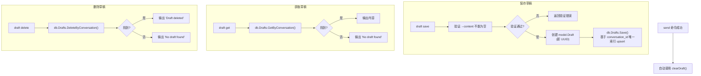

### 边缘场景

| 场景 | 行为 |
|------|------|
| draft save 使用空 `--content` | 返回验证错误（标志必填，空字符串不允许） |
| draft get 查询不存在的草稿 | `store.ErrNotFound`，输出 `'No draft found for this conversation.'` |
| draft delete 删除不存在的草稿 | 同 get 的处理方式 |
| save 重复保存同一会话 | upsert 语义：覆盖已有草稿 |

---

## 8. 终止守护进程 (kill)

`kill` 子命令通过读取锁文件、发送信号、等待退出并清理文件来终止运行中的 listen 守护进程。

### 流程图

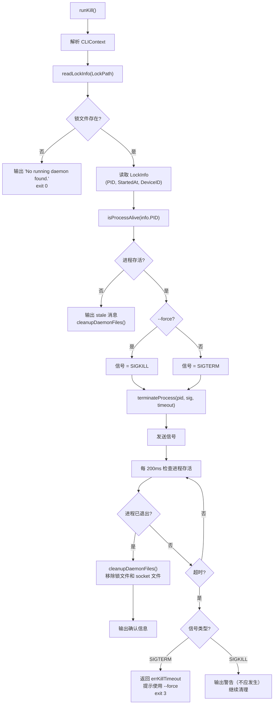

### 边缘场景

| 场景 | 行为 |
|------|------|
| 无守护进程运行（无锁文件） | exit 0，不视为错误 |
| Stale lock（进程已死） | 自动清理，不发送信号 |
| `--force` 与 `--timeout` | 发送 SIGKILL；超时仍适用轮询检查 |
| SIGTERM 超时 | exit code 3，提示使用 `--force` |
| `osFindProcess` 和 `osSignalProcess` | 包级变量，支持测试替换 |
| `cleanupDaemonFiles` 失败 | 静默忽略 `os.Remove` 错误 |

---

## 9. 进程锁管理

使用 flock 实现进程级独占锁，防止多个守护进程实例。锁文件包含 JSON 元数据（PID、started_at、device_id）。

### 流程图

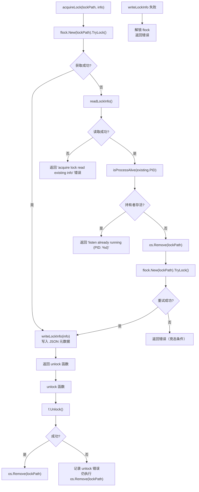

### 边缘场景

| 场景 | 行为 |
|------|------|
| 锁文件存在但 JSON 损坏 | `readLockInfo` 返回 unmarshal 错误，传播为 `'acquire lock read existing info'` |
| 锁文件移除竞态 | 另一个进程在 stale 检测和重试之间获取锁，重试 `TryLock` 失败 |
| PID 复用 | 理论上可能，但 flock 保护：新进程不会持有 flock |
| `writeLockInfo` 在获取 flock 后失败 | 解锁 flock 并返回错误 |
| unlock 函数 | 先尝试 `Unlock()` 再尝试 `Remove()`；两者都尝试执行。`Unlock()` 失败时函数提前返回错误（此时 `Remove()` 仍执行但其错误被忽略）。`Remove()` 返回 `ErrNotExist` 时视为正常 |

---

## 10. 日志管理

五个子命令用于查看和管理客户端本地 RPC 和通知日志，存储在 SQLite 中。

### 流程图

```mermaid
flowchart TD
    subgraph logs tail
        TA["logs tail"] --> TB["解析 --since (默认 1h)<br>--limit (默认 50)"]
        TB --> TC{"--type?"}
        TC -->|rpc| TD["db.RPCLogs.List()"]
        TC -->|notifications| TE["db.NotificationLogs.List()"]
        TD --> TF["输出日志"]
        TE --> TF
    end

    subgraph logs search
        SA["logs search"] --> SB["扩展过滤:<br>--method, --error,<br>--from/--to,<br>--conversation-id,<br>--request-id"]
        SB --> SC["db 查询<br>--limit (默认 100)"]
    end

    subgraph logs stats
        STA["logs stats"] --> STB["db.RPCLogs.Aggregate()<br>或 AggregateByInterval()"]
        STB --> STC["--since (默认 24h)<br>--interval (1m/5m/15m/1h/1d)"]
    end

    subgraph logs export
        EA["logs export"] --> EB{"格式?"}
        EB -->|csv| EC["ExportCSV()"]
        EB -->|json| ED["ExportJSON()"]
        EC --> EE["--output (默认 stdout)<br>--limit (上限 10000)"]
        ED --> EE
    end

    subgraph logs cleanup
        CA["logs cleanup"] --> CB["--retain (默认 168h/7d)<br>--type (rpc/notifications/all)"]
        CB --> CC{"--dry-run?"}
        CC -->|是| CD["CountBefore() 输出预览"]
        CC -->|否| CE["CleanupOlderThan()<br>CleanupBefore()"]
    end
```

### 时间解析规则

`parseTimeArg` 的解析顺序：
1. 尝试 Go duration 格式（如 `1h`、`30m`）
2. 尝试 `{n}d` 天格式（如 `7d`）
3. 尝试 RFC3339 绝对时间
4. 均不匹配则返回错误

### 边缘场景

| 场景 | 行为 |
|------|------|
| `--limit <= 0` | tail 和 search 返回验证错误 |
| Export `--limit > 10000` 或 `<= 0` | 静默重置为默认值 1000 |
| Export `--output ''` 或 `'-'` | 写入 stdout |
| listen 模式下自动清理 | 每 1 小时运行，删除 7 天前的日志，在事务中执行。失败仅记录日志，不终止守护进程 |

---

## 11. 同步更新 (sync_updates)

IPC 专属命令，触发守护进程执行 FullSync。无 standalone 降级，因为第二个 WebSocket 会与守护进程的 syncManager 竞争 SQLite 写入。

### 流程图

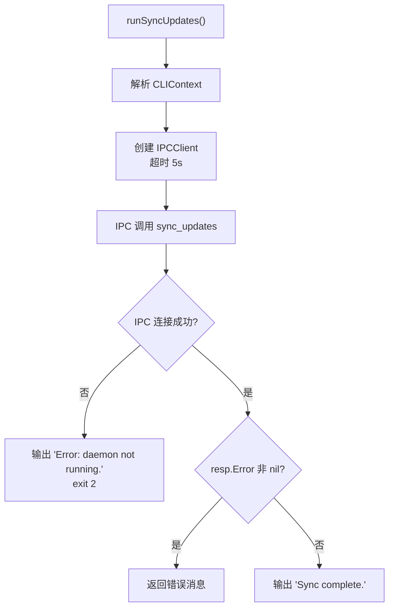

### 边缘场景

| 场景 | 行为 |
|------|------|
| 守护进程未运行 | exit code 2（前置条件不满足） |
| IPC 调用超时 | 外层 context 超时 30s，IPC 客户端超时 5s |
| 服务端同步错误 | 作为 IPC 错误消息转发 |

---

## 12. Agent 恢复 (agent_resume)

IPC 专属命令，用于在 HITL（Human-In-The-Loop）中断后恢复暂停的 Agent。守护进程将请求通过 WebSocket 转发到服务器。

### 流程图

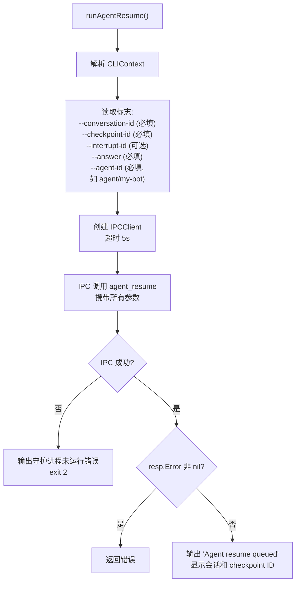

### 边缘场景

| 场景 | 行为 |
|------|------|
| `--interrupt-id` 可选 | 可为空 |
| 守护进程未运行 | exit code 2 |
| 服务端 agent resume 失败 | 作为 IPC 错误转发 |
| `--agent-id` 需匹配已注册的 agent ID | 验证在服务端进行（如 `agent/my-bot`） |

---

## 13. 设置输入状态 (set_typing)

IPC 专属命令，向指定会话发送 typing indicator。无 standalone 降级，因为 typing 是 fire-and-forget 广播，守护进程未运行时无接收方。

### 流程图

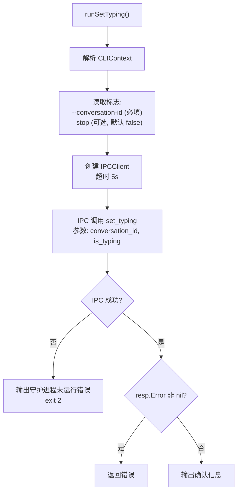

### 边缘场景

| 场景 | 行为 |
|------|------|
| 守护进程未运行 | exit code 2 |
| `--stop` | 发送 `is_typing: false` 清除指示器 |
| 服务端转发失败 | 作为 IPC 错误转发 |

---

## 14. 流式文本 (stream_text)

IPC 专属命令，向指定会话发送流式文本片段。无 standalone 降级，因为流式文本需要通过守护进程的 WebSocket 连接广播给其他客户端。

### 流程图

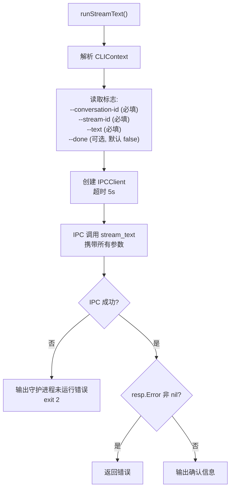

### 边缘场景

| 场景 | 行为 |
|------|------|
| 守护进程未运行 | exit code 2 |
| `--done` | 标记流结束 (`is_done: true`) |
| `--stream-id` 重复 | 服务端处理去重 |

---

## 15. 内置诊断函数

每个客户端设备暴露三个诊断函数，服务器可通过反向 RPC 调用。

### 流程图

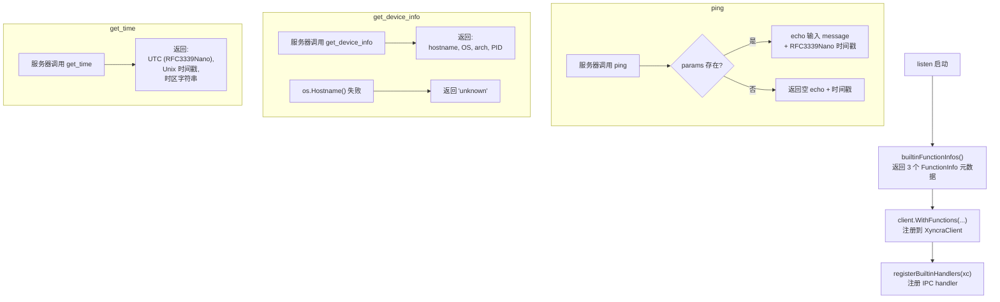

### 边缘场景

| 场景 | 行为 |
|------|------|
| ping 消息为空 | 返回空 echo 和时间戳 |
| ping 完全无 params | `len(req.Params) > 0` 检查防止 unmarshal 错误 |
| `os.Hostname()` 失败 | 返回 `'unknown'` |
| Handler marshal 错误 | 作为错误返回给服务器 |

---

## 16. 重载 Agent 配置 (reload_agents)

IPC 专属命令，触发守护进程从磁盘热重载 Agent 配置。

### 流程图

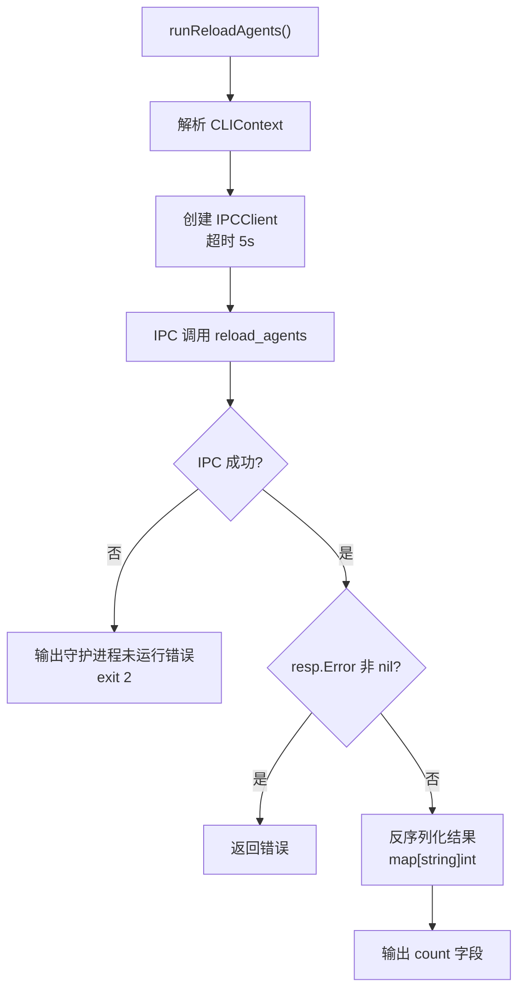

### 边缘场景

| 场景 | 行为 |
|------|------|
| 守护进程未运行 | exit code 2 |
| 服务端重载失败 | 作为 IPC 错误转发 |
| 结果反序列化失败 | 返回错误 |
| 未配置任何 Agent | `result["count"]` 为 0 |

---

## 附录：IPC 方法速查表

| 方法 | 类型 | 说明 | Standalone 降级 |
|------|------|------|----------------|
| `send_message` | 变更 | 发送消息 | 支持 |
| `create_conversation` | 变更 | 创建会话 | 支持 |
| `delete_conversation` | 变更 | 删除会话 | 支持 |
| `restore_conversation` | 变更 | 恢复会话 | 支持（功能受限） |
| `delete_message` | 变更 | 删除消息 | 支持 |
| `mark_as_read` | 变更 | 标记已读 | 支持（不更新本地游标） |
| `set_typing` | 守护进程专属 | 设置输入状态 | 不支持 |
| `stream_text` | 守护进程专属 | 流式文本 | 不支持 |
| `sync_updates` | 守护进程专属 | 触发 FullSync | 不支持 |
| `agent_resume` | 守护进程专属 | 恢复 Agent | 不支持 |
| `reload_agents` | 守护进程专属 | 热重载配置 | 不支持 |
