# CLI 操作 & 可观测性

> CLI 命令行工具的操作流程，以及日志、指标、链路追踪、性能分析的采集链路。

## 场景 1: CLI 应用入口与命令分发

### 主流程

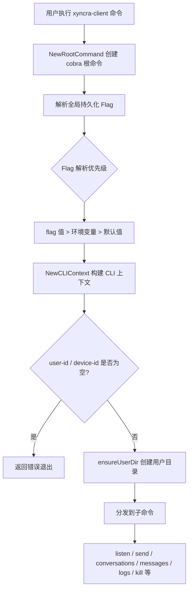

### 边缘场景

#### 1. 必需参数缺失

- 触发条件: user-id 或 device-id 未通过 flag 或环境变量提供
- 处理逻辑: resolveStringFlag 按 flag > env > default 优先级解析，若最终为空则返回 error
- 最终结果: 命令不执行，输出 "context: user-id is required" 错误信息

#### 2. 用户目录创建失败

- 触发条件: os.UserHomeDir() 失败或 os.MkdirAll 权限不足
- 处理逻辑: ensureUserDir 返回错误，包装为 "context: ensureUserDir: ..."
- 最终结果: 命令中止

### 涉及文件

- `internal/cli/app.go`: CLI 根命令定义、全局 Flag 声明、CLIContext 构建、子命令注册
- `internal/cli/paths.go`: 用户目录管理、路径计算

---

## 场景 2: 会话管理 (创建/删除/恢复/列表/详情)

### 主流程

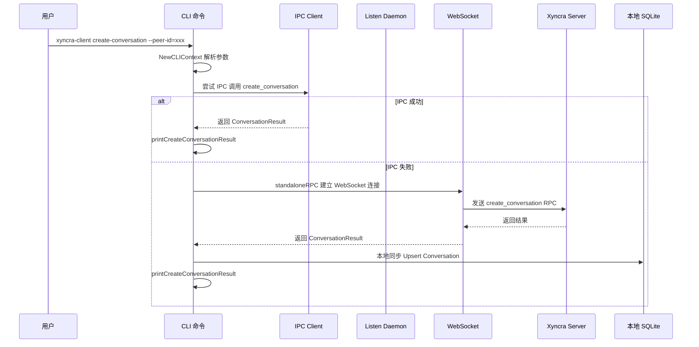

### 边缘场景

#### 1. 两种传输模式均失败

- 触发条件: IPC 连接失败（daemon 未运行）且 WebSocket 连接也失败
- 处理逻辑: 分别捕获 ipcErr 和 wsErr，输出双错误原因
- 最终结果: 输出 "Error: Cannot create conversation." + 两个 Cause + Hint

#### 2. Standalone 模式本地同步失败

- 触发条件: WebSocket RPC 成功但本地 SQLite 写入失败
- 处理逻辑: 输出 stderr warning 但不影响主流程
- 最终结果: 操作成功（服务端已持久化），本地 DB 稍有延迟

#### 3. list-conversations 本地无数据

- 触发条件: 本地 DB 中无会话记录（首次使用或未同步）
- 处理逻辑: 检测 convs 长度为 0
- 最终结果: 输出 "No conversations found. Run 'xyncra-client listen' first to sync data."

### 涉及文件

- `internal/cli/conversations.go`: 会话 CRUD 命令定义、IPC/standalone 双通道实现
- `internal/cli/listen.go`: registerIPCHandlers 中注册会话相关 IPC 处理器

---

## 场景 3: 消息发送

### 主流程

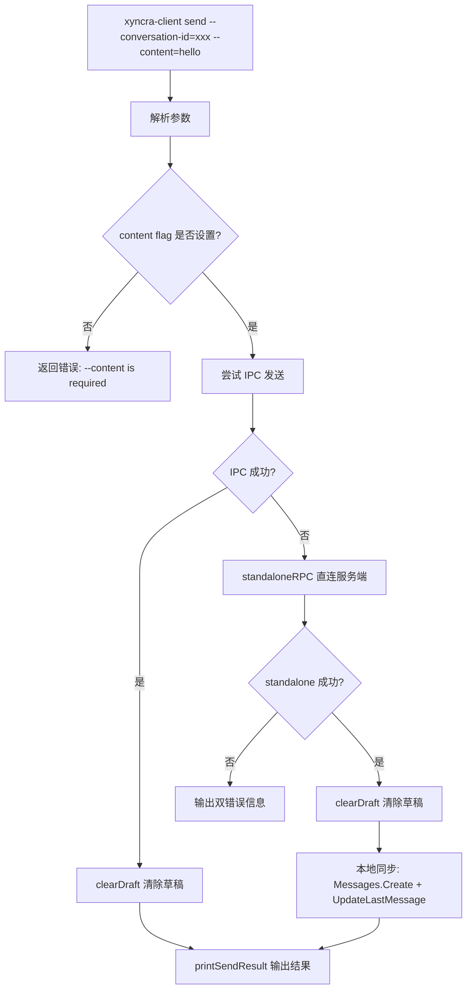

### 边缘场景

#### 1. clientMsgID 幂等性

- 触发条件: 相同 clientMsgID 重复发送
- 处理逻辑: 服务端检测 Duplicate，返回 Duplicate=true
- 最终结果: 消息不会重复创建，CLI 输出 "Duplicate: true"

#### 2. 草稿清理失败

- 触发条件: send 成功但 clearDraft 操作失败
- 处理逻辑: clearDraft 仅输出 stderr warning，不影响发送结果
- 最终结果: 消息发送成功，草稿可能残留

### 涉及文件

- `internal/cli/send.go`: send 命令定义、IPC/standalone 双通道发送
- `internal/cli/listen.go`: registerIPCHandlers 中注册 send_message

---

## 场景 4: Listen Daemon 生命周期管理

### 主流程

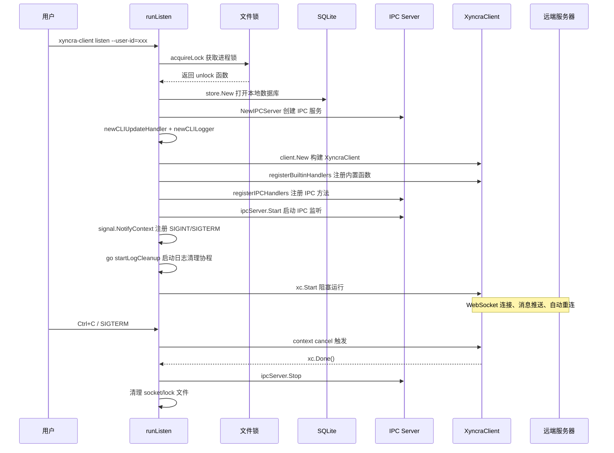

### 边缘场景

#### 1. 进程锁被占用 (活进程)

- 触发条件: 另一个 listen 进程正在运行
- 处理逻辑: acquireLock 检测到锁持有者 PID 存活
- 最终结果: 输出 "listen already running (PID: xxx)"，exit code 2

#### 2. 进程锁陈旧 (死进程)

- 触发条件: 锁文件存在但持有进程已死
- 处理逻辑: isProcessAlive 返回 false，删除陈旧锁文件后重试
- 最终结果: 成功获取锁，继续启动

#### 3. 设备替换退出 (4001)

- 触发条件: 同一 user/device 被另一客户端替换
- 处理逻辑: XyncraClient 内部检测到 4001，主动 Stop()，xc.Done() channel 关闭
- 最终结果: cancel() 触发，defer 链清理 socket/lock，进程正常退出

#### 4. 自动日志清理

- 触发条件: 每 1 小时 tick
- 处理逻辑: runCleanup 在事务中删除 7 天前的 RPCLog 和 NotificationLog
- 最终结果: 清理失败仅记录日志，不终止 daemon

### 涉及文件

- `internal/cli/listen.go`: runListen 主流程、cliUpdateHandler 事件处理
- `internal/cli/lock.go`: acquireLock/readLockInfo/writeLockInfo/isProcessAlive
- `internal/cli/ipc.go`: IPCServer 生命周期

---

## 场景 5: IPC 进程间通信

### 主流程

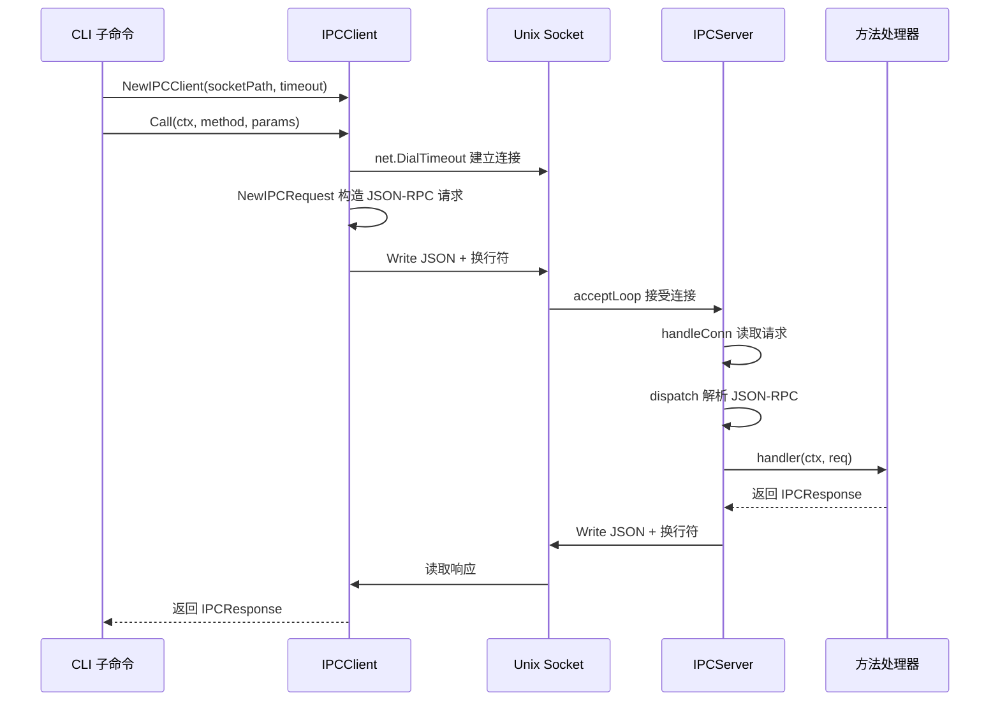

### 边缘场景

#### 1. 连接超时

- 触发条件: net.DialTimeout 超过 5 秒
- 处理逻辑: 返回 "ipc client dial: ..." 错误
- 最终结果: CLI 命令回退到 standalone 模式或报错

#### 2. JSON-RPC 协议错误

- 触发条件: 请求 JSON 解析失败或版本不是 "2.0"
- 处理逻辑: dispatch 返回 Parse error (-32700) 或 Invalid Request (-32600)
- 最终结果: 客户端收到错误响应

#### 3. 方法不存在

- 触发条件: 请求的 method 未注册
- 处理逻辑: dispatch 返回 Method not found (-32601)
- 最终结果: 客户端收到 -32601 错误码

#### 4. Socket 文件残留

- 触发条件: 上次异常退出未清理 socket 文件
- 处理逻辑: IPCServer.Start 先 os.Remove 旧 socket
- 最终结果: 创建新 socket，chmod 0600

### 涉及文件

- `internal/cli/ipc.go`: IPCRequest/IPCResponse/IPCError、IPCServer、IPCClient

---

## 场景 6: 终止 Daemon 进程 (kill)

### 主流程

```mermaid
flowchart TD
    A[xyncra-client kill] --> B[读取 LockPath 锁文件]
    B --> C{锁文件存在?}
    C -->|否| D[输出 "No running daemon found." 退出]
    C -->|是| E[readLockInfo 解析 PID]
    E --> F{进程存活?}
    F -->|否| G[清理残留文件]
    G --> H[退出]
    F -->|是| I{--force?}
    I -->|否| J[发送 SIGTERM]
    I -->|是| K[发送 SIGKILL]
    J --> L[轮询等待进程退出]
    L --> M{超时?}
    M -->|否| N[清理文件]
    M -->|是| O[输出超时错误, exit 3]
    K --> N
    N --> P[输出 "Daemon terminated"]
```

### 边缘场景

#### 1. 进程已停止

- 触发条件: 锁文件不存在
- 处理逻辑: 输出信息并以 exit 0 退出（非错误）
- 最终结果: 静默退出

#### 2. 陈旧锁文件

- 触发条件: 锁文件存在但进程已死
- 处理逻辑: isProcessAlive 返回 false，执行 cleanupDaemonFiles
- 最终结果: 清理 lock 和 socket 文件

#### 3. SIGTERM 超时

- 触发条件: 进程未在 timeout（默认 5 秒）内退出
- 处理逻辑: 返回 errKillTimeout
- 最终结果: 输出提示 "Use --force to force kill"，exit code 3

### 涉及文件

- `internal/cli/kill.go`: kill 命令定义、terminateProcess
- `internal/cli/lock.go`: readLockInfo/cleanupDaemonFiles

---

## 场景 7: Standalone RPC 回退机制

### 主流程

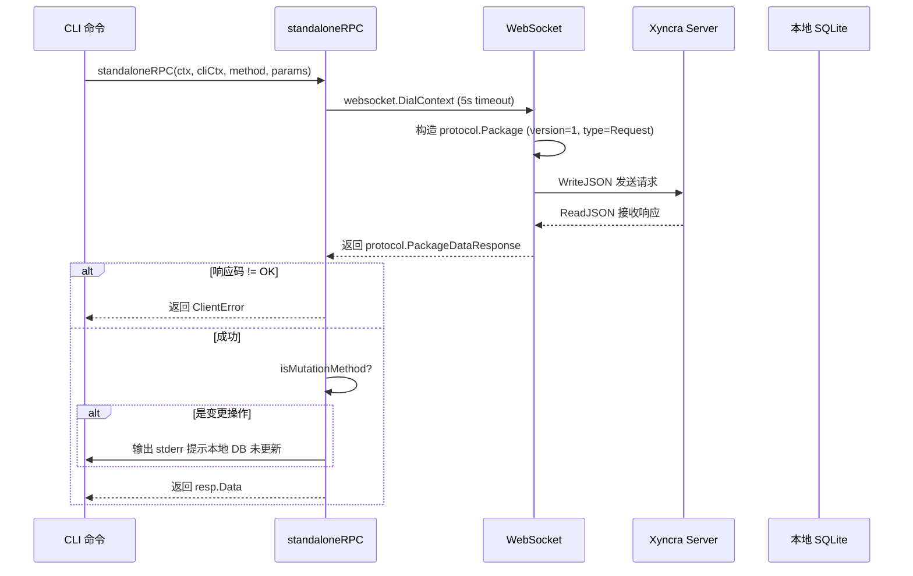

### 边缘场景

#### 1. WebSocket 连接超时

- 触发条件: 服务端不可达（5 秒 dial 超时）
- 处理逻辑: 返回连接错误
- 最终结果: CLI 命令失败

#### 2. 变更操作提示

- 触发条件: isMutationMethod 返回 true
- 处理逻辑: 输出提示本地 DB 未更新
- 最终结果: 建议用户运行 listen 同步

### 涉及文件

- `internal/cli/rpc_helper.go`: standaloneRPC 实现、isMutationMethod 判断

---

## 场景 8: 消息操作 (删除/标记已读/查询/搜索)

### 主流程

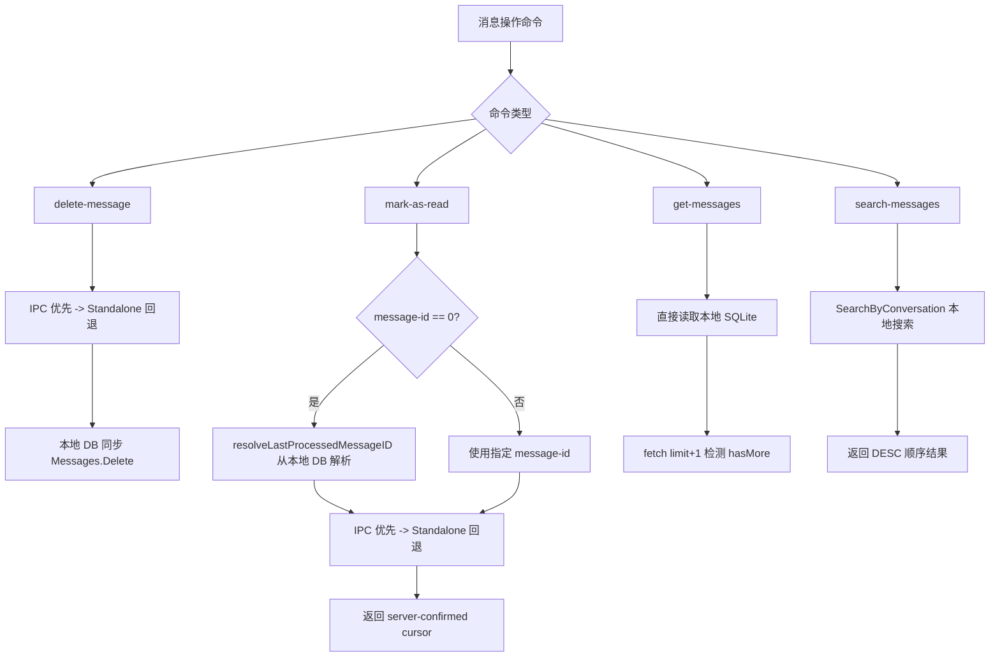

### 边缘场景

#### 1. mark-as-read message-id=0 全部标记

- 触发条件: 用户不指定 message-id（默认 0）
- 处理逻辑: 从本地 DB 读取 LastProcessedMessageID 作为游标值
- 最终结果: 服务端使用 MAX 语义更新 read cursor

#### 2. get-messages 本地无数据

- 触发条件: 本地 DB 无消息记录
- 处理逻辑: 输出 "No messages found."
- 最终结果: 提示用户先运行 listen 同步

### 涉及文件

- `internal/cli/messages.go`: delete-message/mark-as-read/get-messages/search-messages 命令定义

---

## 场景 9: 日志初始化与配置

### 主流程

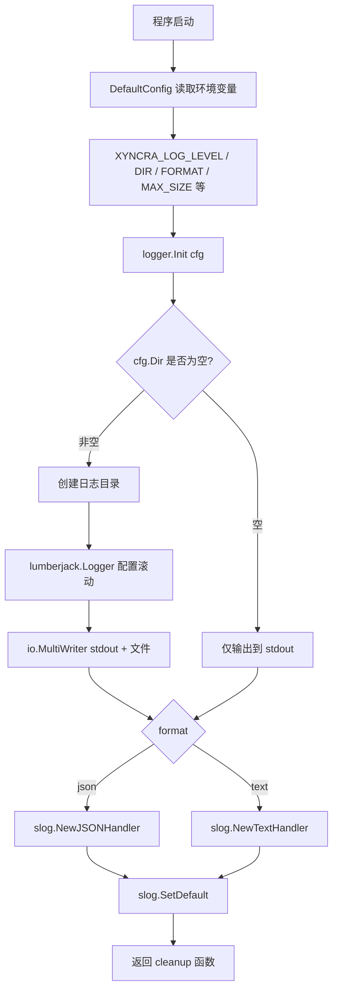

### 边缘场景

#### 1. 日志目录创建失败

- 触发条件: os.MkdirAll 权限不足
- 处理逻辑: 返回 "logger: create log dir: ..." 错误
- 最终结果: 程序启动失败

#### 2. 无效日志级别

- 触发条件: XYNCRA_LOG_LEVEL 设为不识别的值
- 处理逻辑: parseLevel 默认回退到 slog.LevelInfo
- 最终结果: 使用 INFO 级别

#### 3. 日志滚动配置

- 触发条件: 文件达到 MaxSizeMB（默认 100MB）
- 处理逻辑: lumberjack 自动滚动，保留 MaxBackups（默认 10）个，MaxAge（默认 30 天）
- 最终结果: 旧日志自动清理

### 涉及文件

- `internal/logger/logger.go`: Init 函数、parseLevel、lumberjack 配置
- `internal/logger/config.go`: DefaultConfig 从环境变量加载配置
- `internal/logger/slog_adapter.go`: SlogLogger 适配器
- `internal/logger/context.go`: FromContext/WithContext 日志上下文传播
- `internal/logger/fields.go`: 标准字段定义

---

## 场景 10: Prometheus 指标采集

### 主流程

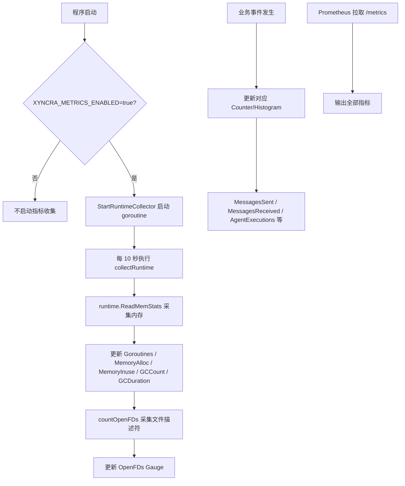

### 边缘场景

#### 1. 非 Linux 平台 FD 计数

- 触发条件: macOS/Windows 无 /proc/self/fd
- 处理逻辑: countOpenFDs 返回 -1，不更新 OpenFDs
- 最终结果: 指标缺失但不影响运行

### 涉及文件

- `internal/metrics/metrics.go`: 32 个 Prometheus 指标定义
- `internal/metrics/runtime.go`: StartRuntimeCollector 运行时指标采集
- `internal/metrics/config.go`: Config 与 DefaultConfig

---

## 场景 11: OpenTelemetry 链路追踪初始化与采样

### 主流程

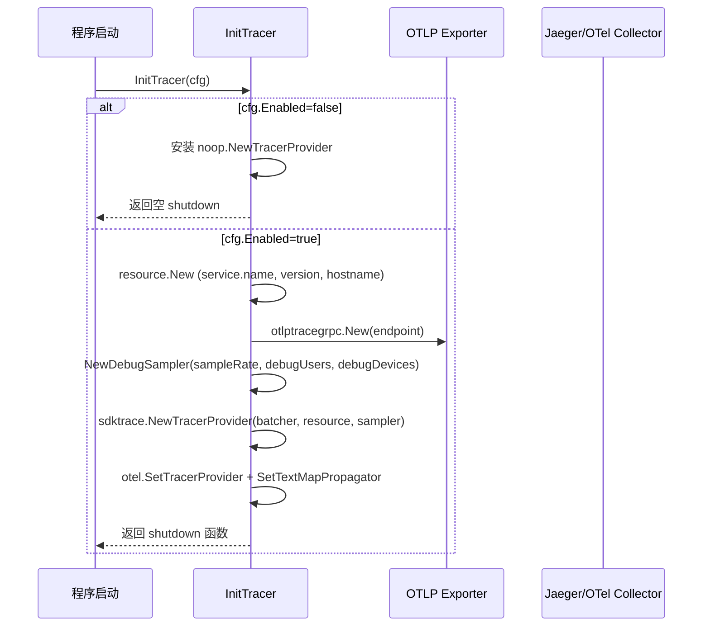

### 边缘场景

#### 1. 调试用户强制采样

- 触发条件: 请求来自 DebugUsers/DebugDevices 列表中的用户/设备
- 处理逻辑: DebugSampler.ShouldSample 检查 context 中的 debugContextKey，命中则 RecordAndSample
- 最终结果: 该用户的完整链路被采集

#### 2. 父 Span 已采样

- 触发条件: 非调试用户，但父 Span 已被采样（IsValid && IsSampled）
- 处理逻辑: 尊重父 Span 的采样决策，直接 RecordAndSample
- 最终结果: 保持 trace 完整性

#### 3. 比率采样回退

- 触发条件: 非调试用户，无父 Span 或父 Span 未采样
- 处理逻辑: 委托给 TraceIDRatioBased(sampleRate) 按比率采样
- 最终结果: 按配置比例采集

### 涉及文件

- `internal/tracing/tracing.go`: InitTracer 初始化
- `internal/tracing/config.go`: TracingConfig 与 DefaultTracingConfig
- `internal/tracing/middleware.go`: DebugSampler 采样策略

---

## 场景 12: LLM 可观测性 - JSONL 日志

### 主流程

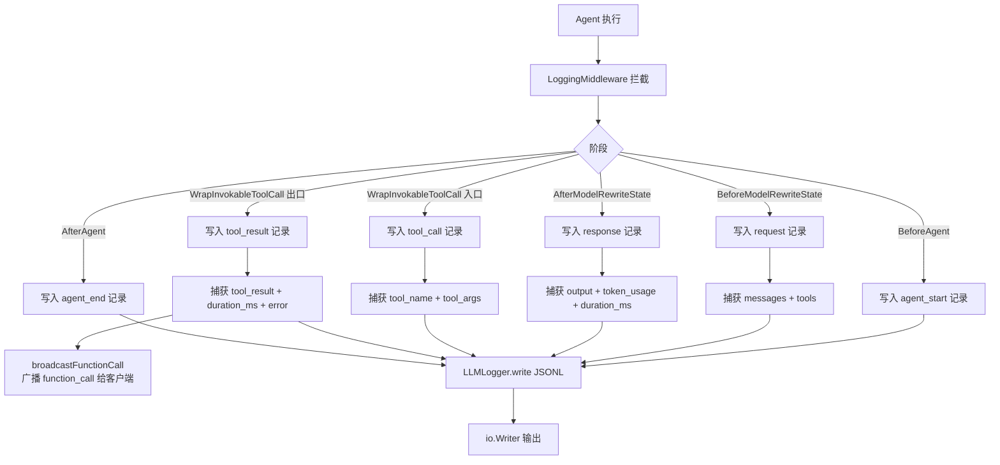

### 边缘场景

#### 1. 内容截断

- 触发条件: 消息内容超过 4096 字符或工具参数超过 2048 字符
- 处理逻辑: truncate 函数截断并附加 "...[truncated]"
- 最终结果: 日志记录保持可管理大小

#### 2. 并发安全

- 触发条件: 多个 Agent 并发执行
- 处理逻辑: LLMLogger 内部 sync.Mutex 序列化写入
- 最终结果: JSONL 输出不交错

#### 3. Function Call 广播

- 触发条件: WrapInvokableToolCall 执行时上下文包含 broadcast 元数据
- 处理逻辑: 读取 context 中的 BroadcastHelper，发送 function_call ephemeral update
- 最终结果: 客户端实时看到函数调用进度（fire-and-forget，错误不传播）

### 涉及文件

- `internal/agent/llm_logger.go`: LLMLogger、LoggingMiddleware

---

## 场景 13: Agent 追踪中间件 (OpenTelemetry Spans)

### 主流程

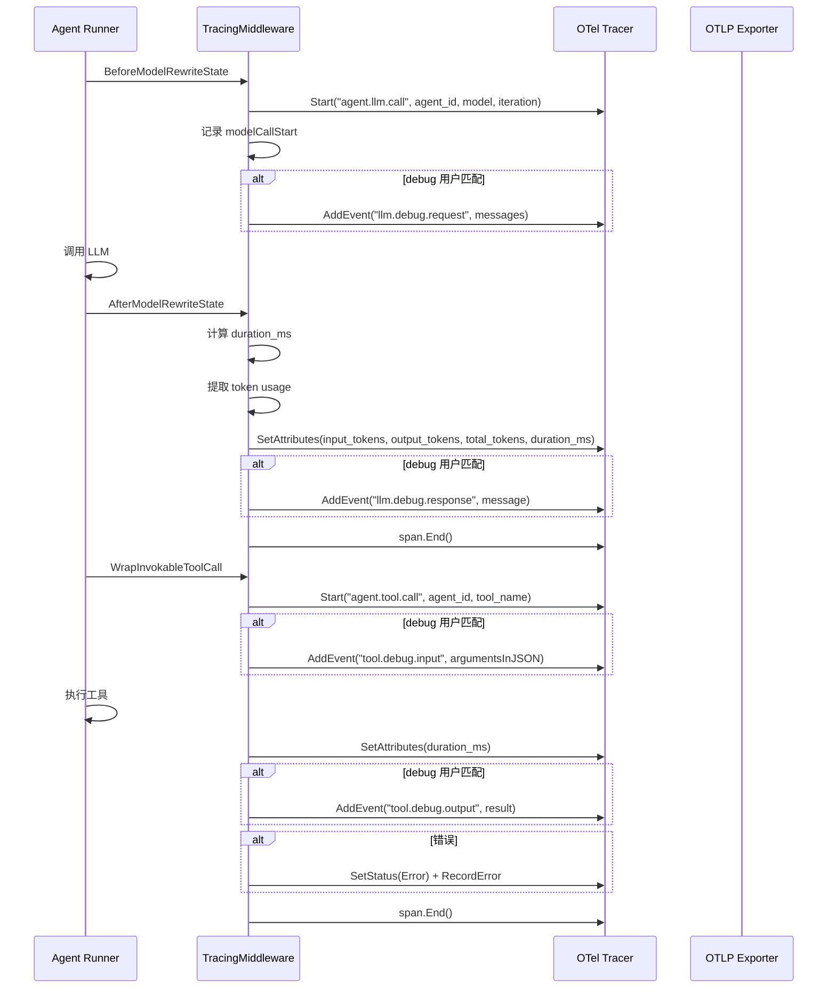

### 边缘场景

#### 1. Debug 内容捕获

- 触发条件: 调用者 user_id/device_id 匹配 debugUsers/debugDevices 配置
- 处理逻辑: 完整的请求/响应消息和工具输入/输出作为 span event 记录
- 最终结果: 可在 Jaeger 等工具中查看完整 LLM 交互内容

#### 2. LLM 调用失败

- 触发条件: 工具执行返回 error
- 处理逻辑: span.SetStatus(codes.Error) + span.RecordError(err)
- 最终结果: 在追踪系统中标记为错误 Span

### 涉及文件

- `internal/agent/tracing_middleware.go`: TracingMiddleware

---

## 场景 14: 性能分析 - Pprof 服务

### 主流程

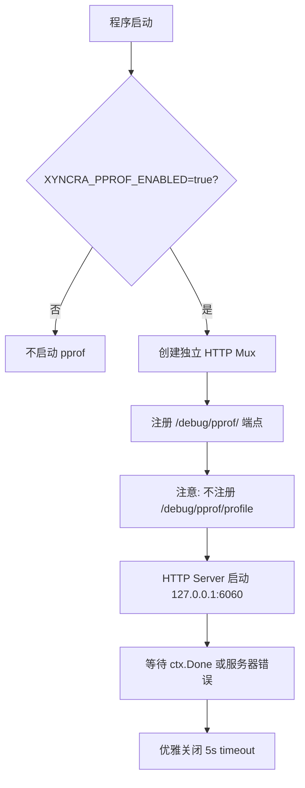

### 边缘场景

#### 1. CPU Profiler 冲突

- 触发条件: Pyroscope 同时启用
- 处理逻辑: 故意不注册 /debug/pprof/profile 端点
- 最终结果: 避免 "cpu profiling already in use" 错误

#### 2. 安全绑定

- 触发条件: 默认地址 127.0.0.1:6060
- 处理逻辑: 仅监听 localhost，不暴露到网络
- 最终结果: 防止敏感 profiling 数据泄露

### 涉及文件

- `internal/profiling/pprof.go`: PprofConfig/StartPprof

---

## 场景 15: 性能分析 - Pyroscope 持续剖析

### 主流程

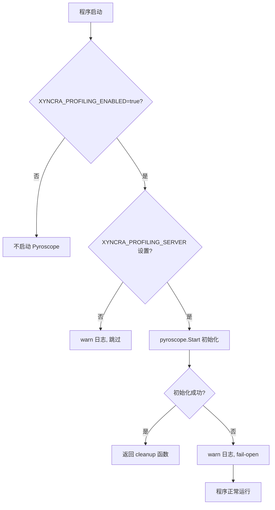

### 边缘场景

#### 1. 服务端不可达

- 触发条件: Pyroscope server 连接失败
- 处理逻辑: fail-open 策略：记录 warning 并继续
- 最终结果: 程序正常运行，无 profiling 数据

### 涉及文件

- `internal/profiling/pyroscope.go`: PyroscopeConfig/StartPyroscope
