# CLI 操作 & 可观测性

> CLI 命令行工具的操作流程，以及日志、指标、链路追踪、性能分析的采集链路。
>
> CLI 子命令的详细 IPC/standalone 双通道机制、IPC 协议细节、进程锁、日志管理、草稿管理等请参阅 [CLI 与 IPC 通信](cli-ipc.md)。
> 客户端日志清理（RPCLog/NotificationLog）的详细流程请参阅 [后台清理](background-cleanup.md#客户端日志清理)。

## 场景 1: CLI 应用入口与命令分发

### 主流程

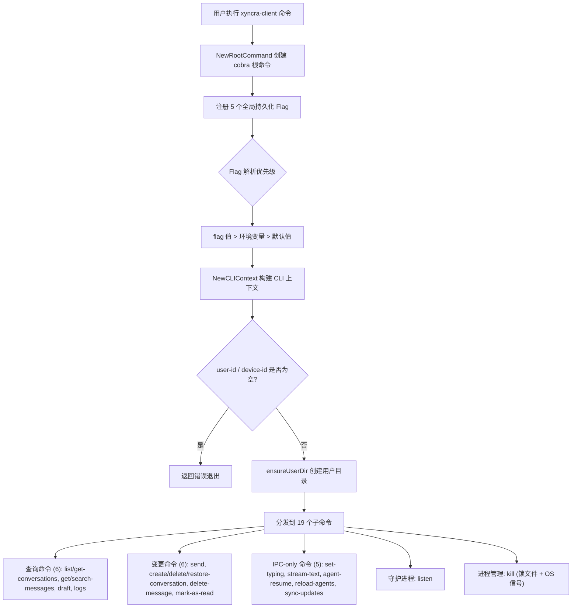

### 全局 Flag 与环境变量

| Flag | 环境变量 | 默认值 | 说明 |
|------|----------|--------|------|
| `--user-id` / `-u` | `XYNCRA_USER_ID` | 无（必填） | 用户 ID |
| `--device-id` | `XYNCRA_DEVICE_ID` | 无（必填） | 设备 ID |
| `--server` / `-s` | `XYNCRA_SERVER` | `ws://localhost:8080/ws` | 服务端 WebSocket URL |
| `--db-path` | `XYNCRA_DB_PATH` | `$USER_DIR/xyncra.db` | 本地 SQLite 数据库路径 |
| `--log-dir` | `XYNCRA_LOG_DIR` | `$USER_DIR/logs/` | 日志目录 |

其中 `USER_DIR` = `~/.xyncra/{user_id}/{device_id}/`。

### 边缘场景

#### 1. 必需参数缺失

- 触发条件: user-id 或 device-id 未通过 flag 或环境变量提供
- 处理逻辑: resolveStringFlag 按 flag > env > default 优先级解析，若最终为空则返回 error
- 最终结果: user-id 缺失时输出 "context: user-id is required (set via --user-id flag or XYNCRA_USER_ID env var)"，device-id 缺失时类似

#### 2. 用户目录创建失败

- 触发条件: os.UserHomeDir() 失败或 os.MkdirAll 权限不足
- 处理逻辑: ensureUserDir 返回错误，包装为 "context: ensureUserDir: ..."
- 最终结果: 命令中止

### 涉及文件

- `internal/cli/app.go`: CLI 根命令定义、全局 Flag 声明、CLIContext 构建、子命令注册
- `internal/cli/paths.go`: 用户目录管理、路径计算、defaultDeviceID（测试辅助）

---

## 场景 2: 会话管理 (创建/删除/恢复/列表/详情)

> 详细流程参阅 [CLI 与 IPC 通信 - 会话管理](cli-ipc.md#5-会话管理)。

### 概览

所有变更操作（create/delete/restore）采用 **IPC 优先 -> standalone WebSocket 降级** 的双通道模式。查询操作（list/get）直接读取本地 SQLite。

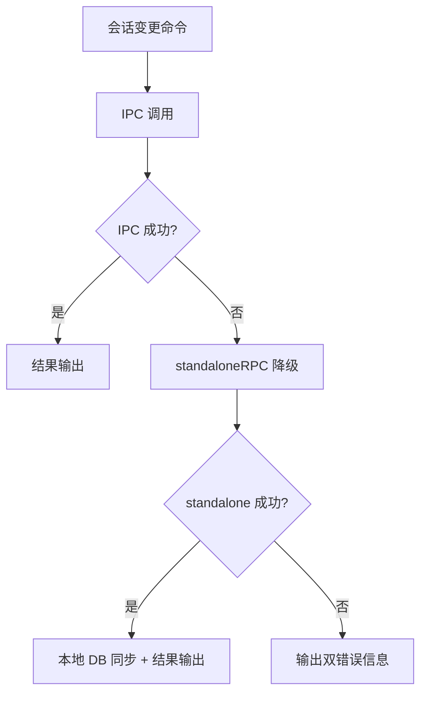

### 边缘场景

| 场景 | 行为 |
|------|------|
| IPC 和 standalone 均失败 | 输出两个错误原因 + Hint: 启动 daemon |
| standalone 模式本地同步失败 | stderr warning，不影响主流程 |
| list-conversations 本地无数据 | 输出 "No conversations found. Run 'xyncra-client listen' first to sync data." |
| restore 本地记录缺失（IPC handler） | 降级为 `xc.Call('get_conversation')` 从服务器获取并 upsert |
| get-conversation 会话不存在 | 返回用户友好错误 |

### 涉及文件

- `internal/cli/conversations.go`: 会话 CRUD 命令定义、IPC/standalone 双通道实现
- `internal/cli/listen.go`: registerIPCHandlers 中注册会话相关 IPC 处理器

---

## 场景 3: 消息发送

> 详细流程参阅 [CLI 与 IPC 通信 - 发送消息](cli-ipc.md#4-发送消息-send)。

### 概览

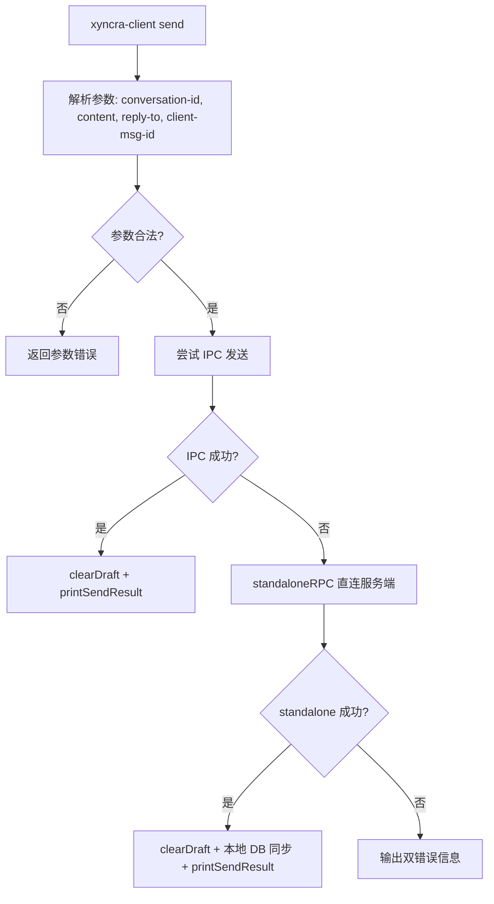

### 关键参数

- `--conversation-id` / `-c`: 必填，会话 ID
- `--content` / `-m`: 必填（必须显式提供，但允许空字符串），消息内容
- `--reply-to`: 可选，回复目标消息 ID
- `--client-msg-id`: 可选，客户端消息 ID（幂等键），为空时自动生成 UUID v4

### 边缘场景

| 场景 | 行为 |
|------|------|
| content 未显式提供 | 返回 "send: --content is required"（即使空字符串也需要显式 `--content=""`） |
| 重复 clientMsgID | 服务端检测 Duplicate，返回 Duplicate=true |
| 草稿清理失败 | stderr warning，不影响发送结果 |
| standalone 模式本地 DB 同步 | Messages.Create + UpdateLastMessage；失败仅 warning |
| 整体超时 | context 超时 15 秒 |

### 涉及文件

- `internal/cli/send.go`: send 命令定义、IPC/standalone 双通道发送、clearDraft
- `internal/cli/listen.go`: registerIPCHandlers 中注册 send_message

---

## 场景 4: Listen Daemon 生命周期管理

> 详细流程参阅 [CLI 与 IPC 通信 - 守护进程模式](cli-ipc.md#3-守护进程模式-listen)。

### 主流程

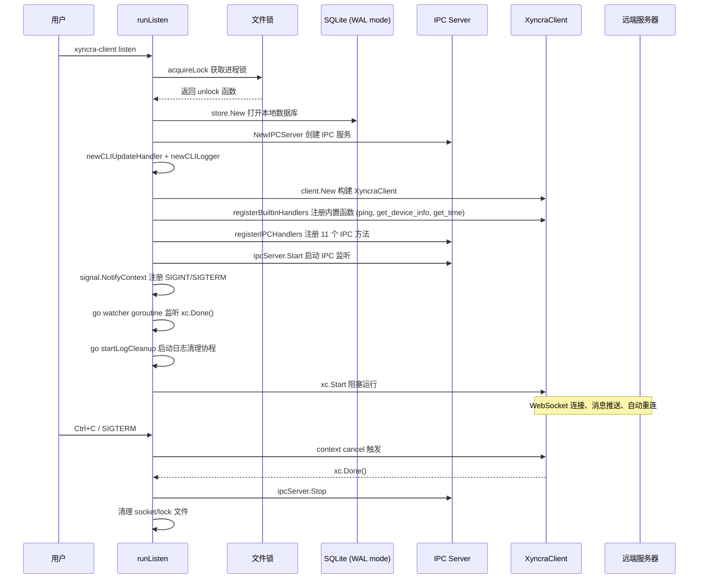

### Listen 命令可选 Flag

| Flag | 说明 |
|------|------|
| `--device-info` | JSON 格式的设备元数据，用于函数注册 (D-115) |

### 边缘场景

| 场景 | 行为 |
|------|------|
| 进程锁被占用 (活进程) | 输出 "listen already running (PID: xxx)"，exit code 2 |
| 进程锁陈旧 (死进程) | isProcessAlive 返回 false，删除陈旧锁文件后重试 |
| 设备替换退出 (4001) | XyncraClient 内部检测到 4001，主动 Stop()，xc.Done() channel 关闭，watcher goroutine 取消 signal context，进程正常退出 |
| parseDeviceInfo('') | 返回 nil |
| parseDeviceInfo('invalid') | 返回空 map（fail-open） |
| 测试环境变量 | XYNCRA_TEST_RECONNECT_BASE_DELAY / XYNCRA_TEST_RECONNECT_MAX_DELAY 可覆盖重连延迟 |
| 自动日志清理 | 每 1 小时 tick，runCleanup 在事务中删除 7 天前的 RPCLog 和 NotificationLog；失败仅记录日志 |

### cliUpdateHandler 事件处理

cliUpdateHandler 实现 `client.UpdateHandler` 接口，将服务端推送的事件格式化输出到 stdout:

| 方法 | 输出格式 | 说明 |
|------|----------|------|
| OnMessage | `[new message] seq=%d from=%s conv=%s "%s"` | 新消息或更新消息 |
| OnDeleteMessage | `[delete message] conv=%s msg=%s` | 消息删除事件 |
| OnMarkRead | `[mark read] conv=%s msg_id=%d` | 已读游标推进 |
| OnConversation | `[conversation] id=%s title="%s"` | 会话状态变更；当 AgentStatus 为 "asking_user" 时额外显示 HITL 待回答问题 (D-125) |
| OnGap | `[gap] seq=%d` | 序列号间隙通知 |
| OnTyping | `[typing/thinking] user=%s conv=%s started/stopped` | 输入指示器；isAgent=true 时显示 "thinking" (D-065) |
| OnStreaming | `[streaming/agent] user=%s conv=%s stream=%s status=%s text="%s"` | 流式文本事件；isAgent=true 时前缀为 "agent" (D-051) |
| OnAgentStatus | `[agent_status] agent=%s conv=%s status=%s` | Agent 状态变更 (D-087) |
| OnAgentTimeout | `[agent_timeout] agent=%s conv=%s reason="%s"` | Agent 超时事件 (D-087) |

### cliLogger 调试模式

cliLogger 输出结构化日志到 stderr。Debug 级别日志默认抑制，需设置 `XYNCRA_DEBUG=1` 或 `XYNCRA_DEBUG=true` 启用。

### 涉及文件

- `internal/cli/listen.go`: runListen 主流程、cliUpdateHandler 事件处理、registerIPCHandlers、startLogCleanup、runCleanup
- `internal/cli/lock.go`: acquireLock/readLockInfo/writeLockInfo/isProcessAlive
- `internal/cli/ipc.go`: IPCServer 生命周期
- `internal/cli/builtin_functions.go`: builtinFunctionInfos 元数据定义、registerBuiltinHandlers (ping/get_device_info/get_time)

---

## 场景 5: IPC 进程间通信

> 详细流程参阅 [CLI 与 IPC 通信 - IPC 通信机制](cli-ipc.md#2-ipc-通信机制)。

### 概览

IPC 使用 Unix 域套接字 + 换行分隔的 JSON-RPC 2.0 协议。守护进程运行 IPCServer；CLI 子命令使用 IPCClient。

### 注册的 IPC 方法 (11 个)

| 方法 | 本地 DB 同步 | 说明 |
|------|-------------|------|
| `send_message` | Messages.Create + UpdateLastMessage | 发送消息 |
| `sync_updates` | FullSync 触发 | 触发全量同步 |
| `create_conversation` | Conversations.Upsert | 创建会话 |
| `delete_conversation` | Conversations.Delete | 软删除会话 |
| `restore_conversation` | Conversations.Restore (fallback: get_conversation + Upsert) | 恢复会话 |
| `delete_message` | Messages.Delete | 软删除消息 |
| `mark_as_read` | Conversations.UpdateLastRead (使用服务端返回值) | 推进已读游标 |
| `set_typing` | 无 | 输入指示器 (IPC 等待服务端响应；对其他客户端的广播为 fire-and-forget) |
| `stream_text` | 无 | 流式文本 (IPC 等待服务端响应；对其他客户端的广播为 fire-and-forget) |
| `agent_resume` | 无 | 恢复 HITL 暂停的 Agent |
| `reload_agents` | 无 | 重载 Agent 配置 |

### 协议细节

| 项目 | 值 |
|------|-----|
| 传输 | Unix domain socket |
| 编码 | 换行分隔 JSON |
| 扫描缓冲区 | bufio.Scanner，64KB 初始缓冲，1MB 最大行长度 |
| 连接超时 | net.DialTimeout 5 秒 |
| Socket 权限 | chmod 0600 |
| Socket 残留处理 | Start 时先 os.Remove 旧 socket |

### 错误码

| 错误码 | 含义 |
|--------|------|
| -32700 | JSON 解析错误 |
| -32600 | 无效的 JSONRPC 版本 |
| -32601 | 未知方法 |
| -32000 | 通用服务器错误（handler 返回 generic error） |
| 自定义 | `*client.ClientError` 中提取的 .Code 和 .Message |

### 边缘场景

| 场景 | 行为 |
|------|------|
| acceptLoop 瞬态错误 | 休眠 100ms 后继续 |
| Socket 文件残留 | Start 先 os.Remove；若失败且非 ErrNotExist 则返回错误 |
| Stop() | 取消 context、关闭 listener、调用 wg.Wait() 排空进行中的连接 |
| IPC 客户端读取超时 | SetReadDeadline 导致 scanner.Scan() 失败，返回错误 |

### 涉及文件

- `internal/cli/ipc.go`: IPCRequest/IPCResponse/IPCError、IPCServer、IPCClient

---

## 场景 6: 终止 Daemon 进程 (kill)

> 详细流程参阅 [CLI 与 IPC 通信 - 终止守护进程](cli-ipc.md#8-终止守护进程-kill)。

### 概览

```mermaid
flowchart TD
    A[xyncra-client kill] --> B[读取 LockPath 锁文件]
    B --> C{锁文件存在?}
    C -->|否| D[输出 "No running daemon found." 退出]
    C -->|是| E[readLockInfo 解析 PID]
    E --> F{进程存活?}
    F -->|否| G[清理残留文件]
    F -->|是| H{--force?}
    H -->|否| I[发送 SIGTERM]
    H -->|是| J[发送 SIGKILL]
    I --> K[每 200ms 轮询等待进程退出]
    K --> L{超时?}
    L -->|否| M[清理文件]
    L -->|是| N[输出超时错误, exit 3]
    J --> M
    M --> O[输出 "Daemon terminated"]
```

### 可选 Flag

| Flag | 默认值 | 说明 |
|------|--------|------|
| `--force` | `false` | 使用 SIGKILL 而非 SIGTERM 强制终止 |
| `--timeout` | `5s` | 等待进程退出的超时时间（仅 SIGTERM 有效） |

### 边缘场景

| 场景 | 行为 |
|------|------|
| 进程已停止（无锁文件） | exit 0，不视为错误 |
| 陈旧锁文件 | isProcessAlive 返回 false，执行 cleanupDaemonFiles |
| SIGTERM 超时 | 返回 errKillTimeout，提示 "Use --force to force kill"，exit code 3 |
| cleanupDaemonFiles 失败 | 静默忽略 os.Remove 错误 |

### 涉及文件

- `internal/cli/kill.go`: kill 命令定义、terminateProcess
- `internal/cli/lock.go`: readLockInfo/cleanupDaemonFiles

---

## 场景 7: Standalone RPC 回退机制

> 详细流程参阅 [CLI 与 IPC 通信 - CLI 命令执行总流程](cli-ipc.md#1-cli-命令执行总流程)。

### 主流程

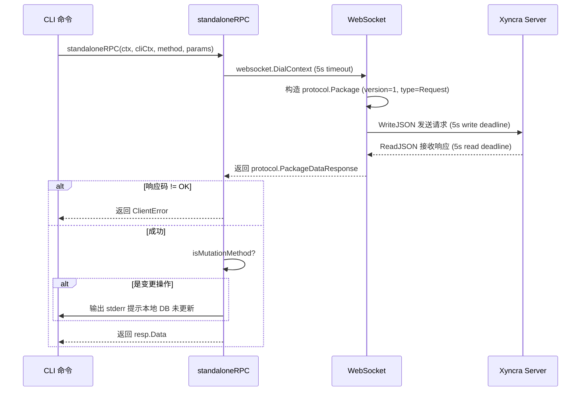

### 边缘场景

| 场景 | 行为 |
|------|------|
| WebSocket 连接超时 (5s) | 返回 dial 连接错误 |
| 读取超时 (5s) | 返回 "standalone read: server timed out"（net.Error 检测） |
| 变更操作提示 | isMutationMethod 覆盖: send_message, delete_message, mark_as_read, create_conversation, delete_conversation, restore_conversation |

### 涉及文件

- `internal/cli/rpc_helper.go`: standaloneRPC 实现、isMutationMethod 判断

---

## 场景 8: 消息操作 (删除/标记已读/查询/搜索)

> 详细流程参阅 [CLI 与 IPC 通信 - 消息管理](cli-ipc.md#6-消息管理)。

### 概览

| 命令 | 模式 | 说明 |
|------|------|------|
| delete-message | IPC + standalone 降级 | 删除指定消息 |
| mark-as-read | IPC + standalone 降级 | message-id=0 时从本地 DB 解析 LastProcessedMessageID |
| get-messages | 本地 SQLite 直读 | limit+1 检测 hasMore |
| search-messages | 本地 SQLite 直读 | DESC 顺序结果 |

### 涉及文件

- `internal/cli/messages.go`: delete-message/mark-as-read/get-messages/search-messages 命令定义

---

## 场景 8b: IPC-only 命令 (set-typing / stream-text / agent-resume / reload-agents / sync-updates)

> 详细流程参阅 [CLI 与 IPC 通信](cli-ipc.md) 对应章节。

### 概览

以下 5 个命令仅通过 IPC 调用守护进程，不提供 standalone WebSocket 降级。若守护进程未运行，统一输出错误提示并以 exit code 2 退出。

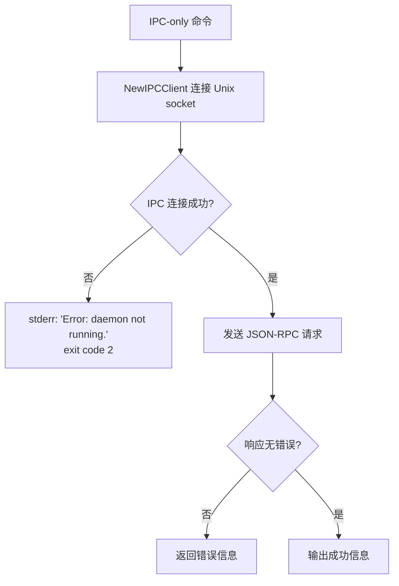

### 命令清单

| 命令 | IPC 方法 | 说明 | 参阅 |
|------|----------|------|------|
| set-typing | `set_typing` | 发送/停止输入指示器 (D-050) | [cli-ipc.md#13](cli-ipc.md#13-设置输入状态-set_typing) |
| stream-text | `stream_text` | 发送流式文本 (D-051) | [cli-ipc.md#14](cli-ipc.md#14-流式文本-stream_text) |
| agent-resume | `agent_resume` | 恢复 HITL 暂停的 Agent (D-085, D-114) | [cli-ipc.md#12](cli-ipc.md#12-agent-恢复-agent_resume) |
| reload-agents | `reload_agents` | 重载 Agent 配置 (D-076) | [cli-ipc.md#16](cli-ipc.md#16-重载-agent-配置-reload_agents) |
| sync-updates | `sync_updates` | 触发全量同步 (D-036) | [cli-ipc.md#11](cli-ipc.md#11-同步更新-sync_updates) |

### 边缘场景

| 场景 | 行为 |
|------|------|
| 守护进程未运行 (IPC 连接失败) | stderr 输出错误 + Hint，exit code 2 |
| IPC 响应携带错误 | 返回 `fmt.Errorf` 错误信息 |

### 涉及文件

- `internal/cli/set_typing.go`: set-typing 命令定义
- `internal/cli/stream_text.go`: stream-text 命令定义
- `internal/cli/agent_resume.go`: agent-resume 命令定义
- `internal/cli/reload_agents.go`: reload-agents 命令定义
- `internal/cli/sync.go`: sync-updates 命令定义

---

## 场景 8c: 草稿管理 (draft save/get/delete)

> 详细流程参阅 [CLI 与 IPC 通信 - 草稿管理](cli-ipc.md#7-草稿管理)。

### 概览

草稿命令完全在本地 SQLite 上操作，不经过 IPC 或 WebSocket。草稿按 conversation_id 唯一索引 upsert。

| 子命令 | 操作 | 说明 |
|--------|------|------|
| draft save | `db.Drafts.Save` | 保存/覆盖草稿 |
| draft get | `db.Drafts.GetByConversation` | 读取草稿，不存在时输出 "No draft found" |
| draft delete | `db.Drafts.DeleteByConversation` | 删除草稿，不存在时输出 "No draft found" |

### 边缘场景

| 场景 | 行为 |
|------|------|
| content 为空字符串 | 返回 "draft save: --content is required" |
| 草稿不存在 (get/delete) | 输出友好提示，不报错 |
| clearDraft 在 send 成功后调用 | best-effort，失败仅 stderr warning |

### 涉及文件

- `internal/cli/draft.go`: draft save/get/delete 命令定义
- `internal/cli/send.go`: clearDraft 辅助函数

---

## 场景 8d: 客户端日志管理 (logs tail/search/stats/export/cleanup)

> 详细流程参阅 [CLI 与 IPC 通信 - 日志管理](cli-ipc.md#10-日志管理)。

### 概览

logs 命令族完全在本地 SQLite 上操作（RPCLog / NotificationLog 表），不经过 IPC 或 WebSocket。

| 子命令 | 说明 | 关键 Flag |
|--------|------|-----------|
| logs tail | 显示最近日志条目 | `--type rpc/notifications`, `--limit`, `--since` |
| logs search | 按条件搜索日志 | `--method`, `--error`, `--from/to`, `--conversation-id`, `--request-id` |
| logs stats | 显示 RPC 日志统计 | `--since`, `--interval 1m/5m/15m/1h/1d` |
| logs export | 导出日志为 CSV/JSON | `--format csv/json`, `--output` |
| logs cleanup | 按保留策略删除旧日志 | `--retain`, `--dry-run`, `--type rpc/notifications/all` |

### 时间参数解析

`--since` / `--from` / `--to` 支持三种格式:
- Go duration: `1h`, `30m`, `168h`
- 天数: `7d`
- RFC3339 绝对时间: `2024-01-01T00:00:00Z`

### 边缘场景

| 场景 | 行为 |
|------|------|
| limit <= 0 | 返回 "must be a positive integer" |
| 无效 time 参数 | 返回格式提示错误 |
| logs export limit > 10000 | 钳制为 1000 |
| logs cleanup --dry-run | 仅输出将删除的条数，不执行删除 |

### 涉及文件

- `internal/cli/logs.go`: logs tail/search/stats/export/cleanup 命令定义
- `internal/cli/output/console.go`: ConsoleWriter 表格输出
- `internal/cli/output/csv.go`: CSV 导出

---

## 场景 9: 日志初始化与配置

### 主流程

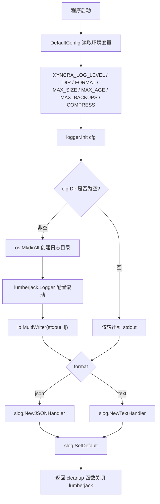

### 环境变量

| 环境变量 | 默认值 | 说明 |
|----------|--------|------|
| `XYNCRA_LOG_LEVEL` | `info` | 日志级别: debug, info, warn, error |
| `XYNCRA_LOG_DIR` | 空（stdout only） | 非空时输出到 stdout + 滚动日志文件 |
| `XYNCRA_LOG_FORMAT` | `text` | 输出格式: text (人类可读) 或 json (结构化) |
| `XYNCRA_LOG_MAX_SIZE` | `100` | 单文件最大 MB |
| `XYNCRA_LOG_MAX_AGE` | `30` | 旧日志保留天数 |
| `XYNCRA_LOG_MAX_BACKUPS` | `10` | 最大备份文件数 |
| `XYNCRA_LOG_COMPRESS` | `true` | 是否 gzip 压缩滚动后的日志 |

日志文件名固定为 `xyncra-server.log`（`<cfg.Dir>/xyncra-server.log`）。

### 边缘场景

#### 1. 日志目录创建失败

- 触发条件: os.MkdirAll 权限不足
- 处理逻辑: 返回 "logger: create log dir %q: ..." 错误
- 最终结果: 程序启动失败

#### 2. 无效日志级别

- 触发条件: XYNCRA_LOG_LEVEL 设为不识别的值（非 debug/info/warn/error）
- 处理逻辑: envLevel 回退到默认值 "info"；parseLevel 也回退到 slog.LevelInfo
- 最终结果: 使用 INFO 级别

#### 3. 无效日志格式

- 触发条件: XYNCRA_LOG_FORMAT 设为不识别的值（非 text/json）
- 处理逻辑: envFormat 回退到默认值 "text"；Init 中 `format != "json"` 也回退到 "text"
- 最终结果: 使用 text 格式

#### 4. 日志滚动配置

- 触发条件: 文件达到 MaxSizeMB（默认 100MB）
- 处理逻辑: lumberjack 自动滚动，保留 MaxBackups（默认 10）个，MaxAge（默认 30 天）
- 最终结果: 旧日志自动清理，压缩存储（Compress 默认 true）

#### 5. 负数配置值

- 触发条件: XYNCRA_LOG_MAX_SIZE 等设为负数
- 处理逻辑: envInt 将负数钳制为 0
- 最终结果: 使用 0 值

### 涉及文件

- `internal/logger/logger.go`: Init 函数、parseLevel、lumberjack 配置
- `internal/logger/config.go`: Config 结构、DefaultConfig 从环境变量加载、envLevel/envFormat/envInt/envBool 辅助函数
- `internal/logger/slog_adapter.go`: SlogLogger 适配器，包装 *slog.Logger 满足 Info/Error/Debug 接口
- `internal/logger/context.go`: FromContext/WithContext 日志上下文传播
- `internal/logger/fields.go`: 标准字段定义（AgentID, UserID, DeviceID, ConversationID, DurationMs, Model）
- `internal/logger/component.go`: WithComponent 辅助函数，为子系统创建带 component 属性的 logger

---

## 场景 10: Prometheus 指标采集

### 主流程

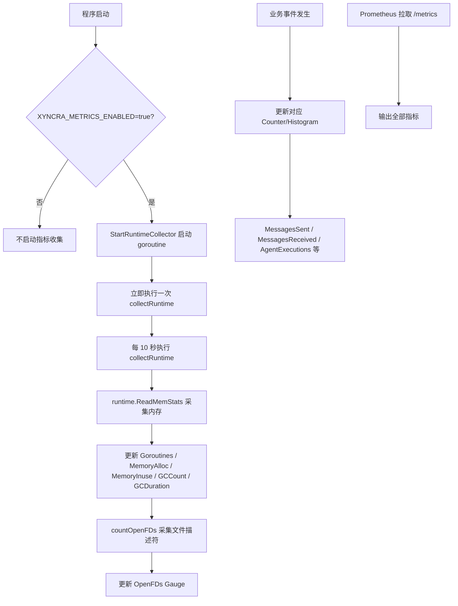

### 环境变量

| 环境变量 | 默认值 | 说明 |
|----------|--------|------|
| `XYNCRA_METRICS_ENABLED` | `false` | 是否启用指标收集 |

### 指标清单 (32 个)

| 分类 | 数量 | 指标 |
|------|------|------|
| 系统 | 6 | Goroutines, MemoryAlloc, MemoryInuse, GCDuration, GCCount, OpenFDs |
| 连接 | 3 | ConnectionsActive, ConnectionsTotal, ConnectionsDuration |
| 消息 | 4 | MessagesSent, MessagesReceived, MessageSizeBytes, MessageLatency |
| Agent | 9 | AgentExecutions, AgentExecutionsFailed, AgentDuration, AgentActive, AgentQueueDepth, LLMTokensInput, LLMTokensOutput, LLMCallsTotal, LLMCallsFailed |
| 业务 | 6 | ConversationsActive, ConversationsCreated, DevicesConnected, FunctionsRegistered, ReverseRPCRequests, ReverseRPCFailed |
| Redis | 4 | RedisConnected, RedisPingDuration, RedisPoolSize, AsynqQueueSize |

### 边缘场景

#### 1. 非 Linux 平台 FD 计数

- 触发条件: macOS/Windows 无 /proc/self/fd
- 处理逻辑: countOpenFDs 返回 -1，不更新 OpenFDs
- 最终结果: 指标缺失但不影响运行

#### 2. GC 指标冷启动

- 触发条件: 首次 collectRuntime 时 m.NumGC == 0
- 处理逻辑: 跳过 GCDuration.Observe，避免除零
- 最终结果: GCDuration 在首次 GC 完成前无数据点

### 涉及文件

- `internal/metrics/metrics.go`: 32 个 Prometheus 指标定义（6 系统 + 3 连接 + 4 消息 + 9 Agent + 6 业务 + 4 Redis）
- `internal/metrics/runtime.go`: StartRuntimeCollector 运行时指标采集（10 秒间隔，首次立即执行）
- `internal/metrics/config.go`: Config 与 DefaultConfig（仅 Enabled 字段，读取 XYNCRA_METRICS_ENABLED）

---

## 场景 11: OpenTelemetry 链路追踪初始化与采样

### 主流程

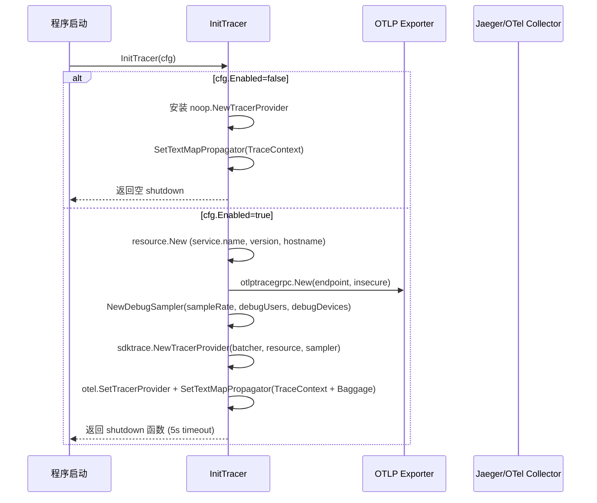

### 环境变量

| 环境变量 | 默认值 | 说明 |
|----------|--------|------|
| `XYNCRA_TRACING_ENABLED` | `false` | 是否启用链路追踪 |
| `XYNCRA_TRACING_SERVICE_NAME` | `xyncra-server` | 服务名 resource attribute |
| `XYNCRA_TRACING_OTLP_ENDPOINT` | `localhost:4317` | OTLP gRPC collector 地址 |
| `XYNCRA_TRACING_OTLP_INSECURE` | `true` | 是否禁用 TLS |
| `XYNCRA_TRACING_SAMPLING_RATE` | `1.0` | 采样比率 (0.0-1.0) |
| `XYNCRA_TRACING_DEBUG_USERS` | 空 | 强制采样的用户 ID 列表（逗号分隔） |
| `XYNCRA_TRACING_DEBUG_DEVICES` | 空 | 强制采样的设备 ID 列表（逗号分隔） |

### 采样策略 (DebugSampler)

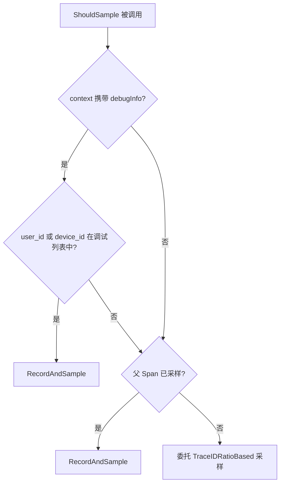

### 边缘场景

#### 1. 调试用户强制采样

- 触发条件: 请求来自 DebugUsers/DebugDevices 列表中的用户/设备（OR 逻辑）
- 处理逻辑: DebugSampler.ShouldSample 检查 context 中的 debugContextKey（通过 WithDebug 设置），命中则 RecordAndSample
- 最终结果: 该用户的完整链路被采集

#### 2. 父 Span 已采样

- 触发条件: 非调试用户，但父 Span 已被采样（IsValid && IsSampled）
- 处理逻辑: 尊重父 Span 的采样决策，直接 RecordAndSample
- 最终结果: 保持 trace 完整性

#### 3. 比率采样回退

- 触发条件: 非调试用户，无父 Span 或父 Span 未采样
- 处理逻辑: 委托给 TraceIDRatioBased(sampleRate) 按比率采样
- 最终结果: 按配置比例采集

### 涉及文件

- `internal/tracing/tracing.go`: InitTracer 初始化、version/hostname 辅助函数
- `internal/tracing/config.go`: TracingConfig 与 DefaultTracingConfig、Apply 函数选项
- `internal/tracing/middleware.go`: DebugSampler 采样策略、WithDebug/IsDebugContext context 工具
- `internal/tracing/mq_propagation.go`: MapCarrier、InjectTraceContext/ExtractTraceContext 用于消息队列的 W3C Trace Context 跨服务传播

---

## 场景 12: LLM 可观测性 - JSONL 日志

### 主流程

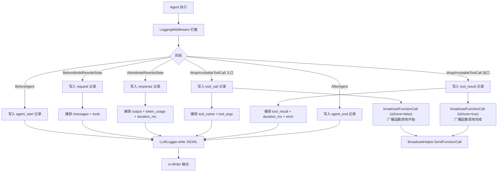

### 日志阶段与字段

| 阶段 | Phase 值 | 关键字段 |
|------|----------|----------|
| BeforeAgent | `agent_start` | agent_id, model, iteration |
| BeforeModelRewriteState | `request` | messages (截断), tools |
| AfterModelRewriteState | `response` | output, token_usage (input/output/total), duration_ms |
| WrapInvokableToolCall 入口 | `tool_call` | tool_name, tool_args (截断 2048) |
| WrapInvokableToolCall 出口 | `tool_result` | tool_name, tool_result (截断 4096), duration_ms, error |
| AfterAgent | `agent_end` | output (最后一条消息) |

### 边缘场景

#### 1. 内容截断

- 触发条件: 消息内容超过 4096 字符、工具参数超过 2048 字符、或工具结果超过 4096 字符
- 处理逻辑: truncate 函数截断并附加 "...[truncated]"（ASCII 省略号）
- 最终结果: 日志记录保持可管理大小

#### 2. 并发安全

- 触发条件: 多个 Agent 并发执行
- 处理逻辑: LLMLogger 内部 sync.Mutex 序列化写入
- 最终结果: JSONL 输出不交错

#### 3. Function Call 广播

- 触发条件: WrapInvokableToolCall 执行时上下文包含 broadcast 元数据（通过 WithBroadcastInfo 设置）
- 处理逻辑: 读取 context 中的 BroadcastHelper、HumanUserID、AgentUserID、ConversationID
- 广播时机: **两次** — 工具调用开始时 (isDone=false, result 为空) 和工具调用完成时 (isDone=true, 携带结果)
- 最终结果: 客户端实时看到函数调用进度（fire-and-forget，错误不传播）

#### 4. Broadcast 元数据缺失

- 触发条件: context 中未设置 BroadcastHelper 或 HumanUserID/ConversationID 为空
- 处理逻辑: broadcastFunctionCall 直接返回，不执行广播
- 最终结果: 静默跳过，不影响日志记录

### 涉及文件

- `internal/agent/llm_logger.go`: LLMLogger、LoggingMiddleware、LogRecord 类型、broadcastFunctionCall

---

## 场景 13: Agent 追踪中间件 (OpenTelemetry Spans)

### 主流程

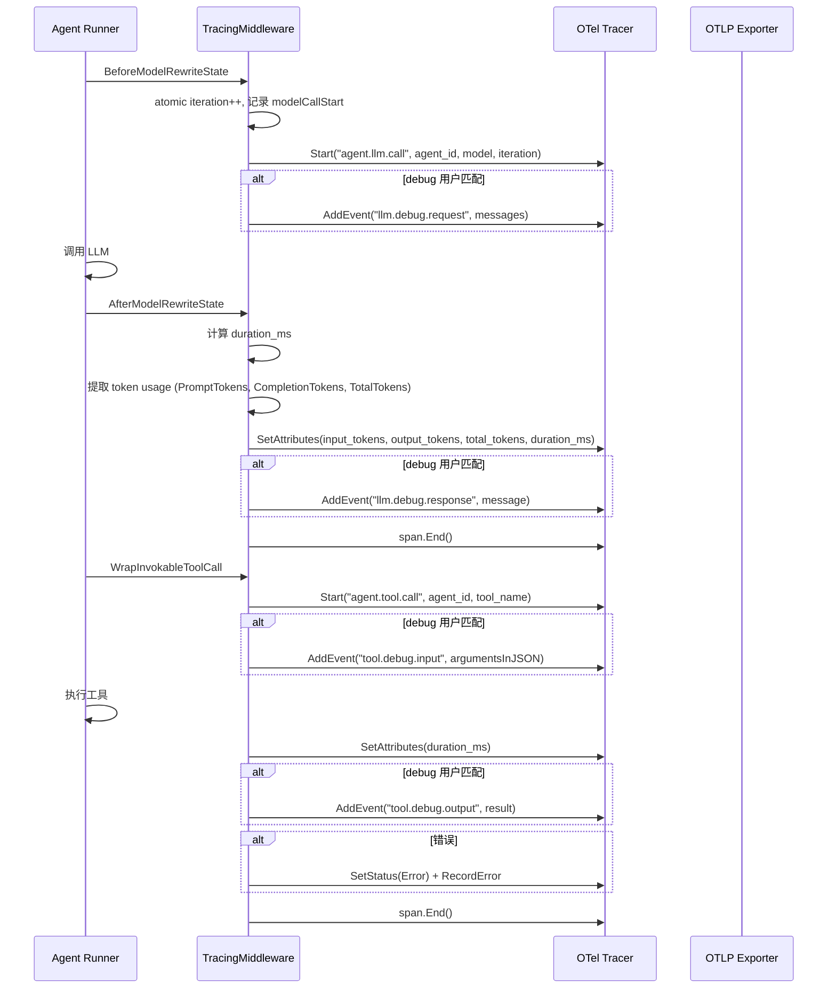

### Debug 内容捕获机制

Debug 匹配在 `BeforeModelRewriteState` 中通过 `isDebugCaller(ctx)` 判断一次，结果缓存到 `debugMatched` 字段，在同一次迭代的 `WrapInvokableToolCall` 中复用。每个迭代独立判断（iteration 递增时重新判断）。

匹配逻辑: 从 context 中提取 `CallerDeviceFromContext`，检查 UserID 是否在 debugUsers 中 **或** DeviceID 是否在 debugDevices 中（OR 逻辑）。

### 边缘场景

#### 1. Debug 内容捕获

- 触发条件: 调用者 user_id/device_id 匹配 debugUsers/debugDevices 配置
- 处理逻辑: 完整的请求/响应消息和工具输入/输出作为 span event 记录
- 最终结果: 可在 Jaeger 等工具中查看完整 LLM 交互内容（含 ReasoningContent）

#### 2. LLM 调用失败

- 触发条件: 工具执行返回 error
- 处理逻辑: span.SetStatus(codes.Error) + span.RecordError(err)
- 最终结果: 在追踪系统中标记为错误 Span

#### 3. 未启用追踪

- 触发条件: TracingMiddleware 仅在 SetTracingEnabled(true) 时添加到链中
- 处理逻辑: 全局 tracer provider 为 noop 时，中间件不被添加
- 最终结果: 零开销

### 涉及文件

- `internal/agent/tracing_middleware.go`: TracingMiddleware、SetDebugFilter、isDebugCaller、serializeMessages/serializeMessage
- `internal/tracing/attributes.go`: Span 名称常量 (SpanAgentLLMCall/SpanAgentToolCall 等)、属性键常量 (AttrAgentID/AttrModel/AttrDurationMs 等)

---

## 场景 14: 性能分析 - Pprof 服务

### 主流程

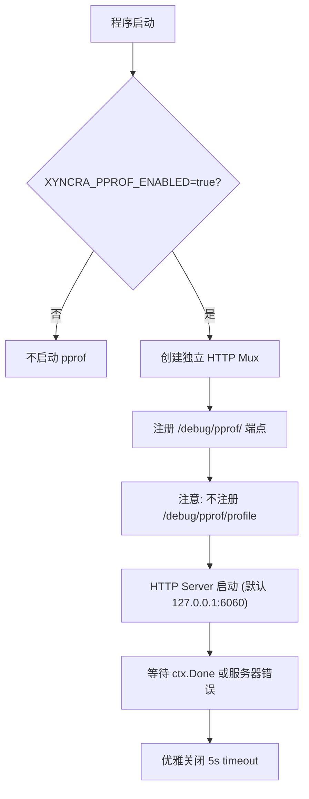

### 环境变量

| 环境变量 | 默认值 | 说明 |
|----------|--------|------|
| `XYNCRA_PPROF_ENABLED` | `false` | 是否启动 pprof 服务 |
| `XYNCRA_PPROF_ADDR` | `127.0.0.1:6060` | 监听地址 |

### 已注册端点

- `/debug/pprof/` — Index
- `/debug/pprof/cmdline` — Cmdline
- `/debug/pprof/symbol` — Symbol
- `/debug/pprof/trace` — Trace

**未注册**: `/debug/pprof/profile` — 与 Pyroscope 持续 CPU profiling 冲突。

### 边缘场景

#### 1. CPU Profiler 冲突

- 触发条件: Pyroscope 同时启用（XYNCRA_PROFILING_ENABLED=true）
- 处理逻辑: 故意不注册 /debug/pprof/profile 端点
- 最终结果: 避免 "cpu profiling already in use" 错误

#### 2. 安全绑定

- 触发条件: 默认地址 127.0.0.1:6060（可通过 XYNCRA_PPROF_ADDR 覆盖）
- 处理逻辑: 仅监听 localhost，不暴露到网络
- 最终结果: 防止敏感 profiling 数据泄露

### 涉及文件

- `internal/profiling/pprof.go`: PprofConfig、DefaultPprofConfig、StartPprof

---

## 场景 15: 性能分析 - Pyroscope 持续剖析

### 主流程

```mermaid
flowchart TD
    A[程序启动] --> B{XYNCRA_PROFILING_ENABLED=true?}
    B -->|否| C[不启动 Pyroscope]
    B -->|是| D{XYNCRA_PROFILING_SERVER 设置?}
    D -->|否| E[warn 日志, 跳过]
    D -->|是| F["pyroscope.Start(appName, server)"]
    F --> G{初始化成功?}
    G -->|是| H[返回 cleanup 函数 (调用 profiler.Stop)]
    G -->|否| I[warn 日志, fail-open, 返回 nil]
    I --> J[程序正常运行]
```

### 环境变量

| 环境变量 | 默认值 | 说明 |
|----------|--------|------|
| `XYNCRA_PROFILING_ENABLED` | `false` | 是否启用 Pyroscope |
| `XYNCRA_PROFILING_SERVER` | 空 | Pyroscope 服务器地址（如 `http://pyroscope:4040`） |
| `XYNCRA_PROFILING_APP_NAME` | `xyncra-server` | Pyroscope 中的应用名称 |

### 边缘场景

#### 1. 服务端不可达

- 触发条件: Pyroscope server 连接失败
- 处理逻辑: fail-open 策略：记录 warning 并继续（返回 nil, nil）
- 最终结果: 程序正常运行，无 profiling 数据

#### 2. SERVER 未配置

- 触发条件: XYNCRA_PROFILING_ENABLED=true 但 XYNCRA_PROFILING_SERVER 为空
- 处理逻辑: warn 日志 "pyroscope enabled but XYNCRA_PROFILING_SERVER not set, skipping"
- 最终结果: 跳过初始化，返回 nil, nil

### 涉及文件

- `internal/profiling/pyroscope.go`: PyroscopeConfig、DefaultPyroscopeConfig、StartPyroscope、FormatPyroscopeStatus
