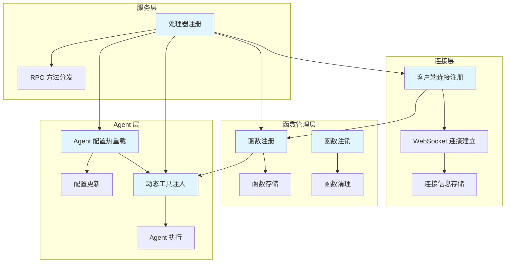
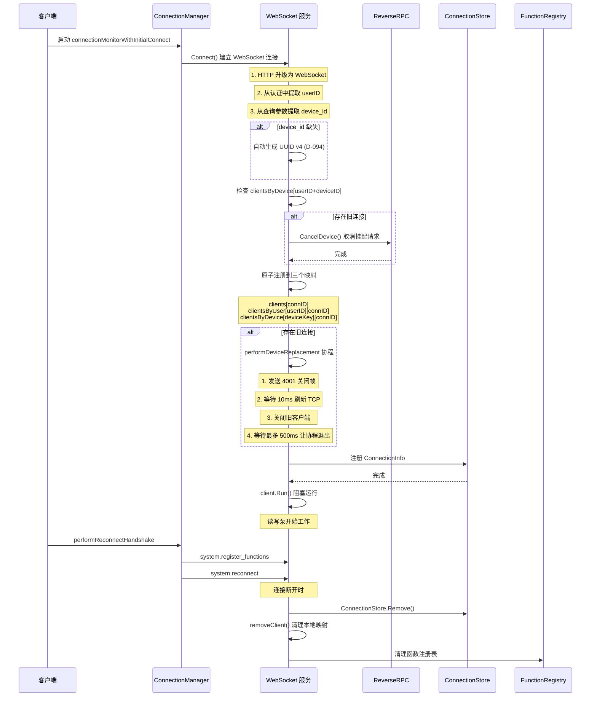
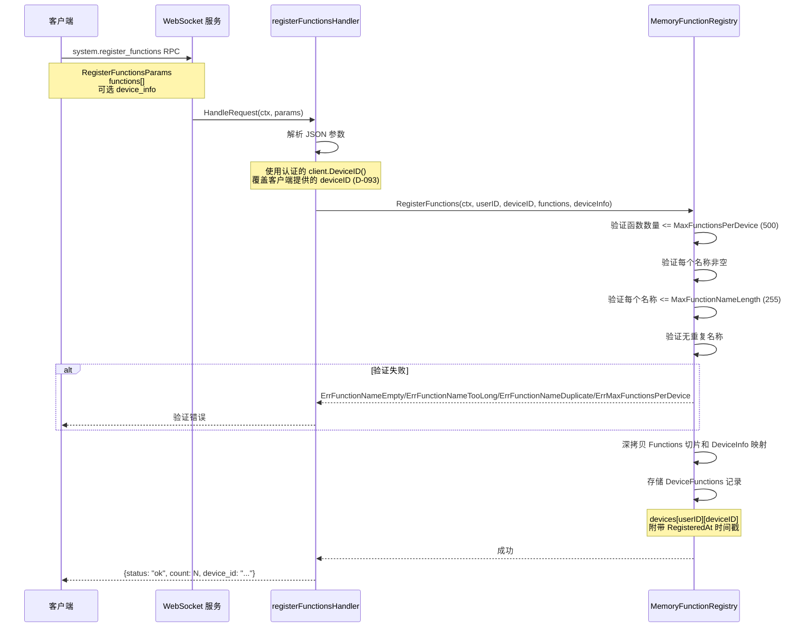
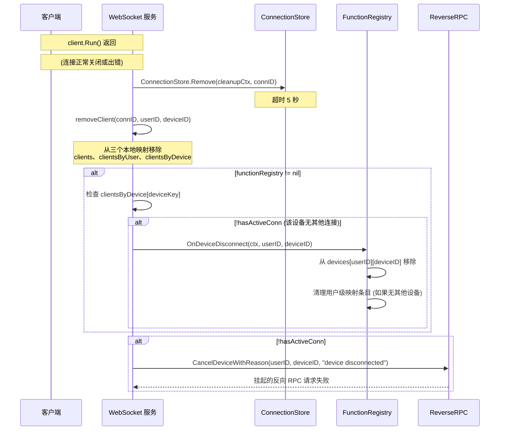
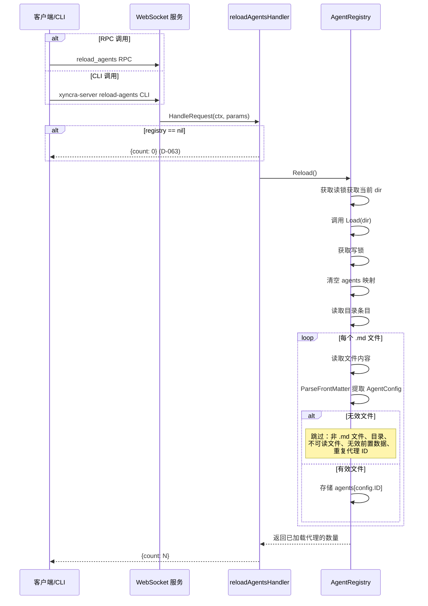
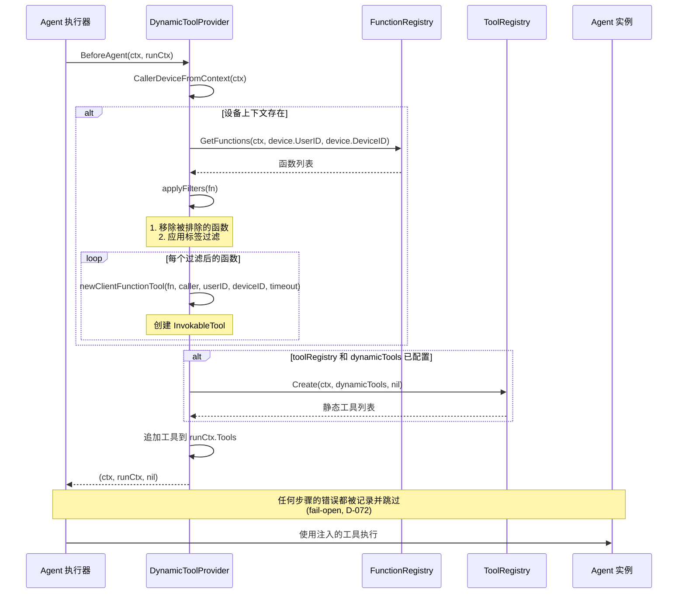
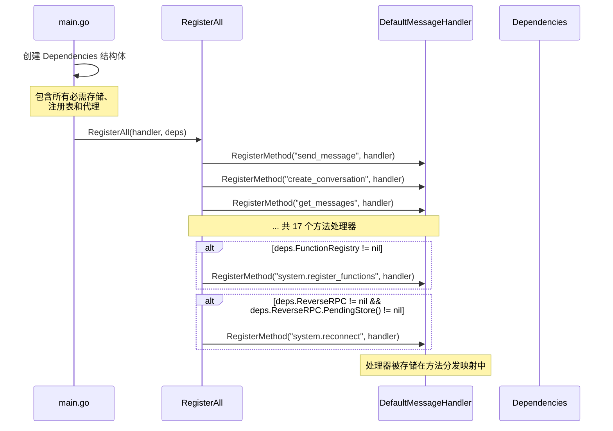
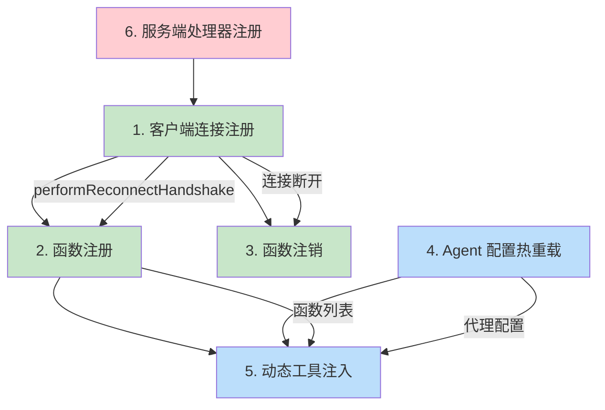

# 客户端注册与函数管理

本文档详细描述 Xyncra Server 中客户端注册与函数管理的完整业务流程，包括连接建立、函数注册/注销、Agent 配置热重载、动态工具注入等核心流程。

## 流程概览

---

## 1. 客户端连接注册流程 (client_connection_registration)

### 概述

客户端通过 WebSocket 连接到服务器，在 ConnectionStore 和本地索引中注册自身。这是所有后续函数管理流程的基础。

### 流程图

### 详细步骤

1. **客户端启动连接监控**
   - 客户端调用 `XyncraClient.Start()` 启动 `connectionMonitorWithInitialConnect` 协程
   - 该协程负责监控连接状态并处理重连逻辑

2. **建立 WebSocket 连接**
   - 客户端的 `connectionManager.Connect()` 建立到服务器 `/ws` 端点的 WebSocket 连接
   - 连接过程中完成 HTTP 升级和认证

3. **服务器处理连接**
   - 从认证信息中提取 `userID`
   - 从查询参数中提取 `device_id`
   - 如果 `device_id` 缺失，服务器自动生成 UUID v4 (D-094)

4. **设备替换检测**
   - 服务器检查 `clientsByDevice[userID+"\x00"+deviceID]` 是否存在已有连接
   - 如果存在旧连接，触发设备替换流程

5. **取消挂起请求**
   - 调用 `reverseRPC.CancelDevice()` 立即失败所有挂起的请求

6. **原子注册新客户端**
   - 在三个本地映射中原子注册：
     - `clients[connID]`
     - `clientsByUser[userID][connID]`
     - `clientsByDevice[deviceKey][connID]`
   - 旧条目从 `clientsByDevice` 中移除

7. **设备替换协程**
   - `performDeviceReplacement` 协程发送 `4001` 关闭帧给旧连接
   - 等待 10ms 刷新 TCP
   - 关闭旧客户端
   - 等待最多 500ms 让协程退出

8. **存储连接信息**
   - 在 `ConnectionStore`（Redis 或内存）中注册 `ConnectionInfo`

9. **运行连接**
   - `client.Run()` 阻塞运行（读写泵）
   - 当返回时执行清理：
     - `ConnectionStore.Remove()`
     - `removeClient()`
     - 函数注册表清理

10. **客户端侧握手**
    - 连接后异步运行 `performReconnectHandshake`
    - 先发送 `system.register_functions`
    - 再发送 `system.reconnect`

### 边缘场景

| 场景 | 处理方式 | 设计决策 |
|------|---------|---------|
| 查询参数中无 `device_id` | 服务器自动生成 UUID v4 | D-094：确保每个连接有唯一标识 |
| `device_id` 超过 255 个字符 | 返回 400 Bad Request | 防止存储溢出 |
| `ConnectionStore.Add` 失败 | 客户端立即被关闭，不执行函数清理 | 连接未完全建立，避免清理不一致状态 |
| 设备替换竞态 | 旧连接的异步清理协程与新连接的注册并发运行 | `hasActiveConn` 检查防止清理属于替换连接的函数 |
| 清理期间 Redis 不可达 | 5 秒有界上下文防止无限阻塞 | 最终一致性保证 |
| `4001` 关闭帧 | 旧客户端收到关闭码 4001 | D-111：触发优雅退出而非重连 |
| 服务器 GracefulStop | `closeAllClients()` 运行 | 所有连接被清理 |
| 客户端不使用服务器分配的 `deviceID` | 客户端和服务器的 `deviceID` 可能不匹配 | 依赖客户端正确使用服务器返回的 deviceID |

---

## 2. 函数注册流程 (function_registration)

### 概述

客户端设备通过 `system.register_functions` RPC 向服务器声明其可调用函数。函数存储在按 `(userID, deviceID)` 键控的设备级注册表中。这是一个全量替换操作 — 每次调用覆盖之前的函数列表。

### 流程图

### 详细步骤

1. **发送注册请求**
   - 客户端发送 `system.register_functions` RPC
   - 包含 `RegisterFunctionsParams`（`functions[]` 和可选的 `device_info`）

2. **解析请求参数**
   - 服务器的 `registerFunctionsHandler.HandleRequest` 从 JSON 解析参数

3. **覆盖设备 ID**
   - 处理器用经过认证的客户端的 `client.DeviceID()` 覆盖 `deviceID` (D-093)
   - 客户端提供的 `deviceID` 被忽略

4. **验证函数列表**
   - `MemoryFunctionRegistry.RegisterFunctions` 验证：
     - 函数数量 <= `MaxFunctionsPerDevice`（默认 500）
     - 每个名称非空
     - 每个名称 <= `MaxFunctionNameLength`（默认 255）
     - 无重复名称

5. **深拷贝数据**
   - 深拷贝 `Functions` 切片和 `DeviceInfo` 映射以防止调用者修改内部状态

6. **存储函数记录**
   - 在 `devices[userID][deviceID]` 中存储 `DeviceFunctions` 记录
   - 附带 `RegisteredAt` 时间戳

7. **返回结果**
   - 返回 `{status: "ok", count: N, device_id: "..."}`

### 边缘场景

| 场景 | 处理方式 | 设计决策 |
|------|---------|---------|
| 空函数列表 | 有效，清除设备之前注册的函数 | 全量替换语义 |
| 函数名称验证失败 | 返回对应的验证错误 | ErrFunctionNameEmpty/ErrFunctionNameTooLong/ErrFunctionNameDuplicate/ErrMaxFunctionsPerDevice |
| 同一设备的并发注册 | 在互斥锁下后写入者获胜 | 无冲突检测 |
| `FunctionRegistry` 为 nil | `system.register_functions` 处理器不会注册 | D-063：nil-safe 设计 |
| 客户端在参数中提供的 `deviceID` | 被静默忽略 | D-093：安全措施，连接的 deviceID 是权威的 |
| 重连后重新注册 | 自动调用 `reregisterFunctions` | 在 `system.reconnect` 之前执行，确保服务器在 PendingStore 重放之前有处理器 |

---

## 3. 断开连接时的函数注销流程 (function_deregistration_on_disconnect)

### 概述

当客户端设备断开连接时，其注册的函数从注册表中清理，以防止过时的函数引用。清理过程对设备替换是竞态安全的。

### 流程图

### 详细步骤

1. **连接断开触发**
   - WebSocket `client.Run()` 返回（连接正常关闭或出错）

2. **清理连接存储**
   - 服务器在延迟代码中运行清理：`ConnectionStore.Remove(cleanupCtx, connID)`
   - 超时 5 秒

3. **移除本地映射**
   - `removeClient(connID, userID, deviceID)` 从三个本地映射中移除：
     - `clients`
     - `clientsByUser`
     - `clientsByDevice`

4. **检查函数注册表**
   - 服务器检查 `functionRegistry != nil`
   - 查找 `clientsByDevice[deviceKey]`

5. **清理函数注册**
   - 如果 `!hasActiveConn`（该设备无其他连接）：
     - 调用 `functionRegistry.OnDeviceDisconnect(ctx, userID, deviceID)`
     - 从 `devices[userID][deviceID]` 中移除设备条目
     - 如果该用户不再有设备，清理用户级映射条目以防止内存泄漏

6. **取消挂起请求**
   - 如果 `!hasActiveConn`：
     - `reverseRPC.CancelDeviceWithReason(userID, deviceID, "device disconnected")`
     - 使挂起的反向 RPC 请求失败

### 边缘场景

| 场景 | 处理方式 | 设计决策 |
|------|---------|---------|
| 设备替换（旧连接断开清理之前新连接已建立） | `hasActiveConn` 为 true，跳过函数清理 | 防止替换连接的函数被删除的竞态 |
| 对未知设备调用 `OnDeviceDisconnect` | 幂等，返回 `(nil, nil)` | 无副作用 |
| `ConnectionStore.Remove` 期间 Redis 不可达 | 5 秒超时，错误被记录但清理继续 | 清理不因存储故障阻塞 |
| `functionRegistry` 为 nil | 整个清理块被跳过 | D-063：nil-safe 设计 |
| 服务器关闭 | `closeAllClients()` 关闭所有连接 | 不触发逐设备的函数清理（批量清理路径） |
| 同一设备的多个连接 | 最后一次断开触发清理 | D-095 替换逻辑后不应发生，但防御性处理 |

---

## 4. Agent 配置热重载流程 (agent_reload)

### 概述

从磁盘热重载代理配置，无需重启服务器。重新扫描 agents 目录并原子替换所有已加载的配置。

### 流程图

### 详细步骤

1. **触发重载**
   - 客户端发送 `reload_agents` RPC
   - 或服务器操作员运行 `xyncra-server reload-agents` CLI 命令

2. **检查注册表**
   - `reloadAgentsHandler.HandleRequest` 检查 `registry` 是否为 nil
   - 如果是，返回 `{count: 0}` (D-063 nil-safe)

3. **执行重载**
   - `AgentRegistry.Reload()` 获取读锁获取当前 `dir`
   - 调用 `Load(dir)`

4. **加载配置**
   - `Load` 获取写锁
   - 清空 `agents` 映射
   - 读取目录条目

5. **解析配置文件**
   - 对每个 `.md` 文件：
     - 读取内容
     - 调用 `ParseFrontMatter` 提取 `AgentConfig`

6. **过滤无效文件**
   - 跳过：非 `.md` 文件、目录、不可读文件（记录日志）、无效前置数据（记录日志）、重复代理 ID（记录日志）

7. **存储有效配置**
   - 将有效配置存储在 `agents[config.ID]` 中

8. **返回结果**
   - 返回已加载代理的数量

### 边缘场景

| 场景 | 处理方式 | 设计决策 |
|------|---------|---------|
| `registry` 为 nil | 返回 `{count: 0}` 且无错误 | D-063：nil-safe 设计 |
| 目录不存在 | `Load` 返回 nil | D-063：可选模块，agents 映射被清空，实际上卸载所有代理 |
| `dir` 为空字符串（从未加载） | `os.ReadDir("")` 失败 | 错误被包装并返回 |
| 跨文件的重复代理 ID | 先到先得 | 后续重复项被记录日志并跳过 |
| `.md` 文件中的无效前置数据 | 该文件被跳过 | 其他文件继续加载 |
| 并发 `Reload` 调用 | `Load` 中的写锁序列化它们 | 第二次调用完全覆盖第一次 |
| 代理配置在请求中被加载 | `IsAgent` 查找使用读锁 | 看到的要么是旧配置要么是新配置，永远不会是部分状态 |
| 文件读取错误（权限、I/O） | 单个文件被跳过并记录日志 | 其他文件继续 |
| `Load` 在加载前清空现有代理 | `agents` 映射为空的短暂窗口 | 在写锁下，短暂不一致 |

---

## 5. 动态工具注入流程 (dynamic_tool_injection)

### 概述

在每次代理执行之前，`DynamicToolProvider` 中间件动态注入客户端设备函数作为可调用工具。这弥合了客户端注册函数与代理工具执行模型之间的差距。

### 流程图

### 详细步骤

1. **触发中间件**
   - 代理执行触发 `DynamicToolProvider.BeforeAgent(ctx, runCtx)` 中间件钩子

2. **提取设备上下文**
   - 提取 `CallerDeviceFromContext(ctx)` 获取调用设备的 `userID` 和 `deviceID`

3. **获取注册函数**
   - 如果设备上下文存在：调用 `funcRegistry.GetFunctions(ctx, device.UserID, device.DeviceID)`
   - 获取已注册函数

4. **过滤函数**
   - `applyFilters` 过滤函数：
     - 首先移除被排除的函数（通过 `ExcludedFunctions` 配置精确名称匹配）
     - 然后应用标签过滤（空 `FunctionTags` = 接受全部；非空 = 函数标签上的 OR 语义）

5. **创建工具实例**
   - 对每个过滤后的函数：`newClientFunctionTool(fn, caller, userID, deviceID, timeout)`
   - 创建一个 `InvokableTool`，当被代理调用时，向客户端设备发送 `ServerRequest`（反向 RPC）

6. **注入静态工具**
   - 如果 `toolRegistry` 和 `dynamicTools` 已配置：`toolRegistry.Create(ctx, dynamicTools, nil)`
   - 从内置注册表解析静态工具

7. **合并工具列表**
   - 所有注入的工具通过新的切片分配追加到 `runCtx.Tools`（防止别名）

8. **返回结果**
   - 返回 `(ctx, runCtx, nil)`
   - 任何步骤的错误都被记录并跳过（fail-open, D-072）

### 边缘场景

| 场景 | 处理方式 | 设计决策 |
|------|---------|---------|
| ctx 中无设备上下文 | 客户端函数注入完全跳过 | 仅注入基于注册表的动态工具（如果有） |
| `GetFunctions` 返回错误 | 记录日志，客户端函数被跳过 | 代理在没有它们的情况下继续 |
| `GetFunctions` 返回空列表 | 不注入客户端工具 | 代理仅使用其静态 + 动态注册表工具运行 |
| `newClientFunctionTool` 对特定函数失败 | 该函数被跳过 | 逐函数 fail-open，其他函数继续 |
| 所有函数被过滤掉 | 不注入客户端工具 | 无副作用 |
| `toolRegistry` 为 nil 或 `dynamicTools` 为空 | 跳过基于注册表的工具注入 | 无副作用 |
| 默认调用超时 | 如果 `config.CallTimeout` 未设置或 <= 0，则为 30 秒 | 合理的默认值 |
| `runCtx.Tools` 为 nil | 分配新切片 | 注入无论初始状态如何都能工作 |
| Eino 框架 0->非零工具转换 | 运行时从注册表解析的动态工具触发图重建 | Eino 架构要求 |

---

## 6. 服务端处理器注册流程 (server_handler_registration)

### 概述

`RegisterAll` 在服务器启动时将所有 RPC 方法处理器连接到 `DefaultMessageHandler`。这是使上述所有流程可达的引导流程。

### 流程图

### 详细步骤

1. **创建依赖结构体**
   - `main.go` 创建包含所有必需存储、注册表和代理的 `Dependencies` 结构体

2. **注册所有处理器**
   - 调用 `RegisterAll(handler, deps)` 注册 17 个方法处理器

3. **存储处理器**
   - 每个 `RegisterMethod(methodName, handler)` 将处理器存储在 `DefaultMessageHandler` 的方法分发映射中

4. **条件注册**
   - 仅在 `deps.FunctionRegistry != nil` 时注册 `system.register_functions`
   - 仅在 `deps.ReverseRPC != nil` 且 `deps.ReverseRPC.PendingStore() != nil` 时注册 `system.reconnect`

### 边缘场景

| 场景 | 处理方式 | 设计决策 |
|------|---------|---------|
| `FunctionRegistry` 为 nil | `system.register_functions` 未注册 | 客户端对此方法的 RPC 返回 method not found |
| `AgentRegistry` 为 nil | `reload_agents` 处理器仍被注册（返回 `{count: 0}`） | 但 `send_message` 跳过代理检测 |
| `ReverseRPC` 为 nil 或 `PendingStore` 为 nil | `system.reconnect` 未注册 | 无法处理断线重连 |
| 同一方法的重复注册 | 后注册者覆盖先注册者 | 映射语义 |
| `RegisterAll` 在 `handler.Start()` 之前调用 | 处理器被存储但尚未分发 | 无竞态 |

---

## 流程间依赖关系

### 依赖说明

1. **服务端处理器注册** 是基础
   - 必须在服务器启动时完成
   - 决定了哪些 RPC 方法可用

2. **客户端连接注册** 依赖处理器注册
   - 需要 `handleWebSocket` 处理器已注册
   - 是后续所有流程的前提

3. **函数注册** 依赖客户端连接
   - 客户端必须先建立连接
   - 在 `performReconnectHandshake` 中自动触发

4. **函数注销** 依赖客户端连接
   - 当连接断开时自动触发
   - 清理过时的函数引用

5. **动态工具注入** 依赖函数注册和 Agent 配置
   - 从 `FunctionRegistry` 获取已注册函数
   - 从 `AgentRegistry` 获取代理配置

6. **Agent 配置热重载** 独立于其他流程
   - 可随时触发
   - 影响后续的动态工具注入

---

## 关键设计决策

| 编号 | 决策 | 理由 |
|------|------|------|
| D-063 | nil-safe 可选模块设计 | Agent、FunctionRegistry 等组件可选注入，nil 即禁用，避免强制依赖 |
| D-093 | 客户端提供的 deviceID 被忽略 | 安全措施，防止客户端伪造设备身份 |
| D-094 | 服务器自动生成 UUID v4 作为 deviceID | 确保每个连接有唯一标识 |
| D-095 | 设备替换检测和处理 | 支持同一设备的重新连接，避免僵尸连接 |
| D-072 | fail-open 错误处理策略 | 动态工具注入失败不应阻塞 Agent 执行 |
| D-101 | 注册的函数自动注入为 Agent 工具 | 弥合客户端函数与 Agent 工具执行模型的差距 |
| D-111 | 4001 关闭码触发优雅退出 | 设备被替换时，旧客户端应优雅退出而非重连 |
| D-103 | 超时请求持久化到 PendingStore | 支持断线重连后的请求重放 |

---

## 相关文档

- [业务流程索引](./index.md)
- [系统架构概览](../architecture/system-architecture.md)
- [协议设计](../architecture/protocol-design.md)
- [组件关系](../architecture/component-relationships.md)
