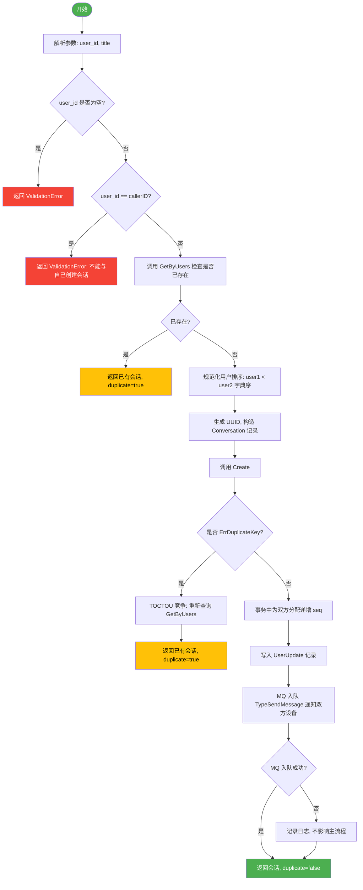
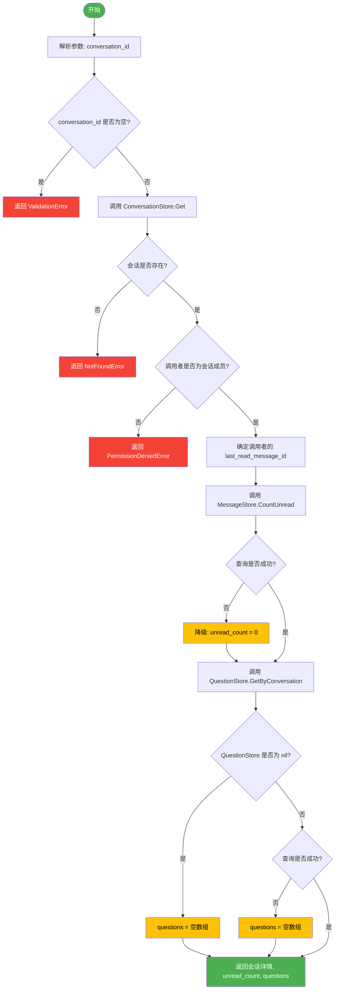
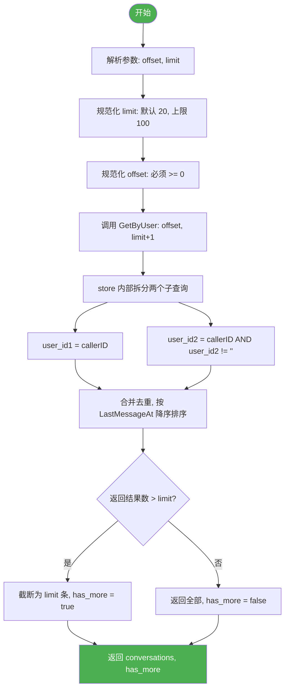
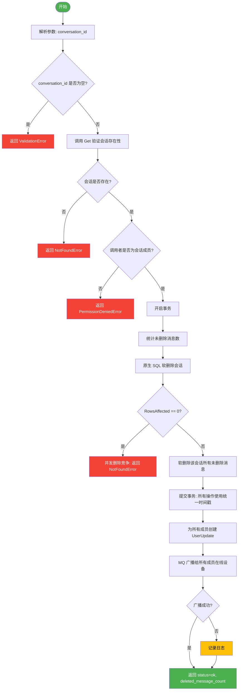
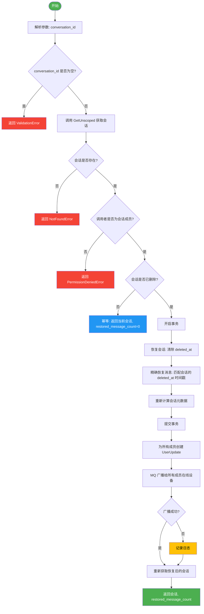

# 会话管理业务流程

本文档描述 Xyncra 会话（Conversation）模块的核心业务流程，包括创建、查询、列表、删除和恢复操作。

---

## 目录

- [0. 数据模型](#0-数据模型)
- [1. 创建会话 (create_conversation)](#1-创建会话-create_conversation)
- [2. 获取会话详情 (get_conversation)](#2-获取会话详情-get_conversation)
- [3. 列出会话 (list_conversations)](#3-列出会话-list_conversations)
- [4. 删除会话 (delete_conversation)](#4-删除会话-delete_conversation)
- [5. 恢复会话 (restore_conversation)](#5-恢复会话-restore_conversation)

---

## 0. 数据模型

### Conversation 表

| 字段 | 类型 | 约束 | 说明 |
| --- | --- | --- | --- |
| `id` | string(36) | PRIMARY KEY | UUID |
| `user_id1` | string(64) | NOT NULL | 用户1（字典序较小方） |
| `user_id2` | string(64) | NOT NULL | 用户2（字典序较大方），1-on-1 会话必填 |
| `type` | string(20) | NOT NULL | 会话类型：`1-on-1` / `group` / `channel` |
| `title` | string(255) | | 会话标题 |
| `pinned` | bool | | 是否置顶 |
| `muted` | bool | | 是否免打扰 |
| `avatar_url` | string(512) | | 头像 URL |
| `description` | text | | 会话描述 |
| `last_processed_message_id` | uint32 | | 最后处理的消息 ID |
| `created_at` | time.Time | INDEX | 创建时间 |
| `updated_at` | time.Time | | 更新时间 |
| `last_message_at` | time.Time | | 最后消息时间 |
| `last_read_message_id1` | uint32 | | 用户1 的已读游标（D-012） |
| `last_read_message_id2` | uint32 | | 用户2 的已读游标（D-012） |
| `agent_status` | string(32) | NOT NULL, DEFAULT 'idle', INDEX | HITL Agent 状态机状态 |
| `agent_id` | string(64) | | 当前执行的 Agent ID |
| `checkpoint_id` | string(36) | | Agent 检查点 ID |
| `agent_last_activity` | time.Time | | Agent 最后活动时间 |
| `deleted_at` | gorm.DeletedAt | INDEX | 软删除时间戳 |

### 索引

| 索引名 | 列 | 类型 | 用途 |
| --- | --- | --- | --- |
| PRIMARY | `id` | 主键 | 主键查询 |
| `idx_conversation_users_unique` | `(user_id1, user_id2)` | UNIQUE | 防止重复 1-on-1 会话 |
| `idx_conversation_user1_deleted` | `(user_id1, deleted_at)` | 复合 | 按 user1 查询 + 软删除过滤 |
| `idx_conversation_user2_deleted` | `(user_id2, deleted_at)` | 复合 | 按 user2 查询 + 软删除过滤 |
| `idx_conversation_lastmsg_deleted` | `(last_message_at, deleted_at)` | 复合 | 按最后消息时间排序 + 软删除过滤 |
| `idx_conversations_type` | `type` | 普通 | 按类型查询 |
| `idx_conversations_created_at` | `created_at` | 普通 | 按创建时间查询 |
| `idx_conversations_agent_status` | `agent_status` | 普通 | HITL 状态查询 |
| `idx_conversations_deleted_at` | `deleted_at` | 普通 | 软删除过滤 |

---

## 1. 创建会话 (create_conversation)

### 描述

创建 1-on-1 会话。采用 find-or-create 幂等模型，若已存在则直接返回。创建后通过 MQ 向双方设备推送实时通知。

`GetByUsers` 查询同时检查 `(user1, user2)` 和 `(user2, user1)` 两种排序，因此无论哪一方发起创建都能正确检测到已存在的会话。创建时会将用户 ID 按字典序规范化为 `user_id1 < user_id2`，配合唯一索引 `idx_conversation_users_unique` 防止并发重复。

#### 响应结构

```json
{
  "conversation": { /* Conversation 对象 */ },
  "duplicate": true | false
}
```

#### 流程图



### 边缘场景

| 场景 | 处理方式 |
| --- | --- |
| JSON 解析失败 | 返回 `ValidationError('invalid params')` |
| `user_id` 为空 | 返回 `ValidationError('missing required field: user_id')` |
| `user_id == callerID` | 返回 `ValidationError('cannot create conversation with yourself')` |
| 已存在相同用户对的会话 | 幂等返回已有会话，`duplicate=true` |
| `GetByUsers` 查询出错（非 `ErrNotFound`） | 返回 `InternalError` |
| 并发创建竞争（TOCTOU） | 唯一索引触发 `ErrDuplicateKey`，重新查询返回已有会话 |
| `UserUpdate` 事务失败 | 仅记录日志，MQ 广播跳过，不影响会话创建（fire-and-forget 精神） |
| MQ 入队失败 | 仅记录日志，更新已持久化，下次 `sync_updates` 可拉取 |

---

## 2. 获取会话详情 (get_conversation)

### 描述

获取单个会话详情，含调用者的未读消息数和 HITL 问题列表。

会员校验通过 `conversationMembers(conv)` 获取成员列表（`user_id1` + 非空的 `user_id2`），再用 `containsUser` 检查调用者是否在列表中。

#### 响应结构

```json
{
  "conversation": { /* Conversation 对象 */ },
  "unread_count": 0,
  "questions": []
}
```

### 流程图



### 边缘场景

| 场景 | 处理方式 |
| --- | --- |
| JSON 解析失败 | 返回 `ValidationError('invalid params')` |
| `conversation_id` 为空 | 返回 `ValidationError('missing required field: conversation_id')` |
| 会话不存在 | 返回 `NotFoundError('conversation not found')` |
| 会话已被软删除 | GORM 自动过滤，等同于不存在，返回 `NotFoundError` |
| 调用者非会话成员 | 返回 `PermissionDeniedError('user is not a member of the conversation')` |
| `CountUnread` 查询失败 | 降级为 0（graceful degradation），不中断主流程 |
| `QuestionStore` 为 nil | 返回空数组 `[]`，不报错 |
| HITL 问题查询失败 | 返回空数组 `[]` |

---

## 3. 列出会话 (list_conversations)

### 描述

分页列出当前用户的所有会话，按 `LastMessageAt` 降序排列。

Store 层使用 limit+1 探测技术：请求 `limit+1` 条记录，若返回超过 `limit` 条则截断并设置 `has_more=true`。Store 允许最大 101 条（对应 handler 的 limit=100 + 1 探测），超出此值回退为默认 20。

#### 响应结构

```json
{
  "conversations": [ /* Conversation 对象数组 */ ],
  "has_more": true | false
}
```

### 流程图



### 边缘场景

| 场景 | 处理方式 |
| --- | --- |
| JSON 解析失败 | 返回 `ValidationError('invalid params')` |
| `limit <= 0` 或 `limit > 100` | 重置为默认值 20 |
| `limit == 100` | store 允许最多 101 条（limit+1 探测） |
| `offset < 0` | 重置为 0 |
| `offset >= 总数` | 返回空数组 `[]` |
| 用户无任何会话 | 返回 `([], has_more=false)` |
| 极端分页场景（极大 offset） | 已知限制：`user1`/`user2` 两侧交错记录可能在去重后被遗漏（实践中可接受） |
| `GetByUser` 内部对 `user_id2` 额外过滤 | `AND user_id2 != ''`（兼容 group/channel 类型预留） |

---

## 4. 删除会话 (delete_conversation)

### 描述

级联软删除会话及其所有消息。使用统一时间戳确保恢复时可精确区分"因会话删除而级联删除的消息"和"之前已单独删除的消息"。

统一时间戳使用 `time.Now().Truncate(time.Millisecond)` 截断至毫秒精度，确保跨数据库（SQLite、PostgreSQL、MySQL）的时间戳比较一致性。事务内所有删除操作共享该时间戳。

UserUpdate 创建和 MQ 广播在事务提交后执行（非事务内），因此会话删除的持久化不受 UserUpdate 失败影响。

#### 响应结构

```json
{
  "status": "ok",
  "deleted_message_count": 42
}
```

### 流程图



### 设计要点

- 使用原生 SQL 而非 GORM ORM 进行软删除，避免 GORM 的软删除机制拦截显式 `deleted_at` 赋值
- 统一时间戳：事务内所有删除操作共享同一个 `deleted_at` 值，用于恢复时精确匹配

### 边缘场景

| 场景 | 处理方式 |
| --- | --- |
| JSON 解析失败 | 返回 `ValidationError('invalid params')` |
| `conversation_id` 为空 | 返回 `ValidationError('missing required field: conversation_id')` |
| 会话不存在 | 返回 `NotFoundError('conversation not found')` |
| 会话已被软删除 | `Get()` 自动过滤，返回 `NotFoundError` |
| 调用者非成员 | 返回 `PermissionDeniedError('user is not a member of the conversation')` |
| `RowsAffected == 0`（并发删除竞争） | 返回 `ErrNotFound` -> `NotFoundError` |
| `GetLatestSeq` 失败（单个成员） | 跳过该成员的 UserUpdate，其他成员不受影响 |
| `UserUpdate` 批量创建失败 | 仅记录日志，会话已成功删除，MQ 广播仍会执行 |
| MQ 广播失败 | 仅记录日志，更新已持久化 |

---

## 5. 恢复会话 (restore_conversation)

### 描述

级联恢复已软删除的会话及其消息。幂等操作：对未删除的会话直接返回当前状态。精确恢复：仅恢复因本次会话删除而级联删除的消息（通过时间戳匹配），不影响之前已单独删除的消息。

幂等性判断通过 `conv.DeletedAt.Valid` 和 `conv.DeletedAt.Time.IsZero()` 检查。精确恢复使用原生 SQL `UPDATE messages SET deleted_at = NULL WHERE conversation_id = ? AND deleted_at = ?`，其中 `deleted_at` 值来自会话的 `DeletedAt.Time`。

元数据重算查询 `message_id DESC` 获取最新消息，更新 `LastProcessedMessageID` 和 `LastMessageAt`。若无消息则保持原值。

UserUpdate 创建和 MQ 广播在事务提交后执行。最后通过 `Get()` 重新获取恢复后的会话（此时 GORM 已不再过滤已删除记录），确保返回最新状态。

#### 响应结构

```json
{
  "conversation": { /* Conversation 对象 */ },
  "restored_message_count": 42
}
```

### 流程图



### 设计要点

- **幂等性**：对未删除的会话直接返回当前状态，不会产生副作用
- **精确恢复**：通过匹配会话的 `deleted_at` 时间戳，仅恢复因该次会话删除而级联删除的消息，不影响之前已单独删除的消息
- **元数据重算**：恢复后重新计算 `LastProcessedMessageID` 和 `LastMessageAt`

### 边缘场景

| 场景 | 处理方式 |
| --- | --- |
| JSON 解析失败 | 返回 `ValidationError('invalid params')` |
| `conversation_id` 为空 | 返回 `ValidationError('missing required field: conversation_id')` |
| 会话完全不存在 | 返回 `NotFoundError('conversation not found')`（`GetUnscoped` 也查不到） |
| 会话未被删除 | 幂等返回当前状态，`restored_message_count = 0` |
| 调用者非成员 | 返回 `PermissionDeniedError('user is not a member of the conversation')` |
| `RowsAffected == 0`（并发恢复竞争） | `ErrNotFound` -> `NotFoundError` |
| `GetLatestSeq` 失败（单个成员） | 跳过该成员的 UserUpdate，其他成员不受影响 |
| 恢复后无消息 | `LastProcessedMessageID` 和 `LastMessageAt` 保持原值 |
| 之前已单独删除的消息 | 不受影响（通过精确时间戳匹配区分） |
| `UserUpdate` 创建失败 | 仅记录日志 |
| MQ 广播失败 | 仅记录日志 |

---

## 通用设计原则

### 权限模型

所有会话操作均校验调用者是否为会话成员。非成员将收到 `PermissionDeniedError`。

成员校验通过 `conversationMembers(conv)` 获取成员列表（`[user_id1]` 或 `[user_id1, user_id2]`，`user_id2` 为空时仅返回单元素数组），再用 `containsUser(members, userID)` 线性查找。两个辅助函数定义在 `internal/handler/send_message.go` 中，被所有会话 handler 共享。

### 软删除机制

- 会话和消息均采用软删除（`deleted_at` 字段）
- 普通查询（`Get`）自动排除软删除记录
- 恢复操作使用 `GetUnscoped` 获取包含软删除记录的完整数据
- 删除操作使用 `time.Now().Truncate(time.Millisecond)` 截断至毫秒精度，确保跨数据库一致性
- 恢复操作通过精确匹配会话的 `deleted_at` 时间戳来区分"级联删除的消息"和"之前已单独删除的消息"

### MQ 通知

- 创建、删除、恢复操作均通过 MQ 向相关用户的在线设备推送通知
- 采用 fire-and-forget 模式：MQ 失败仅记录日志，不影响主业务流程
- 已持久化的 UserUpdate 记录可通过 `sync_updates` 接口补偿拉取

### 事务一致性

- 删除和恢复操作在单个事务中执行，确保会话与消息状态一致
- 创建操作中为双方分配 seq 的操作也在事务中完成
