# 端到端完整流程：客户端函数注册 → 反向 RPC → UI 操作

本文档描述 Xyncra 最核心的端到端流程：**客户端注册函数能力 → Agent 动态发现工具 → 服务端反向 RPC 调用客户端函数 → 客户端操作 UI 并返回结果**。

这是 Xyncra 区别于传统 AI 聊天系统的核心能力——AI Agent 可以主动调用客户端设备上的函数，操作用户界面。

## 相关文档

| 文档 | 说明 |
|------|------|
| [client-registration.md](client-registration.md) | 连接注册、函数注册、断开清理 |
| [function-registry.md](function-registry.md) | 函数注册生命周期、动态工具注入、反向 RPC 详细场景 |
| [reverse-rpc.md](reverse-rpc.md) | 反向 RPC 机制：超时持久化、重放、取消 |
| [reconnection.md](reconnection.md) | 断线重连、函数重注册、PendingStore 重放 |
| [agent.md](agent.md) | Agent 执行引擎、LLM 调用、工具执行 |

---

## 流程总览

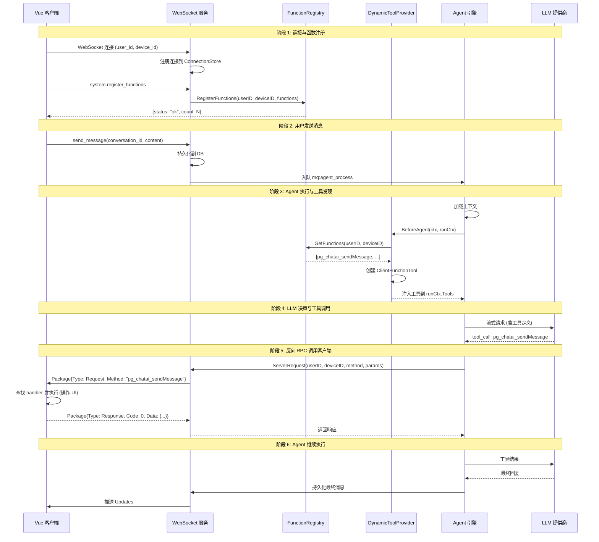
```mermaid
sequenceDiagram
    participant Vue as Vue 客户端
    participant WS as WebSocket 服务
    participant FR as FunctionRegistry
    participant DTP as DynamicToolProvider
    participant Agent as Agent 引擎
    participant LLM as LLM 提供商

    Note over Vue,LLM: 阶段 1: 连接与函数注册
    Vue->>WS: WebSocket 连接 (user_id, device_id)
    WS->>WS: 注册连接到 ConnectionStore
    Vue->>WS: system.register_functions
    WS->>FR: RegisterFunctions(userID, deviceID, functions)
    FR-->>Vue: {status: "ok", count: N}

    Note over Vue,LLM: 阶段 2: 用户发送消息
    Vue->>WS: send_message(conversation_id, content)
    WS->>WS: 持久化到 DB
    WS->>Agent: 入队 mq:agent_process

    Note over Vue,LLM: 阶段 3: Agent 执行与工具发现
    Agent->>Agent: 加载上下文
    Agent->>DTP: BeforeAgent(ctx, runCtx)
    DTP->>FR: GetFunctions(userID, deviceID)
    FR-->>DTP: [pg_chatai_sendMessage, ...]
    DTP->>DTP: 创建 ClientFunctionTool
    DTP-->>Agent: 注入工具到 runCtx.Tools

    Note over Vue,LLM: 阶段 4: LLM 决策与工具调用
    Agent->>LLM: 流式请求 (含工具定义)
    LLM-->>Agent: tool_call: pg_chatai_sendMessage

    Note over Vue,LLM: 阶段 5: 反向 RPC 调用客户端
    Agent->>WS: ServerRequest(userID, deviceID, method, params)
    WS->>Vue: Package{Type: Request, Method: "pg_chatai_sendMessage"}
    Vue->>Vue: 查找 handler 并执行 (操作 UI)
    Vue-->>WS: Package{Type: Response, Code: 0, Data: {...}}
    WS-->>Agent: 返回响应

    Note over Vue,LLM: 阶段 6: Agent 继续执行
    Agent->>LLM: 工具结果
    LLM-->>Agent: 最终回复
    Agent->>WS: 持久化最终消息
    WS->>Vue: 推送 Updates
```

---

## 阶段 1: 客户端连接与函数注册

### 1.1 WebSocket 连接建立

**详细文档**: [websocket-connection.md](websocket-connection.md), [client-registration.md](client-registration.md)

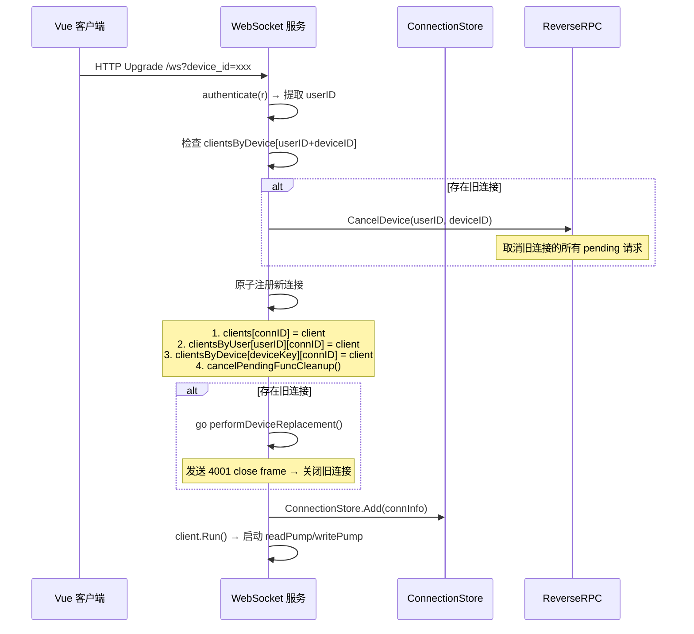
```mermaid
sequenceDiagram
    participant Vue as Vue 客户端
    participant WS as WebSocket 服务
    participant CS as ConnectionStore
    participant RL as ReverseRPC

    Vue->>WS: HTTP Upgrade /ws?device_id=xxx
    WS->>WS: authenticate(r) → 提取 userID
    WS->>WS: 检查 clientsByDevice[userID+deviceID]

    alt 存在旧连接
        WS->>RL: CancelDevice(userID, deviceID)
        Note over RL: 取消旧连接的所有 pending 请求
    end

    WS->>WS: 原子注册新连接
    Note over WS: 1. clients[connID] = client<br/>2. clientsByUser[userID][connID] = client<br/>3. clientsByDevice[deviceKey][connID] = client<br/>4. cancelPendingFuncCleanup()

    alt 存在旧连接
        WS->>WS: go performDeviceReplacement()
        Note over WS: 发送 4001 close frame → 关闭旧连接
    end

    WS->>CS: ConnectionStore.Add(connInfo)
    WS->>WS: client.Run() → 启动 readPump/writePump
```

**客户端实现** (TypeScript):

```typescript
// xyncra-client-core/src/connection-manager.ts
async connect(signal: AbortSignal): Promise<void> {
  const url = `${this.serverURL}/ws?device_id=${this.deviceID}`;
  this.ws = this.wsFactory.create(url);
  // 认证通过 URL 参数或 headers 传递
  // 连接建立后自动进入 readPump/writePump
}
```

### 1.2 函数注册 (system.register_functions)

**详细文档**: [function-registry.md](function-registry.md) 场景 1-2

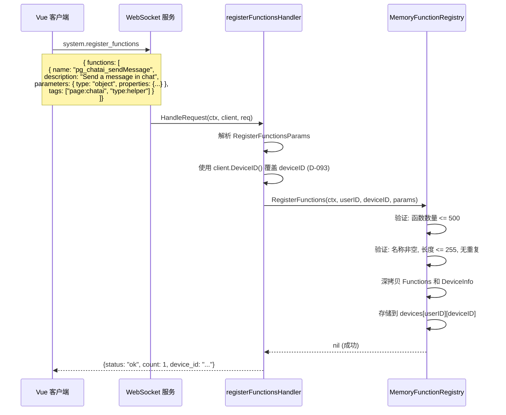
```mermaid
sequenceDiagram
    participant Vue as Vue 客户端
    participant WS as WebSocket 服务
    participant RH as registerFunctionsHandler
    participant FR as MemoryFunctionRegistry

    Vue->>WS: system.register_functions
    Note over Vue,WS: { functions: [<br/>  { name: "pg_chatai_sendMessage",<br/>    description: "Send a message in chat",<br/>    parameters: { type: "object", properties: {...} },<br/>    tags: ["page:chatai", "type:helper"] }<br/>]}

    WS->>RH: HandleRequest(ctx, client, req)
    RH->>RH: 解析 RegisterFunctionsParams
    RH->>RH: 使用 client.DeviceID() 覆盖 deviceID (D-093)

    RH->>FR: RegisterFunctions(ctx, userID, deviceID, params)
    FR->>FR: 验证: 函数数量 <= 500
    FR->>FR: 验证: 名称非空, 长度 <= 255, 无重复
    FR->>FR: 深拷贝 Functions 和 DeviceInfo
    FR->>FR: 存储到 devices[userID][deviceID]

    FR-->>RH: nil (成功)
    RH-->>Vue: {status: "ok", count: 1, device_id: "..."}
```

**客户端实现** (Vue Demo):

```typescript
// packages/xyncra-client-vue/src/defineTestHelpers.ts
defineTestHelpers('chatai', {
  sendMessage: {
    name: 'sendMessage',
    description: 'Send a message in chat',
    parameters: { type: 'object', properties: {} },
    handler: (args) => {
      // 操作 Vue UI
      console.log('chatai sendMessage', args);
    },
  },
});

// 内部调用链:
// 1. useRegisterFunctions(functionEntries)
// 2. registry.register(info, handler)
// 3. XyncraClient.setFunctions(fns)
// 4. XyncraClient.reregisterFunctions()
// 5. this.call('system.register_functions', { functions: fns })
```

**函数命名规则**:

```
格式: pg_{pageKey}_{functionName}
示例: pg_chatai_sendMessage, pg_dashboard_refreshCharts
```

### 1.3 重连握手 (C11)

**详细文档**: [reconnection.md](reconnection.md)

连接建立后，客户端自动执行重连握手：

```typescript
// xyncra-client-core/src/xyncra-client.ts
private async performReconnectHandshake(): Promise<void> {
  // Step 1: 先注册函数（确保服务端有 handler）
  await this.reregisterFunctions();

  // Step 2: 发送 reconnect（携带 last_seen_seq）
  await this.call('system.reconnect', {
    last_seen_seq: this.lastReqSeq,
  });
}
```

**顺序很重要**: 先 `system.register_functions`，再 `system.reconnect`。因为 `system.reconnect` 可能触发 PendingStore 重放，如果函数未注册，重放的请求会因找不到 handler 而失败。

---

## 阶段 2: 用户发送消息触发 Agent

### 2.1 消息发送与 Agent 触发

**详细文档**: [message.md](message.md), [agent.md](agent.md)

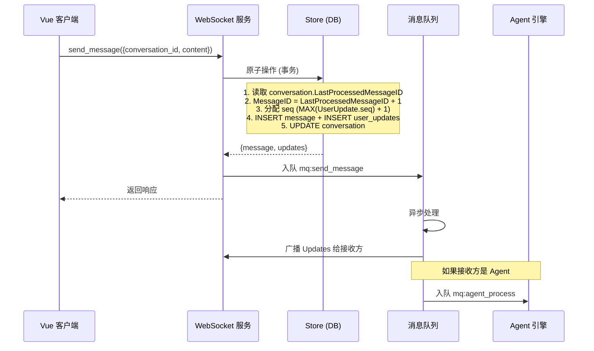
```mermaid
sequenceDiagram
    participant Vue as Vue 客户端
    participant WS as WebSocket 服务
    participant Store as Store (DB)
    participant MQ as 消息队列
    participant Agent as Agent 引擎

    Vue->>WS: send_message({conversation_id, content})
    WS->>Store: 原子操作 (事务)
    Note over Store: 1. 读取 conversation.LastProcessedMessageID<br/>2. MessageID = LastProcessedMessageID + 1<br/>3. 分配 seq (MAX(UserUpdate.seq) + 1)<br/>4. INSERT message + INSERT user_updates<br/>5. UPDATE conversation
    Store-->>WS: {message, updates}
    WS->>MQ: 入队 mq:send_message
    WS-->>Vue: 返回响应

    MQ->>MQ: 异步处理
    MQ->>WS: 广播 Updates 给接收方

    Note over MQ,Agent: 如果接收方是 Agent
    MQ->>Agent: 入队 mq:agent_process
```

---

## 阶段 3: Agent 执行与动态工具注入

### 3.1 Agent 构建与执行

**详细文档**: [agent.md](agent.md), [agent-execution.md](agent-execution.md)

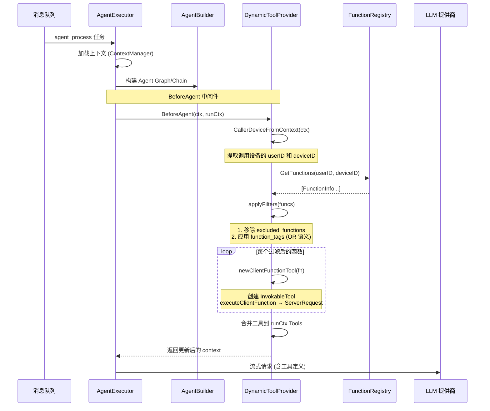
```mermaid
sequenceDiagram
    participant MQ as 消息队列
    participant Executor as AgentExecutor
    participant Builder as AgentBuilder
    participant DTP as DynamicToolProvider
    participant FR as FunctionRegistry
    participant LLM as LLM 提供商

    MQ->>Executor: agent_process 任务
    Executor->>Executor: 加载上下文 (ContextManager)
    Executor->>Builder: 构建 Agent Graph/Chain

    Note over Executor,DTP: BeforeAgent 中间件
    Executor->>DTP: BeforeAgent(ctx, runCtx)
    DTP->>DTP: CallerDeviceFromContext(ctx)
    Note over DTP: 提取调用设备的 userID 和 deviceID

    DTP->>FR: GetFunctions(userID, deviceID)
    FR-->>DTP: [FunctionInfo...]

    DTP->>DTP: applyFilters(funcs)
    Note over DTP: 1. 移除 excluded_functions<br/>2. 应用 function_tags (OR 语义)

    loop 每个过滤后的函数
        DTP->>DTP: newClientFunctionTool(fn)
        Note over DTP: 创建 InvokableTool<br/>executeClientFunction → ServerRequest
    end

    DTP->>DTP: 合并工具到 runCtx.Tools
    DTP-->>Executor: 返回更新后的 context

    Executor->>LLM: 流式请求 (含工具定义)
```

### 3.2 DynamicToolProvider 工具注入

**详细文档**: [function-registry.md](function-registry.md) 场景 4

```typescript
// internal/agent/dynamic_tool_provider.go
func (d *DynamicToolProvider) BeforeAgent(ctx context.Context, runCtx *agent.RunContext) {
    // 1. 提取设备上下文
    device, ok := CallerDeviceFromContext(ctx)
    if !ok {
        return // 无设备上下文，跳过
    }

    // 2. 获取注册的函数
    funcs, err := d.funcRegistry.GetFunctions(ctx, device.UserID, device.DeviceID)
    if err != nil {
        // fail-open: 记录日志，继续执行
        return
    }

    // 3. 过滤函数
    funcs = d.applyFilters(funcs)

    // 4. 创建工具实例
    for _, fn := range funcs {
        tool := newClientFunctionTool(fn, device, d.reverseRPC, d.timeout)
        runCtx.Tools = append(runCtx.Tools, tool)
    }
}
```

### 3.3 ClientFunctionTool 结构

**详细文档**: [function-registry.md](function-registry.md) 场景 8

```typescript
// internal/agent/client_function_tool.go
type ClientFunctionTool struct {
    info       schema.ToolInfo  // 工具元数据 (名称、描述、参数 Schema)
    userID     string
    deviceID   string
    reverseRPC ReverseRPC
    timeout    time.Duration
}

func (t *ClientFunctionTool) InvokableRun(ctx context.Context, input string) (string, error) {
    // 1. 确定超时: 函数级 > 默认级 > 30s
    timeout := t.resolveTimeout()

    // 2. 调用反向 RPC
    resp, err := t.reverseRPC.ServerRequest(
        ctx, t.userID, t.deviceID,
        t.info.Name, input, timeout,
    )

    // 3. 处理响应
    if err != nil {
        return formatClientToolError(err), nil // soft failure
    }
    if resp.Code < 0 {
        return fmt.Sprintf("client returned error (code %d): %s", resp.Code, resp.Msg), nil
    }

    return fmt.Sprintf("%v", resp.Data), nil
}
```

---

## 阶段 4: 反向 RPC 调用客户端函数

### 4.1 服务端发起请求

**详细文档**: [reverse-rpc.md](reverse-rpc.md) 场景 1

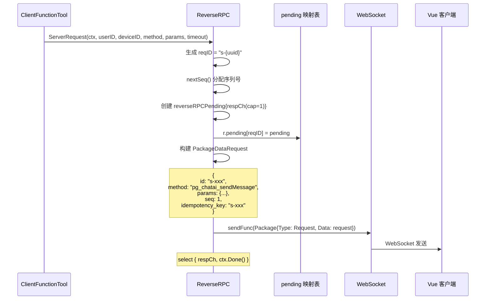
```mermaid
sequenceDiagram
    participant Tool as ClientFunctionTool
    participant RPC as ReverseRPC
    participant Pending as pending 映射表
    participant WS as WebSocket
    participant Client as Vue 客户端

    Tool->>RPC: ServerRequest(ctx, userID, deviceID, method, params, timeout)
    RPC->>RPC: 生成 reqID = "s-{uuid}"
    RPC->>RPC: nextSeq() 分配序列号
    RPC->>RPC: 创建 reverseRPCPending{respCh(cap=1)}

    RPC->>Pending: r.pending[reqID] = pending
    RPC->>RPC: 构建 PackageDataRequest
    Note over RPC: {<br/>  id: "s-xxx",<br/>  method: "pg_chatai_sendMessage",<br/>  params: {...},<br/>  seq: 1,<br/>  idempotency_key: "s-xxx"<br/>}

    RPC->>WS: sendFunc(Package{Type: Request, Data: request})
    WS->>Client: WebSocket 发送

    Note over RPC: select { respCh, ctx.Done() }
```

### 4.2 客户端处理请求

**详细文档**: [function-registry.md](function-registry.md) 场景 5

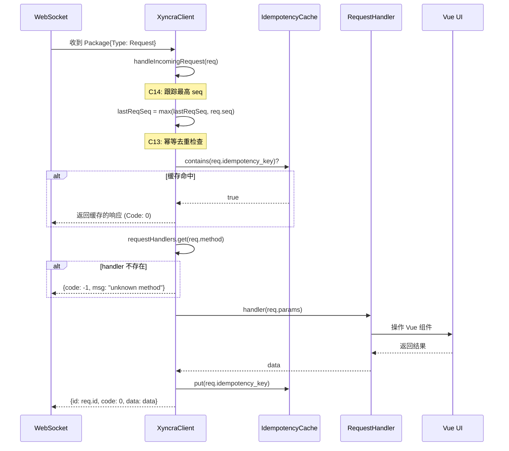
```mermaid
sequenceDiagram
    participant WS as WebSocket
    participant Client as XyncraClient
    participant Cache as IdempotencyCache
    participant Handler as RequestHandler
    participant UI as Vue UI

    WS->>Client: 收到 Package{Type: Request}
    Client->>Client: handleIncomingRequest(req)

    Note over Client: C14: 跟踪最高 seq
    Client->>Client: lastReqSeq = max(lastReqSeq, req.seq)

    Note over Client: C13: 幂等去重检查
    Client->>Cache: contains(req.idempotency_key)?
    alt 缓存命中
        Cache-->>Client: true
        Client-->>WS: 返回缓存的响应 (Code: 0)
    end

    Client->>Client: requestHandlers.get(req.method)
    alt handler 不存在
        Client-->>WS: {code: -1, msg: "unknown method"}
    end

    Client->>Handler: handler(req.params)
    Handler->>UI: 操作 Vue 组件
    UI-->>Handler: 返回结果
    Handler-->>Client: data

    Client->>Cache: put(req.idempotency_key)
    Client-->>WS: {id: req.id, code: 0, data: data}
```

**客户端实现** (TypeScript):

```typescript
// xyncra-client-core/src/xyncra-client.ts
private async handleIncomingRequest(request: PackageDataRequest): Promise<void> {
  // C14: 跟踪最高 seq
  if (request.seq !== undefined && request.seq > 0) {
    if (request.seq > this.lastReqSeq) {
      this.lastReqSeq = request.seq;
    }
  }

  // C13: 幂等去重检查
  const idempotencyKey = request.idempotency_key ?? '';
  if (idempotencyKey && this.idempotencyCache.contains(idempotencyKey)) {
    this.sendResponse({
      id: request.id,
      code: 0,
      msg: 'duplicate (idempotency cache hit)',
      data: null,
    });
    return;
  }

  // 查找 handler
  const handler = this.requestHandlers.get(request.method);
  if (!handler) {
    this.sendResponse({
      id: request.id,
      code: -1,
      msg: `unknown method: ${request.method}`,
      data: null,
    });
    return;
  }

  // 执行 handler
  try {
    const data = await handler(request);
    this.sendResponse({ id: request.id, code: 0, msg: 'ok', data });
  } catch (error) {
    this.sendResponse({
      id: request.id,
      code: -1,
      msg: error instanceof Error ? error.message : String(error),
      data: null,
    });
  }

  // 记录幂等键
  if (idempotencyKey) {
    this.idempotencyCache.put(idempotencyKey);
  }
}
```

### 4.3 响应路由

**详细文档**: [reverse-rpc.md](reverse-rpc.md) 场景 3

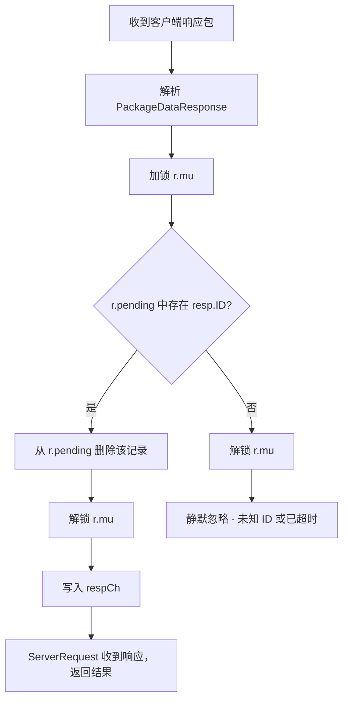
```mermaid
flowchart TD
    A[收到客户端响应包] --> B[解析 PackageDataResponse]
    B --> C[加锁 r.mu]
    C --> D{r.pending 中存在 resp.ID?}
    D -->|是| E[从 r.pending 删除该记录]
    E --> F[解锁 r.mu]
    F --> G[写入 respCh]
    G --> H[ServerRequest 收到响应，返回结果]

    D -->|否| I[解锁 r.mu]
    I --> J[静默忽略 - 未知 ID 或已超时]
```

```go
// internal/server/reverse_rpc.go
func (r *ReverseRPC) DispatchResponse(resp *PackageDataResponse) {
    r.mu.Lock()
    pending, ok := r.pending[resp.ID]
    if ok {
        delete(r.pending, resp.ID)
    }
    r.mu.Unlock()

    if !ok {
        return // 未知 ID 或已超时
    }

    // 非阻塞写入
    select {
    case pending.respCh <- resp:
    default:
        // respCh 已满，静默丢弃
    }
}
```

---

## 阶段 5: 超时、持久化与重放

### 5.1 超时处理

**详细文档**: [reverse-rpc.md](reverse-rpc.md) 场景 2

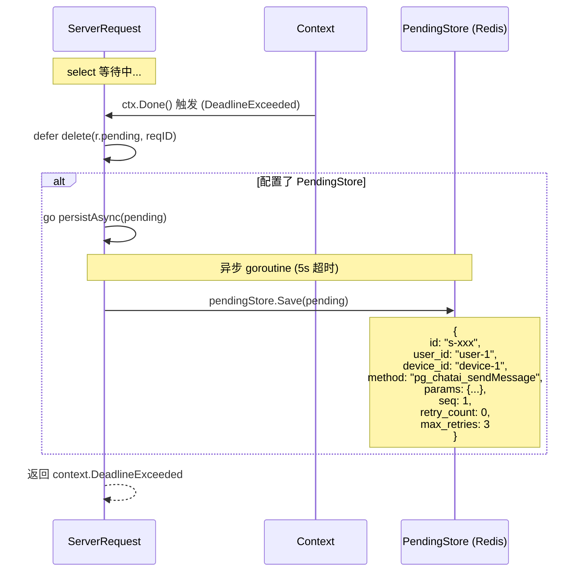
```mermaid
sequenceDiagram
    participant RPC as ServerRequest
    participant CTX as Context
    participant Store as PendingStore (Redis)

    Note over RPC: select 等待中...
    CTX->>RPC: ctx.Done() 触发 (DeadlineExceeded)
    RPC->>RPC: defer delete(r.pending, reqID)

    alt 配置了 PendingStore
        RPC->>RPC: go persistAsync(pending)
        Note over RPC,Store: 异步 goroutine (5s 超时)
        RPC->>Store: pendingStore.Save(pending)
        Note over Store: {<br/>  id: "s-xxx",<br/>  user_id: "user-1",<br/>  device_id: "device-1",<br/>  method: "pg_chatai_sendMessage",<br/>  params: {...},<br/>  seq: 1,<br/>  retry_count: 0,<br/>  max_retries: 3<br/>}
    end

    RPC-->>RPC: 返回 context.DeadlineExceeded
```

### 5.2 设备重连与重放

**详细文档**: [reverse-rpc.md](reverse-rpc.md) 场景 7, [reconnection.md](reconnection.md)

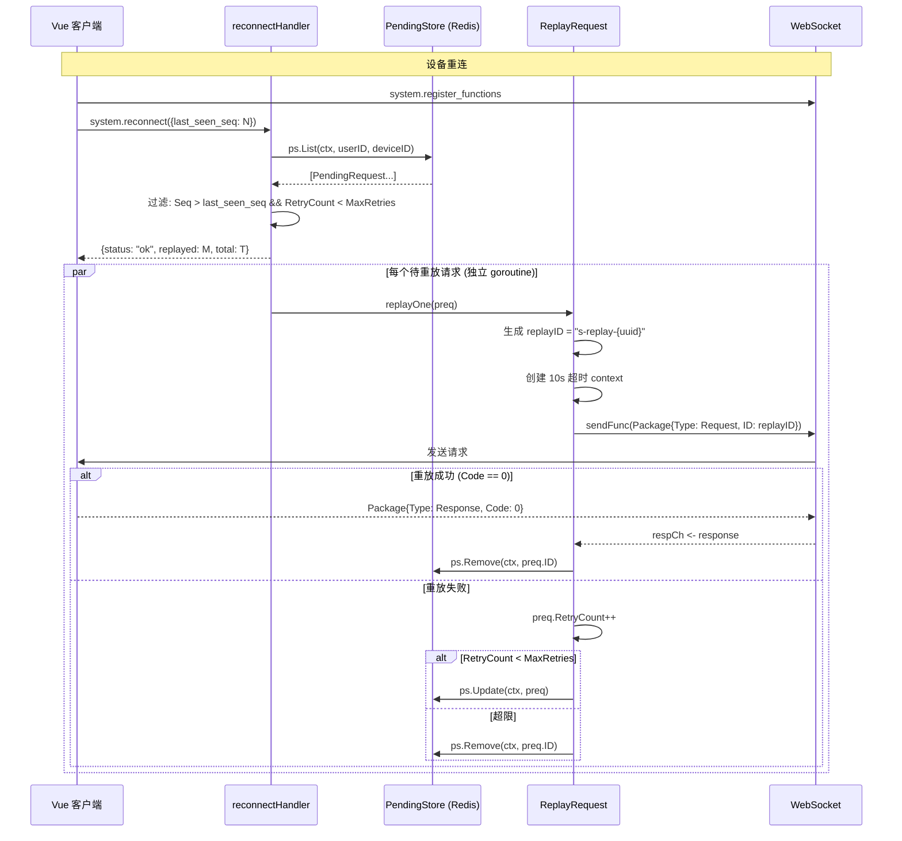
```mermaid
sequenceDiagram
    participant Client as Vue 客户端
    participant RH as reconnectHandler
    participant Store as PendingStore (Redis)
    participant RR as ReplayRequest
    participant WS as WebSocket

    Note over Client,WS: 设备重连
    Client->>WS: system.register_functions
    Client->>RH: system.reconnect({last_seen_seq: N})

    RH->>Store: ps.List(ctx, userID, deviceID)
    Store-->>RH: [PendingRequest...]

    RH->>RH: 过滤: Seq > last_seen_seq && RetryCount < MaxRetries

    RH-->>Client: {status: "ok", replayed: M, total: T}

    par 每个待重放请求 (独立 goroutine)
        RH->>RR: replayOne(preq)
        RR->>RR: 生成 replayID = "s-replay-{uuid}"
        RR->>RR: 创建 10s 超时 context
        RR->>WS: sendFunc(Package{Type: Request, ID: replayID})
        WS->>Client: 发送请求

        alt 重放成功 (Code == 0)
            Client-->>WS: Package{Type: Response, Code: 0}
            WS-->>RR: respCh <- response
            RR->>Store: ps.Remove(ctx, preq.ID)
        else 重放失败
            RR->>RR: preq.RetryCount++
            alt RetryCount < MaxRetries
                RR->>Store: ps.Update(ctx, preq)
            else 超限
                RR->>Store: ps.Remove(ctx, preq.ID)
            end
        end
    end
```

### 5.3 设备断开时取消请求

**详细文档**: [reverse-rpc.md](reverse-rpc.md) 场景 4, 5, [function-registry.md](function-registry.md) 场景 3, 7

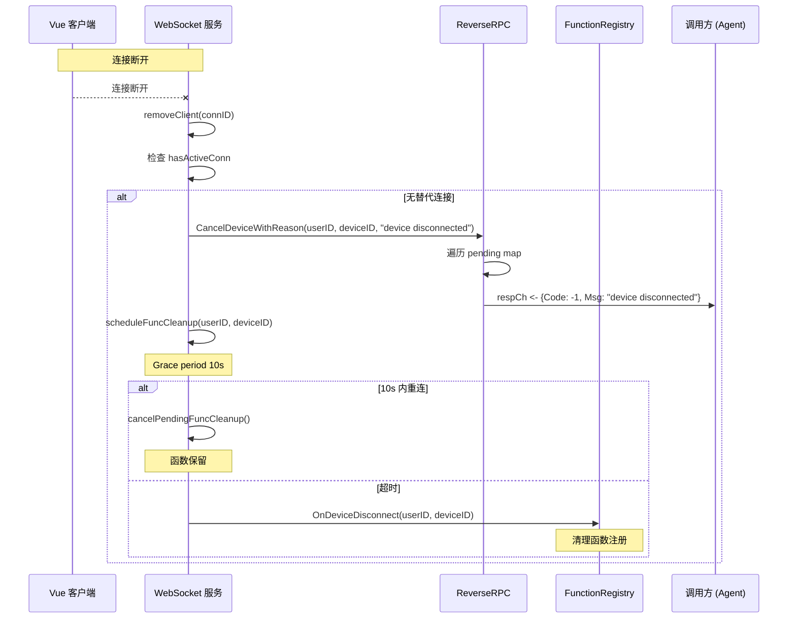
```mermaid
sequenceDiagram
    participant Client as Vue 客户端
    participant WS as WebSocket 服务
    participant RPC as ReverseRPC
    participant FR as FunctionRegistry
    participant Caller as 调用方 (Agent)

    Note over Client,WS: 连接断开
    Client--xWS: 连接断开

    WS->>WS: removeClient(connID)
    WS->>WS: 检查 hasActiveConn

    alt 无替代连接
        WS->>RPC: CancelDeviceWithReason(userID, deviceID, "device disconnected")
        RPC->>RPC: 遍历 pending map
        RPC->>Caller: respCh <- {Code: -1, Msg: "device disconnected"}

        WS->>WS: scheduleFuncCleanup(userID, deviceID)
        Note over WS: Grace period 10s
        alt 10s 内重连
            WS->>WS: cancelPendingFuncCleanup()
            Note over WS: 函数保留
        else 超时
            WS->>FR: OnDeviceDisconnect(userID, deviceID)
            Note over FR: 清理函数注册
        end
    end
```

---

## 阶段 6: Agent 继续执行

### 6.1 工具结果处理

**详细文档**: [function-registry.md](function-registry.md) 场景 8

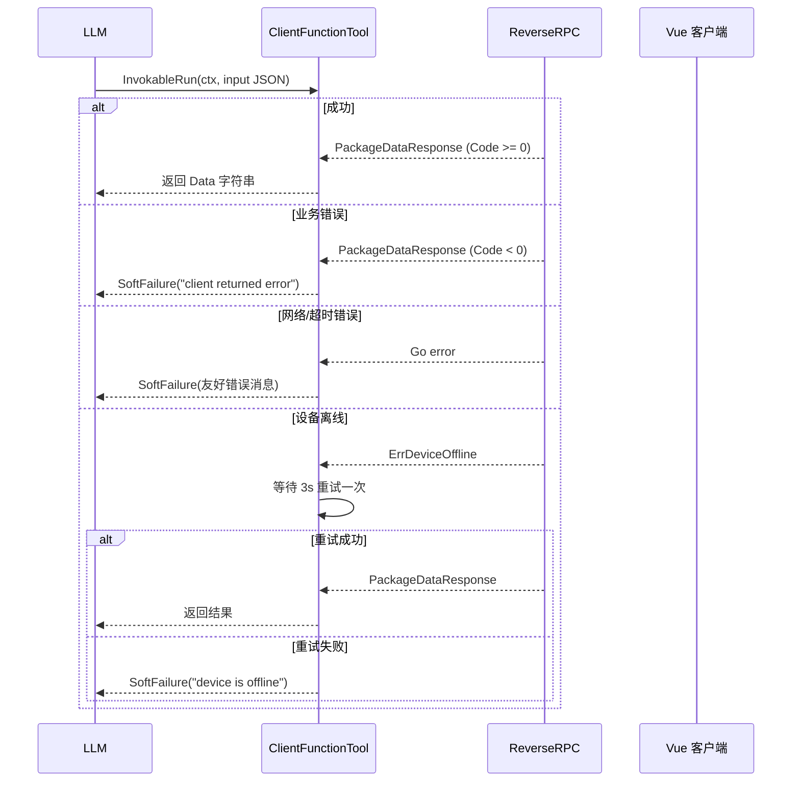
```mermaid
sequenceDiagram
    participant LLM as LLM
    participant Tool as ClientFunctionTool
    participant RPC as ReverseRPC
    participant Client as Vue 客户端

    LLM->>Tool: InvokableRun(ctx, input JSON)

    alt 成功
        RPC-->>Tool: PackageDataResponse (Code >= 0)
        Tool-->>LLM: 返回 Data 字符串
    else 业务错误
        RPC-->>Tool: PackageDataResponse (Code < 0)
        Tool-->>LLM: SoftFailure("client returned error")
    else 网络/超时错误
        RPC-->>Tool: Go error
        Tool-->>LLM: SoftFailure(友好错误消息)
    else 设备离线
        RPC-->>Tool: ErrDeviceOffline
        Tool->>Tool: 等待 3s 重试一次
        alt 重试成功
            RPC-->>Tool: PackageDataResponse
            Tool-->>LLM: 返回结果
        else 重试失败
            Tool-->>LLM: SoftFailure("device is offline")
        end
    end
```

### 6.2 软失败 (SoftFailure)

所有工具调用失败都通过 `SoftFailure` 返回内容而非 Go error，让 LLM 可以自行决定：

- **超时**: "tool call failed: request timed out. The client device may be slow or unresponsive."
- **设备离线**: "tool call failed: device is offline. The client device is not currently connected."
- **已持久化**: "tool call failed: device is temporarily offline. The request has been queued..."
- **业务错误**: "client returned error (code N): msg"

```go
// internal/agent/client_function_tool.go
func formatClientToolError(err error) string {
    errStr := err.Error()
    switch {
    case strings.Contains(errStr, "deadline exceeded") || strings.Contains(errStr, "timeout"):
        return "tool call failed: request timed out..."
    case strings.Contains(errStr, "persisted for replay"):
        return "tool call failed: device is temporarily offline..."
    case strings.Contains(errStr, "no connections") || strings.Contains(errStr, "device"):
        return "tool call failed: device is offline..."
    default:
        return "tool call failed: unable to reach the device..."
    }
}
```

### 6.3 Agent 流式输出与持久化

**详细文档**: [agent.md](agent.md), [stream-text.md](stream-text.md)

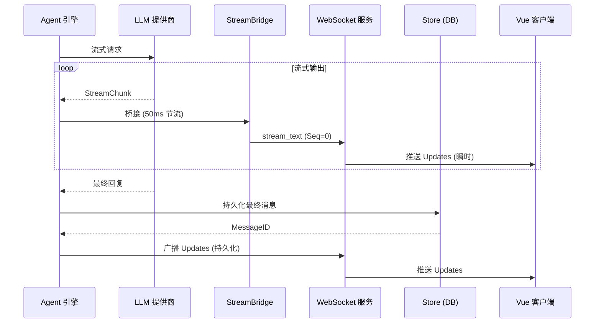
```mermaid
sequenceDiagram
    participant Agent as Agent 引擎
    participant LLM as LLM 提供商
    participant SB as StreamBridge
    participant WS as WebSocket 服务
    participant Store as Store (DB)
    participant Vue as Vue 客户端

    Agent->>LLM: 流式请求
    loop 流式输出
        LLM-->>Agent: StreamChunk
        Agent->>SB: 桥接 (50ms 节流)
        SB->>WS: stream_text (Seq=0)
        WS->>Vue: 推送 Updates (瞬时)
    end

    LLM-->>Agent: 最终回复
    Agent->>Store: 持久化最终消息
    Store-->>Agent: MessageID
    Agent->>WS: 广播 Updates (持久化)
    WS->>Vue: 推送 Updates
```

---

## 完整时序图 (端到端)

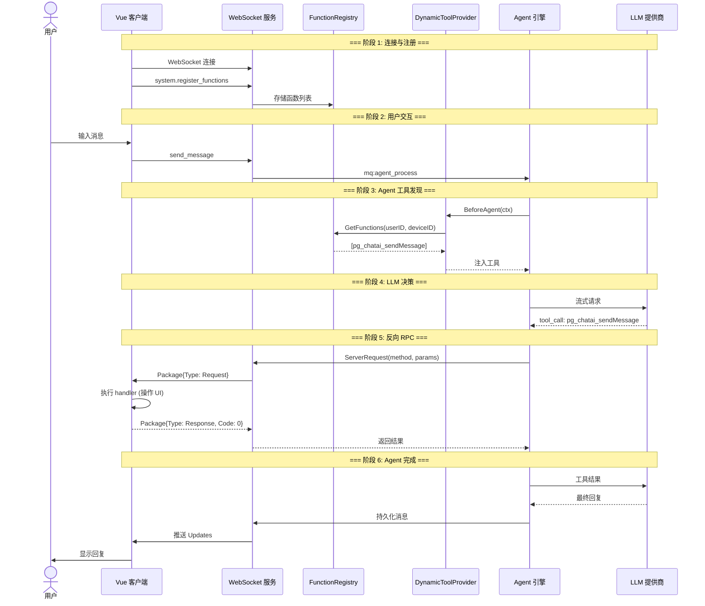
```mermaid
sequenceDiagram
    actor User as 用户
    participant Vue as Vue 客户端
    participant WS as WebSocket 服务
    participant FR as FunctionRegistry
    participant DTP as DynamicToolProvider
    participant Agent as Agent 引擎
    participant LLM as LLM 提供商

    Note over Vue,LLM: === 阶段 1: 连接与注册 ===
    Vue->>WS: WebSocket 连接
    Vue->>WS: system.register_functions
    WS->>FR: 存储函数列表

    Note over Vue,LLM: === 阶段 2: 用户交互 ===
    User->>Vue: 输入消息
    Vue->>WS: send_message
    WS->>Agent: mq:agent_process

    Note over Vue,LLM: === 阶段 3: Agent 工具发现 ===
    Agent->>DTP: BeforeAgent(ctx)
    DTP->>FR: GetFunctions(userID, deviceID)
    FR-->>DTP: [pg_chatai_sendMessage]
    DTP-->>Agent: 注入工具

    Note over Vue,LLM: === 阶段 4: LLM 决策 ===
    Agent->>LLM: 流式请求
    LLM-->>Agent: tool_call: pg_chatai_sendMessage

    Note over Vue,LLM: === 阶段 5: 反向 RPC ===
    Agent->>WS: ServerRequest(method, params)
    WS->>Vue: Package{Type: Request}
    Vue->>Vue: 执行 handler (操作 UI)
    Vue-->>WS: Package{Type: Response, Code: 0}
    WS-->>Agent: 返回结果

    Note over Vue,LLM: === 阶段 6: Agent 完成 ===
    Agent->>LLM: 工具结果
    LLM-->>Agent: 最终回复
    Agent->>WS: 持久化消息
    WS->>Vue: 推送 Updates
    Vue->>User: 显示回复
```

---

## 关键设计决策

| 编号 | 决策 | 理由 |
|------|------|------|
| D-072 | fail-open 错误处理 | 动态工具注入失败不阻塞 Agent 执行 |
| D-092 | RequestHandlerFunc 模式 | 客户端注册 handler，服务端通过 method 路由 |
| D-093 | deviceID 覆盖 | 安全措施，防止客户端伪造设备身份 |
| D-094 | 服务器自动生成 deviceID | 确保每个连接有唯一标识 |
| D-101 | 注册函数自动注入为工具 | 弥合客户端函数与 Agent 工具的差距 |
| D-103 | 超时请求持久化 | 支持断线重连后的请求重放 |
| D-111 | 4001 关闭码 | 设备替换时优雅退出而非重连 |
| C11 | 重连握手顺序 | 先 register_functions 再 reconnect |
| C13 | 幂等去重 | 防止重放请求被重复执行 |
| C14 | lastReqSeq 跟踪 | 用于 reconnect 过滤已处理请求 |

---

## 错误处理矩阵

| 场景 | 服务端行为 | 客户端行为 | Agent 行为 |
|------|----------|----------|----------|
| 客户端未注册函数 | GetFunctions 返回空列表 | - | 跳过客户端工具注入 |
| 函数注册验证失败 | 返回 ValidationError | 收到错误响应 | - |
| 反向 RPC 超时 | 持久化到 PendingStore | - | SoftFailure |
| 设备离线 | ErrDeviceOffline | - | SoftFailure |
| 重放请求幂等命中 | - | 返回缓存响应 | - |
| 设备重连 | CancelDevice + 重放 | 重新注册函数 | - |
| 函数清理 grace period | scheduleFuncCleanup | - | - |

---

## 示例：Vue Demo 完整流程

### 1. 页面定义函数

```vue
<!-- src/views/chatai/index.vue -->
<script setup lang="ts">
import { defineTestHelpers } from '@xyncra/client-vue'

defineTestHelpers('chatai', {
  sendMessage: {
    name: 'sendMessage',
    description: 'Send a message in chat',
    parameters: {
      type: 'object',
      properties: {
        content: { type: 'string', description: 'Message content' },
      },
      required: ['content'],
    },
    handler: (args) => {
      // 操作 Vue UI
      const chatStore = useChatStore()
      chatStore.sendMessage(args.content)
    },
  },
  clearChat: {
    name: 'clearChat',
    description: 'Clear chat history',
    parameters: { type: 'object', properties: {} },
    handler: () => {
      const chatStore = useChatStore()
      chatStore.clearMessages()
    },
  },
})
</script>
```

### 2. 注册流程

```
defineTestHelpers('chatai', { sendMessage, clearChat })
  │
  ├─ registerComponent('chatai', { sendMessage, clearChat })
  │  → 挂载到 window.XyncraTestHelpers.chatai
  │
  ├─ useRegisterFunctions([
  │    { info: { name: 'pg_chatai_sendMessage', ... }, handler: ... },
  │    { info: { name: 'pg_chatai_clearChat', ... }, handler: ... },
  │  ])
  │  │
  │  ├─ onMounted: registry.register(info, handler)
  │  │  → XyncraClient.setFunctions([...])
  │  │  → XyncraClient.reregisterFunctions()
  │  │  → call('system.register_functions', { functions: [...] })
  │  │
  │  └─ onUnmounted: registry.batchUnregister([...])
  │     → XyncraClient.setFunctions([])
  │     → call('system.register_functions', { functions: [] })
  │
  └─ 完成
```

### 3. Agent 调用流程

```
用户: "帮我发送一条消息 'Hello World'"
  │
  ├─ Agent 收到消息
  ├─ DynamicToolProvider 注入 pg_chatai_sendMessage
  ├─ LLM 决策: 调用 pg_chatai_sendMessage({content: "Hello World"})
  │
  ├─ ServerRequest(userID, deviceID, "pg_chatai_sendMessage", {content: "Hello World"})
  │  → WebSocket 发送到 Vue 客户端
  │
  ├─ Vue 客户端 handleIncomingRequest
  │  → 查找 requestHandlers.get("pg_chatai_sendMessage")
  │  → 执行 handler({content: "Hello World"})
  │  → chatStore.sendMessage("Hello World")
  │  → UI 更新
  │  → 返回 {success: true}
  │
  ├─ 服务端收到响应
  ├─ Agent 继续执行
  ├─ LLM: "已成功发送消息 'Hello World'"
  │
  └─ 用户看到回复
```

---

## 总结

Xyncra 的端到端反向 RPC 流程实现了 **AI Agent 主动操作客户端 UI** 的能力：

1. **函数注册**: 客户端通过 `system.register_functions` 声明可调用函数
2. **动态工具注入**: Agent 执行前，`DynamicToolProvider` 从 `FunctionRegistry` 获取函数并注入为工具
3. **反向 RPC**: Agent 调用工具时，服务端通过 `ServerRequest` 向客户端发送请求
4. **客户端执行**: 客户端查找 handler 并执行，操作 UI 后返回结果
5. **错误恢复**: 超时请求持久化到 `PendingStore`，设备重连时自动重放

整个流程通过幂等去重、grace period、fail-open 等机制保证了健壮性和可靠性。
