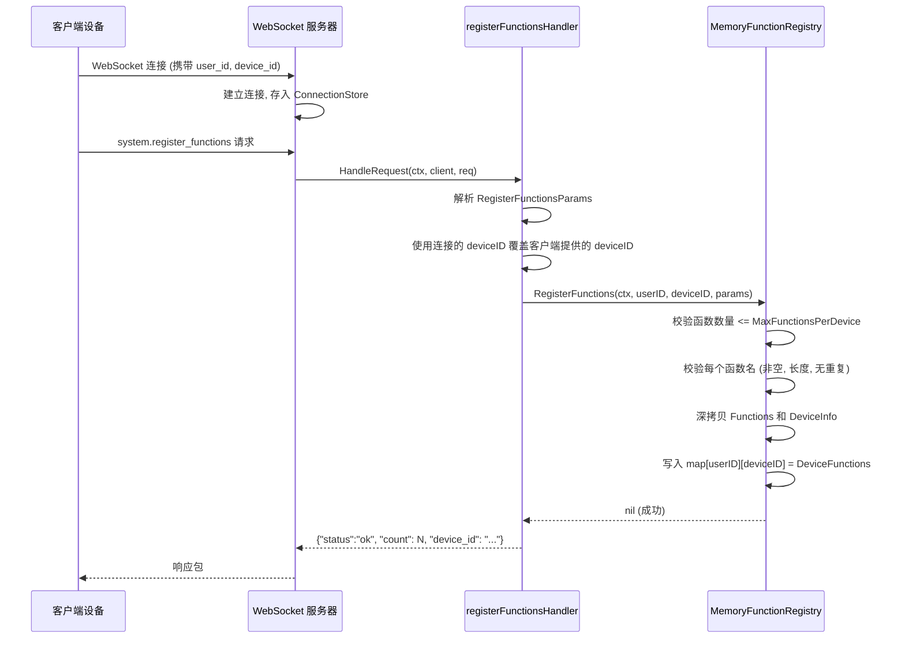
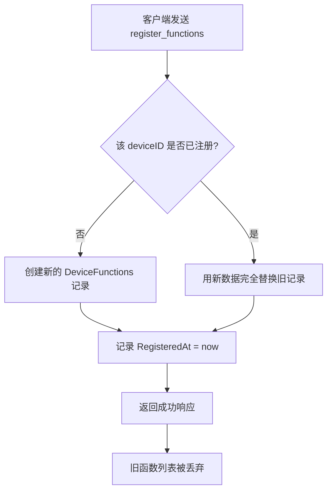
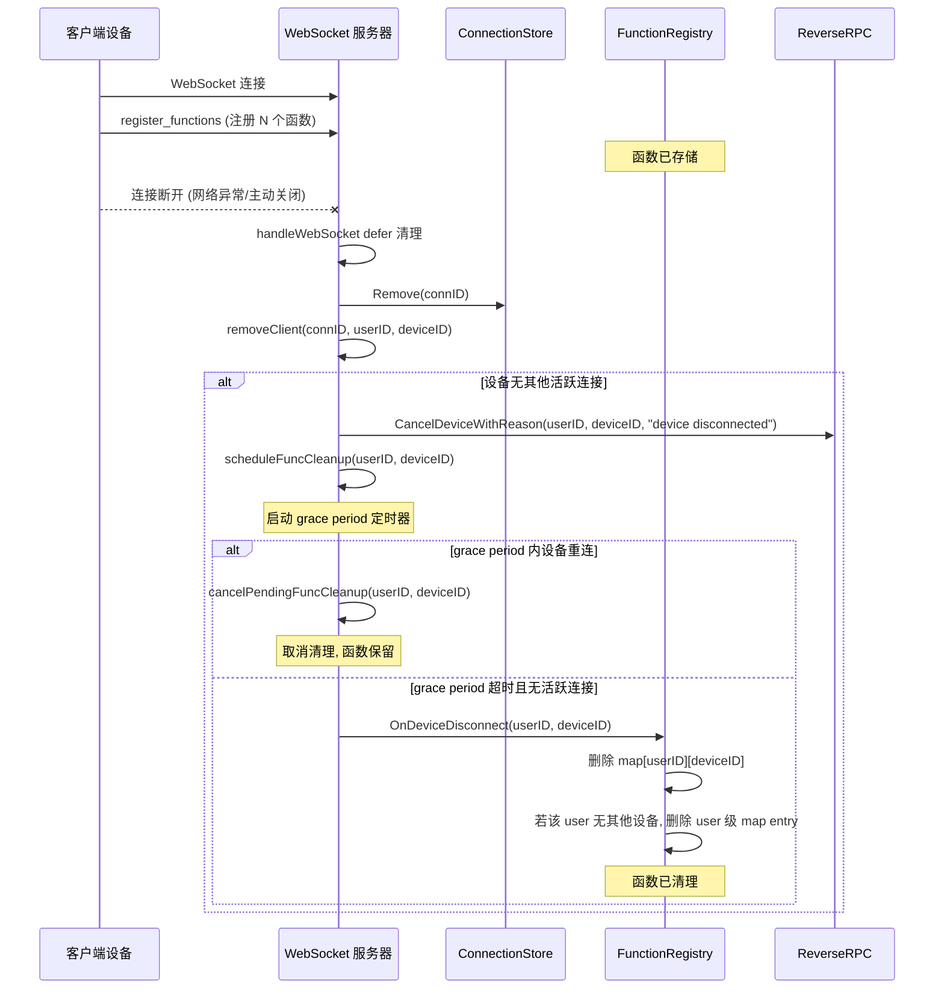
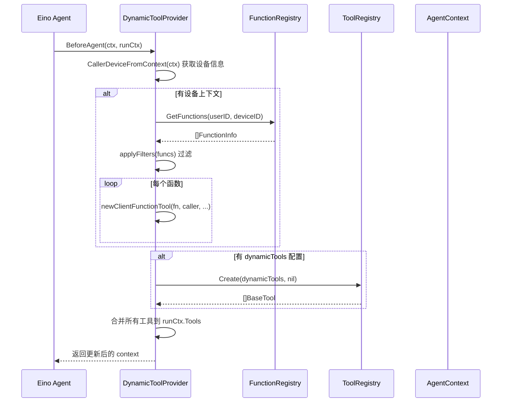
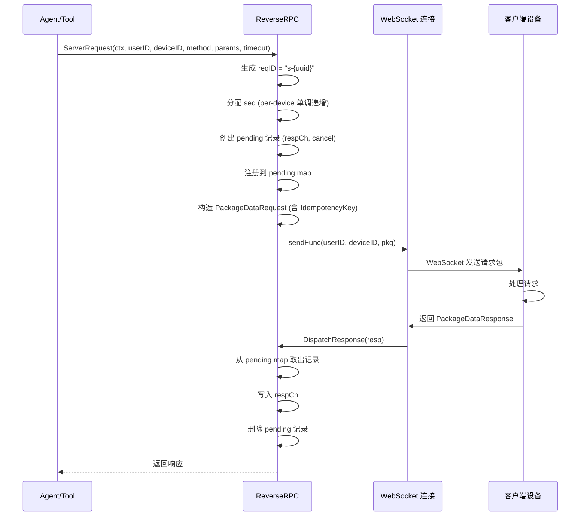
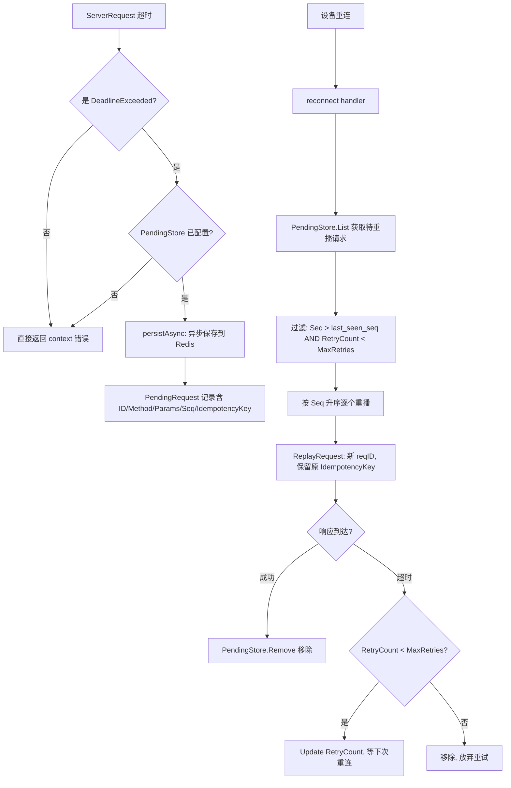
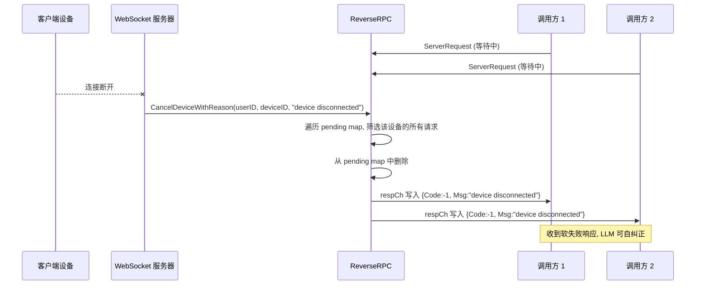
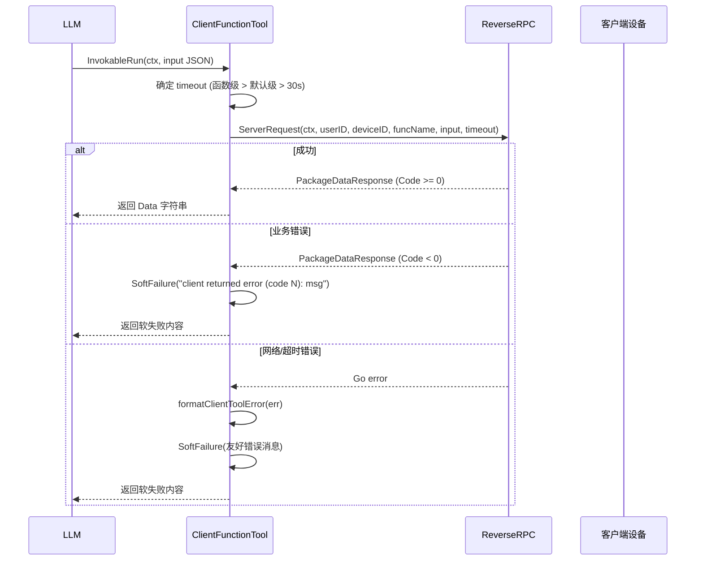
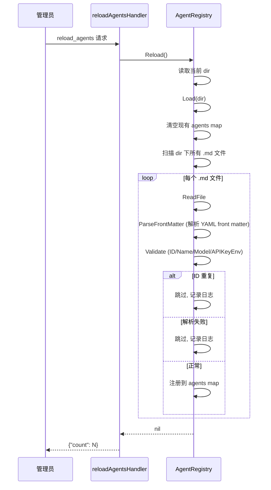
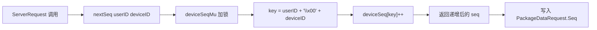

# 函数注册 & 动态工具 & 反向 RPC

> 客户端函数的注册、发现、注入、远程调用的完整生命周期。

## 场景 1: 客户端函数注册

### 主流程

### 边缘场景

#### 1. 函数名为空

- 触发条件: 注册的 FunctionInfo 中 Name 字段为空字符串
- 处理逻辑: RegisterFunctions 遍历时检测到 `fn.Name == ""`，立即返回 `ErrFunctionNameEmpty`
- 最终结果: Handler 将其映射为 `protocol.NewValidationError`，客户端收到校验错误

#### 2. 函数名超长

- 触发条件: 函数名长度超过 `MaxFunctionNameLength`（默认 255）
- 处理逻辑: 返回 `ErrFunctionNameTooLong`
- 最终结果: 客户端收到校验错误

#### 3. 函数名重复

- 触发条件: 同一次注册请求中包含两个同名函数
- 处理逻辑: 使用 `seen` map 去重检测，返回 `ErrFunctionNameDuplicate`
- 最终结果: 客户端收到校验错误，注册不生效

#### 4. 超过设备函数数量上限

- 触发条件: 注册函数数量超过 `MaxFunctionsPerDevice`（默认 500）
- 处理逻辑: 在遍历校验前先检查 `len(params.Functions) > max`，返回 `ErrMaxFunctionsPerDevice`
- 最终结果: 客户端收到校验错误

#### 5. deviceID 覆盖

- 触发条件: 客户端在 params 中提供了一个 deviceID
- 处理逻辑: Handler 忽略客户端提供的 deviceID，强制使用连接建立时认证的 `client.DeviceID()`
- 最终结果: 连接级 deviceID 始终为权威来源

### 涉及文件

- `internal/handler/register_functions.go`: 解析请求、deviceID 覆盖、调用注册表、错误映射
- `internal/server/function_registry.go`: 校验逻辑、内存存储、深拷贝隔离
- `pkg/protocol/function.go`: FunctionInfo / ReturnInfo 协议定义

---

## 场景 2: 函数全量替换 (更新)

### 主流程

### 边缘场景

#### 1. 空函数列表清除注册

- 触发条件: 客户端发送空的 Functions 数组
- 处理逻辑: 空数组通过校验，写入后该 deviceID 的函数列表为空
- 最终结果: DeviceFunctions 记录仍存在（DeviceInfo 保留），但函数列表为空

#### 2. 并发写同一设备

- 触发条件: 多个 goroutine 同时对同一 (userID, deviceID) 调用 RegisterFunctions
- 处理逻辑: `sync.RWMutex` 的写锁保证互斥，last-writer-wins 语义
- 最终结果: 注册完成后只有一个版本生效，不会出现数据损坏

### 涉及文件

- `internal/server/function_registry.go`: RegisterFunctions 的全量替换实现

---

## 场景 3: 客户端断开后函数清理

### 主流程

### 边缘场景

#### 1. 幂等断开清理

- 触发条件: OnDeviceDisconnect 被多次调用（例如竞态条件）
- 处理逻辑: 若 deviceID 不存在，直接返回 `(nil, nil)`，不报错
- 最终结果: 幂等安全，多次调用不会 panic 或返回错误

#### 2. 断开不影响其他设备

- 触发条件: 同一用户下有多个设备，其中一个断开
- 处理逻辑: OnDeviceDisconnect 只删除目标 deviceID 的条目，其他设备不受影响
- 最终结果: 其他设备的函数注册保持不变

#### 3. 设备替换场景下的函数保留

- 触发条件: 同一 (userID, deviceID) 的新连接建立时旧连接被踢出
- 处理逻辑: 新连接到达时调用 `cancelPendingFuncCleanup` 取消旧连接的延迟清理，避免页面导航期间函数被误删。CancelDevice 在 Upgrade 前执行，取消旧连接的 pending RPC 请求
- 最终结果: 函数注册保留（因为清理被取消），新连接无需重新注册函数

#### 4. Grace period 机制

- 触发条件: 设备断开连接后，函数清理不立即执行
- 处理逻辑: `scheduleFuncCleanup` 启动一个带有 grace period 的定时器。如果设备在 grace period 内重连，`cancelPendingFuncCleanup` 取消清理。只有 grace period 超时且无活跃连接时，才调用 `OnDeviceDisconnect`
- 最终结果: 避免页面导航期间（短暂断开后立即重连）函数被误删

### 涉及文件

- `internal/server/function_registry.go`: OnDeviceDisconnect 实现
- `internal/server/websocket_server.go`: scheduleFuncCleanup、cancelPendingFuncCleanup、removeClient
- `internal/server/function_lifecycle_test.go`: 断开清理、设备替换、多设备隔离测试

---

## 场景 4: 动态工具注入 (Agent 运行时)

### 主流程

### 边缘场景

#### 1. 无设备上下文时跳过客户端函数

- 触发条件: CallerDeviceFromContext 返回 false（非设备发起的调用）
- 处理逻辑: 跳过整个客户端函数注入分支，只处理 dynamicTools
- 最终结果: Agent 正常运行，仅使用静态工具

#### 2. GetFunctions 失败 (fail-open)

- 触发条件: 函数注册表查询出错
- 处理逻辑: 记录错误日志，跳过客户端函数注入，不阻塞 Agent 执行
- 最终结果: Agent 继续运行，只是没有客户端工具

#### 3. 单个工具创建失败 (fail-open per function)

- 触发条件: 某个函数的 JSON Schema 解析失败
- 处理逻辑: 记录该函数的错误日志，continue 跳过，其他函数正常创建
- 最终结果: 部分工具可用，不影响其他工具

#### 4. 函数过滤：标签匹配

- 触发条件: AgentConfig 中配置了 `function_tags`
- 处理逻辑: applyFilters 使用 OR 语义，函数只要有一个 tag 匹配即保留
- 最终结果: 只有匹配标签的函数被注入为工具

#### 5. 函数过滤：排除列表

- 触发条件: AgentConfig 中配置了 `excluded_functions`
- 处理逻辑: 排除检查优先于标签检查，精确匹配函数名
- 最终结果: 被排除的函数不会出现在工具列表中

#### 6. 空 Parameters 处理

- 触发条件: FunctionInfo.Parameters 为 nil 或空 map
- 处理逻辑: buildToolInfo 将其规范化为 `{"type":"object","properties":{}}`
- 最终结果: 避免 LLM 层将空 schema 转为 `parameters: true` 导致 400 错误

### 涉及文件

- `internal/agent/dynamic_tool_provider.go`: BeforeAgent 中间件、applyFilters 过滤逻辑
- `internal/agent/client_function_tool.go`: buildToolInfo 构建 schema、executeClientFunction 执行调用
- `internal/agent/config.go`: MiddlewareConfig、ClientToolsConfig 配置定义
- `internal/agent/context_keys.go`: CallerDevice 上下文传递

---

## 场景 5: 反向 RPC 调用 (正常路径)

### 主流程

### 边缘场景

#### 1. 超时处理

- 触发条件: 客户端未在 timeout 内响应
- 处理逻辑: `ctx.Done()` 触发，若为 `DeadlineExceeded` 且配置了 PendingStore，异步持久化请求
- 最终结果: 返回 `context.DeadlineExceeded` 错误，请求被保存供后续重播

#### 2. 发送失败

- 触发条件: sendFunc 返回错误（设备离线/连接断开）
- 处理逻辑: 立即返回错误，不进入 select 等待
- 最终结果: 直接报错

#### 3. 响应到达时 pending 已清理 (迟到响应)

- 触发条件: 超时后 pending 记录被 defer 删除，此时客户端响应才到达
- 处理逻辑: DispatchResponse 在 pending map 中找不到对应 ID，静默忽略
- 最终结果: 无副作用，不 panic

#### 4. respCh 已满时写入

- 触发条件: respCh（buffered cap=1）已有数据时再次写入
- 处理逻辑: select-default 模式，写不进去就跳过
- 最终结果: 不阻塞 DispatchResponse 的调用方

### 涉及文件

- `internal/server/reverse_rpc.go`: ServerRequest、DispatchResponse、persistAsync
- `internal/agent/client_function_tool.go`: executeClientFunction 调用 ServerRequest

---

## 场景 6: 反向 RPC 超时持久化与重播

### 主流程

### 边缘场景

#### 1. PendingStore 保存失败

- 触发条件: Redis 不可用或网络异常
- 处理逻辑: persistAsync 在独立 goroutine 中执行，5s 超时，失败仅记录日志（fail-open）
- 最终结果: 请求丢失但不影响主流程

#### 2. 幂等性保证

- 触发条件: 同一请求被重播多次
- 处理逻辑: IdempotencyKey（等于原始 reqID）保持不变，客户端侧去重
- 最终结果: 客户端对相同 IdempotencyKey 只执行一次

#### 3. 达到最大重试次数

- 触发条件: RetryCount >= MaxRetries（默认 3）
- 处理逻辑: 请求被移除，不再重播
- 最终结果: 持久化请求被丢弃

#### 4. last_seen_seq 过滤

- 触发条件: 客户端在 system.reconnect 请求中携带 last_seen_seq 参数
- 处理逻辑: 只重播 Seq > last_seen_seq 的请求，跳过客户端已见过的请求
- 最终结果: 避免重复执行客户端已处理过的请求（即使服务端未收到响应）

#### 5. PendingStore 容量限制

- 触发条件: 单设备 pending 请求超过 MaxPendingPerDevice（默认 50）
- 处理逻辑: Redis RPush + LTrim 保留最新的 N 条，旧的被丢弃
- 最终结果: 防止单设备无限堆积

### 涉及文件

- `internal/server/reverse_rpc.go`: persistAsync、ReplayRequest
- `internal/server/pending_store.go`: PendingStore 接口、PendingRequest 模型
- `internal/server/redis_pending_store.go`: RedisPendingStore 实现
- `internal/handler/reconnect.go`: reconnect handler 调用 List + ReplayRequest

---

## 场景 7: 设备断开时取消所有待处理 RPC

### 主流程

### 边缘场景

#### 1. 设备替换时的取消

- 触发条件: 同一 (userID, deviceID) 新连接建立
- 处理逻辑: CancelDevice 使用默认 reason "device replaced"
- 最终结果: 旧连接的所有待处理请求被取消

#### 2. 服务器关闭时取消所有

- 触发条件: CancelAll 被调用（shutdown）
- 处理逻辑: 遍历所有 pending 请求，写入 `{Code:-1, Msg:"reverse rpc cancelled"}`
- 最终结果: 所有待处理请求被取消

#### 3. 软失败映射

- 触发条件: executeClientFunction 收到 Code < 0 的响应
- 处理逻辑: 使用 `agenttools.SoftFailure` 包装，返回内容而非 Go error
- 最终结果: LLM 看到错误原因并可自行决定重试或通知用户

### 涉及文件

- `internal/server/reverse_rpc.go`: CancelDeviceWithReason、CancelDevice、CancelAll
- `internal/agent/client_function_tool.go`: executeClientFunction 中的软失败处理

---

## 场景 8: 客户端函数工具执行 (Agent 调用远程函数)

### 主流程

### 边缘场景

#### 1. 超时优先级

- 触发条件: 函数定义了 timeout_ms，同时 Agent 配置了 call_timeout
- 处理逻辑: 函数级 timeout_ms > Agent 默认 call_timeout > 30s 硬编码兜底
- 最终结果: 使用最具体的超时值

#### 2. LLM 友好的错误消息

- 触发条件: 底层错误为 deadline exceeded 或 device offline
- 处理逻辑: formatClientToolError 将底层错误映射为 LLM 可理解的描述性消息
- 最终结果: LLM 能根据错误消息决定重试或告知用户

#### 3. 软失败不中断 Agent

- 触发条件: 任何工具调用失败（网络/业务/超时）
- 处理逻辑: 所有失败都通过 SoftFailure 返回内容而非 Go error
- 最终结果: Agent 运行不中断，LLM 可自行处理失败

### 涉及文件

- `internal/agent/client_function_tool.go`: newClientFunctionTool、executeClientFunction、buildToolInfo、formatClientToolError

---

## 场景 9: Agent 配置热重载

### 主流程

### 边缘场景

#### 1. 目录不存在

- 触发条件: agents 目录路径不存在
- 处理逻辑: `os.IsNotExist(err)` 返回 true 时 Load 返回 nil（可选模块）
- 最终结果: 不报错，count 为 0

#### 2. registry 为 nil

- 触发条件: reloadAgentsHandler 的 registry 字段为 nil
- 处理逻辑: 直接返回 `{"count": 0}`，不报错
- 最终结果: 兼容未配置 Agent 的场景

#### 3. Agent ID 重复

- 触发条件: 多个 .md 文件解析出相同的 AgentConfig.ID
- 处理逻辑: 后续的被跳过，记录日志
- 最终结果: 先加载的生效

#### 4. MCP 配置校验

- 触发条件: Agent 配置中包含 mcp_servers
- 处理逻辑: Validate 检查 MCP name 非空且唯一、transport 有效、URL/Command 必填
- 最终结果: 无效 MCP 配置会导致整个 Agent 被跳过

### 涉及文件

- `internal/handler/reload_agents.go`: reloadAgentsHandler
- `internal/agent/registry.go`: AgentRegistry.Load、Reload、IsAgent
- `internal/agent/config.go`: AgentConfig.Validate、MCPServerConfig 校验

---

## 场景 10: Per-Device 序列号分配

### 主流程

### 边缘场景

#### 1. 不同设备独立计数

- 触发条件: 同一用户的两个不同设备各自发起 RPC
- 处理逻辑: key 包含 userID 和 deviceID，各自独立递增
- 最终结果: 每个设备的 seq 从 1 开始单调递增

#### 2. 并发安全

- 触发条件: 多个 goroutine 同时调用 nextSeq
- 处理逻辑: `deviceSeqMu` 互斥锁保护
- 最终结果: seq 不会出现重复或跳号

### 涉及文件

- `internal/server/reverse_rpc.go`: nextSeq 方法
