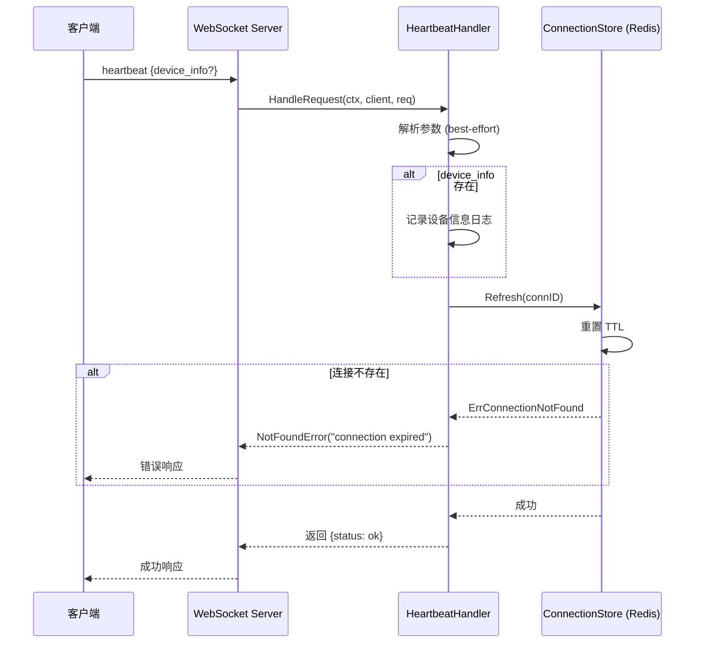
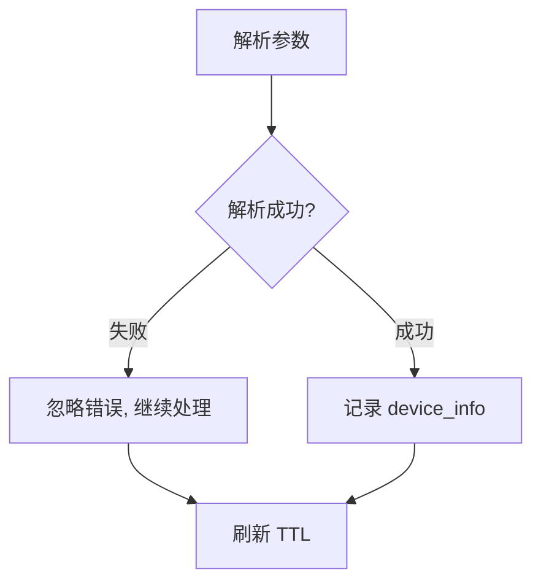
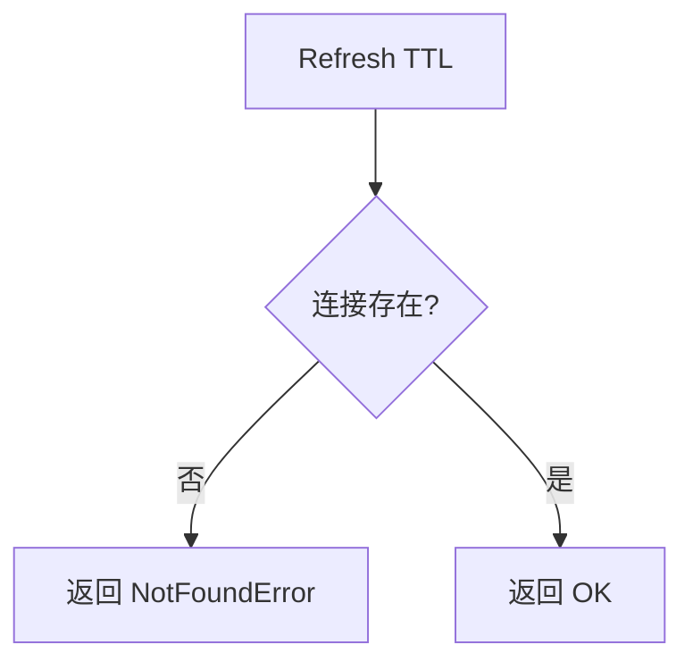
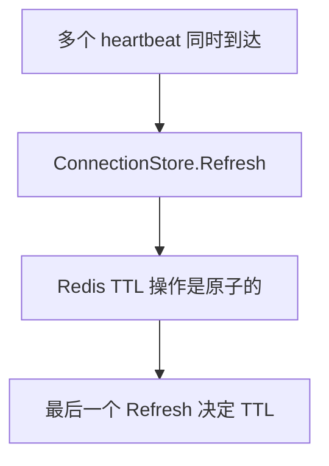
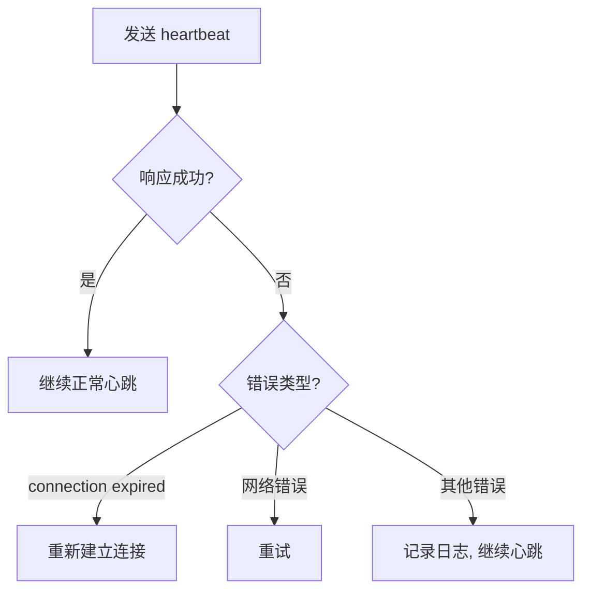

# Heartbeat 业务流程

本文档描述 `heartbeat` RPC 方法的完整业务流程，包括主流程、边缘场景和依赖关系。

---

## 目录

- [概述](#概述)
- [主流程](#主流程)
- [边缘场景](#边缘场景)
- [依赖关系](#依赖关系)
- [关键设计决策](#关键设计决策)

---

## 概述

`heartbeat` 是一个轻量级 RPC 方法，用于维持 WebSocket 连接的活跃状态。采用被动续期策略（D-010）：每次 heartbeat 调用都会重置连接在 Redis 中的 TTL，而不需要写入连接的元数据字段。

### 触发条件

- 客户端定期发送 heartbeat（建议间隔 < TTL/2）
- 服务端被动续期连接 TTL
- TTL 过期后连接被自动清理

### 关键特性

- **Passive renewal**：仅刷新 TTL，不更新元数据
- **Optional device info**：可携带设备信息用于可观测性
- **Best-effort params**：参数解析失败不影响 heartbeat
- **Connection expiry detection**：连接过期时返回错误

---

## 主流程



### 详细步骤

1. **解析参数**（best-effort）：尝试解析 `device_info`，失败不影响主流程
2. **记录设备信息**：如果 `device_info` 存在，记录到日志（仅可观测性，不持久化）
3. **刷新连接 TTL**：调用 `ConnectionStore.Refresh(connID)`
4. **处理结果**：
   - 成功：返回 `{status: ok}`
   - 连接不存在：返回 `NotFoundError("connection expired")`
   - 其他错误：返回 `InternalError`

---

## 边缘场景

### 1. 参数解析失败



| 场景 | 处理方式 |
|------|----------|
| JSON 格式错误 | 忽略错误，继续处理 heartbeat |
| 参数字段类型错误 | 忽略错误，继续处理 heartbeat |

**设计原因**：heartbeat 的唯一目的是维持连接，参数解析失败不应阻止续期。

### 2. 连接过期



| 场景 | 处理方式 |
|------|----------|
| 连接已过期 | 返回 `NotFoundError('connection expired')` |
| 连接已被清理 | 返回 `NotFoundError('connection expired')` |
| Redis 不可达 | 返回 `InternalError` |

**客户端行为**：收到 `connection expired` 错误后，客户端应重新建立 WebSocket 连接。

### 3. 并发 Refresh



| 场景 | 处理方式 |
|------|----------|
| 同一连接多个 heartbeat 并发 | Redis TTL 操作是原子的，安全并发 |

---

## 依赖关系

### 内部依赖

| 组件 | 用途 |
|------|------|
| `server.ConnectionStore` | 刷新连接 TTL |

### 外部依赖

| 组件 | 用途 |
|------|------|
| Redis | ConnectionStore 的后端存储 |

### 数据库操作

| 操作 | 存储 | 说明 |
|------|------|------|
| EXPIRE | Redis | 重置连接 key 的 TTL |

---

## 关键设计决策

### 1. 被动续期策略 (D-010)

采用被动续期而非主动续期：
- **被动续期**：客户端发送 heartbeat 时才刷新 TTL
- **主动续期**：服务端定期扫描并刷新所有连接

**选择被动续期的原因**：
- 实现简单，无需后台扫描
- 客户端控制续期频率
- 减少 Redis 操作

### 2. Best-effort 参数解析

参数解析失败不影响 heartbeat：
- heartbeat 的唯一目的是维持连接
- device_info 仅用于可观测性
- 解析失败不应导致连接断开

### 3. Connection Expiry Detection

当连接已过期时返回错误：
- 客户端可以立即感知连接状态
- 避免客户端继续向无效连接发送消息
- 触发客户端重连逻辑

### 4. Device Info 仅记录不持久化

device_info 仅记录到日志：
- 用于可观测性和调试
- 不持久化到 Redis 或数据库
- 减少存储开销

---

## 客户端实现建议

### Heartbeat 间隔

```
建议间隔 < TTL / 2
```

例如 TTL 为 60 秒时，heartbeat 间隔应 < 30 秒。

### 错误处理



### 防抖

客户端应实现防抖逻辑：
- 用户活跃时自动发送 heartbeat
- 用户长时间不活跃时降低频率
- 避免不必要的网络开销

---

## 相关文档

- [WebSocket 连接管理](websocket-connection.md)
- [断线重连](reconnection.md)
- [ConnectionStore 实现](../architecture/connection-store.md)
