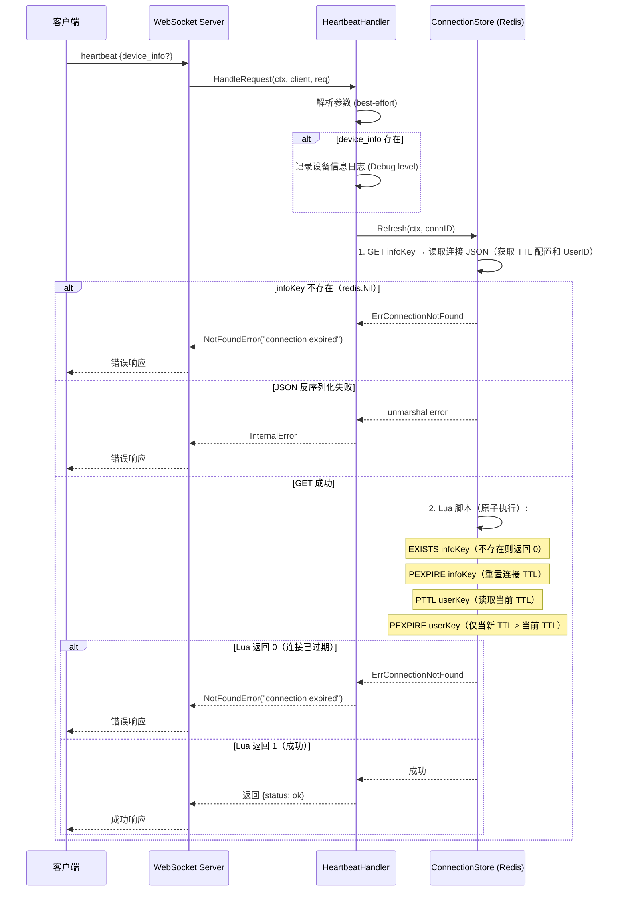
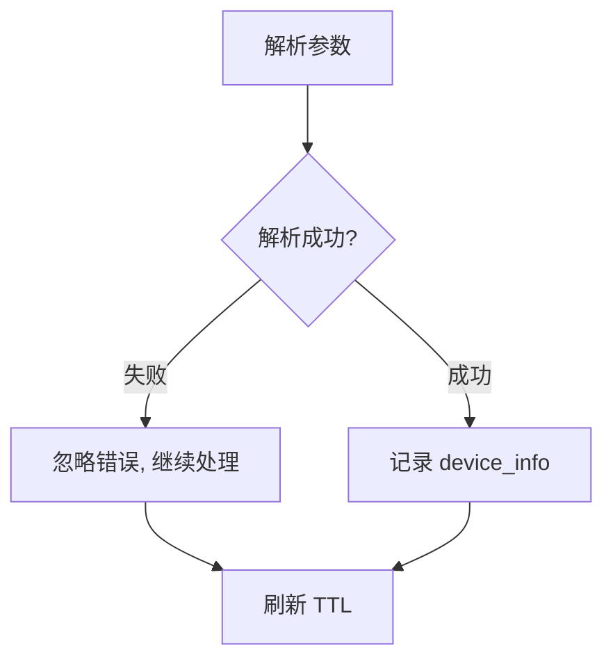
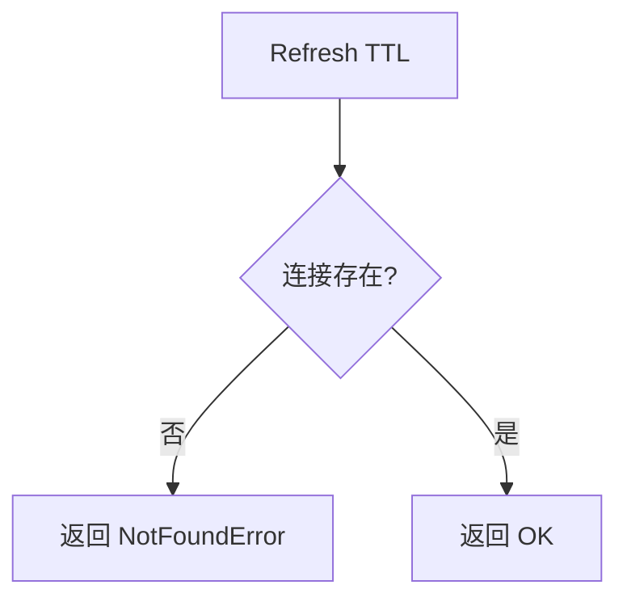
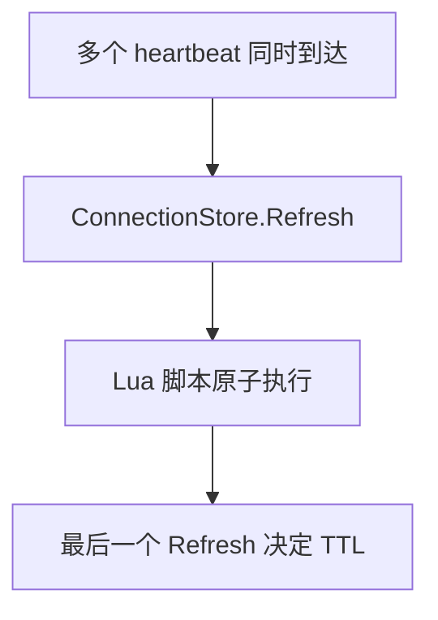
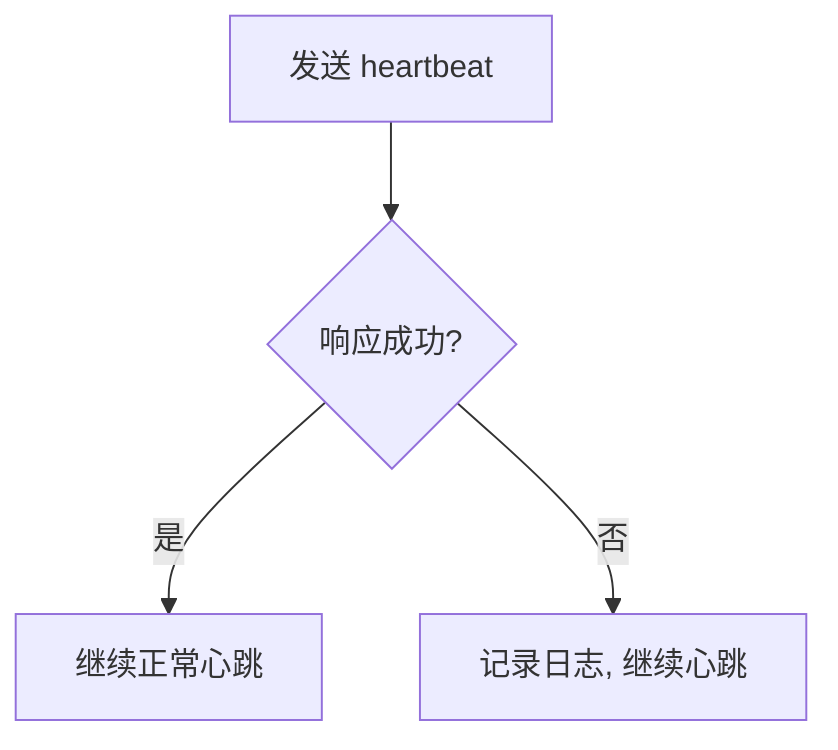

# Heartbeat 业务流程

本文档描述 `heartbeat` RPC 方法的完整业务流程，包括主流程、边缘场景和依赖关系。

---

## 目录

- [概述](#概述)
- [主流程](#主流程)
- [边缘场景](#边缘场景)
- [依赖关系](#依赖关系)
- [关键设计决策](#关键设计决策)
- [客户端实现](#客户端实现)

---

## 概述

`heartbeat` 是一个轻量级 RPC 方法，用于维持 WebSocket 连接的活跃状态。采用被动续期策略（D-010）：每次 heartbeat 调用都会重置连接在 Redis 中的 TTL，而不需要写入连接的元数据字段。

### 触发条件

- 客户端定期发送 heartbeat（建议间隔 < TTL/2）
- 服务端被动续期连接 TTL
- TTL 过期后连接被自动清理

### 关键特性

- **Passive renewal**：仅刷新 TTL，不更新元数据
- **Optional device info**：handler 支持接收设备信息用于可观测性，但当前 Go 和 TypeScript 客户端均不发送（Go 发送 `nil`，TS 发送 `null`）
- **Best-effort params**：参数解析失败不影响 heartbeat
- **Connection expiry detection**：连接过期时返回错误
- **No rate limiting**：heartbeat 不做频率限制，依赖客户端自律

---

## 主流程



### 详细步骤

1. **解析参数**（best-effort）：尝试解析 `device_info`，失败不影响主流程
2. **记录设备信息**：如果 `device_info` 存在，以 Debug 级别记录到日志（仅可观测性，不持久化）
3. **刷新连接 TTL**：调用 `ConnectionStore.Refresh(ctx, connID)`，内部流程：
   - **GET infoKey**：读取连接 info key 的 JSON 数据，获取 TTL 配置和 UserID
     - 若 key 不存在（`redis.Nil`），立即返回 `ErrConnectionNotFound`
     - 若 JSON 反序列化失败，立即返回错误
   - **Lua 脚本**（原子执行，仅在 GET 成功后执行）：
     - `EXISTS infoKey`：再次检查连接是否存在（防止 GET 与 Lua 之间 key 被淘汰），不存在则返回 0
     - `PEXPIRE infoKey`：重置连接 info key 的 TTL（毫秒精度）
     - `PTTL userKey`：读取 user SET key 的当前剩余 TTL（-1 = 无过期，-2 = key 不存在）
     - `PEXPIRE userKey`：仅当新 TTL > 当前 TTL 时才更新（MAX 语义）
   - 若 Lua 返回 0：连接在 GET 与 Lua 之间过期，返回 `ErrConnectionNotFound`
4. **TTL 解析**：使用连接自身的 `TTL` 字段；若为零或负数，回退到 ConnectionStore 的 `defaultTTL`（默认 30 分钟）
5. **处理结果**：
   - 成功：返回 `{status: ok}`
   - 连接不存在（GET 时 key 不存在或 Lua 返回 0）：返回 `NotFoundError("connection expired")`
   - JSON 反序列化失败：返回 `InternalError`
   - 其他错误（Redis 不可达等）：返回 `InternalError`

---

## 边缘场景

### 1. 参数解析失败



| 场景 | 处理方式 |
| --- | --- |
| JSON 格式错误 | 忽略错误，继续处理 heartbeat |
| 参数字段类型错误 | 忽略错误，继续处理 heartbeat |

**设计原因**：heartbeat 的唯一目的是维持连接，参数解析失败不应阻止续期。

### 2. 连接过期



| 场景 | 处理方式 |
| --- | --- |
| 连接已过期（GET 时 info key 已被 Redis 淘汰） | 返回 `NotFoundError('connection expired')`（GET 返回 `redis.Nil`） |
| 连接在 GET 与 Lua 之间过期（竞态） | 返回 `NotFoundError('connection expired')`（Lua 的 `EXISTS` 返回 0） |
| 连接已被 Remove 清理 | 返回 `NotFoundError('connection expired')` |
| Redis 不可达或超时 | 返回 `InternalError`（含分类后的错误：`ErrRedisTimeout` 或 `ErrRedisConnectionFailed`） |
| info key 数据损坏（JSON 反序列化失败） | 返回 `InternalError` |

**客户端行为**：收到 `connection expired` 错误后，heartbeatLoop 仅记录日志，不主动重连。连接断开后由 connectionMonitor 检测并触发重连。

### 3. 并发 Refresh



| 场景 | 处理方式 |
| --- | --- |
| 同一连接多个 heartbeat 并发 | Lua 脚本内 EXISTS + PEXPIRE 原子执行，安全并发 |

### 4. 空 connID

| 场景 | 处理方式 |
| --- | --- |
| connID 为空字符串 | `Refresh` 在发起 Redis 调用前返回 `fmt.Errorf("server: connection ID is required")`，handler 包装为 `InternalError` |

### 5. 用户 SET TTL MAX 语义

当多个连接属于同一用户时，user SET key 的 TTL 采用 MAX 语义：仅当新 TTL > 当前 TTL 时才更新。这避免了短 TTL 连接的心跳意外缩短长 TTL 连接的 user SET 有效期。

### 6. 心跳间隔大于连接 TTL

如果客户端心跳间隔超过服务端连接 TTL，连接会在心跳之间过期。下次心跳时 `Refresh` 返回 `ErrConnectionNotFound`，客户端收到 `connection expired` 错误。此时 connectionMonitor 需要重新建立连接。

**注意**：服务端返回 `connection expired` 错误时不会主动关闭 WebSocket 连接。connectionMonitor 仅在检测到 WebSocket 断开时才触发重连。如果服务端仅返回错误但保持 WebSocket 连接打开，客户端会处于降级状态：心跳持续失败，但 connectionMonitor 不会触发重连。当前实现中，服务端在连接过期后不会主动关闭 WebSocket，因此客户端依赖后续的 WebSocket 超时或 pong 失败来触发重连。

**建议**：心跳间隔 < TTL / 2（默认 TTL 30 分钟时，30 秒间隔安全裕量充足）。

### 7. 同一用户的多连接

心跳基于 connID 而非 userID，每个连接独立拥有自己的 TTL。多个连接的心跳互不影响，user SET key 的 TTL 采用 MAX 语义（见场景 5）。

### 8. Lua 脚本 PTTL 返回值

Lua 脚本中 `PTTL userKey` 的返回值有三种情况：

| PTTL 返回值 | 含义 | 处理方式 |
| --- | --- | --- |
| >= 0 | key 存在，剩余 TTL（毫秒） | 仅当新 TTL > 当前 TTL 时才更新（MAX 语义） |
| -1 | key 存在，但未设置过期时间 | `setPTTL < 0` 为 true，执行 PEXPIRE 设置 TTL |
| -2 | key 不存在 | `setPTTL < 0` 为 true，执行 PEXPIRE（Redis 会忽略对不存在的 key 的 PEXPIRE） |

### 9. GET 阶段的 Redis 错误

`Refresh` 的 GET 步骤可能返回非 `redis.Nil` 的错误（如网络超时、连接断开）。此时错误通过 `classifyRedisError` 分类后返回，handler 将其包装为 `InternalError` 返回给客户端。

| GET 错误类型 | classifyRedisError 分类 | handler 返回 |
| --- | --- | --- |
| context deadline exceeded | `ErrRedisTimeout` | `InternalError` |
| i/o timeout | `ErrRedisTimeout` | `InternalError` |
| connection refused | `ErrRedisConnectionFailed` | `InternalError` |
| connection reset | `ErrRedisConnectionFailed` | `InternalError` |
| broken pipe | `ErrRedisConnectionFailed` | `InternalError` |
| no such host | `ErrRedisConnectionFailed` | `InternalError` |
| dial tcp | `ErrRedisConnectionFailed` | `InternalError` |
| 其他错误 | 原样返回 | `InternalError` |

### 10. 客户端关闭后的 heartbeat

客户端 `heartbeatLoop` 在 `ctx.Done()` 时退出。如果客户端在 heartbeat RPC 进行中调用 `Stop()`：

1. `Stop()` 设置 `closed = true` 并取消 context
2. 若 `Call` 尚未进入 `select`：`Call` 检测到 `c.closed` 后立即返回 `ConnectionError("client is closed")`，不写入 RPCLog，不入队重试
3. 若 `Call` 已在 `select` 中等待：`ctx.Done()` 分支触发，返回 `TimeoutError`，写入 RPCLog（best-effort），并将 heartbeat 入队到 retry manager（best-effort）
4. heartbeatLoop 在下一个 ticker 周期检测到 `ctx.Done()` 并退出
5. 客户端关闭后 retry manager 也会停止，因此入队的重试不会被执行；注意：服务端返回的错误（如 `connection expired`）不会触发入队重试，仅连接错误和超时会

---

## 依赖关系

### 内部依赖

| 组件 | 用途 |
| --- | --- |
| `server.ConnectionStore` | 刷新连接 TTL |
| `protocol.NewNotFoundError` | 构造连接过期错误响应 |
| `protocol.NewInternalError` | 构造内部错误响应 |
| `tracing.SpanRedisConnectionRefresh` | OpenTelemetry span（仅 Redis 实现） |

### 外部依赖

| 组件 | 用途 |
| --- | --- |
| Redis | ConnectionStore 的后端存储（仅 Redis 实现） |

### 数据库操作

**服务端无数据库操作**：heartbeat 仅操作 Redis，不涉及任何持久化数据库。

**客户端有 IndexedDB 操作**：客户端通过 `Call` 方法发送 heartbeat，`Call` 内部会对每次 RPC 调用写入 `RPCLog`（best-effort）：

| 操作 | 存储 | 说明 |
| --- | --- | --- |
| RPCLogs.Save | IndexedDB（客户端） | heartbeat RPC 发送成功后写入初始记录（status=0，in-flight）；若 `SendPackage` 失败（连接错误），不创建 RPCLog 条目 |
| RPCLogs.Update | IndexedDB（客户端） | heartbeat RPC 完成后更新记录（写入 duration、status code）；若 `SendPackage` 失败，不执行 Update |

> 注：这些写入是 best-effort 的，失败不影响 heartbeat 流程。Go 客户端通过 `c.db.RPCLogs.Save/Update` 执行；TypeScript 客户端使用 IndexedDB 存储。`RPCLogs.Save` 在 `SendPackage` 成功之后执行，因此连接错误时不会产生任何 RPCLog 条目。

### Redis 操作

| 操作 | 存储 | 说明 |
| --- | --- | --- |
| GET | Redis | 读取连接 info key 的 JSON 数据，获取 TTL 配置和 UserID；若 key 不存在则返回 ErrConnectionNotFound |
| EXISTS | Redis（Lua） | 检查 info key 是否存在 |
| PEXPIRE | Redis（Lua） | 重置连接 info key 的 TTL（毫秒精度） |
| PTTL | Redis（Lua） | 读取 user SET key 的当前剩余 TTL |
| PEXPIRE | Redis（Lua） | 刷新 user SET key 的 TTL（MAX 语义：仅当新 TTL > 当前 TTL 时才更新） |

> 注：GET 在 Lua 脚本外执行；Lua 脚本内的 4 个操作原子执行。总计 2 次 Redis round-trip。

### MQ 操作

**无 MQ 操作**：heartbeat 不发送或消费任何消息队列消息。

### OpenTelemetry

| Span | 属性 | 说明 |
| --- | --- | --- |
| `redis.connection.refresh` | `connID` | Redis 实现的 Refresh 操作会创建 OpenTelemetry span，记录连接 ID 和操作结果 |

---

## 关键设计决策

### 1. 被动续期策略 (D-010)

采用被动续期而非主动续期：
- **被动续期**：客户端发送 heartbeat 时才刷新 TTL
- **主动续期**：服务端定期扫描并刷新所有连接

**选择被动续期的原因**：
- 实现简单，无需后台扫描
- 客户端控制续期频率
- 减少 Redis 操作

### 2. Best-effort 参数解析

参数解析失败不影响 heartbeat：
- heartbeat 的唯一目的是维持连接
- device_info 仅用于可观测性
- 解析失败不应导致连接断开

### 3. Connection Expiry Detection

当连接已过期时返回错误：

- 客户端可以立即感知连接状态（错误被记录到日志）
- 避免客户端继续向无效连接发送消息
- 连接断开后由 connectionMonitor 检测并触发重连

### 4. Device Info 仅记录不持久化

device_info 仅以 Debug 级别记录到日志：
- 用于可观测性和调试
- 不持久化到 Redis 或数据库
- 减少存储开销

### 5. 无频率限制

heartbeat 不做服务端频率限制：
- heartbeat 本身是轻量级操作（2 次 Redis round-trip）
- 频率由客户端 heartbeatLoop 控制（默认 30 秒间隔）
- 过于频繁的 heartbeat 不会导致连接状态异常（Redis TTL 操作是幂等的）

---

## 客户端实现

### Heartbeat 间隔

客户端默认 heartbeat 间隔为 **30 秒**（`defaultHeartbeatInterval`），可通过 `WithHeartbeatInterval` 选项自定义。

```
建议间隔 < TTL / 2
```

默认 TTL 为 30 分钟时，30 秒的 heartbeat 间隔远小于 TTL/2（15 分钟），安全裕量充足。

### 客户端 HeartbeatLoop

客户端的 `heartbeatLoop` 是一个后台 goroutine，在 `Start()` 时与 `connectionMonitorWithInitialConnect` 一同启动：

- 使用 `time.Ticker` 按固定间隔触发
- 调用 `Call(ctx, "heartbeat", nil)` 发送 RPC（不携带 device_info）
- **Best-effort**：调用错误仅记录日志，不中断循环
- 循环在 `ctx.Done()` 时退出（客户端关闭时）
- 与 connectionMonitor 协同：连接断开时 heartbeatLoop 继续运行，但 RPC 调用会因 WebSocket 关闭而失败；重连成功后 heartbeat 自动恢复

### 错误处理

heartbeatLoop 采用 **best-effort** 策略：所有错误仅记录日志，不中断心跳循环，不区分错误类型。



**重连由 connectionMonitor 处理**：连接断开时 heartbeatLoop 继续运行（RPC 调用因 WebSocket 关闭而失败），connectionMonitor 检测到断开后执行重连，重连成功后 heartbeat 自动恢复。收到 `connection expired` 错误时，客户端不主动重连——connectionMonitor 会在下一次断开检测时触发重连逻辑。

---

## 相关文档

- [WebSocket 连接管理](websocket-connection.md)
- [断线重连](reconnection.md)
- [多节点广播](broadcasting.md)
- [业务流程索引](index.md)
