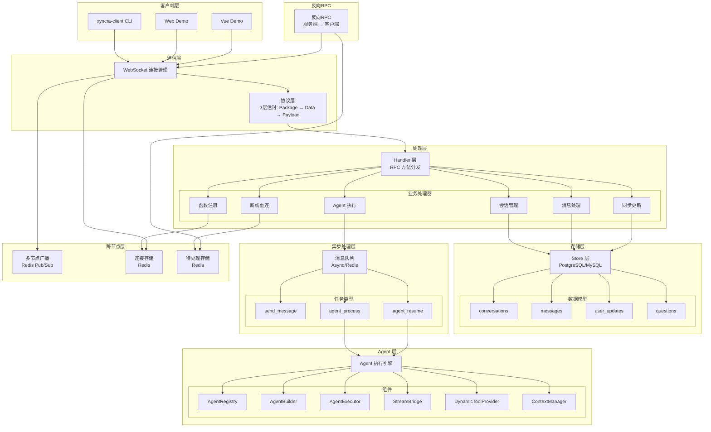
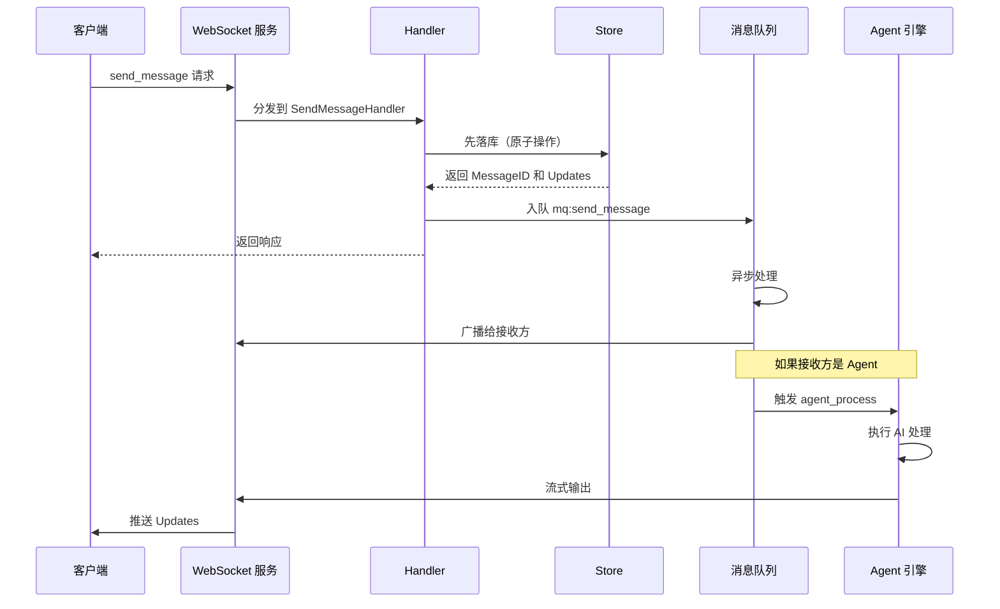
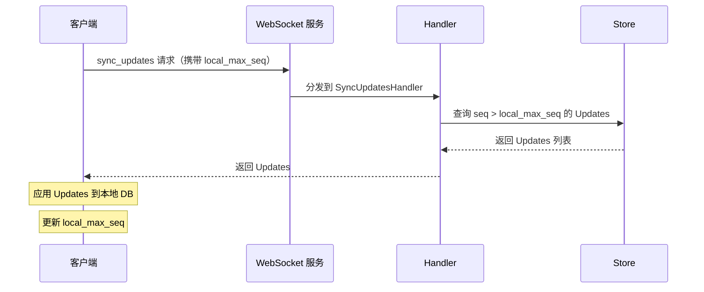
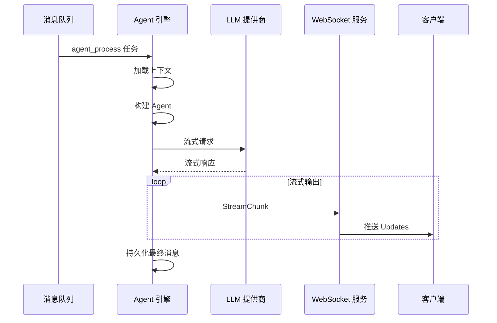

# 业务流程索引

本文档提供 Xyncra Server 各子系统的业务流程概览，帮助开发者快速理解系统架构和数据流。

## 流程快速索引

下表列出系统中所有可区分的业务流程，便于快速定位。

### 客户端 RPC 方法 (WebSocket Request)

 | # | 方法名 | 流程文档 | 说明 |
 | --- | --- | --- | --- |
 | 1 | `heartbeat` | [heartbeat.md](heartbeat.md) | 连接心跳保活，被动续期 TTL |
 | 2 | `send_message` | [message.md](message.md) | 发送消息，原子持久化 + MQ 扇出 + Agent 触发 |
 | 3 | `create_conversation` | [conversation.md](conversation.md) | 创建 1-on-1 会话 (find-or-create 幂等) |
 | 4 | `list_conversations` | [conversation.md](conversation.md) | 分页列出用户会话 |
 | 5 | `get_conversation` | [conversation.md](conversation.md) | 获取单个会话详情 + 未读数 + HITL 问题 |
 | 6 | `get_messages` | [message.md](message.md) | 分页获取会话消息 (游标分页) |
 | 7 | `search_messages` | [message.md](message.md) | 会话内全文搜索 (LIKE) |
 | 8 | `delete_conversation` | [conversation.md](conversation.md) | 级联软删除会话及消息 |
 | 9 | `restore_conversation` | [conversation.md](conversation.md) | 级联恢复已删除会话及消息 |
 | 10 | `delete_message` | [message.md](message.md) | 发送者删除单条消息 (软删除) |
 | 11 | `mark_as_read` | [message.md](message.md) | 更新读指针 (MAX 语义) |
 | 12 | `sync_updates` | [sync-updates.md](sync-updates.md) | 增量拉取用户更新 (Gap-filling) |
 | 13 | `set_typing` | [set-typing.md](set-typing.md) | 输入指示器广播 (Seq=0, 1/s 限流) |
 | 14 | `stream_text` | [stream-text.md](stream-text.md) | 流式文本广播 (Seq=0, 20/s 限流) |
 | 15 | `agent_resume` | [agent.md](agent.md#11-agent-resume-流程) | HITL 恢复：持久化答案，全部回答后入队 resume |
 | 16 | `reload_agents` | [reload-agents.md](reload-agents.md) | Agent 配置热重载 |
 | 17 | `system.register_functions` | [function-registry.md](function-registry.md) | 注册客户端函数能力 (全量替换) |
 | 18 | `system.reconnect` | [reconnection.md](reconnection.md) | 断线重连握手 + 请求重放 |

### MQ 异步任务

 | # | 任务类型 | 流程文档 | 说明 |
 | --- | --- | --- | --- |
 | 1 | `mq:send_message` | [mq-async.md](mq-async.md) | 广播实时 Updates 给接收方在线设备 |
 | 2 | `mq:agent_process` | [agent.md](agent.md#1-agent-完整执行流程) | Agent AI 处理：LLM 调用 + 流式输出 + 持久化 |
 | 3 | `mq:agent_resume` | [agent.md](agent.md#11-agent-resume-流程) | HITL 恢复后继续 Agent 执行 |

### 后台任务

 | # | 任务 | 流程文档 | 间隔 |
 | --- | --- | --- | --- |
 | 1 | UserUpdate 过期清理 | [background-cleanup.md](background-cleanup.md) | 1 小时 |
 | 2 | HITL 超时清理 | [background-cleanup.md](background-cleanup.md) | 5 分钟 |
 | 3 | 上下文缓存清理 | [background-cleanup.md](background-cleanup.md) | 5 分钟 |
 | 4 | 工具结果清理 | [background-cleanup.md](background-cleanup.md) | 5 分钟 |
 | 5 | Rate Limiter 清理 | [background-cleanup.md](background-cleanup.md) | 5 分钟 |

### 基础设施流程

 | # | 流程 | 流程文档 | 说明 |
 | --- | --- | --- | --- |
 | 1 | WebSocket 连接生命周期 | [websocket-connection.md](websocket-connection.md) | 升级、认证、设备替换、断开、优雅关闭 |
 | 2 | 跨节点广播 | [broadcasting.md](broadcasting.md) | Redis Pub/Sub 多节点消息路由 |
 | 3 | 反向 RPC | [reverse-rpc.md](reverse-rpc.md) | 服务端发起请求 + 超时持久化 + 重放 |
 | 4 | 存储层事务 | [storage.md](storage.md) | SendMessage 原子事务、seq 分配 |
 | 5 | CLI 与 IPC | [cli-ipc.md](cli-ipc.md) | 命令行客户端 + Unix Socket IPC |
 | 6 | CLI 可观测性 | [cli-observability.md](cli-observability.md) | LLM 日志、Prometheus 指标、OpenTelemetry |
 | 7 | 协议层 | [websocket.md](websocket.md) | 3 层信封: Package → Data → Payload |

## 整体架构图

## 子系统列表

### 0. 新增独立流程文档

以下流程已从各子系统文档中提取为独立文档，便于单独查阅：

| 流程 | 文件 | 说明 |
| --- | --- | --- |
| [Set Typing](set-typing.md) | `set-typing.md` | 输入指示器广播（Seq=0, Rate-limited） |
| [Stream Text](stream-text.md) | `stream-text.md` | 流式文本广播（Seq=0, Rate-limited） |
| [Heartbeat](heartbeat.md) | `heartbeat.md` | 连接心跳保活（被动续期） |
| [Sync Updates](sync-updates.md) | `sync-updates.md` | 增量更新拉取（Gap-filling） |
| [Reload Agents](reload-agents.md) | `reload-agents.md` | Agent 配置热重载 |
| [Background Cleanup](background-cleanup.md) | `background-cleanup.md` | 后台清理任务（UserUpdate/HITL/缓存） |
| [Client Registration](client-registration.md) | `client-registration.md` | 客户端注册与函数管理（连接注册/函数注册/动态工具注入） |
| [Message Queue](message-queue.md) | `message-queue.md` | 消息队列业务流程（入队/消费/重试/优雅关闭） |
| [Agent Execution](agent-execution.md) | `agent-execution.md` | Agent 执行引擎与 LLM 交互（MQ 消费/LLM 调用/流式输出） |

---

### 1. WebSocket 连接管理 (websocket)

**职责**：管理 WebSocket 连接的生命周期，包括连接建立、心跳保活、连接池管理、设备替换和跨节点路由。

**核心组件**：
- `WebSocketServer`：嵌入 BaseServer，管理 WS 连接池、广播、跨节点路由
- `Client`：单个 WS 连接，readPump/writePump 双协程模型
- `ConnectionStore`：连接元数据管理（Redis 实现），支持三索引：`clients[connID]`、`clientsByUser[userID][connID]`、`clientsByDevice[userID+deviceID][connID]`

**关键流程**：
- 连接建立：HTTP 升级 → 认证 → 注册连接 → 启动读写协程
- 心跳保活：客户端定期发送 heartbeat，服务端被动续期 TTL
- 设备替换：同 (userID, deviceID) 新连接时，旧连接收到 4001 close frame

**关键文件**：
- `internal/server/websocket_server.go`
- `internal/server/websocket_handler.go`
- `internal/server/websocket_client.go`
- `internal/server/connection_store.go`
- `internal/server/redis_connection_store.go`

---

### 2. 会话管理 (conversation)

**职责**：管理会话的创建、查询、删除、恢复等生命周期操作，支持软删除和级联恢复。

**核心功能**：
- 创建会话：find-or-create 幂等设计 (D-011)
- 查询会话：分页列表、单会话详情、未读数、HITL 问题
- 删除会话：级联软删除 (D-013)
- 恢复会话：级联恢复 (D-015)

**数据模型**：
- `Conversation`：包含 UserID1/UserID2 双字段，当前仅支持 1-on-1 私聊
- 支持软删除标记和恢复时间戳

**关键文件**：
- `internal/handler/create_conversation.go`
- `internal/handler/list_conversations.go`
- `internal/handler/get_conversation.go`
- `internal/handler/delete_conversation.go`
- `internal/handler/restore_conversation.go`
- `internal/store/conversation.go`

---

### 3. 消息处理 (message)

**职责**：处理消息的发送、查询、删除、已读标记等操作，实现先落库后处理的架构原则。

**核心流程**：
- 发送消息：先持久化到数据库 → 再入 MQ 异步处理 (D-007)
- 消息查询：分页查询、全文搜索
- 消息删除：仅发送者可删 (D-014)
- 已读标记：MAX 语义更新读指针 (D-012)

**原子操作**（`store.go:SendMessage`）：
1. 事务内读取 conversation 的 LastProcessedMessageID
2. MessageID = LastProcessedMessageID + 1（D-008）
3. 以 MAX(UserUpdate.seq) + 1 为每个成员分配 seq
4. INSERT message + INSERT user_updates (batch)
5. UPDATE conversation last_message_at / last_processed_message_id

**关键文件**：
- `internal/handler/send_message.go`
- `internal/handler/get_messages.go`
- `internal/handler/search_messages.go`
- `internal/handler/delete_message.go`
- `internal/handler/mark_as_read.go`
- `internal/store/message.go`

---

### 4. Agent 执行引擎 (agent)

> 详细流程见 [agent.md](agent.md)（综合文档）和 [agent-execution.md](agent-execution.md)（MQ 消费与 LLM 交互）

**职责**：基于 CloudWeGo Eino 框架的 AI Agent 子系统，支持多种 LLM 提供商、流式输出、工具调用和 HITL 中断。

**核心组件**：
- `AgentRegistry`：从磁盘加载 Agent 配置，支持运行时热更新
- `AgentBuilder`：构建 Eino Graph/Chain
- `AgentExecutor`：执行管道：上下文加载 → 构建 → 流式生成 → 广播 → 持久化
- `StreamBridge`：Agent 流式文本 → WebSocket Updates 桥接（50ms 节流）
- `DynamicToolProvider`：客户端注册的函数作为 Agent Tool
- `ContextManager`：对话上下文管理（DB + 内存缓存 + Token 裁剪）

**支持的 LLM 提供商**：
- OpenAI
- Claude
- Ollama
- Qwen

**内置工具**：
- `get_weather`：模拟天气数据
- `get_current_time`：获取当前时间
- `retrieve_tool_result`：检索工具结果
- `ask_user`：HITL 中断

**关键文件**：
- `internal/agent/eino_agent.go`
- `internal/agent/executor.go`
- `internal/agent/broadcast.go`
- `internal/agent/dynamic_tool_provider.go`
- `internal/agent/db_context_manager.go`
- `internal/agent/config.go`
- `internal/agent/registry.go`

---

### 5. 客户端注册与函数管理 (client-registration)

> 详细流程见 [client-registration.md](client-registration.md)

**职责**：管理客户端的注册和函数能力注册，支持动态工具注入到 Agent。

**核心功能**：
- 客户端连接注册：通过 WebSocket 连接建立时自动注册（见 websocket-connection.md）
- 函数注册：通过 `system.register_functions` RPC 注册客户端函数能力
- 动态工具：注册的函数自动注入为 Agent 工具 (D-101)

**函数注册流程**：
1. 客户端连接后发送 `system.register_functions` 请求
2. 服务端将函数信息存储到 `FunctionRegistry`
3. Agent 执行时通过 `DynamicToolProvider` 动态注入工具
4. 支持按名称过滤工具列表

**关键文件**：
- `internal/handler/register.go`
- `internal/handler/register_functions.go`
- `internal/server/function_registry.go`
- `internal/agent/dynamic_tool_provider.go`
- `internal/agent/client_function_tool.go`

---

### 6. 断线重连与同步 (reconnection)

**职责**：处理客户端断线重连后的状态同步，确保消息不丢失。

**核心流程**：
- 重连握手：客户端发送 `system.reconnect` 请求，携带 `last_seen_seq`
- 请求重放：服务端重放错过的请求（幂等性保证）
- 函数重注册：重连后客户端重新注册函数处理器
- 状态同步：通过 `sync_updates` 增量同步 + gap 填充

**关键机制**：
- `last_seen_seq`：客户端最后看到的序列号
- 幂等性缓存：防止重复处理
- RTT 追踪：自适应 RPC 超时

**关键文件**：
- `internal/handler/reconnect.go`
- `internal/handler/sync_updates.go`
- `pkg/client/sync.go`
- `pkg/client/connection.go`

---

### 7. 反向 RPC (reverse-rpc)

**职责**：支持服务端主动发起请求给客户端，用于 Agent 工具调用等场景。

**核心功能**：
- 服务端请求：`ServerRequest()` 阻塞等待客户端响应
- 超时持久化：超时请求可持久化到 PendingStore (D-103)
- 设备路由：支持按设备 ID 路由请求
- 广播模式：deviceID 为空时广播到所有连接（first response wins）

**请求流程**：
1. 服务端调用 `ServerRequest()` 发起请求
2. 请求通过 WebSocket 发送到客户端
3. 客户端处理后返回响应
4. 超时或断线时请求可持久化

**关键文件**：
- `internal/server/reverse_rpc.go`
- `internal/server/pending_store.go`
- `internal/server/redis_pending_store.go`

---

### 8. 消息队列 (message-queue)

> 详细流程见 [message-queue.md](message-queue.md)

**职责**：基于 Asynq（Redis）的异步任务队列，处理消息广播、Agent 执行等异步任务。

**任务类型**：
| 任务类型 | 说明 |
|---------|------|
| `mq:send_message` | 广播实时消息给接收方 |
| `mq:agent_process` | Agent AI 处理 |
| `mq:agent_resume` | HITL 恢复后继续 Agent |
| `mq:sync_updates` | 更新 fan-out（预留） |
| `mq:push_notification` | 推送通知（预留） |
| `mq:presence_broadcast` | 在线状态广播（预留） |
| `mq:conversation_sync` | 会话同步（预留） |

**队列优先级**：
- `critical`：最高优先级，用于时间敏感任务
- `default`：标准优先级
- `low`：最低优先级，用于后台任务

**关键文件**：
- `internal/mq/mq.go`
- `internal/mq/asynq.go`
- `internal/mq/handler.go`
- `internal/mq/options.go`

---

### 9. 多节点广播 (broadcasting)

**职责**：处理跨节点的消息路由，支持单节点和多节点部署模式。

**核心组件**：
- `NodeBroadcaster`：接口抽象跨节点推送
- `NoopBroadcaster`：单节点部署默认实现（无开销）
- `RedisNodeBroadcaster`：多节点部署，使用 Redis Pub/Sub

**广播流程**：
1. 本地推送：直接发送到本节点的连接
2. 跨节点发布：通过 Redis Pub/Sub 发布到其他节点
3. 源节点 ID 防重复：`sourceNodeID == s.nodeID` 时跳过

**关键文件**：
- `internal/server/node_broadcaster.go`
- `internal/server/redis_node_broadcaster.go`
- `internal/agent/broadcast.go`

---

### 10. CLI 与 IPC 通信 (cli-ipc)

**职责**：提供命令行客户端和进程间通信功能，支持本地客户端操作和跨进程通信。

**CLI 命令**：
- `listen`：监听消息和事件
- `send`：发送消息
- `create-conversation`：创建会话
- `list-conversations`：列出会话
- `get-messages`：获取消息
- `search-messages`：搜索消息
- `agent-resume`：恢复 Agent
- `reload-agents`：重载 Agent 配置

**IPC 机制**：
- Unix Socket 通信
- 请求/响应模式
- 事件订阅

**关键文件**：
- `internal/cli/app.go`
- `internal/cli/ipc.go`
- `internal/cli/listen.go`
- `internal/cli/send.go`
- `internal/cli/conversations.go`
- `internal/cli/messages.go`

---

### 11. 存储层 (storage)

**职责**：基于 GORM 的数据持久化层，支持 PostgreSQL 和 MySQL。

**核心模块**：
- `ConversationStore`：会话 CRUD、软删除/恢复、读指针更新
- `MessageStore`：消息 CRUD、client_message_id 幂等性
- `UserUpdateStore`：用户级 Update 序列（fan-out 存储）
- `QuestionStore`：HITL 问题持久化

**数据模型**：
- `Conversation`：会话信息，支持软删除
- `Message`：消息内容，包含发送者、内容、时间戳
- `UserUpdate`：用户级更新序列，用于增量同步
- `Question`：HITL 问题，支持状态管理

**关键文件**：
- `internal/store/store.go`
- `internal/store/conversation.go`
- `internal/store/message.go`
- `internal/store/user_update.go`
- `internal/store/question.go`
- `internal/store/model/`

---

## 核心数据流

### 消息发送流程

### 同步更新流程

### Agent 执行流程

---

## 设计原则

1. **先落库后处理**：消息先持久化再到 MQ，MQ 失败不影响数据安全 (D-007)
2. **离线优先**：客户端本地 SQLite 优先读取，按需从服务器拉取 (D-035, D-126)
3. **Fire-and-Forget**：MQ 入队失败不阻塞请求，数据通过 sync_updates 最终送达 (D-007)
4. **Ephemeral 与 Persistent 分离**：Seq=0 表示瞬时消息，不持久化、不拉取 (D-050)
5. **Pull-on-Notification**：推送为轻量通知，客户端拉取最新状态 (D-118)
6. **nil-safe 可选模块**：Agent、FunctionRegistry 为可选注入，nil 即禁用
7. **接口隔离**：Server / Store / MQ / Agent 通过接口依赖，可独立替换和测试

---

## 相关文档

- [系统架构概览](../architecture/system-architecture.md)
- [协议设计](../architecture/protocol-design.md)
- [数据流](../architecture/data-flow.md)
- [组件关系](../architecture/component-relationships.md)
- [架构决策记录](../architecture/design-decisions.md)
